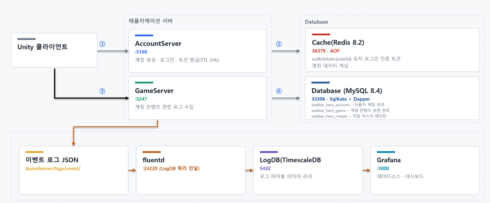

# com2us-taskbar-hero

2026 컴투스 지니어스 - 방치형 게임 **Taskbar Hero** 모작 프로젝트


---

## 서버 실행 방법

로컬 실행 방법은 두 가지다. 
* **도커로 전부 띄우는 방식(`server_up_with_docker.py`)** 
* **로컬에서 MySQL·Redis를 별도로 띄우고 서버 2개만 실행하는 방식**(`server_up.py`)

### 방법 1 — 도커로 전부 띄우기 (`server_up_with_docker.py`)

**필요한 것**: Docker Desktop · .NET SDK 10 · Python 3.7+ (클라이언트 개발 시 Unity `6000.5.3f1`)

저장소 루트에서 **`server_up_with_docker.py` 스크립트를 실행하면** docker-compose 기반으로 로컬 실행에 필요한 컨테이너들이 세팅되어 실행된다.

```powershell
python server_up_with_docker.py
```

아래의 작업들이 순자적으로 진행되며, 별도로 세팅은 필요없다.

* 스크립트가 사전 점검(도커 접속·포트 충돌) 
* 서버 이미지 재빌드 → `docker compose up -d`(mysql · redis · accountserver · gameserver)
* 컨테이너 healthy 대기
* MySQL 스키마 확인 
* 보스러시 랭킹 캐시 적재까지 순서대로 처리한다.


### 방법 2 — 컨테이너 없이 서버만 띄우기 (`server_up.py`)

**필요한 것**: .NET SDK 10 · Python 3.7+ · **이미 실행 중인 MySQL·Redis**

**MySQL·Redis가 이 PC에서 설치되어 실행 중일 때** 쓴다. 컨테이너는 만들지 않고 **AccountServer·GameServer·BatchServer 세 개**를 `dotnet watch run`으로 각각 **새 콘솔 창**에 띄운다.

```powershell
python server_up.py
```

실행하면 MySQL 주소·포트·계정·비밀번호와 Redis 주소를 차례로 묻는다.
<br/>(엔터 = 기본값 `localhost:3306` · `127.0.0.1:6379`, **비밀번호만 기본값이 없다**) 
<br/>마지막으로 **MySQL 테이블을 새로 세팅할지**(기본 y) 묻는다. 최초 한번은 y로 응답하여 테이블을 세팅하여야한다.

* 다만 적용되는 SQL(`docs/공통/db-schema.sql` → `docs/세부/master-data/master-data-schema.sql`)이 `DROP TABLE` 후 재생성하므로 **기존 세이브 데이터가 지워진다** 
    * 개발 편의상 DB 버전 관리를 생략하기 위해 수정사항이 있을 경우 기존 데이터를 마이그레이션 하지 않고, 테이블을 밀어버린 후 재생성 하니 주의할 것.
    * 마스터 데이터의 경우 테이블을 밀어도 `master-data-schema.sql` 쿼리문을 실행하여 다시 세팅된다.

<br/> 이후 아래의 작업들이 순차적으로 진행되며, **서버 실행전에 Mysql과 redis는 이미 실행 중 이어야 한다.**
* 사전 점검(dotnet SDK · MySQL·Redis 응답 · 포트 5160/5247 선점)
* 스키마 적용·확인 
* 세 서버(GameServer, AccountServer, BatchServer) watch 기동
* 보스러시 랭킹 캐시 적재 순으로 진행한다.

접속 정보의 정본은 각 서버의 `appsettings.json`이며, 스크립트는 **호스트·포트(그리고 준 경우 계정·비밀번호)만 갈아 끼워 환경 변수로 덮어쓴다** — 설정 파일은 고치지 않는다.


**접속 주소(로컬 기준)**

| 대상 | 주소 |
|---|---|
| GameServer | `http://localhost:5247/swagger` |
| AccountServer | `http://localhost:5160/swagger` |
| MySQL | `127.0.0.1:33306` (도커) · `localhost:3306` (로컬 설치본 기본값) |
| Redis | `127.0.0.1:36379` (도커) · `127.0.0.1:6379` (로컬 설치본 기본값) |

더 자세한 옵션과 개발 흐름은 [개발시-참고문서.md](개발시-참고문서.md)를 참고한다.

---

## 게임 소개


**Com2us Taskbar Hero**는 작업표시줄 위에 얇게 상주하는 **방치형(idle) RPG**다. 최대 3인 파티가 스스로 전진하며 적을 자동으로 공격하고, 스킬도 재사용 대기시간이 차는 대로 알아서 나간다. 

스팀 방치형 게임인 TaskBar Hero(TBH)를 원작으로 하고 있으며, 그래픽 리소스와 관련된 대부분 AI를 활용한 리소스들을 이용하였다.

<br/>
<br/>


*작업표시줄 위에 도킹된 플레이 화면 — 가운데 좁은 띠에서 자동 전투가 진행된다.*

---

## 구성

- **AccountServer** — 계정/인증 서비스 (`http://localhost:5160`)
- **GameServer** — 게임 로직 서비스 (`http://localhost:5247`)
- **BatchServer** — 주기 배치 전담 워커(HTTP 없음). 게임 API를 여러 대로 늘려도 배치는 이 프로세스 1대만 돈다
- **TaskbarHero.Common** — 서버-클라 공유 라이브러리

전체 개발 로드맵은 [docs/서버-개발-계획.md](docs/서버-개발-계획.md)를 정본으로 한다. 아래 현황판은 서버/클라 작업 진척을 추적하기 위한 체크리스트다.

---

## 아키텍처



*서버 2개(계정, 게임) · Mysql · Redis(캐싱 + 토큰 관리)*

Unity 클라이언트는 **AccountServer**(`:5160`)에서 로그인해 인증 토큰을 받고(①), 이후 게임 요청은 **GameServer**(`:5247`)로 보낸다(③).

---

## 개발 현황

> **트랙 구분** — 서버(ASP.NET Core)와 Unity 클라이언트는 **병행 개발**한다. 각 기능은 API 계약(요청/응답 스키마·공유 DTO·`ErrorCode`)을 먼저 확정하고, 클라는 목(mock)으로 선행 개발한 뒤 서버 구현 완료 시 **실연동**으로 교체한다.
>
> **체크 항목** — `서버`: 서버 구현 완료 · `클라`: 클라 실연동 완료

| 기능 | 서버 | 서버 구현 | 클라 실연동 |
|---|---|:---:|:---:|
| 1 계정 / 인증 | Account | ☑ | ☑ |
| 2 마스터 데이터 로더/제공 | Game | ☑ | ☑ |
| 3 세이브 데이터 저장·로드 | Game | ☑ | ☑ |
| 3b 파티 편성 저장(스냅샷) | Game | ☑ | ☑ |
| 프로토타입 전투(데모용) | Game | ✕ | ☑ |
| 6 인벤토리 / 아이템 / 큐브 | Game | ☑ | ☑ |
| 7 성장(직업·스킬·룬) | Game | ☑ | ☑ |
| 4 스테이지 / 전투 결과 | Game | ☑ | ☑ |
| 5 방치형(오프라인) 보상 정산 | Game | ☑ | ☑ |
| 8 메일(보상) 수신 | Game | ☑ | ☑ |
| 9 출석부 보상 | Game | ☑ | ☑ |
| 10 거래소 / 교역선 | Game | ☑ | ☑ |

> ☐ 미착수 · ◐ 진행 중 · ☑ 완료 · ✕ 해당 없음(작업 불필요) — 진행 시 해당 칸 기호를 바꿔 표시한다.

### 미편성 백로그

> 아래 항목들은 **아직 위 계획에 편성되지 않은** 후보 작업이다. 위 계획의 확정(fix)된 작업들을 예정보다 **일찍 끝내는 경우**, 아래 항목을 계획에 추가해 진행할 예정이다.

| 기능 | 서버 | 서버 구현 | 클라 실연동 |
|---|---|:---:|:---:|
| 인벤토리 조회 페이징 처리 | Game | ☑ | ☑ |
| 캐릭터 성별(남/여) 선택(`player_character.gender` · 생성 시 확정 · 외형 전용) | Game | ☑ | ☑ |
| 가챠(뽑기) 시스템 구현 ([기획서](docs/세부/gacha-기획서.md)) | Game | ☑ | ☑ |
| 장비 강화 시스템(`inventory/enhance` · `enhance_master` +10 · 확정 상승) | Game | ☑ | ☑ |
| 소모품 사용·활성 버프 조회(경험치·골드 부스터 · [기획서](docs/세부/consumable-buff-기획서.md)) | Game | ☑ | ☑ |
| 캐릭터 생성 시 직업 기본 무기 지급·장착(`item_master` 최저 등급 무기 · 생성 트랜잭션 동시 적재 · 클라는 기존 `load`의 `equipped[]` 경로 그대로 사용) | Game | ☑ | ☑ |

