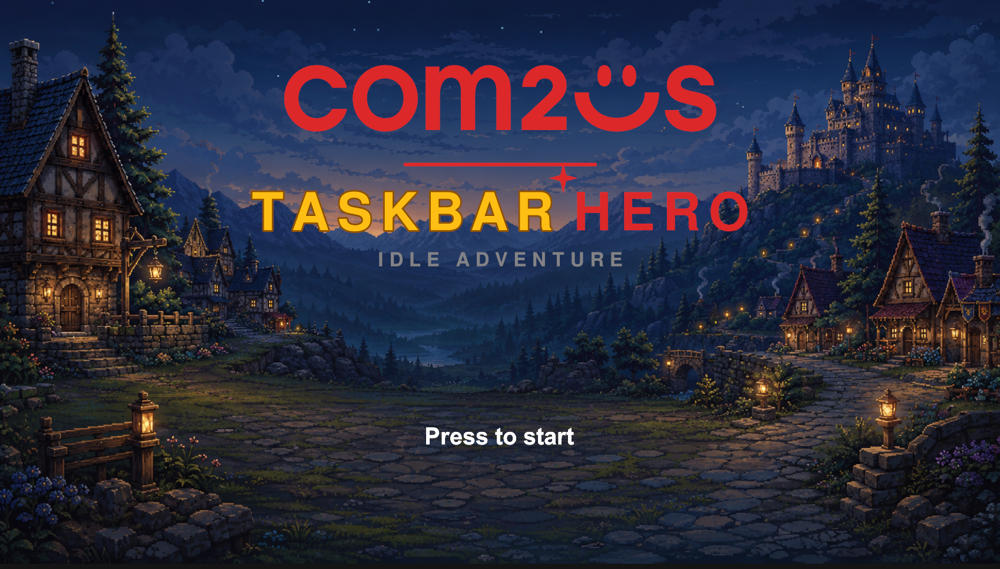
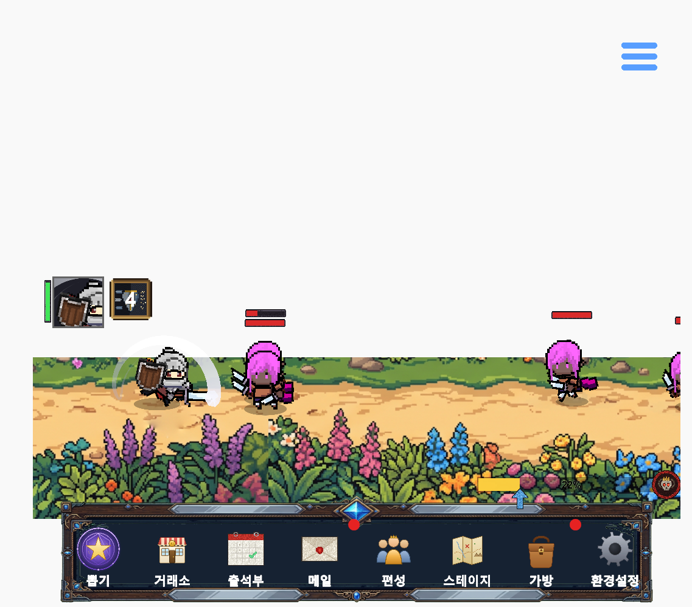

# com2us-taskbar-hero

2026 컴투스 지니어스 - 방치형 게임 **Taskbar Hero** 모작 프로젝트

---

## 게임 소개

**Taskbar Hero**는 작업표시줄 위에 얇게 상주하는 **방치형(idle) RPG**다. 최대 3인 파티가 스스로 전진하며 적을 자동으로 공격하고, 스킬도 재사용 대기시간이 차는 대로 알아서 나간다. 플레이어는 다른 일을 하면서 화면 한 켠의 전투를 지켜보다가 **무엇을 입히고, 무엇을 키우고, 누구를 넣을지**만 결정하면 된다.

- **직업 4종** — 기사 · 레인저 · 마법사 · 슬레이어. 사거리와 역할이 달라 파티가 앞뒤로 자동 정렬된다.
- **5개 지역 × 10 스테이지 × 난이도 2단계** — 총 100 스테이지이며 각 지역 10 스테이지는 보스전이다.
- **성장 요소** — 장비/강화, 스킬 레벨업(액티브·패시브), 계정 공용 룬 트리, 큐브(합성·연금술·제작·강화), 뽑기, 거래소.
- **오프라인 진행** — 접속을 끊은 동안의 성과가 재접속 시 정산되어 지급된다.

*작업표시줄 위에 도킹된 플레이 화면 — 가운데 좁은 띠에서 자동 전투가 진행되고, 하단 메뉴는 접었다 펼칠 수 있다.*

조작 방법과 화면별 상세 설명은 **[게임 플레이 가이드](com2us-taskbar-hero-client/docs/게임-플레이-가이드.md)** 를 참고한다.

---

## 구성

- **AccountServer** — 계정/인증 서비스 (`http://localhost:5160`)
- **GameServer** — 게임 로직 서비스 (`http://localhost:5247`)
- **TaskbarHero.Common** — 서버-클라 공유 라이브러리

전체 개발 로드맵은 [docs/서버-개발-계획.md](docs/서버-개발-계획.md)를 정본으로 한다. 아래 현황판은 서버/클라 작업 진척을 추적하기 위한 체크리스트다.

---

## 개발 현황

> **트랙 구분** — 서버(ASP.NET Core)와 Unity 클라이언트는 **병행 개발**한다. 각 기능은 API 계약(요청/응답 스키마·공유 DTO·`ErrorCode`)을 먼저 확정하고, 클라는 목(mock)으로 선행 개발한 뒤 서버 구현 완료 시 **실연동**으로 교체한다.
>
> **체크 항목** — `서버`: 서버 구현 완료 · `클라`: 클라 실연동 완료

| 기능 | 서버 | 서버 구현 | 클라 실연동 |
|---|---|:---:|:---:|
| 1 계정 / 인증 | Account | ☑ | ☑ |
| 2 마스터 데이터 로더/제공 | Game | ☑ | ☑ |
| 3 세이브 데이터 저장·로드 | Game | ☑ | ☑ |
| 3b 파티 편성 저장(스냅샷) | Game | ☑ | ☑ |
| 프로토타입 전투(데모용) | Game | ✕ | ☑ |
| 6 인벤토리 / 아이템 / 큐브 | Game | ☑ | ☑ |
| 7 성장(직업·스킬·룬) | Game | ☑ | ☑ |
| 4 스테이지 / 전투 결과 | Game | ☑ | ☑ |
| 5 방치형(오프라인) 보상 정산 | Game | ☑ | ☑ |
| 8 메일(보상) 수신 | Game | ☑ | ☑ |
| 9 출석부 보상 | Game | ☑ | ☑ |
| 10 거래소 / 교역선 | Game | ☑ | ☑ |

> ☐ 미착수 · ◐ 진행 중 · ☑ 완료 · ✕ 해당 없음(작업 불필요) — 진행 시 해당 칸 기호를 바꿔 표시한다.

### 미편성 백로그

> 아래 항목들은 **아직 위 계획에 편성되지 않은** 후보 작업이다. 위 계획의 확정(fix)된 작업들을 예정보다 **일찍 끝내는 경우**, 아래 항목을 계획에 추가해 진행할 예정이다.

| 기능 | 서버 | 서버 구현 | 클라 실연동 |
|---|---|:---:|:---:|
| 인벤토리 조회 페이징 처리 | Game | ☑ | ☑ |
| 캐릭터 성별(남/여) 선택(`player_character.gender` · 생성 시 확정 · 외형 전용) | Game | ☑ | ☑ |
| 가챠(뽑기) 시스템 구현 ([기획서](docs/세부/gacha-기획서.md)) | Game | ☑ | ☑ |
| 장비 강화 시스템(`inventory/enhance` · `enhance_master` +10 · 확정 상승) | Game | ☑ | ☑ |
| 소모품 사용·활성 버프 조회(경험치·골드 부스터 · [기획서](docs/세부/consumable-buff-기획서.md)) | Game | ☑ | ☑ |
| 캐릭터 생성 시 직업 기본 무기 지급·장착(`item_master` 최저 등급 무기 · 생성 트랜잭션 동시 적재 · 클라는 기존 `load`의 `equipped[]` 경로 그대로 사용) | Game | ☑ | ☑ |

