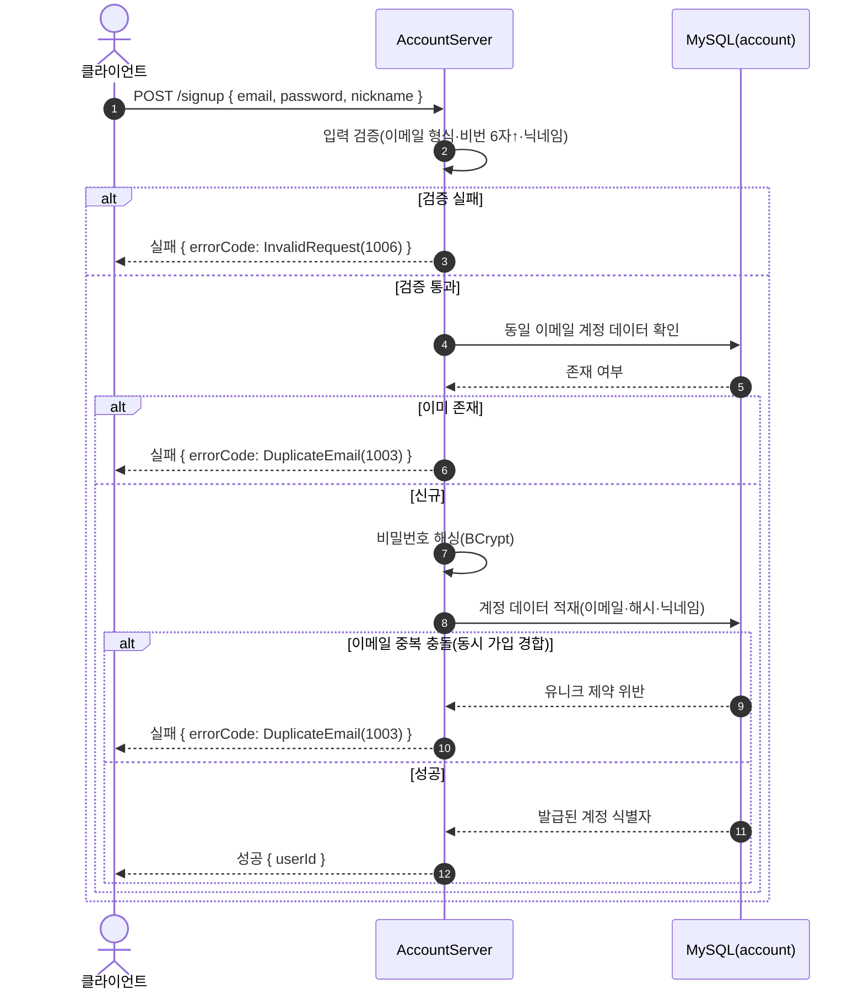
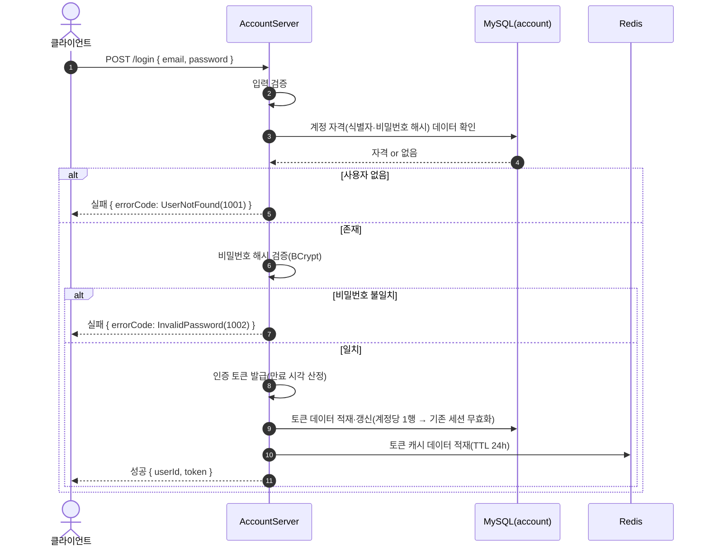
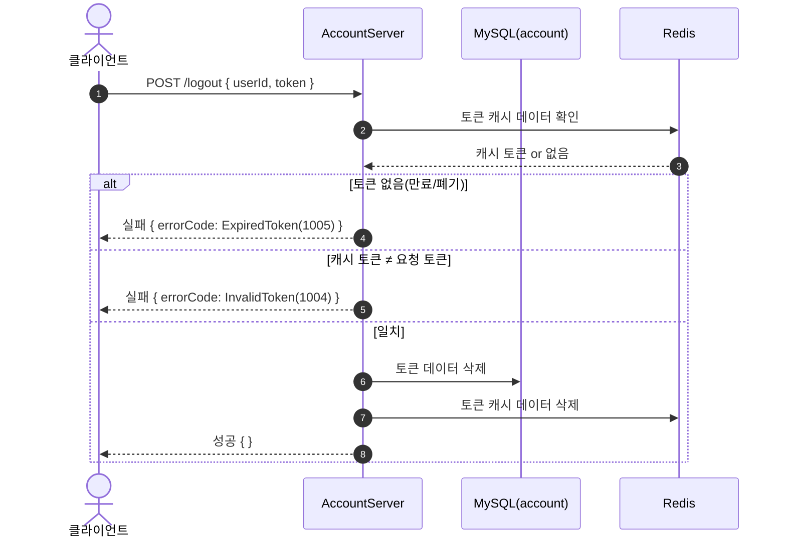

# AuthController (`/api/auth`, AccountServer)

계정/인증. `signup`·`login`은 **무인증**, `logout`은 서버가 토큰을 대조한다. 저장소: MySQL `taskbar_hero_account`(`users`·`user_auth_token`) + Redis(`auth:token:{userId}`).

## POST /api/auth/signup — 회원가입

## POST /api/auth/login — 로그인(토큰 발급)

## POST /api/auth/logout — 로그아웃(토큰 무효화)

