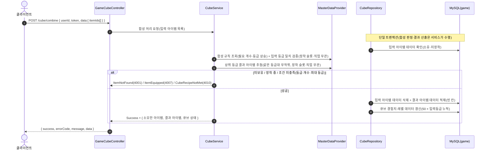
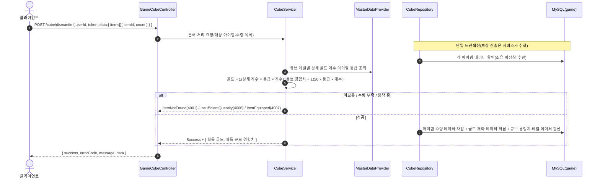
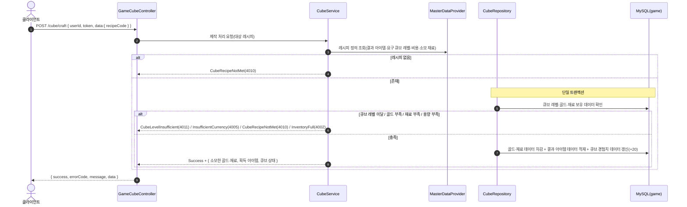

# GameCubeController (`/api/game/cube`, GameServer)

큐브 — 합성·분해·제작(서버 권위 결과 산출). 저장소: MySQL `taskbar_hero_game`(`player_item`·`player_cube`) + `MasterDataProvider`(cube_master·item·recipe). 연산마다 큐브 경험치가 쌓여 레벨업한다.

> **인증**: `/api/game/*` 요청은 컨트롤러 진입 전에 `GameAuthMiddleware`가 토큰을 검증한다(실패 시 401). 주요 로직이 아니므로 아래 다이어그램에서는 생략하고, 인증된 `userId`가 컨트롤러에 전달된 이후를 표기한다.

## POST /api/game/cube/combine — 합성(동급 3개 → 상위 등급 1개)

## POST /api/game/cube/dismantle — 분해(아이템 → 골드)

## POST /api/game/cube/craft — 제작(레시피)

