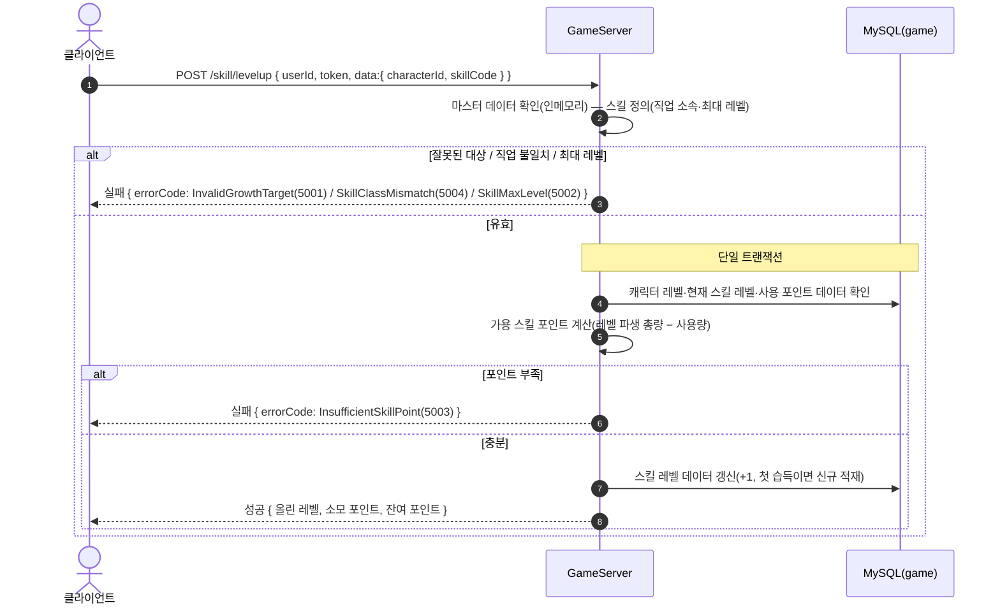
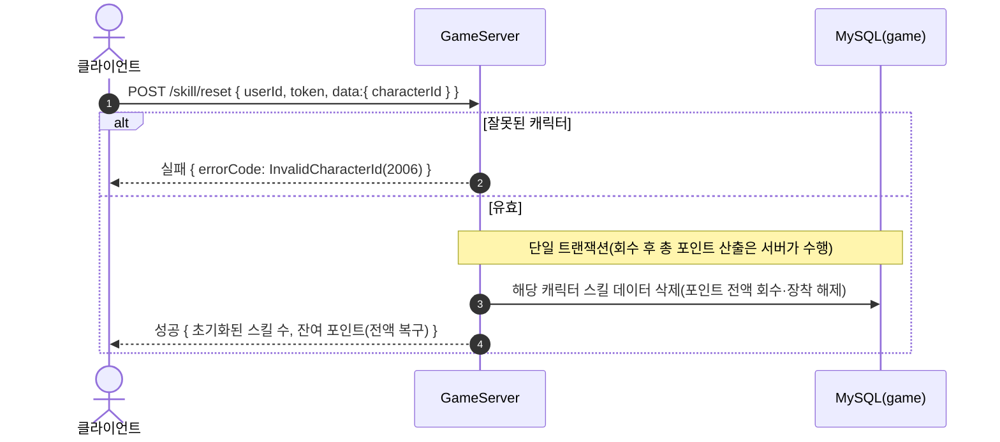
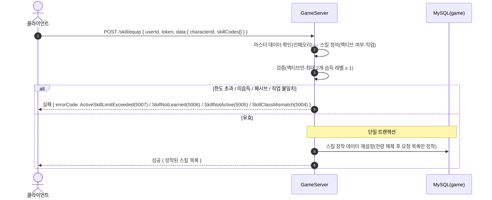
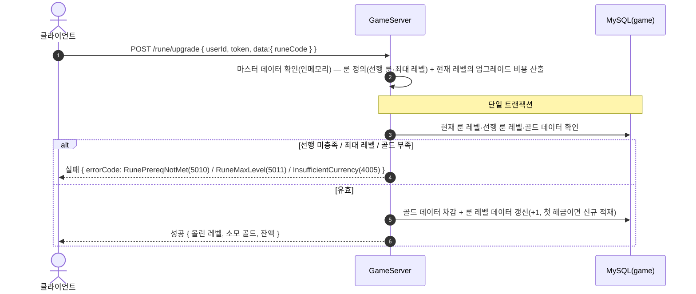

# GameGrowthController (`/api/game/growth`, GameServer)

성장 — 스킬 레벨업·초기화·액티브 장착·룬 업그레이드. 저장소: MySQL `taskbar_hero_game`(`player_skill`·`player_rune`·`player_character`·`player_item`) + 인메모리 마스터 데이터(skill·rune·level·rune_cost).

> **인증**: `/api/game/*` 요청은 `GameAuthMiddleware`가 토큰을 검증한다(실패 시 401). 주요 로직이 아니므로 아래 다이어그램에서는 생략하고, 인증된 `userId`로 처리가 시작된 이후를 표기한다.
>
> 스킬 포인트는 저장값이 아니라 레벨별 스킬 포인트 정의에서 파생(레벨 기준 총량 − 사용량)한다.

## POST /api/game/growth/skill/levelup — 스킬 레벨업

## POST /api/game/growth/skill/reset — 스킬 초기화

## POST /api/game/growth/skill/equip — 액티브 스킬 장착(0~2개)

## POST /api/game/growth/rune/upgrade — 룬 업그레이드(골드 소모)

