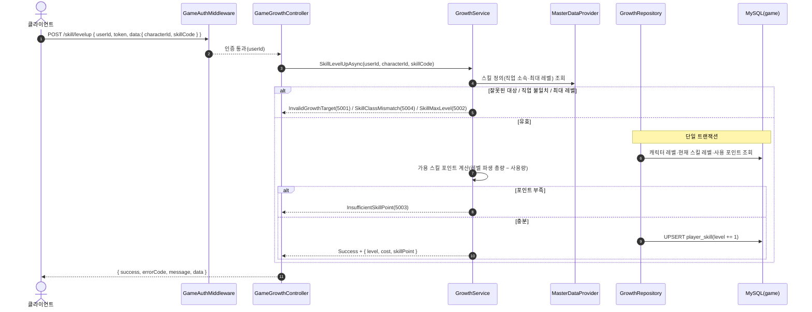
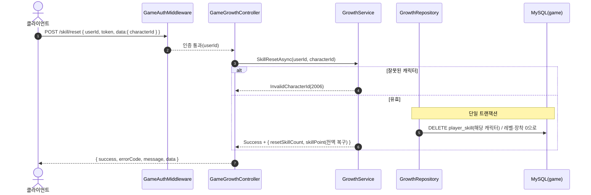
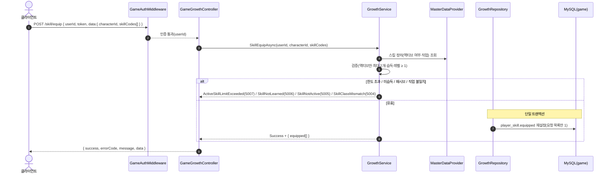
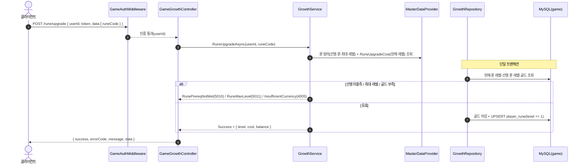

# GameGrowthController (`/api/game/growth`, GameServer)

성장 — 스킬 레벨업·초기화·액티브 장착·룬 업그레이드. 모든 요청은 `GameAuthMiddleware` 인증을 거친다. 저장소: MySQL `taskbar_hero_game`(`player_skill`·`player_rune`·`player_character`·`player_item`) + `MasterDataProvider`(skill·rune·level·rune_cost).

> **공통 인증**: 첫 단계는 `GameAuthMiddleware`의 Redis 토큰 대조(실패 시 401). 아래는 인증 통과 이후를 표기한다. 스킬 포인트는 저장값이 아니라 `level_master.skill_points`에서 파생(레벨 기준 총량 − 사용량)한다.

## POST /api/game/growth/skill/levelup — 스킬 레벨업

## POST /api/game/growth/skill/reset — 스킬 초기화

## POST /api/game/growth/skill/equip — 액티브 스킬 장착(0~2개)

## POST /api/game/growth/rune/upgrade — 룬 업그레이드(골드 소모)

