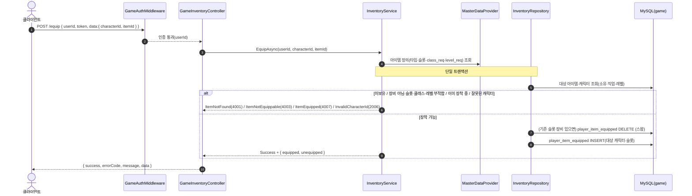
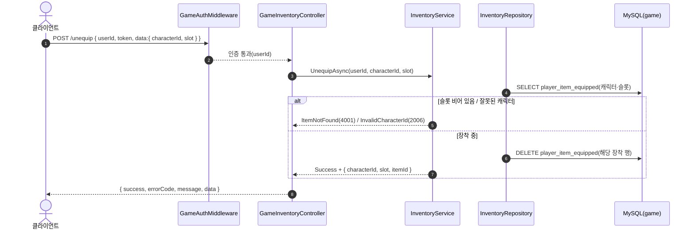
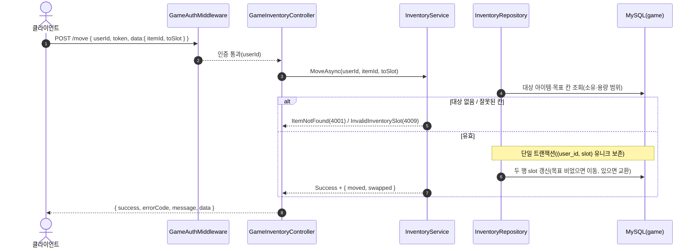
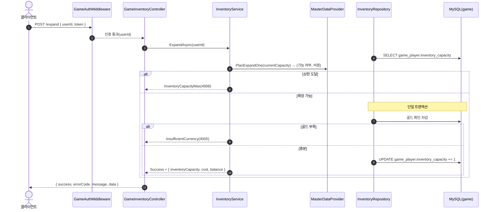

# GameInventoryController (`/api/game/inventory`, GameServer)

장비 장착·해제·배치 이동·용량 확장. 모든 요청은 `GameAuthMiddleware` 인증을 거친다. 저장소: MySQL `taskbar_hero_game`(`player_item`·`player_item_equipped`·`game_player`) + `MasterDataProvider`(item·확장 비용).

> **공통 인증**: 첫 단계는 `GameAuthMiddleware`의 Redis 토큰 대조(실패 시 401). 아래는 인증 통과 이후를 표기한다.

## POST /api/game/inventory/equip — 장착(스왑)

## POST /api/game/inventory/unequip — 장착 해제

## POST /api/game/inventory/move — 배치 이동/교환

## POST /api/game/inventory/expand — 용량 1칸 확장(골드 소모)

