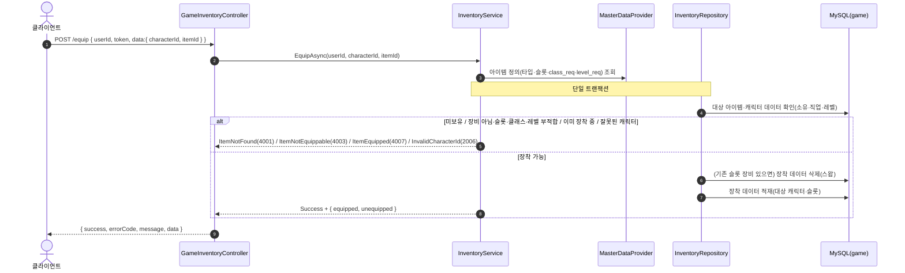
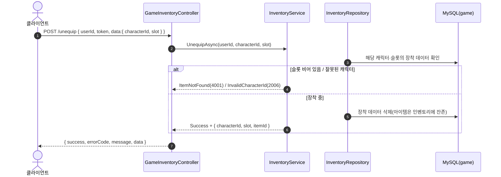
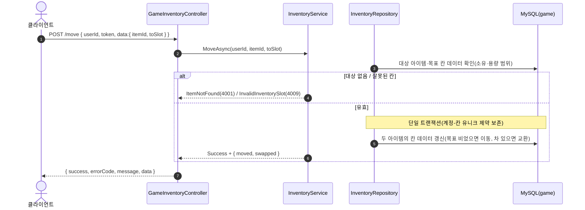
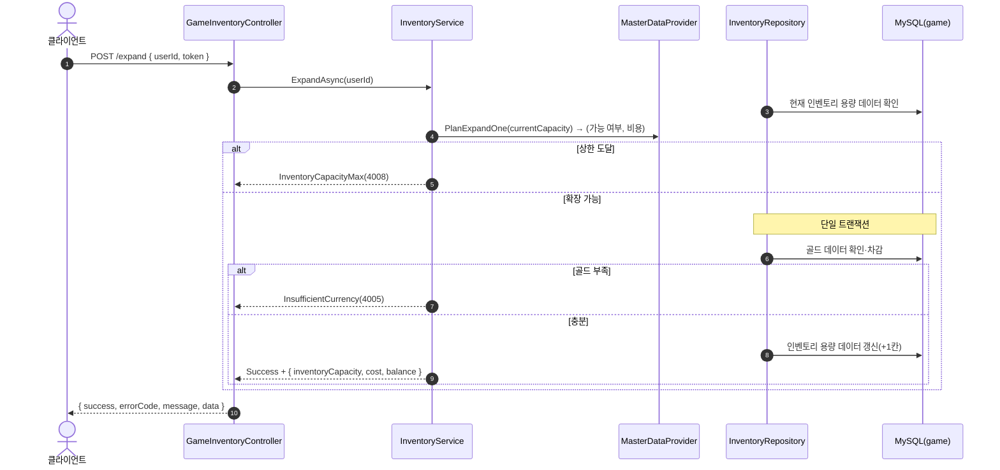

# GameInventoryController (`/api/game/inventory`, GameServer)

장비 장착·해제·배치 이동·용량 확장. 저장소: MySQL `taskbar_hero_game`(`player_item`·`player_item_equipped`·`game_player`) + `MasterDataProvider`(item·확장 비용).

> **인증**: `/api/game/*` 요청은 컨트롤러 진입 전에 `GameAuthMiddleware`가 토큰을 검증한다(실패 시 401). 주요 로직이 아니므로 아래 다이어그램에서는 생략하고, 인증된 `userId`가 컨트롤러에 전달된 이후를 표기한다.

## POST /api/game/inventory/equip — 장착(스왑)

## POST /api/game/inventory/unequip — 장착 해제

## POST /api/game/inventory/move — 배치 이동/교환

## POST /api/game/inventory/expand — 용량 1칸 확장(골드 소모)

