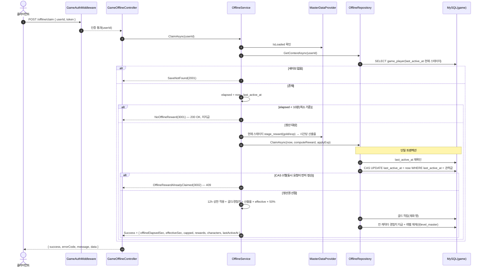

# GameOfflineController (`/api/game/offline`, GameServer)

방치형 오프라인 보상 정산. 요청은 `GameAuthMiddleware` 인증을 거친다. 저장소: MySQL `taskbar_hero_game`(`game_player`·`player_character`·`player_item`) + `MasterDataProvider`(stage_reward·level). 중복 정산은 트랜잭션 + `last_active_at` CAS로 방지한다.

> **공통 인증**: 첫 단계는 `GameAuthMiddleware`의 Redis 토큰 대조(실패 시 401). 아래는 인증 통과 이후를 표기한다.

## POST /api/game/offline/claim — 오프라인 보상 정산

