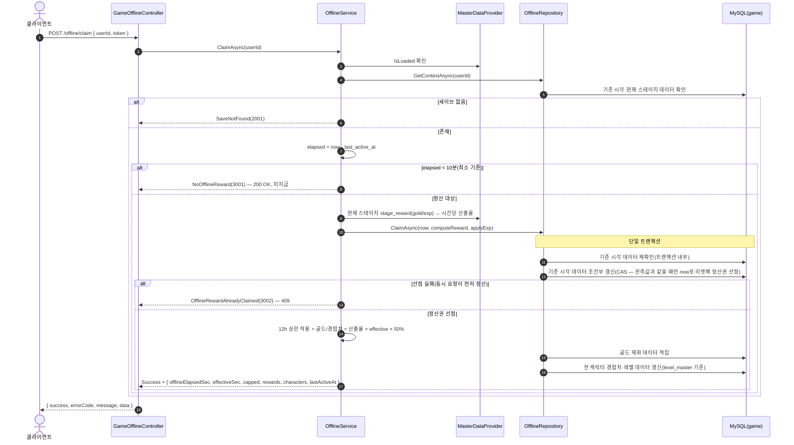

# GameOfflineController (`/api/game/offline`, GameServer)

방치형 오프라인 보상 정산. 저장소: MySQL `taskbar_hero_game`(`game_player`·`player_character`·`player_item`) + `MasterDataProvider`(stage_reward·level). 중복 정산은 트랜잭션 + `last_active_at` CAS로 방지한다.

> **인증**: `/api/game/*` 요청은 컨트롤러 진입 전에 `GameAuthMiddleware`가 토큰을 검증한다(실패 시 401). 주요 로직이 아니므로 아래 다이어그램에서는 생략하고, 인증된 `userId`가 컨트롤러에 전달된 이후를 표기한다.

## POST /api/game/offline/claim — 오프라인 보상 정산

