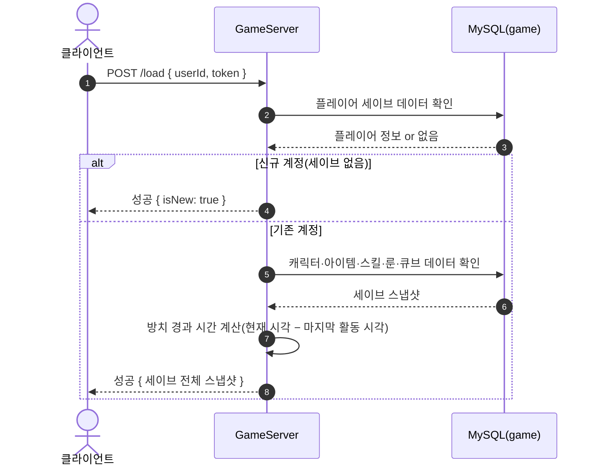
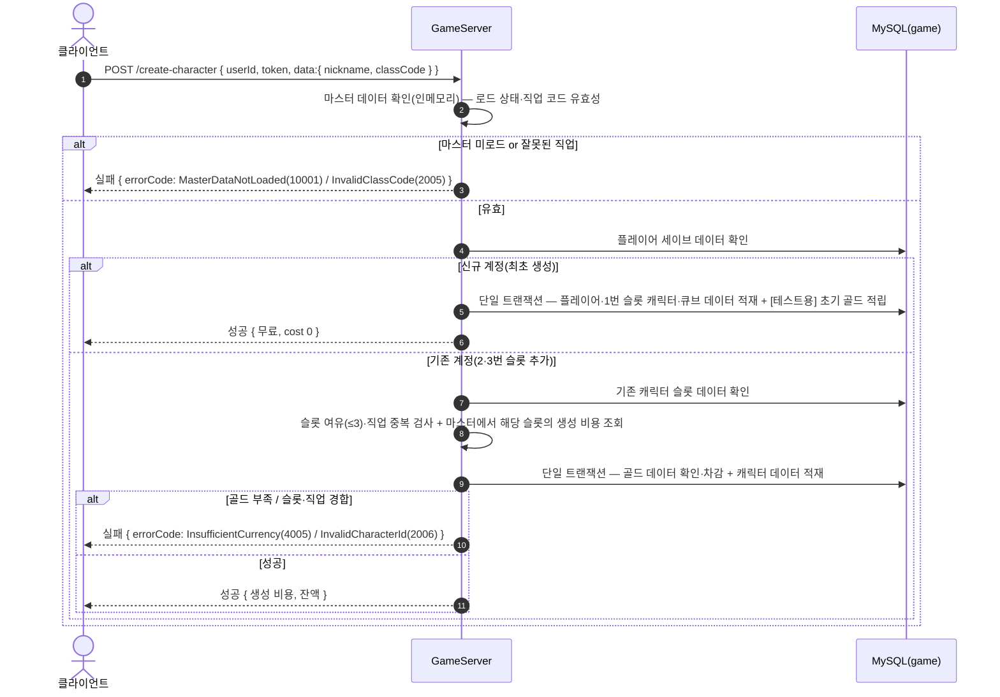
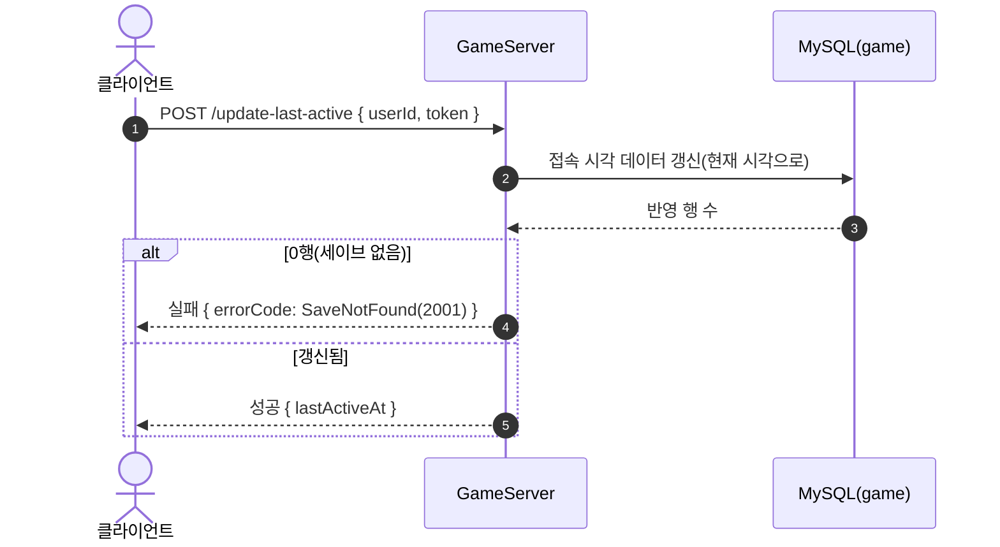

# GameSaveController (`/api/game`, GameServer)

세이브 로드·캐릭터 생성·접속 시각 갱신. 저장소: MySQL `taskbar_hero_game`(`game_player`·`player_character`·`player_item`·`player_cube` 등).

> **인증**: `/api/game/*` 요청은 `GameAuthMiddleware`가 토큰을 검증한다(실패 시 401). 주요 로직이 아니므로 아래 다이어그램에서는 생략하고, 인증된 `userId`로 처리가 시작된 이후를 표기한다.

## POST /api/game/load — 세이브 로드

## POST /api/game/create-character — 캐릭터 생성

## POST /api/game/update-last-active — 접속 시각 갱신(heartbeat)

