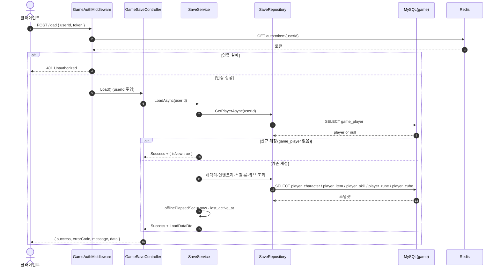
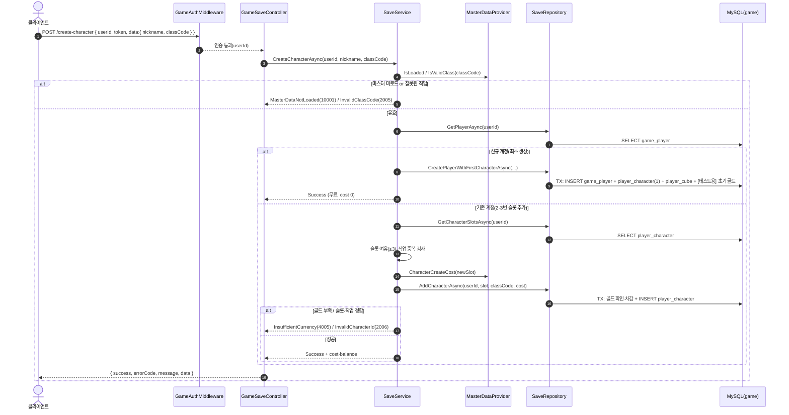
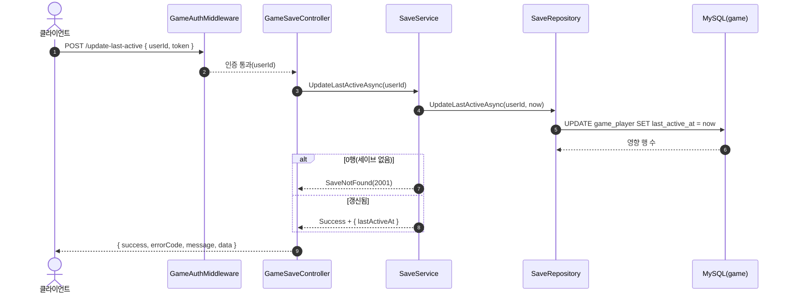

# GameSaveController (`/api/game`, GameServer)

세이브 로드·캐릭터 생성·접속 시각 갱신. 모든 요청은 `GameAuthMiddleware` 인증을 거친다. 저장소: MySQL `taskbar_hero_game`(`game_player`·`player_character`·`player_item`·`player_cube` 등).

> **공통 인증**: 아래 모든 다이어그램의 첫 단계는 `GameAuthMiddleware`가 body의 `userId`·`token`을 Redis `auth:token:{userId}`와 대조하는 것이다(실패 시 401, 컨트롤러 미도달). 이후 인증된 `userId`가 컨트롤러로 전달된다.

## POST /api/game/load — 세이브 로드

## POST /api/game/create-character — 캐릭터 생성

## POST /api/game/update-last-active — 접속 시각 갱신(heartbeat)

