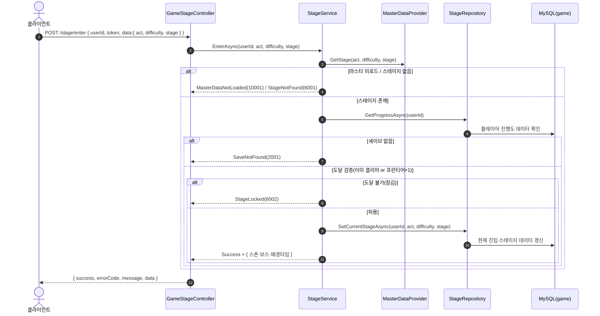
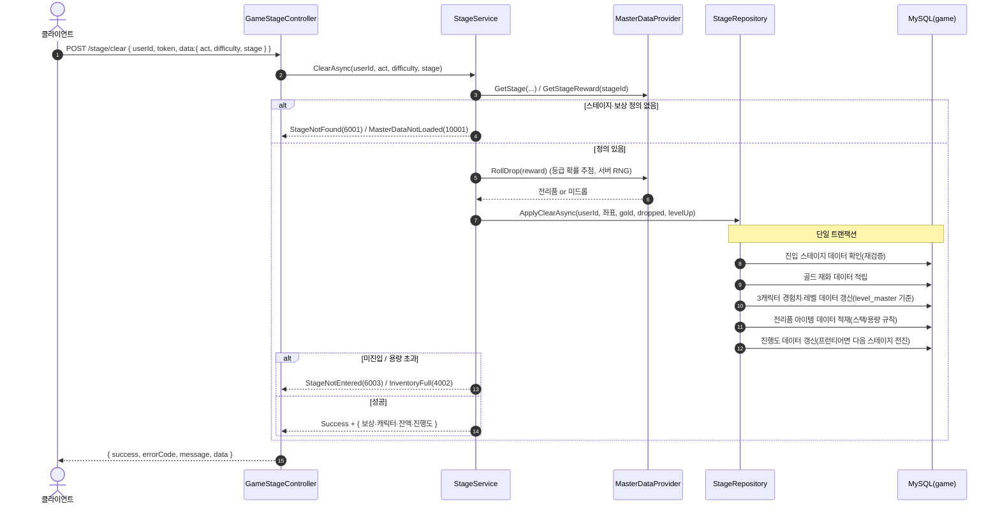

# GameStageController (`/api/game/stage`, GameServer)

스테이지 진입·클리어(서버 권위 보상 산출). 저장소: MySQL `taskbar_hero_game` + `MasterDataProvider`(stage/reward/level/item).

> **인증**: `/api/game/*` 요청은 컨트롤러 진입 전에 `GameAuthMiddleware`가 토큰을 검증한다(실패 시 401). 주요 로직이 아니므로 아래 다이어그램에서는 생략하고, 인증된 `userId`가 컨트롤러에 전달된 이후를 표기한다.

## POST /api/game/stage/enter — 스테이지 진입

## POST /api/game/stage/clear — 스테이지 클리어(보상 지급)

