# 시퀀스 다이어그램 (기능별)

모든 API의 요청 처리 흐름을 [Mermaid](https://mermaid.js.org/syntax/sequenceDiagram.html) `sequenceDiagram`으로 **이 문서 하나에 기능별로** 정리한다. GitHub·VS Code(Mermaid 지원)에서 렌더링된다.

## 기능 목차

| 기능 | 처리 컨트롤러 | 서버 | 주요 엔드포인트 |
|---|---|---|---|
| [**로그인/인증**](#로그인인증) (회원가입·로그인·로그아웃) | AuthController | Account | `POST /api/auth/signup` · `login` · `logout` |
| [**세이브 데이터/캐릭터 생성**](#세이브-데이터캐릭터-생성) (코어 로드 · 가방 페이지 조회 · 생성 · 파티 편성 저장 · heartbeat) | GameSaveController · GameInventoryController(가방 조회) | Game | `POST /api/game/load` · `inventory/list` · `create-character` · `party/arrange` · `update-last-active` |
| [**스테이지**](#스테이지) (던전 입장·클리어 보상) | GameStageController | Game | `POST /api/game/stage/enter` · `clear` |
| [**방치형 오프라인 보상**](#방치형-오프라인-보상) | GameOfflineController | Game | `POST /api/game/offline/claim` |
| [**인벤토리/아이템**](#인벤토리아이템) (장착·해제·배치·용량 확장. 가방 조회는 세이브 데이터 섹션) | GameInventoryController | Game | `POST /api/game/inventory/equip` · `unequip` · `move` · `expand` |
| [**소모품/버프**](#소모품버프) (소모품 사용 → 경험치·골드 획득량 버프 부여·연장, 적용 중인 버프 조회) | GameConsumableController | Game | `POST /api/game/consumable/use`, `POST /api/game/consumable/buffs` |
| [**큐브**](#큐브) (합성 / 분해=연금술 / 제작) | GameCubeController | Game | `POST /api/game/cube/combine` · `dismantle` · `craft` |
| [**성장**](#성장스킬룬) (스킬 레벨업·초기화·장착 / 룬 업그레이드) | GameGrowthController | Game | `POST /api/game/growth/skill/levelup` · `skill/reset` · `skill/equip` · `rune/upgrade` |
| [**거래소/교역선**](#거래소교역선) (목록 조회=본인 제외·mine 옵션 / 판매 등록=에스크로 / 구매 / 취소(status 3) / 만료 배치(status 4)) | GameTradeController · TradeExpireBatchService(배치) | Game | `POST /api/game/trade/list` · `register` · `buy` · `cancel` |
| [**메일**](#메일) (우편함 조회 / 첨부 수령 / 일괄 수령 / 보관 GC 배치) | GameMailController · MailGcBatchService(배치) | Game | `POST /api/game/mail/list` · `claim` · `claim-all` |
| [**출석부 보상**](#출석부-보상) (이번달 진행도 조회 / 오늘자 보상 획득→메일 발급, 일차 = 누적 출석 순번 1~30) | GameAttendanceController | Game | `POST /api/game/attendance/status` · `claim` |

## 공통 아키텍처

- **계층**: `Controller`(HTTP 액션) → `Service`(검증·규칙·RNG) → `Repository`(SqlKata + MySqlConnector) → **MySQL**. 정적 수치는 `MasterDataProvider`(기동 시 마스터 DB에서 인메모리 적재)로 조회한다.
  - 단, 시퀀스 다이어그램은 이 내부 계층을 **하나의 서버 참여자로 요약**한다(아래 「참여자 표기」 참고).
- **응답 형식**: 모든 API가 `{ success, errorCode, message, data }`. `success == (errorCode == 0)`. 에러 코드는 `TaskbarHero.Common.ErrorCode`(서버-클라 공유 계약).
- **DB(3종)**: `taskbar_hero_account`(계정), `taskbar_hero_game`(세이브/진행), `taskbar_hero_master`(마스터, 인메모리 적재 원본). **Redis**: 인증 토큰(`auth:token:{userId}`).
- **인증(GameServer 전용)**: `/api/game/*` 요청은 `GameAuthMiddleware`가 body의 `userId`·`token`을 읽어 Redis 토큰과 대조한다. 실패 시 401. 성공 시 `userId`를 컨트롤러로 전달한다. AccountServer의 `signup`·`login`은 무인증, `logout`은 서버가 토큰을 대조한다.
  - 이 미들웨어 검증은 각 기능의 주요 로직이 아니므로 **모든 시퀀스 다이어그램에서 생략**하고, 인증된 `userId`로 처리가 시작된 이후부터 표기한다.
- **트랜잭션**: 재화·상태 변경은 `user_id` 단위 단일 트랜잭션으로 원자적으로 반영한다(중도 실패 시 롤백).

## 참여자 표기

다이어그램은 **프로세스 단위**로 참여자를 둔다. 서버 내부의 `Controller`·`Service`·`Repository`·`Cache`는 하나의 서버 참여자로 합쳐, 기능 흐름(무엇을 검증하고 무엇을 저장하는가)이 계층 왕복에 묻히지 않게 한다.

| 참여자 | 의미 |
|---|---|
| `클라이언트` | Unity 클라이언트(actor) |
| `AccountServer` | 계정/인증 서버 프로세스(컨트롤러·서비스·리포지토리·토큰 캐시 포함) |
| `GameServer` | 게임 로직 서버 프로세스(컨트롤러·서비스·리포지토리 포함) |
| `MySQL(account)` / `MySQL(game)` | 각 서버가 쓰는 MySQL 스키마 |
| `Redis` | 인증 토큰 캐시(`auth:token:{userId}`) |

- **마스터 데이터**는 서버 프로세스 안의 인메모리 구조(`MasterDataProvider`)이므로 별도 참여자로 두지 않고 **서버 자기호출**(`S->>S: 마스터 데이터 확인(인메모리) — ...`)로 표기한다. 검증·계산 등 서버 내부 판정도 같은 방식이다.
- 서버 계층 구조의 정본은 코드와 위 「공통 아키텍처」이며, 어느 클래스가 무엇을 하는지는 다이어그램이 아니라 코드/XML 주석에서 확인한다.

## 범례

- `alt`/`opt` 블록은 분기(에러/조건)를 나타낸다. 각 다이어그램은 대표 경로 중심이며, 세부 에러 코드는 해당 기획서를 정본으로 한다.
- **응답 표기**: 서버 → 클라이언트 응답은 `성공 { ... }` / `실패 { errorCode: ... }`로 줄여 쓴다. 실제 전문은 항상 공통 응답 형식 `{ success, errorCode, message, data }`이며, 중괄호 안은 그중 핵심 필드만 나타낸다. `errorCode`(예: `StageNotFound(6001)`)는 클라이언트와 공유하는 계약이므로 코드명을 그대로 쓴다.
- **저장소 접근 표기**: DB·Redis로 향하는 화살표는 SQL/명령문(`SELECT`·`INSERT`·`UPDATE`·`DELETE` 등)을 쓰지 않고 「~ 데이터 확인 / 적재 / 갱신 / 차감 / 삭제」처럼 수행하는 일로 표기한다. 실제 쿼리는 각 리포지토리 코드와 그 XML 주석을 정본으로 한다.
- **호출 표기**: 화살표 라벨에 메서드명(`EnterAsync`·`GetStage` 등)을 쓰지 않고 「스테이지 진입 처리」처럼 그 호출이 무엇을 하는지로 표기한다.
- **트랜잭션 경계**는 `Note over S,DB: 단일 트랜잭션`으로 표기한다.

---

## 로그인/인증

계정/인증 (AuthController, `/api/auth`, AccountServer). `signup`·`login`은 **무인증**, `logout`은 서버가 토큰을 대조한다. 저장소: MySQL `taskbar_hero_account`(`users`·`user_auth_token`) + Redis(`auth:token:{userId}`).

### POST /api/auth/signup — 회원가입

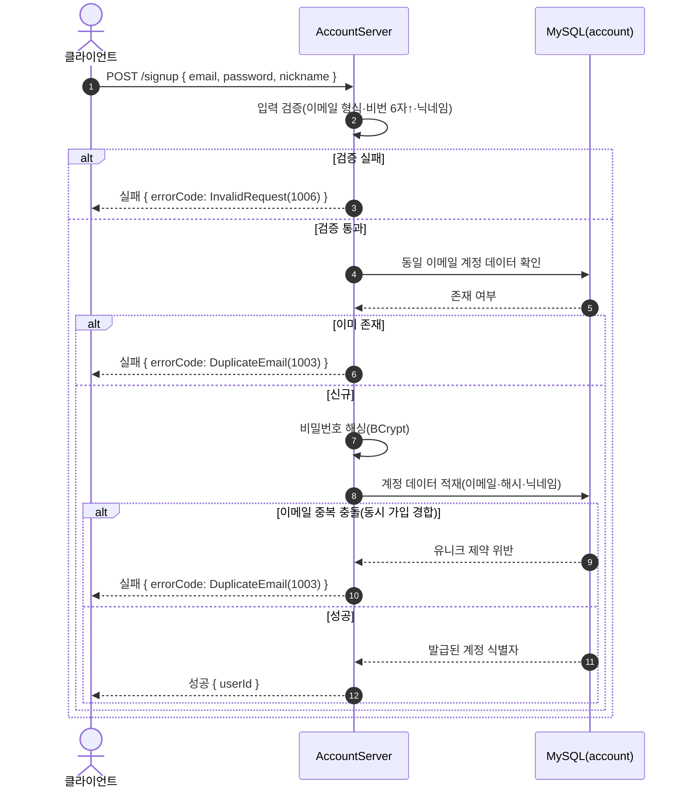
```mermaid
sequenceDiagram
    autonumber
    actor C as 클라이언트
    participant S as AccountServer
    participant DB as MySQL(account)

    C->>S: POST /signup { email, password, nickname }
    S->>S: 입력 검증(이메일 형식·비번 6자↑·닉네임)
    alt 검증 실패
        S-->>C: 실패 { errorCode: InvalidRequest(1006) }
    else 검증 통과
        S->>DB: 동일 이메일 계정 데이터 확인
        DB-->>S: 존재 여부
        alt 이미 존재
            S-->>C: 실패 { errorCode: DuplicateEmail(1003) }
        else 신규
            S->>S: 비밀번호 해싱(BCrypt)
            S->>DB: 계정 데이터 적재(이메일·해시·닉네임)
            alt 이메일 중복 충돌(동시 가입 경합)
                DB-->>S: 유니크 제약 위반
                S-->>C: 실패 { errorCode: DuplicateEmail(1003) }
            else 성공
                DB-->>S: 발급된 계정 식별자
                S-->>C: 성공 { userId }
            end
        end
    end
```

### POST /api/auth/login — 로그인(토큰 발급)

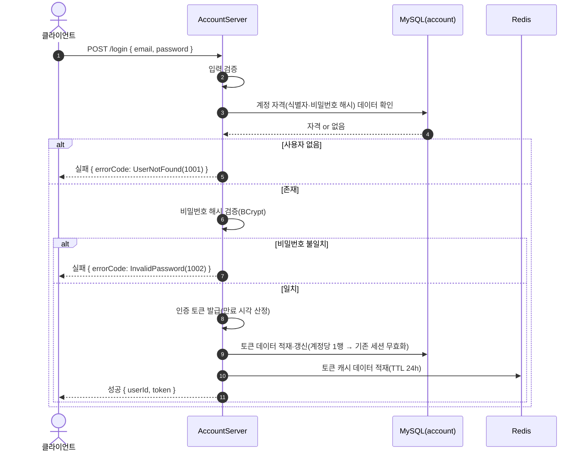
```mermaid
sequenceDiagram
    autonumber
    actor C as 클라이언트
    participant S as AccountServer
    participant DB as MySQL(account)
    participant Redis as Redis

    C->>S: POST /login { email, password }
    S->>S: 입력 검증
    S->>DB: 계정 자격(식별자·비밀번호 해시) 데이터 확인
    DB-->>S: 자격 or 없음
    alt 사용자 없음
        S-->>C: 실패 { errorCode: UserNotFound(1001) }
    else 존재
        S->>S: 비밀번호 해시 검증(BCrypt)
        alt 비밀번호 불일치
            S-->>C: 실패 { errorCode: InvalidPassword(1002) }
        else 일치
            S->>S: 인증 토큰 발급(만료 시각 산정)
            S->>DB: 토큰 데이터 적재·갱신(계정당 1행 → 기존 세션 무효화)
            S->>Redis: 토큰 캐시 데이터 적재(TTL 24h)
            S-->>C: 성공 { userId, token }
        end
    end
```

### POST /api/auth/logout — 로그아웃(토큰 무효화)

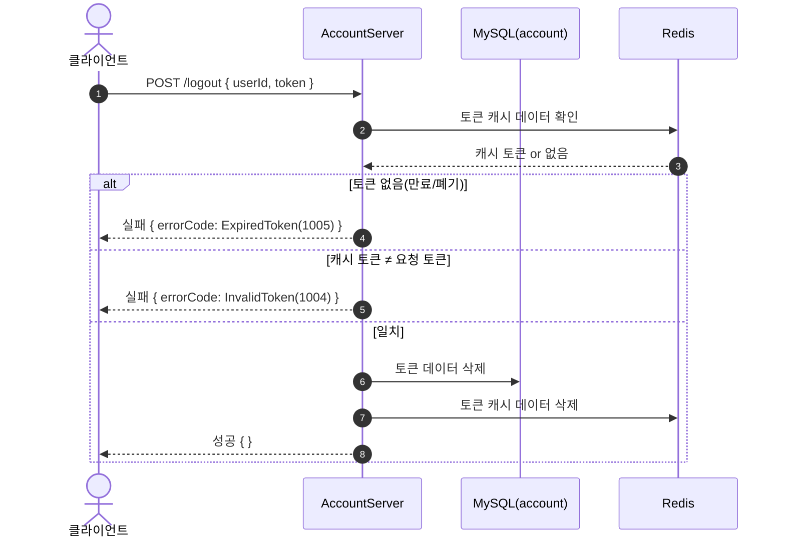
```mermaid
sequenceDiagram
    autonumber
    actor C as 클라이언트
    participant S as AccountServer
    participant DB as MySQL(account)
    participant Redis as Redis

    C->>S: POST /logout { userId, token }
    S->>Redis: 토큰 캐시 데이터 확인
    Redis-->>S: 캐시 토큰 or 없음
    alt 토큰 없음(만료/폐기)
        S-->>C: 실패 { errorCode: ExpiredToken(1005) }
    else 캐시 토큰 ≠ 요청 토큰
        S-->>C: 실패 { errorCode: InvalidToken(1004) }
    else 일치
        S->>DB: 토큰 데이터 삭제
        S->>Redis: 토큰 캐시 데이터 삭제
        S-->>C: 성공 { }
    end
```

## 세이브 데이터/캐릭터 생성

세이브 로드·캐릭터 생성·파티 편성 저장·접속 시각 갱신 (GameSaveController, `/api/game`, GameServer). 저장소: MySQL `taskbar_hero_game`(`game_player`·`player_character`·`player_item`·`player_cube` 등).

### POST /api/game/load — 코어 세이브 로드

크기가 고정된 데이터만 한 번에 내려준다. 무한히 커질 수 있는 가방 아이템은 여기 없고 `/api/game/inventory/list`로 지연 로딩한다(세이브 데이터 기획서 2장). 장착 장비는 최대 18행으로 고정이고 캐릭터 스탯 계산의 입력이라 코어에 포함해, 가방 로딩 없이도 전투를 시작할 수 있다.

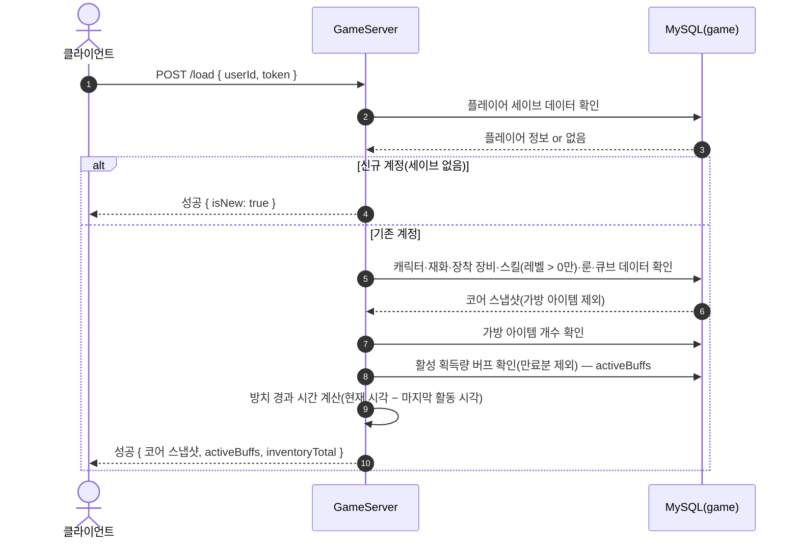
```mermaid
sequenceDiagram
    autonumber
    actor C as 클라이언트
    participant S as GameServer
    participant DB as MySQL(game)

    C->>S: POST /load { userId, token }
    S->>DB: 플레이어 세이브 데이터 확인
    DB-->>S: 플레이어 정보 or 없음
    alt 신규 계정(세이브 없음)
        S-->>C: 성공 { isNew: true }
    else 기존 계정
        S->>DB: 캐릭터·재화·장착 장비·스킬(레벨 > 0만)·룬·큐브 데이터 확인
        DB-->>S: 코어 스냅샷(가방 아이템 제외)
        S->>DB: 가방 아이템 개수 확인
        S->>DB: 활성 획득량 버프 확인(만료분 제외) — activeBuffs
        S->>S: 방치 경과 시간 계산(현재 시각 − 마지막 활동 시각)
        S-->>C: 성공 { 코어 스냅샷, activeBuffs, inventoryTotal }
    end
```

### POST /api/game/inventory/list — 가방 아이템 페이지 조회

창고/인벤토리 UI를 열 때 호출한다. `slot` 커서 keyset 페이징이며(OFFSET 미사용, `(user_id, slot)` 유니크 인덱스가 범위 스캔을 커버), 페이지 사이의 인벤토리 변경은 서버가 검증하지 않고 클라이언트가 `itemId` 기준 병합으로 흡수한다.

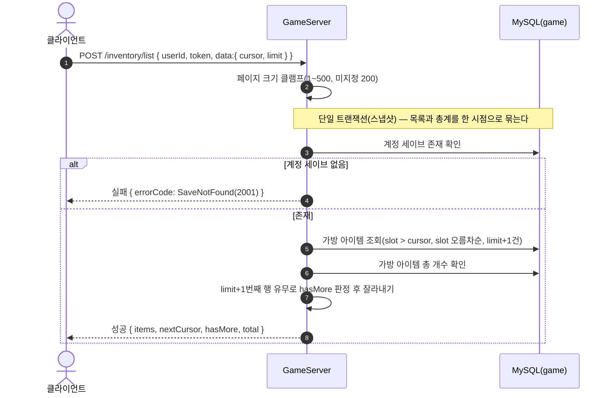
```mermaid
sequenceDiagram
    autonumber
    actor C as 클라이언트
    participant S as GameServer
    participant DB as MySQL(game)

    C->>S: POST /inventory/list { userId, token, data:{ cursor, limit } }
    S->>S: 페이지 크기 클램프(1~500, 미지정 200)
    Note over S,DB: 단일 트랜잭션(스냅샷) — 목록과 총계를 한 시점으로 묶는다
    S->>DB: 계정 세이브 존재 확인
    alt 계정 세이브 없음
        S-->>C: 실패 { errorCode: SaveNotFound(2001) }
    else 존재
        S->>DB: 가방 아이템 조회(slot > cursor, slot 오름차순, limit+1건)
        S->>DB: 가방 아이템 총 개수 확인
        S->>S: limit+1번째 행 유무로 hasMore 판정 후 잘라내기
        S-->>C: 성공 { items, nextCursor, hasMore, total }
    end
```

### POST /api/game/create-character — 캐릭터 생성

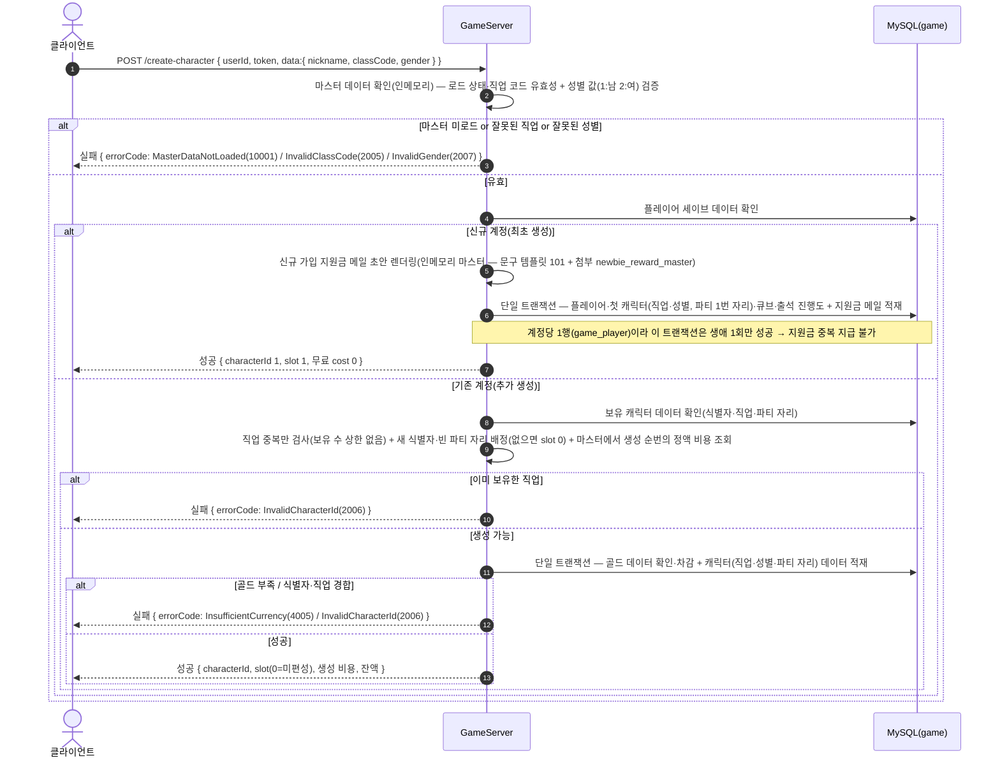
```mermaid
sequenceDiagram
    autonumber
    actor C as 클라이언트
    participant S as GameServer
    participant DB as MySQL(game)

    C->>S: POST /create-character { userId, token, data:{ nickname, classCode, gender } }
    S->>S: 마스터 데이터 확인(인메모리) — 로드 상태·직업 코드 유효성 + 성별 값(1:남 2:여) 검증
    alt 마스터 미로드 or 잘못된 직업 or 잘못된 성별
        S-->>C: 실패 { errorCode: MasterDataNotLoaded(10001) / InvalidClassCode(2005) / InvalidGender(2007) }
    else 유효
        S->>DB: 플레이어 세이브 데이터 확인
        alt 신규 계정(최초 생성)
            S->>S: 신규 가입 지원금 메일 초안 렌더링(인메모리 마스터 — 문구 템플릿 101 + 첨부 newbie_reward_master)
            S->>DB: 단일 트랜잭션 — 플레이어·첫 캐릭터(직업·성별, 파티 1번 자리)·큐브·출석 진행도 + 지원금 메일 적재
            Note over S,DB: 계정당 1행(game_player)이라 이 트랜잭션은 생애 1회만 성공 → 지원금 중복 지급 불가
            S-->>C: 성공 { characterId 1, slot 1, 무료 cost 0 }
        else 기존 계정(추가 생성)
            S->>DB: 보유 캐릭터 데이터 확인(식별자·직업·파티 자리)
            S->>S: 직업 중복만 검사(보유 수 상한 없음) + 새 식별자·빈 파티 자리 배정(없으면 slot 0) + 마스터에서 생성 순번의 정액 비용 조회
            alt 이미 보유한 직업
                S-->>C: 실패 { errorCode: InvalidCharacterId(2006) }
            else 생성 가능
                S->>DB: 단일 트랜잭션 — 골드 데이터 확인·차감 + 캐릭터(직업·성별·파티 자리) 데이터 적재
                alt 골드 부족 / 식별자·직업 경합
                    S-->>C: 실패 { errorCode: InsufficientCurrency(4005) / InvalidCharacterId(2006) }
                else 성공
                    S-->>C: 성공 { characterId, slot(0=미편성), 생성 비용, 잔액 }
                end
            end
        end
    end
```

### POST /api/game/party/arrange — 파티 편성 저장(스냅샷)

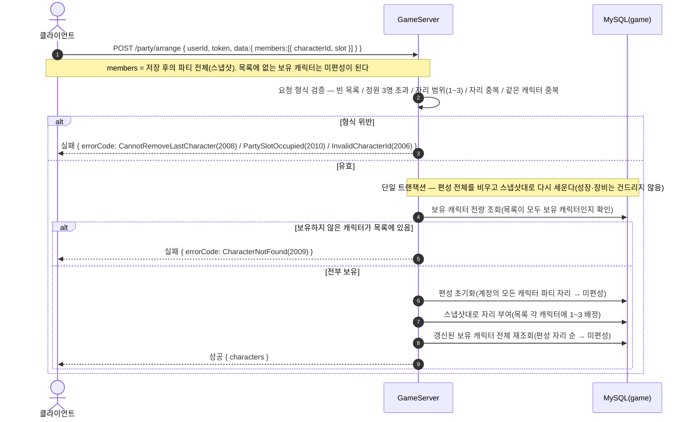
```mermaid
sequenceDiagram
    autonumber
    actor C as 클라이언트
    participant S as GameServer
    participant DB as MySQL(game)

    C->>S: POST /party/arrange { userId, token, data:{ members:[{ characterId, slot }] } }
    Note over C,S: members = 저장 후의 파티 전체(스냅샷). 목록에 없는 보유 캐릭터는 미편성이 된다
    S->>S: 요청 형식 검증 — 빈 목록 / 정원 3명 초과 / 자리 범위(1~3) / 자리 중복 / 같은 캐릭터 중복
    alt 형식 위반
        S-->>C: 실패 { errorCode: CannotRemoveLastCharacter(2008) / PartySlotOccupied(2010) / InvalidCharacterId(2006) }
    else 유효
        Note over S,DB: 단일 트랜잭션 — 편성 전체를 비우고 스냅샷대로 다시 세운다(성장·장비는 건드리지 않음)
        S->>DB: 보유 캐릭터 전량 조회(목록이 모두 보유 캐릭터인지 확인)
        alt 보유하지 않은 캐릭터가 목록에 있음
            S-->>C: 실패 { errorCode: CharacterNotFound(2009) }
        else 전부 보유
            S->>DB: 편성 초기화(계정의 모든 캐릭터 파티 자리 → 미편성)
            S->>DB: 스냅샷대로 자리 부여(목록 각 캐릭터에 1~3 배정)
            S->>DB: 갱신된 보유 캐릭터 전체 재조회(편성 자리 순 → 미편성)
            S-->>C: 성공 { characters }
        end
    end
```

### POST /api/game/update-last-active — 접속 시각 갱신(heartbeat)

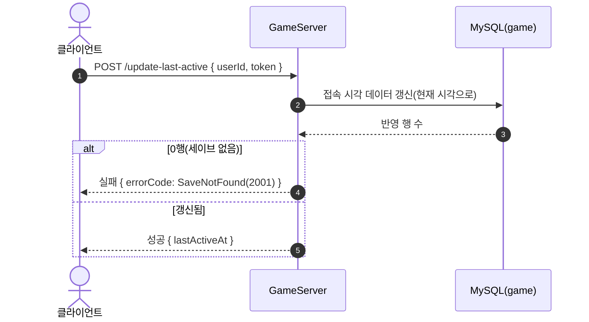
```mermaid
sequenceDiagram
    autonumber
    actor C as 클라이언트
    participant S as GameServer
    participant DB as MySQL(game)

    C->>S: POST /update-last-active { userId, token }
    S->>DB: 접속 시각 데이터 갱신(현재 시각으로)
    DB-->>S: 반영 행 수
    alt 0행(세이브 없음)
        S-->>C: 실패 { errorCode: SaveNotFound(2001) }
    else 갱신됨
        S-->>C: 성공 { lastActiveAt }
    end
```

## 스테이지

스테이지 진입·클리어(서버 권위 보상 산출) (GameStageController, `/api/game/stage`, GameServer). 저장소: MySQL `taskbar_hero_game` + 인메모리 마스터 데이터(stage/reward/level/item).

### POST /api/game/stage/enter — 스테이지 진입

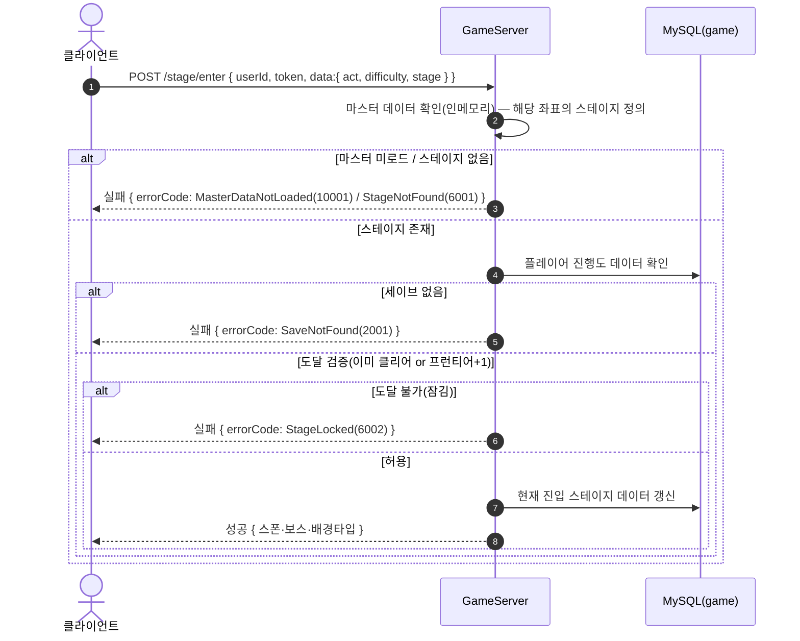
```mermaid
sequenceDiagram
    autonumber
    actor C as 클라이언트
    participant S as GameServer
    participant DB as MySQL(game)

    C->>S: POST /stage/enter { userId, token, data:{ act, difficulty, stage } }
    S->>S: 마스터 데이터 확인(인메모리) — 해당 좌표의 스테이지 정의
    alt 마스터 미로드 / 스테이지 없음
        S-->>C: 실패 { errorCode: MasterDataNotLoaded(10001) / StageNotFound(6001) }
    else 스테이지 존재
        S->>DB: 플레이어 진행도 데이터 확인
        alt 세이브 없음
            S-->>C: 실패 { errorCode: SaveNotFound(2001) }
        else 도달 검증(이미 클리어 or 프런티어+1)
            alt 도달 불가(잠김)
                S-->>C: 실패 { errorCode: StageLocked(6002) }
            else 허용
                S->>DB: 현재 진입 스테이지 데이터 갱신
                S-->>C: 성공 { 스폰·보스·배경타입 }
            end
        end
    end
```

### POST /api/game/stage/clear — 스테이지 클리어(보상 지급)

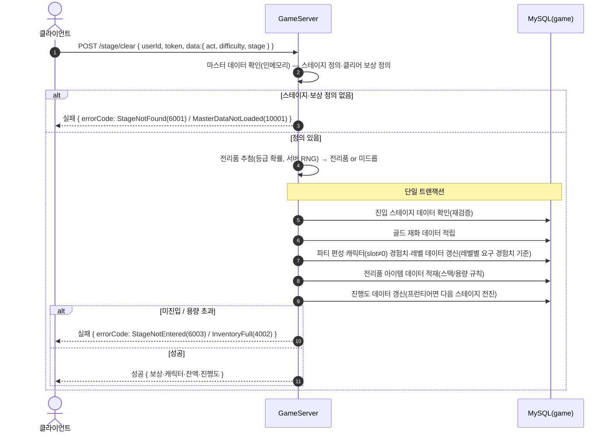
```mermaid
sequenceDiagram
    autonumber
    actor C as 클라이언트
    participant S as GameServer
    participant DB as MySQL(game)

    C->>S: POST /stage/clear { userId, token, data:{ act, difficulty, stage } }
    S->>S: 마스터 데이터 확인(인메모리) — 스테이지 정의·클리어 보상 정의
    alt 스테이지·보상 정의 없음
        S-->>C: 실패 { errorCode: StageNotFound(6001) / MasterDataNotLoaded(10001) }
    else 정의 있음
        S->>S: 전리품 추첨(등급 확률, 서버 RNG) → 전리품 or 미드롭
        Note over S,DB: 단일 트랜잭션
        S->>DB: 진입 스테이지 데이터 확인(재검증)
        S->>DB: 골드 재화 데이터 적립
        S->>DB: 파티 편성 캐릭터(slot≠0) 경험치·레벨 데이터 갱신(레벨별 요구 경험치 기준)
        S->>DB: 전리품 아이템 데이터 적재(스택/용량 규칙)
        S->>DB: 진행도 데이터 갱신(프런티어면 다음 스테이지 전진)
        alt 미진입 / 용량 초과
            S-->>C: 실패 { errorCode: StageNotEntered(6003) / InventoryFull(4002) }
        else 성공
            S-->>C: 성공 { 보상·캐릭터·잔액·진행도 }
        end
    end
```

## 방치형 오프라인 보상

방치형 오프라인 보상 정산 (GameOfflineController, `/api/game/offline`, GameServer). 저장소: MySQL `taskbar_hero_game`(`game_player`·`player_character`·`player_item`) + 인메모리 마스터 데이터(stage_reward·level). 중복 정산은 트랜잭션 + `last_active_at` CAS로 방지한다.

### POST /api/game/offline/claim — 오프라인 보상 정산

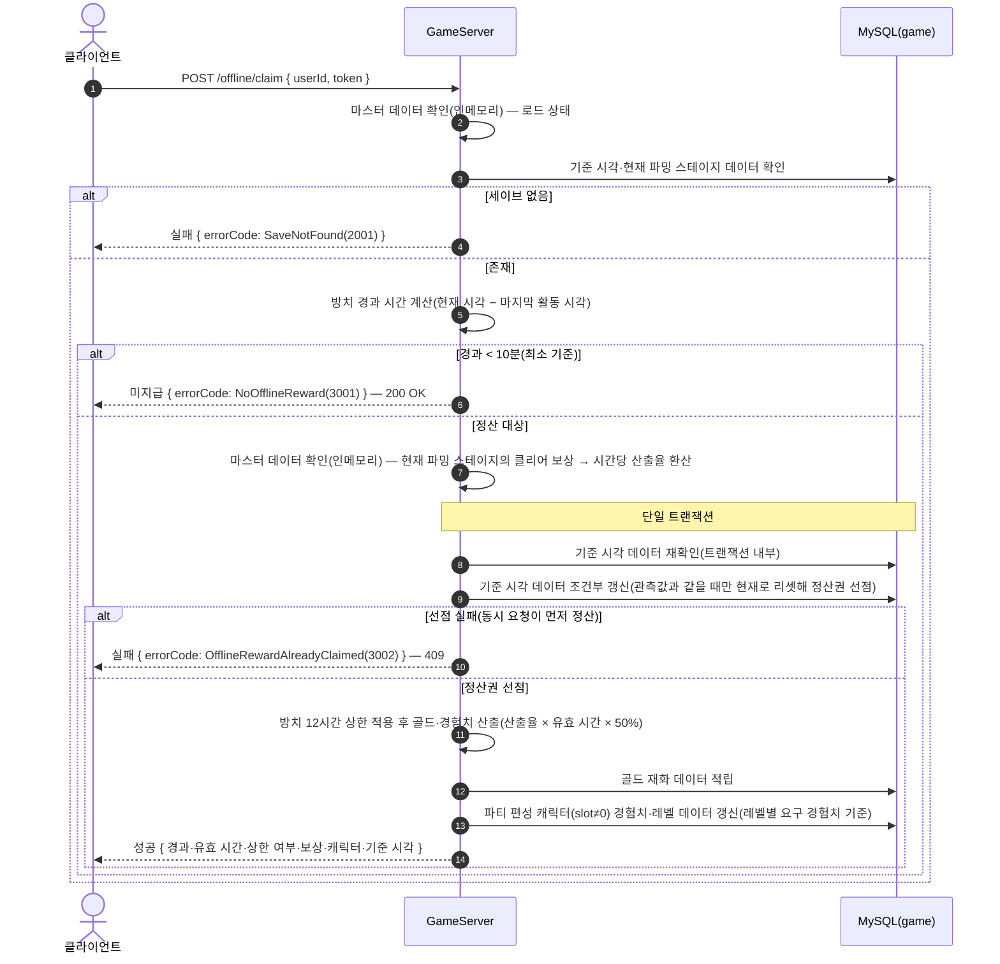
```mermaid
sequenceDiagram
    autonumber
    actor C as 클라이언트
    participant S as GameServer
    participant DB as MySQL(game)

    C->>S: POST /offline/claim { userId, token }
    S->>S: 마스터 데이터 확인(인메모리) — 로드 상태
    S->>DB: 기준 시각·현재 파밍 스테이지 데이터 확인
    alt 세이브 없음
        S-->>C: 실패 { errorCode: SaveNotFound(2001) }
    else 존재
        S->>S: 방치 경과 시간 계산(현재 시각 − 마지막 활동 시각)
        alt 경과 < 10분(최소 기준)
            S-->>C: 미지급 { errorCode: NoOfflineReward(3001) } — 200 OK
        else 정산 대상
            S->>S: 마스터 데이터 확인(인메모리) — 현재 파밍 스테이지의 클리어 보상 → 시간당 산출율 환산
            Note over S,DB: 단일 트랜잭션
            S->>DB: 기준 시각 데이터 재확인(트랜잭션 내부)
            S->>DB: 기준 시각 데이터 조건부 갱신(관측값과 같을 때만 현재로 리셋해 정산권 선점)
            alt 선점 실패(동시 요청이 먼저 정산)
                S-->>C: 실패 { errorCode: OfflineRewardAlreadyClaimed(3002) } — 409
            else 정산권 선점
                S->>S: 방치 12시간 상한 적용 후 골드·경험치 산출(산출율 × 유효 시간 × 50%)
                S->>DB: 골드 재화 데이터 적립
                S->>DB: 파티 편성 캐릭터(slot≠0) 경험치·레벨 데이터 갱신(레벨별 요구 경험치 기준)
                S-->>C: 성공 { 경과·유효 시간·상한 여부·보상·캐릭터·기준 시각 }
            end
        end
    end
```

## 인벤토리/아이템

장비 장착·해제·배치 이동·용량 확장 (GameInventoryController, `/api/game/inventory`, GameServer). 저장소: MySQL `taskbar_hero_game`(`player_item`·`player_item_equipped`·`game_player`) + 인메모리 마스터 데이터(item·확장 비용).

### POST /api/game/inventory/equip — 장착(스왑)

장착한 장비는 **가방 칸을 반납**한다(`player_item.slot = NULL`). 스왑이면 밀려난 기존 장비가 그 칸을 그대로 물려받아 점유 칸 수가 상쇄되므로, 가방이 가득 차 있어도 스왑 장착은 성공한다.

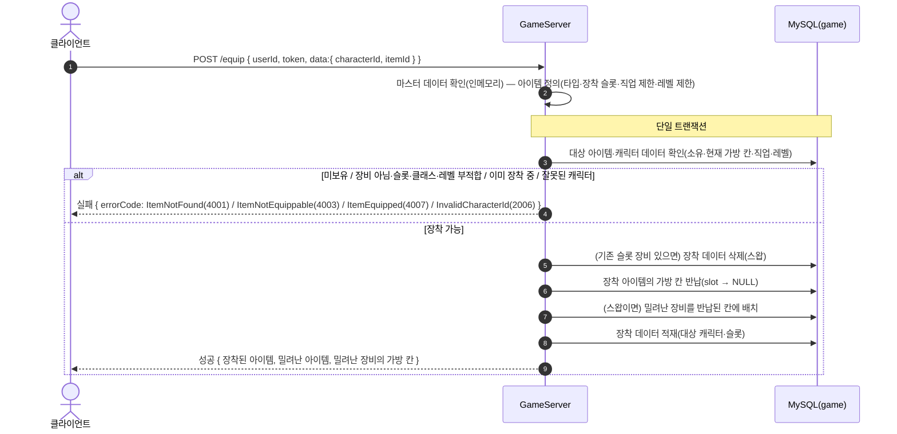
```mermaid
sequenceDiagram
    autonumber
    actor C as 클라이언트
    participant S as GameServer
    participant DB as MySQL(game)

    C->>S: POST /equip { userId, token, data:{ characterId, itemId } }
    S->>S: 마스터 데이터 확인(인메모리) — 아이템 정의(타입·장착 슬롯·직업 제한·레벨 제한)
    Note over S,DB: 단일 트랜잭션
    S->>DB: 대상 아이템·캐릭터 데이터 확인(소유·현재 가방 칸·직업·레벨)
    alt 미보유 / 장비 아님·슬롯·클래스·레벨 부적합 / 이미 장착 중 / 잘못된 캐릭터
        S-->>C: 실패 { errorCode: ItemNotFound(4001) / ItemNotEquippable(4003) / ItemEquipped(4007) / InvalidCharacterId(2006) }
    else 장착 가능
        S->>DB: (기존 슬롯 장비 있으면) 장착 데이터 삭제(스왑)
        S->>DB: 장착 아이템의 가방 칸 반납(slot → NULL)
        S->>DB: (스왑이면) 밀려난 장비를 반납된 칸에 배치
        S->>DB: 장착 데이터 적재(대상 캐릭터·슬롯)
        S-->>C: 성공 { 장착된 아이템, 밀려난 아이템, 밀려난 장비의 가방 칸 }
    end
```

### POST /api/game/inventory/unequip — 장착 해제

장착 중에는 가방 칸을 쓰지 않으므로, 해제하려면 **되돌릴 빈 칸이 필요**하다. 없으면 전체 롤백하고 거부한다(장비를 잃지 않는다).

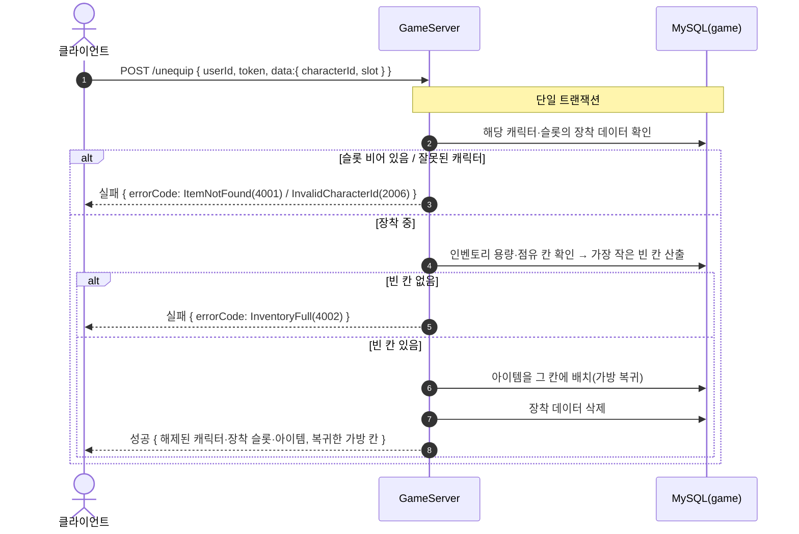
```mermaid
sequenceDiagram
    autonumber
    actor C as 클라이언트
    participant S as GameServer
    participant DB as MySQL(game)

    C->>S: POST /unequip { userId, token, data:{ characterId, slot } }
    Note over S,DB: 단일 트랜잭션
    S->>DB: 해당 캐릭터·슬롯의 장착 데이터 확인
    alt 슬롯 비어 있음 / 잘못된 캐릭터
        S-->>C: 실패 { errorCode: ItemNotFound(4001) / InvalidCharacterId(2006) }
    else 장착 중
        S->>DB: 인벤토리 용량·점유 칸 확인 → 가장 작은 빈 칸 산출
        alt 빈 칸 없음
            S-->>C: 실패 { errorCode: InventoryFull(4002) }
        else 빈 칸 있음
            S->>DB: 아이템을 그 칸에 배치(가방 복귀)
            S->>DB: 장착 데이터 삭제
            S-->>C: 성공 { 해제된 캐릭터·장착 슬롯·아이템, 복귀한 가방 칸 }
        end
    end
```

### POST /api/game/inventory/move — 배치 이동/교환

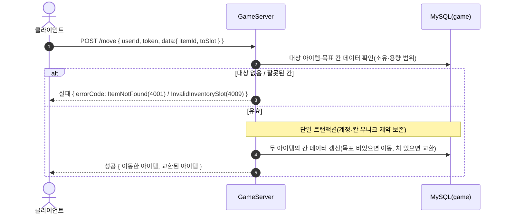
```mermaid
sequenceDiagram
    autonumber
    actor C as 클라이언트
    participant S as GameServer
    participant DB as MySQL(game)

    C->>S: POST /move { userId, token, data:{ itemId, toSlot } }
    S->>DB: 대상 아이템·목표 칸 데이터 확인(소유·용량 범위)
    alt 대상 없음 / 잘못된 칸
        S-->>C: 실패 { errorCode: ItemNotFound(4001) / InvalidInventorySlot(4009) }
    else 유효
        Note over S,DB: 단일 트랜잭션(계정-칸 유니크 제약 보존)
        S->>DB: 두 아이템의 칸 데이터 갱신(목표 비었으면 이동, 차 있으면 교환)
        S-->>C: 성공 { 이동한 아이템, 교환된 아이템 }
    end
```

### POST /api/game/inventory/expand — 용량 1칸 확장(골드 소모)

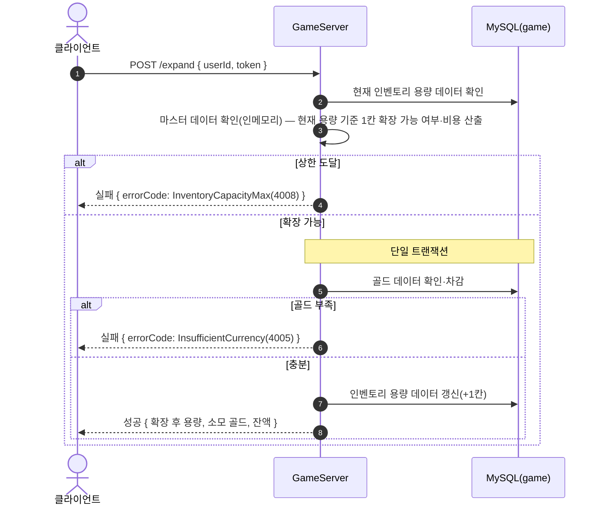
```mermaid
sequenceDiagram
    autonumber
    actor C as 클라이언트
    participant S as GameServer
    participant DB as MySQL(game)

    C->>S: POST /expand { userId, token }
    S->>DB: 현재 인벤토리 용량 데이터 확인
    S->>S: 마스터 데이터 확인(인메모리) — 현재 용량 기준 1칸 확장 가능 여부·비용 산출
    alt 상한 도달
        S-->>C: 실패 { errorCode: InventoryCapacityMax(4008) }
    else 확장 가능
        Note over S,DB: 단일 트랜잭션
        S->>DB: 골드 데이터 확인·차감
        alt 골드 부족
            S-->>C: 실패 { errorCode: InsufficientCurrency(4005) }
        else 충분
            S->>DB: 인벤토리 용량 데이터 갱신(+1칸)
            S-->>C: 성공 { 확장 후 용량, 소모 골드, 잔액 }
        end
    end
```

## 소모품/버프

소모성 아이템 사용 → 계정 획득량 버프 부여·연장, 적용 중인 버프 조회 (GameConsumableController, `/api/game/consumable`, GameServer). 저장소: MySQL `taskbar_hero_game`(`player_item`·`player_buff`) + 인메모리 마스터 데이터(item·consumable). 현재 소모품은 **경험치 부스터·골드 부스터** 2종이다.

**활성 버프를 받는 창구는 세 곳이다** — 접속 직후는 코어 로드(`POST /api/game/load`)의 `activeBuffs`([세이브 데이터/캐릭터 생성](#세이브-데이터캐릭터-생성) 섹션), 소모품 사용 직후는 사용 응답, 그 이후 버프 UI 재동기화는 전용 경량 조회(`POST /api/game/consumable/buffs`)가 담당한다.

### POST /api/game/consumable/use — 소모품 사용(버프 부여·연장)

1회 호출당 **1개 고정**이다. 같은 종류를 다시 쓰면 남은 시간에 **누적 연장**되며(`started_at`은 유지 — 오프라인 소급 정산의 구간 하한이 흔들리지 않도록), 누적 상한(24시간)을 넘으면 **아이템을 차감하지 않고** 거부한다.

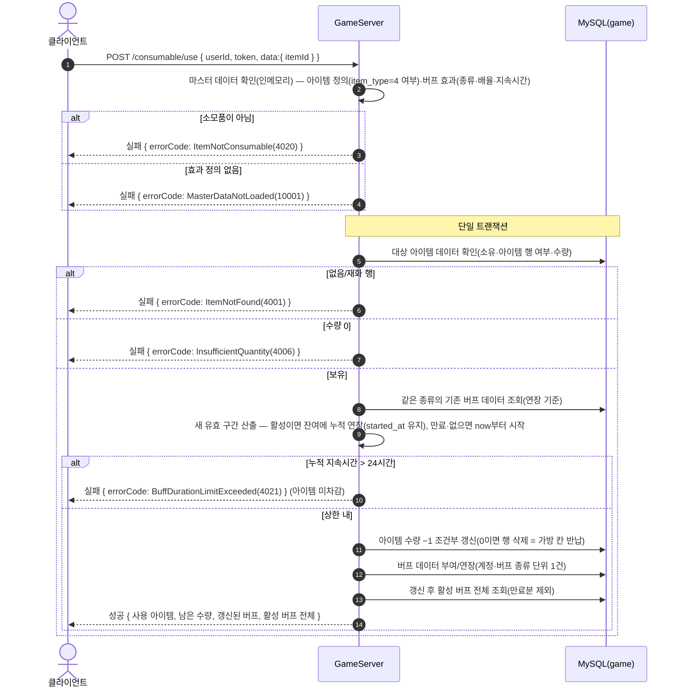
```mermaid
sequenceDiagram
    autonumber
    actor C as 클라이언트
    participant S as GameServer
    participant DB as MySQL(game)

    C->>S: POST /consumable/use { userId, token, data:{ itemId } }
    S->>S: 마스터 데이터 확인(인메모리) — 아이템 정의(item_type=4 여부)·버프 효과(종류·배율·지속시간)
    alt 소모품이 아님
        S-->>C: 실패 { errorCode: ItemNotConsumable(4020) }
    else 효과 정의 없음
        S-->>C: 실패 { errorCode: MasterDataNotLoaded(10001) }
    end
    Note over S,DB: 단일 트랜잭션
    S->>DB: 대상 아이템 데이터 확인(소유·아이템 행 여부·수량)
    alt 없음/재화 행
        S-->>C: 실패 { errorCode: ItemNotFound(4001) }
    else 수량 0
        S-->>C: 실패 { errorCode: InsufficientQuantity(4006) }
    else 보유
        S->>DB: 같은 종류의 기존 버프 데이터 조회(연장 기준)
        S->>S: 새 유효 구간 산출 — 활성이면 잔여에 누적 연장(started_at 유지), 만료·없으면 now부터 시작
        alt 누적 지속시간 > 24시간
            S-->>C: 실패 { errorCode: BuffDurationLimitExceeded(4021) } (아이템 미차감)
        else 상한 내
            S->>DB: 아이템 수량 −1 조건부 갱신(0이면 행 삭제 = 가방 칸 반납)
            S->>DB: 버프 데이터 부여/연장(계정·버프 종류 단위 1건)
            S->>DB: 갱신 후 활성 버프 전체 조회(만료분 제외)
            S-->>C: 성공 { 사용 아이템, 남은 수량, 갱신된 버프, 활성 버프 전체 }
        end
    end
```

- 버프 상태는 **MySQL 정본**이다(Redis TTL 미사용). 버프 시간이 벽시계로 흐르므로 오프라인 정산이 **이미 만료된 버프의 유효 구간까지 소급 참조**해야 하는데, TTL은 그 근거를 만료 순간 지워버린다([소모품/버프 기획서](../docs/세부/consumable-buff-기획서.md) 4.1).
- 만료 버프 행은 **즉시 삭제하지 않는다.** 활성 판정이 `expires_at > now` 필터이고, 오프라인 정산 상한(12시간) + 여유만큼은 보존해야 소급 계산이 성립한다(같은 문서 6.4).

### POST /api/game/consumable/buffs — 적용 중인 버프 조회

버프 UI(아이콘·잔여 시간) 재동기화용 **경량 조회**다. 요청 data가 없고, 마스터 데이터를 참조하지 않으며(배율·지속시간은 부여 시점에 확정돼 DB에 있다), 활성 버프가 없어도 **빈 목록 + 성공**이다.

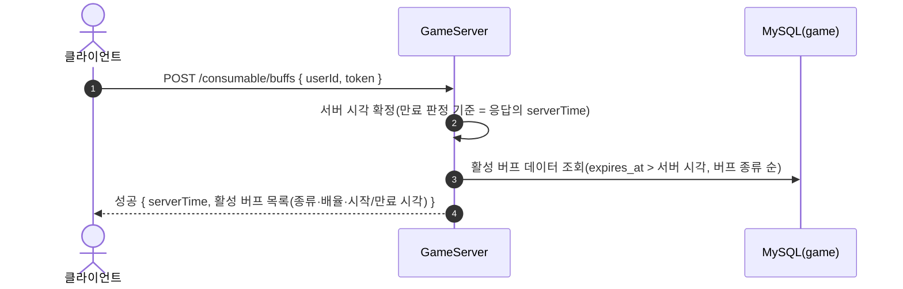
```mermaid
sequenceDiagram
    autonumber
    actor C as 클라이언트
    participant S as GameServer
    participant DB as MySQL(game)

    C->>S: POST /consumable/buffs { userId, token }
    S->>S: 서버 시각 확정(만료 판정 기준 = 응답의 serverTime)
    S->>DB: 활성 버프 데이터 조회(expires_at > 서버 시각, 버프 종류 순)
    S-->>C: 성공 { serverTime, 활성 버프 목록(종류·배율·시작/만료 시각) }
```

- **만료 판정은 서버가 한다.** 클라이언트는 `expiresAt - serverTime`으로 남은 초를 얻어 로컬에서 카운트다운만 하고, 만료를 자체 확정하지 않는다 — 다음 응답에서 그 항목이 사라지는 것으로 확인한다.
- **주기적 폴링은 하지 않는다.** 버프 UI를 열거나 앱이 백그라운드에서 복귀했을 때처럼 재동기화가 필요한 순간에만 호출한다(버프는 소모품 사용 외에 서버 단독으로 바뀌지 않는다).
- 신규 에러 코드가 없다 — 인증 실패 계열 외 분기가 없다.

## 큐브

큐브 — 합성·분해·제작(서버 권위 결과 산출) (GameCubeController, `/api/game/cube`, GameServer). 저장소: MySQL `taskbar_hero_game`(`player_item`·`player_cube`) + 인메모리 마스터 데이터(cube_master·item·recipe). 연산마다 큐브 경험치가 쌓여 레벨업한다.

### POST /api/game/cube/combine — 합성(동급 3개 → 상위 등급 1개)

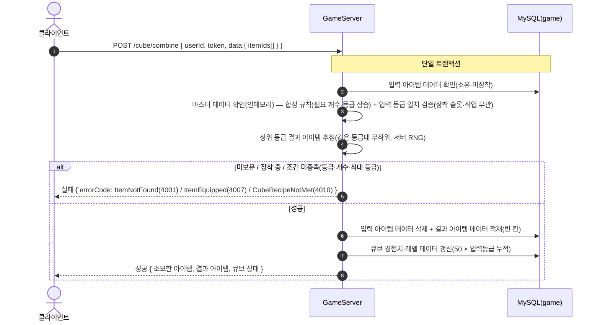
```mermaid
sequenceDiagram
    autonumber
    actor C as 클라이언트
    participant S as GameServer
    participant DB as MySQL(game)

    C->>S: POST /cube/combine { userId, token, data:{ itemIds[] } }
    Note over S,DB: 단일 트랜잭션
    S->>DB: 입력 아이템 데이터 확인(소유·미장착)
    S->>S: 마스터 데이터 확인(인메모리) — 합성 규칙(필요 개수·등급 상승) + 입력 등급 일치 검증(장착 슬롯·직업 무관)
    S->>S: 상위 등급 결과 아이템 추첨(같은 등급대 무작위, 서버 RNG)
    alt 미보유 / 장착 중 / 조건 미충족(등급·개수·최대 등급)
        S-->>C: 실패 { errorCode: ItemNotFound(4001) / ItemEquipped(4007) / CubeRecipeNotMet(4010) }
    else 성공
        S->>DB: 입력 아이템 데이터 삭제 + 결과 아이템 데이터 적재(빈 칸)
        S->>DB: 큐브 경험치·레벨 데이터 갱신(50 × 입력등급 누적)
        S-->>C: 성공 { 소모한 아이템, 결과 아이템, 큐브 상태 }
    end
```

### POST /api/game/cube/dismantle — 분해(아이템 → 골드)

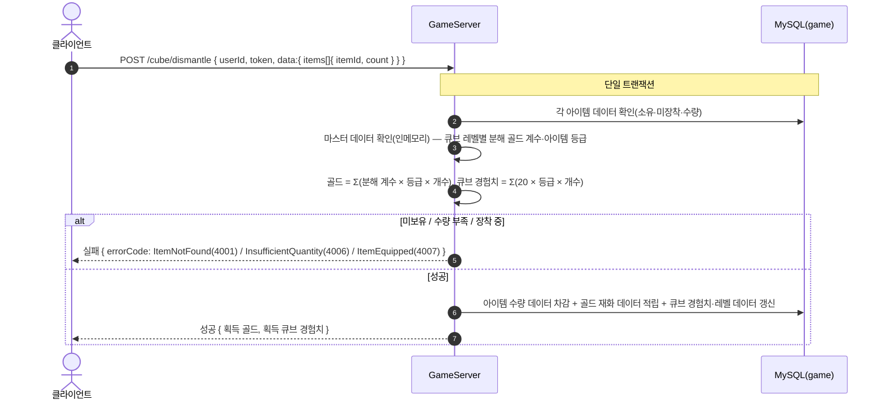
```mermaid
sequenceDiagram
    autonumber
    actor C as 클라이언트
    participant S as GameServer
    participant DB as MySQL(game)

    C->>S: POST /cube/dismantle { userId, token, data:{ items[]{ itemId, count } } }
    Note over S,DB: 단일 트랜잭션
    S->>DB: 각 아이템 데이터 확인(소유·미장착·수량)
    S->>S: 마스터 데이터 확인(인메모리) — 큐브 레벨별 분해 골드 계수·아이템 등급
    S->>S: 골드 = Σ(분해 계수 × 등급 × 개수), 큐브 경험치 = Σ(20 × 등급 × 개수)
    alt 미보유 / 수량 부족 / 장착 중
        S-->>C: 실패 { errorCode: ItemNotFound(4001) / InsufficientQuantity(4006) / ItemEquipped(4007) }
    else 성공
        S->>DB: 아이템 수량 데이터 차감 + 골드 재화 데이터 적립 + 큐브 경험치·레벨 데이터 갱신
        S-->>C: 성공 { 획득 골드, 획득 큐브 경험치 }
    end
```

### POST /api/game/cube/craft — 제작(레시피)

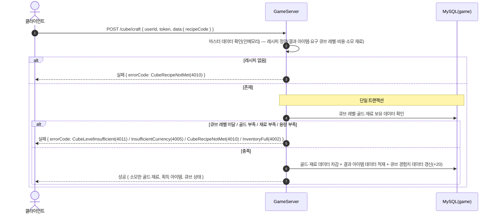
```mermaid
sequenceDiagram
    autonumber
    actor C as 클라이언트
    participant S as GameServer
    participant DB as MySQL(game)

    C->>S: POST /cube/craft { userId, token, data:{ recipeCode } }
    S->>S: 마스터 데이터 확인(인메모리) — 레시피 정의(결과 아이템·요구 큐브 레벨·비용·소모 재료)
    alt 레시피 없음
        S-->>C: 실패 { errorCode: CubeRecipeNotMet(4010) }
    else 존재
        Note over S,DB: 단일 트랜잭션
        S->>DB: 큐브 레벨·골드·재료 보유 데이터 확인
        alt 큐브 레벨 미달 / 골드 부족 / 재료 부족 / 용량 부족
            S-->>C: 실패 { errorCode: CubeLevelInsufficient(4011) / InsufficientCurrency(4005) / CubeRecipeNotMet(4010) / InventoryFull(4002) }
        else 충족
            S->>DB: 골드·재료 데이터 차감 + 결과 아이템 데이터 적재 + 큐브 경험치 데이터 갱신(+20)
            S-->>C: 성공 { 소모한 골드·재료, 획득 아이템, 큐브 상태 }
        end
    end
```

## 성장(스킬·룬)

성장 — 스킬 레벨업·초기화·액티브 장착·룬 업그레이드 (GameGrowthController, `/api/game/growth`, GameServer). 저장소: MySQL `taskbar_hero_game`(`player_skill`·`player_rune`·`player_character`·`player_item`) + 인메모리 마스터 데이터(skill·rune·level·rune_cost).

> 스킬 포인트는 저장값이 아니라 레벨별 스킬 포인트 정의에서 파생(레벨 기준 총량 − 사용량)한다.

### POST /api/game/growth/skill/levelup — 스킬 레벨업

```mermaid
sequenceDiagram
    autonumber
    actor C as 클라이언트
    participant S as GameServer
    participant DB as MySQL(game)

    C->>S: POST /skill/levelup { userId, token, data:{ characterId, skillCode } }
    S->>S: 마스터 데이터 확인(인메모리) — 스킬 정의(직업 소속·최대 레벨)
    alt 잘못된 대상 / 직업 불일치 / 최대 레벨
        S-->>C: 실패 { errorCode: InvalidGrowthTarget(5001) / SkillClassMismatch(5004) / SkillMaxLevel(5002) }
    else 유효
        Note over S,DB: 단일 트랜잭션
        S->>DB: 캐릭터 레벨·현재 스킬 레벨·사용 포인트 데이터 확인
        S->>S: 가용 스킬 포인트 계산(레벨 파생 총량 − 사용량)
        alt 포인트 부족
            S-->>C: 실패 { errorCode: InsufficientSkillPoint(5003) }
        else 충분
            S->>DB: 스킬 레벨 데이터 갱신(+1, 첫 습득이면 신규 적재)
            S-->>C: 성공 { 올린 레벨, 소모 포인트, 잔여 포인트 }
        end
    end
```

### POST /api/game/growth/skill/reset — 스킬 초기화

```mermaid
sequenceDiagram
    autonumber
    actor C as 클라이언트
    participant S as GameServer
    participant DB as MySQL(game)

    C->>S: POST /skill/reset { userId, token, data:{ characterId } }
    alt 잘못된 캐릭터
        S-->>C: 실패 { errorCode: InvalidCharacterId(2006) }
    else 유효
        Note over S,DB: 단일 트랜잭션(회수 후 총 포인트 산출은 서버가 수행)
        S->>DB: 해당 캐릭터 스킬 데이터 갱신(레벨 0·장착 해제 — 행 삭제 없이 포인트 전액 회수)
        S-->>C: 성공 { 초기화된 스킬 수, 잔여 포인트(전액 복구) }
    end
```

### POST /api/game/growth/skill/equip — 액티브 스킬 장착(0~2개)

```mermaid
sequenceDiagram
    autonumber
    actor C as 클라이언트
    participant S as GameServer
    participant DB as MySQL(game)

    C->>S: POST /skill/equip { userId, token, data:{ characterId, skillCodes[] } }
    S->>S: 마스터 데이터 확인(인메모리) — 스킬 정의(액티브 여부·직업)
    S->>S: 검증(액티브만·최대 2개·습득 레벨 ≥ 1)
    alt 한도 초과 / 미습득 / 패시브 / 직업 불일치
        S-->>C: 실패 { errorCode: ActiveSkillLimitExceeded(5007) / SkillNotLearned(5006) / SkillNotActive(5005) / SkillClassMismatch(5004) }
    else 유효
        Note over S,DB: 단일 트랜잭션
        S->>DB: 스킬 장착 데이터 재설정(전량 해제 후 요청 목록만 장착)
        S-->>C: 성공 { 장착된 스킬 목록 }
    end
```

### POST /api/game/growth/rune/upgrade — 룬 업그레이드(골드 소모)

```mermaid
sequenceDiagram
    autonumber
    actor C as 클라이언트
    participant S as GameServer
    participant DB as MySQL(game)

    C->>S: POST /rune/upgrade { userId, token, data:{ runeCode } }
    S->>S: 마스터 데이터 확인(인메모리) — 룬 정의(선행 룬·최대 레벨) + 현재 레벨의 업그레이드 비용 산출
    Note over S,DB: 단일 트랜잭션
    S->>DB: 현재 룬 레벨·선행 룬 레벨·골드 데이터 확인
    alt 선행 미충족 / 최대 레벨 / 골드 부족
        S-->>C: 실패 { errorCode: RunePrereqNotMet(5010) / RuneMaxLevel(5011) / InsufficientCurrency(4005) }
    else 유효
        S->>DB: 골드 데이터 차감 + 룬 레벨 데이터 갱신(+1, 첫 해금이면 신규 적재)
        S-->>C: 성공 { 올린 레벨, 소모 골드, 잔액 }
    end
```

## 거래소/교역선

판매 등록·목록 조회·구매·취소 (GameTradeController, `/api/game/trade`, GameServer)와 만료 배치(TradeExpireBatchService). 저장소: MySQL `taskbar_hero_game`(`trade_listing`·`player_item`·`player_mail`) + **Redis**(목록 캐시 `trade:index:{itemCode}`·`trade:listing:{listingId}`, 구매 락 `trade:lock:listing:{listingId}`) + 인메모리 마스터(item — `sellable`·`base_price`, mail 템플릿 201·202).

핵심 규약(trade 기획서 §4·§7):

- **에스크로** — 등록 즉시 아이템을 `player_item`에서 빼 `trade_listing` 스냅샷으로 옮긴다. 등록 중 아이템의 장착·분해·재등록은 대상이 없어 `ItemNotFound(4001)`.
- **정합성 2중화** — Redis 락은 몰린 요청을 DB 앞단에서 줄이는 **혼잡 제어**, MySQL 조건부 갱신(`status=1`일 때만 전이)은 **정합성 보증**이다. 락 TTL 만료·Redis 장애·배치 충돌에서도 조건부 갱신이 한 번만 팔리게 한다.
- **캐시는 파생 데이터** — 목록은 Redis로 응답하되 정합성 정본은 MySQL이다. 미적재·장애면 MySQL 폴백 후 lazy 적재하고, 캐시 갱신은 **항상 커밋 이후**에 한다.
- **거래 결과물은 전부 메일로** — 구매 아이템(구매자, 템플릿 203) · 판매 대금(판매자, 수수료 20% 차감, 템플릿 201) · 만료 반송 아이템(판매자, 템플릿 202)이 모두 우편함을 거친다. 지급 경로를 하나로 통일해 구매 시 인벤토리 용량을 보지 않아도 되고, 수령 이력이 메일 원장에 남는다. 첨부는 강화 단계를 보존한다. 수동 취소만 예외로 판매자 인벤토리에 직접 복원한다(요청자가 온라인).

### POST /api/game/trade/list — 거래소 목록 조회

```mermaid
sequenceDiagram
    autonumber
    actor C as 클라이언트
    participant S as GameServer
    participant R as Redis
    participant DB as MySQL(game)

    C->>S: POST /trade/list { userId, token, data:{ itemCode, mine, page, pageSize } }
    S->>S: 입력 정규화 — pageSize 상한 강제(기본 50 · 최대 100)
    S->>R: 가격순 색인 전량 조회(trade:index:{itemCode}) + 스냅샷 일괄 조회
    alt 캐시 적중(색인 + 스냅샷 전건 존재 = 완전 집합)
        R-->>S: listingId 전량 + 등록 스냅샷
        S->>S: 뷰어 필터(mine=false 본인 제외 / mine=true 본인만) + 가격·listingId 순 페이징 — 메모리
        S-->>C: 성공 { listings[], page, pageSize, hasMore }
    else 캐시 미적재·Redis 장애
        S->>DB: 뷰어 필터·페이징 없이 전량 조회(가격 오름차순·LIMIT 없음)
        DB-->>S: 등록 전량
        S->>R: 캐시 적재(lazy — 색인 + 스냅샷, TTL 3일)
        S->>S: 뷰어 필터(mine) + 페이징 — 메모리
        S-->>C: 성공 { listings[], page, pageSize, hasMore }
    end
```

- 조회는 상태를 바꾸지 않는다. 아이템 이름·등급은 클라이언트가 `itemCode`로 마스터 번들에서 조회해 표시한다.
- **캐시가 적재돼 있으면 두 모드 모두 DB를 타지 않는다.** 색인이 항상 완전 집합이고 스냅샷에 판매자가 들어 있어, 뷰어 필터와 페이징을 메모리에서 정확히 적용할 수 있다.
- **캐시가 비어 있으면 무조건 전량을 읽어 채운다.** 규모 확인용 건수 조회나 대형 집합용 별도 경로를 두지 않는다(이용자 수가 적어 판매중 등록이 페이지 상한 100건을 넘지 않는 규모를 전제).
- **메모리 필터는 완전 집합에서만 정확하다.** 부분 집합에 적용하면 `OFFSET`이 필터 전 기준이라 항목이 누락·중복된다. 그래서 적재용 조회에는 `LIMIT`을 걸지 않는다 — 잘라 읽으면 부분 집합이 완전 집합처럼 캐시돼 나머지 등록을 영구히 가린다. 전제가 깨져 전량이 상한을 넘으면 Warning 로그로 남긴다.

### POST /api/game/trade/register — 판매 등록(에스크로)

```mermaid
sequenceDiagram
    autonumber
    actor C as 클라이언트
    participant S as GameServer
    participant R as Redis
    participant DB as MySQL(game)

    C->>S: POST /trade/register { userId, token, data:{ itemId, price } }
    S->>R: 판매자 단위 락 획득(trade:lock:seller:{userId}, NX+TTL 3초)
    alt 경합으로 획득 실패
        S-->>C: 실패 { errorCode: TradeBusy(7008) }
    end
    Note over S,DB: 단일 트랜잭션
    S->>DB: 동시 등록 수 확인(trade_listing, seller_user_id + status=1)
    alt 판매중 등록 10개 이상
        S-->>C: 실패 { errorCode: TradeListingLimitExceeded(7007) }
    end
    S->>DB: 아이템 소유 확인(player_item) + 장착 여부 확인(player_item_equipped)
    alt 아이템 없음
        S-->>C: 실패 { errorCode: ItemNotFound(4001) }
    else 장착 중
        S-->>C: 실패 { errorCode: ItemEquipped(4007) }
    end
    S->>S: 마스터 검증(인메모리) — sellable=1 · 가격이 base_price ±20%
    alt 판매 불가 아이템
        S-->>C: 실패 { errorCode: TradeNotSellable(7002) }
    else 가격 범위 밖
        S-->>C: 실패 { errorCode: TradePriceOutOfRange(7006) }
    else 정상
        S->>DB: 인벤토리 아이템 데이터 제거(에스크로 이동, 스택형은 행 전체 수량)
        S->>DB: 등록 데이터 적재(trade_listing status=1, expires_at = now + 3일)
        S->>R: 커밋 후 캐시 추가(색인 2종 + 스냅샷)
        S-->>C: 성공 { listingId, itemCode, enhanceLevel, quantity, price }
    end
```

### POST /api/game/trade/buy — 구매

```mermaid
sequenceDiagram
    autonumber
    actor C as 클라이언트(구매자)
    participant S as GameServer
    participant R as Redis
    participant DB as MySQL(game)

    C->>S: POST /trade/buy { userId, token, data:{ listingId } }
    S->>R: 구매 락 획득(trade:lock:listing:{listingId}, SET NX + TTL 3초, 50ms 간격 2회 재시도)
    alt 락 경합(재시도 후에도 실패)
        S-->>C: 실패 { errorCode: TradeBusy(7008) }
    else 락 획득 또는 Redis 장애(축소 운전 — 락 없이 진행)
        Note over S,DB: 단일 트랜잭션
        S->>DB: 등록 조회(trade_listing)
        alt 등록 없음
            S-->>C: 실패 { errorCode: TradeListingNotFound(7001) }
        else 판매중 아님
            S-->>C: 실패 { errorCode: TradeAlreadyClosed(7005) }
        else 자기 등록
            S-->>C: 실패 { errorCode: TradeSelfPurchase(7004) }
        end
        S->>DB: 구매자 골드 확인(player_item 재화 행)
        alt 골드 부족
            S-->>C: 실패 { errorCode: InsufficientCurrency(4005) }
        end
        S->>DB: 선점(조건부 갱신) — status 1에서 2로, buyer_user_id·closed_at 기록
        alt 반영 0행(동시 구매자가 먼저 선점)
            S-->>C: 실패 { errorCode: TradeAlreadyClosed(7005) }
        else 선점 성공
            S->>DB: 구매자 골드 차감
            S->>DB: 구매 아이템 메일 데이터 적재(구매자, 템플릿 203, 무기한, 강화 단계 보존)
            S->>DB: 판매 대금 메일 데이터 적재(판매자, 템플릿 201, 판매가의 80%)
            S->>R: 커밋 후 캐시에서 등록 제거
            S-->>C: 성공 { listingId, gained, cost, balance, mailId }
        end
        S->>R: 락 해제(값이 자기 토큰일 때만)
    end
```

- **선점을 재화 이동보다 앞에 둔다** — 경합에서 진 요청이 골드·아이템을 건드리지 않고 즉시 빠진다.
- **구매 아이템도 우편함으로 지급한다.** 인벤토리에 직접 넣지 않으므로 구매 단계에서 용량을 검사하지 않으며(가방이 가득해도 거래 성립), 적재와 `InventoryFull(4002)` 판정은 메일 수령 시점으로 미뤄진다.
- **거래에서 발급되는 메일은 모두 만료가 없다**(`expires_at=0` — 구매 아이템 203 · 판매 대금 201 · 만료 반송 202). 거래로 확정된 재산을 수령 기한으로 잃지 않도록 하며, 보관 GC도 미수령 무기한 메일은 지우지 않는다.
- 메일 첨부는 **강화 단계를 보존**한다(`player_mail_reward.enhance_level`) — 등록 당시 강화가 구매자에게 그대로 전달된다.
- 수수료 20%는 어디에도 지급되지 않고 **경제에서 소멸**한다(sink).

### POST /api/game/trade/cancel — 판매 취소

```mermaid
sequenceDiagram
    autonumber
    actor C as 클라이언트(판매자)
    participant S as GameServer
    participant R as Redis
    participant DB as MySQL(game)

    C->>S: POST /trade/cancel { userId, token, data:{ listingId } }
    S->>R: 구매 락 획득(구매와 같은 키 — 같은 등록을 닫는 경로를 직렬화)
    alt 락 경합
        S-->>C: 실패 { errorCode: TradeBusy(7008) }
    else 락 획득
        Note over S,DB: 단일 트랜잭션
        S->>DB: 등록 조회(trade_listing)
        alt 등록 없음
            S-->>C: 실패 { errorCode: TradeListingNotFound(7001) }
        else 본인 등록 아님
            S-->>C: 실패 { errorCode: TradeNotOwner(7003) }
        else 판매중 아님
            S-->>C: 실패 { errorCode: TradeAlreadyClosed(7005) }
        else 정상
            S->>DB: 선점(조건부 갱신) — status 1에서 3(취소)으로
            S->>DB: 판매자 인벤토리에 아이템 데이터 복원(강화 단계 보존)
            alt 빈 칸 부족
                S-->>C: 실패 { errorCode: InventoryFull(4002) }
            end
            S->>R: 커밋 후 캐시에서 등록 제거
            S-->>C: 성공 { listingId, restored }
        end
        S->>R: 락 해제
    end
```

- 수동 취소는 요청자가 온라인이므로 **인벤토리로 직접 복원**한다(만료 반송은 메일 — 아래 참고).

### 거래소 만료 배치 — TradeExpireBatchService (엔드포인트 없음)

등록 후 3일이 지난 판매중 등록을 자동 취소하고 아이템을 판매자에게 메일로 반송한다(trade 기획서 7.6). GameServer 프로세스 내 `BackgroundService`(공통 골격 `PeriodicBatchService`)로, 기동 직후 1회 + 60초 주기(설정 `TradeExpireBatch`)로 실행되고 1회 최대 200건만 처리한다(초과분은 다음 주기 이월). 주기마다 Redis 리더 락(`batch:lock:trade-expire`)을 획득한 인스턴스만 실행한다.

```mermaid
sequenceDiagram
    autonumber
    participant S as GameServer
    participant R as Redis
    participant DB as MySQL(game)

    S->>R: 리더 락 획득(batch:lock:trade-expire, SET NX + TTL=주기)
    alt 미획득(다른 인스턴스가 실행 중)
        S->>S: 이번 주기 스킵
    else 획득
        S->>DB: 만료 대상 조회(trade_listing, status=1 이면서 expires_at 경과, 최대 200건)
        DB-->>S: listingId 목록
        loop 등록 1건씩
            S->>R: 구매 락 획득(trade:lock:listing:{listingId} — 구매·취소와 직렬화)
            alt 경합으로 실패
                S->>S: 스킵(다음 주기가 자연 재시도)
            else 획득 또는 Redis 장애
                Note over S,DB: 단일 트랜잭션
                S->>DB: 선점(조건부 갱신) — status 1에서 4(만료)로, 만료 조건 재확인
                alt 반영 0행(그 사이 구매·취소로 닫힘)
                    S->>S: 스킵
                else 선점 성공
                    S->>DB: 반송 스냅샷 조회 후 반송 메일 데이터 적재(판매자, 템플릿 202, 만료 없음)
                    S->>R: 커밋 후 캐시에서 등록 제거
                end
                S->>R: 락 해제
            end
        end
        S->>S: 요약 로그 1줄(처리 n건 / 스킵 s건 / 실패 f건)
    end
```

- **골드 이동은 없다.** 만료 반송은 에스크로 아이템을 메일 첨부로 되돌릴 뿐이다.
- 메일 첨부가 **강화 단계를 보존**하므로 반송 장비는 등록 당시 강화 단계 그대로 돌아온다(`player_mail_reward.enhance_level`).
- 건별 예외는 그 건만 실패로 세고 다음 건을 계속 처리한다(주기 전체를 중단하지 않는다).

## 메일

우편함 조회·첨부 수령·일괄 수령 (GameMailController, `/api/game/mail`, GameServer). 저장소: MySQL `taskbar_hero_game`(`player_mail`·`player_mail_reward`·`player_item`·`game_player`) + 인메모리 마스터 데이터(item — 첨부 적재 규칙). 첨부 종류·수량은 발급 시점에 확정된 메일 원장이 기준이며(서버 권위), 중복 수령은 조건부 갱신(`claimed` 0→1일 때만 전이)으로 차단한다. 보관(발급 후 7일)이 지난 메일은 GameServer 내 배치(`MailGcBatchService`)가 주기 삭제한다(엔드포인트 없음, mail 기획서 6.5).

### POST /api/game/mail/list — 우편함 조회(+읽음 처리)

```mermaid
sequenceDiagram
    autonumber
    actor C as 클라이언트
    participant S as GameServer
    participant DB as MySQL(game)

    C->>S: POST /mail/list { userId, token }
    Note over S,DB: 단일 트랜잭션
    S->>DB: 우편함 메일·첨부 데이터 확인(만료·수령 완료 포함 전건)
    DB-->>S: 메일 목록 스냅샷
    S->>DB: 미열람 메일 읽음 데이터 갱신(조회 = 열람)
    S-->>C: 성공 { mails[] — isRead는 조회 시점 값(신규 표시용) }
```

### POST /api/game/mail/claim — 메일 첨부 단건 수령

```mermaid
sequenceDiagram
    autonumber
    actor C as 클라이언트
    participant S as GameServer
    participant DB as MySQL(game)

    C->>S: POST /mail/claim { userId, token, data:{ mailId } }
    Note over S,DB: 단일 트랜잭션
    S->>DB: 메일 데이터 확인(존재·소유)
    alt 없음 / 타인 메일(존재 비노출)
        S-->>C: 실패 { errorCode: MailNotFound(8001) }
    else 이미 수령
        S-->>C: 실패 { errorCode: MailAlreadyClaimed(8002) }
    else 만료
        S-->>C: 실패 { errorCode: MailExpired(8003) }
    else 수령 가능
        S->>DB: 수령권 선점 — 수령 데이터 조건부 갱신(미수령일 때만 수령 완료로 전이)
        alt 반영 0행(동시 요청이 먼저 수령)
            S-->>C: 실패 { errorCode: MailAlreadyClaimed(8002) }
        else 선점 성공
            S->>DB: 첨부 원장 데이터 확인(클라이언트 입력 없음)
            S->>S: 마스터 데이터 확인(인메모리) — 첨부 아이템 적재 규칙(타입·스택 상한)
            S->>DB: 골드 재화 데이터 적립 + 아이템/재료 데이터 적재(스택 병합·빈 칸)
            alt 용량 초과(롤백 — 미수령 유지)
                S-->>C: 실패 { errorCode: InventoryFull(4002) }
            else 지급 완료
                S-->>C: 성공 { mailId, gained, balance }
            end
        end
    end
```

### POST /api/game/mail/claim-all — 일괄 수령

```mermaid
sequenceDiagram
    autonumber
    actor C as 클라이언트
    participant S as GameServer
    participant DB as MySQL(game)

    C->>S: POST /mail/claim-all { userId, token }
    Note over S,DB: 단일 트랜잭션
    S->>DB: 미수령·미만료 메일 데이터 확인
    loop 대상 메일별
        S->>DB: 수령권 선점 — 수령 데이터 조건부 갱신(경합 메일은 제외하고 계속)
    end
    S->>DB: 선점한 메일들의 첨부 원장 데이터 확인
    S->>S: 마스터 데이터 확인(인메모리) — 첨부 아이템 적재 규칙(타입·스택 상한)
    S->>DB: 골드 합계 데이터 적립 + 아이템/재료 데이터 적재(스택 병합·빈 칸)
    alt 용량 초과(전체 롤백 — 부분 수령 없음)
        S-->>C: 실패 { errorCode: InventoryFull(4002) }
    else 지급 완료(대상 없으면 빈 목록)
        S-->>C: 성공 { claimedMailIds[], gained(합계), balance }
    end
```

## 출석부 보상

출석 진행도 조회·오늘자 출석 보상 획득 (GameAttendanceController, `/api/game/attendance`, GameServer). 저장소: MySQL `taskbar_hero_game`(`player_attendance` **계정당 1행**·`player_mail`·`player_mail_reward`) + 인메모리 마스터 데이터(attendance — **일차별** 보상 1~30, mail 템플릿 301). "오늘"은 요청 수신 시점의 서버 시각을 **KST(UTC+9) 자정 경계**로 판정하며(서버 권위, 클라이언트 날짜 불신), 보상은 즉시 지급하지 않고 **메일(category=3, 발급 후 7일 만료)로 발급**한다 — 계정 반영은 우편함 수령(메일 5.2) 시. 일차는 `누적 출석일수 % 30 + 1`(30일 순환, 월 리셋 없음)이고, 하루 1회는 `last_attend_date` **조건부 갱신(CAS)** 이 보장한다(attendance 기획서 §5·§6).

> **일차 = 이번달 누적 출석 순번**(`이번달 출석 수 + 1`, 1~30). 날짜(day-of-month)가 아니므로 **7월 28일에 이번달 처음 접속해도 1일차 보상**을 받는다. 달이 바뀌면 집계 범위가 바뀌어 1일차로 리셋된다.

### POST /api/game/attendance/status — 이번달 출석 진행도 조회

```mermaid
sequenceDiagram
    autonumber
    actor C as 클라이언트
    participant S as GameServer
    participant DB as MySQL(game)

    C->>S: POST /attendance/status { userId, token }
    S->>S: 오늘/이번달 판정(서버 KST) — yearMonth·today
    S->>S: 마스터 데이터 확인(인메모리) — 일차별 보상 1~30(attendance_master)
    alt 마스터 미로드
        S-->>C: 실패 { errorCode: MasterDataNotLoaded(10001) }
    else 정상
        S->>DB: 출석 진행도 데이터 확인(player_attendance 1행 — 누적 출석일수·마지막 획득 일자)
        DB-->>S: 출석한 일자 목록
        S->>S: 진행도 산출 — attendedCount(=수령 완료 일차 수), todayDay(미수령이면 count+1, 소진 시 0), todayClaimed, canClaim
        S->>S: 사다리 구성 — 1~30일차 보상 + 수령 여부(claimed = day ≤ attendedCount)
        S-->>C: 성공 { yearMonth, today, attendedCount, todayDay, todayClaimed, canClaim, days[] }
    end
```

- 조회는 상태를 바꾸지 않는다(출석 처리 아님). 세이브가 없어도 빈 진행도(attendedCount=0)로 정상 응답한다. 다른 달 조회·과거일 소급 수령은 제공하지 않는다.

### POST /api/game/attendance/claim — 출석 보상 획득(메일 발급)

```mermaid
sequenceDiagram
    autonumber
    actor C as 클라이언트
    participant S as GameServer
    participant DB as MySQL(game)

    C->>S: POST /attendance/claim { userId, token }
    S->>S: 오늘 판정(서버 KST) — today(YYYYMMDD), 최대 일차(maxDay=30)
    S->>S: 마스터 데이터 확인(인메모리) — 메일 템플릿 301(mail_master)
    alt 마스터 미로드
        S-->>C: 실패 { errorCode: MasterDataNotLoaded(10001) }
    else 정상
        Note over S,DB: 단일 트랜잭션(일차 산출 ~ 메일 발급)
        S->>DB: 계정 세이브 데이터 확인(game_player)
        alt 세이브 없음(캐릭터 생성 전)
            S-->>C: 실패 { errorCode: SaveNotFound(2001) }
        end
        S->>DB: 출석 진행도 데이터 확인(player_attendance 1행)
        DB-->>S: attend_count, last_attend_date
        alt 마지막 획득 일자 = 오늘
            S-->>C: 실패 { errorCode: AttendanceAlreadyClaimed(9001) }
        else 오늘 미수령
            S->>S: 일차 산출 — day = (attend_count + 1 - 1) % maxDay + 1 (날짜 아님, 30일차 이후 1일차로 순환)
            S->>S: 일차 보상 확정(attendance_master[day]) + 보상 메일 초안 렌더링(만료 = 발급 + 7일)
            S->>DB: 진행도 조건부 갱신(attend_count + 1, last_attend_date = today · 관측한 last_attend_date일 때만)
            alt 0행(동시 요청이 먼저 처리)
                S-->>C: 실패 { errorCode: AttendanceAlreadyClaimed(9001) }
            end
            S->>DB: 보상 메일 데이터 적재(player_mail category=3 + player_mail_reward 1건)
            S-->>C: 성공 { attendDate, day, reward, mailId }
        end
    end
```

- 실제 재화·아이템 지급은 여기서 하지 않는다 — 플레이어가 우편함에서 수령(`/api/game/mail/claim`)할 때 계정에 반영된다([메일](#메일) 참고).

### 메일 보관 GC 배치 — MailGcBatchService (엔드포인트 없음)

발급(수신) 후 7일이 지난 메일을 열람·수령 여부와 무관하게 삭제한다(mail 기획서 6.5). GameServer 프로세스 내 `BackgroundService`(공통 골격 `PeriodicBatchService`)로, 기동 직후 1회 + 1시간 주기(설정 `MailGcBatch`)로 실행되고 1회 최대 500건만 처리한다(초과분은 다음 주기 이월). 주기마다 Redis 리더 락(`batch:lock:mail-gc`)을 먼저 획득한 인스턴스만 실행해 scale-out 시 중복 실행을 방지한다.

```mermaid
sequenceDiagram
    autonumber
    participant S as GameServer
    participant R as Redis
    participant DB as MySQL(game)

    Note over S: MailGcBatchService — 기동 직후 1회 실행 후 1시간 주기 반복(재진입 없음)
    loop 매 주기
        S->>R: 리더 락 시도(batch:lock:mail-gc, SET NX + TTL=주기 — 명시 해제 없이 자연 만료)
        alt 락 미획득(다른 인스턴스가 이번 주기 실행)
            S->>S: 스킵(Debug 로그)
        else 락 획득(Redis 장애 시에도 락 없이 진행 — 축소 운전)
            S->>S: 삭제 기준 시각 산출(now − 7일)
            S->>DB: 보관 기한 경과 메일 데이터 확인(발급 시각 기준, mail_id 오름차순 최대 500건)
            alt 대상 없음
                S->>S: 종료(로그 생략 — 소음 방지)
            else 대상 있음
                S->>DB: 메일 데이터 삭제(첨부 player_mail_reward는 FK CASCADE로 함께 삭제)
                S->>S: 요약 로그(삭제 N건)
            end
        end
    end
    Note over S: 주기 실행 실패는 Error 로그 후 루프 유지(다음 주기에 재시도)
```
