# 시퀀스 다이어그램 (기능별)

모든 API의 요청 처리 흐름을 [Mermaid](https://mermaid.js.org/syntax/sequenceDiagram.html) `sequenceDiagram`으로 **이 문서 하나에 기능별로** 정리한다. GitHub·VS Code(Mermaid 지원)에서 렌더링된다.

## 기능 목차

| 기능 | 처리 컨트롤러 | 서버 | 주요 엔드포인트 |
|---|---|---|---|
| [**로그인/인증**](#로그인인증) (회원가입·로그인·로그아웃·자동 로그인 검증) | AuthController | Account | `POST /api/auth/signup` · `login` · `logout` · `validate` |
| [**세이브 데이터/캐릭터 생성**](#세이브-데이터캐릭터-생성) (코어 로드 · 가방 페이지 조회 · 생성 · 파티 편성 저장 · heartbeat) | GameSaveController · GameInventoryController(가방 조회) | Game | `POST /api/game/load` · `inventory/list` · `create-character` · `party/arrange` · `update-last-active` |
| [**스테이지**](#스테이지) (던전 입장·클리어 보상·실패 보고) | GameStageController | Game | `POST /api/game/stage/enter` · `clear` · `fail` |
| [**방치형 오프라인 보상**](#방치형-오프라인-보상) | GameOfflineController | Game | `POST /api/game/offline/claim` |
| [**인벤토리/아이템**](#인벤토리아이템) (장착·해제·강화·배치·용량 확장. 가방 조회는 세이브 데이터 섹션) | GameInventoryController | Game | `POST /api/game/inventory/equip` · `unequip` · `enhance` · `move` · `expand` |
| [**소모품/버프**](#소모품버프) (소모품 사용 → 경험치·골드 획득량 버프 부여·연장, 적용 중인 버프 조회) | GameConsumableController | Game | `POST /api/game/consumable/use`, `POST /api/game/consumable/buffs` |
| [**큐브**](#큐브) (합성 / 분해=연금술 / 제작) | GameCubeController | Game | `POST /api/game/cube/combine` · `dismantle` · `craft` |
| [**가챠**](#가챠뽑기) (배너 조회 / 뽑기 1연·10연 / 뽑기 기록 조회) | GameGachaController | Game | `POST /api/game/gacha/banners` · `pull` · `history` |
| [**성장**](#성장스킬룬) (스킬 레벨업·초기화·장착 / 룬 업그레이드) | GameGrowthController | Game | `POST /api/game/growth/skill/levelup` · `skill/reset` · `skill/equip` · `rune/upgrade` |
| [**거래소/교역선**](#거래소교역선) (목록 조회=본인 제외·mine 옵션 / 판매 등록=에스크로 / 구매 / 취소(status 3) / 만료 배치(status 4)) | GameTradeController · TradeExpireBatchScheduler(BatchServer 배치) | Game | `POST /api/game/trade/list` · `register` · `buy` · `cancel` |
| [**메일**](#메일) (우편함 조회 / 첨부 수령 / 일괄 수령 / 보관 GC 배치) | GameMailController · MailGcBatchScheduler(BatchServer 배치) | Game | `POST /api/game/mail/list` · `claim` · `claim-all` |
| [**출석부 보상**](#출석부-보상) (이번달 진행도 조회 / 오늘자 보상 획득→메일 발급, 일차 = 누적 출석 순번 1~30) | GameAttendanceController | Game | `POST /api/game/attendance/status` · `claim` |
| [**보스러시/랭킹**](#보스러시랭킹) (정보 조회 / 도전 시작 / 클리어 보고=클라 측정 시간 기록 / 랭킹 목록 / 내 순위 / 랭킹 캐시 적재=관리 API / 시즌 정산 배치) | GameBossRushController · AdminBossRushController · BossRushSeasonBatchScheduler(BatchServer 배치) | Game | `POST /api/game/boss-rush/info` · `enter` · `clear` · `rank` · `my-rank` · `POST /api/admin/boss-rush/rank/warmup` |

> **가방 변경분 공통 규약(`inventoryDelta`)** — 가방을 바꾸는 액션(`cube/*`·`gacha/pull`·`consumable/use`·`mail/claim`·`mail/claim-all`·`stage/clear`·`trade/register`·`trade/cancel`)은 변경분을 응답에 담는다. 클라이언트는 응답만으로 가방을 갱신하며 **액션 뒤에 `/load`·`/inventory/list`를 재조회하지 않는다**([인벤토리/아이템/큐브 기획서](../docs/세부/inventory-item-cube-기획서.md) 5.0).
>
> - **서버는 가방을 캐시하지 않는다.** 커밋으로 끝이며 커밋 후 갱신할 Redis 스냅샷이 없다(같은 문서 6.5). 아래 다이어그램에서 클라이언트 쪽 반영은 `C->>C: 응답으로 캐시 반영(재조회 없음)`으로 줄여 표기한다.
> - 클라이언트는 `removed` → `upserted` 순으로 `itemId`를 키 삼아 적용하며(멱등), **서버가 응답한 `slot`이 최종 위치**다(스택 병합·빈 칸 배정은 서버 권위). 재화는 각 응답의 `balance`, 큐브 상태는 `cube`가 담당한다.
> - **`inventory/equip`·`unequip`·`enhance`·`move`는 응답에 `inventoryDelta`를 담지 않는다.** 바뀐 내용이 `equipped`/`unequipped`/`unequippedBagSlot`/`bagSlot`/`enhanceLevel`/`moved`/`swapped`로 이미 특정되므로 클라이언트는 그 필드로 캐시를 옮긴다.
> - 재조회가 남아 있는 경우는 두 가지뿐이다 — **가방을 보여주는 화면을 열 때**(창고·큐브·거래 판매 탭 → `inventory/list`)와 **캐시가 서버와 어긋났을 때**(`ItemNotFound(4001)`·배치 이동 저장 실패 → `inventory/list` 1회).

## 공통 아키텍처

- **계층**: `Controller`(HTTP 액션) → `Service`(검증·규칙·RNG) → `Repository`(SqlKata + MySqlConnector) → **MySQL**. 정적 수치는 `MasterDbProvider`(기동 시 마스터 DB에서 인메모리 적재)로 조회한다.
  - 단, 시퀀스 다이어그램은 이 내부 계층을 **하나의 서버 참여자로 요약**한다(아래 「참여자 표기」 참고).
- **응답 형식**: 모든 API가 `{ success, errorCode, message, data }`. `success == (errorCode == 0)`. 에러 코드는 `TaskbarHero.Common.ErrorCode`(서버-클라 공유 계약).
- **DB(3종)**: `taskbar_hero_account`(계정), `taskbar_hero_game`(세이브/진행), `taskbar_hero_master`(마스터, 인메모리 적재 원본). **Redis**: 인증 토큰(`auth:token:{userId}`).
- **인증(GameServer 전용)**: `/api/game/*` 요청은 `GameAuthMiddleware`가 body의 `userId`·`token`을 읽어 Redis 토큰과 대조한다. 실패 시 401. 성공 시 `userId`를 컨트롤러로 전달한다. AccountServer의 `signup`·`login`은 무인증, `logout`은 서버가 토큰을 대조한다.
  - 이 미들웨어 검증은 각 기능의 주요 로직이 아니므로 **모든 시퀀스 다이어그램에서 생략**하고, 인증된 `userId`로 처리가 시작된 이후부터 표기한다.
- **트랜잭션**: 재화·상태 변경은 `user_id` 단위 단일 트랜잭션으로 원자적으로 반영한다(중도 실패 시 롤백).

## 참여자 표기

다이어그램은 **프로세스 단위**로 참여자를 둔다. 서버 내부의 `Controller`·`Service`·`Repository`·`Cache`는 하나의 서버 참여자로 합쳐, 기능 흐름(무엇을 검증하고 무엇을 저장하는가)이 계층 왕복에 묻히지 않게 한다.

| 참여자 | 의미 |
|---|---|
| `클라이언트` | Unity 클라이언트(actor) |
| `AccountServer` | 계정/인증 서버 프로세스(컨트롤러·서비스·리포지토리·토큰 캐시 포함) |
| `GameServer` | 게임 로직 서버 프로세스(컨트롤러·서비스·리포지토리 포함) |
| `BatchServer` | 주기 배치 전담 워커 프로세스(HTTP 없음, 1대 고정). 배치 다이어그램의 서버 참여자는 이쪽이다 |
| `MySQL(account)` / `MySQL(game)` | 각 서버가 쓰는 MySQL 스키마 |
| `Redis` | 인증 토큰 캐시(`auth:token:{userId}`) |

- **마스터 데이터**는 서버 프로세스 안의 인메모리 구조(`MasterDbProvider`)이므로 별도 참여자로 두지 않고 **서버 자기호출**(`S->>S: 마스터 데이터 확인(인메모리) — ...`)로 표기한다. 검증·계산 등 서버 내부 판정도 같은 방식이다.
- 서버 계층 구조의 정본은 코드와 위 「공통 아키텍처」이며, 어느 클래스가 무엇을 하는지는 다이어그램이 아니라 코드/XML 주석에서 확인한다.

## 범례

- `alt`/`opt` 블록은 분기(에러/조건)를 나타낸다. 각 다이어그램은 대표 경로 중심이며, 세부 에러 코드는 해당 기획서를 정본으로 한다.
- **응답 표기**: 서버 → 클라이언트 응답은 `성공 { ... }` / `실패 { errorCode: ... }`로 줄여 쓴다. 실제 전문은 항상 공통 응답 형식 `{ success, errorCode, message, data }`이며, 중괄호 안은 그중 핵심 필드만 나타낸다. `errorCode`(예: `StageNotFound(6001)`)는 클라이언트와 공유하는 계약이므로 코드명을 그대로 쓴다.
- **저장소 접근 표기**: DB·Redis로 향하는 화살표는 SQL/명령문(`SELECT`·`INSERT`·`UPDATE`·`DELETE` 등)을 쓰지 않고 「~ 데이터 확인 / 적재 / 갱신 / 차감 / 삭제」처럼 수행하는 일로 표기한다. 실제 쿼리는 각 리포지토리 코드와 그 XML 주석을 정본으로 한다.
- **호출 표기**: 화살표 라벨에 메서드명(`EnterAsync`·`GetStage` 등)을 쓰지 않고 「스테이지 진입 처리」처럼 그 호출이 무엇을 하는지로 표기한다.
- **트랜잭션 경계**는 `Note over S,DB: 단일 트랜잭션`으로 표기한다.

---

## 로그인/인증

계정/인증 (AuthController, `/api/auth`, AccountServer). `signup`·`login`은 **무인증**, `logout`·`validate`는 서버가 토큰을 대조한다. 저장소: MySQL `taskbar_hero_account`(`users`·`user_auth_token`) + Redis(`auth:token:{userId}`).

### POST /api/auth/signup — 회원가입

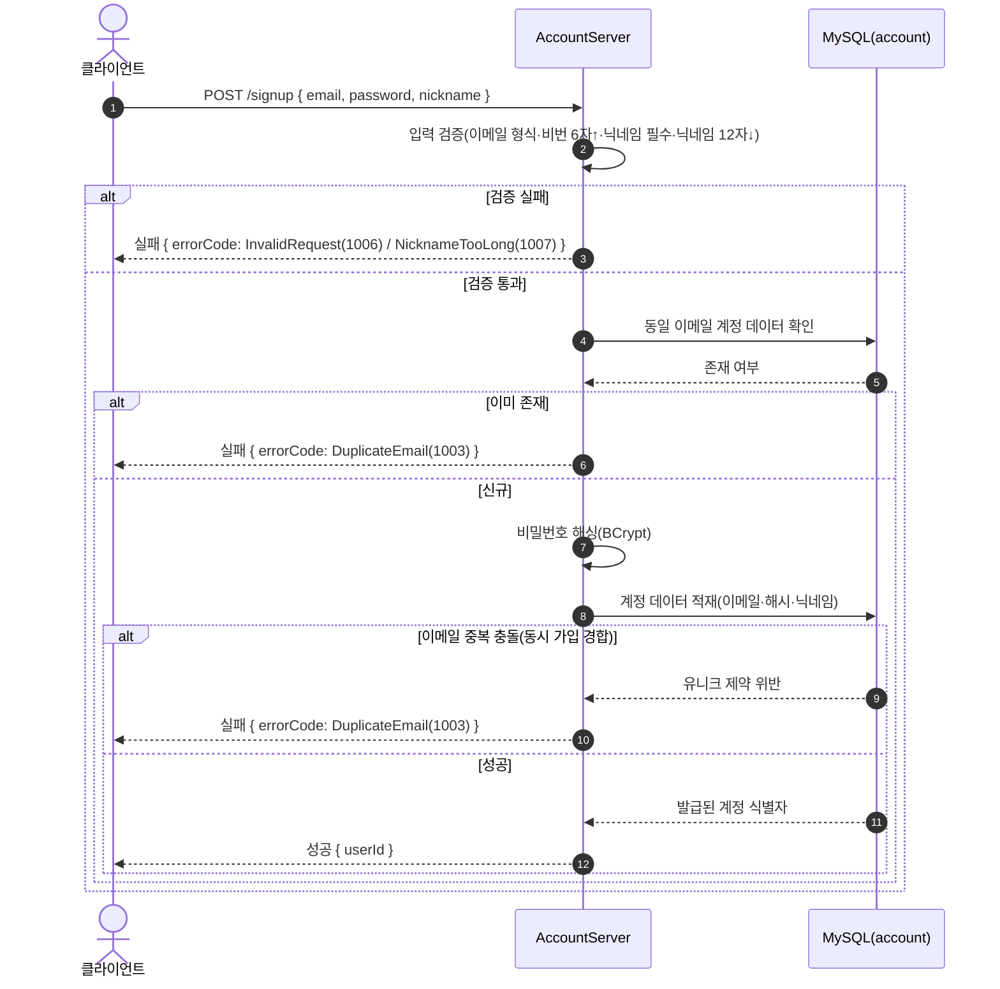
```mermaid
sequenceDiagram
    autonumber
    actor C as 클라이언트
    participant S as AccountServer
    participant DB as MySQL(account)

    C->>S: POST /signup { email, password, nickname }
    S->>S: 입력 검증(이메일 형식·비번 6자↑·닉네임 필수·닉네임 12자↓)
    alt 검증 실패
        S-->>C: 실패 { errorCode: InvalidRequest(1006) / NicknameTooLong(1007) }
    else 검증 통과
        S->>DB: 동일 이메일 계정 데이터 확인
        DB-->>S: 존재 여부
        alt 이미 존재
            S-->>C: 실패 { errorCode: DuplicateEmail(1003) }
        else 신규
            S->>S: 비밀번호 해싱(BCrypt)
            S->>DB: 계정 데이터 적재(이메일·해시·닉네임)
            alt 이메일 중복 충돌(동시 가입 경합)
                DB-->>S: 유니크 제약 위반
                S-->>C: 실패 { errorCode: DuplicateEmail(1003) }
            else 성공
                DB-->>S: 발급된 계정 식별자
                S-->>C: 성공 { userId }
            end
        end
    end
```

### POST /api/auth/login — 로그인(토큰 발급)

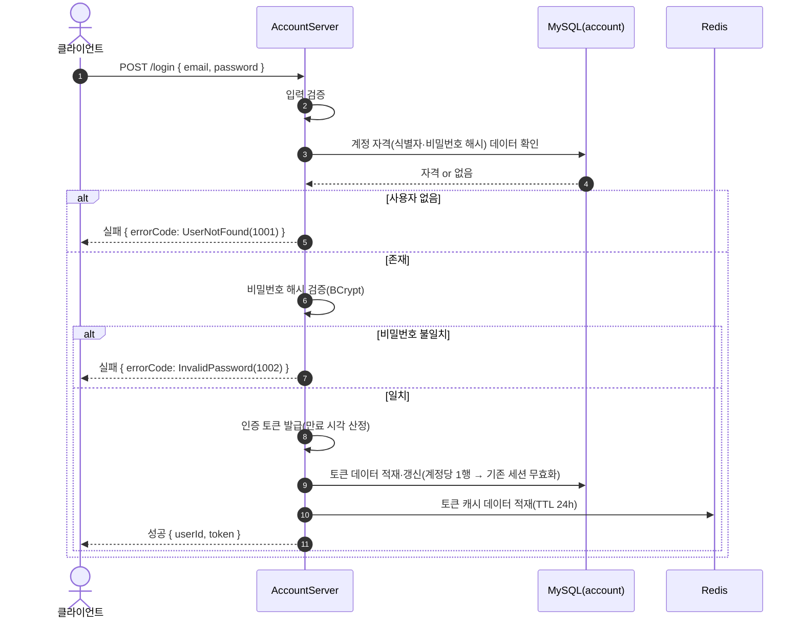
```mermaid
sequenceDiagram
    autonumber
    actor C as 클라이언트
    participant S as AccountServer
    participant DB as MySQL(account)
    participant Redis as Redis

    C->>S: POST /login { email, password }
    S->>S: 입력 검증
    S->>DB: 계정 자격(식별자·비밀번호 해시) 데이터 확인
    DB-->>S: 자격 or 없음
    alt 사용자 없음
        S-->>C: 실패 { errorCode: UserNotFound(1001) }
    else 존재
        S->>S: 비밀번호 해시 검증(BCrypt)
        alt 비밀번호 불일치
            S-->>C: 실패 { errorCode: InvalidPassword(1002) }
        else 일치
            S->>S: 인증 토큰 발급(만료 시각 산정)
            S->>DB: 토큰 데이터 적재·갱신(계정당 1행 → 기존 세션 무효화)
            S->>Redis: 토큰 캐시 데이터 적재(TTL 24h)
            S-->>C: 성공 { userId, token }
        end
    end
```

### POST /api/auth/logout — 로그아웃(토큰 무효화)

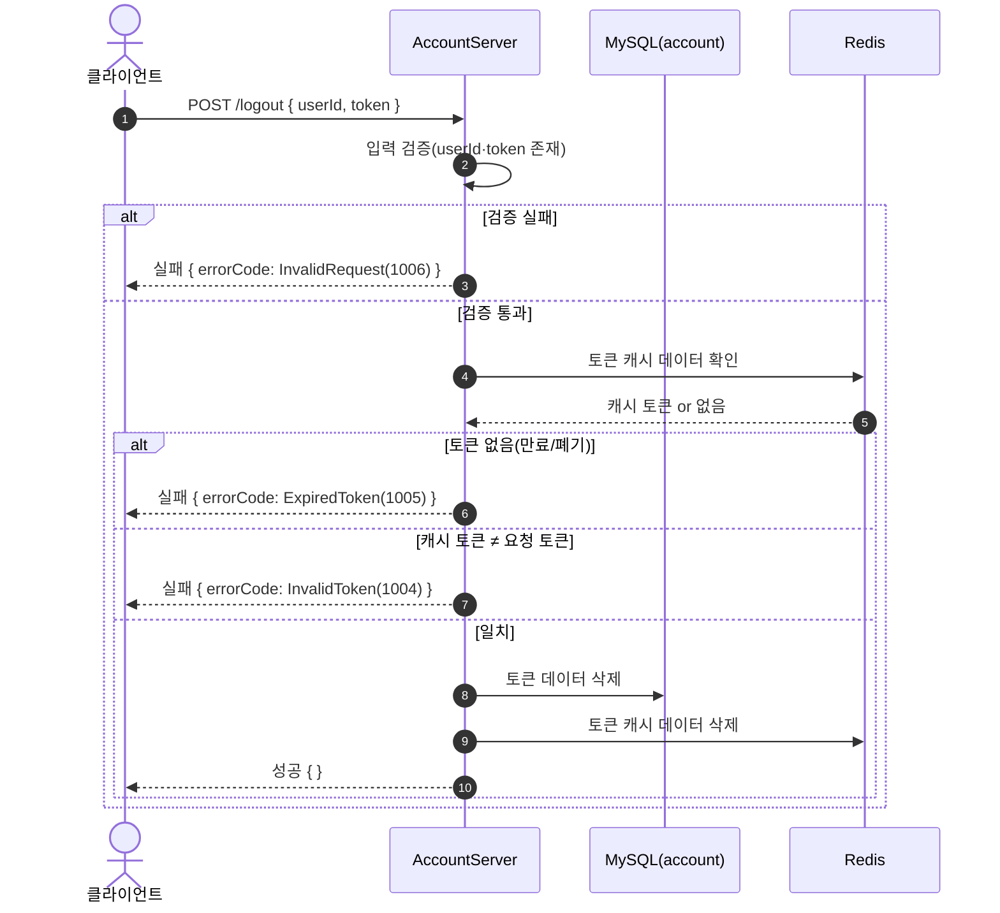
```mermaid
sequenceDiagram
    autonumber
    actor C as 클라이언트
    participant S as AccountServer
    participant DB as MySQL(account)
    participant Redis as Redis

    C->>S: POST /logout { userId, token }
    S->>S: 입력 검증(userId·token 존재)
    alt 검증 실패
        S-->>C: 실패 { errorCode: InvalidRequest(1006) }
    else 검증 통과
        S->>Redis: 토큰 캐시 데이터 확인
        Redis-->>S: 캐시 토큰 or 없음
        alt 토큰 없음(만료/폐기)
            S-->>C: 실패 { errorCode: ExpiredToken(1005) }
        else 캐시 토큰 ≠ 요청 토큰
            S-->>C: 실패 { errorCode: InvalidToken(1004) }
        else 일치
            S->>DB: 토큰 데이터 삭제
            S->>Redis: 토큰 캐시 데이터 삭제
            S-->>C: 성공 { }
        end
    end
```

- 토큰 대조 판정은 자동 로그인 검증(아래)과 **같은 로직을 공유**한다 — 입력 검증 → Redis 값 없음(만료/폐기) → 값 불일치(다른 기기 로그인으로 밀려남)까지 세 분기가 동일하고, 통과 이후의 삭제 처리만 로그아웃 고유다.

### POST /api/auth/validate — 자동 로그인 검증

타이틀 화면이 저장해 둔 직전 세션을 그대로 쓸 수 있는지 확인한다. **읽기 전용**이라 토큰을 재발급하지도 TTL을 연장하지도 않으며, MySQL도 조회하지 않는다(인증의 기준이 Redis 토큰값이다 — [계정/로그인 기획서](../docs/세부/account-login-기획서.md) 5.4).

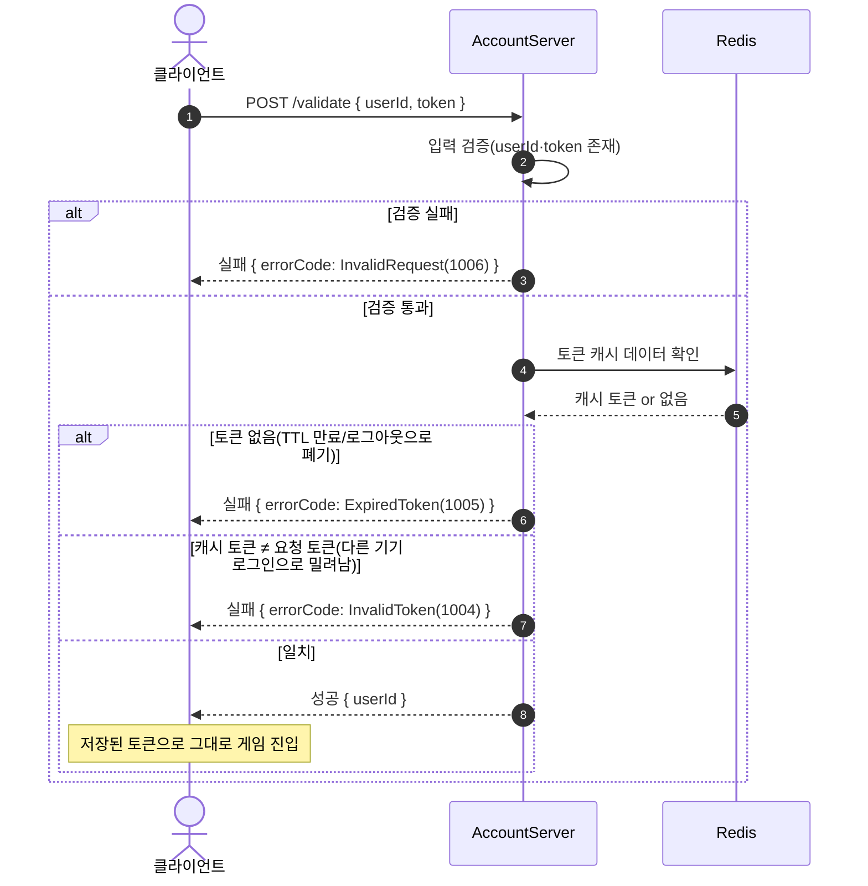
```mermaid
sequenceDiagram
    autonumber
    actor C as 클라이언트
    participant S as AccountServer
    participant Redis as Redis

    C->>S: POST /validate { userId, token }
    S->>S: 입력 검증(userId·token 존재)
    alt 검증 실패
        S-->>C: 실패 { errorCode: InvalidRequest(1006) }
    else 검증 통과
        S->>Redis: 토큰 캐시 데이터 확인
        Redis-->>S: 캐시 토큰 or 없음
        alt 토큰 없음(TTL 만료/로그아웃으로 폐기)
            S-->>C: 실패 { errorCode: ExpiredToken(1005) }
        else 캐시 토큰 ≠ 요청 토큰(다른 기기 로그인으로 밀려남)
            S-->>C: 실패 { errorCode: InvalidToken(1004) }
        else 일치
            S-->>C: 성공 { userId }
            Note over C: 저장된 토큰으로 그대로 게임 진입
        end
    end
```

## 세이브 데이터/캐릭터 생성

세이브 로드·캐릭터 생성·파티 편성 저장·접속 시각 갱신 (GameSaveController, `/api/game`, GameServer). 저장소: MySQL `taskbar_hero_game`(`game_player`·`player_character`·`player_item`·`player_cube` 등).

### POST /api/game/load — 코어 세이브 로드

크기가 고정된 데이터만 한 번에 내려준다. 무한히 커질 수 있는 가방 아이템은 여기 없고 `/api/game/inventory/list`로 지연 로딩한다(세이브 데이터 기획서 2장). 장착 장비는 최대 18행으로 고정이고 캐릭터 스탯 계산의 입력이라 코어에 포함해, 가방 로딩 없이도 전투를 시작할 수 있다.

**호출 시점은 접속 계열뿐이다** — 로그인 직후와 캐릭터 생성 직후. 인벤토리·큐브·거래·메일·룬 등 액션 뒤에는 호출하지 않는다. 바뀐 값(가방 변경분·재화 잔액·큐브 상태·룬 레벨)이 각 액션 응답에 들어 있어 클라이언트가 그것만 캐시에 반영하기 때문이다(위 「가방 변경분 공통 규약」).

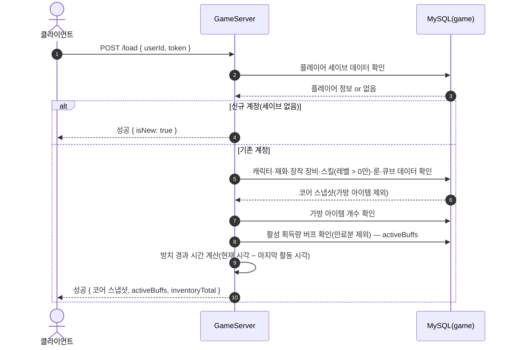
```mermaid
sequenceDiagram
    autonumber
    actor C as 클라이언트
    participant S as GameServer
    participant DB as MySQL(game)

    C->>S: POST /load { userId, token }
    S->>DB: 플레이어 세이브 데이터 확인
    DB-->>S: 플레이어 정보 or 없음
    alt 신규 계정(세이브 없음)
        S-->>C: 성공 { isNew: true }
    else 기존 계정
        S->>DB: 캐릭터·재화·장착 장비·스킬(레벨 > 0만)·룬·큐브 데이터 확인
        DB-->>S: 코어 스냅샷(가방 아이템 제외)
        S->>DB: 가방 아이템 개수 확인
        S->>DB: 활성 획득량 버프 확인(만료분 제외) — activeBuffs
        S->>S: 방치 경과 시간 계산(현재 시각 − 마지막 활동 시각)
        S-->>C: 성공 { 코어 스냅샷, activeBuffs, inventoryTotal }
    end
```

### POST /api/game/inventory/list — 가방 아이템 페이지 조회

창고/인벤토리 UI를 **열 때마다** 호출한다(자동 전투 전리품이 계속 적재되므로 클라 로컬 캐시를 신뢰하지 않는다). 이 조회는 **캐시 없이 MySQL을 직접 읽는다** — `cursor`·`limit`을 그대로 질의로 넘겨 `(user_id, slot)` 유니크 인덱스로 필요한 구간만 읽는다(조인 없음·filesort 없음, 인벤토리/아이템/큐브 기획서 6.5). 읽기 전용이라 트랜잭션으로 묶지 않는다.

**계정 세이브 확인은 총 칸 수가 0일 때만 한다.** `player_item`이 `game_player`에 FK(`ON DELETE CASCADE`)로 매달려 있어 세이브 없이 아이템 행이 존재할 수 없으므로, 가방에 한 행이라도 있으면 세이브 존재가 이미 증명된다. 응답은 확인을 먼저 하던 때와 동일하고 정상 경로의 DB 왕복만 3회에서 2회로 준다([쿼리 분석](../docs/공통/쿼리-분석.md) 5.4).

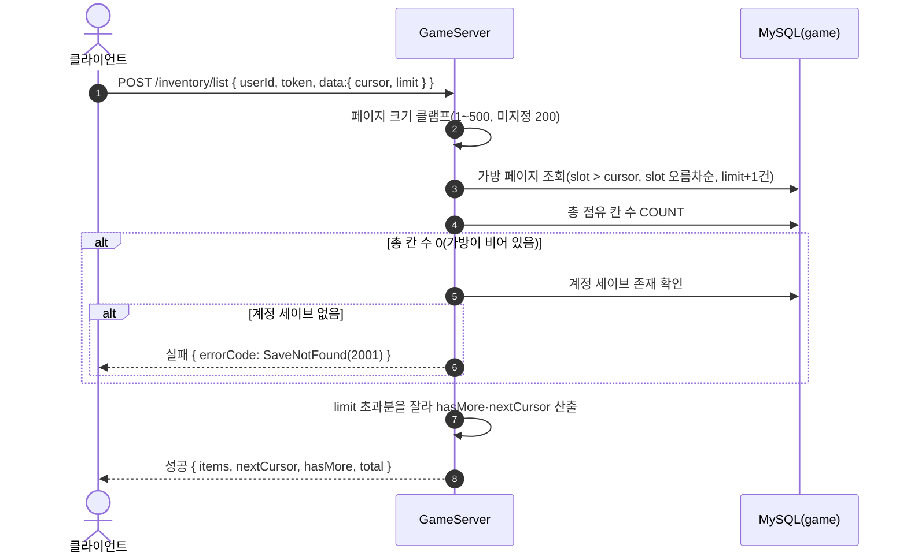
```mermaid
sequenceDiagram
    autonumber
    actor C as 클라이언트
    participant S as GameServer
    participant DB as MySQL(game)

    C->>S: POST /inventory/list { userId, token, data:{ cursor, limit } }
    S->>S: 페이지 크기 클램프(1~500, 미지정 200)
    S->>DB: 가방 페이지 조회(slot > cursor, slot 오름차순, limit+1건)
    S->>DB: 총 점유 칸 수 COUNT
    alt 총 칸 수 0(가방이 비어 있음)
        S->>DB: 계정 세이브 존재 확인
        alt 계정 세이브 없음
            S-->>C: 실패 { errorCode: SaveNotFound(2001) }
        end
    end
    S->>S: limit 초과분을 잘라 hasMore·nextCursor 산출
    S-->>C: 성공 { items, nextCursor, hasMore, total }
```

### POST /api/game/create-character — 캐릭터 생성

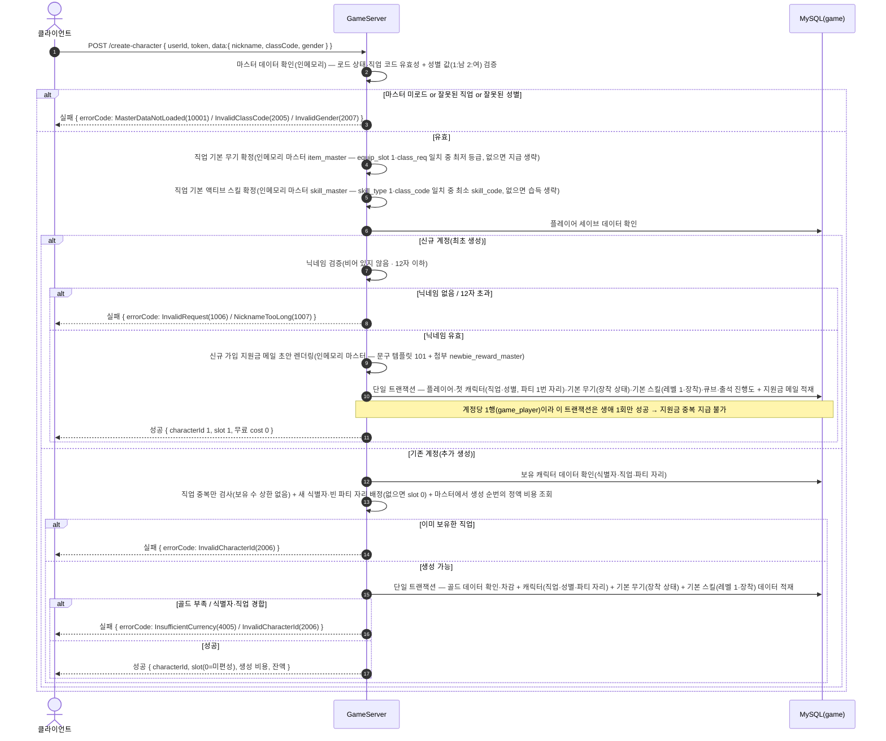
```mermaid
sequenceDiagram
    autonumber
    actor C as 클라이언트
    participant S as GameServer
    participant DB as MySQL(game)

    C->>S: POST /create-character { userId, token, data:{ nickname, classCode, gender } }
    S->>S: 마스터 데이터 확인(인메모리) — 로드 상태·직업 코드 유효성 + 성별 값(1:남 2:여) 검증
    alt 마스터 미로드 or 잘못된 직업 or 잘못된 성별
        S-->>C: 실패 { errorCode: MasterDataNotLoaded(10001) / InvalidClassCode(2005) / InvalidGender(2007) }
    else 유효
        S->>S: 직업 기본 무기 확정(인메모리 마스터 item_master — equip_slot 1·class_req 일치 중 최저 등급, 없으면 지급 생략)
        S->>S: 직업 기본 액티브 스킬 확정(인메모리 마스터 skill_master — skill_type 1·class_code 일치 중 최소 skill_code, 없으면 습득 생략)
        S->>DB: 플레이어 세이브 데이터 확인
        alt 신규 계정(최초 생성)
            S->>S: 닉네임 검증(비어 있지 않음 · 12자 이하)
            alt 닉네임 없음 / 12자 초과
                S-->>C: 실패 { errorCode: InvalidRequest(1006) / NicknameTooLong(1007) }
            else 닉네임 유효
                S->>S: 신규 가입 지원금 메일 초안 렌더링(인메모리 마스터 — 문구 템플릿 101 + 첨부 newbie_reward_master)
                S->>DB: 단일 트랜잭션 — 플레이어·첫 캐릭터(직업·성별, 파티 1번 자리)·기본 무기(장착 상태)·기본 스킬(레벨 1·장착)·큐브·출석 진행도 + 지원금 메일 적재
                Note over S,DB: 계정당 1행(game_player)이라 이 트랜잭션은 생애 1회만 성공 → 지원금 중복 지급 불가
                S-->>C: 성공 { characterId 1, slot 1, 무료 cost 0 }
            end
        else 기존 계정(추가 생성)
            S->>DB: 보유 캐릭터 데이터 확인(식별자·직업·파티 자리)
            S->>S: 직업 중복만 검사(보유 수 상한 없음) + 새 식별자·빈 파티 자리 배정(없으면 slot 0) + 마스터에서 생성 순번의 정액 비용 조회
            alt 이미 보유한 직업
                S-->>C: 실패 { errorCode: InvalidCharacterId(2006) }
            else 생성 가능
                S->>DB: 단일 트랜잭션 — 골드 데이터 확인·차감 + 캐릭터(직업·성별·파티 자리) + 기본 무기(장착 상태) + 기본 스킬(레벨 1·장착) 데이터 적재
                alt 골드 부족 / 식별자·직업 경합
                    S-->>C: 실패 { errorCode: InsufficientCurrency(4005) / InvalidCharacterId(2006) }
                else 성공
                    S-->>C: 성공 { characterId, slot(0=미편성), 생성 비용, 잔액 }
                end
            end
        end
    end
```

### POST /api/game/party/arrange — 파티 편성 저장(스냅샷)

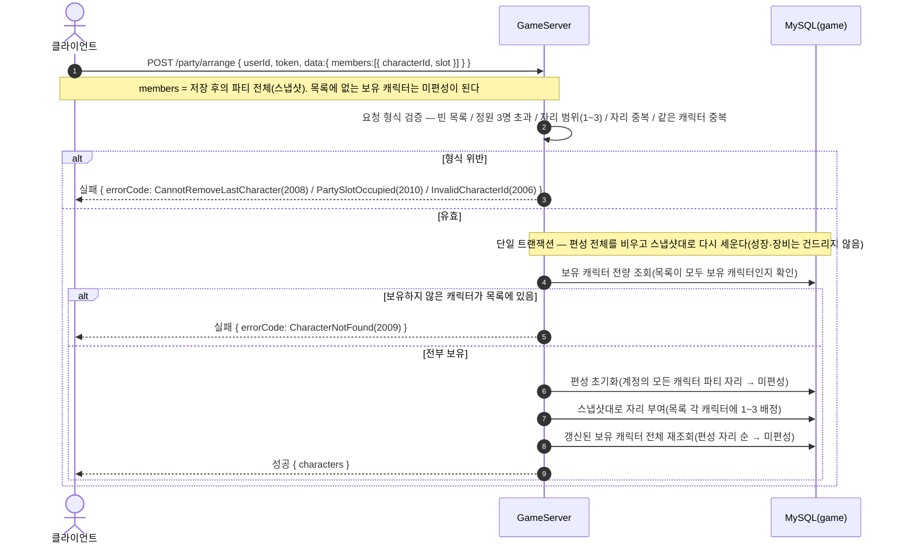
```mermaid
sequenceDiagram
    autonumber
    actor C as 클라이언트
    participant S as GameServer
    participant DB as MySQL(game)

    C->>S: POST /party/arrange { userId, token, data:{ members:[{ characterId, slot }] } }
    Note over C,S: members = 저장 후의 파티 전체(스냅샷). 목록에 없는 보유 캐릭터는 미편성이 된다
    S->>S: 요청 형식 검증 — 빈 목록 / 정원 3명 초과 / 자리 범위(1~3) / 자리 중복 / 같은 캐릭터 중복
    alt 형식 위반
        S-->>C: 실패 { errorCode: CannotRemoveLastCharacter(2008) / PartySlotOccupied(2010) / InvalidCharacterId(2006) }
    else 유효
        Note over S,DB: 단일 트랜잭션 — 편성 전체를 비우고 스냅샷대로 다시 세운다(성장·장비는 건드리지 않음)
        S->>DB: 보유 캐릭터 전량 조회(목록이 모두 보유 캐릭터인지 확인)
        alt 보유하지 않은 캐릭터가 목록에 있음
            S-->>C: 실패 { errorCode: CharacterNotFound(2009) }
        else 전부 보유
            S->>DB: 편성 초기화(계정의 모든 캐릭터 파티 자리 → 미편성)
            S->>DB: 스냅샷대로 자리 부여(목록 각 캐릭터에 1~3 배정)
            S->>DB: 갱신된 보유 캐릭터 전체 재조회(편성 자리 순 → 미편성)
            S-->>C: 성공 { characters }
        end
    end
```

### POST /api/game/update-last-active — 접속 시각 갱신(heartbeat)

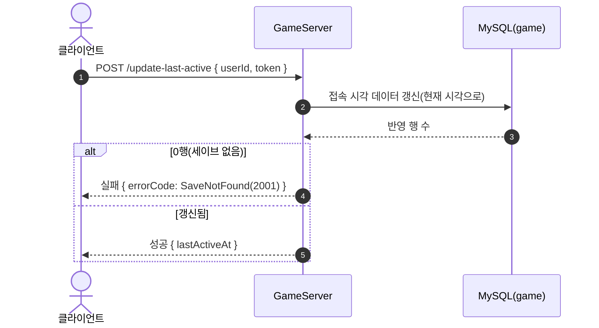
```mermaid
sequenceDiagram
    autonumber
    actor C as 클라이언트
    participant S as GameServer
    participant DB as MySQL(game)

    C->>S: POST /update-last-active { userId, token }
    S->>DB: 접속 시각 데이터 갱신(현재 시각으로)
    DB-->>S: 반영 행 수
    alt 0행(세이브 없음)
        S-->>C: 실패 { errorCode: SaveNotFound(2001) }
    else 갱신됨
        S-->>C: 성공 { lastActiveAt }
    end
```

## 스테이지

스테이지 진입·클리어(서버 권위 보상 산출)·실패 보고 (GameStageController, `/api/game/stage`, GameServer). 저장소: MySQL `taskbar_hero_game`(`game_player`·`player_item`·`player_character`·`player_buff`) + 인메모리 마스터 데이터(stage/reward/level/item).

**클리어 보상에는 활성 획득량 버프 배율이 곱해진다.** 소모품 부스터([소모품/버프](#소모품버프) 섹션)로 부여된 배율을 **지급과 같은 트랜잭션에서** 읽어(만료분 제외) 골드·경험치에 적용하고, 응답에는 배율이 반영된 최종 지급액을 담는다. 오프라인 정산에는 적용하지 않는다.

### POST /api/game/stage/enter — 스테이지 진입

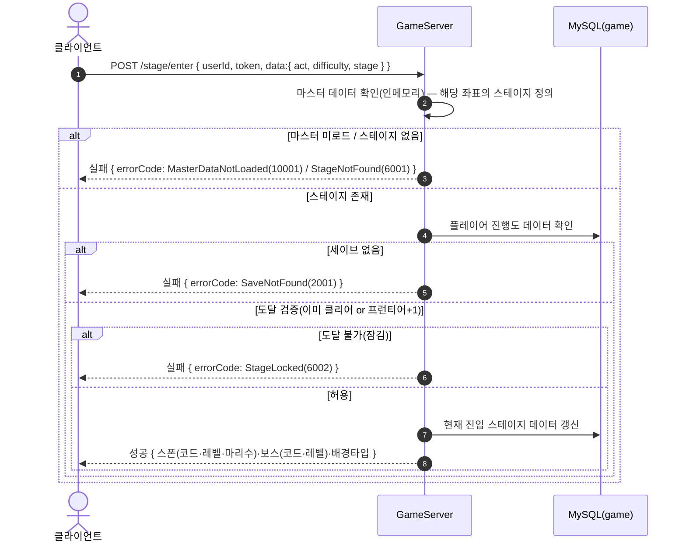
```mermaid
sequenceDiagram
    autonumber
    actor C as 클라이언트
    participant S as GameServer
    participant DB as MySQL(game)

    C->>S: POST /stage/enter { userId, token, data:{ act, difficulty, stage } }
    S->>S: 마스터 데이터 확인(인메모리) — 해당 좌표의 스테이지 정의
    alt 마스터 미로드 / 스테이지 없음
        S-->>C: 실패 { errorCode: MasterDataNotLoaded(10001) / StageNotFound(6001) }
    else 스테이지 존재
        S->>DB: 플레이어 진행도 데이터 확인
        alt 세이브 없음
            S-->>C: 실패 { errorCode: SaveNotFound(2001) }
        else 도달 검증(이미 클리어 or 프런티어+1)
            alt 도달 불가(잠김)
                S-->>C: 실패 { errorCode: StageLocked(6002) }
            else 허용
                S->>DB: 현재 진입 스테이지 데이터 갱신
                S-->>C: 성공 { 스폰(코드·레벨·마리수)·보스(코드·레벨)·배경타입 }
            end
        end
    end
```

### POST /api/game/stage/clear — 스테이지 클리어(보상 지급)

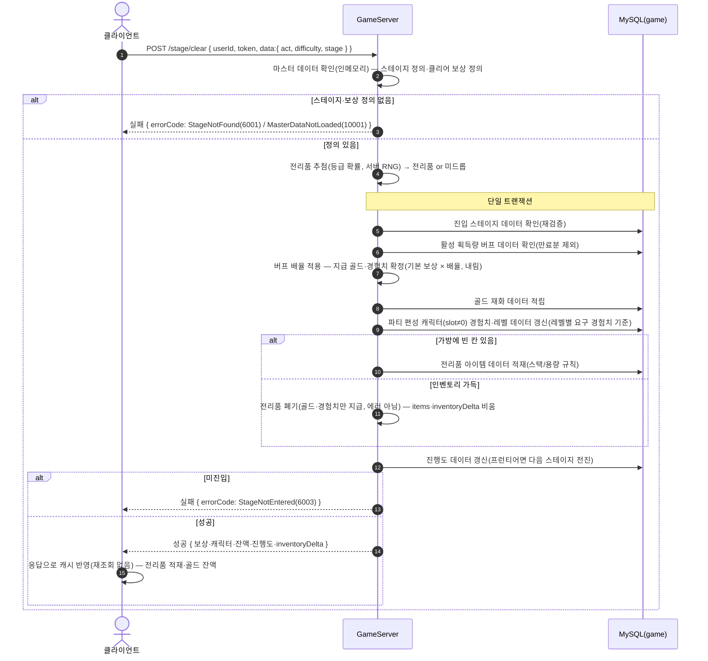
```mermaid
sequenceDiagram
    autonumber
    actor C as 클라이언트
    participant S as GameServer
    participant DB as MySQL(game)

    C->>S: POST /stage/clear { userId, token, data:{ act, difficulty, stage } }
    S->>S: 마스터 데이터 확인(인메모리) — 스테이지 정의·클리어 보상 정의
    alt 스테이지·보상 정의 없음
        S-->>C: 실패 { errorCode: StageNotFound(6001) / MasterDataNotLoaded(10001) }
    else 정의 있음
        S->>S: 전리품 추첨(등급 확률, 서버 RNG) → 전리품 or 미드롭
        Note over S,DB: 단일 트랜잭션
        S->>DB: 진입 스테이지 데이터 확인(재검증)
        S->>DB: 활성 획득량 버프 데이터 확인(만료분 제외)
        S->>S: 버프 배율 적용 — 지급 골드·경험치 확정(기본 보상 × 배율, 내림)
        S->>DB: 골드 재화 데이터 적립
        S->>DB: 파티 편성 캐릭터(slot≠0) 경험치·레벨 데이터 갱신(레벨별 요구 경험치 기준)
        alt 가방에 빈 칸 있음
            S->>DB: 전리품 아이템 데이터 적재(스택/용량 규칙)
        else 인벤토리 가득
            S->>S: 전리품 폐기(골드·경험치만 지급, 에러 아님) — items·inventoryDelta 비움
        end
        S->>DB: 진행도 데이터 갱신(프런티어면 다음 스테이지 전진)
        alt 미진입
            S-->>C: 실패 { errorCode: StageNotEntered(6003) }
        else 성공
            S-->>C: 성공 { 보상·캐릭터·잔액·진행도·inventoryDelta }
            C->>C: 응답으로 캐시 반영(재조회 없음) — 전리품 적재·골드 잔액
        end
    end
```

- 전투 중 계속 발생하는 호출이라 **전리품이 쌓여도 가방을 다시 받지 않는다.** 클라이언트가 응답의 `inventoryDelta`·`balance`를 세션 캐시에 반영해 두므로, 창고를 열기 전에 이미 최신 상태다.

### POST /api/game/stage/fail — 스테이지 실패 보고(기록 전용)

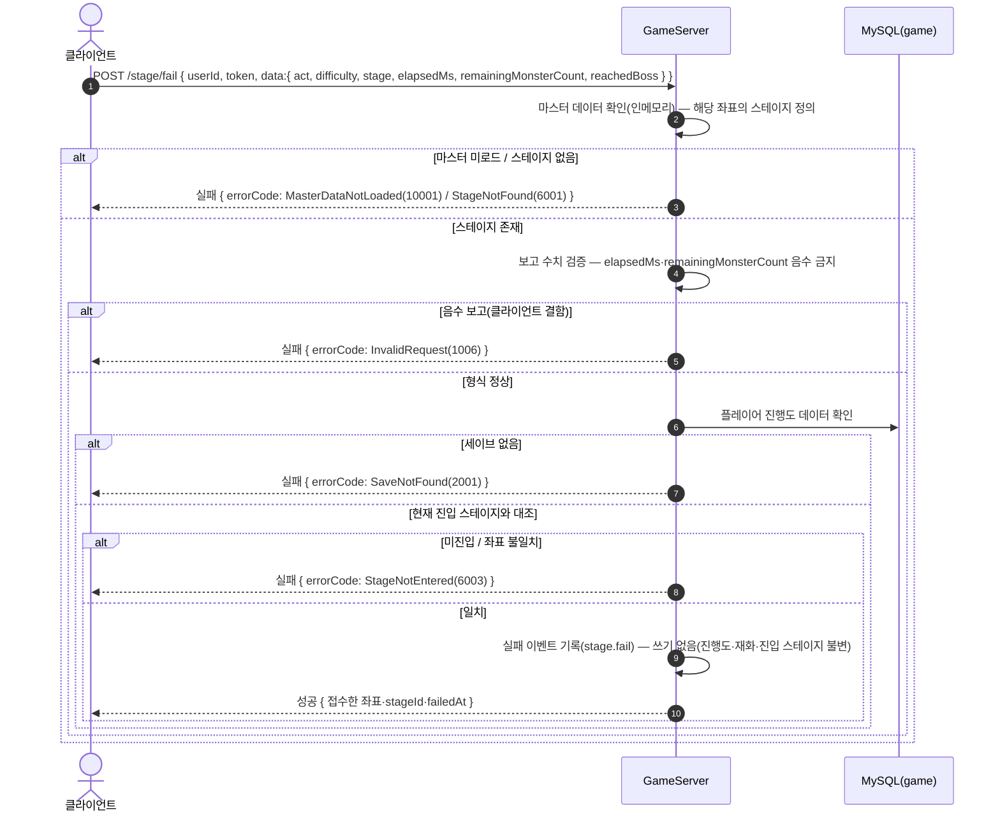
```mermaid
sequenceDiagram
    autonumber
    actor C as 클라이언트
    participant S as GameServer
    participant DB as MySQL(game)

    C->>S: POST /stage/fail { userId, token, data:{ act, difficulty, stage, elapsedMs, remainingMonsterCount, reachedBoss } }
    S->>S: 마스터 데이터 확인(인메모리) — 해당 좌표의 스테이지 정의
    alt 마스터 미로드 / 스테이지 없음
        S-->>C: 실패 { errorCode: MasterDataNotLoaded(10001) / StageNotFound(6001) }
    else 스테이지 존재
        S->>S: 보고 수치 검증 — elapsedMs·remainingMonsterCount 음수 금지
        alt 음수 보고(클라이언트 결함)
            S-->>C: 실패 { errorCode: InvalidRequest(1006) }
        else 형식 정상
            S->>DB: 플레이어 진행도 데이터 확인
            alt 세이브 없음
                S-->>C: 실패 { errorCode: SaveNotFound(2001) }
            else 현재 진입 스테이지와 대조
                alt 미진입 / 좌표 불일치
                    S-->>C: 실패 { errorCode: StageNotEntered(6003) }
                else 일치
                    S->>S: 실패 이벤트 기록(stage.fail) — 쓰기 없음(진행도·재화·진입 스테이지 불변)
                    S-->>C: 성공 { 접수한 좌표·stageId·failedAt }
                end
            end
        end
    end
```

- **상태를 바꾸지 않는 유일한 스테이지 API다.** 진입 스테이지를 지우지 않으므로 클라이언트는 곧바로 같은 스테이지를 재시도하고, 성공하면 `clear`가 이어진다.
- 서버는 전투를 재현하지 않아 전멸을 관측할 수 없다 — 이 보고가 있어야 실질 난이도(`fail / enter`)를 추정이 아닌 **측정**으로 얻는다([로그 이벤트 정의](../docs/공통/로그-이벤트-정의.md) 5.3).
- **가방이 가득 차도 클리어는 거부하지 않는다.** 전리품만 폐기하고 골드·경험치·진행도는 정상 반영하므로(응답 `rewards.items`가 빈 배열) 방치 전투가 인벤토리 정리 때문에 멈추지 않는다.

## 방치형 오프라인 보상

방치형 오프라인 보상 정산 (GameOfflineController, `/api/game/offline`, GameServer). 저장소: MySQL `taskbar_hero_game`(`game_player`·`player_character`·`player_item`) + 인메모리 마스터 데이터(stage_reward·level). 중복 정산은 트랜잭션 + `last_active_at` CAS로 방지한다.

### POST /api/game/offline/claim — 오프라인 보상 정산

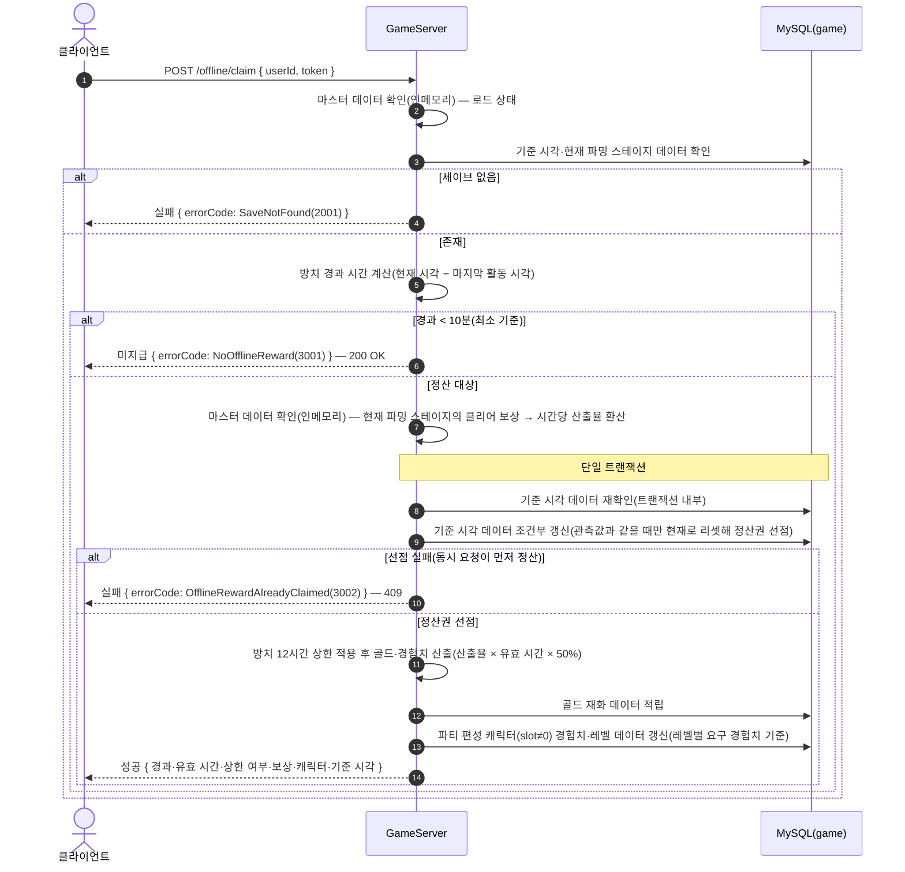
```mermaid
sequenceDiagram
    autonumber
    actor C as 클라이언트
    participant S as GameServer
    participant DB as MySQL(game)

    C->>S: POST /offline/claim { userId, token }
    S->>S: 마스터 데이터 확인(인메모리) — 로드 상태
    S->>DB: 기준 시각·현재 파밍 스테이지 데이터 확인
    alt 세이브 없음
        S-->>C: 실패 { errorCode: SaveNotFound(2001) }
    else 존재
        S->>S: 방치 경과 시간 계산(현재 시각 − 마지막 활동 시각)
        alt 경과 < 10분(최소 기준)
            S-->>C: 미지급 { errorCode: NoOfflineReward(3001) } — 200 OK
        else 정산 대상
            S->>S: 마스터 데이터 확인(인메모리) — 현재 파밍 스테이지의 클리어 보상 → 시간당 산출율 환산
            Note over S,DB: 단일 트랜잭션
            S->>DB: 기준 시각 데이터 재확인(트랜잭션 내부)
            S->>DB: 기준 시각 데이터 조건부 갱신(관측값과 같을 때만 현재로 리셋해 정산권 선점)
            alt 선점 실패(동시 요청이 먼저 정산)
                S-->>C: 실패 { errorCode: OfflineRewardAlreadyClaimed(3002) } — 409
            else 정산권 선점
                S->>S: 방치 12시간 상한 적용 후 골드·경험치 산출(산출율 × 유효 시간 × 50%)
                S->>DB: 골드 재화 데이터 적립
                S->>DB: 파티 편성 캐릭터(slot≠0) 경험치·레벨 데이터 갱신(레벨별 요구 경험치 기준)
                S-->>C: 성공 { 경과·유효 시간·상한 여부·보상·캐릭터·기준 시각 }
            end
        end
    end
```

## 인벤토리/아이템

장비 장착·해제·강화·배치 이동·용량 확장 (GameInventoryController, `/api/game/inventory`, GameServer). 저장소: MySQL `taskbar_hero_game`(`player_item`·`player_item_equipped`·`game_player`) + 인메모리 마스터 데이터(item·강화 규칙·확장 비용).

### POST /api/game/inventory/equip — 장착(스왑)

장착한 장비는 **가방 칸을 반납**한다(`player_item.slot = NULL`). 스왑이면 밀려난 기존 장비가 그 칸을 그대로 물려받아 점유 칸 수가 상쇄되므로, 가방이 가득 차 있어도 스왑 장착은 성공한다.

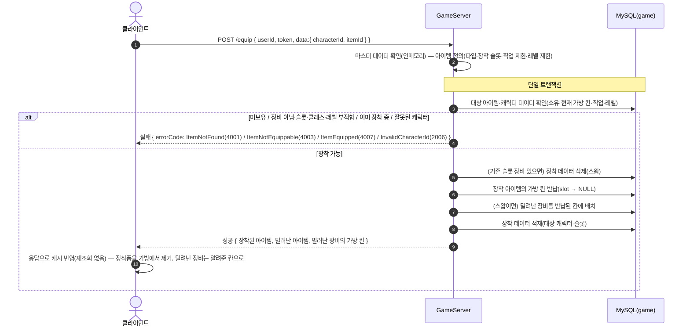
```mermaid
sequenceDiagram
    autonumber
    actor C as 클라이언트
    participant S as GameServer
    participant DB as MySQL(game)

    C->>S: POST /equip { userId, token, data:{ characterId, itemId } }
    S->>S: 마스터 데이터 확인(인메모리) — 아이템 정의(타입·장착 슬롯·직업 제한·레벨 제한)
    Note over S,DB: 단일 트랜잭션
    S->>DB: 대상 아이템·캐릭터 데이터 확인(소유·현재 가방 칸·직업·레벨)
    alt 미보유 / 장비 아님·슬롯·클래스·레벨 부적합 / 이미 장착 중 / 잘못된 캐릭터
        S-->>C: 실패 { errorCode: ItemNotFound(4001) / ItemNotEquippable(4003) / ItemEquipped(4007) / InvalidCharacterId(2006) }
    else 장착 가능
        S->>DB: (기존 슬롯 장비 있으면) 장착 데이터 삭제(스왑)
        S->>DB: 장착 아이템의 가방 칸 반납(slot → NULL)
        S->>DB: (스왑이면) 밀려난 장비를 반납된 칸에 배치
        S->>DB: 장착 데이터 적재(대상 캐릭터·슬롯)
        S-->>C: 성공 { 장착된 아이템, 밀려난 아이템, 밀려난 장비의 가방 칸 }
        C->>C: 응답으로 캐시 반영(재조회 없음) — 장착품을 가방에서 제거, 밀려난 장비는 알려준 칸으로
    end
```

- 응답에 `inventoryDelta`는 없다. 바뀐 행이 `equipped`·`unequipped`·`unequippedBagSlot`으로 이미 특정되고, 옮겨지는 장비의 `itemCode`·`enhanceLevel`은 클라이언트의 가방·장착 캐시에 이미 있어 그대로 승계하면 되기 때문이다.

### POST /api/game/inventory/unequip — 장착 해제

장착 중에는 가방 칸을 쓰지 않으므로, 해제하려면 **되돌릴 빈 칸이 필요**하다. 없으면 전체 롤백하고 거부한다(장비를 잃지 않는다).

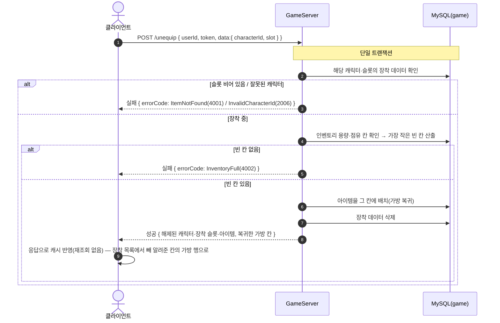
```mermaid
sequenceDiagram
    autonumber
    actor C as 클라이언트
    participant S as GameServer
    participant DB as MySQL(game)

    C->>S: POST /unequip { userId, token, data:{ characterId, slot } }
    Note over S,DB: 단일 트랜잭션
    S->>DB: 해당 캐릭터·슬롯의 장착 데이터 확인
    alt 슬롯 비어 있음 / 잘못된 캐릭터
        S-->>C: 실패 { errorCode: ItemNotFound(4001) / InvalidCharacterId(2006) }
    else 장착 중
        S->>DB: 인벤토리 용량·점유 칸 확인 → 가장 작은 빈 칸 산출
        alt 빈 칸 없음
            S-->>C: 실패 { errorCode: InventoryFull(4002) }
        else 빈 칸 있음
            S->>DB: 아이템을 그 칸에 배치(가방 복귀)
            S->>DB: 장착 데이터 삭제
            S-->>C: 성공 { 해제된 캐릭터·장착 슬롯·아이템, 복귀한 가방 칸 }
            C->>C: 응답으로 캐시 반영(재조회 없음) — 장착 목록에서 빼 알려준 칸의 가방 행으로
        end
    end
```

### POST /api/game/inventory/move — 배치 이동/교환

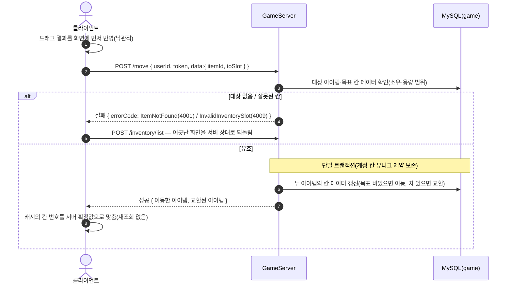
```mermaid
sequenceDiagram
    autonumber
    actor C as 클라이언트
    participant S as GameServer
    participant DB as MySQL(game)

    C->>C: 드래그 결과를 화면에 먼저 반영(낙관적)
    C->>S: POST /move { userId, token, data:{ itemId, toSlot } }
    S->>DB: 대상 아이템·목표 칸 데이터 확인(소유·용량 범위)
    alt 대상 없음 / 잘못된 칸
        S-->>C: 실패 { errorCode: ItemNotFound(4001) / InvalidInventorySlot(4009) }
        C->>S: POST /inventory/list — 어긋난 화면을 서버 상태로 되돌림
    else 유효
        Note over S,DB: 단일 트랜잭션(계정-칸 유니크 제약 보존)
        S->>DB: 두 아이템의 칸 데이터 갱신(목표 비었으면 이동, 차 있으면 교환)
        S-->>C: 성공 { 이동한 아이템, 교환된 아이템 }
        C->>C: 캐시의 칸 번호를 서버 확정값으로 맞춤(재조회 없음)
    end
```

### POST /api/game/inventory/enhance — 장비 강화(단계 +1, 재화 소모)

비용·상한은 마스터 `enhance_master`의 **다음 단계**(현재 단계 + 1) 행이 정한다(현재 상한 +10). 실패·하락·파괴가 없어 비용을 내면 확정 상승하며, **장착 중인 장비도 해제 없이 강화한다** — 보유 행과 장착 행의 강화 단계를 같은 트랜잭션에서 함께 올려 두 값이 어긋나지 않게 한다.

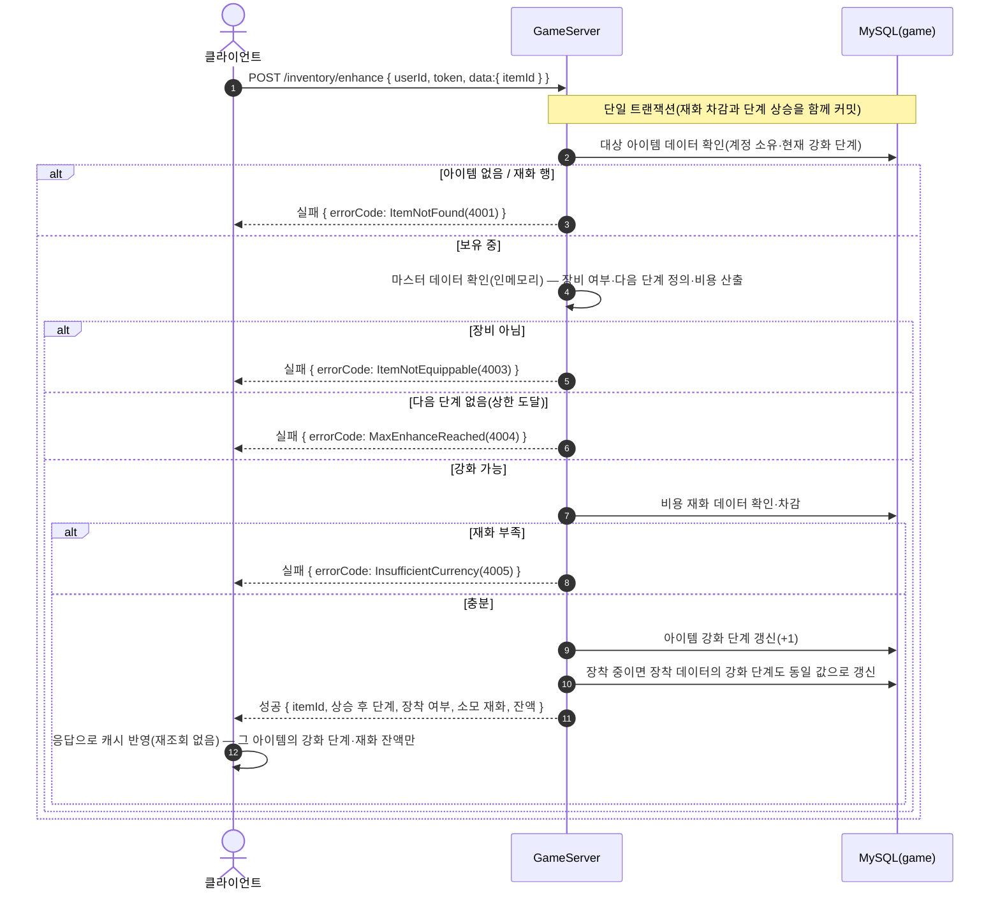
```mermaid
sequenceDiagram
    autonumber
    actor C as 클라이언트
    participant S as GameServer
    participant DB as MySQL(game)

    C->>S: POST /inventory/enhance { userId, token, data:{ itemId } }
    Note over S,DB: 단일 트랜잭션(재화 차감과 단계 상승을 함께 커밋)
    S->>DB: 대상 아이템 데이터 확인(계정 소유·현재 강화 단계)
    alt 아이템 없음 / 재화 행
        S-->>C: 실패 { errorCode: ItemNotFound(4001) }
    else 보유 중
        S->>S: 마스터 데이터 확인(인메모리) — 장비 여부·다음 단계 정의·비용 산출
        alt 장비 아님
            S-->>C: 실패 { errorCode: ItemNotEquippable(4003) }
        else 다음 단계 없음(상한 도달)
            S-->>C: 실패 { errorCode: MaxEnhanceReached(4004) }
        else 강화 가능
            S->>DB: 비용 재화 데이터 확인·차감
            alt 재화 부족
                S-->>C: 실패 { errorCode: InsufficientCurrency(4005) }
            else 충분
                S->>DB: 아이템 강화 단계 갱신(+1)
                S->>DB: 장착 중이면 장착 데이터의 강화 단계도 동일 값으로 갱신
                S-->>C: 성공 { itemId, 상승 후 단계, 장착 여부, 소모 재화, 잔액 }
                C->>C: 응답으로 캐시 반영(재조회 없음) — 그 아이템의 강화 단계·재화 잔액만
            end
        end
    end
```

- 응답에 `inventoryDelta`는 없다. 바뀐 값이 그 아이템 한 행의 `enhanceLevel` 하나뿐이라 `itemId`·`enhanceLevel`로 특정되기 때문이다.
- **스탯 배율은 서버가 내려주지 않는다.** 서버는 단계만 권위로 확정하고, 클라이언트가 마스터 번들의 `stat_multiplier`(단계당 +0.05)를 장비 옵션 스탯에 곱해 표시·전투 계산한다.

### POST /api/game/inventory/expand — 용량 1칸 확장(골드 소모)

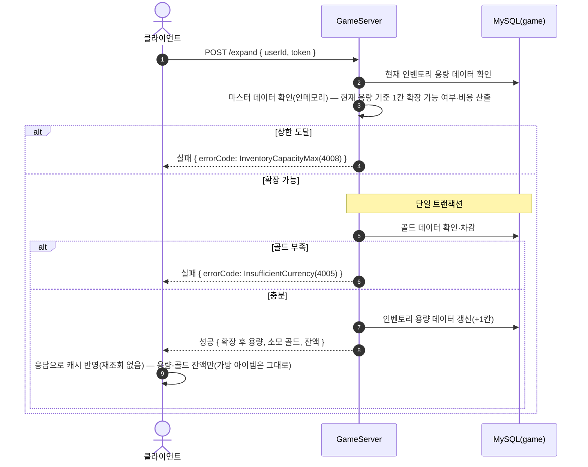
```mermaid
sequenceDiagram
    autonumber
    actor C as 클라이언트
    participant S as GameServer
    participant DB as MySQL(game)

    C->>S: POST /expand { userId, token }
    S->>DB: 현재 인벤토리 용량 데이터 확인
    S->>S: 마스터 데이터 확인(인메모리) — 현재 용량 기준 1칸 확장 가능 여부·비용 산출
    alt 상한 도달
        S-->>C: 실패 { errorCode: InventoryCapacityMax(4008) }
    else 확장 가능
        Note over S,DB: 단일 트랜잭션
        S->>DB: 골드 데이터 확인·차감
        alt 골드 부족
            S-->>C: 실패 { errorCode: InsufficientCurrency(4005) }
        else 충분
            S->>DB: 인벤토리 용량 데이터 갱신(+1칸)
            S-->>C: 성공 { 확장 후 용량, 소모 골드, 잔액 }
            C->>C: 응답으로 캐시 반영(재조회 없음) — 용량·골드 잔액만(가방 아이템은 그대로)
        end
    end
```

- 가방 행이 바뀌지 않는 유일한 인벤토리 액션이라 `inventoryDelta`도 응답에 담지 않는다(용량·잔액만 갱신).

## 소모품/버프

소모성 아이템 사용 → 계정 획득량 버프 부여·연장, 적용 중인 버프 조회 (GameConsumableController, `/api/game/consumable`, GameServer). 저장소: MySQL `taskbar_hero_game`(`player_item`·`player_buff`) + 인메모리 마스터 데이터(item·consumable). 현재 소모품은 **경험치 부스터·골드 부스터** 2종이다.

**활성 버프를 받는 창구는 세 곳이다** — 접속 직후는 코어 로드(`POST /api/game/load`)의 `activeBuffs`([세이브 데이터/캐릭터 생성](#세이브-데이터캐릭터-생성) 섹션), 소모품 사용 직후는 사용 응답, 그 이후 버프 UI 재동기화는 전용 경량 조회(`POST /api/game/consumable/buffs`)가 담당한다.

### POST /api/game/consumable/use — 소모품 사용(버프 부여·연장)

1회 호출당 **1개 고정**이다. 같은 종류를 다시 쓰면 남은 시간에 **누적 연장**되며(`started_at`은 유지 — 연장은 같은 버프가 계속 켜져 있는 상태이므로 UI 진행률 기준이 흔들리지 않도록), 누적 상한(24시간)을 넘으면 **아이템을 차감하지 않고** 거부한다.

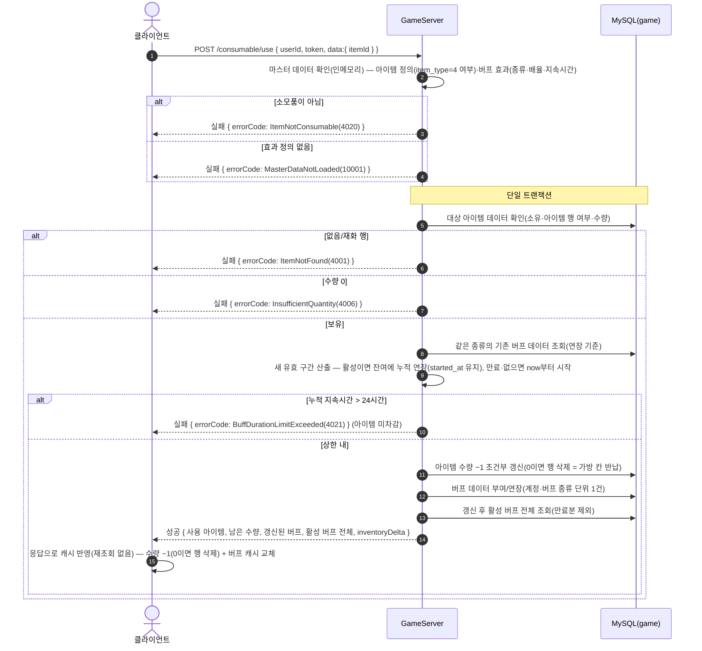
```mermaid
sequenceDiagram
    autonumber
    actor C as 클라이언트
    participant S as GameServer
    participant DB as MySQL(game)

    C->>S: POST /consumable/use { userId, token, data:{ itemId } }
    S->>S: 마스터 데이터 확인(인메모리) — 아이템 정의(item_type=4 여부)·버프 효과(종류·배율·지속시간)
    alt 소모품이 아님
        S-->>C: 실패 { errorCode: ItemNotConsumable(4020) }
    else 효과 정의 없음
        S-->>C: 실패 { errorCode: MasterDataNotLoaded(10001) }
    end
    Note over S,DB: 단일 트랜잭션
    S->>DB: 대상 아이템 데이터 확인(소유·아이템 행 여부·수량)
    alt 없음/재화 행
        S-->>C: 실패 { errorCode: ItemNotFound(4001) }
    else 수량 0
        S-->>C: 실패 { errorCode: InsufficientQuantity(4006) }
    else 보유
        S->>DB: 같은 종류의 기존 버프 데이터 조회(연장 기준)
        S->>S: 새 유효 구간 산출 — 활성이면 잔여에 누적 연장(started_at 유지), 만료·없으면 now부터 시작
        alt 누적 지속시간 > 24시간
            S-->>C: 실패 { errorCode: BuffDurationLimitExceeded(4021) } (아이템 미차감)
        else 상한 내
            S->>DB: 아이템 수량 −1 조건부 갱신(0이면 행 삭제 = 가방 칸 반납)
            S->>DB: 버프 데이터 부여/연장(계정·버프 종류 단위 1건)
            S->>DB: 갱신 후 활성 버프 전체 조회(만료분 제외)
            S-->>C: 성공 { 사용 아이템, 남은 수량, 갱신된 버프, 활성 버프 전체, inventoryDelta }
            C->>C: 응답으로 캐시 반영(재조회 없음) — 수량 −1(0이면 행 삭제) + 버프 캐시 교체
        end
    end
```

- 버프 상태는 **MySQL 정본**이다(Redis TTL 미사용). 버프는 아이템을 차감한 대가여서 유실 시 복구가 불가능하고, 배율 판정이 보상 지급 트랜잭션 안에서 이뤄져야 하기 때문이다([소모품/버프 기획서](../docs/세부/consumable-buff-기획서.md) 4.1).
- **배율이 적용되는 곳은 스테이지 클리어 보상뿐이다**([스테이지](#스테이지) 섹션). 오프라인 정산·메일 수령·출석 보상·큐브 분해·거래 대금에는 적용하지 않는다(같은 문서 6.3·6.5).
- 만료 버프 행은 활성 판정(`expires_at > now`)에서 걸러지므로 정리 배치가 여유를 두고 삭제한다(같은 문서 6.4).

### POST /api/game/consumable/buffs — 적용 중인 버프 조회

버프 UI(아이콘·잔여 시간) 재동기화용 **경량 조회**다. 요청 data가 없고, 마스터 데이터를 참조하지 않으며(배율·지속시간은 부여 시점에 확정돼 DB에 있다), 활성 버프가 없어도 **빈 목록 + 성공**이다.

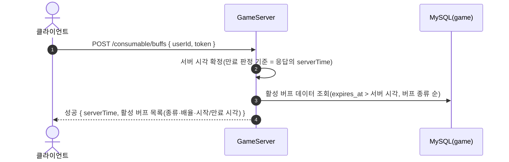
```mermaid
sequenceDiagram
    autonumber
    actor C as 클라이언트
    participant S as GameServer
    participant DB as MySQL(game)

    C->>S: POST /consumable/buffs { userId, token }
    S->>S: 서버 시각 확정(만료 판정 기준 = 응답의 serverTime)
    S->>DB: 활성 버프 데이터 조회(expires_at > 서버 시각, 버프 종류 순)
    S-->>C: 성공 { serverTime, 활성 버프 목록(종류·배율·시작/만료 시각) }
```

- **만료 판정은 서버가 한다.** 클라이언트는 `expiresAt - serverTime`으로 남은 초를 얻어 로컬에서 카운트다운만 하고, 만료를 자체 확정하지 않는다 — 다음 응답에서 그 항목이 사라지는 것으로 확인한다.
- **주기적 폴링은 하지 않는다.** 버프 UI를 열거나 앱이 백그라운드에서 복귀했을 때처럼 재동기화가 필요한 순간에만 호출한다(버프는 소모품 사용 외에 서버 단독으로 바뀌지 않는다).
- 신규 에러 코드가 없다 — 인증 실패 계열 외 분기가 없다.

## 큐브

큐브 — 합성·분해·제작(서버 권위 결과 산출) (GameCubeController, `/api/game/cube`, GameServer). 저장소: MySQL `taskbar_hero_game`(`player_item`·`player_cube`) + 인메모리 마스터 데이터(cube_master·item·recipe). 연산마다 큐브 경험치가 쌓여 레벨업한다.

### POST /api/game/cube/combine — 합성(동급 3개 → 상위 등급 1개)

```mermaid
sequenceDiagram
    autonumber
    actor C as 클라이언트
    participant S as GameServer
    participant DB as MySQL(game)

    C->>S: POST /cube/combine { userId, token, data:{ itemIds[] } }
    Note over S,DB: 단일 트랜잭션
    S->>DB: 입력 아이템 데이터 확인(소유·미장착)
    S->>S: 마스터 데이터 확인(인메모리) — 합성 규칙(필요 개수·등급 상승) + 입력 등급 일치 검증(장착 슬롯·직업 무관)
    S->>S: 상위 등급 결과 아이템 추첨(같은 등급대 무작위, 서버 RNG)
    alt 미보유 / 장착 중 / 조건 미충족(등급·개수·최대 등급)
        S-->>C: 실패 { errorCode: ItemNotFound(4001) / ItemEquipped(4007) / CubeRecipeNotMet(4010) }
    else 성공
        S->>DB: 입력 아이템 데이터 삭제 + 결과 아이템 데이터 적재(빈 칸)
        S->>DB: 큐브 경험치·레벨 데이터 갱신(50 × 입력등급 누적)
        S-->>C: 성공 { 소모한 아이템, 결과 아이템, 큐브 상태, inventoryDelta }
        C->>C: 응답으로 캐시 반영(재조회 없음) — 입력 3개 제거·결과 1개 적재 + 큐브 상태 교체
    end
```

### POST /api/game/cube/dismantle — 분해(아이템 → 골드)

```mermaid
sequenceDiagram
    autonumber
    actor C as 클라이언트
    participant S as GameServer
    participant DB as MySQL(game)

    C->>S: POST /cube/dismantle { userId, token, data:{ items[]{ itemId, count } } }
    Note over S,DB: 단일 트랜잭션
    S->>DB: 각 아이템 데이터 확인(소유·미장착·수량)
    S->>S: 마스터 데이터 확인(인메모리) — 큐브 레벨별 분해 골드 계수·아이템 등급
    S->>S: 골드 = Σ(분해 계수 × 등급 × 개수), 큐브 경험치 = Σ(20 × 등급 × 개수)
    alt 미보유 / 수량 부족 / 장착 중
        S-->>C: 실패 { errorCode: ItemNotFound(4001) / InsufficientQuantity(4006) / ItemEquipped(4007) }
    else 성공
        S->>DB: 아이템 수량 데이터 차감 + 골드 재화 데이터 적립 + 큐브 경험치·레벨 데이터 갱신
        S-->>C: 성공 { 획득 골드, 획득 큐브 경험치, 큐브 상태, 잔액, inventoryDelta }
        C->>C: 응답으로 캐시 반영(재조회 없음) — 분해분 차감/삭제 + 큐브 상태·골드 잔액
    end
```

- `cube` (갱신 후 큐브 상태)와 `balance` (골드 잔액)는 재조회를 없애기 위해 응답에 함께 싣는다.

### POST /api/game/cube/craft — 제작(레시피)

```mermaid
sequenceDiagram
    autonumber
    actor C as 클라이언트
    participant S as GameServer
    participant DB as MySQL(game)

    C->>S: POST /cube/craft { userId, token, data:{ recipeCode } }
    S->>S: 마스터 데이터 확인(인메모리) — 레시피 정의(결과 아이템·요구 큐브 레벨·비용·소모 재료)
    alt 레시피 없음
        S-->>C: 실패 { errorCode: CubeRecipeNotMet(4010) }
    else 존재
        Note over S,DB: 단일 트랜잭션
        S->>DB: 큐브 레벨·골드·재료 보유 데이터 확인
        alt 큐브 레벨 미달 / 골드 부족 / 재료 부족 / 용량 부족
            S-->>C: 실패 { errorCode: CubeLevelInsufficient(4011) / InsufficientCurrency(4005) / CubeRecipeNotMet(4010) / InventoryFull(4002) }
        else 충족
            S->>DB: 골드·재료 데이터 차감 + 결과 아이템 데이터 적재 + 큐브 경험치 데이터 갱신(+20)
            S-->>C: 성공 { 소모한 골드·재료, 획득 아이템, 큐브 상태, 잔액, inventoryDelta }
            C->>C: 응답으로 캐시 반영(재조회 없음) — 재료 차감·제작물 적재 + 큐브 상태·골드 잔액
        end
    end
```

- 분해와 마찬가지로 `balance`를 함께 실어 제작 비용 차감 후 잔액을 재조회 없이 표시한다.

## 성장(스킬·룬)

성장 — 스킬 레벨업·초기화·액티브 장착·룬 업그레이드 (GameGrowthController, `/api/game/growth`, GameServer). 저장소: MySQL `taskbar_hero_game`(`player_skill`·`player_rune`·`player_character`·`player_item`) + 인메모리 마스터 데이터(skill·rune·level·rune_cost).

> 스킬 포인트는 저장값이 아니라 레벨별 스킬 포인트 정의에서 파생(레벨 기준 총량 − 사용량)한다.

### POST /api/game/growth/skill/levelup — 스킬 레벨업

```mermaid
sequenceDiagram
    autonumber
    actor C as 클라이언트
    participant S as GameServer
    participant DB as MySQL(game)

    C->>S: POST /skill/levelup { userId, token, data:{ characterId, skillCode } }
    S->>S: 마스터 데이터 확인(인메모리) — 스킬 정의(직업 소속·최대 레벨)
    alt 잘못된 대상 / 직업 불일치 / 최대 레벨
        S-->>C: 실패 { errorCode: InvalidGrowthTarget(5001) / SkillClassMismatch(5004) / SkillMaxLevel(5002) }
    else 유효
        Note over S,DB: 단일 트랜잭션
        S->>DB: 캐릭터 레벨·현재 스킬 레벨·사용 포인트 데이터 확인
        S->>S: 가용 스킬 포인트 계산(레벨 파생 총량 − 사용량)
        alt 포인트 부족
            S-->>C: 실패 { errorCode: InsufficientSkillPoint(5003) }
        else 충분
            S->>DB: 스킬 레벨 데이터 갱신(+1, 첫 습득이면 신규 적재)
            S-->>C: 성공 { 올린 레벨, 소모 포인트, 잔여 포인트 }
        end
    end
```

### POST /api/game/growth/skill/reset — 스킬 초기화

```mermaid
sequenceDiagram
    autonumber
    actor C as 클라이언트
    participant S as GameServer
    participant DB as MySQL(game)

    C->>S: POST /skill/reset { userId, token, data:{ characterId } }
    alt 잘못된 캐릭터
        S-->>C: 실패 { errorCode: InvalidCharacterId(2006) }
    else 유효
        Note over S,DB: 단일 트랜잭션(회수 후 총 포인트 산출은 서버가 수행)
        S->>DB: 해당 캐릭터 스킬 데이터 갱신(레벨 0·장착 해제 — 행 삭제 없이 포인트 전액 회수)
        S-->>C: 성공 { 초기화된 스킬 수, 잔여 포인트(전액 복구) }
    end
```

### POST /api/game/growth/skill/equip — 액티브 스킬 장착(0~2개)

```mermaid
sequenceDiagram
    autonumber
    actor C as 클라이언트
    participant S as GameServer
    participant DB as MySQL(game)

    C->>S: POST /skill/equip { userId, token, data:{ characterId, skillCodes[] } }
    S->>S: 마스터 데이터 확인(인메모리) — 스킬 정의(액티브 여부·직업)
    S->>S: 검증(액티브만·최대 2개·습득 레벨 ≥ 1)
    alt 한도 초과 / 미습득 / 패시브 / 직업 불일치
        S-->>C: 실패 { errorCode: ActiveSkillLimitExceeded(5007) / SkillNotLearned(5006) / SkillNotActive(5005) / SkillClassMismatch(5004) }
    else 유효
        Note over S,DB: 단일 트랜잭션
        S->>DB: 스킬 장착 데이터 재설정(전량 해제 후 요청 목록만 장착)
        S-->>C: 성공 { 장착된 스킬 목록 }
    end
```

### POST /api/game/growth/rune/upgrade — 룬 업그레이드(골드 소모)

```mermaid
sequenceDiagram
    autonumber
    actor C as 클라이언트
    participant S as GameServer
    participant DB as MySQL(game)

    C->>S: POST /rune/upgrade { userId, token, data:{ runeCode } }
    S->>S: 마스터 데이터 확인(인메모리) — 룬 정의(선행 룬·최대 레벨) + 현재 레벨의 업그레이드 비용 산출
    Note over S,DB: 단일 트랜잭션
    S->>DB: 현재 룬 레벨·선행 룬 레벨·골드 데이터 확인
    alt 선행 미충족 / 최대 레벨 / 골드 부족
        S-->>C: 실패 { errorCode: RunePrereqNotMet(5010) / RuneMaxLevel(5011) / InsufficientCurrency(4005) }
    else 유효
        S->>DB: 골드 데이터 차감 + 룬 레벨 데이터 갱신(+1, 첫 해금이면 신규 적재)
        S-->>C: 성공 { 올린 레벨, 소모 골드, 잔액 }
        C->>C: 응답으로 캐시 반영(재조회 없음) — 룬 레벨·골드 잔액
    end
```

- 가방을 바꾸지 않는 액션이라 반영 대상이 룬 레벨과 잔액뿐이다. 이 둘이 응답에 있으므로 코어 스냅샷(`/load`)을 다시 받지 않는다.

## 거래소/교역선

판매 등록·목록 조회·구매·취소 (GameTradeController, `/api/game/trade`, GameServer)와 만료 배치(TradeExpireBatchScheduler). 저장소: MySQL `taskbar_hero_game`(`trade_listing`·`player_item`·`player_mail`) + 인메모리 마스터(item — `sellable`·`base_price`, mail 템플릿 201·202).

핵심 규약(trade 기획서 §4·§7):

- **에스크로** — 등록 즉시 아이템을 `player_item`에서 빼 `trade_listing` 스냅샷으로 옮긴다. 등록 중 아이템의 장착·분해·재등록은 대상이 없어 `ItemNotFound(4001)`.
- **직렬화는 MySQL 하나로** — 같은 등록을 닫는 경로(구매·취소·만료 배치)는 **조건부 갱신**(`status=1`일 때만 전이)의 행 잠금으로 직렬화된다. 뒤에 온 요청은 0행을 받아 `TradeAlreadyClosed(7005)`가 되므로 이중 판매가 불가하며, **이 경로들에는 Redis 락을 두지 않는다**. Redis 락은 판매 등록의 한도 검사(계정 단위)에만 쓴다 — 잠글 등록 행이 없어 조건부 갱신으로 막을 수 없는 유일한 경합이다.
- **캐시는 파생 데이터** — 목록은 Redis로 응답하되 정합성 정본은 MySQL이다. 미적재·장애면 MySQL 폴백 후 lazy 적재하고, 캐시 갱신은 **항상 커밋 이후**에 한다.
- **거래 결과물은 전부 메일로** — 구매 아이템(구매자, 템플릿 203) · 판매 대금(판매자, 수수료 20% 차감, 템플릿 201) · 만료 반송 아이템(판매자, 템플릿 202)이 모두 우편함을 거친다. 지급 경로를 하나로 통일해 구매 시 인벤토리 용량을 보지 않아도 되고, 수령 이력이 메일 원장에 남는다. 첨부는 강화 단계를 보존한다. 수동 취소만 예외로 판매자 인벤토리에 직접 복원한다(요청자가 온라인).

### POST /api/game/trade/list — 거래소 목록 조회

```mermaid
sequenceDiagram
    autonumber
    actor C as 클라이언트
    participant S as GameServer
    participant DB as MySQL(game)

    C->>S: POST /trade/list { userId, token, data:{ itemCode, mine, page, pageSize } }
    S->>S: 입력 정규화 — pageSize 상한 강제(기본 50 · 최대 100)
    S->>DB: 페이지 조회(status=1 + 만료 전(expires_at > now) [+ item_code] + 뷰어 필터, ORDER BY price, listing_id, LIMIT pageSize+1 OFFSET page*pageSize)
    DB-->>S: 최대 pageSize+1건(idx_trade_browse / idx_trade_price)
    S->>S: 초과분 1건을 잘라 hasMore 판정
    S-->>C: 성공 { listings[], page, pageSize, hasMore }
```

- 조회는 상태를 바꾸지 않는다. 아이템 이름·등급은 클라이언트가 `itemCode`로 마스터 번들에서 조회해 표시한다.
- **뷰어 필터를 쿼리에 넣는다.** `mine=false`면 `seller_user_id <> viewer`, `true`면 `= viewer`다. SQL 처리 순서가 `WHERE → ORDER BY → LIMIT`이라 **걸러낸 결과에서 세므로 페이지 건수가 정확하다** — 자른 뒤 메모리에서 거르면 본인 등록이 섞인 페이지만 건수가 줄어든다.
- **필요한 한 페이지만 읽는다.** `LIMIT pageSize + 1`로 한 건 더 읽어 `hasMore`를 판정하고, 전체 등록 수와 무관하게 비용이 페이지 크기에 비례한다(거래소 기획서 7.3).
- **깊은 페이지는 clamp한다.** `OFFSET`은 건너뛸 행을 실제로 세므로 상한(10,000)을 두고, 넘는 `page`는 거부하지 않고 빈 페이지로 응답한다.
- **만료 매물은 목록에 나오지 않는다.** 요청 시각을 쿼리에 넘겨 `expires_at > now`로 거르므로, 만료 배치(1시간 주기)가 아직 `status`를 정리하지 않았어도 보이지 않는다 — "목록에 있는데 구매하면 실패"하는 구간이 없다(거래소 기획서 7.6).

### POST /api/game/trade/register — 판매 등록(에스크로)

```mermaid
sequenceDiagram
    autonumber
    actor C as 클라이언트
    participant S as GameServer
    participant DB as MySQL(game)

    C->>S: POST /trade/register { userId, token, data:{ itemId, price } }
    Note over S,DB: 단일 트랜잭션(애플리케이션 락 없음 — 같은 아이템 중복 등록은 아래 에스크로 DELETE의 행 잠금이 막는다)
    S->>DB: 동시 등록 수 확인(trade_listing, seller_user_id + status=1 + 만료 전)
    alt 판매중 등록 10개 이상
        S-->>C: 실패 { errorCode: TradeListingLimitExceeded(7007) }
    end
    S->>DB: 아이템 소유 확인(player_item) + 장착 여부 확인(player_item_equipped)
    alt 아이템 없음
        S-->>C: 실패 { errorCode: ItemNotFound(4001) }
    else 장착 중
        S-->>C: 실패 { errorCode: ItemEquipped(4007) }
    end
    S->>S: 마스터 검증(인메모리) — sellable=1 · 가격이 base_price ±20%
    alt 판매 불가 아이템
        S-->>C: 실패 { errorCode: TradeNotSellable(7002) }
    else 가격 범위 밖
        S-->>C: 실패 { errorCode: TradePriceOutOfRange(7006) }
    else 정상
        S->>DB: 인벤토리 아이템 데이터 제거(에스크로 이동, 스택형은 행 전체 수량)
        S->>DB: 등록 데이터 적재(trade_listing status=1, expires_at = now + 3일)
        S-->>C: 성공 { listingId, itemCode, enhanceLevel, quantity, price, inventoryDelta }
        C->>C: 응답으로 캐시 반영(재조회 없음) — 등록한 아이템을 가방에서 제거
    end
```

### POST /api/game/trade/buy — 구매

```mermaid
sequenceDiagram
    autonumber
    actor C as 클라이언트(구매자)
    participant S as GameServer
    participant DB as MySQL(game)

    C->>S: POST /trade/buy { userId, token, data:{ listingId } }
    Note over S,DB: 단일 트랜잭션 — 직렬화는 선점 UPDATE의 행 잠금(Redis 락 없음)
    S->>DB: 등록 조회(trade_listing)
    alt 등록 없음
        S-->>C: 실패 { errorCode: TradeListingNotFound(7001) }
    else 판매중 아님 / 만료 시각 경과(배치 정리 전)
        S-->>C: 실패 { errorCode: TradeAlreadyClosed(7005) }
    else 자기 등록
        S-->>C: 실패 { errorCode: TradeSelfPurchase(7004) }
    end
    S->>DB: 구매자 골드 확인(player_item 재화 행)
    alt 골드 부족
        S-->>C: 실패 { errorCode: InsufficientCurrency(4005) }
    end
    S->>DB: 선점(조건부 갱신) — status 1에서 2로, buyer_user_id·closed_at 기록
    alt 반영 0행(동시 구매자가 행 잠금에서 먼저 선점)
        S-->>C: 실패 { errorCode: TradeAlreadyClosed(7005) }
    else 선점 성공
        S->>DB: 구매자 골드 차감
        S->>DB: 구매 아이템 메일 데이터 적재(구매자, 템플릿 203, 무기한, 강화 단계 보존)
        S->>DB: 판매 대금 메일 데이터 적재(판매자, 템플릿 201, 판매가의 80%)
        S-->>C: 성공 { listingId, gained, cost, balance, mailId }
        C->>C: 응답으로 캐시 반영(재조회 없음) — 골드 잔액만(산 아이템은 우편함이라 가방 변화 없음)
    end
```

- **선점을 재화 이동보다 앞에 둔다** — 경합에서 진 요청이 골드·아이템을 건드리지 않고 즉시 빠진다.
- **구매 경로에 Redis 락은 없다** — 경합 대상이 등록 행 하나라 선점 UPDATE의 행 잠금이 곧 직렬화 지점이다. 동시 구매자 중 한 명만 성공하고 나머지는 `TradeAlreadyClosed(7005)`를 받는다. Redis는 목록 캐시 제거(커밋 후)에만 쓰이므로 장애 시에도 구매는 정상 성립한다.
- **구매 아이템도 우편함으로 지급한다.** 인벤토리에 직접 넣지 않으므로 구매 단계에서 용량을 검사하지 않으며(가방이 가득해도 거래 성립), 적재와 `InventoryFull(4002)` 판정은 메일 수령 시점으로 미뤄진다.
- **거래에서 발급되는 메일은 모두 만료가 없다**(`expires_at=0` — 구매 아이템 203 · 판매 대금 201 · 만료 반송 202). 거래로 확정된 재산을 수령 기한으로 잃지 않도록 하며, 보관 GC도 미수령 무기한 메일은 지우지 않는다.
- 메일 첨부는 **강화 단계를 보존**한다(`player_mail_reward.enhance_level`) — 등록 당시 강화가 구매자에게 그대로 전달된다.
- 수수료 20%는 어디에도 지급되지 않고 **경제에서 소멸**한다(sink).

### POST /api/game/trade/cancel — 판매 취소

```mermaid
sequenceDiagram
    autonumber
    actor C as 클라이언트(판매자)
    participant S as GameServer
    participant DB as MySQL(game)

    C->>S: POST /trade/cancel { userId, token, data:{ listingId } }
    Note over S,DB: 단일 트랜잭션 — 구매·만료와의 충돌은 선점 UPDATE의 행 잠금이 직렬화(Redis 락 없음)
    S->>DB: 등록 조회(trade_listing)
    alt 등록 없음
        S-->>C: 실패 { errorCode: TradeListingNotFound(7001) }
    else 본인 등록 아님
        S-->>C: 실패 { errorCode: TradeNotOwner(7003) }
    else 판매중 아님
        S-->>C: 실패 { errorCode: TradeAlreadyClosed(7005) }
    else 정상
        S->>DB: 선점(조건부 갱신) — status 1에서 3(취소)으로
        S->>DB: 판매자 인벤토리에 아이템 데이터 복원(강화 단계 보존)
        alt 빈 칸 부족
            S-->>C: 실패 { errorCode: InventoryFull(4002) }
        end
        S-->>C: 성공 { listingId, restored, inventoryDelta }
        C->>C: 응답으로 캐시 반영(재조회 없음) — 복원된 아이템을 서버가 준 칸에 배치
    end
```

- 수동 취소는 요청자가 온라인이므로 **인벤토리로 직접 복원**한다(만료 반송은 메일 — 아래 참고).
- 구매·만료 배치가 같은 등록을 동시에 닫으려 해도 먼저 선점한 쪽만 성공하고, 뒤에 온 쪽은 조건부 갱신 0행으로 `TradeAlreadyClosed(7005)`가 된다.

### 거래소 만료 배치 — TradeExpireBatchScheduler (엔드포인트 없음)

등록 후 3일이 지난 판매중 등록을 `status=4`(만료)로 닫고 아이템을 판매자에게 메일로 반송한다(trade 기획서 7.6). **BatchServer 프로세스**의 `BackgroundService`(공통 골격 `PeriodicBatchScheduler`)로, **매시 정각 기준 1시간 버킷**(설정 `TradeExpireBatch`)에 발화하고 1회 최대 1000건만 처리한다(초과분은 다음 발화 이월). BatchServer가 1대이므로 분산 락을 쓰지 않는다.

**이 배치는 만료를 판정하지 않는다.** 목록 조회·구매·등록 한도가 `expires_at > now`를 직접 검사해 만료를 즉시 반영하므로, 배치의 역할은 **에스크로 아이템 반송과 `status` 정리**뿐이고 주기가 판매 기간(3일)의 정확도에 영향을 주지 않는다. 주기가 결정하는 것은 판매자가 아이템을 되돌려받기까지의 **지연 상한**이며, 3일을 기다린 판매자를 더 기다리게 하지 않도록 **1시간**으로 잡았다(대상 조회가 `idx_trade_expire` 커버링이라 빈 주기 비용이 사실상 없다).

```mermaid
sequenceDiagram
    autonumber
    participant S as BatchServer
    participant DB as MySQL(game)

    Note over S: TradeExpireBatchScheduler — 매시 정각 기준 1시간 버킷에 발화(절대 시각·재진입 없음)
    loop 매 발화
        S->>DB: 만료 대상 조회(trade_listing, status=1 이면서 expires_at 경과, 최대 1000건)
        DB-->>S: listingId 목록
        loop 등록 1건씩
            Note over S,DB: 단일 트랜잭션 — 구매·취소와의 충돌은 선점 UPDATE의 행 잠금이 직렬화(등록 단위 락 없음)
            S->>DB: 선점(조건부 갱신) — status 1에서 4(만료)로, 만료 조건 재확인
            alt 반영 0행(그 사이 구매·취소로 닫힘)
                S->>S: 스킵
            else 선점 성공
                S->>DB: 반송 스냅샷 조회 후 반송 메일 데이터 적재(판매자, 템플릿 202, 만료 없음)
            end
        end
        S->>S: 요약 로그 1줄(처리 n건 / 스킵 s건 / 실패 f건)
    end
```

- **골드 이동은 없다.** 만료 반송은 에스크로 아이템을 메일 첨부로 되돌릴 뿐이다.
- 메일 첨부가 **강화 단계를 보존**하므로 반송 장비는 등록 당시 강화 단계 그대로 돌아온다(`player_mail_reward.enhance_level`).
- 건별 예외는 그 건만 실패로 세고 다음 건을 계속 처리한다(주기 전체를 중단하지 않는다).
- **분산 락이 없다.** BatchServer가 1대로 뜨는 것을 배포가 보장하므로 잠글 상대가 없다. 발화 시각이 **절대 시각**(매시 정각 기준 버킷)이라 프로세스를 언제 띄웠든 같은 시각에 돈다.

## 가챠(뽑기)

배너 조회·뽑기(1연·10연)·뽑기 기록 조회 (GameGachaController, `/api/game/gacha`, GameServer). 저장소: MySQL `taskbar_hero_game`(`player_gacha_counter`·`player_gacha_pull`·`player_gacha_pull_item`·`player_item`·`game_player`) + 인메모리 마스터 데이터(gacha_master + 자식 등급 가중치·지급 후보·천장 규칙). 배너 노출 판정·등급/아이템 추첨·천장·10연 보장은 전부 서버가 확정한다(서버 권위). 뽑기는 **비용 차감 → 추첨 → 지급 → 카운터 갱신 → 원장 적재**를 단일 트랜잭션으로 처리해, 골드만 빠지거나 원장에 없는 지급이 생기지 않게 한다.

- **배너 = `gacha_master` 한 행.** 상시 배너는 기간이 없고(`close_at=0`), **픽업 배너는 한정이라 기간이 필수**다. 픽업 배너는 최고 등급 슬롯 후보를 픽업 아이템 1종으로 두므로 **그 배너에서 나오는 전설은 항상 픽업 아이템**이다(추첨 로직에 픽업 분기가 없다).
- **천장**은 소프트(70회차부터 가중치 가산)와 하드(90회차 확정)를 같은 등급에 함께 건다. 판정 기준은 누적 미획득 횟수가 아니라 **이번 뽑기의 회차 번호**(`pity_count + 1`)다.

### POST /api/game/gacha/banners — 지금 돌릴 수 있는 배너 목록

```mermaid
sequenceDiagram
    autonumber
    actor C as 클라이언트
    participant S as GameServer
    participant DB as MySQL(game)

    C->>S: POST /gacha/banners { userId, token }
    alt 마스터 데이터 미로드
        S-->>C: 실패 { errorCode: MasterDataNotLoaded(10001) }
    else 정상
        S->>S: 마스터 데이터 확인(인메모리) — 노출 조건 판정(is_active · open_at · close_at, 서버 시각 기준)
        loop 열린 배너마다
            S->>DB: 그 배너의 천장 진행도 데이터 확인(등급별 누적 미획득 횟수)
            S->>S: 천장까지 남은 횟수 계산(하드 천장 기준 - 누적 횟수, 음수는 0으로 고정)
        end
        S-->>C: 성공 { serverTime, banners[]:{ gachaCode, sortOrder, openAt, closeAt, counters[]:{ grade, pityCount, pityThreshold, remainingToPity } } }
        C->>C: 번들 마스터(이름·이미지·비용·등급 확률)와 합쳐 배너 화면 구성
    end
```

- **이름·비용·확률표는 응답에 없다.** 클라이언트 번들 마스터에 있는 정적 값이므로, 서버는 번들만으로 알 수 없는 것(지금 열려 있는가 · 내 천장이 얼마인가)만 내려준다. 그래서 확률표 조회 API를 따로 두지 않는다.
- `serverTime`은 클라이언트가 남은 기간을 **로컬 시계가 아니라 이 값 기준**으로 계산하게 한다.
- 열려 있는 배너가 없으면 **빈 목록으로 성공**한다(에러 아님). 번들에 없는 `gachaCode`가 오면 클라이언트가 조용히 건너뛴다.

### POST /api/game/gacha/pull — 뽑기(1연·10연, pullType으로 구분)

```mermaid
sequenceDiagram
    autonumber
    actor C as 클라이언트
    participant S as GameServer
    participant DB as MySQL(game)

    C->>S: POST /gacha/pull { userId, token, data:{ gachaCode, pullType } }
    S->>S: pullType 검증(1:1연 2:10연 외 값은 거부) — 뽑을 횟수는 요청이 아니라 마스터(multi_count)에서 읽는다
    S->>S: 마스터 데이터 확인(인메모리) — 배너 존재 + 노출 조건 재판정(목록 조회 시점의 허가를 신뢰하지 않는다)
    alt 마스터 데이터 미로드
        S-->>C: 실패 { errorCode: MasterDataNotLoaded(10001) }
    else 정의되지 않은 pullType
        S-->>C: 실패 { errorCode: InvalidRequest(1006) }
    else 마스터에 없는 배너
        S-->>C: 실패 { errorCode: GachaNotFound(12001) }
    else 지금 열려 있지 않음(기간 밖·비노출)
        S-->>C: 실패 { errorCode: GachaNotAvailable(12003) }
    else 노출 중
        Note over S,DB: 단일 트랜잭션
        S->>DB: 비용 재화 데이터 확인(player_item 재화 행)
        alt 잔액 부족
            S-->>C: 실패 { errorCode: InsufficientCurrency(4005) }
        else 충분
            S->>DB: 비용 차감(추첨보다 앞에 둬 실패 경로에서 결과를 계산하지 않는다)
            S->>DB: 천장 진행도 데이터 확인(등급별)
            loop 회차 1..N (pullType 1 → N=1 / pullType 2 → N=multi_count, 마스터 값)
                S->>S: 하드 천장 확인 → 소프트 가중치 가산 → 등급 추첨 → 등급 슬롯 내 균등 추첨(서버 RNG)
                S->>S: 천장 카운터 평가(해당 등급 이상이면 0으로 리셋, 아니면 +1)
            end
            opt 10연이고 보장 등급 이상이 하나도 없음
                S->>S: 마지막 회차를 보장 등급으로 대체(원래 결과는 버리고 카운터 재평가)
            end
            alt 추첨된 등급 슬롯에 후보 없음(마스터 결함)
                S->>S: Error 로그(gachaCode·grade)
                S-->>C: 실패 { errorCode: GachaPoolEmpty(12002) } · 전체 롤백(골드도 돌아온다)
            else 지급 가능
                S->>DB: 결과 아이템 적재(코드별 합산 → 스택 병합 → 빈 칸 배정)
                alt 빈 칸 부족
                    S-->>C: 실패 { errorCode: InventoryFull(4002) } · 전체 롤백
                else 적재 성공
                    S->>DB: 천장 카운터 갱신(회차마다가 아니라 최종값 한 번 UPSERT)
                    S->>DB: 원장 적재 — 뽑기 요청 1행 + 회차별 결과 N행
                    S-->>C: 성공 { gachaCode, pullId, pullType, pulledAt, results[], cost, balance, counters[], inventoryDelta }
                    C->>C: 응답으로 캐시 반영(재조회 없음) — 가방·재화·천장 게이지 갱신
                end
            end
        end
    end
```

- **1연과 10연은 요청·응답 스키마가 같다** — `pullType`과 `results` 길이만 다르다. 그래서 엔드포인트를 하나로 둔다. 10연은 1연 10회가 아니라 **가격(`cost_multi`)과 보장(`multi_guaranteed_grade`)이 다른 별개 상품**이며, 그 차이는 전부 마스터 값이라 서버가 `pullType`에서 파생한다.
- **요청에 뽑을 횟수(`count`)가 없다.** 횟수는 확률·결과와 함께 서버 소유 값(`gacha_master.multi_count`)이다 — 클라이언트가 횟수를 말하면 마스터 변경 시 깨지고 출처가 두 곳이 된다.
- **원장 적재가 같은 트랜잭션에 있다.** 커밋 후에 따로 쓰면 그 사이 서버가 죽었을 때 "지급됐는데 기록에 없는 뽑기"가 생겨 감사 근거가 무너진다.
- 카운터는 회차마다 메모리에서 평가하고 **최종값만 UPSERT**한다. 중간값이 행으로 남지 않으므로, "몇 번째 회차에서 천장이 터졌나"는 원장의 `pity_applied` 플래그로 되짚는다.
- **애플리케이션 락(Redis)을 두지 않는다.** 경합 대상이 그 계정의 재화 행·카운터 행뿐이라 상태 변경 전부를 단일 트랜잭션에 담고 MySQL 행 잠금에 맡긴다.

### POST /api/game/gacha/history — 뽑기 기록 조회(최신순 커서 페이징)

```mermaid
sequenceDiagram
    autonumber
    actor C as 클라이언트
    participant S as GameServer
    participant DB as MySQL(game)

    C->>S: POST /gacha/history { userId, token, data:{ gachaCode?, cursor?, limit? } }
    S->>S: limit 보정(0 이하면 기본 20 · 상한 50) · cursor 0이면 최신부터(음수는 0) · gachaCode 0 이하면 전체(잘못된 값은 에러가 아니라 보정)
    S->>DB: 뽑기 요청 데이터 확인(pull_id < cursor, 최신순, limit+1건)
    S->>S: limit+1번째 행의 존재로 hasMore 판정 후 응답에서 잘라냄
    S->>DB: 그 요청들의 회차별 결과 데이터 확인(pull_id 집합으로 한 번에 — 요청당 쿼리 2회 고정)
    S-->>C: 성공 { pulls[]:{ pullId, gachaCode, pullType, cost, pulledAt, items[] }, nextCursor, hasMore }
```

- **페이징 단위는 뽑기 요청**(1연=1건, 10연=1건)이다. 회차 결과를 그대로 나열하고 페이징하면 페이지 경계가 10연 묶음 중간을 자른다.
- **오프셋이 아니라 커서**다. 기록은 append-only로 늘어나므로 `OFFSET`은 뒤 페이지일수록 비싸고, 조회 중 새 뽑기가 들어오면 기준이 밀려 같은 건이 두 페이지에 겹친다. 정렬·커서 키를 `pull_id`(AUTO_INCREMENT)로 두면 같은 초에 여러 건이 들어와도 순서가 흔들리지 않는다.
- **전체 건수(`total`)를 내려주지 않는다.** 무한 스크롤에 필요 없고, 매 페이지마다 계정 기록 전량을 `COUNT`하는 비용이 조회보다 크다.
- 기록은 원장을 그대로 읽으므로 **기간이 끝난 배너의 과거 기록도 계속 조회된다**(마스터를 참조하지 않는다).
- 기록 조회는 캐시하지 않는다(계정별 개인 데이터 + 뽑을 때마다 무효화 → 적중률이 낮다).

## 메일

우편함 조회·첨부 수령·일괄 수령 (GameMailController, `/api/game/mail`, GameServer). 저장소: MySQL `taskbar_hero_game`(`player_mail`·`player_mail_reward`·`player_item`·`game_player`) + 인메모리 마스터 데이터(item — 첨부 적재 규칙). 첨부 종류·수량은 발급 시점에 확정된 메일 원장이 기준이며(서버 권위), 중복 수령은 조건부 갱신(`claimed` 0→1일 때만 전이)으로 차단한다. 보관(발급 후 7일)이 지난 메일은 GameServer 내 배치(`MailGcBatchScheduler`)가 주기 삭제한다(엔드포인트 없음, mail 기획서 6.5).

### POST /api/game/mail/list — 우편함 조회(+읽음 처리)

```mermaid
sequenceDiagram
    autonumber
    actor C as 클라이언트
    participant S as GameServer
    participant DB as MySQL(game)

    C->>S: POST /mail/list { userId, token }
    Note over S,DB: 단일 트랜잭션
    S->>DB: 우편함 메일·첨부 데이터 확인(만료·수령 완료 포함 전건)
    DB-->>S: 메일 목록 스냅샷
    S->>DB: 미열람 메일 읽음 데이터 갱신(조회 = 열람)
    S-->>C: 성공 { mails[] — isRead는 조회 시점 값(신규 표시용) }
```

### POST /api/game/mail/claim — 메일 첨부 단건 수령

```mermaid
sequenceDiagram
    autonumber
    actor C as 클라이언트
    participant S as GameServer
    participant DB as MySQL(game)

    C->>S: POST /mail/claim { userId, token, data:{ mailId } }
    Note over S,DB: 단일 트랜잭션
    S->>DB: 메일 데이터 확인(존재·소유)
    alt 없음 / 타인 메일(존재 비노출)
        S-->>C: 실패 { errorCode: MailNotFound(8001) }
    else 이미 수령
        S-->>C: 실패 { errorCode: MailAlreadyClaimed(8002) }
    else 만료
        S-->>C: 실패 { errorCode: MailExpired(8003) }
    else 수령 가능
        S->>DB: 수령권 선점 — 수령 데이터 조건부 갱신(미수령일 때만 수령 완료로 전이)
        alt 반영 0행(동시 요청이 먼저 수령)
            S-->>C: 실패 { errorCode: MailAlreadyClaimed(8002) }
        else 선점 성공
            S->>DB: 첨부 원장 데이터 확인(클라이언트 입력 없음)
            S->>S: 마스터 데이터 확인(인메모리) — 첨부 아이템 적재 규칙(타입·스택 상한)
            S->>DB: 골드 재화 데이터 적립 + 아이템/재료 데이터 적재(스택 병합·빈 칸)
            alt 용량 초과(롤백 — 미수령 유지)
                S-->>C: 실패 { errorCode: InventoryFull(4002) }
            else 지급 완료
                S-->>C: 성공 { mailId, gained, balance, inventoryDelta }
                C->>C: 응답으로 캐시 반영(재조회 없음) — 첨부 적재·골드 잔액
            end
        end
    end
```

### POST /api/game/mail/claim-all — 일괄 수령

```mermaid
sequenceDiagram
    autonumber
    actor C as 클라이언트
    participant S as GameServer
    participant DB as MySQL(game)

    C->>S: POST /mail/claim-all { userId, token }
    Note over S,DB: 단일 트랜잭션
    S->>DB: 미수령·미만료 메일 데이터 확인
    loop 대상 메일별
        S->>DB: 수령권 선점 — 수령 데이터 조건부 갱신(경합 메일은 제외하고 계속)
    end
    S->>DB: 선점한 메일들의 첨부 원장 데이터 확인
    S->>S: 마스터 데이터 확인(인메모리) — 첨부 아이템 적재 규칙(타입·스택 상한)
    S->>DB: 골드 합계 데이터 적립 + 아이템/재료 데이터 적재(스택 병합·빈 칸)
    alt 용량 초과(전체 롤백 — 부분 수령 없음)
        S-->>C: 실패 { errorCode: InventoryFull(4002) }
    else 지급 완료(대상 없으면 빈 목록)
        S-->>C: 성공 { claimedMailIds[], gained(합계), balance, inventoryDelta }
        C->>C: 응답으로 캐시 반영(재조회 없음) — 첨부 적재·골드 잔액
    end
```

- 수령 뒤 클라이언트가 다시 부르는 것은 **우편함 목록(`mail/list`)뿐**이다 — 수령 표시·레드닷을 갱신하기 위한 것이며 가방 조회가 아니다.

## 출석부 보상

출석 진행도 조회·오늘자 출석 보상 획득 (GameAttendanceController, `/api/game/attendance`, GameServer). 저장소: MySQL `taskbar_hero_game`(`player_attendance` **계정당 1행**·`player_mail`·`player_mail_reward`) + 인메모리 마스터 데이터(attendance — **일차별** 보상 1~30, mail 템플릿 301). "오늘"은 요청 수신 시점의 서버 시각을 **KST(UTC+9) 자정 경계**로 판정하며(서버 권위, 클라이언트 날짜 불신), 보상은 즉시 지급하지 않고 **메일(category=3, 발급 후 7일 만료)로 발급**한다 — 계정 반영은 우편함 수령(메일 5.2) 시. 일차는 `누적 출석일수 % 30 + 1`(30일 순환, 월 리셋 없음)이고, 하루 1회는 `last_attend_date` **조건부 갱신(CAS)** 이 보장한다(attendance 기획서 §5·§6).

> **일차 = 이번달 누적 출석 순번**(`이번달 출석 수 + 1`, 1~30). 날짜(day-of-month)가 아니므로 **7월 28일에 이번달 처음 접속해도 1일차 보상**을 받는다. 달이 바뀌면 집계 범위가 바뀌어 1일차로 리셋된다.

### POST /api/game/attendance/status — 이번달 출석 진행도 조회

```mermaid
sequenceDiagram
    autonumber
    actor C as 클라이언트
    participant S as GameServer
    participant DB as MySQL(game)

    C->>S: POST /attendance/status { userId, token }
    S->>S: 오늘/이번달 판정(서버 KST) — yearMonth·today
    S->>S: 마스터 데이터 확인(인메모리) — 일차별 보상 1~30(attendance_master)
    alt 마스터 미로드
        S-->>C: 실패 { errorCode: MasterDataNotLoaded(10001) }
    else 정상
        S->>DB: 출석 진행도 데이터 확인(player_attendance 1행 — 누적 출석일수·마지막 획득 일자)
        DB-->>S: 출석한 일자 목록
        S->>S: 진행도 산출 — attendedCount(=수령 완료 일차 수), todayDay(미수령이면 count+1, 소진 시 0), todayClaimed, canClaim
        S->>S: 사다리 구성 — 1~30일차 보상 + 수령 여부(claimed = day ≤ attendedCount)
        S-->>C: 성공 { yearMonth, today, attendedCount, todayDay, todayClaimed, canClaim, days[] }
    end
```

- 조회는 상태를 바꾸지 않는다(출석 처리 아님). 세이브가 없어도 빈 진행도(attendedCount=0)로 정상 응답한다. 다른 달 조회·과거일 소급 수령은 제공하지 않는다.

### POST /api/game/attendance/claim — 출석 보상 획득(메일 발급)

```mermaid
sequenceDiagram
    autonumber
    actor C as 클라이언트
    participant S as GameServer
    participant DB as MySQL(game)

    C->>S: POST /attendance/claim { userId, token }
    S->>S: 오늘 판정(서버 KST) — today(YYYYMMDD), 최대 일차(maxDay=30)
    S->>S: 마스터 데이터 확인(인메모리) — 메일 템플릿 301(mail_master)
    alt 마스터 미로드
        S-->>C: 실패 { errorCode: MasterDataNotLoaded(10001) }
    else 정상
        Note over S,DB: 단일 트랜잭션(일차 산출 ~ 메일 발급)
        S->>DB: 계정 세이브 데이터 확인(game_player)
        alt 세이브 없음(캐릭터 생성 전)
            S-->>C: 실패 { errorCode: SaveNotFound(2001) }
        end
        S->>DB: 출석 진행도 데이터 확인(player_attendance 1행)
        DB-->>S: attend_count, last_attend_date
        alt 마지막 획득 일자 = 오늘
            S-->>C: 실패 { errorCode: AttendanceAlreadyClaimed(9001) }
        else 오늘 미수령
            S->>S: 일차 산출 — day = (attend_count + 1 - 1) % maxDay + 1 (날짜 아님, 30일차 이후 1일차로 순환)
            S->>S: 일차 보상 확정(attendance_master[day]) + 보상 메일 초안 렌더링(만료 = 발급 + 7일)
            S->>DB: 진행도 조건부 갱신(attend_count + 1, last_attend_date = today · 관측한 last_attend_date일 때만)
            alt 0행(동시 요청이 먼저 처리)
                S-->>C: 실패 { errorCode: AttendanceAlreadyClaimed(9001) }
            end
            S->>DB: 보상 메일 데이터 적재(player_mail category=3 + player_mail_reward 1건)
            S-->>C: 성공 { attendDate, day, reward, mailId }
        end
    end
```

- 실제 재화·아이템 지급은 여기서 하지 않는다 — 플레이어가 우편함에서 수령(`/api/game/mail/claim`)할 때 계정에 반영된다([메일](#메일) 참고).

### 메일 보관 GC 배치 — MailGcBatchScheduler (엔드포인트 없음)

발급(수신) 후 7일이 지난 메일을 열람·수령 여부와 무관하게 삭제한다(mail 기획서 6.5). **BatchServer 프로세스**의 `BackgroundService`(공통 골격 `PeriodicBatchScheduler`)로, **매시 정각 기준 1시간 버킷**(설정 `MailGcBatch`)에 발화하고 1회 최대 500건만 처리한다(초과분은 다음 발화 이월). BatchServer가 1대이므로 분산 락을 쓰지 않는다.

```mermaid
sequenceDiagram
    autonumber
    participant S as BatchServer
    participant DB as MySQL(game)

    Note over S: MailGcBatchScheduler — 매시 정각 기준 1시간 버킷에 발화(절대 시각·재진입 없음)
    loop 매 발화
        S->>S: 삭제 기준 시각 산출(now − 7일)
        S->>DB: 보관 기한 경과 메일 데이터 확인(발급 시각 기준, mail_id 오름차순 최대 500건)
        alt 대상 없음
            S->>S: 종료(로그 생략 — 소음 방지)
        else 대상 있음
            S->>DB: 메일 데이터 삭제(첨부 player_mail_reward는 FK CASCADE로 함께 삭제)
            S->>S: 요약 로그(삭제 N건)
        end
    end
    Note over S: 발화 실행 실패는 Error 로그 후 루프 유지(다음 발화에 재시도)
```

## 보스러시/랭킹

1~5지역 보스 5종이 5라운드로 순차 등장하는 도전 콘텐츠와, 클리어 시간으로 경쟁하는 주간 시즌 랭킹
([보스러시 / 랭킹 기획서](../docs/세부/boss-rush-기획서.md)).

> **전투와 시간 측정 모두 클라이언트 권위**다. 서버는 도전 원장을 관리하고 **보고된 기록의 형식만 검증**해
> 그대로 등재하며, 진위를 판정하지 않는다. 그래서 `clear`는 재화·아이템을 **지급하지 않는다** — 보상은
> 시즌 정산의 순위 보상(1~3위, 골드)뿐이다.
>
> **랭킹 조회의 정상 경로는 Redis 단독**이다 — 순위·기록은 리더보드 ZSET(점수에 `clearMs`·`recordedAt`
> 인코딩), 표시 이름은 `player:nickname` 해시, 시즌 메타는 `bossrush:season:current` 해시에서 나온다.
> MySQL은 캐시 미스·폴백·종료 시즌 조회에서만 개입한다.
>
> **제한 시간도 도전 횟수 제한도 없다.** 도전은 5라운드를 다 깨거나 파티가 전멸할 때 끝나고, 실패는 서버로
> 보고하지 않는다 — 그 런은 **런 수명(`run_expire_sec` 30분)** 이 지나 만료된다. 만료 판정은 정리 배치가
> 아니라 **런을 읽는 경로**(`clear`·`info`·`enter`)가 한다. 런 수명은 게임 룰이 아니라 원장 정리 규칙이다.

### 보스러시 정보 조회 — `POST /api/game/boss-rush/info`

```mermaid
sequenceDiagram
    actor C as 클라이언트
    participant S as GameServer
    participant R as Redis
    participant DB as MySQL(game)

    C->>S: POST /api/game/boss-rush/info { userId, token }
    S->>S: 마스터 전역 규칙 확인(boss_rush_master)
    alt 마스터 미적재
        S-->>C: 실패 { errorCode: MasterDataNotLoaded(10001) }
    else 정상
        S->>R: 현재 시즌 메타 조회(bossrush:season:current)
        alt 캐시 미스 또는 진행 중 시즌 아님
            S->>DB: 진행 중 시즌 조회(status=1)
            S->>R: 시즌 메타 캐시 채움
        end
        S->>DB: 진행도·진행 중 런·내 최고 기록 조회
        alt 세이브 없음
            S-->>C: 실패 { errorCode: SaveNotFound(2001) }
        else 정상
            S->>S: 내 순위 조회 — 적재 완료 마커가 있으면 ZRANK + 1, 없으면 정본에서 계산
            S->>S: 해금 판정(max_stage_cleared >= unlock_stage_sequence)
            S->>S: 진행 중 런 나이 검사 — 런 수명 지났으면 activeRun을 null로
            S-->>C: 성공 { serverTime, unlocked, unlockStageSequence, maxStageCleared, season, myRecord, activeRun }
        end
    end
```

### 도전 시작 — `POST /api/game/boss-rush/enter`

```mermaid
sequenceDiagram
    actor C as 클라이언트
    participant S as GameServer
    participant DB as MySQL(game)

    C->>S: POST /api/game/boss-rush/enter { userId, token }
    S->>S: 마스터 규칙·라운드 구성 확인(boss_rush_master · boss_rush_round + boss_rush_spawn)
    Note over S,DB: 트랜잭션 시작(game_player 행 잠금 — 진행 중 런 정리와 INSERT를 직렬화)
    S->>DB: 진행도 조회(SELECT ... FOR UPDATE)
    alt 세이브 없음
        S-->>C: 실패 { errorCode: SaveNotFound(2001) }
    else 해금 조건 미달
        S-->>C: 실패 { errorCode: BossRushLocked(13001) }
    else 진행 중 시즌 없음(정산 중)
        S-->>C: 실패 { errorCode: BossRushSeasonClosed(13007) }
    else 정상
        S->>DB: 남아 있는 진행 중 런을 만료 종결(status=3, 보상 없음)
        S->>DB: 새 런 INSERT(started_at = 서버 시각(ms), status=1)
        Note over S,DB: 커밋 — 도전 횟수 제한이 없어 차감할 것이 없다
        S-->>C: 성공 { runId, seasonId, rounds[5](round·backgroundType·monsters[]·boss) }
    end
    Note over C: 5라운드 스폰을 한 번에 받아 연속 진행(라운드 전환은 포탈 이동 연출, 서버 호출 없음)
```

### 클리어 보고 — `POST /api/game/boss-rush/clear`

```mermaid
sequenceDiagram
    actor C as 클라이언트
    participant S as GameServer
    participant DB as MySQL(game)
    participant R as Redis

    C->>S: POST /api/game/boss-rush/clear { runId, clearMs, rounds[5] }
    S->>S: 형식·자기정합성 검증(clearMs <= run_expire_sec × 1000 · 라운드 1..5 빠짐없이·중복 없음 · 합계 == clearMs)
    alt 어긋남(클라이언트 버그)
        S-->>C: 실패 { errorCode: BossRushInvalidProgress(13006) } + Warning 로그 (런은 종결하지 않음 — 런 수명 안이면 재보고 가능)
    else 통과
        Note over S,DB: 트랜잭션 시작(boss_rush_run 행 잠금)
        S->>DB: 런 조회(SELECT ... FOR UPDATE)
        alt 런 없음 또는 타인 런
            S-->>C: 실패 { errorCode: BossRushRunNotFound(13003) }
        else 이미 종결된 런
            S-->>C: 실패 { errorCode: BossRushRunAlreadyFinished(13004) }
        else 런 수명 경과(lazy 만료)
            S->>DB: status=3으로 종결
            S-->>C: 실패 { errorCode: BossRushRunAlreadyFinished(13004) }
        else 정상
            S->>DB: 런 조건부 종결(status=1일 때만 → 2, clear_ms 기록)
            alt 0행(동시 중복 보고의 패자)
                S-->>C: 실패 { errorCode: BossRushRunAlreadyFinished(13004) }
            else 선점 성공
                S->>DB: 라운드별 소요 INSERT(boss_rush_run_round)
                S->>S: 사후 관측 로그(서버 왕복 경과 vs 보고 clearMs 괴리 — 판정에는 쓰지 않음)
                S->>DB: 시즌 최고 기록 조건부 UPSERT(개선된 경우만. 시즌이 진행 중이 아니면 생략)
                Note over S,DB: 커밋 — 보상 지급 없음(런 상태와 최고 기록만 바뀐다)
                S->>R: 기록 갱신 시 ZADD(커밋 이후에만 — Redis에는 롤백이 없다. 점수 = clearMs × 10^7 + 시즌 상대 초)
                opt ZADD 실패
                    S->>R: 적재 완료 마커 내리기(DEL :ready) — 나만 빠진 리더보드를 믿지 않게 한다
                end
                S->>S: 순위 산출 — 마커가 있으면 ZRANK + 1, 없으면 정본에서 계산(미갱신이어도 현재 순위를 내려준다)
                S-->>C: 성공 { runId, seasonId, clearMs, isNewRecord, bestClearMs, rank }
            end
        end
    end
```

### 랭킹 목록 조회 — `POST /api/game/boss-rush/rank`

```mermaid
sequenceDiagram
    actor C as 클라이언트
    participant S as GameServer
    participant R as Redis
    participant DB as MySQL(game)

    C->>S: POST /api/game/boss-rush/rank { seasonId?, offset?, limit? }
    S->>S: 시즌 해석(seasonId 생략 → 현재 시즌) · limit clamp(1~rank_page_limit)
    alt 존재하지 않는 시즌
        S-->>C: 실패 { errorCode: BossRushSeasonClosed(13007) }
    else 정상
        S->>R: 적재 완료 마커 확인(EXISTS rank:bossrush:{seasonId}:ready)
        alt 마커 있음 — 리더보드 신뢰 가능(source=1)
            S->>R: ZRANGE(offset ~ offset+limit-1, WITHSCORES) + ZCARD
            S->>S: 점수에서 clearMs·recordedAt 복원(순위 = offset + 인덱스 + 1)
        else 마커 없음 · Redis 장애(source=2, 축소 운전)
            S->>DB: 종료 시즌은 final_rank로, 진행 중 시즌은 (best_clear_ms, recorded_at) 정렬로 한 페이지 조회
            S->>DB: 등재 인원 COUNT
            opt 마커만 없음(Redis는 살아 있음) · 진행 중 시즌
                S->>R: 재적재 락 SET NX(rank:bossrush:{seasonId}:rebuilding, TTL 2분)
                S->>S: 락을 잡았으면 백그라운드 재적재 시작(응답은 기다리지 않는다)
            end
        end
        S->>R: 표시 이름 조회(HMGET player:nickname)
        alt 캐시 미스 있음
            S->>DB: 미스된 userId만 닉네임 조회
            S->>R: 닉네임 캐시 백필(HSET)
        end
        S-->>C: 성공 { seasonId, seasonStatus, seasonEndAt, totalEntries, offset, limit, source, entries[] }
    end
    Note over C: 페이지를 이어붙이지 않고 교체한다(페이지 간 스냅샷 미보장 — 순위 번호가 항상 연속이라 불일치가 드러나지 않는다)
```

### 내 순위 조회 — `POST /api/game/boss-rush/my-rank`

```mermaid
sequenceDiagram
    actor C as 클라이언트
    participant S as GameServer
    participant R as Redis
    participant DB as MySQL(game)

    C->>S: POST /api/game/boss-rush/my-rank { seasonId? }
    S->>S: 시즌 해석(seasonId 생략 → 현재 시즌)
    alt 존재하지 않는 시즌
        S-->>C: 실패 { errorCode: BossRushSeasonClosed(13007) }
    else 정상
        S->>R: 적재 완료 마커 확인(EXISTS rank:bossrush:{seasonId}:ready)
        alt 마커 있음 — 리더보드 신뢰 가능(source=1)
            S->>R: ZRANK + ZSCORE + ZCARD
            S->>S: 미등재면 myRank = null(전량 적재된 리더보드에 없다 = 기록이 없다)
        else 마커 없음 · Redis 장애(source=2)
            S->>DB: 종료 시즌은 final_rank, 진행 중 시즌은 "앞선 기록 수 + 1"로 계산
            opt 마커만 없음(Redis는 살아 있음) · 진행 중 시즌
                S->>R: 재적재 락 SET NX → 잡았으면 백그라운드 재적재
            end
        end
        S->>R: 표시 이름 조회(HMGET, 미스는 MySQL 백필)
        S-->>C: 성공 { seasonId, totalEntries, source, myRank }
    end
    Note over C: 랭킹 UI 고정 영역용 — 목록 페이지를 넘기는 동안 다시 호출하지 않는다
```

### 랭킹 캐시 적재(관리) — `POST /api/admin/boss-rush/rank/warmup`

적재 경로는 둘이다. 하나는 **기동 절차** — 부트스트랩 스크립트(`python server_up_with_docker.py`)가 컨테이너와 서버를
띄우고 헬스 체크를 통과한 뒤 이 관리 API를 한 번 호출한다(아래 다이어그램). 다른 하나는 **조회가 미적재 리더보드를
만났을 때의 자동 재적재**로, 같은 서비스를 백그라운드에서 태운다(위 랭킹 조회 다이어그램).

자동 경로가 있어 **호출자가 하나라는 전제가 깨졌고**, 게임 API는 scale-out으로 N대가 뜨므로 중복 재구축을 막을
락(`rank:bossrush:{seasonId}:rebuilding`)을 쓴다. 판정 기준도 리더보드 키의 존재가 아니라 **적재 완료 마커**다 —
클리어 보고의 ZADD가 키를 새로 만들 수 있어, 키만 보면 "한 명만 든 리더보드"를 이미 채워진 것으로 오인한다
(보스러시 기획서 6.3).

```mermaid
sequenceDiagram
    actor T as 부트스트랩 스크립트(server_up_with_docker.py)
    participant S as GameServer
    participant R as Redis
    participant DB as MySQL(game)

    Note over T: docker compose up -d → 컨테이너 healthy 대기
    loop 준비 대기(최대 --timeout)
        T->>S: GET /openapi/v1.json
    end
    T->>S: POST /api/admin/boss-rush/rank/warmup?force=… (헤더 X-Admin-Key)
    S->>S: 관리 키 검증(설정 Admin:ApiKey)
    alt 키 미설정
        S-->>T: 404 { success:false } — 관리 API 닫힘
    else 키 불일치
        S-->>T: 401 { success:false }
    else 통과
        S->>DB: 진행 중 시즌 조회(boss_rush_season status=1)
        alt 진행 중 시즌 없음
            S-->>T: 200 성공 { status: "no-season", restored: 0 }
        else 진행 중 시즌 있음
            S->>R: 현재 시즌 메타 캐시 갱신(bossrush:season:current)
            S->>R: EXISTS rank:bossrush:{seasonId}:ready (적재 완료 마커)
            alt Redis 접근 불가
                S-->>T: 503 실패 { status: "cache-unavailable" }
            else 마커 있음 & force 아님
                S->>R: ZCARD로 등재 인원 확인
                S-->>T: 200 성공 { status: "already-warm", members: N }
            else 마커 없음(또는 force)
                S->>R: 마커 내리기(DEL :ready) — 적재 중에는 조회가 정본을 보게 한다
                S->>R: 리더보드 비우기(DEL) — ZADD는 정본에서 사라진 멤버를 지우지 않는다
                loop 기록 페이지(500건 단위, 정렬 순서)
                    S->>DB: boss_rush_record 스캔(season_id, offset, limit)
                    S->>R: ZADD(score = clearMs × 10^7 + (recordedAt − season.start_at))
                end
                S->>R: ZCARD로 등재 인원 확인
                alt 일부 ZADD 실패
                    S->>S: 마커를 세우지 않는다(조회는 계속 폴백 · 다음 재적재가 다시 시도)
                    S-->>T: 503 실패 { status: "cache-unavailable", restored: N }
                else 전량 적재
                    S->>R: 적재 완료 마커 세우기(SET :ready) — 이 시점부터 조회가 캐시를 쓴다
                    S-->>T: 200 성공 { status: "restored", restored: N, members: N }
                end
            end
        end
    end
```

> **몇 번을 호출해도 안전하다.** 정본이 MySQL이고 재적재는 리더보드를 비우고 다시 채우며 점수는 기록에서
> 결정론적으로 계산되므로, 같은 상태에 다시 호출하면 같은 리더보드가 된다. 적재 로직(점수 인코딩·키 이름)은 **서버 코드에만**
> 있고 스크립트는 지시와 결과 판정만 한다 — 스크립트가 MySQL·Redis에 직접 붙으면 인코딩 규칙이 두 언어에
> 복제돼 조용히 어긋난다.

### 시즌 정산 배치 — `BossRushSeasonBatchScheduler`

```mermaid
sequenceDiagram
    participant S as BatchServer
    participant R as Redis
    participant DB as MySQL(game)

    Note over S: BossRushSeasonBatchScheduler — 진행 중 시즌의 end_at을 발화 시각으로 삼는다(폴링 없음·재진입 없음)
    loop 매 발화
        S->>DB: 종료 시각 지난 시즌 선점(status 1 → 2, 조건부 갱신)
        alt 정산 대상 없음
            S->>S: 종료(로그 생략 — 소음 방지)
            Note over S,DB: 이 배치가 여는 것은 다음 시즌뿐이다 — 첫 시즌 1행은 스키마 초기화 SQL(db-schema.sql)이 심는다
        else 선점 성공
            loop 순위 미확정 기록(페이지 단위, 각 페이지가 1트랜잭션)
                S->>DB: final_rank=0 기록을 (best_clear_ms, recorded_at) 순으로 조회
                S->>S: 순위 산출 + 보상 구간 매칭(boss_rush_rank_reward — 1~3위만)
                Note over S,DB: 트랜잭션 — 순위 보상 메일 발급(템플릿 501) + final_rank 조건부 확정(멱등)
                S->>DB: player_mail + player_mail_reward INSERT(골드 1건) → boss_rush_record UPDATE
            end
            S->>DB: 시즌 종료 처리(status=3, settled_at)
            S->>R: 종료 시즌 리더보드 TTL 7일
            S->>DB: 다음 시즌 개시(start_at 유니크로 중복 방지)
            S->>R: 현재 시즌 메타 캐시 갱신
            S->>S: 요약 로그(순위 확정 N건 · 보상 발급 M건)
        end
    end
    Note over S: 다음 발화 시각은 DB의 진행 중 시즌 end_at을 다시 읽어 정한다(진행 중 시즌이 없으면 기본 간격 버킷으로 재확인)
    Note over S: 발화 실행 실패는 Error 로그 후 루프 유지(final_rank=0 조건이 재진입 멱등성을 보장)
```

> **버려진 런을 정리하는 배치는 두지 않는다.** 만료된 런에는 반송할 자산이 없어 배치가 할 일이 `status`
> 컬럼 정리뿐이므로, 거래소와 같은 규약으로 **만료 판정을 읽는 시점**에 한다 — `clear`가 그 자리에서
> `status=3`으로 종결하고 거부하며, `info`는 만료된 런을 `activeRun: null`로, `enter`는 남은 런을 자동 종결한다.
