# 시퀀스 다이어그램 (기능별)

모든 API의 요청 처리 흐름을 [Mermaid](https://mermaid.js.org/syntax/sequenceDiagram.html) `sequenceDiagram`으로 **이 문서 하나에 기능별로** 정리한다. GitHub·VS Code(Mermaid 지원)에서 렌더링된다.

## 기능 목차

| 기능 | 처리 컨트롤러 | 서버 | 주요 엔드포인트 |
|---|---|---|---|
| [**로그인/인증**](#로그인인증) (회원가입·로그인·로그아웃) | AuthController | Account | `POST /api/auth/signup` · `login` · `logout` |
| [**세이브 데이터/캐릭터 생성**](#세이브-데이터캐릭터-생성) (로드·생성·heartbeat) | GameSaveController | Game | `POST /api/game/load` · `create-character` · `update-last-active` |
| [**스테이지**](#스테이지) (던전 입장·클리어 보상) | GameStageController | Game | `POST /api/game/stage/enter` · `clear` |
| [**방치형 오프라인 보상**](#방치형-오프라인-보상) | GameOfflineController | Game | `POST /api/game/offline/claim` |
| [**인벤토리/아이템**](#인벤토리아이템) (장착·해제·배치·용량 확장) | GameInventoryController | Game | `POST /api/game/inventory/equip` · `unequip` · `move` · `expand` |
| [**큐브**](#큐브) (합성 / 분해=연금술 / 제작) | GameCubeController | Game | `POST /api/game/cube/combine` · `dismantle` · `craft` |
| [**성장**](#성장스킬룬) (스킬 레벨업·초기화·장착 / 룬 업그레이드) | GameGrowthController | Game | `POST /api/game/growth/skill/levelup` · `skill/reset` · `skill/equip` · `rune/upgrade` |
| [**메일**](#메일) (우편함 조회 / 첨부 수령 / 일괄 수령 / 보관 GC 배치) | GameMailController · MailGcBatchService(배치) | Game | `POST /api/game/mail/list` · `claim` · `claim-all` |
| [**출석부 보상**](#출석부-보상) (이번달 현황 조회 / 오늘자 보상 획득→메일 발급) | GameAttendanceController | Game | `POST /api/game/attendance/status` · `claim` |

## 공통 아키텍처

- **계층**: `Controller`(HTTP 액션) → `Service`(검증·규칙·RNG) → `Repository`(SqlKata + MySqlConnector) → **MySQL**. 정적 수치는 `MasterDataProvider`(기동 시 마스터 DB에서 인메모리 적재)로 조회한다.
  - 단, 시퀀스 다이어그램은 이 내부 계층을 **하나의 서버 참여자로 요약**한다(아래 「참여자 표기」 참고).
- **응답 형식**: 모든 API가 `{ success, errorCode, message, data }`. `success == (errorCode == 0)`. 에러 코드는 `TaskbarHero.Common.ErrorCode`(서버-클라 공유 계약).
- **DB(3종)**: `taskbar_hero_account`(계정), `taskbar_hero_game`(세이브/진행), `taskbar_hero_master`(마스터, 인메모리 적재 원본). **Redis**: 인증 토큰(`auth:token:{userId}`).
- **인증(GameServer 전용)**: `/api/game/*` 요청은 `GameAuthMiddleware`가 body의 `userId`·`token`을 읽어 Redis 토큰과 대조한다. 실패 시 401. 성공 시 `userId`를 컨트롤러로 전달한다. AccountServer의 `signup`·`login`은 무인증, `logout`은 서버가 토큰을 대조한다.
  - 이 미들웨어 검증은 각 기능의 주요 로직이 아니므로 **모든 시퀀스 다이어그램에서 생략**하고, 인증된 `userId`로 처리가 시작된 이후부터 표기한다.
- **트랜잭션**: 재화·상태 변경은 `user_id` 단위 단일 트랜잭션으로 원자적으로 반영한다(중도 실패 시 롤백).

## 참여자 표기

다이어그램은 **프로세스 단위**로 참여자를 둔다. 서버 내부의 `Controller`·`Service`·`Repository`·`Cache`는 하나의 서버 참여자로 합쳐, 기능 흐름(무엇을 검증하고 무엇을 저장하는가)이 계층 왕복에 묻히지 않게 한다.

| 참여자 | 의미 |
|---|---|
| `클라이언트` | Unity 클라이언트(actor) |
| `AccountServer` | 계정/인증 서버 프로세스(컨트롤러·서비스·리포지토리·토큰 캐시 포함) |
| `GameServer` | 게임 로직 서버 프로세스(컨트롤러·서비스·리포지토리 포함) |
| `MySQL(account)` / `MySQL(game)` | 각 서버가 쓰는 MySQL 스키마 |
| `Redis` | 인증 토큰 캐시(`auth:token:{userId}`) |

- **마스터 데이터**는 서버 프로세스 안의 인메모리 구조(`MasterDataProvider`)이므로 별도 참여자로 두지 않고 **서버 자기호출**(`S->>S: 마스터 데이터 확인(인메모리) — ...`)로 표기한다. 검증·계산 등 서버 내부 판정도 같은 방식이다.
- 서버 계층 구조의 정본은 코드와 위 「공통 아키텍처」이며, 어느 클래스가 무엇을 하는지는 다이어그램이 아니라 코드/XML 주석에서 확인한다.

## 범례

- `alt`/`opt` 블록은 분기(에러/조건)를 나타낸다. 각 다이어그램은 대표 경로 중심이며, 세부 에러 코드는 해당 기획서를 정본으로 한다.
- **응답 표기**: 서버 → 클라이언트 응답은 `성공 { ... }` / `실패 { errorCode: ... }`로 줄여 쓴다. 실제 전문은 항상 공통 응답 형식 `{ success, errorCode, message, data }`이며, 중괄호 안은 그중 핵심 필드만 나타낸다. `errorCode`(예: `StageNotFound(6001)`)는 클라이언트와 공유하는 계약이므로 코드명을 그대로 쓴다.
- **저장소 접근 표기**: DB·Redis로 향하는 화살표는 SQL/명령문(`SELECT`·`INSERT`·`UPDATE`·`DELETE` 등)을 쓰지 않고 「~ 데이터 확인 / 적재 / 갱신 / 차감 / 삭제」처럼 수행하는 일로 표기한다. 실제 쿼리는 각 리포지토리 코드와 그 XML 주석을 정본으로 한다.
- **호출 표기**: 화살표 라벨에 메서드명(`EnterAsync`·`GetStage` 등)을 쓰지 않고 「스테이지 진입 처리」처럼 그 호출이 무엇을 하는지로 표기한다.
- **트랜잭션 경계**는 `Note over S,DB: 단일 트랜잭션`으로 표기한다.

---

## 로그인/인증

계정/인증 (AuthController, `/api/auth`, AccountServer). `signup`·`login`은 **무인증**, `logout`은 서버가 토큰을 대조한다. 저장소: MySQL `taskbar_hero_account`(`users`·`user_auth_token`) + Redis(`auth:token:{userId}`).

### POST /api/auth/signup — 회원가입

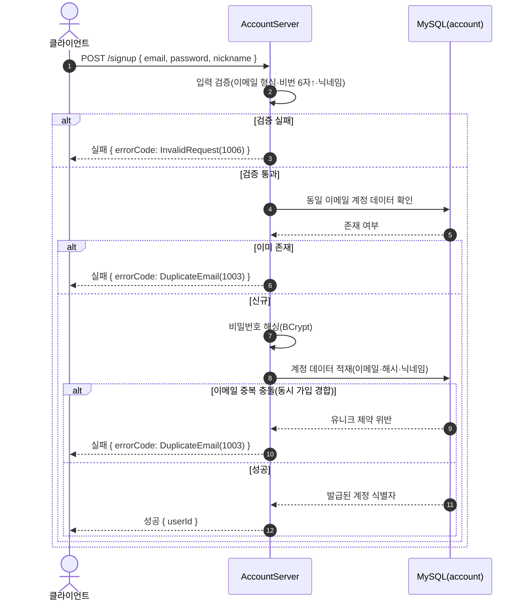
```mermaid
sequenceDiagram
    autonumber
    actor C as 클라이언트
    participant S as AccountServer
    participant DB as MySQL(account)

    C->>S: POST /signup { email, password, nickname }
    S->>S: 입력 검증(이메일 형식·비번 6자↑·닉네임)
    alt 검증 실패
        S-->>C: 실패 { errorCode: InvalidRequest(1006) }
    else 검증 통과
        S->>DB: 동일 이메일 계정 데이터 확인
        DB-->>S: 존재 여부
        alt 이미 존재
            S-->>C: 실패 { errorCode: DuplicateEmail(1003) }
        else 신규
            S->>S: 비밀번호 해싱(BCrypt)
            S->>DB: 계정 데이터 적재(이메일·해시·닉네임)
            alt 이메일 중복 충돌(동시 가입 경합)
                DB-->>S: 유니크 제약 위반
                S-->>C: 실패 { errorCode: DuplicateEmail(1003) }
            else 성공
                DB-->>S: 발급된 계정 식별자
                S-->>C: 성공 { userId }
            end
        end
    end
```

### POST /api/auth/login — 로그인(토큰 발급)

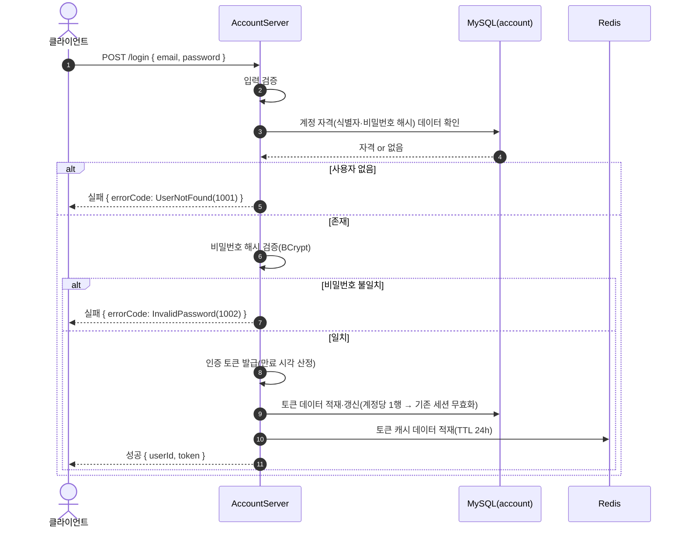
```mermaid
sequenceDiagram
    autonumber
    actor C as 클라이언트
    participant S as AccountServer
    participant DB as MySQL(account)
    participant Redis as Redis

    C->>S: POST /login { email, password }
    S->>S: 입력 검증
    S->>DB: 계정 자격(식별자·비밀번호 해시) 데이터 확인
    DB-->>S: 자격 or 없음
    alt 사용자 없음
        S-->>C: 실패 { errorCode: UserNotFound(1001) }
    else 존재
        S->>S: 비밀번호 해시 검증(BCrypt)
        alt 비밀번호 불일치
            S-->>C: 실패 { errorCode: InvalidPassword(1002) }
        else 일치
            S->>S: 인증 토큰 발급(만료 시각 산정)
            S->>DB: 토큰 데이터 적재·갱신(계정당 1행 → 기존 세션 무효화)
            S->>Redis: 토큰 캐시 데이터 적재(TTL 24h)
            S-->>C: 성공 { userId, token }
        end
    end
```

### POST /api/auth/logout — 로그아웃(토큰 무효화)

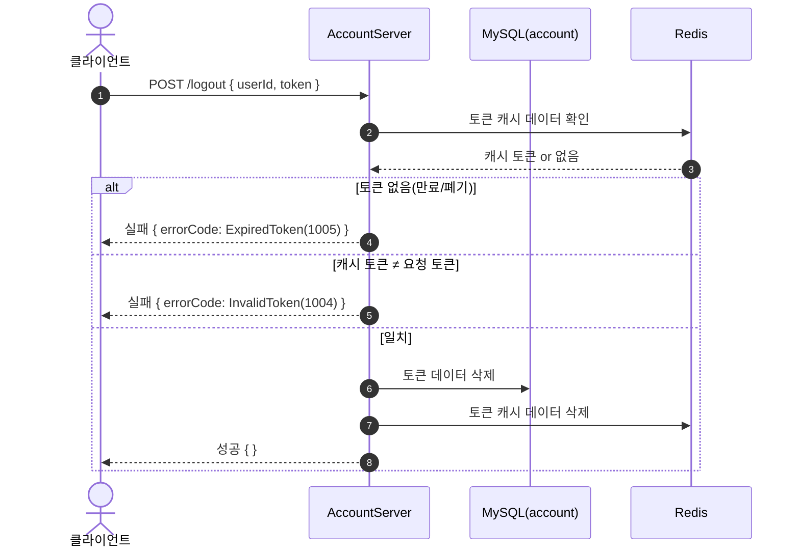
```mermaid
sequenceDiagram
    autonumber
    actor C as 클라이언트
    participant S as AccountServer
    participant DB as MySQL(account)
    participant Redis as Redis

    C->>S: POST /logout { userId, token }
    S->>Redis: 토큰 캐시 데이터 확인
    Redis-->>S: 캐시 토큰 or 없음
    alt 토큰 없음(만료/폐기)
        S-->>C: 실패 { errorCode: ExpiredToken(1005) }
    else 캐시 토큰 ≠ 요청 토큰
        S-->>C: 실패 { errorCode: InvalidToken(1004) }
    else 일치
        S->>DB: 토큰 데이터 삭제
        S->>Redis: 토큰 캐시 데이터 삭제
        S-->>C: 성공 { }
    end
```

## 세이브 데이터/캐릭터 생성

세이브 로드·캐릭터 생성·접속 시각 갱신 (GameSaveController, `/api/game`, GameServer). 저장소: MySQL `taskbar_hero_game`(`game_player`·`player_character`·`player_item`·`player_cube` 등).

### POST /api/game/load — 세이브 로드

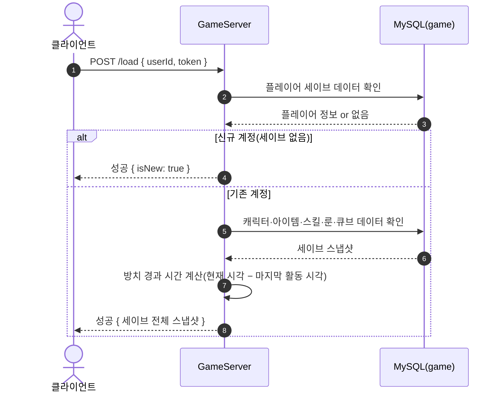
```mermaid
sequenceDiagram
    autonumber
    actor C as 클라이언트
    participant S as GameServer
    participant DB as MySQL(game)

    C->>S: POST /load { userId, token }
    S->>DB: 플레이어 세이브 데이터 확인
    DB-->>S: 플레이어 정보 or 없음
    alt 신규 계정(세이브 없음)
        S-->>C: 성공 { isNew: true }
    else 기존 계정
        S->>DB: 캐릭터·아이템·스킬·룬·큐브 데이터 확인
        DB-->>S: 세이브 스냅샷
        S->>S: 방치 경과 시간 계산(현재 시각 − 마지막 활동 시각)
        S-->>C: 성공 { 세이브 전체 스냅샷 }
    end
```

### POST /api/game/create-character — 캐릭터 생성

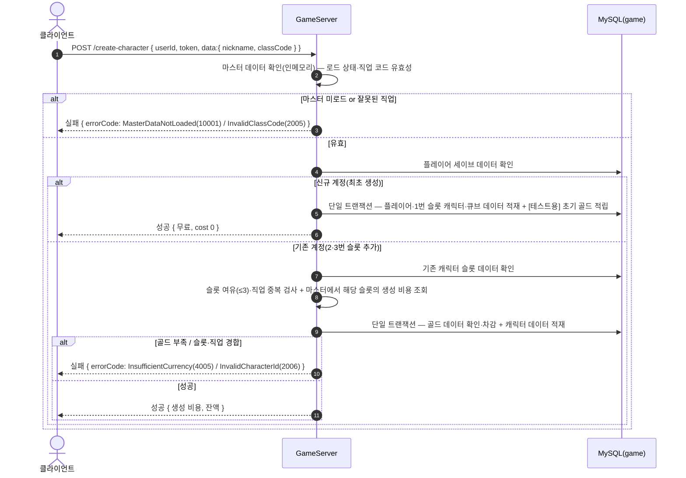
```mermaid
sequenceDiagram
    autonumber
    actor C as 클라이언트
    participant S as GameServer
    participant DB as MySQL(game)

    C->>S: POST /create-character { userId, token, data:{ nickname, classCode } }
    S->>S: 마스터 데이터 확인(인메모리) — 로드 상태·직업 코드 유효성
    alt 마스터 미로드 or 잘못된 직업
        S-->>C: 실패 { errorCode: MasterDataNotLoaded(10001) / InvalidClassCode(2005) }
    else 유효
        S->>DB: 플레이어 세이브 데이터 확인
        alt 신규 계정(최초 생성)
            S->>DB: 단일 트랜잭션 — 플레이어·1번 슬롯 캐릭터·큐브 데이터 적재 + [테스트용] 초기 골드 적립
            S-->>C: 성공 { 무료, cost 0 }
        else 기존 계정(2·3번 슬롯 추가)
            S->>DB: 기존 캐릭터 슬롯 데이터 확인
            S->>S: 슬롯 여유(≤3)·직업 중복 검사 + 마스터에서 해당 슬롯의 생성 비용 조회
            S->>DB: 단일 트랜잭션 — 골드 데이터 확인·차감 + 캐릭터 데이터 적재
            alt 골드 부족 / 슬롯·직업 경합
                S-->>C: 실패 { errorCode: InsufficientCurrency(4005) / InvalidCharacterId(2006) }
            else 성공
                S-->>C: 성공 { 생성 비용, 잔액 }
            end
        end
    end
```

### POST /api/game/update-last-active — 접속 시각 갱신(heartbeat)

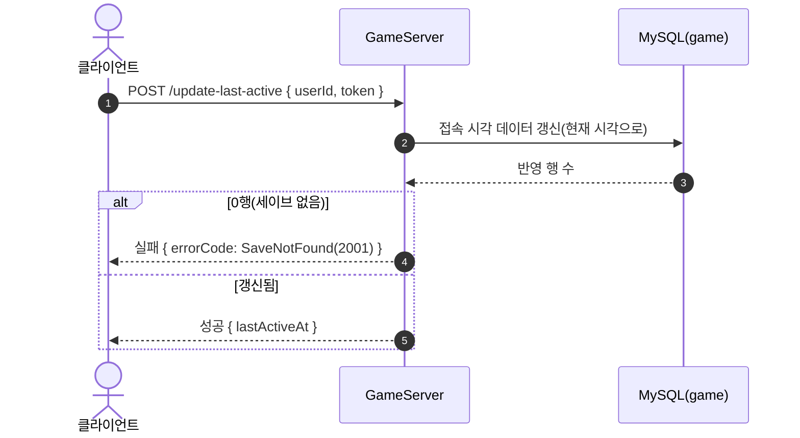
```mermaid
sequenceDiagram
    autonumber
    actor C as 클라이언트
    participant S as GameServer
    participant DB as MySQL(game)

    C->>S: POST /update-last-active { userId, token }
    S->>DB: 접속 시각 데이터 갱신(현재 시각으로)
    DB-->>S: 반영 행 수
    alt 0행(세이브 없음)
        S-->>C: 실패 { errorCode: SaveNotFound(2001) }
    else 갱신됨
        S-->>C: 성공 { lastActiveAt }
    end
```

## 스테이지

스테이지 진입·클리어(서버 권위 보상 산출) (GameStageController, `/api/game/stage`, GameServer). 저장소: MySQL `taskbar_hero_game` + 인메모리 마스터 데이터(stage/reward/level/item).

### POST /api/game/stage/enter — 스테이지 진입

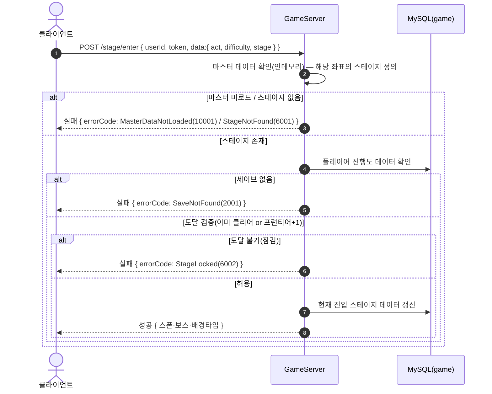
```mermaid
sequenceDiagram
    autonumber
    actor C as 클라이언트
    participant S as GameServer
    participant DB as MySQL(game)

    C->>S: POST /stage/enter { userId, token, data:{ act, difficulty, stage } }
    S->>S: 마스터 데이터 확인(인메모리) — 해당 좌표의 스테이지 정의
    alt 마스터 미로드 / 스테이지 없음
        S-->>C: 실패 { errorCode: MasterDataNotLoaded(10001) / StageNotFound(6001) }
    else 스테이지 존재
        S->>DB: 플레이어 진행도 데이터 확인
        alt 세이브 없음
            S-->>C: 실패 { errorCode: SaveNotFound(2001) }
        else 도달 검증(이미 클리어 or 프런티어+1)
            alt 도달 불가(잠김)
                S-->>C: 실패 { errorCode: StageLocked(6002) }
            else 허용
                S->>DB: 현재 진입 스테이지 데이터 갱신
                S-->>C: 성공 { 스폰·보스·배경타입 }
            end
        end
    end
```

### POST /api/game/stage/clear — 스테이지 클리어(보상 지급)

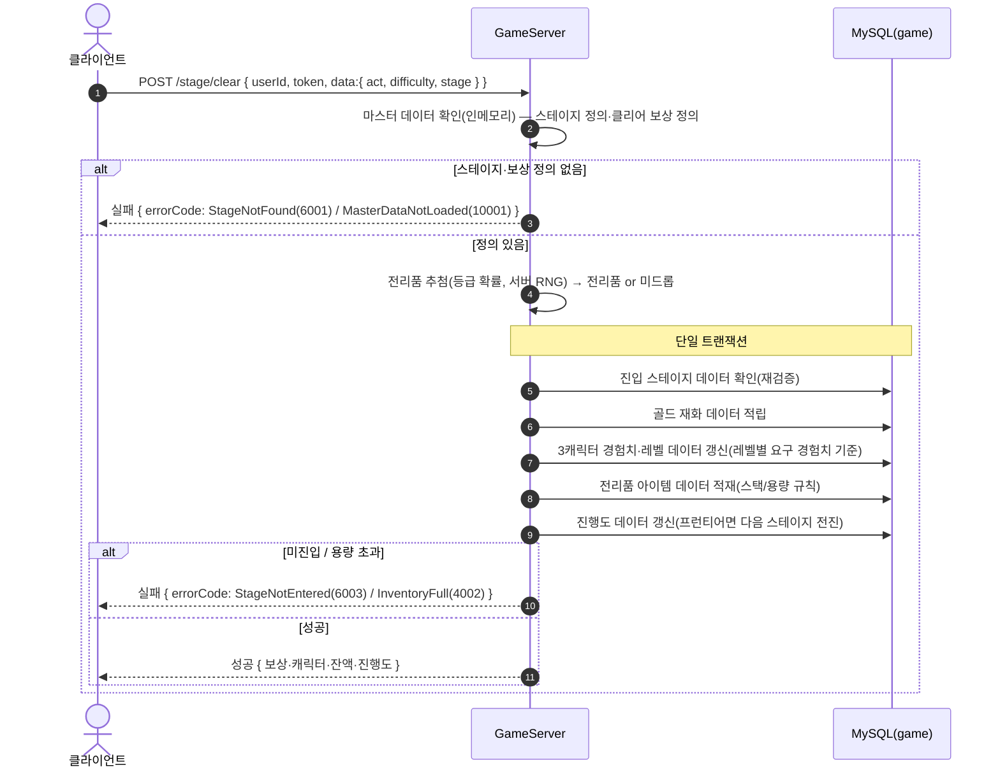
```mermaid
sequenceDiagram
    autonumber
    actor C as 클라이언트
    participant S as GameServer
    participant DB as MySQL(game)

    C->>S: POST /stage/clear { userId, token, data:{ act, difficulty, stage } }
    S->>S: 마스터 데이터 확인(인메모리) — 스테이지 정의·클리어 보상 정의
    alt 스테이지·보상 정의 없음
        S-->>C: 실패 { errorCode: StageNotFound(6001) / MasterDataNotLoaded(10001) }
    else 정의 있음
        S->>S: 전리품 추첨(등급 확률, 서버 RNG) → 전리품 or 미드롭
        Note over S,DB: 단일 트랜잭션
        S->>DB: 진입 스테이지 데이터 확인(재검증)
        S->>DB: 골드 재화 데이터 적립
        S->>DB: 3캐릭터 경험치·레벨 데이터 갱신(레벨별 요구 경험치 기준)
        S->>DB: 전리품 아이템 데이터 적재(스택/용량 규칙)
        S->>DB: 진행도 데이터 갱신(프런티어면 다음 스테이지 전진)
        alt 미진입 / 용량 초과
            S-->>C: 실패 { errorCode: StageNotEntered(6003) / InventoryFull(4002) }
        else 성공
            S-->>C: 성공 { 보상·캐릭터·잔액·진행도 }
        end
    end
```

## 방치형 오프라인 보상

방치형 오프라인 보상 정산 (GameOfflineController, `/api/game/offline`, GameServer). 저장소: MySQL `taskbar_hero_game`(`game_player`·`player_character`·`player_item`) + 인메모리 마스터 데이터(stage_reward·level). 중복 정산은 트랜잭션 + `last_active_at` CAS로 방지한다.

### POST /api/game/offline/claim — 오프라인 보상 정산

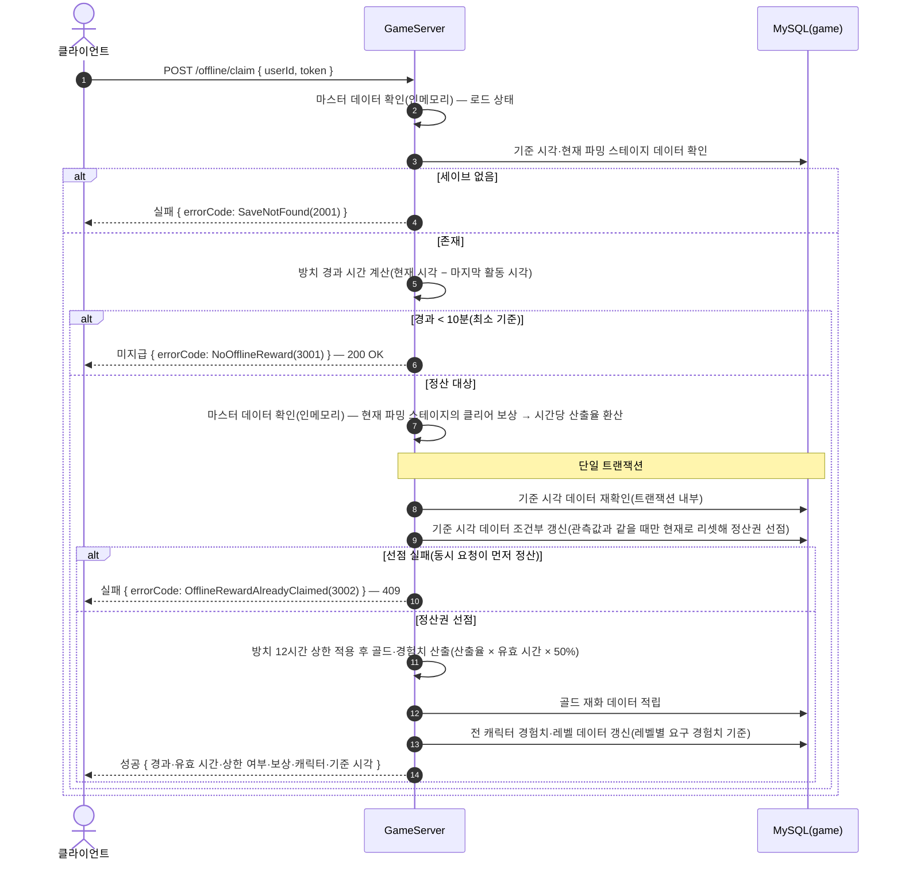
```mermaid
sequenceDiagram
    autonumber
    actor C as 클라이언트
    participant S as GameServer
    participant DB as MySQL(game)

    C->>S: POST /offline/claim { userId, token }
    S->>S: 마스터 데이터 확인(인메모리) — 로드 상태
    S->>DB: 기준 시각·현재 파밍 스테이지 데이터 확인
    alt 세이브 없음
        S-->>C: 실패 { errorCode: SaveNotFound(2001) }
    else 존재
        S->>S: 방치 경과 시간 계산(현재 시각 − 마지막 활동 시각)
        alt 경과 < 10분(최소 기준)
            S-->>C: 미지급 { errorCode: NoOfflineReward(3001) } — 200 OK
        else 정산 대상
            S->>S: 마스터 데이터 확인(인메모리) — 현재 파밍 스테이지의 클리어 보상 → 시간당 산출율 환산
            Note over S,DB: 단일 트랜잭션
            S->>DB: 기준 시각 데이터 재확인(트랜잭션 내부)
            S->>DB: 기준 시각 데이터 조건부 갱신(관측값과 같을 때만 현재로 리셋해 정산권 선점)
            alt 선점 실패(동시 요청이 먼저 정산)
                S-->>C: 실패 { errorCode: OfflineRewardAlreadyClaimed(3002) } — 409
            else 정산권 선점
                S->>S: 방치 12시간 상한 적용 후 골드·경험치 산출(산출율 × 유효 시간 × 50%)
                S->>DB: 골드 재화 데이터 적립
                S->>DB: 전 캐릭터 경험치·레벨 데이터 갱신(레벨별 요구 경험치 기준)
                S-->>C: 성공 { 경과·유효 시간·상한 여부·보상·캐릭터·기준 시각 }
            end
        end
    end
```

## 인벤토리/아이템

장비 장착·해제·배치 이동·용량 확장 (GameInventoryController, `/api/game/inventory`, GameServer). 저장소: MySQL `taskbar_hero_game`(`player_item`·`player_item_equipped`·`game_player`) + 인메모리 마스터 데이터(item·확장 비용).

### POST /api/game/inventory/equip — 장착(스왑)

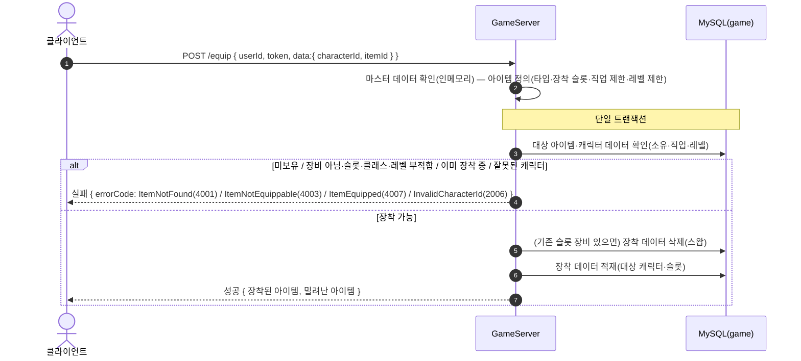
```mermaid
sequenceDiagram
    autonumber
    actor C as 클라이언트
    participant S as GameServer
    participant DB as MySQL(game)

    C->>S: POST /equip { userId, token, data:{ characterId, itemId } }
    S->>S: 마스터 데이터 확인(인메모리) — 아이템 정의(타입·장착 슬롯·직업 제한·레벨 제한)
    Note over S,DB: 단일 트랜잭션
    S->>DB: 대상 아이템·캐릭터 데이터 확인(소유·직업·레벨)
    alt 미보유 / 장비 아님·슬롯·클래스·레벨 부적합 / 이미 장착 중 / 잘못된 캐릭터
        S-->>C: 실패 { errorCode: ItemNotFound(4001) / ItemNotEquippable(4003) / ItemEquipped(4007) / InvalidCharacterId(2006) }
    else 장착 가능
        S->>DB: (기존 슬롯 장비 있으면) 장착 데이터 삭제(스왑)
        S->>DB: 장착 데이터 적재(대상 캐릭터·슬롯)
        S-->>C: 성공 { 장착된 아이템, 밀려난 아이템 }
    end
```

### POST /api/game/inventory/unequip — 장착 해제

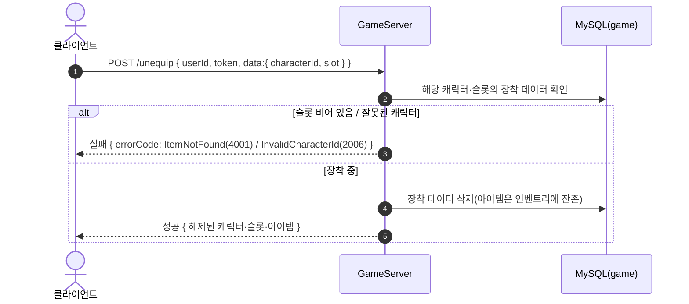
```mermaid
sequenceDiagram
    autonumber
    actor C as 클라이언트
    participant S as GameServer
    participant DB as MySQL(game)

    C->>S: POST /unequip { userId, token, data:{ characterId, slot } }
    S->>DB: 해당 캐릭터·슬롯의 장착 데이터 확인
    alt 슬롯 비어 있음 / 잘못된 캐릭터
        S-->>C: 실패 { errorCode: ItemNotFound(4001) / InvalidCharacterId(2006) }
    else 장착 중
        S->>DB: 장착 데이터 삭제(아이템은 인벤토리에 잔존)
        S-->>C: 성공 { 해제된 캐릭터·슬롯·아이템 }
    end
```

### POST /api/game/inventory/move — 배치 이동/교환

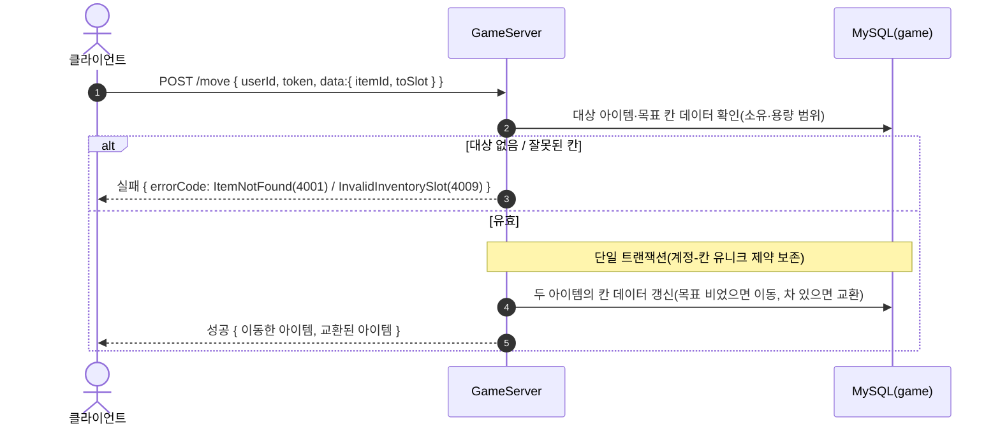
```mermaid
sequenceDiagram
    autonumber
    actor C as 클라이언트
    participant S as GameServer
    participant DB as MySQL(game)

    C->>S: POST /move { userId, token, data:{ itemId, toSlot } }
    S->>DB: 대상 아이템·목표 칸 데이터 확인(소유·용량 범위)
    alt 대상 없음 / 잘못된 칸
        S-->>C: 실패 { errorCode: ItemNotFound(4001) / InvalidInventorySlot(4009) }
    else 유효
        Note over S,DB: 단일 트랜잭션(계정-칸 유니크 제약 보존)
        S->>DB: 두 아이템의 칸 데이터 갱신(목표 비었으면 이동, 차 있으면 교환)
        S-->>C: 성공 { 이동한 아이템, 교환된 아이템 }
    end
```

### POST /api/game/inventory/expand — 용량 1칸 확장(골드 소모)

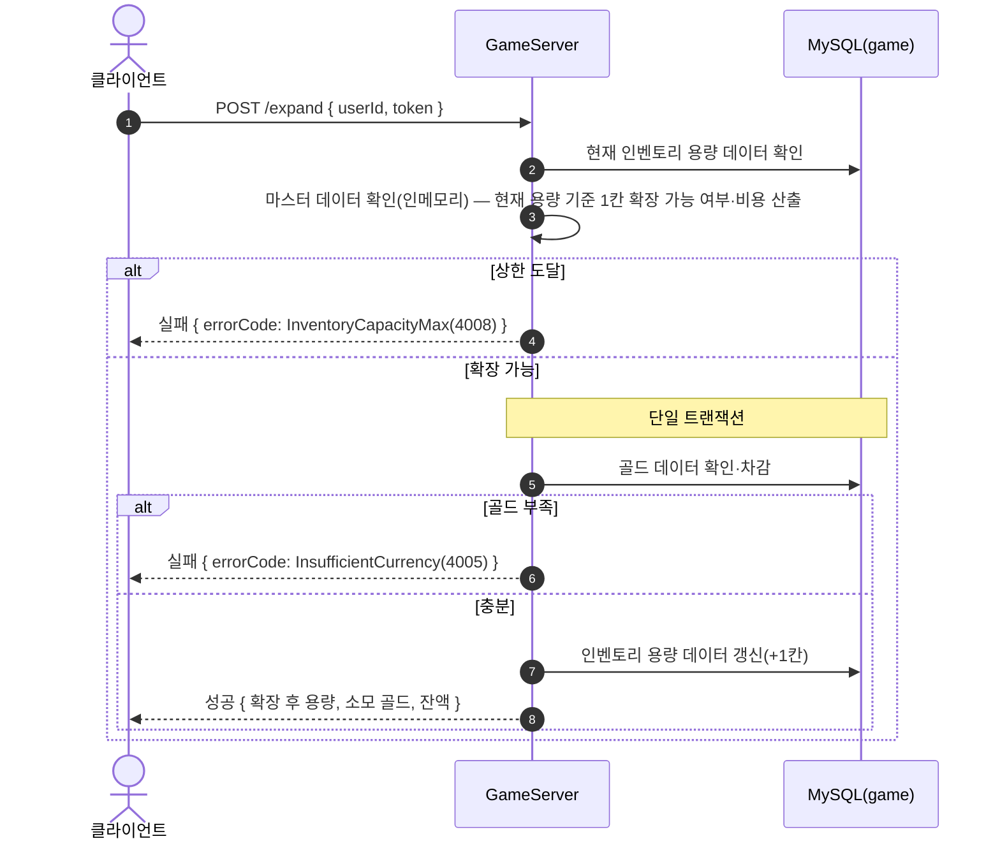
```mermaid
sequenceDiagram
    autonumber
    actor C as 클라이언트
    participant S as GameServer
    participant DB as MySQL(game)

    C->>S: POST /expand { userId, token }
    S->>DB: 현재 인벤토리 용량 데이터 확인
    S->>S: 마스터 데이터 확인(인메모리) — 현재 용량 기준 1칸 확장 가능 여부·비용 산출
    alt 상한 도달
        S-->>C: 실패 { errorCode: InventoryCapacityMax(4008) }
    else 확장 가능
        Note over S,DB: 단일 트랜잭션
        S->>DB: 골드 데이터 확인·차감
        alt 골드 부족
            S-->>C: 실패 { errorCode: InsufficientCurrency(4005) }
        else 충분
            S->>DB: 인벤토리 용량 데이터 갱신(+1칸)
            S-->>C: 성공 { 확장 후 용량, 소모 골드, 잔액 }
        end
    end
```

## 큐브

큐브 — 합성·분해·제작(서버 권위 결과 산출) (GameCubeController, `/api/game/cube`, GameServer). 저장소: MySQL `taskbar_hero_game`(`player_item`·`player_cube`) + 인메모리 마스터 데이터(cube_master·item·recipe). 연산마다 큐브 경험치가 쌓여 레벨업한다.

### POST /api/game/cube/combine — 합성(동급 3개 → 상위 등급 1개)

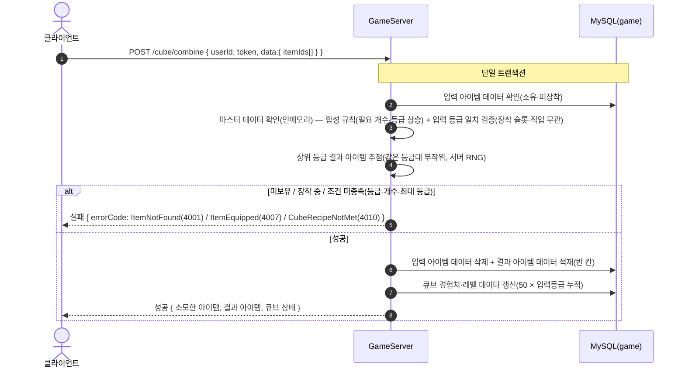
```mermaid
sequenceDiagram
    autonumber
    actor C as 클라이언트
    participant S as GameServer
    participant DB as MySQL(game)

    C->>S: POST /cube/combine { userId, token, data:{ itemIds[] } }
    Note over S,DB: 단일 트랜잭션
    S->>DB: 입력 아이템 데이터 확인(소유·미장착)
    S->>S: 마스터 데이터 확인(인메모리) — 합성 규칙(필요 개수·등급 상승) + 입력 등급 일치 검증(장착 슬롯·직업 무관)
    S->>S: 상위 등급 결과 아이템 추첨(같은 등급대 무작위, 서버 RNG)
    alt 미보유 / 장착 중 / 조건 미충족(등급·개수·최대 등급)
        S-->>C: 실패 { errorCode: ItemNotFound(4001) / ItemEquipped(4007) / CubeRecipeNotMet(4010) }
    else 성공
        S->>DB: 입력 아이템 데이터 삭제 + 결과 아이템 데이터 적재(빈 칸)
        S->>DB: 큐브 경험치·레벨 데이터 갱신(50 × 입력등급 누적)
        S-->>C: 성공 { 소모한 아이템, 결과 아이템, 큐브 상태 }
    end
```

### POST /api/game/cube/dismantle — 분해(아이템 → 골드)

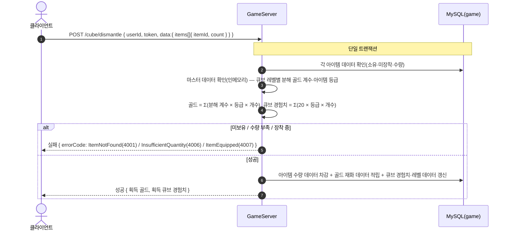
```mermaid
sequenceDiagram
    autonumber
    actor C as 클라이언트
    participant S as GameServer
    participant DB as MySQL(game)

    C->>S: POST /cube/dismantle { userId, token, data:{ items[]{ itemId, count } } }
    Note over S,DB: 단일 트랜잭션
    S->>DB: 각 아이템 데이터 확인(소유·미장착·수량)
    S->>S: 마스터 데이터 확인(인메모리) — 큐브 레벨별 분해 골드 계수·아이템 등급
    S->>S: 골드 = Σ(분해 계수 × 등급 × 개수), 큐브 경험치 = Σ(20 × 등급 × 개수)
    alt 미보유 / 수량 부족 / 장착 중
        S-->>C: 실패 { errorCode: ItemNotFound(4001) / InsufficientQuantity(4006) / ItemEquipped(4007) }
    else 성공
        S->>DB: 아이템 수량 데이터 차감 + 골드 재화 데이터 적립 + 큐브 경험치·레벨 데이터 갱신
        S-->>C: 성공 { 획득 골드, 획득 큐브 경험치 }
    end
```

### POST /api/game/cube/craft — 제작(레시피)

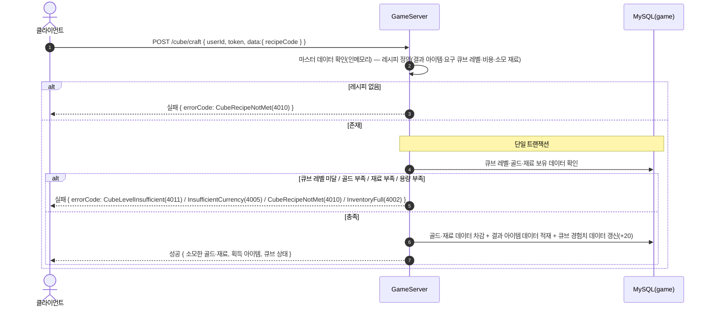
```mermaid
sequenceDiagram
    autonumber
    actor C as 클라이언트
    participant S as GameServer
    participant DB as MySQL(game)

    C->>S: POST /cube/craft { userId, token, data:{ recipeCode } }
    S->>S: 마스터 데이터 확인(인메모리) — 레시피 정의(결과 아이템·요구 큐브 레벨·비용·소모 재료)
    alt 레시피 없음
        S-->>C: 실패 { errorCode: CubeRecipeNotMet(4010) }
    else 존재
        Note over S,DB: 단일 트랜잭션
        S->>DB: 큐브 레벨·골드·재료 보유 데이터 확인
        alt 큐브 레벨 미달 / 골드 부족 / 재료 부족 / 용량 부족
            S-->>C: 실패 { errorCode: CubeLevelInsufficient(4011) / InsufficientCurrency(4005) / CubeRecipeNotMet(4010) / InventoryFull(4002) }
        else 충족
            S->>DB: 골드·재료 데이터 차감 + 결과 아이템 데이터 적재 + 큐브 경험치 데이터 갱신(+20)
            S-->>C: 성공 { 소모한 골드·재료, 획득 아이템, 큐브 상태 }
        end
    end
```

## 성장(스킬·룬)

성장 — 스킬 레벨업·초기화·액티브 장착·룬 업그레이드 (GameGrowthController, `/api/game/growth`, GameServer). 저장소: MySQL `taskbar_hero_game`(`player_skill`·`player_rune`·`player_character`·`player_item`) + 인메모리 마스터 데이터(skill·rune·level·rune_cost).

> 스킬 포인트는 저장값이 아니라 레벨별 스킬 포인트 정의에서 파생(레벨 기준 총량 − 사용량)한다.

### POST /api/game/growth/skill/levelup — 스킬 레벨업

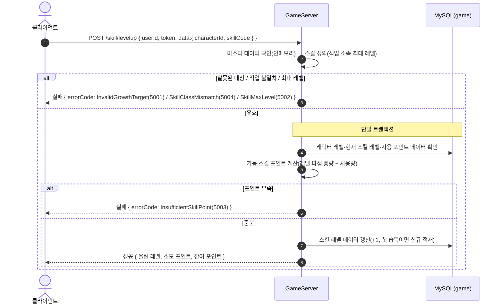
```mermaid
sequenceDiagram
    autonumber
    actor C as 클라이언트
    participant S as GameServer
    participant DB as MySQL(game)

    C->>S: POST /skill/levelup { userId, token, data:{ characterId, skillCode } }
    S->>S: 마스터 데이터 확인(인메모리) — 스킬 정의(직업 소속·최대 레벨)
    alt 잘못된 대상 / 직업 불일치 / 최대 레벨
        S-->>C: 실패 { errorCode: InvalidGrowthTarget(5001) / SkillClassMismatch(5004) / SkillMaxLevel(5002) }
    else 유효
        Note over S,DB: 단일 트랜잭션
        S->>DB: 캐릭터 레벨·현재 스킬 레벨·사용 포인트 데이터 확인
        S->>S: 가용 스킬 포인트 계산(레벨 파생 총량 − 사용량)
        alt 포인트 부족
            S-->>C: 실패 { errorCode: InsufficientSkillPoint(5003) }
        else 충분
            S->>DB: 스킬 레벨 데이터 갱신(+1, 첫 습득이면 신규 적재)
            S-->>C: 성공 { 올린 레벨, 소모 포인트, 잔여 포인트 }
        end
    end
```

### POST /api/game/growth/skill/reset — 스킬 초기화

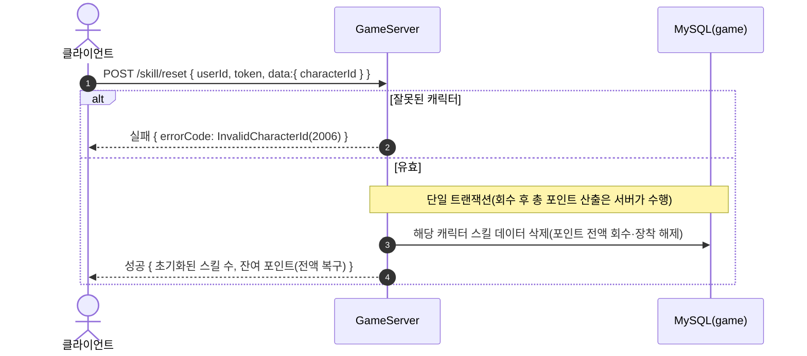
```mermaid
sequenceDiagram
    autonumber
    actor C as 클라이언트
    participant S as GameServer
    participant DB as MySQL(game)

    C->>S: POST /skill/reset { userId, token, data:{ characterId } }
    alt 잘못된 캐릭터
        S-->>C: 실패 { errorCode: InvalidCharacterId(2006) }
    else 유효
        Note over S,DB: 단일 트랜잭션(회수 후 총 포인트 산출은 서버가 수행)
        S->>DB: 해당 캐릭터 스킬 데이터 삭제(포인트 전액 회수·장착 해제)
        S-->>C: 성공 { 초기화된 스킬 수, 잔여 포인트(전액 복구) }
    end
```

### POST /api/game/growth/skill/equip — 액티브 스킬 장착(0~2개)

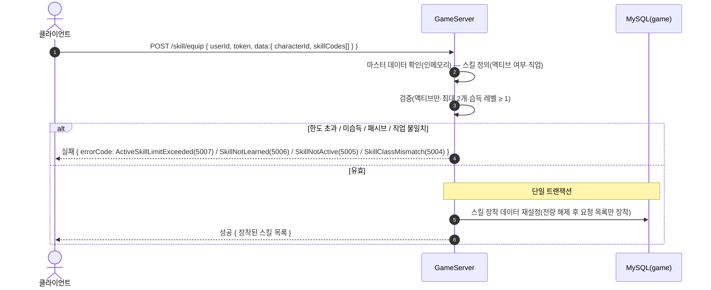
```mermaid
sequenceDiagram
    autonumber
    actor C as 클라이언트
    participant S as GameServer
    participant DB as MySQL(game)

    C->>S: POST /skill/equip { userId, token, data:{ characterId, skillCodes[] } }
    S->>S: 마스터 데이터 확인(인메모리) — 스킬 정의(액티브 여부·직업)
    S->>S: 검증(액티브만·최대 2개·습득 레벨 ≥ 1)
    alt 한도 초과 / 미습득 / 패시브 / 직업 불일치
        S-->>C: 실패 { errorCode: ActiveSkillLimitExceeded(5007) / SkillNotLearned(5006) / SkillNotActive(5005) / SkillClassMismatch(5004) }
    else 유효
        Note over S,DB: 단일 트랜잭션
        S->>DB: 스킬 장착 데이터 재설정(전량 해제 후 요청 목록만 장착)
        S-->>C: 성공 { 장착된 스킬 목록 }
    end
```

### POST /api/game/growth/rune/upgrade — 룬 업그레이드(골드 소모)

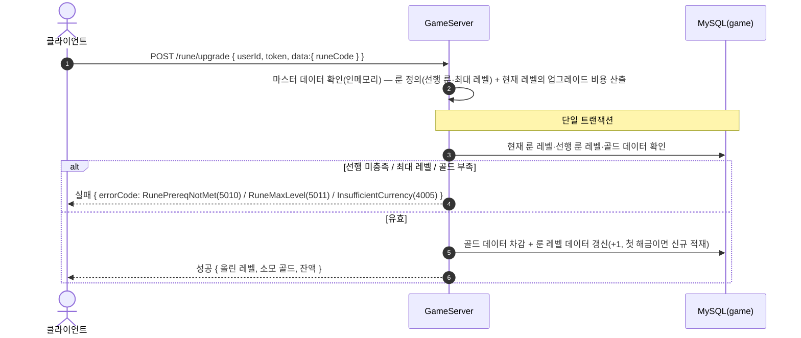
```mermaid
sequenceDiagram
    autonumber
    actor C as 클라이언트
    participant S as GameServer
    participant DB as MySQL(game)

    C->>S: POST /rune/upgrade { userId, token, data:{ runeCode } }
    S->>S: 마스터 데이터 확인(인메모리) — 룬 정의(선행 룬·최대 레벨) + 현재 레벨의 업그레이드 비용 산출
    Note over S,DB: 단일 트랜잭션
    S->>DB: 현재 룬 레벨·선행 룬 레벨·골드 데이터 확인
    alt 선행 미충족 / 최대 레벨 / 골드 부족
        S-->>C: 실패 { errorCode: RunePrereqNotMet(5010) / RuneMaxLevel(5011) / InsufficientCurrency(4005) }
    else 유효
        S->>DB: 골드 데이터 차감 + 룬 레벨 데이터 갱신(+1, 첫 해금이면 신규 적재)
        S-->>C: 성공 { 올린 레벨, 소모 골드, 잔액 }
    end
```

## 메일

우편함 조회·첨부 수령·일괄 수령 (GameMailController, `/api/game/mail`, GameServer). 저장소: MySQL `taskbar_hero_game`(`player_mail`·`player_mail_reward`·`player_item`·`game_player`) + 인메모리 마스터 데이터(item — 첨부 적재 규칙). 첨부 종류·수량은 발급 시점에 확정된 메일 원장이 기준이며(서버 권위), 중복 수령은 조건부 갱신(`claimed` 0→1일 때만 전이)으로 차단한다. 보관(발급 후 7일)이 지난 메일은 GameServer 내 배치(`MailGcBatchService`)가 주기 삭제한다(엔드포인트 없음, mail 기획서 6.5).

### POST /api/game/mail/list — 우편함 조회(+읽음 처리)

```mermaid
sequenceDiagram
    autonumber
    actor C as 클라이언트
    participant S as GameServer
    participant DB as MySQL(game)

    C->>S: POST /mail/list { userId, token }
    Note over S,DB: 단일 트랜잭션
    S->>DB: 우편함 메일·첨부 데이터 확인(만료·수령 완료 포함 전건)
    DB-->>S: 메일 목록 스냅샷
    S->>DB: 미열람 메일 읽음 데이터 갱신(조회 = 열람)
    S-->>C: 성공 { mails[] — isRead는 조회 시점 값(신규 표시용) }
```

### POST /api/game/mail/claim — 메일 첨부 단건 수령

```mermaid
sequenceDiagram
    autonumber
    actor C as 클라이언트
    participant S as GameServer
    participant DB as MySQL(game)

    C->>S: POST /mail/claim { userId, token, data:{ mailId } }
    Note over S,DB: 단일 트랜잭션
    S->>DB: 메일 데이터 확인(존재·소유)
    alt 없음 / 타인 메일(존재 비노출)
        S-->>C: 실패 { errorCode: MailNotFound(8001) }
    else 이미 수령
        S-->>C: 실패 { errorCode: MailAlreadyClaimed(8002) }
    else 만료
        S-->>C: 실패 { errorCode: MailExpired(8003) }
    else 수령 가능
        S->>DB: 수령권 선점 — 수령 데이터 조건부 갱신(미수령일 때만 수령 완료로 전이)
        alt 반영 0행(동시 요청이 먼저 수령)
            S-->>C: 실패 { errorCode: MailAlreadyClaimed(8002) }
        else 선점 성공
            S->>DB: 첨부 원장 데이터 확인(클라이언트 입력 없음)
            S->>S: 마스터 데이터 확인(인메모리) — 첨부 아이템 적재 규칙(타입·스택 상한)
            S->>DB: 골드 재화 데이터 적립 + 아이템/재료 데이터 적재(스택 병합·빈 칸)
            alt 용량 초과(롤백 — 미수령 유지)
                S-->>C: 실패 { errorCode: InventoryFull(4002) }
            else 지급 완료
                S-->>C: 성공 { mailId, gained, balance }
            end
        end
    end
```

### POST /api/game/mail/claim-all — 일괄 수령

```mermaid
sequenceDiagram
    autonumber
    actor C as 클라이언트
    participant S as GameServer
    participant DB as MySQL(game)

    C->>S: POST /mail/claim-all { userId, token }
    Note over S,DB: 단일 트랜잭션
    S->>DB: 미수령·미만료 메일 데이터 확인
    loop 대상 메일별
        S->>DB: 수령권 선점 — 수령 데이터 조건부 갱신(경합 메일은 제외하고 계속)
    end
    S->>DB: 선점한 메일들의 첨부 원장 데이터 확인
    S->>S: 마스터 데이터 확인(인메모리) — 첨부 아이템 적재 규칙(타입·스택 상한)
    S->>DB: 골드 합계 데이터 적립 + 아이템/재료 데이터 적재(스택 병합·빈 칸)
    alt 용량 초과(전체 롤백 — 부분 수령 없음)
        S-->>C: 실패 { errorCode: InventoryFull(4002) }
    else 지급 완료(대상 없으면 빈 목록)
        S-->>C: 성공 { claimedMailIds[], gained(합계), balance }
    end
```

## 출석부 보상

이번달 출석 현황 조회·오늘자 출석 보상 획득 (GameAttendanceController, `/api/game/attendance`, GameServer). 저장소: MySQL `taskbar_hero_game`(`player_attendance`·`player_mail`·`player_mail_reward`) + 인메모리 마스터 데이터(attendance — 일자별 보상, mail 템플릿 301). "오늘"은 요청 수신 시점의 서버 시각을 **KST(UTC+9) 자정 경계**로 판정하며(서버 권위, 클라이언트 날짜 불신), 보상은 즉시 지급하지 않고 **메일(category=3, 발급 후 7일 만료)로 발급**한다 — 계정 반영은 우편함 수령(메일 5.2) 시. 하루 1회는 `(user_id, attend_date)` PK가 보장한다(attendance 기획서 §5·§6).

### POST /api/game/attendance/status — 이번달 출석 현황 조회

```mermaid
sequenceDiagram
    autonumber
    actor C as 클라이언트
    participant S as GameServer
    participant DB as MySQL(game)

    C->>S: POST /attendance/status { userId, token }
    S->>S: 오늘/이번달 판정(서버 KST) — yearMonth·today·todayDay
    S->>S: 마스터 데이터 확인(인메모리) — 이달 일자별 보상(attendance_master)
    alt 마스터 미로드
        S-->>C: 실패 { errorCode: MasterDataNotLoaded(10001) }
    else 정상
        S->>DB: 이번달 출석 일자 데이터 확인(player_attendance, 이달 범위)
        DB-->>S: 출석한 일자 목록
        S->>S: 달력 구성 — 일자별 보상 + 수령 여부(claimed), 오늘 수령 여부(todayClaimed)
        S-->>C: 성공 { yearMonth, today, todayDay, todayClaimed, days[] }
    end
```

- 조회는 상태를 바꾸지 않는다(출석 처리 아님). 다른 달 조회·과거일 소급 수령은 제공하지 않는다.

### POST /api/game/attendance/claim — 출석 보상 획득(메일 발급)

```mermaid
sequenceDiagram
    autonumber
    actor C as 클라이언트
    participant S as GameServer
    participant DB as MySQL(game)

    C->>S: POST /attendance/claim { userId, token }
    S->>S: 오늘 판정(서버 KST) — today(YYYYMMDD)·day(며칠차)
    S->>S: 마스터 데이터 확인(인메모리) — 오늘 day 보상(attendance_master) + 메일 템플릿 301(mail_master)
    alt 마스터 미로드 / 오늘 day 미정의
        S-->>C: 실패 { errorCode: MasterDataNotLoaded(10001) }
    else 정상
        S->>S: 보상 메일 초안 렌더링(제목·본문·만료 = 발급 + 7일, 템플릿 확정)
        Note over S,DB: 단일 트랜잭션
        S->>DB: 계정 세이브 데이터 확인(game_player)
        alt 세이브 없음(캐릭터 생성 전)
            S-->>C: 실패 { errorCode: SaveNotFound(2001) }
        end
        S->>DB: 오늘자 출석 데이터 확인(player_attendance)
        alt 이미 출석(행 존재 — 동시 요청은 PK 중복으로 직렬화)
            S-->>C: 실패 { errorCode: AttendanceAlreadyClaimed(9001) }
        else 미출석
            S->>DB: 출석 기록 데이터 적재(user_id, today, claimed_at)
            S->>DB: 보상 메일 데이터 적재(player_mail category=3 + player_mail_reward 1건)
            S-->>C: 성공 { attendDate, day, reward, mailId }
        end
    end
```

- 실제 재화·아이템 지급은 여기서 하지 않는다 — 플레이어가 우편함에서 수령(`/api/game/mail/claim`)할 때 계정에 반영된다([메일](#메일) 참고).

### 메일 보관 GC 배치 — MailGcBatchService (엔드포인트 없음)

발급(수신) 후 7일이 지난 메일을 열람·수령 여부와 무관하게 삭제한다(mail 기획서 6.5). GameServer 프로세스 내 `BackgroundService`(공통 골격 `PeriodicBatchService`)로, 기동 직후 1회 + 1시간 주기(설정 `MailGcBatch`)로 실행되고 1회 최대 500건만 처리한다(초과분은 다음 주기 이월). 주기마다 Redis 리더 락(`batch:lock:mail-gc`)을 먼저 획득한 인스턴스만 실행해 scale-out 시 중복 실행을 방지한다.

```mermaid
sequenceDiagram
    autonumber
    participant S as GameServer
    participant R as Redis
    participant DB as MySQL(game)

    Note over S: MailGcBatchService — 기동 직후 1회 실행 후 1시간 주기 반복(재진입 없음)
    loop 매 주기
        S->>R: 리더 락 시도(batch:lock:mail-gc, SET NX + TTL=주기 — 명시 해제 없이 자연 만료)
        alt 락 미획득(다른 인스턴스가 이번 주기 실행)
            S->>S: 스킵(Debug 로그)
        else 락 획득(Redis 장애 시에도 락 없이 진행 — 축소 운전)
            S->>S: 삭제 기준 시각 산출(now − 7일)
            S->>DB: 보관 기한 경과 메일 데이터 확인(발급 시각 기준, mail_id 오름차순 최대 500건)
            alt 대상 없음
                S->>S: 종료(로그 생략 — 소음 방지)
            else 대상 있음
                S->>DB: 메일 데이터 삭제(첨부 player_mail_reward는 FK CASCADE로 함께 삭제)
                S->>S: 요약 로그(삭제 N건)
            end
        end
    end
    Note over S: 주기 실행 실패는 Error 로그 후 루프 유지(다음 주기에 재시도)
```
