# Taskbar Hero — 게임 소개 & 플레이 가이드

작업표시줄 위에 상주하는 **방치형(idle) RPG**다. 파티가 알아서 싸우고 성장하므로, 플레이어는 다른 일을 하면서
화면 한 켠에서 전투를 지켜보다가 이따금 장비·스킬·편성만 손봐 주면 된다.

> 이 문서의 화면 사진은 모두 실제 플레이 화면을 캡처한 것이다.
> 기능별 UI 사진은 뒤에 비치는 전투 화면을 빼고 **해당 UI 부분만 잘라** 실었다.

## 목차

1. [게임 소개](#1-게임-소개)
2. [시작하기](#2-시작하기)
3. [게임 화면 한눈에 보기](#3-게임-화면-한눈에-보기)
4. [클래스별 특징](#4-클래스별-특징)
5. [전투와 성장](#5-전투와-성장)
6. [기능별 가이드](#6-기능별-가이드)
   - [스테이지](#61-스테이지) · [가방/장비](#62-가방장비) · [스킬 레벨업](#63-스킬-레벨업) · [룬](#64-룬)
   - [큐브](#65-큐브) · [뽑기](#66-뽑기) · [거래소](#67-거래소) · [우편함](#68-우편함) · [출석부](#69-출석부)
7. [한눈에 보는 성장 루트](#7-한눈에-보는-성장-루트)

---

## 1. 게임 소개

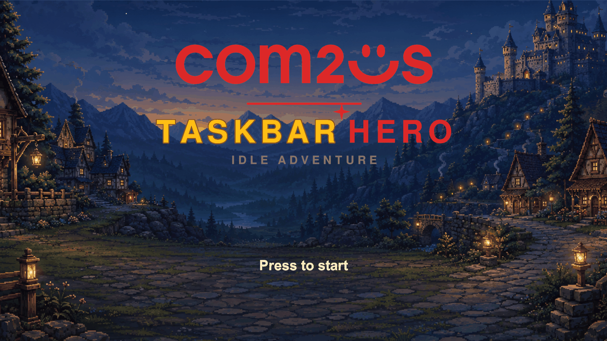

- **방치형 자동 전투** — 파티(최대 3인)가 스스로 전진하고, 사거리에 들어온 적을 자동으로 공격한다.
  스킬도 재사용 대기시간이 차는 대로 알아서 쓴다. 플레이어의 조작은 **성장 결정**(무엇을 입히고, 무엇을 키우고,
  누구를 넣을지)에 집중된다.
- **상주 창** — 게임 창은 작업표시줄 위에 얇게 붙는 형태를 상정한다. 그래서 UI가 화면을 크게 가리지 않도록
  하단 메뉴는 **접었다 펼치는** 방식이고, 전투는 가운데 좁은 띠에서 벌어진다.
- **오프라인에도 진행** — 접속을 끊은 동안의 성과가 다시 접속할 때 정산되어 지급된다.

---

## 2. 시작하기

타이틀에서 **화면을 클릭**하면 시작한다. 계정이 없으면 회원가입을, 있으면 로그인을 하고,
직전에 로그인한 기록이 있으면 자동 로그인으로 바로 넘어간다.

계정에 캐릭터가 하나도 없으면 **캐릭터 선택** 화면으로 간다. 모닥불 앞의 네 직업 중 함께할 동료를 고르는 화면이다.

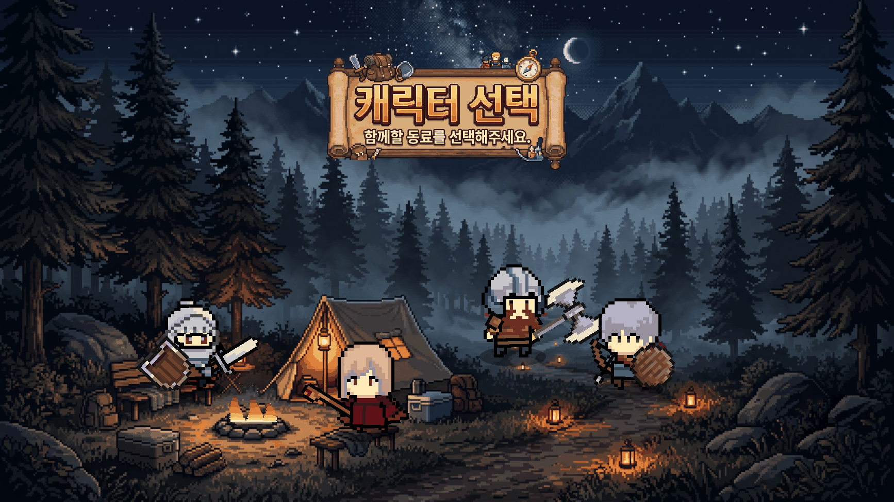

직업을 고르면 성별과 이름을 정하고 생성된다. 캐릭터는 나중에 **[편성] → [+ 캐릭터 추가]** 로 더 만들 수 있다
(직업당 1명, 추가 생성에는 골드가 든다).

---

## 3. 게임 화면 한눈에 보기

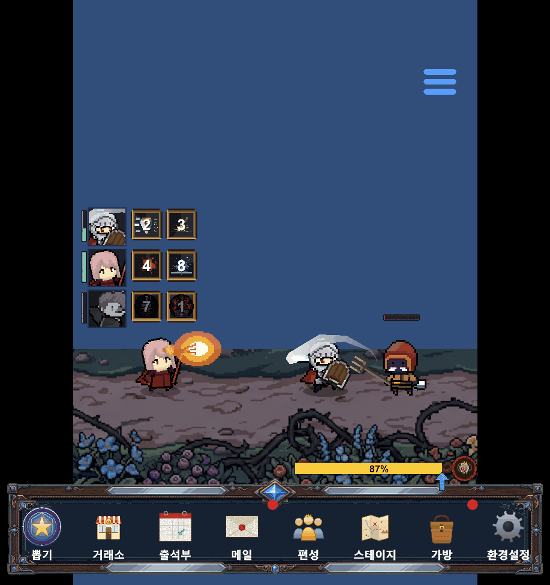

| 위치 | 요소 | 설명 |
| --- | --- | --- |
| 좌측 | **초상화 + 체력바** | 파티원 얼굴이 실시간으로 렌더링된다. 옆의 세로 막대가 체력이며, 피격 시 붉게 번쩍이고 흔들린다. 쓰러지면 초상화가 흑백으로 굳는다 |
| 좌측 | **스킬 슬롯** | 캐릭터마다 장착한 액티브 스킬이 칸으로 뜬다. 숫자는 **남은 재사용 대기시간(초)** 이고, 칸 위에 마우스를 올리면 스킬 설명이 나온다 |
| 하단 | **스테이지 진행 바** | 현재 스테이지의 처치 진행률(%)이다. 100%가 되면 클리어 보상이 뜨고 다음 스테이지로 넘어간다 |
| 하단 | **기능 메뉴 8종** | 뽑기 · 거래소 · 출석부 · 메일 · 편성 · 스테이지 · 가방 · 환경설정 |
| 우측 상단 | **메뉴 손잡이(≡)** | 하단 메뉴를 접고 펴는 버튼. 접으면 전투 화면만 남아 시야를 가리지 않는다 |

- 버튼 오른쪽 위의 **빨간 점**은 처리할 것이 있다는 표시다 — 메일에 미수령 보상이 있거나, 쓰지 않은 스킬
  포인트가 남아 있을 때 붙는다.
- 하단 메뉴가 접혀 있어도 보상을 얻으면 **가방 아이콘이 잠깐 나타나** 보상이 빨려 들어가는 연출을 보여 준 뒤
  다시 사라진다.

---

## 4. 클래스별 특징

직업은 **기사 · 레인저 · 마법사 · 슬레이어** 네 가지다. 사거리와 역할이 서로 달라, 파티는 앞뒤로 자동
정렬된다(사거리가 짧은 직업이 앞줄).

| 직업 | 역할 | 공격력 | 방어력 | 체력 | 치명확률 | 치명피해 | 공격 주기 | 이동속도 |
| --- | --- | ---: | ---: | ---: | ---: | ---: | ---: | ---: |
| **기사** | 최전방 방벽 | 12 | 100 | 1,300 | 5% | 150% | 1.20초 | 3.0 |
| **레인저** | 원거리 속사 | 16 | 7 | 540 | 10% | 150% | 0.90초 | 4.0 |
| **마법사** | 원거리 광역 | 16 | 5 | 470 | 8% | 170% | 1.50초 | 3.2 |
| **슬레이어** | 근접 딜러 | 15 | 9 | 540 | 12% | 160% | 1.10초 | 3.4 |

*(1레벨 기준 기본 능력치. 레벨·장비·룬·패시브로 크게 올라간다.)*

### 기사 — "높은 체력과 방어력으로 최전방에서 적을 막아서는 근접 전사"

파티에서 **가장 앞에 서는 탱커**다. 체력 1,300·방어력 100으로 다른 직업의 2.4~11배를 버틴다
(방어력 100은 받는 피해를 정확히 절반으로 줄인다). 대신 **공격력 12는 4직업 중 가장 낮다** —
기사는 적을 빨리 죽이는 직업이 아니라 **혼자 오래 버티며 미는 직업**이다.

| 액티브 | 재사용 | 효과 |
| --- | ---: | --- |
| 방패 돌진 | 8초 | **뒤로 크게 도약했다가** 앞으로 돌진해 부딪힌다. 방패에 닿은 **전방의 적 전부**가 피해를 입고 함께 날아간다(광역 + 넉백). 부딪히는 순간 먼지 폭발과 파열음이 터진다 |
| 강타 | 6초 | 내려쳐 큰 피해를 준다. 광역이며 바닥에 흔적(데칼)을 남긴다 |
| 기사의 분노 | 15초 | 5초간 자신의 공격력을 크게 올린다 |

패시브: **강철 피부**(방어력) · **불굴**(최대 체력) · **응징**(공격력)

### 레인저 — "빠른 공격 주기와 높은 치명타 확률로 원거리에서 적을 제압하는 궁수"

**공격 주기 0.9초로 가장 빠르고**, 사거리가 길어 뒷줄에서 안전하게 딜을 넣는다.

| 액티브 | 재사용 | 효과 |
| --- | ---: | --- |
| 정조준 사격 | 5초 | 화살이 **날아가는 경로의 적을 모두 꿰뚫는다**(관통 광역) |
| 다중 사격 | 7초 | 한 번에 여러 발을 쏜다 |
| 화살비 | 10초 | 하늘로 도약해 넓은 범위에 화살을 퍼붓는다(광역) |

패시브: **민첩**(이동속도) · **매의 눈**(치명확률) · **치명 훈련**(치명피해)

### 마법사 — "공격 주기는 느리지만 강력한 원소 마법으로 광역 피해를 입히는 술사"

공격 주기 1.5초로 가장 느린 대신, **액티브 3종이 전부 광역**이다. 마법이 뻗어 나가며 **닿은 적을 모두** 맞힌다.

| 액티브 | 재사용 | 효과 |
| --- | ---: | --- |
| 파이어볼 | 4초 | 화염구가 뻗어 나가며 닿은 적을 모두 태운다 |
| 라이트닝 볼트 | 6초 | 번개가 관통하며 화면이 번쩍인다 |
| 프로스트 노바 | 9초 | 얼음이 닿은 적을 **3초간 얼려** 이동을 막는다(피해는 낮은 대신 발을 묶는다) |

패시브: **마력 집중**(공격력) · **예지**(방어력) · **원소 폭발**(공격력)

### 슬레이어 — "거대한 도끼를 휘둘러 적을 베어 넘기는 공격 특화 근접 전사"

**치명확률 12%로 가장 높다.** 근접이지만 방어는 얇아, 기사 뒤에서 화력을 담당한다.

| 액티브 | 재사용 | 효과 |
| --- | ---: | --- |
| 내려찍기 | 7초 | 솟구쳐 올랐다가 내리찍는다. 착지 지점에 광역 피해 + 바닥 흔적 |
| 강한일격 | 9초 | 도끼를 크게 휘둘러 주변의 적을 모두 벤다(광역) |
| 광전사의 힘 | 14초 | **체력을 대가로** 6초간 공격 속도와 흡혈을 얻는다 |

패시브: **살육 본능**(공격력) · **유혈**(치명피해) · **무자비**(치명확률)

### 파티 편성

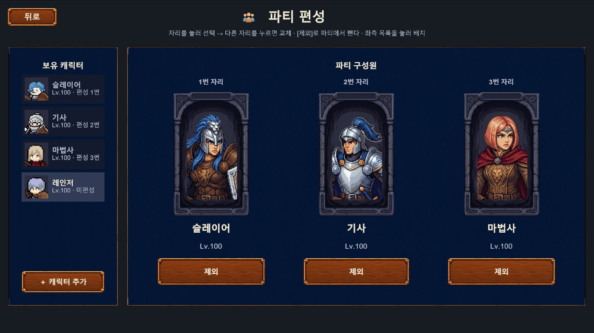

하단 **[편성]** 으로 들어간다. 파티는 **최대 3자리**이고, 보유 캐릭터는 그보다 많을 수 있다.

- 자리를 누르고 다른 자리를 누르면 **교체**, **[제외]** 를 누르면 파티에서 뺀다.
- 왼쪽 **보유 캐릭터** 목록에서 눌러 빈 자리에 배치한다.
- **[+ 캐릭터 추가]** 로 새 직업을 생성한다.

> 편성은 곧 전투 대형이다. 앞줄에 설 탱커(기사)와 뒷줄 딜러의 조합을 고려하자.

---

## 5. 전투와 성장

- **자동 전투** — 파티가 오른쪽으로 전진하다 적을 만나면 교전한다. 기본 공격은 공격 주기마다, 스킬은 재사용
  대기시간이 차는 대로 자동으로 나간다.
- **스테이지 진행** — 정해진 수의 적을 처치하면 진행률이 100%가 되고, 클리어 보상(경험치·골드·전리품)이
  화면에 떴다가 **가방으로 날아 들어간다**.
- **보스** — 각 지역의 **10 스테이지는 보스전**이다. 등장 전 경고 배너가 뜨고, 보스는 머리 위 왕관과 별도
  체력바로 구분된다.
- **레벨** — 캐릭터 최대 레벨은 **100**이다. 레벨이 오르면 능력치가 오르고 **스킬 포인트**가 들어온다.
- **전멸 / 오프라인** — 파티가 전멸하면 잠시 뒤 다시 도전한다. 접속을 끊은 동안의 성과는 재접속 시
  **오프라인 보상**으로 정산되어 지급된다.

---

## 6. 기능별 가이드

### 6.1 스테이지

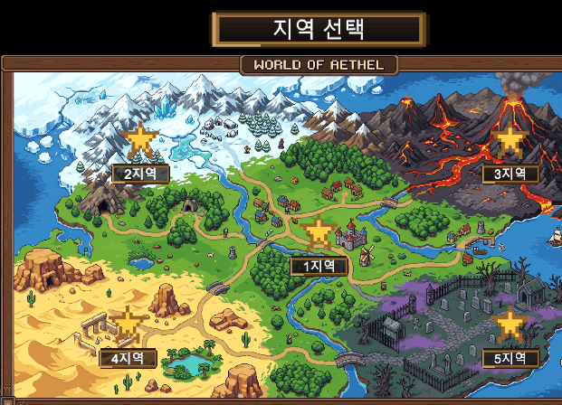

**5개 지역(Act 1~5) × 10 스테이지**, 각 지역마다 **난이도 2단계**가 있다(총 100 스테이지).

- 월드맵에서 지역을 고르면 그 지역의 스테이지 경로가 열린다.
- 지역마다 배경과 몬스터 계열이 다르고, 지역이 올라갈수록 몬스터가 강해진다.
- **각 지역 10 스테이지는 보스**다.

### 6.2 가방/장비

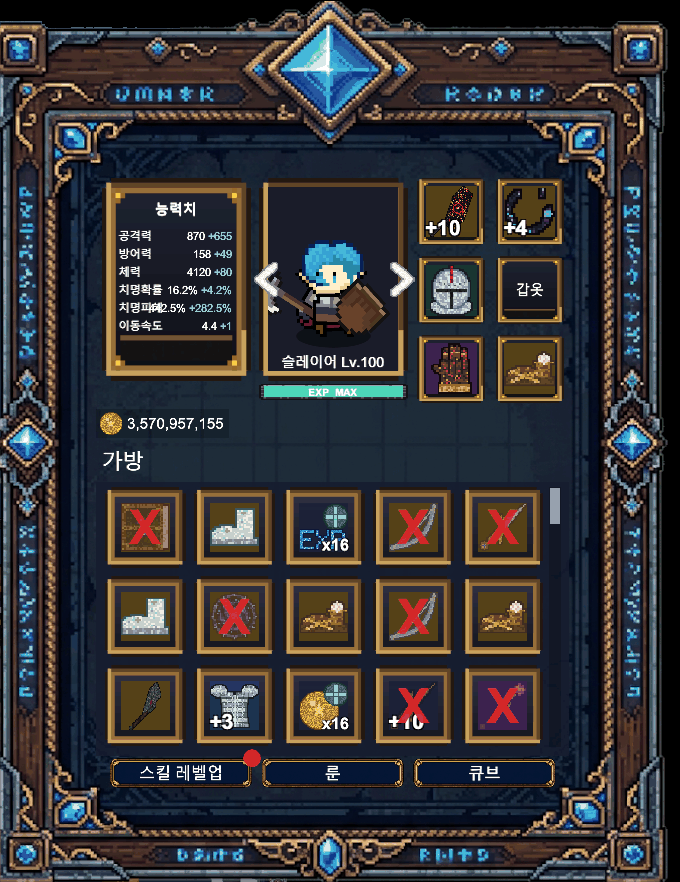

- **좌측 상단 능력치** — 현재 선택한 캐릭터의 최종 능력치다. 파란 `+숫자`가 장비·룬·패시브로 더해진 몫이다.
- **캐릭터 화살표(◀ ▶)** — 파티원을 넘겨 가며 각자의 장비를 관리한다.
- **우측 장비 칸 6부위** — 아이템을 눌러 장착/해제한다. 착용 중인 강화 장비는 `+10` 처럼 강화 단계가 표시된다.
- **가방 격자** — 획득한 장비·재료·소모품이 쌓인다. 칸에 마우스를 올리면 상세 정보가 뜬다.
- 하단 **[스킬 레벨업] [룬] [큐브]** 버튼으로 성장 화면에 바로 들어간다.

> 아이템 등급은 **노말 → 고급 → 희귀 → 영웅 → 전설** 5단계이며, 칸 배경색으로 구분된다.

### 6.3 스킬 레벨업

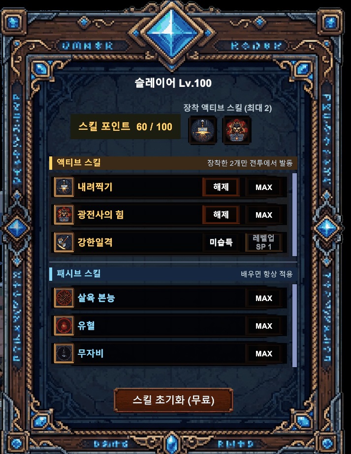

캐릭터 레벨에서 나오는 **스킬 포인트**로 스킬을 키운다.

- **액티브**는 계수(피해량)가, **패시브**는 능력치 배율이 레벨마다 올라간다.
- 액티브는 **캐릭터당 2개까지 장착**해 전투에 쓸 수 있다. 패시브는 배우기만 하면 상시 적용된다.
- 포인트가 남아 있으면 가방 버튼에 빨간 점이 붙는다.

### 6.4 룬

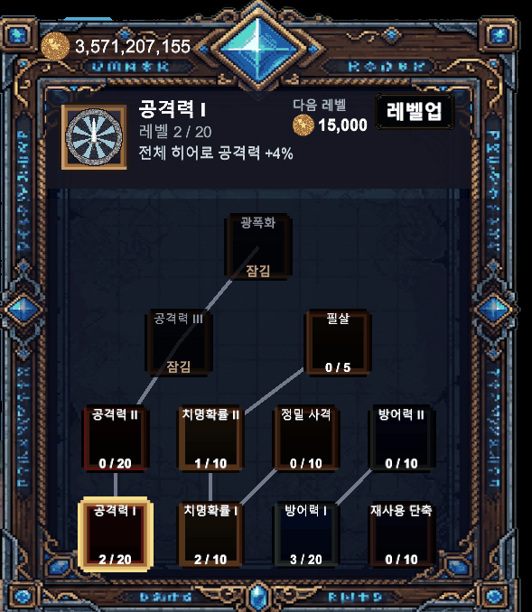

**계정 공용** 강화 트리다(캐릭터별이 아니라 계정 전체에 적용된다).

- 룬 11종이 선행 관계로 이어져 있어, 앞 룬을 올려야 다음 룬이 열린다.
- 골드로 레벨을 올리며, 공격력·치명확률·치명피해·이동속도·재사용 대기시간 등을 올린다.

### 6.5 큐브

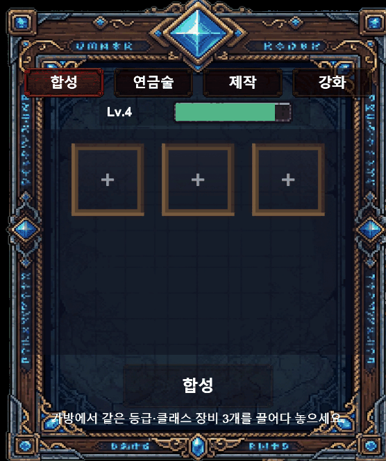

아이템을 가공하는 4개의 탭이다.

| 탭 | 하는 일 |
| --- | --- |
| **합성** | 같은 등급·클래스 장비 **3개**를 넣어 상위 등급 장비로 만든다 |
| **연금술** | 필요 없는 아이템을 분해해 재화·재료로 바꾼다 |
| **제작** | 모은 재료로 레시피에 맞는 아이템을 만든다 |
| **강화** | 장비를 **+10까지** 강화한다. 단계가 오르면 옵션이 배율로 커지고, 무기는 **잔상 색과 불꽃이 화려해진다** |

### 6.6 뽑기

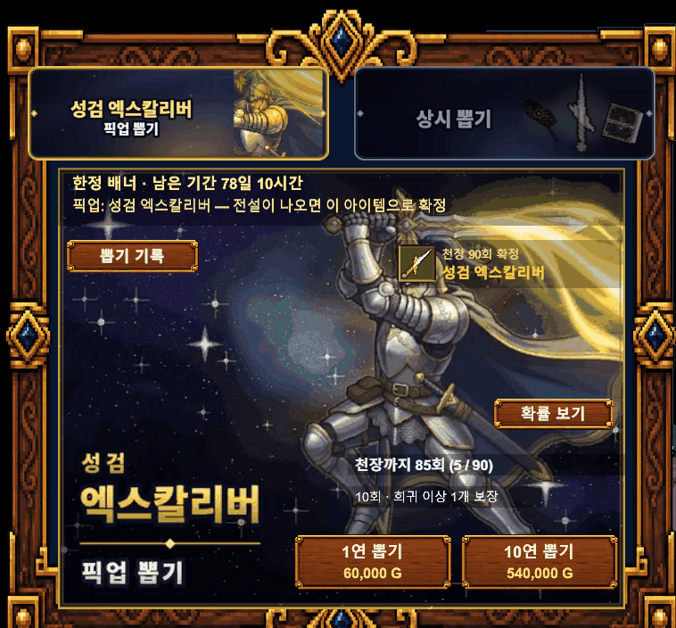

골드로 장비를 뽑는다.

- **픽업 배너**와 **상시 뽑기** 배너가 있다. 픽업 배너는 기간 한정이며, 전설이 나오면 **픽업 아이템으로 확정**된다.
- **1연 / 10연**을 고를 수 있고, **10연은 희귀 이상 1개가 보장**된다.
- **천장 90회** — 90회까지 전설이 없으면 확정으로 준다. 게이지로 남은 횟수가 보인다.
- **[확률 보기]** 로 등급별 확률을, **[뽑기 기록]** 으로 지난 결과를 확인한다.

### 6.7 거래소

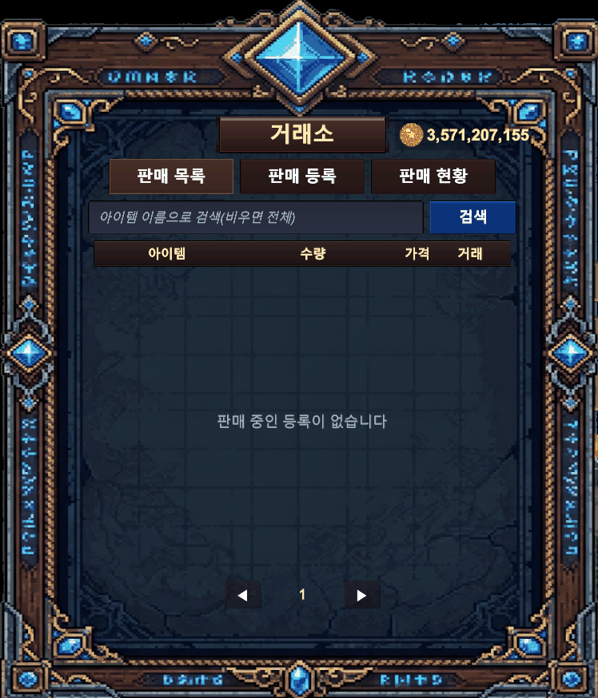

다른 플레이어와 아이템을 사고판다.

| 탭 | 하는 일 |
| --- | --- |
| **판매 목록** | 등록된 매물을 검색해 구매한다 |
| **판매 등록** | 내 아이템을 가격을 매겨 올린다 |
| **판매 현황** | 내가 올린 매물의 상태를 보고 회수한다 |

### 6.8 우편함

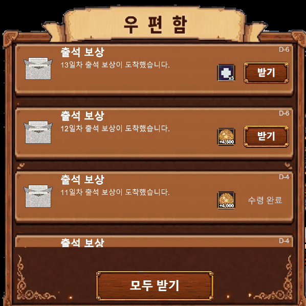

운영 지급·거래 대금·각종 보상이 도착하는 곳이다.

- 첨부가 있는 메일은 **수령**해야 가방으로 들어온다. **일괄 수령**도 가능하다.
- 메일에는 **만료 기간**이 있으니, 빨간 점이 붙어 있으면 미루지 말고 받아 두자.

### 6.9 출석부

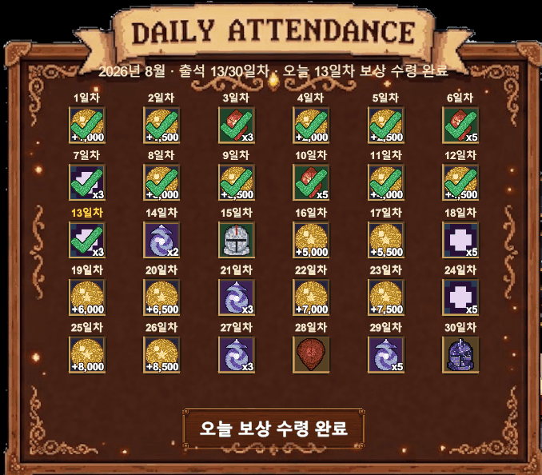

접속만 해도 받는 **30일 보상**이다.

- 하루 1회, 접속하면 그날 칸의 보상을 받는다. 날짜가 아니라 **누적 출석 일수**로 진행된다.
- 뒤로 갈수록 보상이 커지며, 중간중간 강화 재료·소환권 같은 굵직한 보상이 배치되어 있다.

---

## 7. 한눈에 보는 성장 루트

```
[스테이지 진행] ──► 경험치·골드·전리품
      │                  │
      │                  ├─► [가방] 장비 장착 ──► [큐브] 합성·제작·강화(+10)
      │                  └─► [거래소] 판매/구매
      │
      ├─► 레벨업 ──► 스킬 포인트 ──► [스킬 레벨업] 액티브 2개 장착 + 패시브
      │
      └─► 골드 ──► [룬] 계정 공용 강화 · [뽑기] 장비 획득
                        │
[출석부]·[우편함] ──► 재화·재료 보충 ──┘

강해지면 ──► 다음 지역/난이도 해금 ──► 다시 [스테이지 진행]
```

**막혔을 때 점검 순서**

1. **장비** — 파티 전원이 6부위를 다 채웠는가? 안 쓰는 장비는 합성·강화 재료로 돌리자.
2. **강화** — 무기부터 +단계를 올리는 편이 체감이 크다.
3. **스킬** — 남은 스킬 포인트가 없는지, 액티브 2개를 장착했는지 확인한다.
4. **룬** — 계정 공용이라 파티 전원에게 한 번에 적용된다. 골드가 남으면 여기부터.
5. **편성** — 앞줄을 버텨 줄 기사가 있는지, 광역이 필요한 구간에 마법사가 들어가 있는지 본다.

---

## 관련 문서

- [클라이언트 씬 / 오브젝트 / UI 구성](클라이언트-씬-UI-구성.md)
- [인벤토리 UI 기획서](ui/인벤토리-ui-기획서.md) · [스킬 레벨업 UI 기획서](ui/스킬-레벨업-ui-기획서.md) · [룬 UI 기획서](ui/룬-ui-기획서.md)
- [스테이지 선택 UI 기획서](ui/스테이지-선택-ui-기획서.md) · [뽑기(가챠) UI 기획서](ui/뽑기-ui-기획서.md) · [파티 편성 UI 기획서](ui/파티-편성-ui-기획서.md)
- 수치 정본은 서버 문서 [`docs/세부/master-data/master-data-값.md`](../../docs/세부/master-data/master-data-값.md)를 따른다.
