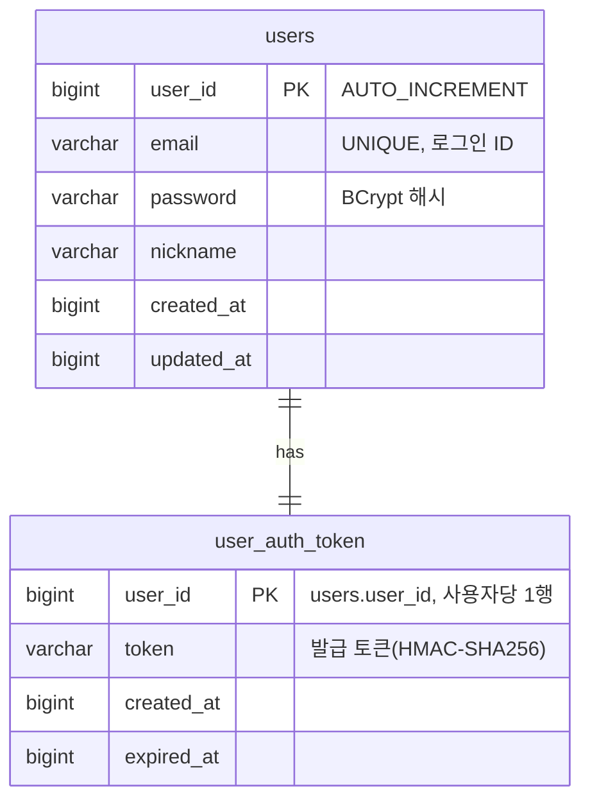

# DB ERD 통합 문서

> 지금까지 작성된 세부 기획서들의 **데이터베이스 구조(ERD)를 한곳에 모은 참조 문서**다. 각 테이블의 상세 규칙·필드 의미는 원 기획서(아래 "출처")가 **정본(single source of truth)** 이며, 본 문서는 전체 그림을 빠르게 보기 위한 집약본이다. 불일치가 있으면 원 기획서를 따른다.
>
> 📄 **실제 생성 DDL**: [db-schema.sql](db-schema.sql) — 아래 관계형 테이블(Account DB·Game DB)의 MySQL `CREATE TABLE` 스크립트. 마스터 데이터(4장)는 관계형 테이블이 아니므로 DDL에 포함되지 않는다.

## 목차

- [1. 저장소 구성](#1-저장소-구성)
- [2. AccountServer — 계정/인증 MySQL](#2-accountserver--계정인증-mysql)
  - [users](#users)
  - [user_auth_token](#user_auth_token)
- [3. GameServer — 세이브 데이터 MySQL](#3-gameserver--세이브-데이터-mysql)
  - [game_player](#game_player)
  - [player_character](#player_character)
  - [player_item](#player_item)
  - [player_item_equipped](#player_item_equipped)
  - [player_skill](#player_skill)
  - [player_rune](#player_rune)
  - [player_cube](#player_cube)
  - [player_mail](#player_mail)
  - [player_mail_reward](#player_mail_reward)
  - [player_attendance](#player_attendance)
  - [trade_listing](#trade_listing)
- [4. 마스터 데이터 (정적 · 읽기 전용)](#4-마스터-데이터-정적--읽기-전용)
  - [class_master](#class_master)
  - [level_master](#level_master)
  - [equip_slot_master](#equip_slot_master)
  - [item_master](#item_master)
  - [enhance_master](#enhance_master)
  - [skill_master](#skill_master)
  - [rune_master](#rune_master)
  - [monster_master](#monster_master)
  - [stage_master](#stage_master)
  - [stage_reward](#stage_reward)
  - [stage_reward_drop](#stage_reward_drop)
  - [cube_master](#cube_master)
  - [box_master](#box_master)
  - [attendance_master](#attendance_master)
- [5. 출처 문서](#5-출처-문서)

## 1. 저장소 구성

| 저장소 | 서버 | 용도 |
|---|---|---|
| MySQL (Account DB) | `AccountServer` | 계정·인증 토큰 영속 저장 |
| Redis | `AccountServer` 발급 / `GameServer` 검증 | 인증 토큰 캐시(`auth:token:{userId}`) — **필수 의존**(없으면 인증 불가) |
| Redis | `GameServer` | 거래소 — 목록 캐시(`trade:index:{itemCode}`·`trade:listing:{listingId}`)와 구매 락(`trade:lock:listing:{listingId}`). **상시 사용**하되 모두 파생 데이터이며, 장애 시 MySQL 폴백·락 없이 축소 운전([거래소 기획서](../세부/trade-기획서.md) 7.3·7.4) |
| MySQL (Game DB) | `GameServer` | 플레이어 진행 세이브 데이터 |
| 인메모리 캐시(원천 CSV/JSON) | `GameServer` | 마스터(정적 기획) 데이터. 관계형 영속 테이블이 아닌 읽기 전용 정의 |

- **서버 간 공유 키**: 모든 게임 DB 테이블의 `user_id`는 `AccountServer`의 `users.user_id`와 **동일 식별자**다.
- **시간 값**: 계정·세이브 공통으로 **Unix timestamp(BIGINT, 초)**.
- **캐릭터 구조**: 계정당 **캐릭터 슬롯 3개**(3인 파티). 직업·레벨·경험치·스킬·장비는 **캐릭터별**, 인벤토리·골드·큐브·룬은 **계정 공유**.

## 2. AccountServer — 계정/인증 MySQL

> 출처: [계정/로그인 기획서](../세부/account-login-기획서.md) 3장

- `users.email` UNIQUE. `user_auth_token`은 `user_id` PK로 **사용자당 1행**(단일 세션, 재로그인 시 UPSERT).
- **Redis**: `auth:token:{userId}` = 발급 토큰(TTL 24h 잠정). GameServer는 SecretKey 없이 이 값과 **대조**만으로 인증한다.

### users

- **역할**: 계정의 신원·로그인 자격 증명을 저장하는 계정 시스템의 루트 엔티티. 여기서 발급되는 `user_id`가 모든 게임 DB 테이블이 공유하는 계정 식별자다.
- **저장 데이터**: `user_id`(PK, AUTO_INCREMENT), `email`(로그인 ID, UNIQUE), `password`(BCrypt 해시), `nickname`, 생성/수정 시각(Unix ts).

### user_auth_token

- **역할**: 로그인 성공 시 발급한 인증 토큰의 영속 사본. `user_id` PK라 **사용자당 1행**(단일 세션)이며 재로그인 시 UPSERT로 덮어쓴다.
- **저장 데이터**: `user_id`(PK/FK), `token`(HMAC-SHA256 발급 토큰), 발급/만료 시각. 실제 요청 인증은 Redis(`auth:token:{userId}`) 대조로 처리하고, 이 테이블은 영속 백업 역할이다.

## 3. GameServer — 세이브 데이터 MySQL

> 출처: [세이브 데이터 기획서](../세부/save-data-기획서.md) 3장 (인벤토리/장비/큐브는 [인벤토리/아이템/큐브 기획서](../세부/inventory-item-cube-기획서.md), 성장은 [성장 시스템 기획서](../세부/growth-기획서.md))

```mermaid
erDiagram
    game_player      ||--o{ player_character : has
    game_player      ||--o{ player_item      : owns
    game_player      ||--o{ player_rune      : has
    game_player      ||--|| player_cube      : has
    game_player      ||--o{ player_mail      : receives
    game_player      ||--|| player_attendance : progresses
    game_player      ||--o{ trade_listing    : sells
    player_item      ||--o| player_item_equipped : "equipped as"
    player_character ||--o{ player_item_equipped : equips
    player_character ||--o{ player_skill     : has
    player_mail      ||--o{ player_mail_reward : has

    game_player {
        bigint  user_id PK "계정 user_id"
        varchar nickname
        int     act "현재 Act(파티 공용)"
        int     stage "현재 스테이지(파티 공용)"
        int     difficulty "난이도 티어"
        int     max_stage_cleared "최고 클리어 스테이지"
        int     inventory_capacity "인벤토리 최대 용량(slot 수), 골드로 확장"
        bigint  last_active_at "5분 주기 갱신, 오프라인 보상 기준"
        bigint  created_at
        bigint  updated_at
    }

    player_character {
        bigint  user_id FK
        int     character_id "캐릭터 슬롯(1~3)"
        int     class_code "직업(중복 불가)"
        int     level
        bigint  exp
    }

    player_item {
        bigint  player_item_id PK
        bigint  user_id FK
        int     row_type "1:아이템 2:재화"
        int     item_code "item_master.item_code (재화 item_type=3 포함, 골드=1)"
        bigint  quantity "수량/재화 금액(bigint)"
        int     slot "인벤토리 배치(0-based). 재화·장착 중 장비는 NULL(용량 미집계)"
        int     enhance_level "장비 강화 단계. 재화/비장비는 0"
        bigint  acquired_at
    }

    player_item_equipped {
        bigint  player_item_id PK "player_item.player_item_id, 장착 아이템 1개당 1행"
        bigint  user_id FK
        int     item_code "item_master.item_code (어떤 아이템인지)"
        int     enhance_level "장비 강화 단계"
        int     equipped_character_id "장착 캐릭터(1~3)"
        int     equipped_slot "장착 슬롯(equip_slot_master)"
    }

    player_skill {
        bigint  user_id FK
        int     character_id "캐릭터 슬롯(1~3)"
        int     skill_code "스킬 ID(skill_master)"
        int     level "스킬 레벨"
        int     equipped "액티브 장착 여부(0/1), 캐릭터당 최대 2개"
    }

    player_rune {
        bigint  user_id FK
        int     rune_code "룬 ID(rune_master)"
        int     level "룬 레벨"
    }

    player_cube {
        bigint  user_id PK,FK
        int     cube_level
        bigint  cube_exp
    }

    player_mail {
        bigint  mail_id PK
        bigint  user_id FK
        int     category "1:운영 2:거래 3:출석 4:시스템"
        varchar title
        varchar body
        int     is_read "0/1"
        int     claimed "0/1 첨부 수령"
        bigint  created_at
        bigint  expires_at "0이면 무기한"
        bigint  claimed_at
    }

    player_mail_reward {
        bigint  mail_id FK
        int     seq
        int     reward_type "1:골드 2:아이템 3:재료"
        int     reward_code "골드면 0"
        bigint  quantity "수량(골드는 금액)"
        int     enhance_level "장비 강화 단계(골드/재료 0)"
    }

    player_attendance {
        bigint  user_id PK,FK
        int     attend_count "누적 출석일수(리셋 없음)"
        int     last_attend_date "마지막 보상 획득 일자 YYYYMMDD(KST), 0=없음"
    }

    trade_listing {
        bigint  listing_id PK
        bigint  seller_user_id FK "판매자"
        int     item_code
        int     enhance_level
        int     quantity
        bigint  price "구매가(골드)"
        int     status "1:판매중 2:판매완료 3:취소(수동) 4:만료(배치)"
        bigint  buyer_user_id "미판매 0"
        bigint  created_at
        bigint  expires_at "만료(= created_at + 3일)"
        bigint  closed_at "미완료 0"
    }
```

**PK / 유니크**

| 테이블 | PK / 유니크 | 범위 |
|---|---|---|
| `game_player` | `user_id` | 계정 공용(파티 루트) |
| `player_character` | `(user_id, character_id)` | 캐릭터별(슬롯 1~3, 직업 중복 불가) |
| `player_item` | `player_item_id` PK, `(user_id, slot)` 유니크. 재화 행의 `(user_id, item_code)` 유일성은 서버가 보장 | 계정 공유(아이템·재화 통합, 보유 상태) |
| `player_item_equipped` | `player_item_id` PK(아이템당 최대 1행), `(user_id, equipped_character_id, equipped_slot)` 유니크 | 장착 상태(캐릭터별) |
| `player_skill` | `(user_id, character_id, skill_code)` | 캐릭터별 |
| `player_rune` | `(user_id, rune_code)` | 계정 공유 |
| `player_cube` | `user_id` | 계정 공유 |
| `player_mail` | `mail_id` PK, `user_id` 인덱스 | 계정 우편함 |
| `player_mail_reward` | `(mail_id, seq)` | 메일 첨부 |
| `player_attendance` | `user_id` | 계정 출석 진행도(누적 카운터, 계정당 1행) |
| `trade_listing` | `listing_id` PK, `(status, item_code, price)`·`(status, price)` 조회·정렬 인덱스, `(seller_user_id, status)` 한도·내 판매 조회, `(status, expires_at)` 만료 배치 | 거래소 등록(전역, 에스크로) |

**테이블별 역할·저장 데이터**

### game_player

- **역할**: 계정(파티)의 세이브 루트. 아래 모든 세이브 하위 테이블이 이 `user_id`에 매달린다. 파티 공용 진행도와 오프라인 보상 정산의 기준 시각을 보관한다.
- **저장 데이터**: 현재 `act`/`stage`/`difficulty`(파티 공용 진행 위치), `max_stage_cleared`(최고 클리어 스테이지), `inventory_capacity`(인벤토리 최대 슬롯 수, 골드로 확장), `last_active_at`(5분 주기 갱신 — 오프라인 보상 계산 기준점), `nickname`, 생성/수정 시각.

### player_character

- **역할**: 계정이 보유한 캐릭터(슬롯 1~3, 3인 파티)별 진행 상태. 직업·레벨·경험치는 **캐릭터별**이다.
- **저장 데이터**: `(user_id, character_id)` 키, `class_code`(직업 — 파티 내 중복 불가, `class_master` 참조), `level`, `exp`.

### player_item

- **역할**: 계정이 보유한 **아이템과 재화를 통합 저장**하는 인벤토리 테이블(계정 공유). 장비는 개체별 1행, 재료는 스택으로, 재화(골드)도 하나의 행으로 둔다. 보유 상태만 담고, 장착 여부·위치는 자식 테이블 `player_item_equipped`로 분리한다.
- **저장 데이터**: `player_item_id`(PK), `row_type`(1:아이템 2:재화), `item_code`(`item_master.item_code`), `quantity`(수량/재화 금액), `slot`(인벤토리 배치 칸 — 재화와 **장착 중인 장비**는 NULL이라 용량·가방 조회에서 빠진다), `enhance_level`(장비 강화 단계), `acquired_at`.

### player_item_equipped

- **역할**: **장착 중인 아이템**만 담는 테이블(`player_item`과 1:0..1). 아이템의 장착 여부·장착 위치를 `player_item` 본체에서 분리해, 행이 존재하면 곧 "장착 중"이다. 장착은 이 행 INSERT, 해제는 DELETE로 처리하므로 `player_item`에 NULL 장착 컬럼을 두지 않는다. 아이템은 계정 공유지만 장착은 특정 캐릭터·슬롯에 귀속된다.
- **저장 데이터**: `player_item_id`(PK/FK — `player_item.player_item_id`, 아이템당 최대 1행이라 한 아이템은 동시에 한 곳에만 장착), `user_id`(FK), `item_code`(어떤 아이템인지 — `item_master.item_code`), `enhance_level`(장비 강화 단계 — `enhance_master`), `equipped_character_id`(장착 캐릭터 1~3), `equipped_slot`(장착 슬롯, `equip_slot_master`). `(user_id, equipped_character_id, equipped_slot)` 유니크로 **한 캐릭터-슬롯당 아이템 하나**를 보장한다.

### player_skill

- **역할**: 캐릭터별 보유 스킬의 투자 레벨과 액티브 장착 여부.
- **저장 데이터**: `(user_id, character_id, skill_code)` 키(`skill_master` 참조), `level`(스킬 레벨), `equipped`(액티브 장착 0/1 — 캐릭터당 최대 2개).

### player_rune

- **역할**: **계정 공유** 룬(Rune Tree) 보유 상태. 룬 노드별 투자 레벨을 저장하는 장기 성장 축.
- **저장 데이터**: `(user_id, rune_code)` 키(`rune_master` 참조), `level`(룬 레벨).

### player_cube

- **역할**: **계정 공유** 큐브(Hero-dric Cube)의 성장 상태. 계정당 1행.
- **저장 데이터**: `user_id`(PK/FK), `cube_level`(`cube_master` 참조), `cube_exp`(현재 큐브 경험치).

### player_mail

- **역할**: 계정 우편함. 운영·거래·출석·시스템 보상을 메일로 지급하고 읽음/수령 상태를 관리한다. 첨부 보상은 `player_mail_reward`에 분리 저장.
- **저장 데이터**: `mail_id`(PK), `category`(1:운영 2:거래 3:출석 4:시스템), `title`/`body`, `is_read`(0/1), `claimed`(첨부 수령 0/1), 생성/만료(`expires_at`, 0=무기한)/수령 시각.

### player_mail_reward

- **역할**: 메일 1건의 **첨부 보상 목록**(`player_mail`과 1:N). 메일 수령 시 이 행들이 계정 재화/인벤토리로 반영된다.
- **저장 데이터**: `(mail_id, seq)` 키, `reward_type`(1:골드 2:아이템 3:재료), `reward_code`(골드면 0), `quantity`, `enhance_level`(장비 강화 단계 — 거래소 구매·만료 반송이 보존, 골드/재료는 0).

### player_attendance

- **역할**: 계정의 **출석 진행도**(계정당 1행). 누적 출석일수로 보상 일차를 산출하고(`% 30 + 1`, 30일 순환·월 리셋 없음), 마지막 획득 일자로 하루 1회 중복 수령을 막는다(조건부 갱신 조건으로도 사용). 행은 캐릭터 생성 시 함께 만들어진다. 실제 보상 내용은 `attendance_master`가 정의하고 지급은 메일로 발급된다.
- **저장 데이터**: `user_id`(PK/FK), `attend_count`(누적 출석일수), `last_attend_date`(마지막 보상 획득 일자 YYYYMMDD, KST 기준. 0=이력 없음). **출석 일자별 이력은 갖지 않는다**(별도 이력 로그의 책임).

### trade_listing

- **역할**: 거래소(교역선) **판매 등록**(전역). 등록 시 아이템을 인벤토리에서 분리하는 **에스크로** 방식이며, 판매 대금은 메일로 지급된다.
- **저장 데이터**: `listing_id`(PK), `seller_user_id`, 매물 스냅샷(`item_code`·`enhance_level`·`quantity`), `price`(구매가 골드), `status`(1:판매중 2:판매완료 3:취소/만료), `buyer_user_id`(미판매 0), 생성/만료(`created_at`+3일)/종료 시각.

## 4. 마스터 데이터 (정적 · 읽기 전용)

> 출처: [마스터 데이터 기획서](../세부/master-data/master-data-기획서.md) 5장. 관계형 영속 테이블이 아니라 원천(CSV/JSON)에서 로드하는 인메모리 정의이며, 세이브 테이블이 코드로 참조한다.

| 마스터 테이블 | PK | 참조하는 세이브 컬럼 |
|---|---|---|
| `class_master` | `class_code` | `player_character.class_code` |
| `level_master` | `level` | `player_character.level` |
| `equip_slot_master` | `slot` | `player_item_equipped.equipped_slot` / `item_master.equip_slot` |
| `item_master` | `item_code` | `player_item.item_code`(아이템 `item_type` 1~2 및 재화 `item_type` 3, 골드=1) / `player_item_equipped.item_code` |
| `enhance_master` | `enhance_level` | `player_item.enhance_level` / `player_item_equipped.enhance_level` |
| `skill_master` | `skill_code` | `player_skill.skill_code` |
| `rune_master` | `rune_code` | `player_rune.rune_code` |
| `monster_master` | `monster_code` | (전투 계산, 보상은 `stage_reward`) |
| `stage_master` | `stage_id` | `game_player.act`/`stage`/`difficulty` |
| `stage_reward` | `stage_id` | `stage_master.stage_id`와 1:1(스테이지 클리어 보상 스칼라) |
| `stage_reward_drop` | `stage_id`+`grade` | `stage_reward.stage_id`의 자식(등급별 드롭 확률, 1:N) |
| `cube_master` | `cube_level` | `player_cube.cube_level` |
| `box_master` | `box_code` | (골드 가챠 상자 열기 API 입력 · 골드 차감·지급 모두 `player_item`, 상자 자체는 저장 안 함) |
| `attendance_master` | `day` | (출석부 **일차별**(누적 출석 순번 1~30) 보상 정의 · 지급은 메일 발급, `player_attendance`는 진행도 보관) |

**테이블별 역할·정의 데이터** (모두 정적·읽기 전용 정의이며 유저가 변경하지 않는다. 실제 값은 [마스터 데이터 값](../세부/master-data/master-data-값.md))

### class_master

- **역할**: 캐릭터 생성 시 고르는 직업(클래스) 정의. `player_character.class_code`가 참조.
- **정의 데이터**: 직업 이름, 설명(`description`, 클라 표시용), 해금 방식(`unlock_type`), 기본 스탯(hp·atk·def·이동속도·치명확률·치명피해·쿨다운). 현재 3종(기사·레인저·마법사).

### level_master

- **역할**: 캐릭터 레벨 곡선 정의. `player_character.level`이 참조.
- **정의 데이터**: 레벨별 요구 경험치, 누적 스킬 포인트, 누적 스탯 보너스(`bonus_hp`/`bonus_atk`/`bonus_def`). 최대 레벨 100.

### equip_slot_master

- **역할**: 장비 장착 슬롯 정의. `player_item_equipped.equipped_slot`과 `item_master.equip_slot`이 참조.
- **정의 데이터**: 슬롯 번호와 이름(무기·보조무기·투구·갑옷·장갑·신발 6부위).

### item_master

- **역할**: **아이템(장비·재료)과 재화(골드)를 통합 정의**. `player_item.item_code`·`player_item_equipped.item_code`가 참조하는 게임 내 모든 유형 아이템의 원장.
- **정의 데이터**: 이름, `item_type`(1:장비 2:재료 3:재화), 등급, 장착 슬롯·클래스/레벨 제한, 스택 최대치, 장비 옵션 스탯(개별 컬럼), 거래 가능 여부·거래 기준가. 골드=`item_code` 1.

### enhance_master

- **역할**: 장비 강화 단계별 규칙 정의. `player_item.enhance_level`·`player_item_equipped.enhance_level`이 참조.
- **정의 데이터**: 강화 단계별 요구 비용·소모 재화·스탯 배율. (값 미확정, 작성 예정)

### skill_master

- **역할**: 직업별 액티브/패시브 스킬 정의. `player_skill.skill_code`가 참조.
- **정의 데이터**: 소속 직업, 스킬 타입(액티브/패시브), 최대 스킬 레벨. 계수·성격(공격/버프/디버프)·지속시간은 스킬마다 개수가 달라 자식 테이블 `skill_coefficient`(`(skill_code, skill_level, coef_type, coef, duration)`)로 1:N 분리 — `coef_type`이 계수의 타입(공격/버프/디버프)이고 `duration`이 버프/디버프 지속시간이다.

### rune_master

- **역할**: 룬(Rune Tree) 정의(계정 공용 장기 성장). `player_rune.rune_code`가 참조.
- **정의 데이터**: 선행 룬(트리 구조), 최대 레벨, 상승 능력치 종류(`stat_type`)·레벨당 상승량. **레벨별 골드 비용은 자식 테이블 `rune_cost`(`(rune_code, level)→cost`)에 명시**한다(공식 파생 폐기).

### monster_master

- **역할**: 몬스터 전투 스탯 정의. 전투 계산에서 사용하며 몬스터 개별 드롭은 없다(보상은 `stage_reward`로 일원화).
- **정의 데이터**: 이름, hp, attack. 코드 규약 Act1 `90xx`/Act2 `91xx`/Act3 `92xx`, 각 Act 보스 `xx99`.

### stage_master

- **역할**: 스테이지 **구성(스폰·보스)** 정의. `game_player`의 `act`/`stage`/`difficulty`가 가리킨다. 클리어 **보상은 분리**되어 `stage_reward`가 담당.
- **정의 데이터**: `stage_id`(act·difficulty·stage 인코딩), 보스 몬스터 코드. 등장 일반 몬스터는 자식 테이블 `stage_spawn`(`(stage_id, monster_code, spawn_count)`)로 분리.

### stage_reward

- **역할**: 스테이지 클리어 보상 **스칼라** 정의(`stage_master`와 1:1). 서버가 클리어 시 이 값으로 보상을 확정한다.
- **정의 데이터**: 획득 골드·경험치. 등급별 아이템 드롭 확률은 자식 테이블 `stage_reward_drop`으로 분리(반복 구조 → 자식 테이블 규칙).

### stage_reward_drop

- **역할**: 스테이지 등급별 아이템 드롭 확률(`stage_reward`의 자식, 1:N). 구 `stage_reward.gradeN_prob`(등급마다 늘어나던 wide 컬럼)를 대체한다.
- **정의 데이터**: `(stage_id, grade)`별 드롭 확률(0~1). 확률 0인 등급은 행 없음(sparse). 등급 추가 시 스키마 변경 없이 행만 추가.

### cube_master

- **역할**: 큐브 레벨별 합성/분해 규칙 정의. `player_cube.cube_level`이 참조.
- **정의 데이터**: 레벨별 요구 경험치, 합성 등급 상승 허용·소모 개수, 분해 골드 계수. 제작 레시피는 자식 테이블 `cube_recipe`(헤더)·`cube_recipe_ingredient`(소모 재료)로 분리.

### box_master

- **역할**: 골드 가챠 랜덤 상자 정의. 상자 열기 API의 입력이며 상자 자체는 저장하지 않는다(골드 차감·아이템 지급 모두 `player_item`).
- **정의 데이터**: 오픈 비용·재화, 등급별 확률·지급 아이템 풀(등급 가중치·아이템 풀은 자식 테이블로 분리 설계). (값 미확정, 작성 예정)

### attendance_master

- **역할**: 출석부 **일차별(1~30)** 보상 정의. `day`는 날짜가 아니라 **누적 출석 순번**이며, 출석 시 `누적 출석일수 % 30 + 1`(30일 순환)로 조회해 보상을 확정하고 메일로 발급한다(진행도는 `player_attendance`).
- **정의 데이터**: `day`(출석 일차 1~30), `reward_type`(1:골드 2:아이템 3:재료), `reward_code`(골드면 0), `quantity`.

- 마스터 데이터는 **클라이언트 빌드에 번들**되고 서버도 같은 원천을 기동 시 자체 로드한다(런타임 다운로드·버전 협상 없음, [마스터 데이터 기획서](../세부/master-data/master-data-기획서.md) 6·8장).

## 5. 출처 문서

- [계정/로그인 기획서](../세부/account-login-기획서.md) — `users`·`user_auth_token`, Redis 토큰
- [세이브 데이터 기획서](../세부/save-data-기획서.md) — `game_player`·`player_character`·`player_item`(아이템·재화 통합)·`player_item_equipped`(장착 상태)·`player_skill`·`player_rune`·`player_cube`·`player_mail`·`player_mail_reward`
- [거래소 / 교역선 기획서](../세부/trade-기획서.md) — `trade_listing` 거래 등록(에스크로), 대금은 메일 지급
- [메일 기획서](../세부/mail-기획서.md) — `player_mail`·`player_mail_reward` 우편함·첨부
- [출석부 보상 시스템 기획서](../세부/attendance-기획서.md) — `player_attendance`·`attendance_master` 출석 기록·일차별 보상
- [인벤토리/아이템/큐브 기획서](../세부/inventory-item-cube-기획서.md) — 인벤토리·장비·큐브 세부 규칙
- [성장 시스템 기획서](../세부/growth-기획서.md) — 캐릭터·스킬·룬 세부 규칙
- [오프라인 보상 정산 기획서](../세부/offline-reward-기획서.md) — 경험치·골드 지급(세이브 테이블 사용)
- [마스터 데이터 기획서](../세부/master-data/master-data-기획서.md) — 마스터 테이블 정의
