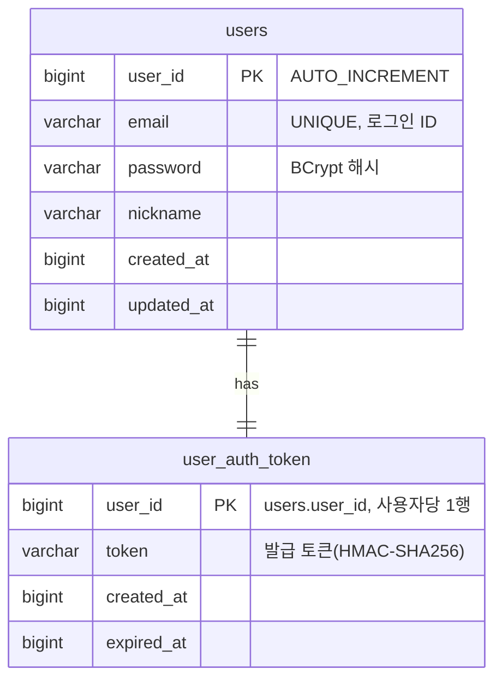
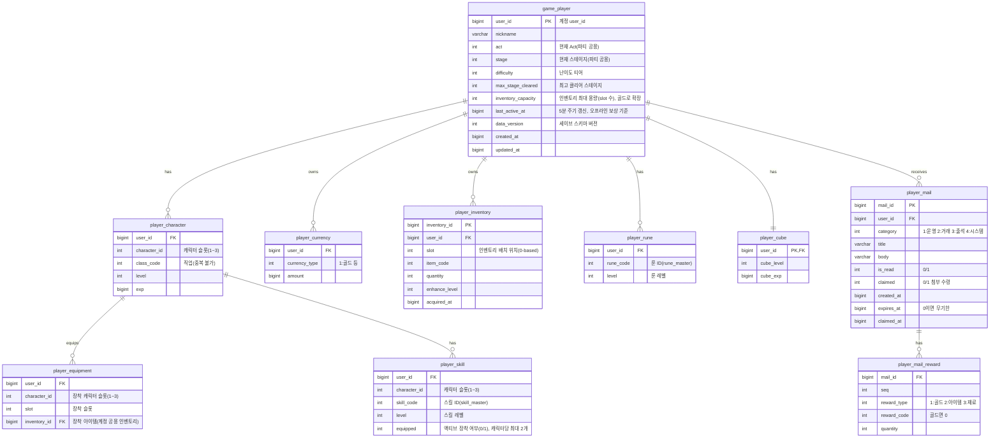

# DB ERD 통합 문서

> 지금까지 작성된 세부 기획서들의 **데이터베이스 구조(ERD)를 한곳에 모은 참조 문서**다. 각 테이블의 상세 규칙·필드 의미는 원 기획서(아래 "출처")가 **정본(single source of truth)** 이며, 본 문서는 전체 그림을 빠르게 보기 위한 집약본이다. 불일치가 있으면 원 기획서를 따른다.

## 1. 저장소 구성

| 저장소 | 서버 | 용도 |
|---|---|---|
| MySQL (Account DB) | `AccountServer` | 계정·인증 토큰 영속 저장 |
| Redis | `AccountServer` 발급 / `GameServer` 검증 | 인증 토큰 캐시(`auth:token:{userId}`) |
| MySQL (Game DB) | `GameServer` | 플레이어 진행 세이브 데이터 |
| 인메모리 캐시(원천 CSV/JSON) | `GameServer` | 마스터(정적 기획) 데이터. 관계형 영속 테이블이 아닌 읽기 전용 정의 |

- **서버 간 공유 키**: 모든 게임 DB 테이블의 `user_id`는 `AccountServer`의 `users.user_id`와 **동일 식별자**다.
- **시간 값**: 계정·세이브 공통으로 **Unix timestamp(BIGINT, 초)**.
- **캐릭터 구조**: 계정당 **캐릭터 슬롯 3개**(3인 파티). 직업·레벨·경험치·스킬·장비는 **캐릭터별**, 인벤토리·골드·큐브·룬은 **계정 공유**.

## 2. AccountServer — 계정/인증 MySQL

> 출처: [계정/로그인 기획서](../세부/account-login-기획서.md) 3장

- `users.email` UNIQUE. `user_auth_token`은 `user_id` PK로 **사용자당 1행**(단일 세션, 재로그인 시 UPSERT).
- **Redis**: `auth:token:{userId}` = 발급 토큰(TTL 24h 잠정). GameServer는 SecretKey 없이 이 값과 **대조**만으로 인증한다.

## 3. GameServer — 세이브 데이터 MySQL

> 출처: [세이브 데이터 기획서](../세부/save-data-기획서.md) 3장 (인벤토리/장비/큐브는 [인벤토리/아이템/큐브 기획서](../세부/inventory-item-cube-기획서.md), 성장은 [성장 시스템 기획서](../세부/growth-기획서.md))

**PK / 유니크**

| 테이블 | PK / 유니크 | 범위 |
|---|---|---|
| `game_player` | `user_id` | 계정 공용(파티 루트) |
| `player_character` | `(user_id, character_id)` | 캐릭터별(슬롯 1~3, 직업 중복 불가) |
| `player_currency` | `(user_id, currency_type)` | 계정 공유 |
| `player_inventory` | `inventory_id` PK, `(user_id, slot)` 유니크 | 계정 공유 |
| `player_equipment` | `(user_id, character_id, slot)` | 캐릭터별 |
| `player_skill` | `(user_id, character_id, skill_code)` | 캐릭터별 |
| `player_rune` | `(user_id, rune_code)` | 계정 공유 |
| `player_cube` | `user_id` | 계정 공유 |
| `player_mail` | `mail_id` PK, `user_id` 인덱스 | 계정 우편함 |
| `player_mail_reward` | `(mail_id, seq)` | 메일 첨부 |

## 4. 마스터 데이터 (정적 · 읽기 전용)

> 출처: [마스터 데이터 기획서](../세부/master-data-기획서.md) 5장. 관계형 영속 테이블이 아니라 원천(CSV/JSON)에서 로드하는 인메모리 정의이며, 세이브 테이블이 코드로 참조한다.

| 마스터 테이블 | PK | 참조하는 세이브 컬럼 |
|---|---|---|
| `class_master` | `class_code` | `player_character.class_code` |
| `level_master` | `level` | `player_character.level` |
| `equip_slot_master` | `slot` | `player_equipment.slot` / `item_master.equip_slot` |
| `item_master` | `item_code` | `player_inventory.item_code` |
| `enhance_master` | `enhance_level` | `player_inventory.enhance_level` |
| `currency_master` | `currency_type` | `player_currency.currency_type` |
| `skill_master` | `skill_code` | `player_skill.skill_code` |
| `rune_master` | `rune_code` | `player_rune.rune_code` |
| `pet_master` | `pet_code` | (펫 시스템 미작성 · 저장 테이블 미정) |
| `monster_master` | `monster_code` | (전투/드롭 계산) |
| `stage_master` | `stage_id` | `game_player.act`/`stage`/`difficulty` |
| `drop_table_master` | `(drop_table_code, entry_no)` | 몬스터/스테이지 드롭 |
| `cube_master` | `cube_level` | `player_cube.cube_level` |
| `box_master` | `box_code` | (골드 가챠 상자 열기 API 입력 · 골드 차감은 `player_currency`, 지급은 `player_inventory`, 상자 자체는 저장 안 함) |

- 마스터 데이터에는 별도 `master_data_version`이 있으며, 클라이언트-서버 버전 비교로 갱신한다([마스터 데이터 기획서](../세부/master-data-기획서.md) 6장).

## 5. 출처 문서

- [계정/로그인 기획서](../세부/account-login-기획서.md) — `users`·`user_auth_token`, Redis 토큰
- [세이브 데이터 기획서](../세부/save-data-기획서.md) — `game_player`·`player_character`·`player_currency`·`player_inventory`·`player_equipment`·`player_skill`·`player_rune`·`player_cube`·`player_mail`·`player_mail_reward`
- [메일 기획서](../세부/mail-기획서.md) — `player_mail`·`player_mail_reward` 우편함·첨부
- [인벤토리/아이템/큐브 기획서](../세부/inventory-item-cube-기획서.md) — 인벤토리·장비·큐브 세부 규칙
- [성장 시스템 기획서](../세부/growth-기획서.md) — 캐릭터·스킬·룬 세부 규칙
- [오프라인 보상 정산 기획서](../세부/offline-reward-기획서.md) — 경험치·골드 지급(세이브 테이블 사용)
- [마스터 데이터 기획서](../세부/master-data-기획서.md) — 마스터 테이블 정의
