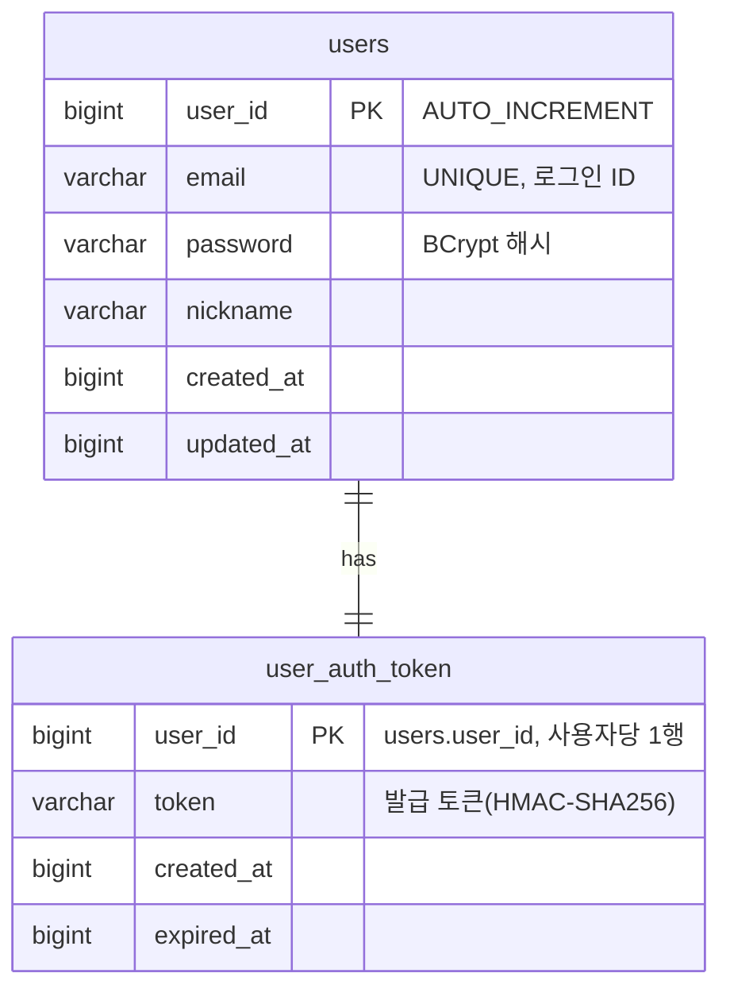

# DB ERD 통합 문서

> 지금까지 작성된 세부 기획서들의 **데이터베이스 구조(ERD)를 한곳에 모은 참조 문서**다. 각 테이블의 상세 규칙·필드 의미는 원 기획서(아래 "출처")가 **정본(single source of truth)** 이며, 본 문서는 전체 그림을 빠르게 보기 위한 집약본이다. 불일치가 있으면 원 기획서를 따른다.
>
> 📄 **실제 생성 DDL**: [db-schema.sql](db-schema.sql) — 아래 관계형 테이블(Account DB·Game DB)의 MySQL `CREATE TABLE` 스크립트. 마스터 데이터(4장)는 관계형 테이블이 아니므로 DDL에 포함되지 않는다.
>
> 🔍 **인덱스가 의도대로 동작하는지**는 [쿼리 분석](쿼리-분석.md)에서 실측했다 — 리포지토리별 쿼리 카탈로그(186건)와 EXPLAIN 결과, 개선 후보(인덱스 추가 등)가 정리되어 있다. 사용자 대기 경로에 치명적으로 느린 쿼리는 없었다.

## 목차

- [1. 저장소 구성](#1-저장소-구성)
- [2. AccountServer — 계정/인증 MySQL](#2-accountserver--계정인증-mysql)
  - [users](#users)
  - [user_auth_token](#user_auth_token)
- [3. GameServer — 세이브 데이터 MySQL](#3-gameserver--세이브-데이터-mysql)
  - [game_player](#game_player)
  - [player_character](#player_character)
  - [player_item](#player_item)
  - [player_item_equipped](#player_item_equipped)
  - [player_skill](#player_skill)
  - [player_rune](#player_rune)
  - [player_cube](#player_cube)
  - [player_buff](#player_buff)
  - [player_mail](#player_mail)
  - [player_mail_reward](#player_mail_reward)
  - [player_attendance](#player_attendance)
  - [trade_listing](#trade_listing)
  - [player_gacha_counter](#player_gacha_counter)
  - [player_gacha_pull](#player_gacha_pull)
  - [player_gacha_pull_item](#player_gacha_pull_item)
- [4. 마스터 데이터 (정적 · 읽기 전용)](#4-마스터-데이터-정적--읽기-전용)
  - [grade_master](#grade_master)
  - [class_master](#class_master)
  - [level_master](#level_master)
  - [equip_slot_master](#equip_slot_master)
  - [item_master](#item_master)
  - [consumable_master](#consumable_master)
  - [enhance_master](#enhance_master)
  - [skill_master](#skill_master)
  - [rune_master](#rune_master)
  - [monster_master](#monster_master)
  - [stage_master](#stage_master)
  - [stage_reward](#stage_reward)
  - [stage_reward_drop](#stage_reward_drop)
  - [cube_master](#cube_master)
  - [gacha_master](#gacha_master)
  - [gacha_grade_weight](#gacha_grade_weight)
  - [gacha_item_pool](#gacha_item_pool)
  - [gacha_pity_rule](#gacha_pity_rule)
  - [attendance_master](#attendance_master)
  - [inventory_expand_master](#inventory_expand_master)
  - [character_create_cost](#character_create_cost)
  - [mail_master](#mail_master)
  - [newbie_reward_master](#newbie_reward_master)
- [5. 출처 문서](#5-출처-문서)

## 1. 저장소 구성

| 저장소 | 서버 | 용도 |
|---|---|---|
| MySQL (Account DB) | `AccountServer` | 계정·인증 토큰 영속 저장 |
| Redis | `AccountServer` 발급 / `GameServer` 검증 | 인증 토큰 캐시(`auth:token:{userId}`) — **필수 의존**(없으면 인증 불가) |
| Redis | `GameServer` | 배치 리더 락(`batch:lock:{배치키}`) — 거래 만료·메일 GC 등 주기 배치의 중복 실행 방지. **GameServer가 Redis를 쓰는 유일한 용도**이며, 게임 데이터 조회에는 캐시를 두지 않는다([거래소 기획서](../세부/trade-기획서.md) 7.3 · [인벤토리 기획서](../세부/inventory-item-cube-기획서.md) 6.5) |
| MySQL (Game DB) | `GameServer` | 플레이어 진행 세이브 데이터. **가방 조회(`inventory/list`)를 포함한 개인 데이터 읽기에는 캐시를 두지 않는다** — `(user_id, slot)` 인덱스 keyset 질의로 직접 읽는다([인벤토리 기획서](../세부/inventory-item-cube-기획서.md) 6.5) |
| 인메모리 캐시(원천 CSV/JSON) | `GameServer` | 마스터(정적 기획) 데이터. 관계형 영속 테이블이 아닌 읽기 전용 정의 |

- **서버 간 공유 키**: 모든 게임 DB 테이블의 `user_id`는 `AccountServer`의 `users.user_id`와 **동일 식별자**다.
- **시간 값**: 계정·세이브 공통으로 **Unix timestamp(BIGINT, 초)**.
- **캐릭터 구조**: **파티 자리 3개**(3인 파티)에, 직업 중복이 불가하므로 **보유 캐릭터는 직업 수(현재 4)까지**. 편성되지 않은 캐릭터는 `player_character.slot=0`으로 남아 성장·장비를 그대로 보존한다. 직업·레벨·경험치·스킬·장비는 **캐릭터별**, 인벤토리·골드·큐브·룬·**가챠 천장 진행도**는 **계정 공유**.

## 2. AccountServer — 계정/인증 MySQL

> 출처: [계정/로그인 기획서](../세부/account-login-기획서.md) 3장

- `users.email` UNIQUE. `user_auth_token`은 `user_id` PK로 **사용자당 1행**(단일 세션, 재로그인 시 UPSERT).
- **Redis**: `auth:token:{userId}` = 발급 토큰(TTL 24h 잠정). GameServer는 SecretKey 없이 이 값과 **대조**만으로 인증한다.

### users

- **역할**: 계정의 신원·로그인 자격 증명을 저장하는 계정 시스템의 루트 엔티티. 여기서 발급되는 `user_id`가 모든 게임 DB 테이블이 공유하는 계정 식별자다.
- **저장 데이터**: `user_id`(PK, AUTO_INCREMENT), `email`(로그인 ID, UNIQUE), `password`(BCrypt 해시), `nickname`, 생성/수정 시각(Unix ts).

### user_auth_token

- **역할**: 로그인 성공 시 발급한 인증 토큰의 영속 사본. `user_id` PK라 **사용자당 1행**(단일 세션)이며 재로그인 시 UPSERT로 덮어쓴다.
- **저장 데이터**: `user_id`(PK/FK), `token`(HMAC-SHA256 발급 토큰), 발급/만료 시각. 실제 요청 인증은 Redis(`auth:token:{userId}`) 대조로 처리하고, 이 테이블은 영속 백업 역할이다.

## 3. GameServer — 세이브 데이터 MySQL

> 출처: [세이브 데이터 기획서](../세부/save-data-기획서.md) 3장 (인벤토리/장비/큐브는 [인벤토리/아이템/큐브 기획서](../세부/inventory-item-cube-기획서.md), 성장은 [성장 시스템 기획서](../세부/growth-기획서.md))

```mermaid
erDiagram
    game_player      ||--o{ player_character : has
    game_player      ||--o{ player_item      : owns
    game_player      ||--o{ player_rune      : has
    game_player      ||--|| player_cube      : has
    game_player      ||--o{ player_buff      : "has active"
    game_player      ||--o{ player_mail      : receives
    game_player      ||--|| player_attendance : progresses
    game_player      ||--o{ trade_listing    : sells
    game_player      ||--o{ player_gacha_counter : "천장 진행도"
    game_player      ||--o{ player_gacha_pull : pulls
    player_gacha_pull ||--o{ player_gacha_pull_item : "뽑기 결과"
    player_item      ||--o| player_item_equipped : "equipped as"
    player_character ||--o{ player_item_equipped : equips
    player_character ||--o{ player_skill     : has
    player_mail      ||--o{ player_mail_reward : has

    game_player {
        bigint  user_id PK "계정 user_id"
        varchar nickname
        int     act "현재 Act(파티 공용)"
        int     stage "현재 스테이지(파티 공용)"
        int     difficulty "난이도 티어"
        int     max_stage_cleared "최고 클리어 스테이지"
        int     inventory_capacity "인벤토리 최대 용량(slot 수), 골드로 확장"
        bigint  last_active_at "5분 주기 갱신, 오프라인 보상 기준"
        bigint  created_at
        bigint  updated_at
    }

    player_character {
        bigint  user_id FK
        int     character_id "캐릭터 고유 식별자(생성 순번), 불변"
        int     class_code "직업(중복 불가)"
        int     slot "파티 자리(0=미편성, 1~3)"
        int     gender "성별 1:남 2:여 (기본 1:남)"
        int     level
        bigint  exp
    }

    player_item {
        bigint  player_item_id PK
        bigint  user_id FK
        int     row_type "1:아이템 2:재화"
        int     item_code "item_master.item_code (재화 item_type=3 포함, 골드=1)"
        bigint  quantity "수량/재화 금액(bigint)"
        int     slot "인벤토리 배치(0-based). 재화·장착 중 장비는 NULL(용량 미집계)"
        int     enhance_level "장비 강화 단계. 재화/비장비는 0"
        bigint  acquired_at
    }

    player_item_equipped {
        bigint  player_item_id PK "player_item.player_item_id, 장착 아이템 1개당 1행"
        bigint  user_id FK
        int     item_code "item_master.item_code (어떤 아이템인지)"
        int     enhance_level "장비 강화 단계"
        int     equipped_character_id "장착 캐릭터(character_id)"
        int     equipped_slot "장착 슬롯(equip_slot_master)"
    }

    player_skill {
        bigint  user_id FK
        int     character_id "캐릭터 고유 식별자"
        int     skill_code "스킬 ID(skill_master)"
        int     level "스킬 레벨"
        int     equipped "액티브 장착 여부(0/1), 캐릭터당 최대 2개"
    }

    player_rune {
        bigint  user_id FK
        int     rune_code "룬 ID(rune_master)"
        int     level "룬 레벨"
    }

    player_cube {
        bigint  user_id PK,FK
        int     cube_level
        bigint  cube_exp
    }

    player_buff {
        bigint  user_id PK,FK
        int     buff_type PK "1:경험치 획득량 2:골드 획득량"
        decimal buff_value "획득량 배율(1.500=150%)"
        bigint  started_at "버프 시작 Unix ts(UI 진행률·검증 근거)"
        bigint  expires_at "버프 만료 Unix ts(활성 판정 기준)"
    }

    player_mail {
        bigint  mail_id PK
        bigint  user_id FK
        int     category "1:운영 2:거래 3:출석 4:시스템"
        varchar title
        varchar body
        int     is_read "0/1"
        int     claimed "0/1 첨부 수령"
        bigint  created_at
        bigint  expires_at "0이면 무기한"
        bigint  claimed_at
    }

    player_mail_reward {
        bigint  mail_id FK
        int     seq
        int     reward_type "1:골드 2:아이템 3:재료"
        int     reward_code "골드면 0"
        bigint  quantity "수량(골드는 금액)"
        int     enhance_level "장비 강화 단계(골드/재료 0)"
    }

    player_attendance {
        bigint  user_id PK,FK
        int     attend_count "누적 출석일수(리셋 없음)"
        int     last_attend_date "마지막 보상 획득 일자 YYYYMMDD(KST), 0=없음"
    }

    trade_listing {
        bigint  listing_id PK
        bigint  seller_user_id FK "판매자"
        int     item_code
        int     enhance_level
        int     quantity
        bigint  price "구매가(골드)"
        int     status "1:판매중 2:판매완료 3:취소(수동) 4:만료(배치)"
        bigint  buyer_user_id "미판매 0"
        bigint  created_at
        bigint  expires_at "만료(= created_at + 3일)"
        bigint  closed_at "미완료 0"
    }

    player_gacha_counter {
        bigint  user_id PK,FK
        int     gacha_code PK "gacha_master.gacha_code"
        int     grade PK "천장 대상 등급(gacha_pity_rule.grade)"
        int     pity_count "그 등급을 마지막으로 받은 뒤 누적 뽑기 횟수"
        bigint  updated_at
    }

    player_gacha_pull {
        bigint  pull_id PK "AUTO_INCREMENT, 기록 페이징 커서"
        bigint  user_id FK
        int     gacha_code "gacha_master.gacha_code"
        int     pull_type "1:1연 2:10연"
        int     cost_currency_code "소모 재화 item_code(골드=1)"
        bigint  cost_amount "이번 요청에서 차감한 금액"
        bigint  pulled_at
    }

    player_gacha_pull_item {
        bigint  pull_id PK,FK
        int     seq PK "요청 내 회차(1부터)"
        int     item_code "지급 아이템(item_master)"
        int     grade "추첨된 등급 슬롯"
        int     quantity "지급 수량"
        int     pity_applied "0/1 하드 천장 확정"
        int     guaranteed "0/1 10연 보장 대체"
    }
```

**PK / 유니크**

| 테이블 | PK / 유니크 | 범위 |
|---|---|---|
| `game_player` | `user_id` | 계정 공용(파티 루트) |
| `player_character` | `(user_id, character_id)` | 캐릭터별(보유 캐릭터, 직업 중복 불가. 파티 자리는 `slot` 0~3) |
| `player_item` | `player_item_id` PK, `(user_id, slot)` 유니크. 재화 행의 `(user_id, item_code)` 유일성은 서버가 보장 | 계정 공유(아이템·재화 통합, 보유 상태) |
| `player_item_equipped` | `player_item_id` PK(아이템당 최대 1행), `(user_id, equipped_character_id, equipped_slot)` 유니크 | 장착 상태(캐릭터별) |
| `player_skill` | `(user_id, character_id, skill_code)` | 캐릭터별 |
| `player_rune` | `(user_id, rune_code)` | 계정 공유 |
| `player_cube` | `user_id` | 계정 공유 |
| `player_buff` | `(user_id, buff_type)` PK(버프 종류당 1행 · 중복 사용 직렬화 단위), `expires_at` 보조 인덱스(정리 배치) | 계정 공유(활성 획득량 버프) |
| `player_mail` | `mail_id` PK, `user_id` 인덱스 | 계정 우편함 |
| `player_mail_reward` | `(mail_id, seq)` | 메일 첨부 |
| `player_attendance` | `user_id` | 계정 출석 진행도(누적 카운터, 계정당 1행) |
| `trade_listing` | `listing_id` PK, `(status, item_code, price)`·`(status, price)` 조회·정렬 인덱스, `(seller_user_id, status)` 한도·내 판매 조회, `(status, expires_at)` 만료 배치 | 거래소 등록(전역, 에스크로) |
| `player_gacha_counter` | `(user_id, gacha_code, grade)` PK | 계정 공유(가챠별·등급별 천장 진행도) |
| `player_gacha_pull` | `pull_id` PK, `(user_id, pull_id)` 인덱스(전체 기록 최신순 커서 페이징), `(user_id, gacha_code, pull_id)` 인덱스(가챠별 필터) | 계정 뽑기 원장(부모) |
| `player_gacha_pull_item` | `(pull_id, seq)` PK | 뽑기 결과(자식, 1연 1행·10연 10행) |

**테이블별 역할·저장 데이터**

### game_player

- **역할**: 계정(파티)의 세이브 루트. 아래 모든 세이브 하위 테이블이 이 `user_id`에 매달린다. 파티 공용 진행도와 오프라인 보상 정산의 기준 시각을 보관한다.
- **저장 데이터**: 현재 `act`/`stage`/`difficulty`(파티 공용 진행 위치), `max_stage_cleared`(최고 클리어 스테이지), `inventory_capacity`(인벤토리 최대 슬롯 수, 골드로 확장), `last_active_at`(5분 주기 갱신 — 오프라인 보상 계산 기준점), `nickname`, 생성/수정 시각.

### player_character

- **역할**: 계정이 **보유한** 캐릭터별 진행 상태. 직업·레벨·경험치는 **캐릭터별**이다. 직업 중복이 불가하므로 보유 상한은 직업 수(현재 4)이며, 그중 최대 3명이 파티(3인 전투)에 편성된다.
- **저장 데이터**: `(user_id, character_id)` 키, `class_code`(직업 — 계정 내 중복 불가, `class_master` 참조), `slot`(파티 자리), `gender`(성별 1:남 2:여 — 캐릭터 생성 시 선택, 이후 변경 없음. 기본값 1:남), `level`, `exp`.
- **`character_id` vs `slot`(중요)**: `character_id`는 **캐릭터 고유 식별자**(생성 순번 1~)로 `player_skill`·`player_item_equipped`가 이 값으로 캐릭터를 가리키므로 **생성 후 절대 바뀌지 않는다**. 파티 자리는 별도 컬럼 `slot`이 담는다 — **`0`=미편성**(보유만 하고 전투에 나가지 않음, 레벨·스킬·장비는 그대로 보존), `1~3`=파티 내 위치. 편성 저장은 이 `slot` 값만 바꾸므로 성장·장비가 손실되지 않는다 — 클라이언트가 **저장 후의 파티 전체(스냅샷)** 를 보내면 서버가 편성을 비우고 그대로 다시 세운다([세이브 데이터 기획서](../세부/save-data-기획서.md) 5.5 파티 편성 저장). `1~3`의 계정 내 유일성은 MySQL 부분 유니크 인덱스 미지원으로 **서버가 단일 트랜잭션에서 보장**한다(재화 유일성과 같은 방식). ⚠️ `player_item.slot`(가방 칸)과 이름만 같고 의미가 다르다.
- **`gender`**: 캐릭터 외형(남/여)을 가르는 값이며 직업·스탯 등 전투 계산에는 영향을 주지 않는 표현용 값이다. 생성 시 클라이언트가 선택해 전달하고 서버가 1·2 범위만 검증한다. 컬럼 기본값이 `1`(남)이라 **기존 캐릭터 행은 모두 남자로 간주**된다.

### player_item

- **역할**: 계정이 보유한 **아이템과 재화를 통합 저장**하는 인벤토리 테이블(계정 공유). 장비는 개체별 1행, 재료는 스택으로, 재화(골드)도 하나의 행으로 둔다. 보유 상태만 담고, 장착 여부·위치는 자식 테이블 `player_item_equipped`로 분리한다.
- **저장 데이터**: `player_item_id`(PK), `row_type`(1:아이템 2:재화), `item_code`(`item_master.item_code`), `quantity`(수량/재화 금액), `slot`(인벤토리 배치 칸 — 재화와 **장착 중인 장비**는 NULL이라 용량·가방 조회에서 빠진다), `enhance_level`(장비 강화 단계), `acquired_at`.

### player_item_equipped

- **역할**: **장착 중인 아이템**만 담는 테이블(`player_item`과 1:0..1). 아이템의 장착 여부·장착 위치를 `player_item` 본체에서 분리해, 행이 존재하면 곧 "장착 중"이다. 장착은 이 행 INSERT, 해제는 DELETE로 처리하므로 `player_item`에 NULL 장착 컬럼을 두지 않는다. 아이템은 계정 공유지만 장착은 특정 캐릭터·슬롯에 귀속된다.
- **저장 데이터**: `player_item_id`(PK/FK — `player_item.player_item_id`, 아이템당 최대 1행이라 한 아이템은 동시에 한 곳에만 장착), `user_id`(FK), `item_code`(어떤 아이템인지 — `item_master.item_code`), `enhance_level`(장비 강화 단계 — `enhance_master`), `equipped_character_id`(장착 캐릭터 1~3), `equipped_slot`(장착 슬롯, `equip_slot_master`). `(user_id, equipped_character_id, equipped_slot)` 유니크로 **한 캐릭터-슬롯당 아이템 하나**를 보장한다.
- **행 생성 주체**: 장착 API(`inventory/equip`)와 **캐릭터 생성**(`create-character`)이다. 캐릭터 생성은 그 직업의 최저 등급 무기를 `player_item`(수량 1·`slot` NULL) + 이 테이블(`equipped_slot=1`)로 **캐릭터 삽입과 같은 트랜잭션에서** 적재해, 캐릭터가 무기를 장착한 상태로 시작하게 한다([세이브 데이터 기획서](../세부/save-data-기획서.md) 5.3).

### player_skill

- **역할**: 캐릭터별 보유 스킬의 투자 레벨과 액티브 장착 여부. **스킬 초기화는 행을 삭제하지 않고 `level=0`·`equipped=0`으로 되돌린다** — 레벨 0 행은 행이 없는 것과 같은 미습득 상태이므로, 클라이언트에 스킬 목록을 반환하는 조회는 `level > 0`으로 거른다([성장 기획서](../세부/growth-기획서.md) 4장).
- **저장 데이터**: `(user_id, character_id, skill_code)` 키(`skill_master` 참조), `level`(스킬 레벨, 0=미습득), `equipped`(액티브 장착 0/1 — 캐릭터당 최대 2개).
- **행 생성 주체**: 스킬 레벨업 API(`growth/skill/levelup`)의 첫 습득과 **캐릭터 생성**(`create-character`)이다. 캐릭터 생성은 그 직업의 첫 액티브 스킬(`skill_type=1` 중 `skill_code` 최소)을 `level=1`·`equipped=1`로 **캐릭터 삽입과 같은 트랜잭션에서** 적재해, 캐릭터가 액티브 스킬을 쓸 수 있는 상태로 시작하게 한다. 이 1레벨은 **스킬 포인트 1을 미리 투자한 상태**이므로 초기화 시 정상 회수된다([세이브 데이터 기획서](../세부/save-data-기획서.md) 5.3).

### player_rune

- **역할**: **계정 공유** 룬(Rune Tree) 보유 상태. 룬 노드별 투자 레벨을 저장하는 장기 성장 축.
- **저장 데이터**: `(user_id, rune_code)` 키(`rune_master` 참조), `level`(룬 레벨).

### player_cube

- **역할**: **계정 공유** 큐브(Hero-dric Cube)의 성장 상태. 계정당 1행.
- **저장 데이터**: `user_id`(PK/FK), `cube_level`(`cube_master` 참조), `cube_exp`(현재 큐브 경험치).

### player_buff

- **역할**: 소모품 사용으로 부여된 **계정 단위 획득량 버프**의 활성 상태. 경험치·골드 획득량 배율을 **스테이지 클리어 보상**에 적용할 근거다(오프라인 정산에는 적용하지 않는다 — [소모품/버프 기획서](../세부/consumable-buff-기획서.md) 4.2·6.3).
- **저장 데이터**: `buff_type`(1:경험치 2:골드), `buff_value`(배율), `started_at`·`expires_at`(Unix ts, 초).
- **MySQL에 저장하는 이유**: 버프는 아이템을 차감한 대가여서 유실되면 복구할 수 없고(버프 시간은 벽시계로 흘러 재계산도 불가), 배율 판정이 보상 지급 트랜잭션 안에서 이뤄져야 한다. 그래서 Redis TTL 단독이 아니라 정본을 MySQL에 둔다(같은 문서 4.1).
- **만료 행 처리**: 활성 판정은 `expires_at > now` 필터이므로 만료 행이 남아 있어도 무해하다. 정리는 주기 배치가 여유(기준안 1시간)를 두고 삭제하며, 보존 기간이 정확성 요건은 아니다(같은 문서 6.4).

### player_mail

- **역할**: 계정 우편함. 운영·거래·출석·시스템 보상을 메일로 지급하고 읽음/수령 상태를 관리한다. 첨부 보상은 `player_mail_reward`에 분리 저장.
- **저장 데이터**: `mail_id`(PK), `category`(1:운영 2:거래 3:출석 4:시스템), `title`/`body`, `is_read`(0/1), `claimed`(첨부 수령 0/1), 생성/만료(`expires_at`, 0=무기한)/수령 시각.

### player_mail_reward

- **역할**: 메일 1건의 **첨부 보상 목록**(`player_mail`과 1:N). 메일 수령 시 이 행들이 계정 재화/인벤토리로 반영된다.
- **저장 데이터**: `(mail_id, seq)` 키, `reward_type`(1:골드 2:아이템 3:재료), `reward_code`(골드면 0), `quantity`, `enhance_level`(장비 강화 단계 — 거래소 구매·만료 반송이 보존, 골드/재료는 0).

### player_attendance

- **역할**: 계정의 **출석 진행도**(계정당 1행). 누적 출석일수로 보상 일차를 산출하고(`% 30 + 1`, 30일 순환·월 리셋 없음), 마지막 획득 일자로 하루 1회 중복 수령을 막는다(조건부 갱신 조건으로도 사용). 행은 캐릭터 생성 시 함께 만들어진다. 실제 보상 내용은 `attendance_master`가 정의하고 지급은 메일로 발급된다.
- **저장 데이터**: `user_id`(PK/FK), `attend_count`(누적 출석일수), `last_attend_date`(마지막 보상 획득 일자 YYYYMMDD, KST 기준. 0=이력 없음). **출석 일자별 이력은 갖지 않는다**(별도 이력 로그의 책임).

### trade_listing

- **역할**: 거래소(교역선) **판매 등록**(전역). 등록 시 아이템을 인벤토리에서 분리하는 **에스크로** 방식이며, 판매 대금은 메일로 지급된다.
- **저장 데이터**: `listing_id`(PK), `seller_user_id`, 매물 스냅샷(`item_code`·`enhance_level`·`quantity`), `price`(구매가 골드), `status`(1:판매중 2:판매완료 3:취소/만료), `buyer_user_id`(미판매 0), 생성/만료(`created_at`+3일)/종료 시각.

### player_gacha_counter

- **역할**: 가챠 **천장(pity) 진행도**(계정 공유). 천장 규칙(`gacha_pity_rule`)이 있는 등급마다 1행이며, 그 등급을 못 받은 누적 횟수를 센다. 행은 해당 가챠를 처음 뽑을 때 lazy 생성한다.
- **저장 데이터**: `(user_id, gacha_code, grade)` 키, `pity_count`(누적 미획득 횟수 — 그 등급 **이상**을 뽑으면 0으로 리셋), `updated_at`. 소프트·하드 규칙이 둘 다 걸려 있어도 카운터는 **등급당 1행**이며, 각 규칙이 `pity_count + 1`(이번 회차 번호)을 자기 `threshold`와 비교한다([가챠 기획서](../세부/gacha-기획서.md) 6.3).

### player_gacha_pull

- **역할**: 뽑기 **1회 요청**의 원장(부모). 1연이든 10연이든 요청 1건 = 1행이며, 비용은 요청 단위로 한 번 차감되므로 여기에 둔다. `pull_id`(AUTO_INCREMENT)가 기록 조회의 **커서이자 최신순 정렬키**다 — 같은 초에 여러 건이 들어와도 순서가 흔들리지 않아 커서 페이징이 항목을 건너뛰거나 중복시키지 않는다.
- **저장 데이터**: `pull_id`(PK), `user_id`, `gacha_code`, `pull_type`(1:1연 2:10연), `cost_currency_code`·`cost_amount`(실제 차감액), `pulled_at`. **자동 삭제하지 않는다**(재화가 오간 원장이라 감사 근거).

### player_gacha_pull_item

- **역할**: 그 요청의 **회차별 결과**(`player_gacha_pull`의 자식, 1:N). 반복 구조를 JSON이 아니라 자식 테이블로 분리하는 공통 규칙을 따른다(`player_mail`/`player_mail_reward`와 같은 형태).
- **저장 데이터**: `(pull_id, seq)` 키, `item_code`·`grade`(추첨된 등급 슬롯)·`quantity`, `pity_applied`(하드 천장으로 등급이 확정된 회차), `guaranteed`(10연 보장으로 대체된 회차). 뒤 두 플래그가 사후 확률 검증의 근거다.

## 4. 마스터 데이터 (정적 · 읽기 전용)

> 출처: [마스터 데이터 기획서](../세부/master-data/master-data-기획서.md) 5장. 관계형 영속 테이블이 아니라 원천(CSV/JSON)에서 로드하는 인메모리 정의이며, 세이브 테이블이 코드로 참조한다.

| 마스터 테이블 | PK | 참조하는 세이브 컬럼 |
|---|---|---|
| `grade_master` | `grade` | (등급 1~5 정의 · `item_master.grade`·`stage_reward_drop.grade`·`gacha_grade_weight`/`gacha_item_pool`/`gacha_pity_rule`의 `grade`가 FK로 참조) |
| `class_master` | `class_code` | `player_character.class_code` |
| `level_master` | `level` | `player_character.level` |
| `equip_slot_master` | `slot` | `player_item_equipped.equipped_slot` / `item_master.equip_slot` |
| `item_master` | `item_code` | `player_item.item_code`(아이템 `item_type` 1~2, 재화 3, 소모품 4, 골드=1) / `player_item_equipped.item_code` |
| `consumable_master` | `item_code` | `item_master`의 소모품 행(`item_type=4`)과 1:1 · `player_buff.buff_type`/`buff_value`의 원천 |
| `enhance_master` | `enhance_level` | `player_item.enhance_level` / `player_item_equipped.enhance_level` |
| `skill_master` | `skill_code` | `player_skill.skill_code` |
| `rune_master` | `rune_code` | `player_rune.rune_code` |
| `monster_master` | `monster_code` | (전투 계산, 보상은 `stage_reward`) |
| `stage_master` | `stage_id` | `game_player.act`/`stage`/`difficulty` |
| `stage_reward` | `stage_id` | `stage_master.stage_id`와 1:1(스테이지 클리어 보상 스칼라) |
| `stage_reward_drop` | `stage_id`+`grade` | `stage_reward.stage_id`의 자식(등급별 드롭 확률, 1:N) |
| `cube_master` | `cube_level` | `player_cube.cube_level` |
| `gacha_master` | `gacha_code` | `player_gacha_pull.gacha_code` · `player_gacha_counter.gacha_code` (배너 정의 — 노출 조건은 서버 시각 판정, 골드 차감·지급 모두 `player_item`) |
| `gacha_grade_weight` | `gacha_code`+`grade` | `gacha_master.gacha_code`의 자식(등급별 추첨 가중치, 1:N) |
| `gacha_item_pool` | `gacha_code`+`grade`+`item_code` | `gacha_master`의 자식(등급별 지급 후보 화이트리스트) · `item_code`는 `item_master` 참조 |
| `gacha_pity_rule` | `gacha_code`+`grade`+`pity_type` | `gacha_master`의 자식(등급별 천장 규칙, 소프트·하드 각 1행) · `player_gacha_counter`가 이 기준으로 카운트 |
| `attendance_master` | `day` | (출석부 **일차별**(누적 출석 순번 1~30) 보상 정의 · 지급은 메일 발급, `player_attendance`는 진행도 보관) |
| `inventory_expand_master` | `step` | `game_player.inventory_capacity` 확장 비용(칸당 골드) |
| `character_create_cost` | `character_id` | 캐릭터 추가 생성 골드(생성 순번별) · `player_character` 생성 시 차감 |
| `mail_master` | `mail_template_code` | `player_mail.category`/`title`/`body`/`expires_at`의 원천(발급 시 렌더링해 스냅샷 저장) · **서버 전용** |
| `newbie_reward_master` | `seq` | 계정 초기화 시 발급하는 환영 메일의 `player_mail_reward` 첨부 목록 · **서버 전용** |

**테이블별 역할·정의 데이터** (모두 정적·읽기 전용 정의이며 유저가 변경하지 않는다. 실제 값은 [마스터 데이터 값](../세부/master-data/master-data-값.md))

### grade_master

- **역할**: 아이템·장비의 **등급(희귀도)** 정의. `item_master.grade`가 FK로 참조하며, 등급을 추첨 축으로 쓰는 `stage_reward_drop`·`gacha_grade_weight`·`gacha_item_pool`·`gacha_pity_rule`의 `grade`도 이 체계를 따른다. 참조 대상이므로 물리적으로 `item_master`보다 앞에 생성한다.
- **정의 데이터**: `grade`(PK, 1~5), `name`. **5등급 확정** — 노말·고급·희귀·영웅·전설.

### class_master

- **역할**: 캐릭터 생성 시 고르는 직업(클래스) 정의. `player_character.class_code`가 참조.
- **정의 데이터**: 직업 이름, 설명(`description`, 클라 표시용), 해금 방식(`unlock_type`), 기본 스탯(hp·atk·def·이동속도·치명확률·치명피해·쿨다운). 현재 4종(기사·레인저·마법사·슬레이어) — 4종을 모두 보유할 수 있고, 그중 3종을 파티(`player_character.slot` 1~3)에 편성한다.

### level_master

- **역할**: 캐릭터 레벨 곡선 정의. `player_character.level`이 참조.
- **정의 데이터**: 레벨별 요구 경험치, 누적 스킬 포인트, 누적 스탯 보너스(`bonus_hp`/`bonus_atk`/`bonus_def`). 최대 레벨 100.

### equip_slot_master

- **역할**: 장비 장착 슬롯 정의. `player_item_equipped.equipped_slot`과 `item_master.equip_slot`이 참조.
- **정의 데이터**: 슬롯 번호와 이름(무기·보조무기·투구·갑옷·장갑·신발 6부위).

### item_master

- **역할**: **아이템(장비·재료)과 재화(골드)를 통합 정의**. `player_item.item_code`·`player_item_equipped.item_code`가 참조하는 게임 내 모든 유형 아이템의 원장.
- **정의 데이터**: 이름, `item_type`(1:장비 2:재료 3:재화 **4:소모품**), 등급, 장착 슬롯·클래스/레벨 제한, 스택 최대치, 장비 옵션 스탯(개별 컬럼), 거래 가능 여부·거래 기준가. 골드=`item_code` 1, 재료=`41xxx`, 소모품=`42xxx`.

### consumable_master

- **역할**: 소모품 아이템(`item_master.item_type=4`)이 부여하는 **획득량 버프 효과** 정의. 소모품 사용 API가 이 정의를 읽어 `player_buff`에 버프를 기록한다([소모품/버프 기획서](../세부/consumable-buff-기획서.md) 4.3).
- **정의 데이터**: `item_code`(PK, `item_master` 소모품 행), `buff_type`(1:경험치 획득량 2:골드 획득량), `buff_value`(획득량 배율, `1.500`=150%), `duration_sec`(지속시간 초). 현재 2종 — 경험치 부스터(`42001`)·골드 부스터(`42002`).

### enhance_master

- **역할**: 장비 강화 단계별 규칙 정의. `player_item.enhance_level`·`player_item_equipped.enhance_level`이 참조하며, 강화 API(`inventory/enhance`)가 **다음 단계 행**으로 비용을 확정한다. 행 개수가 곧 **최대 강화 단계**(현재 10 → +10)이고, 0단계(미강화)는 배율 1.0이라 행이 없다.
- **정의 데이터**: `enhance_level`(PK, 1~10), `cost`(그 단계로 올릴 재화량, 1,000→65,000 누진), `currency_type`(소모 재화 `item_code`, 골드=1), `stat_multiplier`(그 단계 도달 시 장비 옵션 스탯 전체에 곱할 배율 `DECIMAL(5,3)`, 단계당 +0.2 → **+10에서 3.0배**). **JSON 배율 컬럼은 폐기**하고 단일 DECIMAL로 둔다(JSON 컬럼 금지 규칙). 강화는 실패·하락·파괴가 없다(비용 지불 시 확정 상승).

### skill_master

- **역할**: 직업별 액티브/패시브 스킬 정의. `player_skill.skill_code`가 참조.
- **정의 데이터**: 소속 직업, 스킬 타입(액티브/패시브), 최대 스킬 레벨. 계수·성격(공격/버프/디버프/자원 소모/흡혈)·지속시간은 스킬마다 개수가 달라 자식 테이블 `skill_coefficient`(`(skill_code, skill_level, coef_type, coef, duration)`)로 1:N 분리 — `coef_type`이 계수의 타입(**1:공격 2:버프 3:디버프 4:자원 소모 5:흡혈**)이고 `duration`이 효과 지속시간이다. PK에 `coef_type`이 있어 한 스킬·레벨이 여러 효과를 동시에 가질 수 있다(예: 슬레이어 `광전사의 힘`=버프+체력 소모+흡혈).

### rune_master

- **역할**: 룬(Rune Tree) 정의(계정 공용 장기 성장). `player_rune.rune_code`가 참조.
- **정의 데이터**: 선행 룬(트리 구조), 최대 레벨, 상승 능력치 종류(`stat_type`)·레벨당 상승량. **레벨별 골드 비용은 자식 테이블 `rune_cost`(`(rune_code, level)→cost`)에 명시**한다(공식 파생 폐기).

### monster_master

- **역할**: 몬스터 전투 스탯 정의. 전투 계산에서 사용하며 몬스터 개별 드롭은 없다(보상은 `stage_reward`로 일원화).
- **정의 데이터**: 이름, hp, attack. 코드 규약 Act1 `90xx`/Act2 `91xx`/Act3 `92xx`, 각 Act 보스 `xx99`.

### stage_master

- **역할**: 스테이지 **구성(스폰·보스)** 정의. `game_player`의 `act`/`stage`/`difficulty`가 가리킨다. 클리어 **보상은 분리**되어 `stage_reward`가 담당.
- **정의 데이터**: `stage_id`(act·difficulty·stage 인코딩), 보스 몬스터 코드. 등장 일반 몬스터는 자식 테이블 `stage_spawn`(`(stage_id, monster_code, spawn_count)`)로 분리.

### stage_reward

- **역할**: 스테이지 클리어 보상 **스칼라** 정의(`stage_master`와 1:1). 서버가 클리어 시 이 값으로 보상을 확정한다.
- **정의 데이터**: 획득 골드·경험치. 등급별 아이템 드롭 확률은 자식 테이블 `stage_reward_drop`으로 분리(반복 구조 → 자식 테이블 규칙).

### stage_reward_drop

- **역할**: 스테이지 등급별 아이템 드롭 확률(`stage_reward`의 자식, 1:N). 구 `stage_reward.gradeN_prob`(등급마다 늘어나던 wide 컬럼)를 대체한다.
- **정의 데이터**: `(stage_id, grade)`별 드롭 확률(0~1). 확률 0인 등급은 행 없음(sparse). 등급 추가 시 스키마 변경 없이 행만 추가.

### cube_master

- **역할**: 큐브 레벨별 합성/분해 규칙 정의. `player_cube.cube_level`이 참조.
- **정의 데이터**: 레벨별 요구 경험치, 합성 등급 상승 허용·소모 개수, 분해 골드 계수. 제작 레시피는 자식 테이블 `cube_recipe`(헤더)·`cube_recipe_ingredient`(소모 재료)로 분리.

### gacha_master

- **역할**: 가챠(뽑기) 정의. **한 행이 하나의 배너**이며 노출 스위치·기간으로 "지금 돌릴 수 있는 배너"를 정의한다(서버 시각 판정). 1연·10연 API의 입력이며 가챠 자체는 저장하지 않는다(골드 차감·아이템 지급 모두 `player_item`, 이력은 `player_gacha_pull`).
- **정의 데이터**: `gacha_code`·`name`·`banner_image`·**노출 조건**(`is_active`·`open_at`·`close_at`·`sort_order`)·`cost_currency_code`·`cost_single`(1연 비용)·`cost_multi`(10연 묶음 비용)·`multi_count`(현재 10)·`multi_guaranteed_grade`(10연 보장 최소 등급, 0=없음)·`pickup_item_code`(픽업 대상 선언, 0=상시 배너). 등급 가중치·지급 후보·천장 규칙은 각각 자식 테이블로 분리한다(JSON 컬럼 금지 규칙). 확정 배너 2종 — `60001` 상시(기간 없음, 5등급 슬롯 = 전설 장비 20종)·`60002` 성검 엑스칼리버 픽업(**한정 14일**, 5등급 슬롯 = `31151` 1종이라 그 배너의 전설은 항상 픽업 아이템). **픽업 = 한정이므로 `pickup_item_code`≠0인 배너는 `close_at`≠0 필수**이며, 기간이 끝난 행은 과거 뽑기 기록이 참조하므로 지우지 않는다.

### gacha_grade_weight

- **역할**: 가챠별 **등급 추첨 가중치**(`gacha_master`의 자식, 1:N). 확률은 그 가챠의 가중치 합 대비 비율이다.
- **정의 데이터**: `(gacha_code, grade)` → `weight`. 등급을 추가·제거할 때 스키마 변경 없이 행만 조정한다.

### gacha_item_pool

- **역할**: 가챠별·등급별 **지급 후보 화이트리스트**(`gacha_master`의 자식). 가챠 후보를 **명시적으로 정의**하며, 스테이지 전리품 드롭이 쓰는 "해당 등급의 `item_master` 전체" 방식과 분리된다 — 가챠는 **소모품(`item_type=4`)을 포함**하고 스테이지 전리품은 장비·재료만 지급한다([소모품/버프 기획서](../세부/consumable-buff-기획서.md) 4.3-(3)).
- **정의 데이터**: `(gacha_code, grade, item_code)` → `quantity`(1회 지급 수량). `grade`는 **가챠 안에서의 추첨 등급 슬롯**이며 `item_master.grade`와 일치할 필요가 없다 — 소모품처럼 `grade`가 FK 충족용 값인 아이템도 아이템 등급을 바꾸지 않고 원하는 슬롯에 배치해 출현 빈도를 조절한다. 등급 슬롯 내 선택은 균등이므로, **픽업 배너는 최고 등급 슬롯에 후보를 1종만 둬서** 그 배너의 전설을 확정한다(추첨 로직에 픽업 분기가 없다). **후보 행이 없는 슬롯은 마스터 결함**이며(비용을 이미 받았으므로 미지급으로 넘어가지 않는다) `GachaPoolEmpty(12002)`로 전체 롤백한다.

### gacha_pity_rule

- **역할**: 가챠별·등급별 **천장(pity) 규칙**(`gacha_master`의 자식). 행이 없으면 그 등급에 천장이 없다. 진행도는 세이브 테이블 `player_gacha_counter`가 계정별로 보관한다.
- **정의 데이터**: `(gacha_code, grade, pity_type)` → `threshold`(발동 회차 = `player_gacha_counter.pity_count + 1`과 비교), `prob_step`(소프트 전용 — 발동 후 **1회차당 올릴 확률(%p, 0~1)**. 목표 확률 = `그 등급 기본 확률 + k × prob_step`, k = 이번 회차 − `threshold` + 1. 서버가 이 목표 확률을 가중치로 환산해 추첨한다). `pity_type`이 PK라 **같은 등급에 소프트·하드를 동시에** 건다 — 확정 기준값은 5등급 소프트 70회차·하드 90회차(90회차 100% 확정). **소프트 천장을 확률(%)이 아니라 가중치 가산으로 정의**해, 나머지 등급 확률이 자동 비례 감소하고 총합 재정규화 단계가 필요 없다. 확정값(`threshold=70`·`prob_step=0.049`)에서 전설 확률은 **69회차까지 1.00% → 70회차 5.90% → 89회차 99.00% → 90회차 100%**로 올라, 하드 천장에서 곡선이 끊기지 않는다. **가산 상한 컬럼은 두지 않는다**([가챠 기획서](../세부/gacha-기획서.md) 4.1).

### attendance_master

- **역할**: 출석부 **일차별(1~30)** 보상 정의. `day`는 날짜가 아니라 **누적 출석 순번**이며, 출석 시 `누적 출석일수 % 30 + 1`(30일 순환)로 조회해 보상을 확정하고 메일로 발급한다(진행도는 `player_attendance`).
- **정의 데이터**: `day`(출석 일차 1~30), `reward_type`(1:골드 2:아이템 3:재료), `reward_code`(골드면 0), `quantity`.

### inventory_expand_master

- **역할**: 인벤토리 용량 확장 1칸당 골드 비용 정의. 확장 API가 이 값으로 비용을 산출해 `game_player.inventory_capacity`를 1 올린다(클라이언트 입력 불신, [인벤토리 기획서](../세부/inventory-item-cube-기획서.md) 5.4).
- **정의 데이터**: `step`(PK, 기본 용량 이후 여는 칸의 순번 1-based), `gold_cost`. **행 개수 = 확장 가능한 총 칸 수**이므로 상한 용량 = 기본 용량(100) + 행 개수(현재 20 → 상한 120)다.

### character_create_cost

- **역할**: 캐릭터 추가 생성 골드 비용(생성 순번별). `POST /api/game/create-character`가 서버 권위로 차감한다.
- **정의 데이터**: `character_id`(PK, **생성 순번** 2~), `gold_cost`. 순번 1(최초 생성 = 계정 초기화)은 무료라 행이 없다. ⚠️ `player_character.slot`(파티 자리)이 아니라 생성 순번이 키다 — 슬롯은 편성 변경으로 바뀌므로 비용 키로 쓸 수 없다.

### mail_master

- **역할**: 메일 발급 **문구 템플릿**. 발급 시 서버가 자리표시자에 파라미터를 채워 렌더링한 결과를 `player_mail.title`/`body`에 **스냅샷으로 저장**하므로, 템플릿 수정은 이미 발급된 메일에 소급되지 않는다([메일 기획서](../세부/mail-기획서.md) 4장·6.4). **서버 전용**(클라이언트 번들 제외).
- **정의 데이터**: `mail_template_code`(PK, `category`×100+순번), `category`(1:운영 2:거래 3:출석 4:시스템), `title_format`·`body_format`(`{0}` 자리표시자), `valid_days`(만료 일수 → `player_mail.expires_at`, `0`=무기한). `category`·만료 일수는 템플릿이 확정하며 발급자가 임의 지정하지 않는다.

### newbie_reward_master

- **역할**: **신규 가입 지원금** 첨부 목록. 계정 세이브가 처음 만들어질 때(최초 캐릭터 생성) 서버가 이 행들을 그대로 `player_mail_reward`로 적재해 환영 메일(`mail_master` 101)로 발급한다. `game_player`가 계정당 1행이라 초기화 트랜잭션이 생애 한 번만 성공하므로 중복 지급 방지 플래그가 불필요하다. **서버 전용**.
- **정의 데이터**: `seq`(PK, 첨부 순번), `reward_type`(1:골드 2:아이템 3:재료 — 메일 첨부·출석 보상과 동일 enum), `reward_code`(골드면 0), `quantity`. 지급 품목을 늘리려면 행만 추가한다(스키마·코드 불변).

- 마스터 데이터는 **클라이언트 빌드에 번들**되고 서버도 같은 원천을 기동 시 자체 로드한다(런타임 다운로드·버전 협상 없음, [마스터 데이터 기획서](../세부/master-data/master-data-기획서.md) 6·8장).

## 5. 출처 문서

- [계정/로그인 기획서](../세부/account-login-기획서.md) — `users`·`user_auth_token`, Redis 토큰
- [세이브 데이터 기획서](../세부/save-data-기획서.md) — `game_player`·`player_character`·`player_item`(아이템·재화 통합)·`player_item_equipped`(장착 상태)·`player_skill`·`player_rune`·`player_cube`·`player_mail`·`player_mail_reward`
- [거래소 / 교역선 기획서](../세부/trade-기획서.md) — `trade_listing` 거래 등록(에스크로), 대금은 메일 지급
- [메일 기획서](../세부/mail-기획서.md) — `player_mail`·`player_mail_reward` 우편함·첨부
- [출석부 보상 시스템 기획서](../세부/attendance-기획서.md) — `player_attendance`·`attendance_master` 출석 기록·일차별 보상
- [인벤토리/아이템/큐브 기획서](../세부/inventory-item-cube-기획서.md) — 인벤토리·장비·큐브 세부 규칙
- [소모품 아이템 / 계정 버프 기획서](../세부/consumable-buff-기획서.md) — `player_buff`·`consumable_master`, 저장 위치(MySQL 정본) 근거
- [성장 시스템 기획서](../세부/growth-기획서.md) — 캐릭터·스킬·룬 세부 규칙
- [오프라인 보상 정산 기획서](../세부/offline-reward-기획서.md) — 경험치·골드 지급(세이브 테이블 사용)
- [가챠(뽑기) 시스템 기획서](../세부/gacha-기획서.md) — `player_gacha_counter`·`player_gacha_pull`·`player_gacha_pull_item`, `gacha_master` 계열 소비 규칙
- [마스터 데이터 기획서](../세부/master-data/master-data-기획서.md) — 마스터 테이블 정의
