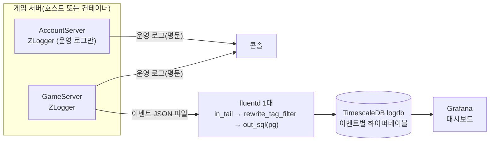
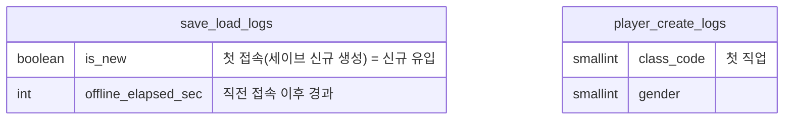
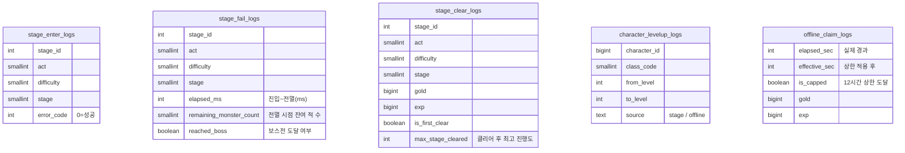
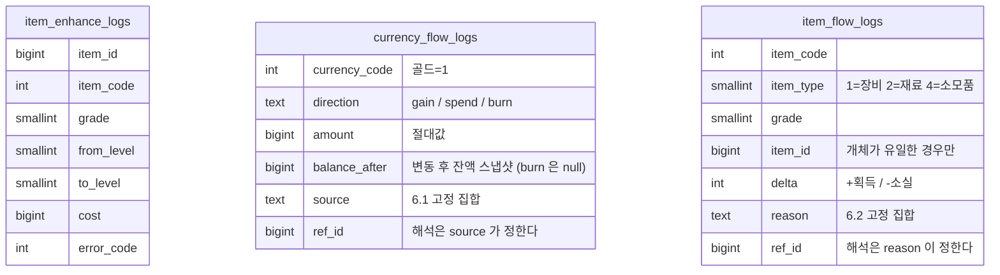
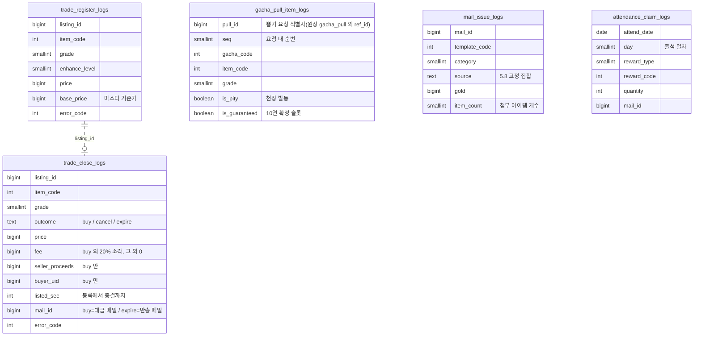
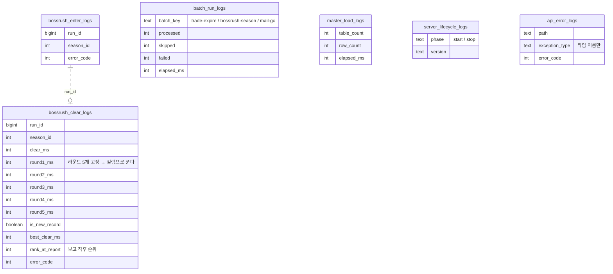

# 서버 로그 이벤트 정의 — 무엇을 남기고 어디에 쌓는가

> 상위 문서: [서버 시스템 전체 개요](../서버-시스템-전체-개요.md)
>
> **어떻게** 로그를 쓰는지는 [로깅 규칙](로깅-규칙.md)이 담당한다. 이 문서는 그 옆에 빠져 있던 질문 — **어떤 사건을, 어떤 필드로 남겨, 어느 테이블에 쌓을 것인가** — 을 다룬다.
>
> **이 프로젝트는 Prometheus 지표를 도입하지 않는다.** 그래서 집계·추세 질문도 이 로그가 함께 맡는다(2장).
>
> 파이프라인은 **ZLogger(JSON) → fluentd 1대 → TimescaleDB `logdb` → Grafana**다.

## 목차

- [1. 개요](#1-개요)
- [2. 로그 4종 분류 — 무엇이 어디로 가는가](#2-로그-4종-분류-무엇이-어디로-가는가)
- [3. 파이프라인](#3-파이프라인)
- [4. 로그 라인 규약](#4-로그-라인-규약)
  - [4.1 라인 형태 — 평탄 JSON 1줄](#41-라인-형태-평탄-json-1줄)
  - [4.2 방출 코드 스케치](#42-방출-코드-스케치)
  - [4.3 태그 → 테이블 이름 규칙](#43-태그-테이블-이름-규칙)
- [5. 액션 로그 카탈로그](#5-액션-로그-카탈로그)
  - [5.1 계정 / 인증 — 이 체계에서는 남기지 않는다](#51-계정-인증-이-체계에서는-남기지-않는다)
  - [5.2 세션 / 캐릭터](#52-세션-캐릭터)
  - [5.3 스테이지 / 전투](#53-스테이지-전투)
  - [5.4 오프라인 보상](#54-오프라인-보상)
  - [5.5 아이템 강화](#55-아이템-강화)
  - [5.6 가챠](#56-가챠)
  - [5.7 거래소 / 교역선](#57-거래소-교역선)
  - [5.8 메일](#58-메일)
  - [5.9 출석부](#59-출석부)
  - [5.10 보스러시 / 랭킹](#510-보스러시-랭킹)
  - [5.11 배치 / 시스템](#511-배치-시스템)
- [6. 재화·아이템 변동(게임 내 재화 흐름)](#6-재화아이템-변동게임-내-재화-흐름)
  - [6.1 `currency.flow` → `currency_flow_logs`](#61-currencyflow-currency_flow_logs)
  - [6.2 `item.flow` → `item_flow_logs`](#62-itemflow-item_flow_logs)
- [7. 히스토리 로그 — 주기 스냅샷](#7-히스토리-로그-주기-스냅샷)
- [8. logdb 스키마(TimescaleDB)](#8-logdb-스키마timescaledb)
  - [8.1 모든 로그 테이블의 공통 규격](#81-모든-로그-테이블의-공통-규격)
  - [8.2 ERD — 세션 / 캐릭터](#82-erd-세션-캐릭터)
  - [8.3 ERD — 스테이지 / 오프라인](#83-erd-스테이지-오프라인)
  - [8.4 ERD — 아이템 / 원장](#84-erd-아이템-원장)
  - [8.5 ERD — 가챠 / 거래소 / 메일 / 출석](#85-erd-가챠-거래소-메일-출석)
  - [8.6 ERD — 보스러시 / 시스템](#86-erd-보스러시-시스템)
  - [8.7 ERD — 히스토리](#87-erd-히스토리)
  - [8.8 하이퍼테이블 · 압축 · 보존](#88-하이퍼테이블-압축-보존)
  - [8.9 인덱스](#89-인덱스)
  - [8.10 연속 집계(continuous aggregate)](#810-연속-집계continuous-aggregate)
- [9. fluentd 설정](#9-fluentd-설정)
  - [9.1 입력 — GameServer의 이벤트 파일을 걷는다](#91-입력-gameserver의-이벤트-파일을-걷는다)
  - [9.2 라우팅과 적재](#92-라우팅과-적재)
  - [9.3 버퍼 · 유실 정책](#93-버퍼-유실-정책)
  - [9.4 새 이벤트를 추가하는 절차](#94-새-이벤트를-추가하는-절차)
  - [9.5 전체 설정 파일](#95-전체-설정-파일)
- [10. 볼륨 감각](#10-볼륨-감각)
- [11. 도입 순서](#11-도입-순서)
- [12. 미결 사항](#12-미결-사항)

## 1. 개요

- **목적**: 지금 서버에는 사람이 읽는 운영 로그만 있다. 그것으로는 *"어제 골드가 얼마나 발행됐나"*, *"어느 스테이지에서 유저가 막히나"*, *"거래소 시세가 무너지고 있나"* 같은 **누적·추세 질문에 답할 수 없다.** 이 문서는 그 질문들에 답하기 위해 **기계가 읽는 로그**를 정의한다.
- **대상 서버**: **`GameServer`뿐이다.** 수집기(fluentd)가 GameServer에만 붙으므로 `AccountServer`는 이벤트 로그를 방출하지 않는다 — 계정 도메인의 질문은 GameServer 로그와 지표로 나눠 답한다(5.1).
- **설계 원칙 다섯 가지**

  1. **한 사건 = 한 행.** 로그는 "일어난 사실"을 과거형으로 기록한다. 상태(잔액 등)를 담더라도 그건 **그 시점 스냅샷**이지 정본이 아니다. 정본은 언제나 게임 DB(MySQL)다.
  2. **이벤트 하나 = 테이블 하나.** 이벤트마다 남길 필드가 다르므로 컬럼을 이벤트에 맞춰 좁게 잡는다. JSON 문자열 컬럼이나 만능 `payload` 컬럼을 두지 않는다(설계 규칙과 동일 — 반복·가변 구조는 컬럼·자식 테이블로 푼다).
  3. **액션 로그와 히스토리 로그를 나눈다.** 사건이 일어난 순간 남기는 것(액션)과, 주기적으로 현재 상태를 세어 남기는 것(히스토리)은 성격이 달라 테이블도 갱신 방식도 다르다(2장·7장).
  4. **서버는 로그 DB에 접속하지 않는다.** 서버는 JSON 한 줄을 파일로 내보내는 데서 끝이고, 적재는 fluentd의 몫이다. 로그 적재 장애가 게임 처리로 번지지 않는 유일한 방법이다.
  5. **답할 질문이 없는 로그는 남기지 않는다.** 5장 모든 행에 "답하는 질문"을 적어 둔 이유다. 그 칸을 못 채우면 그 이벤트는 뺀다.

---

## 2. 로그 4종 분류 — 무엇이 어디로 가는가

지금 서버가 내보내는 로그와 앞으로 추가할 로그를 성격으로 나누면 넷이다. **섞지 않는다.**

| 종류 | 목적 | 형식 | 적재 대상 | 현재 상태 |
|---|---|---|---|---|
| **운영 로그** | "이 요청이 왜 실패했나" — 사람이 읽고 원인을 찾는다 | 한글 평문 1줄(`[시각] [레벨] [카테고리] 메시지`) | 콘솔(개발자) | **있음** — ZLogger 콘솔([로깅 규칙](로깅-규칙.md)) |
| **접근 로그** | "어떤 요청이 얼마나 걸렸나" | 평문(운영 로그와 같은 sink) | 콘솔(개발자) | **있음** — `RequestLoggingMiddleware` |
| **액션 로그** | "무슨 일이 **일어났나**" — 사건 발생 즉시 1행 | **평탄 JSON 1줄** | `logdb` 이벤트별 테이블 | **없음 — 5·6장이 정의한다** |
| **히스토리 로그** | "지금 **얼마나 쌓여 있나**" — 주기마다 상태를 세어 1행 | **평탄 JSON 1줄** | `logdb` 히스토리 테이블 | **없음 — 7장이 정의한다** |

**경계 규칙**

- 운영 로그와 액션 로그는 **같은 사건을 각자의 목적으로 따로 남긴다.** 스테이지 클리어는 운영 로그에 "무슨 일이 있었나" 한 줄, 액션 로그에 "골드 얼마·경험치 얼마" 한 행이 각각 들어간다. 액션 로그를 사람이 읽으려 하지 말고, 운영 로그를 집계하려 하지 않는다.
- **지표(Prometheus)를 두지 않으므로 추세도 이 로그가 답한다.** 원래 지표가 맡을 법한 질문(초당 실패율·지연 분포)까지 `logdb` 집계로 답해야 한다는 뜻이다. 대신 로그는 *개별 사실의 누적*(누가·언제·얼마)을 그대로 들고 있어 `uid`·`item_code`·금액처럼 지표 라벨에 올릴 수 없던 축으로도 잘라 볼 수 있다. **다만 서버 자체의 상태**(GC·스레드풀·커넥션 풀·요청 지연 분포)는 이 로그가 담지 않는다 — 그 공백은 12장에 남겨 둔다.
- **액션 로그로 답할 수 없는 질문이 히스토리 로그의 몫이다.** "유통 골드 총량"은 사건이 아니라 상태라서, 유입·유출 행을 다 더해도 초기값·보정을 모르면 맞지 않는다. 그런 값은 주기마다 게임 DB를 세어 남긴다.

---

## 3. 파이프라인



**왜 이 구조인가**

- **fluentd는 1대다 — 역할도, 서버별 인스턴스도 나누지 않는다.** **방출자는 GameServer 하나**이고 수집 대상은 그 서버가 쓰는 JSON 파일뿐이라, 한 대로 두면 전달 홉이 없어 **지연·유실 지점·운영 대상이 각각 하나씩 줄어든다.**
- **fluentd는 AccountServer에 붙지 않는다.** 그래서 계정 도메인은 이 로그 체계의 대상이 아니고(5.1), 세션 개시는 GameServer의 `save.load`가 대신 답한다. **로그인 성패 추세는 답할 자리가 없다**(12장). 라인 규약(4장)은 서버 중립이라, 나중에 계정서버를 합류시키려면 **같은 로그 디렉터리에 파일을 쓰게 하는 것으로 끝난다** — 수집기 설정은 그대로다(12장).
- **이벤트 로그는 콘솔이 아니라 전용 JSON 파일 sink로 낸다.** 운영 로그는 **사람이 읽는 한글 평문**을 콘솔에 쓰므로(로깅 규칙 §1) 같은 stdout에 섞으면 수집기가 평문과 JSON을 구분해 파싱해야 한다. 이벤트 로그 전용 로거 카테고리(`TaskbarHero.EventLog.*`)를 만들고 **JSON 파일 sink로 분리**해, fluentd가 그 파일만 `in_tail` 한다.
- **서버를 컨테이너로 배포하면** `in_tail` 대신 `logging driver`(`fluentd-address`·`tag`)로 갈아탄다 — **입력 블록 하나만 바뀌고** 라우팅·적재는 그대로다. 지금 저장소의 `docker compose`는 MySQL·Redis만 띄우고 서버는 `dotnet run`으로 호스트에서 도니 `in_tail`이 기본 경로다.
- **적재 대상은 TimescaleDB(`logdb`)다.** 로그는 **시간축 append-only**라서 하이퍼테이블의 자동 분할·압축·보존·연속 집계가 그대로 이득이 된다(8.8·8.10). 게임 DB(MySQL)와 **물리적으로 분리**되므로 분석 질의가 서비스 DB의 커넥션·버퍼풀을 건드리지 않는다.
- **출력 플러그인은 `fluent-plugin-sql`(`out_sql`, Sequel + `pg` 어댑터)** 이다. `out_mysql_bulk`는 MySQL 전용이라 그대로 쓸 수 없고, `out_sql`은 태그별 `<table>` 블록으로 **테이블·컬럼 매핑**을 그대로 표현한다(9.2).
- **환경(dev/prod)은 `logdb` 인스턴스 자체를 나눠 가른다.** 행마다 `env` 컬럼을 붙이는 대신 저장소를 분리한다 — 대시보드 쿼리에 매번 `WHERE env = ...`를 붙일 필요가 없고, 개발 중 쓰레기 데이터가 운영 집계에 섞일 여지가 없다.
- **2단 구성이 필요해지는 조건**은 서버가 여러 호스트로 흩어지거나 로그 볼륨이 한 대의 처리량을 넘을 때다. 그때는 각 호스트에 Forwarder를 두고 지금의 fluentd를 Aggregator로 남기면 되며, **라인 규약·태그 규칙·테이블은 그대로**라 전환이 설정 변경으로 끝난다(12장).

---

## 4. 로그 라인 규약

### 4.1 라인 형태 — 평탄 JSON 1줄

```json
{"timestamp":"2026-08-20T11:23:41.882Z","tag":"stage.clear","uid":1024,"req_id":"0HNCH1PQ8K2","stage_id":1010002,"act":1,"difficulty":1,"stage":2,"gold":120,"exp":72,"is_first_clear":true,"max_stage_cleared":1010002}
```

| 필드 | 타입 | 필수 | 의미 |
|---|---|---|---|
| `timestamp` | timestamptz | ✅ | 이벤트 발생 시각(**UTC**, 밀리초). ZLogger JSON 포매터가 자동으로 넣는다. 하이퍼테이블의 **분할 축** |
| `tag` | text | ✅ | 이벤트 이름. **`도메인.동작`** 소문자 dot 표기(`stage.clear`). **fluentd의 라우팅 키이자 테이블 이름의 원본**(4.3). 테이블에는 저장하지 않는다 — 테이블이 곧 이벤트라 중복이다 |
| `uid` | bigint | — | 계정 식별자(`users.user_id`). 미인증·시스템 이벤트는 없음 |
| `req_id` | text | — | 요청 1건 상관관계 키(`HttpContext.TraceIdentifier`). **접근 로그·원장(6장)과 이어 붙이는 축**. 배치 이벤트는 없음 |
| `error_code` | int | — | [`ErrorCode`](error-code-정의.md) 값. **`0`이면 성공, 그 외는 서버가 규칙대로 거부한 것.** 거부를 남기는 이벤트에만 있다 |
| 그 외 | — | — | **이벤트 고유 필드**(5~7장). 이름이 곧 컬럼 이름이라 `snake_case`로 낸다 |

- **중첩을 만들지 않는다.** 필드를 최상위에 평탄하게 내면 `out_sql`의 컬럼 매핑이 그대로 맞아 수집기의 변환 단계가 없다(이벤트당 필드가 열 개를 넘는 것도 있다).
- **`result` 컬럼을 따로 두지 않는다.** `error_code = 0` 하나로 성공·거부가 갈리므로, 같은 사실을 두 컬럼에 적는 것은 낭비다.
- **거부(`error_code ≠ 0`)를 전부 남기지는 않는다.** 기준은 "그 거부가 반복되면 기획·밸런스를 바꿔야 하는가"다. `InsufficientCurrency`·`InventoryFull`은 남기고, `InvalidRequest`(클라 버그)·인증 실패 계열은 남기지 않는다. **어느 테이블이 거부를 남기는지는 8장 ERD에 `error_code` 컬럼이 있는지로 본다.**
- **민감정보는 예외 없이 뺀다** — 비밀번호·토큰·해시·이메일 원문·요청 바디 전문·스택트레이스([로깅 규칙](로깅-규칙.md) §7).

### 4.2 방출 코드 스케치

이벤트 로그는 **전용 로거 카테고리 + 파일 sink**로 분리한다. 카테고리로 갈라 두면 운영 로그(콘솔)와 절대 섞이지 않는다. 구현은 `GameServer/Logging/`(`IEventLogger`·`EventLogger`·`EventFields`)에 있고, 로거 카테고리와 태그 상수는 `GameServer/Constants.cs`의 `Constants.EventLog`에 있다.

```csharp
// Program.cs — 운영 로그(콘솔)는 로깅 규칙 §1 그대로 두고, 이벤트 로그만 파일로 분리한다.
builder.Logging.AddZLoggerRollingFile(options =>
{
    options.FilePathSelector = (timestamp, sequence) =>
        Path.Combine(eventLogDirectory, $"event-{timestamp.ToLocalTime():yyyyMMdd}_{sequence:000}.json");
    options.RollingInterval = RollingInterval.Day;
    options.RollingSizeKB = 1024 * 100;
    // 접두사·접미사 없이 메시지만 쓴다 — 라인 전체를 EventLogger가 이미 완성해 넘긴다.
    options.UsePlainTextFormatter(formatter =>
    {
        formatter.SetPrefixFormatter($"", (in MessageTemplate _, in LogInfo _) => { });
        formatter.SetSuffixFormatter($"", (in MessageTemplate _, in LogInfo _) => { });
    });
});

// sink 라우팅: 이벤트 로그는 파일에만, 운영 로그는 콘솔에만 간다.
builder.Logging.AddFilter<ZLoggerConsoleLoggerProvider>(EventLogger.Category, LogLevel.None);
builder.Logging.AddFilter<ZLoggerRollingFileLoggerProvider>(null, LogLevel.None);
builder.Logging.AddFilter<ZLoggerRollingFileLoggerProvider>(EventLogger.Category, LogLevel.Information);
```

```csharp
/// <summary>액션 로그 1행을 방출한다. tag 가 곧 적재 테이블을 결정한다(4.3).</summary>
public void Action(string tag, long? uid, IEventFields fields, int? errorCode = null)
{
    var line = new JsonObject { ["timestamp"] = ..., ["tag"] = tag };
    // uid·req_id·error_code는 있을 때만 넣는다. req_id는 호출자가 넘기지 않고
    // IHttpContextAccessor로 현재 요청에서 찾는다(요청 밖 = 배치면 없음).
    // 이어서 fields를 snake_case로 직렬화해 최상위에 평탄하게 펼친다.
    _logger.ZLogInformation($"{line.ToJsonString()}");
}
```

- **라인은 직접 조립한다.** 로거의 JSON 포매터를 쓰면 `LogLevel`·`Category` 같은 필드가 섞여 `out_sql`의 컬럼 매핑이 어긋난다 — 나가는 키는 이 문서가 정한 것만이어야 한다.
- 태그는 **`[CallerMemberName]`으로 자동 채우지 않고 상수로 명시**한다(`Constants.EventLog.Tags.SaveLoad`). 태그가 테이블을 결정하므로, 메서드 이름을 리팩터링하면 적재 대상이 바뀌는 결합은 만들지 않는다.
- 이벤트 필드는 **이벤트별 `record`**로 두어 컬럼과 1:1로 맞춘다. 익명 객체를 쓰면 컬럼이 조용히 어긋난다. 프로퍼티는 `PascalCase`로 쓰고 직렬화가 `snake_case` 컬럼 이름으로 바꾼다.
- 호출 지점은 **서비스 계층**이다(컨트롤러 금지 — 로깅 규칙 §4). 트랜잭션이 있는 이벤트는 **커밋 성공 이후** 방출한다(롤백된 사실을 로그에 남기지 않는다).
- 출력 디렉터리는 `appsettings`의 `EventLog:Directory`(개발 기본 `logs/event`)다. 9.1의 `in_tail` 경로가 이 디렉터리를 가리킨다.

### 4.3 태그 → 테이블 이름 규칙

| 태그 | 테이블 |
|---|---|
| `stage.clear` | `stage_clear_logs` |
| `trade.close` | `trade_close_logs` |
| `history.trade_market` | `trade_market_history` |

- **액션 로그**: `도메인.동작` → `도메인_동작_logs` (dot을 `_`로 바꾸고 `_logs` 접미사).
- **히스토리 로그**: `history.대상` → `대상_history`.
- 이 규칙이 있어 **새 이벤트를 추가할 때 손댈 곳이 셋으로 고정**된다 — 이벤트 정의(이 문서) · 테이블 DDL · fluentd `<table>` 블록(9.4).

---

## 5. 액션 로그 카탈로그

표 읽는 법: **테이블**은 4.3 규칙으로 태그에서 나온 이름이고, **고유 컬럼**은 그 이벤트에만 있는 필드다. 모든 테이블이 공통으로 갖는 `timestamp`·`uid`·`req_id`와, 거부를 남기는 테이블에만 붙는 `error_code`는 표에 적지 않는다(8.1 · 8장 ERD).

각 표 아래의 **예시 로그 라인**은 그 이벤트가 실제로 어떤 JSON 한 줄로 나가는지를 보인다 — 공통 필드까지 포함한 전체 형태이며, 코드 값은 [마스터 데이터](../세부/master-data/master-data-값.md)의 실제 값으로 맞췄다. **거부 라인은 성공과 필드가 같고 `error_code`만 0이 아니다**(5.5에 한 줄 예시). 배치가 내는 라인에는 `req_id`가 없고, 시스템 이벤트에는 `uid`도 없다.

**카탈로그에 남기는 기준 — 셋을 차례로 통과해야 테이블이 된다.**

1. **답하는 질문이 있는가**(1장 원칙 5). 못 채우면 넣지 않는다.
2. **그 질문이 상태 분포인가?** 그렇다면 액션 로그는 **편향된 답**을 준다 — 자주 바꾸는 계정이 여러 행을 만들고 한 번 정해 두고 안 바꾼 계정은 0행이라, 집계가 소수에게 끌려간다. 상태 분포는 **7장 스냅샷**이 답한다(계정 하나가 정확히 한 표). **예외는 되돌릴 수 없는 단조 증가 상태**(강화 단계·최고 진행도)다 — 액션의 누적이 곧 상태라 편향이 없다.
3. **원장(6장)이 같은 축으로 이미 담는가?** 재화·아이템이 움직이는 사건은 `currency_flow_logs`·`item_flow_logs`에 `source`/`reason`과 `ref_id`로 남는다. 도메인 테이블은 **원장에 없는 축**(스테이지 id·가챠 등급·거래 가격 등)을 가질 때만 만든다.

**거부는 그 자체로 테이블이 되지 않는다.** 남길 값이 있으면 해당 도메인 테이블의 `error_code` 컬럼으로 담는다 — 거부만 담는 테이블은 다른 테이블의 `error_code` 행과 같은 사실을 두 번 적는 것이다.

### 5.1 계정 / 인증 — 이 체계에서는 남기지 않는다

**fluentd가 GameServer에만 붙으므로 AccountServer는 이벤트 로그를 방출하지 않는다.** 계정 도메인(`signup`·`login`·`login_failed`·`logout`·`validate`)은 이 카탈로그에 없고, 원래 그 이벤트로 답하려던 질문을 아래로 나눠 답한다.

| 원래 질문 | 답하는 자리 |
|---|---|
| **DAU · 재방문율 · 시간대별 접속 분포** | `save_load_logs`(5.2) — `load`는 접속 시 반드시 1회 호출되므로 **세션 개시와 1:1**이다 |
| **신규 유입** | `save_load_logs`의 `is_new = true`(가입 후 첫 접속) |
| **가입 → 실제 플레이 전환율** | 위 신규 접속 수 대비 `player_create_logs`(5.2) |
| 로그인 성패·실패 이유의 **추세** | **답할 자리가 없다**(12장) — 지표를 두지 않기로 하면서 이 질문이 공백으로 남았다 |
| 개별 로그인 실패의 원인 추적 | AccountServer 운영 로그(사람이 읽는다) |

- **이 게임에서 `auth.login`과 `save.load`는 사실상 같은 사건이다** — 로그인만 하고 게임에 들어오지 않은 유저는 분석 가치가 없다. 그래서 세션 로그를 GameServer 쪽 사실로 옮겨도 DAU·리텐션·전환율은 그대로 나온다. **API를 새로 만들지 않는 이유**가 이것이다(세션 개시 신호가 이미 `load`에 있다).
- **포기하는 것은 둘이다.** ① 로그인 실패 전반 — **개별 사실**(같은 IP·짧은 시간 상관 = 크리덴셜 스터핑 추적)도, **급증 감지**도 관측되지 않는다(지표를 두지 않기로 하면서 후자까지 공백이 됐다, 12장). ② **정확한 로그아웃 시각** — 세션 길이는 `save.load`부터 그 세션의 마지막 액션 로그까지로 추정한다.
- 계정 이벤트를 로그로도 남겨야 할 상황이 오면 **AccountServer가 같은 로그 디렉터리(공유 볼륨)에 JSON 파일을 쓰게 하는 것**이 최소 비용 경로다 — fluentd는 이미 디렉터리 glob으로 걷으므로 수집기 설정을 고치지 않는다(12장).

### 5.2 세션 / 캐릭터

| 태그 | 테이블 | 발생 시점 | 고유 컬럼 | 답하는 질문 |
|---|---|---|---|---|
| `save.load` | `save_load_logs` | 접속 시 세이브 로드 | `is_new`, `offline_elapsed_sec` | **세션 개시 = DAU · 재방문율 · 시간대별 접속 분포**(5.1) · 신규 유입(`is_new`) · 이탈 후 복귀 간격 분포 |
| `player.create` | `player_create_logs` | **최초** 캐릭터 생성(계정 세이브 초기화) | `class_code`, `gender` | **가입 → 실제 플레이 전환율**(`save.load`의 `is_new` 대비) · **첫 직업 선호**(스냅샷으로는 "지금 보유 직업"만 보여 첫 선택을 알 수 없다) |

**예시 로그 라인** — 서버가 이벤트 로그 파일에 쓰는 실제 형태(표 순서).

```json
{"timestamp":"2026-08-21T04:01:58.663Z","tag":"save.load","uid":1024,"req_id":"0HNCH1PQ8K1","is_new":true,"offline_elapsed_sec":0}
{"timestamp":"2026-08-21T04:02:11.204Z","tag":"player.create","uid":1024,"req_id":"0HNCH1PQ8K2","class_code":1,"gender":0}
```

- **`save.load`가 이 체계에서 가장 중요한 유저 로그다.** 계정 로그가 없으므로 이 테이블이 접속·리텐션 분석의 유일한 근거이고, 8.10의 `session_user_daily`가 여기서 나온다.

### 5.3 스테이지 / 전투

| 태그 | 테이블 | 발생 시점 | 고유 컬럼 | 답하는 질문 |
|---|---|---|---|---|
| `stage.enter` | `stage_enter_logs` | 스테이지 진입 | `stage_id`, `act`, `difficulty`, `stage` | **enter 대비 clear 비율 = 실질 난이도**(아래) |
| `stage.fail` | `stage_fail_logs` | 파티 전멸(클라이언트 보고) | `stage_id`, `act`, `difficulty`, `stage`, `elapsed_ms`, `remaining_monster_count`, `reached_boss` | **실질 난이도의 직접 측정**(`fail / enter`) · **아슬아슬한 패배인가 즉사인가**(리밸런싱 대상 선별) · **잡몹이 벽인가 보스가 벽인가** |
| `stage.clear` | `stage_clear_logs` | 클리어 보상 지급 | `stage_id`, `act`, `difficulty`, `stage`, `gold`, `exp`, `is_first_clear`, `max_stage_cleared` | **스테이지별 이탈 지점** · 재화 유입량 |
| `character.levelup` | `character_levelup_logs` | 레벨 상승(스테이지·오프라인 공통) | `character_id`, `class_code`, `from_level`, `to_level`, `source`(`stage`\|`offline`) | **성장 곡선 실측**(기획 곡선과의 괴리) |

**예시 로그 라인** — 서버가 이벤트 로그 파일에 쓰는 실제 형태(표 순서).

```json
{"timestamp":"2026-08-21T04:12:30.117Z","tag":"stage.enter","uid":1024,"req_id":"0HNCH1PQ8L4","error_code":0,"stage_id":1010002,"act":1,"difficulty":1,"stage":2}
{"timestamp":"2026-08-21T04:12:33.418Z","tag":"stage.clear","uid":1024,"req_id":"0HNCH1PQ8L9","stage_id":1010002,"act":1,"difficulty":1,"stage":2,"gold":120,"exp":72,"is_first_clear":true,"max_stage_cleared":1010002}
{"timestamp":"2026-08-21T05:47:12.884Z","tag":"stage.fail","uid":1024,"req_id":"0HNCH1PQ9A3","stage_id":1010010,"act":1,"difficulty":1,"stage":10,"elapsed_ms":41200,"remaining_monster_count":2,"reached_boss":true}
{"timestamp":"2026-08-21T04:12:33.421Z","tag":"character.levelup","uid":1024,"req_id":"0HNCH1PQ8L9","character_id":1,"class_code":1,"from_level":4,"to_level":5,"source":"stage"}
```

- `stage_id`는 `act × 1000000 + difficulty × 10000 + stage` 인코딩이고, `gold`·`exp`는 `stage_reward`의 그 스테이지 값이다. 뒤의 두 줄은 **같은 `req_id`** 라 한 요청이 만든 행끼리 이어 붙는다.
- **전투 실패는 서버가 스스로 알 수 없으므로 클라이언트가 보고한다.** 전투가 클라이언트 권위라 서버는 전멸을 관측할 수단이 없고, 전멸 시 클라이언트가 `POST /api/game/stage/fail`로 알린다([스테이지/전투 기획서](../세부/stage-battle-기획서.md) 5.3). 이 보고는 **상태를 바꾸지 않는 기록 전용**이라 조작 동기가 없어(보상·진행도 불변) 검증 없이 받는다. 덕분에 실질 난이도가 `fail / enter`로 **직접** 나온다.
- **그래도 `stage.enter`는 계속 남긴다.** 보고는 클라이언트가 살아 있을 때만 도착하므로, **앱 강제 종료·네트워크 끊김·전투 중 이탈**은 `fail` 없이 사라진다. `enter`가 있어야 그 공백(`enter − clear − fail`)을 **이탈**로 따로 셀 수 있고, 이것이 진짜 전멸과 구분된다 — 두 이벤트가 함께 있어야 난이도와 이탈이 갈린다.
- **`elapsed_ms`·`remaining_monster_count`가 리밸런싱 대상을 고른다.** 실패율만으로는 "조금 부족해서 진 스테이지"와 "손도 못 대는 벽"이 같아 보인다. 남은 적이 1~2마리인 패배가 몰린 스테이지는 소폭 하향으로 넘어가고, 즉사(짧은 `elapsed_ms`)가 몰린 스테이지는 요구 전투력 자체를 다시 봐야 한다. `reached_boss`는 그 벽이 보스인지 잡몹인지를 가른다.
- **드랍 목록은 이 테이블에 두지 않는다.** 아이템이 새로 생긴 사실은 `item_flow_logs`(6.2)가 드랍 1건당 1행으로 담으므로, 여기에 배열을 넣으면 같은 사실이 두 곳에 생긴다. 드랍률 실측은 `item_flow_logs`의 `reason='stage_drop'`으로 낸다.
- `stage_clear_logs`가 **가장 빈번한 테이블**이다. 방치형이라 한 판이 수십 초로 끝난다(10장).

### 5.4 오프라인 보상

| 태그 | 테이블 | 발생 시점 | 고유 컬럼 | 답하는 질문 |
|---|---|---|---|---|
| `offline.claim` | `offline_claim_logs` | 오프라인 보상 정산 | `elapsed_sec`, `effective_sec`, `is_capped`, `gold`, `exp` | **12시간 상한에 걸리는 비율**(상한 조정 근거) · 오프라인 재화 유입 비중 |

**예시 로그 라인** — 서버가 이벤트 로그 파일에 쓰는 실제 형태(표 순서).

```json
{"timestamp":"2026-08-21T04:01:59.902Z","tag":"offline.claim","uid":1024,"req_id":"0HNCH1PQ8K1","elapsed_sec":50400,"effective_sec":43200,"is_capped":true,"gold":18400,"exp":9600}
```

- 14시간(`50400`) 만에 접속해 12시간 상한(`43200`)에 걸린 경우다 — `is_capped`가 상한 조정의 근거다.
- 골드 유입은 원장에도 남지만(`gain`/`offline_claim`), **상한에 걸렸는지는 원장이 모른다** — 그 한 컬럼이 이 테이블을 따로 두는 이유다.

### 5.5 아이템 강화

| 태그 | 테이블 | 발생 시점 | 고유 컬럼 | 답하는 질문 |
|---|---|---|---|---|
| `item.enhance` | `item_enhance_logs` | 강화 +1 | `item_id`, `item_code`, `grade`, `from_level`, `to_level`, `cost` | **강화 단계 분포**(어디서 멈추나) · 어떤 등급·부위에 투자가 몰리나 · 골드 유출 비중 |

**예시 로그 라인** — 서버가 이벤트 로그 파일에 쓰는 실제 형태(표 순서).

```json
{"timestamp":"2026-08-21T06:18:22.030Z","tag":"item.enhance","uid":1024,"req_id":"0HNCH1PQA52","error_code":0,"item_id":90211,"item_code":31131,"grade":3,"from_level":4,"to_level":5,"cost":11000}
{"timestamp":"2026-08-21T06:18:29.641Z","tag":"item.enhance","uid":1024,"req_id":"0HNCH1PQA55","error_code":4005,"item_id":90211,"item_code":31131,"grade":3,"from_level":5,"to_level":6,"cost":16000}
```

- **거부 라인이 어떻게 생기는지는 두 번째 줄이 보여 준다** — 필드는 성공과 같고 `error_code`만 `InsufficientCurrency(4005)`로 바뀐다(`cost`·`to_level`은 *시도한* 값이다).

### 5.6 가챠

| 태그 | 테이블 | 발생 시점 | 고유 컬럼 | 답하는 질문 |
|---|---|---|---|---|
| `gacha.pull_item` | `gacha_pull_item_logs` | 뽑기 결과 **1개당 1행** | `pull_id`, `seq`, `gacha_code`, `item_code`, `grade`, `is_pity`, `is_guaranteed` | **등급 실측 분포가 기획 확률과 맞는가** · 천장 발동률 · 배너별 소비량 · 1연/10연 선택 비율 |

**예시 로그 라인** — 서버가 이벤트 로그 파일에 쓰는 실제 형태(표 순서).

```json
{"timestamp":"2026-08-21T08:41:12.344Z","tag":"gacha.pull_item","uid":1024,"req_id":"0HNCH1PQC77","pull_id":880412,"seq":1,"gacha_code":60002,"item_code":41001,"grade":2,"is_pity":false,"is_guaranteed":false}
{"timestamp":"2026-08-21T08:41:12.351Z","tag":"gacha.pull_item","uid":1024,"req_id":"0HNCH1PQC77","pull_id":880412,"seq":10,"gacha_code":60002,"item_code":31151,"grade":5,"is_pity":false,"is_guaranteed":true}
```

- **요청 단위 값은 파생으로 얻는다** — **1연/10연**은 같은 `pull_id`의 행 수(1 또는 10), **비용**은 원장 `spend`/`gacha_pull`(`ref_id` = `pull_id`), **배너**는 `gacha_code`다.
- 확률 검증은 **표본이 쌓여야** 가능하다 — 이 테이블이 그 표본이다.
- 지급된 아이템 자체는 `item_flow_logs`의 `reason='gacha'`(`ref_id` = `pull_id`)에도 남는다. 등급 분포는 이쪽, 아이템 유통량은 그쪽에서 본다.

### 5.7 거래소 / 교역선

| 태그 | 테이블 | 발생 시점 | 고유 컬럼 | 답하는 질문 |
|---|---|---|---|---|
| `trade.register` | `trade_register_logs` | 판매 등록(에스크로) | `listing_id`, `item_code`, `grade`, `enhance_level`, `price`, `base_price` | **아이템별 시세 분포**(`price / base_price`) · 공급량 |
| `trade.close` | `trade_close_logs` | 등록이 **어떻게든 끝날 때**(구매·취소·만료) | `listing_id`, `item_code`, `grade`, `outcome`(`buy`\|`cancel`\|`expire`), `price`, `fee`, `seller_proceeds`, `buyer_uid`, `listed_sec`, `mail_id` | **미체결률**(`outcome` 비율) · **체결가·체결까지 걸린 시간** · 수수료 소각량 · 안 팔려서 내리는 가격대 |

**예시 로그 라인** — 서버가 이벤트 로그 파일에 쓰는 실제 형태(표 순서).

```json
{"timestamp":"2026-08-21T09:05:41.220Z","tag":"trade.register","uid":1024,"req_id":"0HNCH1PQD05","error_code":0,"listing_id":50231,"item_code":31131,"grade":3,"enhance_level":5,"price":72000,"base_price":50000}
{"timestamp":"2026-08-21T20:37:41.902Z","tag":"trade.close","uid":1024,"req_id":"0HNCH1PQF41","error_code":0,"listing_id":50231,"item_code":31131,"grade":3,"outcome":"buy","price":72000,"fee":14400,"seller_proceeds":57600,"buyer_uid":2087,"listed_sec":41520,"mail_id":771390}
{"timestamp":"2026-08-21T21:02:18.554Z","tag":"trade.close","uid":1024,"req_id":"0HNCH1PQF60","error_code":0,"listing_id":50244,"item_code":41020,"grade":5,"outcome":"cancel","price":90000,"fee":0,"seller_proceeds":0,"listed_sec":168300}
{"timestamp":"2026-08-22T03:00:07.318Z","tag":"trade.close","uid":1024,"listing_id":50250,"item_code":41010,"grade":4,"outcome":"expire","price":40000,"fee":0,"seller_proceeds":0,"listed_sec":259200,"mail_id":771204}
```

- **결말 세 갈래를 한 테이블에 담는다.** 구매·취소·만료는 필드가 거의 같고(무엇이·얼마에·얼마나 걸려 끝났나), 핵심 질문인 **미체결률**은 세 결말의 비율이라 한 테이블에서 `GROUP BY outcome` 한 줄로 나온다. 테이블이 셋이면 그 질문마다 `UNION`이 필요하다. `batch_run_logs`가 배치 종류를 `batch_key`로 구분하는 것과 같은 기준이다(5.11) — **필드가 동일한 이벤트군은 구분 컬럼으로 한 테이블에 담는다.**
- **`uid`는 언제나 판매자(등록자)** 다. 등록과 결말을 같은 계정 축으로 잇기 위해서이고, 구매자는 `buyer_uid`로 따로 담는다(`outcome='buy'`가 아니면 없다). `fee`·`seller_proceeds`도 구매일 때만 값이 있다.
- **만료는 배치가 내므로 `req_id`가 없다**(위 마지막 줄, `listed_sec 259200` = 판매 기간 3일). 구매·취소는 요청이라 있다.
- **`price_ratio` 같은 파생 값은 컬럼으로 두지 않는다.** `price / base_price`는 `listing_id`로 등록 행과 이어 계산한다.
- `outcome='buy'`의 `fee`는 **경제에서 소멸하는 골드**다(판매가의 20%, [거래소 기획서](../세부/trade-기획서.md)). 6.1의 `direction='burn'` 행과 짝을 이룬다.
- `listed_sec`(등록 → 종결까지 걸린 초)은 **유동성 지표**다. 길어지면 그 품목은 공급 과잉이다.
- **`trade.list`(검색) 로깅은 미결**이다 — 검색어 분포는 *사기 전의 수요*를 알려 주는 유일한 신호지만 조회 볼륨이 크다(12장).

### 5.8 메일

| 태그 | 테이블 | 발생 시점 | 고유 컬럼 | 답하는 질문 |
|---|---|---|---|---|
| `mail.issue` | `mail_issue_logs` | 서버가 메일을 발급하는 **모든 지점** | `mail_id`, `template_code`, `category`, `source`(아래), `gold`, `item_count` | **미수령 재화의 총량**(우편함에 떠 있는 부채) · **발급 → 수령 지연** |

**예시 로그 라인** — 서버가 이벤트 로그 파일에 쓰는 실제 형태(표 순서).

```json
{"timestamp":"2026-08-21T04:02:11.216Z","tag":"mail.issue","uid":1024,"req_id":"0HNCH1PQ8K2","mail_id":770001,"template_code":101,"category":1,"source":"newbie","gold":10000000,"item_count":2}
{"timestamp":"2026-08-22T03:00:07.322Z","tag":"mail.issue","uid":1024,"mail_id":771204,"template_code":202,"category":2,"source":"trade_expire","gold":0,"item_count":1}
```

- `source` 고정 집합: `newbie`(신규 지원금) · `attendance` · `trade_buy_item`(구매 아이템) · `trade_sell_proceeds`(판매 대금) · `trade_expire`(만료 반송) · `bossrush_rank`(시즌 순위 보상). 첫 줄은 신규 지원금(골드 1천만 + 부스터 2종), 둘째 줄은 만료 반송이라 **`req_id`가 없다**(배치).
- **메일은 이 게임의 재화 지급 관문이다.** 출석·거래 대금·순위 보상이 전부 메일을 거치므로, **발급(이 테이블) − 수령(원장의 `mail_claim` 행)** 의 차액이 곧 **아직 경제에 풀리지 않은 재화**다.
- **수령 시각과 실효 유입은 원장이 담는다** — 골드는 `currency_flow_logs`의 `gain`/`mail_claim`, 아이템은 `item_flow_logs`의 `reason='mail_claim'`(둘 다 `ref_id` = `mail_id`). 발급 → 수령 지연은 두 시각의 차다.
- 첨부 아이템은 **개수(`item_count`)만** 남긴다. 품목별 상세는 수령 시 `item_flow_logs`가 담는다.
- 메일 GC 배치의 삭제는 `batch_run_logs`(5.11)에 집계로 들어간다 — 건별 로그를 만들지 않는다.

### 5.9 출석부

| 태그 | 테이블 | 발생 시점 | 고유 컬럼 | 답하는 질문 |
|---|---|---|---|---|
| `attendance.claim` | `attendance_claim_logs` | 오늘자 출석 보상 획득 | `attend_date`, `day`, `reward_type`, `reward_code`, `quantity`, `mail_id` | **일차별 이탈**(며칠째에서 끊기나) · 출석 재화 유입 |

**예시 로그 라인** — 서버가 이벤트 로그 파일에 쓰는 실제 형태(표 순서).

```json
{"timestamp":"2026-08-21T04:03:02.441Z","tag":"attendance.claim","uid":1024,"req_id":"0HNCH1PQ8K8","attend_date":"2026-08-21","day":7,"reward_type":3,"reward_code":41002,"quantity":3,"mail_id":771310}
```

- `attendance_master` 7일차(상급 강화석 3개) 행이 그대로 나온다. 재화는 이 시점에 지급되지 않고 `mail_id`의 수령 시점에 원장으로 잡힌다.
- **`mail.issue`(`source='attendance'`)와 겹치지만 이 테이블을 둔다.** 이 도메인의 질문이 **일차별 이탈**이고 `day`는 메일 로그에 없는 축이다.

### 5.10 보스러시 / 랭킹

| 태그 | 테이블 | 발생 시점 | 고유 컬럼 | 답하는 질문 |
|---|---|---|---|---|
| `bossrush.enter` | `bossrush_enter_logs` | 도전 개시 | `run_id`, `season_id` | **완주율**(`clear / enter`) — 콘텐츠 난이도 · 포기·전멸 추정 |
| `bossrush.clear` | `bossrush_clear_logs` | 클리어 보고 | `run_id`, `season_id`, `clear_ms`, `round1_ms` ~ `round5_ms`, `is_new_record`, `best_clear_ms`, `rank_at_report` | 기록 향상 추이 · 상위권 진입 난이도 · **라운드별 소요 분포**(어느 라운드가 병목인가) |

**예시 로그 라인** — 서버가 이벤트 로그 파일에 쓰는 실제 형태(표 순서).

```json
{"timestamp":"2026-08-21T10:11:03.774Z","tag":"bossrush.enter","uid":1024,"req_id":"0HNCH1PQE01","error_code":0,"run_id":30871,"season_id":12}
{"timestamp":"2026-08-21T10:14:08.112Z","tag":"bossrush.clear","uid":1024,"req_id":"0HNCH1PQE09","error_code":0,"run_id":30871,"season_id":12,"clear_ms":184320,"round1_ms":21440,"round2_ms":28900,"round3_ms":30120,"round4_ms":30680,"round5_ms":73180,"is_new_record":true,"best_clear_ms":184320,"rank_at_report":7}
```

- **라운드 기록은 자식 테이블이 아니라 컬럼 5개다.** 라운드 수가 **5로 고정**이라 파티 자리 3칸을 컬럼으로 푼 것과 같은 처리이고(자식 테이블이면 행이 6배가 된다), 병목 질문은 `avg(round3_ms)`처럼 컬럼 집계로 그대로 답한다.
- 스테이지와 같은 이유로 **실패가 보고되지 않는다** — `enter` 대비 `clear` 비율이 그 공백을 메운다([보스러시 기획서](../세부/boss-rush-기획서.md)).
- 도전 횟수 제한을 없앴으므로 `enter` 볼륨이 종전(1인 1일 3회)보다 커질 수 있다.

### 5.11 배치 / 시스템

| 태그 | 테이블 | 발생 시점 | 고유 컬럼 | 답하는 질문 |
|---|---|---|---|---|
| `batch.run` | `batch_run_logs` | 주기 배치 1회 종료(`PeriodicBatchScheduler` 파생 공통) | `batch_key`, `processed`, `skipped`, `failed`, `elapsed_ms` | 배치가 밀리고 있나 · 실패가 쌓이나 |
| `master.load` | `master_load_logs` | 마스터 데이터 적재 완료 | `table_count`, `row_count`, `elapsed_ms` | 배포 후 마스터가 기대대로 올라갔나 |
| `server.lifecycle` | `server_lifecycle_logs` | 기동·종료 | `phase`(`start`\|`stop`), `version` | **배포 시점 표시**(Grafana 주석 — 지표 변화와 배포를 겹쳐 본다) |
| `api.error` | `api_error_logs` | 전역 예외 처리기가 미처리 예외를 잡음 | `path`, `exception_type`, `error_code` | 어떤 예외가 늘고 있나 |

**예시 로그 라인** — 서버가 이벤트 로그 파일에 쓰는 실제 형태(표 순서).

```json
{"timestamp":"2026-08-21T04:00:00.512Z","tag":"batch.run","batch_key":"trade-expire","processed":37,"skipped":0,"failed":0,"elapsed_ms":214}
{"timestamp":"2026-08-21T03:59:58.140Z","tag":"master.load","table_count":21,"row_count":1487,"elapsed_ms":312}
{"timestamp":"2026-08-21T03:59:58.402Z","tag":"server.lifecycle","phase":"start","version":"1.4.0"}
{"timestamp":"2026-08-21T12:41:07.883Z","tag":"api.error","uid":1024,"req_id":"0HNCH1PQG22","path":"/api/game/stage/clear","exception_type":"MySqlException","error_code":11001}
```

- 위 세 줄은 **`uid`·`req_id`가 둘 다 없다**(시스템·배치). `api.error`만 요청에서 나온 값을 갖는다. `error_code 11001`은 전역 예외 처리기가 일반화한 `ServerError`이고, 예외는 **타입 이름만** 남는다.
- `batch.run`은 배치 종류별로 테이블을 나누지 않고 **`batch_key`로 구분**한다(`trade-expire`·`bossrush-season`·`mail-gc`). 컬럼 구조가 배치마다 같기 때문이고, `server.start`/`stop`이 `phase` 컬럼으로 한 테이블인 것, 거래 결말 셋이 `outcome` 한 컬럼인 것(5.7)이 모두 같은 기준이다.
- `api.error`에 **예외 메시지 전문·스택을 넣지 않는다** — 그건 운영 로그의 몫이고, 여기는 집계 축이 될 예외 **타입 이름**만으로 충분하다.
- `master.load`의 테이블별 행 수는 **테이블 수·총 행 수 두 값으로 요약**한다. 마스터가 늘 때마다 컬럼이 늘어나는 구조(테이블→행 수 맵)를 만들지 않는다.
- **서버 구분 컬럼(`server`)을 두지 않는다.** 로그를 내는 서버가 GameServer 하나라 모든 행이 같은 값이 된다(8.1이 `tag` 컬럼을 두지 않는 것과 같은 이유). AccountServer가 이 체계에 합류하면 그때 추가한다.

---

## 6. 재화·아이템 변동(게임 내 재화 흐름)

5장의 도메인 로그만으로는 **"골드가 전체적으로 늘고 있나 줄고 있나"**에 답할 수 없다. 유입·유출이 여러 도메인에 흩어져 있어, 답하려면 매번 그만큼을 `UNION` 해야 하기 때문이다.

그래서 **재화와 아이템이 움직인 모든 지점이 원장 로그를 하나 더 남긴다.** 도메인 로그와 내용이 겹치지만, 겹침을 감수할 만큼 이 두 스트림의 값어치가 크다. 도메인 로그와는 `req_id`로 이어 붙는다.

**원장은 이 체계의 기본 기록이다.** 큐브 3연산·가방 확장·룬 강화·소모품 사용·캐릭터 추가 생성·메일 수령은 **원장 행이 유일한 기록**이며, 그 도메인의 질문에는 아래 `source`/`reason`과 `ref_id`가 답한다.

### 6.1 `currency.flow` → `currency_flow_logs`

`player_item`의 재화 행(`item_type=3`, 골드 = `item_code` 1)이 움직일 때마다 1행.

| 컬럼 | 타입 | 의미 |
|---|---|---|
| `currency_code` | int | 재화 아이템 코드(골드 = `1`) |
| `direction` | text | `gain` \| `spend` \| `burn` |
| `amount` | bigint | **절대값**(부호는 `direction`이 갖는다) |
| `balance_after` | bigint | 변동 후 잔액(그 시점 스냅샷). **`burn`은 `null`**(아래) |
| `source` | text | 아래 고정 집합 |
| `ref_id` | bigint | 관련 식별자. **해석은 `source`가 정한다**(아래 표) |

**`source` 고정 집합과 `ref_id` 해석** — 이 목록이 곧 이 게임 경제의 전체 지도다. `ref_id`는 그 도메인의 질문에 답하는 축이므로 **없으면 `0`이 아니라 반드시 값을 넣는다.**

| direction | source | `ref_id` | 비고 |
|---|---|---|---|
| `gain` | `stage_clear` | `stage_id` | 온라인 전투 보상 — **주 유입원** |
| `gain` | `offline_claim` | `0` | 오프라인 정산(상세는 `offline_claim_logs`) |
| `gain` | `cube_dismantle` | `0` | 아이템 → 골드 전환. 분해된 품목은 같은 `req_id`의 `item_flow_logs` 행들이다 |
| `gain` | `mail_claim` | `mail_id` | 출석·거래 대금·순위 보상·신규 지원금이 **전부 여기로 들어온다** |
| `spend` | `character_create` | 생성 순번(`character_id`) | 캐릭터 추가 — **몇 번째 캐릭터를 언제 샀나**가 이 값으로 나온다 |
| `spend` | `item_enhance` | `item_id` | 장비 강화(상세는 `item_enhance_logs`) |
| `spend` | `inventory_expand` | 확장 후 용량 | 가방 확장. 1회 = 1칸이라 **행 수가 곧 누적 확장량**이고 `ref_id`가 도달 용량이다 |
| `spend` | `cube_craft` | `recipe_code` | 큐브 제작 — **레시피별 사용 빈도**가 이 값으로 나온다 |
| `spend` | `rune_upgrade` | `rune_code` | 룬 강화 — **룬별 투자 편중**이 이 값으로 나온다(레벨은 룬별 행 수의 누적) |
| `spend` | `gacha_pull` | `pull_id` | 뽑기(결과는 `gacha_pull_item_logs`가 같은 `pull_id`로 담는다) |
| `spend` | `trade_buy` | `listing_id` | 거래소 구매(전액) |
| `burn` | `trade_fee` | `listing_id` | **거래 수수료 20%** — 아무 계정에도 가지 않고 경제에서 사라진다 |

**예시 로그 라인** — 서버가 이벤트 로그 파일에 쓰는 실제 형태(표 순서).

```json
{"timestamp":"2026-08-21T04:12:33.419Z","tag":"currency.flow","uid":1024,"req_id":"0HNCH1PQ8L9","currency_code":1,"direction":"gain","amount":120,"balance_after":63840,"source":"stage_clear","ref_id":1010002}
{"timestamp":"2026-08-21T06:24:03.290Z","tag":"currency.flow","uid":1024,"req_id":"0HNCH1PQA71","currency_code":1,"direction":"spend","amount":10000,"balance_after":53840,"source":"inventory_expand","ref_id":104}
{"timestamp":"2026-08-21T08:41:12.341Z","tag":"currency.flow","uid":1024,"req_id":"0HNCH1PQC77","currency_code":1,"direction":"spend","amount":540000,"balance_after":1204300,"source":"gacha_pull","ref_id":880412}
{"timestamp":"2026-08-21T20:37:41.904Z","tag":"currency.flow","uid":2087,"req_id":"0HNCH1PQF41","currency_code":1,"direction":"spend","amount":72000,"balance_after":318500,"source":"trade_buy","ref_id":50231}
{"timestamp":"2026-08-21T20:37:41.906Z","tag":"currency.flow","uid":1024,"req_id":"0HNCH1PQF41","currency_code":1,"direction":"burn","amount":14400,"balance_after":null,"source":"trade_fee","ref_id":50231}
{"timestamp":"2026-08-22T09:14:20.771Z","tag":"currency.flow","uid":1024,"req_id":"0HNCH1PQH05","currency_code":1,"direction":"gain","amount":57600,"balance_after":121440,"source":"mail_claim","ref_id":771390}
```

- **`burn` 행은 `balance_after`가 없다(`null`).** 수수료는 어느 계정의 잔액도 바꾸지 않는 **정산용 행**이기 때문이다 — 구매자의 잔액 변동은 바로 위 `spend`(전액) 한 행이 이미 담았고, 여기서 `balance_after`에 숫자를 적으면 같은 변동을 두 번 센 것처럼 읽힌다. `uid`는 **수수료를 부담한 판매자**, `req_id`는 그 구매 요청이다.
- **`burn`을 따로 두는 이유**: 수수료는 구매자가 냈지만 판매자가 받지 않는다. `gain`/`spend`만으로는 총량이 맞지 않아 "골드가 어디로 샜는지" 설명할 수 없다. `burn`이 그 차액을 명시적으로 기록해 **회계를 닫는다**.
- **거래 대금은 즉시가 아니라 `mail_claim` 시점에 `gain`으로 잡힌다.** 구매 아이템·판매 대금이 메일을 거치기 때문이다(5.8). `trade.close`(`outcome='buy'`) 순간 경제에 반영되는 것은 `spend`(구매자)와 `burn`(수수료)뿐이고, 판매자 몫은 우편함에 부채로 떠 있다.
- **경험치·스킬 포인트·큐브 경험치는 여기에 넣지 않는다.** 재화 행이 아니라 캐릭터·큐브에 딸린 값이고 거래·소각 개념이 없다. 경험치는 `stage_clear_logs`·`offline_claim_logs`·`character_levelup_logs`가, 스킬 포인트 투자는 `skill_invest_history`(7장)가 답한다.

### 6.2 `item.flow` → `item_flow_logs`

| 컬럼 | 타입 | 의미 |
|---|---|---|
| `item_code` | int | 아이템 코드 |
| `item_type` | smallint | 1=장비 2=재료 4=소모품(재화는 `currency_flow_logs`가 담당) |
| `grade` | smallint | 등급 |
| `item_id` | bigint | 개체 식별자(장비처럼 개체가 유일한 경우, 아니면 없음) |
| `delta` | int | `+`획득 / `-`소실 |
| `reason` | text | 아래 고정 집합 |
| `ref_id` | bigint | 관련 식별자. **해석은 `reason`이 정한다**(아래 표) |

**`reason` 고정 집합과 `ref_id` 해석**

| 방향 | reason | `ref_id` | 설명 |
|---|---|---|---|
| 유입 | `stage_drop` | `stage_id` | 클리어 전리품 — **드랍률 실측의 근거** |
| 유입 | `gacha` | `pull_id` | 뽑기 지급 |
| 유입 | `cube_combine_out` | `0` | 합성 결과(등급 상승) — **등급 상승 파이프라인 통과량** |
| 유입 | `cube_craft_out` | `recipe_code` | 제작 결과 |
| 유입 | `mail_claim` | `mail_id` | 메일 첨부 수령 — **거래 구매·반송·출석 보상이 여기로 들어온다** |
| 유입 | `newbie_grant` | `mail_id` | 신규 지원금(메일 경유) |
| 유입 | `character_create_weapon` | 생성 순번(`character_id`) | 캐릭터 생성 시 지급되는 기본 무기 |
| 유출 | `cube_combine_in` | `0` | 합성 소모(같은 `req_id`의 `cube_combine_out`과 짝) |
| 유출 | `cube_craft_in` | `recipe_code` | 제작 소모 재료 |
| 유출 | `cube_dismantle_in` | `0` | 분해 소모(골드 유입은 원장 `gain`/`cube_dismantle`) |
| 유출 | `consumable_use` | `0` | 소모품 사용 — 버프 종류는 `item_code`로 `consumable_master`를 보면 나온다 |
| 이동 | `trade_register` | `listing_id` | 에스크로 반출 |
| 이동 | `trade_cancel` | `listing_id` | 에스크로 복귀 |

**예시 로그 라인** — 서버가 이벤트 로그 파일에 쓰는 실제 형태(표 순서).

```json
{"timestamp":"2026-08-21T04:12:33.420Z","tag":"item.flow","uid":1024,"req_id":"0HNCH1PQ8L9","item_code":41001,"item_type":2,"grade":2,"delta":1,"reason":"stage_drop","ref_id":1010002}
{"timestamp":"2026-08-21T08:41:12.353Z","tag":"item.flow","uid":1024,"req_id":"0HNCH1PQC77","item_code":31151,"item_type":1,"grade":5,"item_id":90402,"delta":1,"reason":"gacha","ref_id":880412}
{"timestamp":"2026-08-21T07:02:14.909Z","tag":"item.flow","uid":1024,"req_id":"0HNCH1PQB12","item_code":31121,"item_type":1,"grade":2,"item_id":90180,"delta":-1,"reason":"cube_combine_in","ref_id":0}
{"timestamp":"2026-08-21T08:00:05.773Z","tag":"item.flow","uid":1024,"req_id":"0HNCH1PQC10","item_code":42001,"item_type":4,"grade":1,"delta":-1,"reason":"consumable_use","ref_id":0}
{"timestamp":"2026-08-21T09:05:41.222Z","tag":"item.flow","uid":1024,"req_id":"0HNCH1PQD05","item_code":31131,"item_type":1,"grade":3,"item_id":90211,"delta":-1,"reason":"trade_register","ref_id":50231}
```

- 스택 아이템(재료·소모품)은 `item_id`가 없고, 개체가 유일한 장비만 갖는다. 합성 소모 3개는 같은 `req_id`로 이런 줄이 3행 나온다.
- 이 테이블 하나로 **"이 아이템은 어디서 얼마나 생기고 어디로 사라지나"**에 답한다. 인플레이션의 원인이 과잉 드랍인지 소각 부족인지를 가르는 근거다.
- `trade_register`·`trade_cancel`을 **이동**으로 분류해 유입·유출 합계에서 빼야 총량이 맞는다. 실제 소유권 이전은 구매자의 `mail_claim`에서 유입으로 잡힌다.
- **드랍률·가챠 등급 실측·큐브 3연산·소모품 사용이 모두 이 테이블에서 나온다**(`reason`으로 갈라 본다). 그래서 5장 도메인 로그들이 배열 컬럼을 갖지 않아도 되고, 큐브·소모품은 도메인 테이블 자체가 필요 없다.

---

## 7. 히스토리 로그 — 주기 스냅샷

액션 로그는 **변화**를 담고, 히스토리 로그는 **총량과 현재 상태**를 담는다. 배치가 주기마다 게임 DB를 세어 로그 라인을 방출하고(서버는 여기서도 `logdb`에 접속하지 않는다), fluentd가 히스토리 테이블에 적재한다.

**만드는 기준 둘.**

- **액션 로그를 재집계해 얻을 수 있는 값은 히스토리로 만들지 않는다** — 그건 연속 집계(8.10)의 몫이다.
- **상태 분포 질문은 히스토리로 만든다**(5장 기준 2) — 장착 장비·파티 조합·스킬 빌드가 그것이다. 계정 하나가 한 표라 분포가 정확하고 볼륨도 작다.

| 태그 | 테이블 | 주기 | 고유 컬럼 | 답하는 질문 |
|---|---|---|---|---|
| `history.online_user` | `online_user_history` | 5분 | `online_count` | **동시 접속 추이** — 하트비트를 로그로 남기지 않고도 접속 규모를 본다 |
| `history.currency_supply` | `currency_supply_history` | 1시간 | `currency_code`, `total_amount`, `holder_count`, `mail_pending_amount` | **유통 골드 총량과 우편함 부채** — 인플레이션의 절대량 |
| `history.trade_market` | `trade_market_history` | 1시간 | `item_code`, `listing_count`, `min_price`, `avg_price` | **시세 스냅샷** — 체결이 없어도 호가가 어떻게 움직이나 |
| `history.item_supply` | `item_supply_history` | 1일 | `log_date`, `item_code`, `total_count`, `holder_count` | 아이템별 유통량(과잉 공급 품목 탐지) |
| `history.stage_progress` | `stage_progress_history` | 1일 | `log_date`, `stage_id`, `user_count` | **진행도 분포** — 유저들이 지금 어디에 몰려 있나 |
| `history.equip_item` | `equip_item_history` | 1일 | `log_date`, `item_code`, `equip_slot`, `equipped_count`, `holder_count` | **실제 착용 장비 분포** · `item_supply_history`와 나누면 **착용률**(가지고는 있는데 안 쓰는 아이템) |
| `history.party_comp` | `party_comp_history` | 1일 | `log_date`, `slot1_class_code`, `slot2_class_code`, `slot3_class_code`, `user_count` | **어떤 직업 조합이 실제로 쓰이나**(밸런스 근거) · 파티 인원 분포 |
| `history.skill_build` | `skill_build_history` | 1일 | `log_date`, `class_code`, `active_skill_code_1`, `active_skill_code_2`, `character_count` | **실제 채용되는 액티브 2종 조합** |
| `history.skill_invest` | `skill_invest_history` | 1일 | `log_date`, `class_code`, `skill_code`, `level`, `character_count` | **직업별 스킬 투자 편중**(아무도 안 올리는 스킬 = 밸런스 문제) · 스킬 레벨 분포 |

**예시 로그 라인** — 서버가 이벤트 로그 파일에 쓰는 실제 형태(표 순서).

```json
{"timestamp":"2026-08-21T04:05:00.031Z","tag":"history.online_user","online_count":312}
{"timestamp":"2026-08-21T04:00:00.114Z","tag":"history.currency_supply","currency_code":1,"total_amount":184920030,"holder_count":274,"mail_pending_amount":2310000}
{"timestamp":"2026-08-21T04:00:00.147Z","tag":"history.trade_market","item_code":31131,"listing_count":18,"min_price":58000,"avg_price":71300}
{"timestamp":"2026-08-21T18:00:00.203Z","tag":"history.item_supply","log_date":"2026-08-21","item_code":41001,"total_count":10482,"holder_count":213}
{"timestamp":"2026-08-21T18:00:00.288Z","tag":"history.stage_progress","log_date":"2026-08-21","stage_id":3010007,"user_count":41}
{"timestamp":"2026-08-21T18:00:00.331Z","tag":"history.equip_item","log_date":"2026-08-21","item_code":31131,"equip_slot":1,"equipped_count":86,"holder_count":86}
{"timestamp":"2026-08-21T18:00:00.352Z","tag":"history.party_comp","log_date":"2026-08-21","slot1_class_code":1,"slot2_class_code":2,"slot3_class_code":3,"user_count":97}
{"timestamp":"2026-08-21T18:00:00.370Z","tag":"history.skill_build","log_date":"2026-08-21","class_code":1,"active_skill_code_1":101,"active_skill_code_2":103,"character_count":142}
{"timestamp":"2026-08-21T18:00:00.394Z","tag":"history.skill_invest","log_date":"2026-08-21","class_code":1,"skill_code":101,"level":3,"character_count":58}
```

- **일 단위 히스토리는 라인의 `timestamp`가 적재되지 않는다.** 시간축 컬럼이 `log_date`(집계 대상 날짜)라(8.7), `column_mapping`에서 `timestamp`를 빼고 `log_date`를 매핑한다. **라인에는 그대로 둔다** — 4.1의 필수 필드이고 "언제 집계를 돌렸나"는 배치 지연을 볼 때 필요하다.
- **상태 스냅샷 4종은 배치가 게임 DB를 한 번 훑으면 끝난다** — `equip_item`은 `player_item_equipped`를 `(item_code, equipped_slot)`으로, `party_comp`는 `player_character`의 편성된 자리(`slot 1~3`)를 계정별로 모아, `skill_build`·`skill_invest`는 `player_skill`(`equipped=1` / 전체)을 세면 된다. 게임 DB에 상태가 정규화돼 있어 집계 쿼리가 하나씩이다.
- **볼륨이 액션 로그보다 두세 자릿수 작다.** 착용 스냅샷은 (아이템 96종 × 슬롯) 상한이라 하루 수백 행, 파티 조합은 직업 4종 순열이라 상한 40행, 스킬 조합·투자는 수십~수백 행이다. 반면 장착 액션을 남기면 드랍마다 갈아입는 방치형 특성상 하루 수천~수만 행이 된다.
- **`history.online_user`가 하트비트 문제를 푼다.** `update-last-active`(5분 주기 × 전체 접속자)를 액션 로그로 남기면 그것 하나가 전체 볼륨을 넘지만, 같은 주기에 **접속자 수만 세면 1행**이다. 필요한 답(동접)은 그대로 나온다.
- **DAU는 히스토리로 두지 않는다.** `save_load_logs`의 재집계로 나오므로 연속 집계 `session_user_daily`(8.10)가 담당한다 — 같은 값을 두 경로로 만들면 어긋난다.
- **자연 키를 PK로 둔다**(`online_user_history(timestamp)`·`item_supply_history(log_date, item_code)` 등). 배치가 재실행되면 같은 주기의 행을 **덮어써야** 맞기 때문이고, 그래서 히스토리 테이블만 `UPSERT` 대상이다(액션 로그는 append-only).
- 일 단위 5종(`item_supply`·`stage_progress`·`equip_item`·`party_comp`·`skill_build`·`skill_invest`)은 `player_item`·`player_item_equipped`·`player_character`·`player_skill` 전체를 `GROUP BY` 하는 무거운 집계라 **하루 1회, 트래픽이 낮은 시간대**에 한 배치로 묶어 돌린다.

---

## 8. logdb 스키마(TimescaleDB)

### 8.1 모든 로그 테이블의 공통 규격

아래 규격을 **액션 로그 테이블 21개**(도메인 19 + 원장 2) 전부가 공유한다. **ERD(8.2~8.7)에는 공통 컬럼을 적지 않고 고유 컬럼만 그린다.**

| 컬럼 | 타입 | 유무 | 의미 |
|---|---|---|---|
| `timestamp` | timestamptz | 전부 | 발생 시각(UTC). **하이퍼테이블 분할 축** |
| `uid` | bigint | 유저 이벤트 | 계정 식별자. 시스템·배치 이벤트 테이블에는 없다 |
| `req_id` | text | 요청 이벤트 | 요청 상관관계 키. 배치가 만드는 로그에는 없다 |
| `error_code` | int | 거부를 남기는 이벤트 | `0`=성공. 8장 ERD에 이 컬럼이 있는 테이블에만 있다(4.1의 선별 기준) |

- **PK를 두지 않는다.** 액션 로그는 **append-only 사실 기록**이라 갱신·삭제 대상 행을 지목할 일이 없다. 대리 키를 붙이면 초당 수백 행에 시퀀스 경합만 얹고, TimescaleDB는 유니크 인덱스에 분할 축을 포함하도록 강제하므로 어차피 복합 키가 된다. `(uid, timestamp)` 같은 자연 키도 쓰지 않는다 — 방치형에서 같은 초에 스테이지를 두 번 클리어하면 중복 키로 그 청크 전체 INSERT가 실패한다.
- **FK도 두지 않는다.** `uid`는 `users.user_id`, `item_code`는 `item_master`와 같은 식별자지만 **다른 DBMS**에 있고, 로그는 정본이 지워진 뒤에도 남아야 한다(탈퇴 계정의 과거 경제 활동은 집계에 남는다). 이름을 맞추는 것까지가 계약이고 참조 무결성은 걸지 않는다.
- **테이블에 `tag` 컬럼을 두지 않는다.** 테이블이 곧 이벤트라 모든 행이 같은 값이 된다. **예외는 `unknown_event_logs` 하나**다 — 매핑 없는 태그를 받는 테이블이라 무엇이 흘러들었는지가 유일한 정보다(9.5).
- **히스토리 테이블만 자연 키 PK를 갖는다**(7장). 덮어쓰기가 정상 동작이기 때문이다.
- 표준 DDL 형태는 아래와 같고, 나머지 테이블도 컬럼만 다르고 형태가 같다.

```sql
-- 액션 로그: PK 없음 + 하이퍼테이블
CREATE TABLE stage_clear_logs (
    "timestamp"       timestamptz NOT NULL,
    uid               bigint      NOT NULL,
    req_id            text,
    stage_id          int         NOT NULL,
    act               smallint    NOT NULL,
    difficulty        smallint    NOT NULL,
    stage             smallint    NOT NULL,
    gold              bigint      NOT NULL,
    exp               bigint      NOT NULL,
    is_first_clear    boolean     NOT NULL,
    max_stage_cleared int         NOT NULL
);
SELECT create_hypertable('stage_clear_logs', 'timestamp', chunk_time_interval => INTERVAL '1 day');
CREATE INDEX ON stage_clear_logs (uid, "timestamp" DESC);
CREATE INDEX ON stage_clear_logs (stage_id, "timestamp" DESC);

-- 히스토리: 자연 키 PK + UPSERT
CREATE TABLE online_user_history (
    "timestamp"  timestamptz NOT NULL PRIMARY KEY,
    online_count int         NOT NULL
);
SELECT create_hypertable('online_user_history', 'timestamp', chunk_time_interval => INTERVAL '30 days');
```

### 8.2 ERD — 세션 / 캐릭터



- `save_load_logs`가 **세션 개시 테이블**이다(5.1) — 계정 로그가 없으므로 접속·리텐션 분석이 전부 이 테이블에서 나온다.

### 8.3 ERD — 스테이지 / 오프라인



### 8.4 ERD — 아이템 / 원장



- 두 원장 테이블은 도메인 로그와 **`req_id`로 이어진다**(같은 요청이 만든 행끼리). 배치가 만든 원장 행은 `req_id`가 없어 `ref_id`와 시각으로 짝짓는다.

### 8.5 ERD — 가챠 / 거래소 / 메일 / 출석



- **등록 1건은 결말 1건으로만 끝난다**(구매·취소·만료 중 하나)라 관계가 0..1이다(점선 = FK 없음).
- `trade_close_logs`의 `uid`는 항상 **판매자**다. 구매자는 `buyer_uid`에 담아 두 계정 축을 섞지 않는다.

### 8.6 ERD — 보스러시 / 시스템



- `batch_run_logs`·`master_load_logs`·`server_lifecycle_logs`는 **`uid`·`req_id`가 없는 시스템 테이블**이다(8.1). 방출자가 GameServer 하나라 `server` 구분 컬럼도 두지 않는다(5.11).

### 8.7 ERD — 히스토리

```mermaid
erDiagram
    online_user_history {
        timestamptz timestamp PK "5분 주기"
        int online_count
    }
    currency_supply_history {
        timestamptz timestamp PK "1시간 주기"
        int currency_code PK
        bigint total_amount "유통 총량"
        int holder_count "보유 계정 수"
        bigint mail_pending_amount "우편함 미수령(부채)"
    }
    trade_market_history {
        timestamptz timestamp PK "1시간 주기"
        int item_code PK
        int listing_count
        bigint min_price
        bigint avg_price
    }
    item_supply_history {
        date log_date PK "1일 주기"
        int item_code PK
        bigint total_count
        int holder_count
    }
    stage_progress_history {
        date log_date PK "1일 주기"
        int stage_id PK
        int user_count "그 스테이지가 최고 진행도인 계정 수"
    }
    equip_item_history {
        date log_date PK "1일 주기"
        int item_code PK
        smallint equip_slot PK
        int equipped_count "착용 중 개체 수"
        int holder_count "착용 중인 계정 수"
    }
    party_comp_history {
        date log_date PK "1일 주기"
        smallint slot1_class_code PK "빈 자리는 0"
        smallint slot2_class_code PK
        smallint slot3_class_code PK
        int user_count
    }
    skill_build_history {
        date log_date PK "1일 주기"
        smallint class_code PK
        int active_skill_code_1 PK
        int active_skill_code_2 PK
        int character_count
    }
    skill_invest_history {
        date log_date PK "1일 주기"
        smallint class_code PK
        int skill_code PK
        smallint level PK
        int character_count
    }
```



- **상태 스냅샷 4종**(`equip_item`·`party_comp`·`skill_build`·`skill_invest`)은 PK가 자연 키라 배치 재실행이 같은 날 행을 덮어쓴다.
- `party_comp_history`의 자리 세 컬럼은 **정렬하지 않는다** — 슬롯 위치가 편성의 일부라 `(1,2,3)`과 `(3,2,1)`은 다른 조합으로 센다. 조합만 보고 싶으면 조회에서 정렬해 묶는다.

### 8.8 하이퍼테이블 · 압축 · 보존

**모든 로그 테이블을 하이퍼테이블로 만든다.** 테이블 종류가 31개(액션 21 + 히스토리 9 + `unknown_event_logs`)인데 일부만 하이퍼테이블로 두면 정책을 두 종류로 관리해야 한다 — **조절 손잡이는 `chunk_time_interval` 하나로 통일**하고, 볼륨에 따라 그 값만 다르게 준다.

| 볼륨 구간(예상) | `chunk_time_interval` | 해당 테이블 |
|---|---|---|
| 하루 10만 행 이상 | **1일** | `stage_enter_logs` · `stage_clear_logs` · `currency_flow_logs` · `item_flow_logs` |
| 하루 1천 ~ 10만 행 | **7일** | `stage_fail_logs` · `save_load_logs` · `offline_claim_logs` · `character_levelup_logs` · `gacha_pull_item_logs` · `item_enhance_logs` · 거래소·메일·출석·보스러시 계열 |
| 그 이하 | **30일** | 시스템 4종 · 히스토리 9종 · `player_create_logs` · `unknown_event_logs` |

- **압축은 7일 지난 청크부터**, `segmentby`는 그 테이블에서 가장 자주 `GROUP BY` 하는 컬럼(`stage_clear_logs`·`stage_fail_logs`는 `stage_id`, `currency_flow_logs`는 `source`, `item_flow_logs`는 `item_code`, `trade_close_logs`는 `outcome`, 나머지는 `uid`), `orderby`는 `timestamp DESC`. 최근 1주는 원본 그대로 두어 임시 분석이 빠르다.
- **보존은 액션 로그 90일**(`add_retention_policy`), **히스토리는 무기한**. 90일이면 시즌(7일) 12회 이상, 분기 단위 리텐션·시세 추이를 원본 해상도로 볼 수 있다. 히스토리는 하루 수백~수천 행 규모라 지울 이유가 없고, 원본이 사라진 구간의 상태를 유일하게 증언한다.
- **연속 집계는 무기한 보존**한다(8.10). 원본 90일 + 집계 영구가 이 저장소의 최종 보존 형태다.

### 8.9 인덱스

이벤트별 테이블이라 인덱스도 단순하다. **테이블마다 최대 2개**를 원칙으로 한다(적재가 쓰기 위주라 인덱스가 늘면 그대로 처리량 손해다).

| 대상 | 인덱스 | 답하는 질문 |
|---|---|---|
| 유저 이벤트 테이블 전부 | `(uid, "timestamp" DESC)` | 특정 계정의 행적 추적(문의·어뷰징 조사) |
| `stage_enter_logs` · `stage_clear_logs` · `stage_fail_logs` | `(stage_id, "timestamp" DESC)` | 스테이지별 진입·클리어·실패 분포 |
| `currency_flow_logs` | `(source, "timestamp" DESC)` | 유입·유출·소각원별 합계 |
| `item_flow_logs` | `(item_code, "timestamp" DESC)` | 아이템별 생성·소멸량 |
| `gacha_pull_item_logs` | `(gacha_code, "timestamp" DESC)` | 배너별 등급 실측 분포 |
| `item_enhance_logs` | `(item_code, "timestamp" DESC)` | 아이템별 강화 투자 분포 |
| `trade_register_logs` · `trade_close_logs` | `(item_code, "timestamp" DESC)` | 품목별 시세·체결 추이 |
| `trade_close_logs` | `(listing_id)` | 등록 행과 잇는 조인(시세비·체결 시간) |
| 시스템 테이블 | 분할 축 기본 인덱스만 | 최근 N건 조회가 전부다 |

- 하이퍼테이블은 `timestamp` 인덱스를 자동으로 갖는다 — 시간 범위 질의에 따로 인덱스를 만들지 않는다.
- **히스토리 테이블은 인덱스를 두지 않는다** — 자연 키 PK가 곧 조회 축이다.

### 8.10 연속 집계(continuous aggregate)

대시보드가 매번 원본을 스캔하지 않도록 아래를 미리 굴린다. 갱신 정책은 `start_offset => 3 days` · `end_offset => 1 hour` · `schedule_interval => 1 hour`로 통일한다(늦게 도착한 로그를 3일까지 흡수).

| 뷰 | 원본 | 버킷 · 그룹 축 | 담는 값 |
|---|---|---|---|
| `session_user_daily` | `save_load_logs` | 1일 · `uid` | `session_count` — **DAU는 이 뷰의 날짜별 행 수**로 센다(5.1) |
| `stage_enter_daily` | `stage_enter_logs` | 1일 · `stage_id` | `count(*)` |
| `stage_clear_daily` | `stage_clear_logs` | 1일 · `stage_id` | `count(*)`, `sum(gold)`, `sum(exp)` |
| `stage_fail_daily` | `stage_fail_logs` | 1일 · `stage_id` | `count(*)`, `avg(elapsed_ms)`, `avg(remaining_monster_count)`, `sum(reached_boss::int)` |
| `currency_flow_daily` | `currency_flow_logs` | 1일 · `direction`, `source` | `sum(amount)`, `count(*)` |
| `item_flow_daily` | `item_flow_logs` | 1일 · `item_code`, `reason` | `sum(delta)`, `count(*)` |
| `gacha_grade_daily` | `gacha_pull_item_logs` | 1일 · `gacha_code`, `grade` | `count(*)`, `sum(is_pity::int)` |

- **DAU를 `count(distinct uid)`로 만들지 않는다.** 연속 집계는 DISTINCT 집계를 지원하지 않으므로 `(날짜, uid)`로 그룹한 뷰를 두고 **DAU는 그 뷰를 한 번 더 세는 방식**으로 얻는다. 재방문율·리텐션(N일 후 재접속)도 같은 뷰의 자기 조인으로 나온다.
- **세 뷰(`stage_enter_daily`·`stage_clear_daily`·`stage_fail_daily`)를 `stage_id`로 조인하면 난이도 패널이 완성된다** — `fail / enter`가 실질 난이도, `enter − clear − fail`이 **이탈**(보고 없이 사라진 판)이다. `stage_fail_daily`의 평균 잔여 적 수·평균 지속 시간이 그 옆에 붙어 **리밸런싱 대상 스테이지가 한 화면에서 골라진다**(5.3).
- 이벤트별 테이블이라 **모든 집계가 정규 컬럼 집계**다. 만능 `payload` 컬럼을 뒀다면 여기서 매번 JSON을 펼쳐야 했다 — 테이블을 나눈 이득이 가장 직접적으로 드러나는 지점이다.

---

## 9. fluentd 설정

**fluentd 1대, 설정 파일 하나(`fluent.conf`)로 끝낸다.** 입력 → 라우팅 → 적재가 한 프로세스 안에 있고, 방출자가 GameServer 하나라 입력도 하나다. **인스턴스 간 전달이 없으므로 `out_forward`는 쓰지 않는다.**

```dockerfile
# fluentd 이미지에 추가할 플러그인
RUN apt-get update -y && apt-get install -y build-essential libpq-dev &&     fluent-gem install fluent-plugin-rewrite-tag-filter &&     fluent-gem install fluent-plugin-sql pg
```

### 9.1 입력 — GameServer의 이벤트 파일을 걷는다

```apacheconf
<source>
  @type tail
  path /var/log/taskbarhero/event/*.json   # GameServer 가 쓰는 이벤트 로그 디렉터리
  pos_file /var/log/fluentd/event.pos
  tag event.raw
  <parse>
    @type json
    time_key timestamp
    time_type string
    time_format %Y-%m-%dT%H:%M:%S.%L%z
    keep_time_key true
  </parse>
</source>
```

- **입력은 디렉터리 glob 하나다.** 방출자가 GameServer 하나이므로 서버별 `<source>`가 필요 없고, 나중에 AccountServer를 합류시켜도 **같은 디렉터리에 쓰게 하면 이 블록을 고치지 않는다**(5.1·12장).
- `keep_time_key true`로 **`timestamp`를 레코드에 남긴다.** 적재되는 시각 컬럼은 fluentd가 읽은 시각이 아니라 **서버가 찍은 값**이어야 한다.
- 서버를 컨테이너로 배포하면 이 블록을 `@type forward`(logging driver 수신)로 **교체**한다. 9.2는 손대지 않는다.

### 9.2 라우팅과 적재

라인이 이미 평탄 JSON이라 `record_transformer`가 필요 없다(4.1). **레코드의 `tag` 필드를 fluentd 태그로 승격하는 블록 하나가 라우팅의 전부다.** 아래는 구조를 보이기 위해 두 이벤트만 발췌한 것이고, **최종 설정 파일 전문은 9.5**에 있다.

```apacheconf
<match event.raw>
  @type rewrite_tag_filter
  <rule>
    key     tag
    pattern /^(.+)$/
    tag     log.$1
  </rule>
</match>

<match log.**>
  @type sql
  host timescaledb
  port 5432
  database logdb
  adapter postgresql
  username fluentd
  password "#{ENV['LOGDB_PASSWORD']}"

  <table log.stage.clear>
    table stage_clear_logs
    column_mapping 'timestamp:timestamp,uid:uid,req_id:req_id,stage_id:stage_id,act:act,difficulty:difficulty,stage:stage,gold:gold,exp:exp,is_first_clear:is_first_clear,max_stage_cleared:max_stage_cleared'
  </table>

  <table log.currency.flow>
    table currency_flow_logs
    column_mapping 'timestamp:timestamp,uid:uid,req_id:req_id,currency_code:currency_code,direction:direction,amount:amount,balance_after:balance_after,source:source,ref_id:ref_id'
  </table>

  # ... 나머지 이벤트도 같은 형태로 한 블록씩 (전문은 9.5)

  <table>                    # 매핑이 없는 태그는 여기로 — 카탈로그 누락을 조용히 삼키지 않는다
    table unknown_event_logs
  </table>

  <buffer>
    @type file
    path /var/log/fluentd/buf/logdb
    chunk_limit_size 2m
    flush_interval 10s
    retry_max_times 5
  </buffer>
</match>
```

- **`<table>` 블록이 곧 4.3의 태그 → 테이블 규칙**이다. 태그와 테이블 이름이 기계적으로 대응하므로 블록은 복사·수정만으로 늘어난다.
- **`column_mapping`을 명시한다.** 이름이 같아 생략할 수도 있지만, 명시해 두면 **서버가 필드를 잘못 낸 순간 적재 단계에서 드러난다**(조용히 NULL이 들어가지 않는다).
- **매핑 없는 태그를 받는 기본 `<table>`을 둔다.** 5장에 없는 태그가 흘러 들어오면 `unknown_event_logs`에 쌓이므로, 문서와 코드가 어긋난 사실을 며칠 안에 알 수 있다.
- 태그·테이블 매핑이 한 파일에 29개 블록으로 쌓이면 길어지므로, 도메인별 파일로 나눠 `@include conf.d/*.conf` 한다 — 전문이 9.5다.

### 9.3 버퍼 · 유실 정책

- **원칙: 로그 유실이 게임 처리를 막아서는 안 된다.** 서버는 파일에 쓰고 끝이므로 fluentd·`logdb`가 죽어도 요청 처리에는 영향이 없다.
- **1차 버퍼는 서버가 쓴 JSON 파일 자체다.** 2단 구성에서 Forwarder의 `<secondary>`가 하던 역할을 로그 파일과 `pos_file`이 한다 — fluentd가 내려가 있어도 파일은 계속 쌓이고, 재기동하면 마지막 읽은 위치부터 이어 읽는다. **로그 파일 롤링 보관 기간이 곧 fluentd 다운타임 허용치**다(12장).
- **2차 버퍼는 DB 앞의 파일 버퍼**(`chunk_limit_size 2m`·`flush_interval 10s`·`retry_max_times 5`). `logdb`가 잠깐 끊겨도 디스크로 버틴다.
- `logdb` 장애가 길어지면 이 버퍼가 디스크를 먹는다 — **버퍼 경로의 용량 경보**를 Grafana에 걸어 두고, 한계를 넘으면 오래된 청크를 버린다(추세 저장소이므로 완전성보다 가용성이 우선이다).
- **재전송으로 같은 행이 두 번 들어올 수 있다**(at-least-once). 액션 로그에 PK가 없으므로 저장소가 막지 않는다 — 추세 집계에서 무시할 수준이며, 회계가 정확해야 하는 조사는 게임 DB(MySQL)로 한다.

### 9.4 새 이벤트를 추가하는 절차

**손댈 곳이 셋뿐이다.** 이 절차가 유지되는 한 이벤트가 늘어도 파이프라인 구조는 그대로다.

1. **이 문서 5~7장에 행 추가** — 태그·테이블·고유 컬럼·답하는 질문. 마지막 칸을 못 채우면 추가하지 않는다(1장 원칙 5).
2. **테이블 DDL** — 8.1 표준 형태로 `CREATE TABLE` + `create_hypertable`(볼륨에 맞는 청크) + 인덱스 최대 2개.
3. **`conf.d/`의 `<table>` 블록** — 태그와 `column_mapping` 한 블록을 **그 도메인 파일**(9.5)에 넣는다. fluentd가 1대라 재기동도 한 번이고, `<match>`·버퍼·접속 설정(`fluent.conf`)은 건드리지 않는다.

서버 코드 쪽은 **이벤트 `record` 타입과 방출 호출 1줄**(4.2)이 전부다.

### 9.5 전체 설정 파일

위 9.1~9.4를 합친 **최종 형태**다. `<table>` 블록이 30개(액션 21 + 히스토리 9)라, **입력·라우팅·접속·버퍼는 `fluent.conf`에 두고 태그 → 테이블 매핑만 도메인별 파일로 갈라** `@include`로 끌어온다. ERD(8.2~8.7)의 절 구분을 그대로 파일 경계로 삼아, 8장을 고치면 어느 파일을 고칠지 바로 나온다.

```text
fluentd/
├── Dockerfile              # 9장 머리말의 플러그인 설치
├── fluent.conf             # 입력 · 라우팅 · DB 접속 · 버퍼 · 기본 테이블
└── conf.d/
    ├── 10-session.conf            # 세션 / 캐릭터 (2개, ERD 8.2)
    ├── 20-stage.conf              # 스테이지 / 오프라인 (4개, ERD 8.3)
    ├── 30-item-ledger.conf        # 아이템 / 원장 (3개, ERD 8.4)
    ├── 40-gacha-trade-mail.conf   # 가챠 / 거래소 / 메일 / 출석 (5개, ERD 8.5)
    ├── 50-bossrush-system.conf    # 보스러시 / 시스템 (6개, ERD 8.6)
    └── 60-history.conf            # 히스토리 (9개, ERD 8.7)
```

**`<match>`는 셋으로 고정이다** — 태그 승격 · 적재 · 미매칭 stdout. `out_sql`이 하나의 `<match log.**>` 안에서 `<table>` 블록으로 태그별 테이블·컬럼을 가르므로(9.2), 이벤트를 추가해도 `<table>` 한 블록만 늘어난다.

#### `fluent.conf`

```apacheconf
# ── 입력: GameServer 가 쓰는 이벤트 JSON 파일(9.1) ─────────────────────
<source>
  @type tail
  path /var/log/taskbarhero/event/*.json
  pos_file /var/log/fluentd/event.pos
  tag event.raw
  <parse>
    @type json
    time_key timestamp
    time_type string
    time_format %Y-%m-%dT%H:%M:%S.%L%z
    keep_time_key true
  </parse>
</source>

# ── 방어: tag 필드가 없는 라인도 버리지 않는다 ─────────────────────────
#   아래 rewrite_tag_filter 는 규칙에 걸리지 않는 레코드를 조용히 버린다.
#   tag 를 못 낸 라인(방출 코드 버그)이 사라지면 손실을 알 방법이 없으므로,
#   여기서 unknown 으로 채워 기본 테이블(맨 아래)까지 흘려보낸다.
<filter event.raw>
  @type record_transformer
  enable_ruby
  <record>
    tag ${record["tag"] || "unknown"}
  </record>
</filter>

# ── 라우팅: 레코드의 tag 를 fluentd 태그로 승격(9.2) ───────────────────
<match event.raw>
  @type rewrite_tag_filter
  <rule>
    key     tag
    pattern /^(.+)$/
    tag     log.$1
  </rule>
</match>

# ── 적재: logdb(TimescaleDB) ──────────────────────────────────────────
<match log.**>
  @type sql
  host timescaledb
  port 5432
  database logdb
  adapter postgresql
  username fluentd
  password "#{ENV['LOGDB_PASSWORD']}"

  # 태그 → 테이블 매핑. 도메인별 파일로 갈라 둔다(ERD 8.2~8.7 과 1:1).
  # 파일명 접두 숫자로 include 순서를 고정한다 — <table> 은 위에서부터 먼저
  # 매칭되므로, 순서가 흔들리면 어느 블록이 이기는지도 흔들린다.
  @include conf.d/*.conf

  # 기본 테이블: 위 어느 패턴에도 안 걸린 태그가 여기로 온다(5·7장 카탈로그 누락 탐지).
  # 패턴 없는 <table> 이 기본값이므로 **반드시 include 뒤**에 둔다.
  <table>
    table unknown_event_logs
    column_mapping 'timestamp:timestamp,tag:tag,uid:uid'
  </table>

  <buffer>
    @type file
    path /var/log/fluentd/buf/logdb
    chunk_limit_size 2m
    flush_interval 10s
    retry_max_times 5
  </buffer>
</match>

# 여기까지 안 걸리는 것은 없어야 한다(있으면 설정 오류라 눈에 보이게 찍는다).
<match **>
  @type stdout
</match>
```

#### `conf.d/10-session.conf` — 세션 / 캐릭터 (2개)

```apacheconf
# ERD 8.2. <match log.**> 안에서 @include 되므로 이 파일에는 <table> 블록만 둔다.
<table log.save.load>
  table save_load_logs
  column_mapping 'timestamp:timestamp,uid:uid,req_id:req_id,is_new:is_new,offline_elapsed_sec:offline_elapsed_sec'
</table>

<table log.player.create>
  table player_create_logs
  column_mapping 'timestamp:timestamp,uid:uid,req_id:req_id,class_code:class_code,gender:gender'
</table>
```

#### `conf.d/20-stage.conf` — 스테이지 / 오프라인 (5개)

```apacheconf
# ERD 8.3. <match log.**> 안에서 @include 되므로 이 파일에는 <table> 블록만 둔다.
<table log.stage.enter>
  table stage_enter_logs
  column_mapping 'timestamp:timestamp,uid:uid,req_id:req_id,error_code:error_code,stage_id:stage_id,act:act,difficulty:difficulty,stage:stage'
</table>

<table log.stage.clear>
  table stage_clear_logs
  column_mapping 'timestamp:timestamp,uid:uid,req_id:req_id,stage_id:stage_id,act:act,difficulty:difficulty,stage:stage,gold:gold,exp:exp,is_first_clear:is_first_clear,max_stage_cleared:max_stage_cleared'
</table>

<table log.stage.fail>
  table stage_fail_logs
  column_mapping 'timestamp:timestamp,uid:uid,req_id:req_id,stage_id:stage_id,act:act,difficulty:difficulty,stage:stage,elapsed_ms:elapsed_ms,remaining_monster_count:remaining_monster_count,reached_boss:reached_boss'
</table>

<table log.character.levelup>
  table character_levelup_logs
  column_mapping 'timestamp:timestamp,uid:uid,req_id:req_id,character_id:character_id,class_code:class_code,from_level:from_level,to_level:to_level,source:source'
</table>

<table log.offline.claim>
  table offline_claim_logs
  column_mapping 'timestamp:timestamp,uid:uid,req_id:req_id,elapsed_sec:elapsed_sec,effective_sec:effective_sec,is_capped:is_capped,gold:gold,exp:exp'
</table>
```

#### `conf.d/30-item-ledger.conf` — 아이템 / 원장 (3개)

```apacheconf
# ERD 8.4. <match log.**> 안에서 @include 되므로 이 파일에는 <table> 블록만 둔다.
<table log.item.enhance>
  table item_enhance_logs
  column_mapping 'timestamp:timestamp,uid:uid,req_id:req_id,error_code:error_code,item_id:item_id,item_code:item_code,grade:grade,from_level:from_level,to_level:to_level,cost:cost'
</table>

<table log.currency.flow>
  table currency_flow_logs
  column_mapping 'timestamp:timestamp,uid:uid,req_id:req_id,currency_code:currency_code,direction:direction,amount:amount,balance_after:balance_after,source:source,ref_id:ref_id'
</table>

<table log.item.flow>
  table item_flow_logs
  column_mapping 'timestamp:timestamp,uid:uid,req_id:req_id,item_code:item_code,item_type:item_type,grade:grade,item_id:item_id,delta:delta,reason:reason,ref_id:ref_id'
</table>
```

#### `conf.d/40-gacha-trade-mail.conf` — 가챠 / 거래소 / 메일 / 출석 (5개)

```apacheconf
# ERD 8.5. <match log.**> 안에서 @include 되므로 이 파일에는 <table> 블록만 둔다.
<table log.gacha.pull_item>
  table gacha_pull_item_logs
  column_mapping 'timestamp:timestamp,uid:uid,req_id:req_id,pull_id:pull_id,seq:seq,gacha_code:gacha_code,item_code:item_code,grade:grade,is_pity:is_pity,is_guaranteed:is_guaranteed'
</table>

<table log.trade.register>
  table trade_register_logs
  column_mapping 'timestamp:timestamp,uid:uid,req_id:req_id,error_code:error_code,listing_id:listing_id,item_code:item_code,grade:grade,enhance_level:enhance_level,price:price,base_price:base_price'
</table>

<table log.trade.close>
  table trade_close_logs
  column_mapping 'timestamp:timestamp,uid:uid,req_id:req_id,error_code:error_code,listing_id:listing_id,item_code:item_code,grade:grade,outcome:outcome,price:price,fee:fee,seller_proceeds:seller_proceeds,buyer_uid:buyer_uid,listed_sec:listed_sec,mail_id:mail_id'
</table>

<table log.mail.issue>
  table mail_issue_logs
  column_mapping 'timestamp:timestamp,uid:uid,req_id:req_id,mail_id:mail_id,template_code:template_code,category:category,source:source,gold:gold,item_count:item_count'
</table>

<table log.attendance.claim>
  table attendance_claim_logs
  column_mapping 'timestamp:timestamp,uid:uid,req_id:req_id,attend_date:attend_date,day:day,reward_type:reward_type,reward_code:reward_code,quantity:quantity,mail_id:mail_id'
</table>
```

#### `conf.d/50-bossrush-system.conf` — 보스러시 / 시스템 (6개)

```apacheconf
# ERD 8.6. <match log.**> 안에서 @include 되므로 이 파일에는 <table> 블록만 둔다.
<table log.bossrush.enter>
  table bossrush_enter_logs
  column_mapping 'timestamp:timestamp,uid:uid,req_id:req_id,error_code:error_code,run_id:run_id,season_id:season_id'
</table>

<table log.bossrush.clear>
  table bossrush_clear_logs
  column_mapping 'timestamp:timestamp,uid:uid,req_id:req_id,error_code:error_code,run_id:run_id,season_id:season_id,clear_ms:clear_ms,round1_ms:round1_ms,round2_ms:round2_ms,round3_ms:round3_ms,round4_ms:round4_ms,round5_ms:round5_ms,is_new_record:is_new_record,best_clear_ms:best_clear_ms,rank_at_report:rank_at_report'
</table>

<table log.batch.run>
  table batch_run_logs
  column_mapping 'timestamp:timestamp,batch_key:batch_key,processed:processed,skipped:skipped,failed:failed,elapsed_ms:elapsed_ms'
</table>

<table log.master.load>
  table master_load_logs
  column_mapping 'timestamp:timestamp,table_count:table_count,row_count:row_count,elapsed_ms:elapsed_ms'
</table>

<table log.server.lifecycle>
  table server_lifecycle_logs
  column_mapping 'timestamp:timestamp,phase:phase,version:version'
</table>

<table log.api.error>
  table api_error_logs
  column_mapping 'timestamp:timestamp,uid:uid,req_id:req_id,error_code:error_code,path:path,exception_type:exception_type'
</table>
```

#### `conf.d/60-history.conf` — 히스토리 (9개)

```apacheconf
# ERD 8.7. <match log.**> 안에서 @include 되므로 이 파일에는 <table> 블록만 둔다.
<table log.history.online_user>
  table online_user_history
  column_mapping 'timestamp:timestamp,online_count:online_count'
</table>

<table log.history.currency_supply>
  table currency_supply_history
  column_mapping 'timestamp:timestamp,currency_code:currency_code,total_amount:total_amount,holder_count:holder_count,mail_pending_amount:mail_pending_amount'
</table>

<table log.history.trade_market>
  table trade_market_history
  column_mapping 'timestamp:timestamp,item_code:item_code,listing_count:listing_count,min_price:min_price,avg_price:avg_price'
</table>

<table log.history.item_supply>
  table item_supply_history
  column_mapping 'log_date:log_date,item_code:item_code,total_count:total_count,holder_count:holder_count'
</table>

<table log.history.stage_progress>
  table stage_progress_history
  column_mapping 'log_date:log_date,stage_id:stage_id,user_count:user_count'
</table>

<table log.history.equip_item>
  table equip_item_history
  column_mapping 'log_date:log_date,item_code:item_code,equip_slot:equip_slot,equipped_count:equipped_count,holder_count:holder_count'
</table>

<table log.history.party_comp>
  table party_comp_history
  column_mapping 'log_date:log_date,slot1_class_code:slot1_class_code,slot2_class_code:slot2_class_code,slot3_class_code:slot3_class_code,user_count:user_count'
</table>

<table log.history.skill_build>
  table skill_build_history
  column_mapping 'log_date:log_date,class_code:class_code,active_skill_code_1:active_skill_code_1,active_skill_code_2:active_skill_code_2,character_count:character_count'
</table>

<table log.history.skill_invest>
  table skill_invest_history
  column_mapping 'log_date:log_date,class_code:class_code,skill_code:skill_code,level:level,character_count:character_count'
</table>
```

**이 설정이 전제하는 것 — 확인하고 넘어갈 네 가지**

- **`unknown_event_logs`가 `tag` 컬럼을 갖는 유일한 테이블이다.** 8.1은 "테이블이 곧 이벤트라 `tag`를 저장하지 않는다"고 정했지만, 이 테이블만은 *어떤 태그가 매핑 없이 흘러들었는지*가 유일한 정보라 예외다. 고유 필드는 `column_mapping`에 없으니 적재되지 않고(원인 파악은 태그와 시각으로 한다), 이 테이블에 행이 생기는 것 자체가 "카탈로그와 방출 코드가 어긋났다"는 신호다.

  ```sql
  CREATE TABLE unknown_event_logs (
      "timestamp" timestamptz NOT NULL,
      tag         text,
      uid         bigint
  );
  SELECT create_hypertable('unknown_event_logs', 'timestamp', chunk_time_interval => INTERVAL '30 days');
  ```

- **`timestamp`는 PostgreSQL 예약어**라 DDL에서 `"timestamp"`로 감쌌다(8.1). `out_sql`은 Sequel로 실행되고 Sequel이 식별자를 자동 인용하므로 `column_mapping`에는 그냥 `timestamp:timestamp`로 쓴다.
- **일 단위 히스토리 6종은 `timestamp`를 매핑하지 않는다** — 시간축 컬럼이 `log_date`다(7장·8.7). 라인에는 `timestamp`가 그대로 있지만 적재에서 빠진다.
- **히스토리 테이블은 `INSERT`만 된다.** `out_sql`에 UPSERT가 없어서, 7장이 말한 "배치 재실행 시 덮어쓰기"가 이 경로로는 일어나지 않는다 — 같은 주기를 두 번 방출하면 자연 키 PK 충돌로 **그 청크 전체가 실패**한다. 정상 경로(주기당 1회 방출)에서는 생기지 않지만 fluentd 재전송(at-least-once, 9.3)이 겹치면 가능하다. 대응은 12장에 미결로 둔다.
- **`LOGDB_PASSWORD`는 컨테이너 환경변수로 넣는다.** 설정 파일에 비밀번호를 적지 않는다([로깅 규칙](로깅-규칙.md) §7과 같은 기준).

`docker compose` 쪽 배선은 이 설정이 기대하는 마운트·환경변수만 맞추면 된다.

```yaml
  fluentd:
    build: ./fluentd
    container_name: taskbar-hero-fluentd
    environment:
      TZ: Asia/Seoul
      LOGDB_PASSWORD: "${LOGDB_PASSWORD:?.env 에 LOGDB_PASSWORD 를 넣으세요}"
    volumes:
      - ./fluentd/fluent.conf:/fluentd/etc/fluent.conf:ro
      - ./fluentd/conf.d:/fluentd/etc/conf.d:ro
      - taskbar-hero-event-log:/var/log/taskbarhero/event:ro   # GameServer 가 쓰는 이벤트 JSON
      - taskbar-hero-fluentd-state:/var/log/fluentd            # pos_file · 버퍼(재기동 후 이어 읽기)
    depends_on:
      timescaledb:
        condition: service_healthy
```

- **`pos_file`과 버퍼는 볼륨에 둔다.** 컨테이너를 다시 만들 때 위치를 잃으면 읽은 구간을 다시 읽어 중복 적재가 된다(9.3).
- 서버를 컨테이너로 올리면 이벤트 로그 볼륨을 GameServer와 공유하고, 로그 드라이버로 갈아탈 때는 `<source>`만 `@type forward`로 바꾼다(9.1·3장).
---

## 10. 볼륨 감각

정확한 수치는 측정 후 확정하되(12장), **어떤 테이블이 지배적인지**는 지금도 분명하다.

- **`stage_enter_logs` + `stage_clear_logs`가 전체의 대부분**이다. 방치형이라 한 판이 수십 초로 끝나고 계속 반복된다. 활성 유저 1명이 시간당 수십~수백 행을 만든다.
- **`stage_fail_logs`는 그 둘보다 한 자릿수 이상 작다.** 진입 대부분은 클리어로 끝나고 실패는 벽에 부딪힌 구간에서만 몰리기 때문이다 — 볼륨이 아니라 **그 쏠림 자체가 신호**다.
- 그다음이 **원장 두 스트림**이다. `currency_flow_logs`는 스테이지 클리어마다 최소 1행, `item_flow_logs`는 드랍·큐브·소모품·거래를 모두 받는다.
- 남은 도메인 로그(가챠 결과·강화·거래소·메일·출석·보스러시)는 **유저가 의식적으로 하는 행동**이라 스테이지보다 두세 자릿수 작다.
- 히스토리 로그는 **주기 × 품목 수**라 하루 수백~수천 행에 그친다. 상태 스냅샷 4종을 더해도 볼륨 관점에서는 무시할 수 있다(7장).

따라서 청크 간격·압축·보존 설계는 **스테이지 테이블과 원장을 기준으로** 잡아야 하고, 연속 집계를 가장 먼저 적용할 대상도 이쪽이다. `stage.enter`를 남기는 비용이 부담되면 **샘플링**을 검토한다(다만 5.3의 이탈 계산이 무의미해지지 않는 선에서 — 12장). `stage.fail`은 볼륨이 작아 샘플링 대상이 아니다.

---

## 11. 도입 순서

각 단계가 그 자체로 쓸모 있게 끊었다. 앞 단계 없이 뒤 단계를 하지 않는다.

1. **방출 경로** — 이벤트 로그 전용 로거 카테고리 + JSON 파일 sink, `RequestLoggingMiddleware`에 `req_id` 추가(접근 로그와 이어지게). 이벤트는 `server.lifecycle` 하나만 태워 라인 형식을 확정한다.
2. **적재 경로** — `docker compose`에 `timescaledb`·`fluentd`(1대) 서비스를 올리고, 1단계의 한 이벤트가 테이블에 들어오는 것까지 확인한다. **여기까지가 파이프라인 검증**이다.
3. **재화·아이템 변동 원장(6장)** — `currency_flow_logs`·`item_flow_logs`를 재화·아이템이 움직이는 모든 지점에 심는다. **경제 질문에 가장 먼저 답할 수 있게 되는 지점**이고 큐브·소모품·가방·룬·캐릭터 생성의 **유일한 기록**이라, 도메인 로그보다 먼저 한다.
4. **핵심 도메인 로그** — `save.load`(5.2, 세션 개시이자 DAU의 근거) · 스테이지(5.3, `enter`·`clear`·`fail` 셋을 함께 — 하나라도 빠지면 난이도 비율이 나오지 않는다) · 가챠 결과(5.6) · 거래소(5.7). 분석 가치가 가장 큰 넷.
5. **나머지 도메인 로그** — `player.create` · 오프라인(5.4) · 강화(5.5) · 메일(5.8) · 출석(5.9) · 보스러시(5.10) · 시스템(5.11).
6. **히스토리 로그(7장)** — 총량 스냅샷 5종을 먼저, **상태 스냅샷 4종**(장착·파티·스킬)을 그다음에. 뒤 넷은 하나의 일일 배치로 묶는다.
7. **연속 집계(8.10)와 Grafana 대시보드.**

---

## 12. 미결 사항

- **지표를 두지 않아 생긴 공백**(2장): Prometheus를 도입하지 않기로 하면서 **서버 상태 관측**(GC·스레드풀·커넥션 풀·요청 지연 분포·`ErrorCode` 실패율 추세)과 **로그인 성패 추세**(5.1)를 답할 수단이 없어졌다. 전자는 운영 로그·접근 로그를 눈으로 보는 수준에 머물고, 후자는 계정서버가 이 체계에 합류하기 전까지 공백이다. 채울 필요가 생기면 ① 접근 로그도 JSON으로 바꿔 `logdb`에 적재하거나 ② 계정서버를 합류시키는(아래) 두 경로가 있다.
- **계정서버를 이 체계에 합류시킬지**(5.1): 지금은 계정 이벤트를 남기지 않아 **로그인 실패의 개별 사실**(IP·시각 상관 = 크리덴셜 스터핑 추적)이 관측되지 않는다. 필요해지면 AccountServer가 같은 로그 디렉터리에 JSON을 쓰게 하면 되지만(수집기 설정 불변), 그때 `client_ip`를 남길지(준식별 정보)와 그 테이블만 보존을 짧게 둘지를 함께 정해야 한다.
- **히스토리 재적재를 어떻게 멱등하게 만들지**(7장·9.5): `out_sql`은 `INSERT`만 하므로 배치 재실행이나 fluentd 재전송으로 같은 주기가 두 번 오면 자연 키 PK 충돌로 그 청크가 실패한다. 후보는 ① `logdb`에 `BEFORE INSERT` 트리거를 두어 `UPSERT`로 바꾸기 ② 히스토리도 PK를 없애고 조회 시 최신 행만 고르기 ③ 배치가 방출 전에 `logdb`를 확인하기(서버가 `logdb`에 접속하지 않기로 한 3장 원칙과 충돌). 볼륨이 작은 테이블들이라 ①이 유력하다.
- **`trade.list` 검색어 로깅**(5.7): "무엇을 사려고 검색했나"는 *체결되지 않은 수요*를 보는 유일한 신호지만, 조회성 API는 남기지 않는다는 원칙과 충돌한다. 샘플링으로 절충할지 검토.
- **`stage.enter` 샘플링**(10장): 볼륨이 문제가 되면 샘플링을 넣을지, 넣는다면 이탈 계산(`enter − clear − fail`)을 유지할 수 있는 비율은 얼마인지.
- **수집 방식 전환 시점**: 지금은 fluentd 1대가 `in_tail`로 걷는다. 서버를 컨테이너화하면 입력을 logging driver 수신으로 바꾸고, 서버가 여러 호스트로 흩어지거나 볼륨이 한 대의 처리량을 넘으면 그때 Forwarder를 호스트마다 두고 지금의 fluentd를 Aggregator로 남긴다(3장). 그 판단 기준(초당 행 수·버퍼 적체)을 정해야 한다.
- **이벤트 로그 파일 보관 기간**: 이 파일이 fluentd의 1차 버퍼라(9.3) 보관 기간이 곧 수집기 다운타임 허용치다. 며칠분을 로컬 디스크에 남길지 정한다.
- **`logdb` 인스턴스 배치**: 개발 중에는 게임 DB와 같은 도커 호스트에 띄우겠지만, 운영에서 같은 머신에 두면 분석 질의가 서비스 자원을 잠식한다. 분리 시점을 정한다.

---

## 관련 문서

- [로깅 규칙](로깅-규칙.md) — 레벨·ZLogger 사용법·계층별 책임·민감정보 금지(이 문서의 **어떻게**)
- [API 통합](api-통합.md) — 로그 발생 지점이 되는 엔드포인트 전량
- [ErrorCode 통합 정의](error-code-정의.md) — 라인의 `error_code` 값
- [DB ERD 통합](db-erd-통합.md) — 로그 컬럼이 참조하는 게임 DB 컬럼의 정의
- [fluentd 스터디(jacking75/edu_Learn_ASPNetCore_APIServer, online_omok)](https://github.com/jacking75/edu_Learn_ASPNetCore_APIServer/tree/main/fluentd/online_omok) — 이 문서가 참조한 파이프라인 구성
