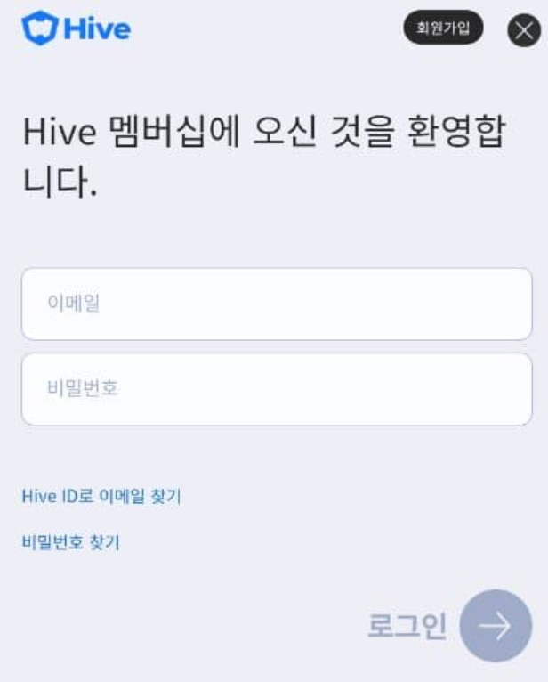
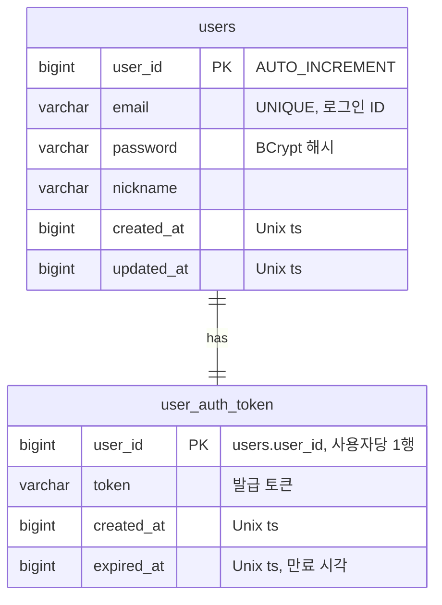

# 계정 / 로그인 기획서

> 상위 문서: [서버 시스템 전체 개요](../서버-시스템-전체-개요.md) · 관련 도메인 4.1
>
> **개발 기준 문서**: 본 로그인 시스템은 [jacking75 — ASP.NET Core API 게임서버 실습 09장](https://github.com/jacking75/programming-books-with-ai/blob/main/ASPNETCore-API_%EA%B2%8C%EC%9E%84%EC%84%9C%EB%B2%84_%EC%8B%A4%EC%8A%B5/09.md)의 구조를 기준으로 개발한다. 아래 명세는 해당 문서의 아키텍처(MySQL + Redis, 계층형 구조, 커스텀 HMAC 토큰)를 본 프로젝트에 맞게 반영한 것이다.

## 목차

- [1. 개요](#1-개요)
- [2. 아키텍처 / 서버 구성](#2-아키텍처--서버-구성)
- [3. 데이터 모델 (ERD)](#3-데이터-모델-erd)
- [4. 토큰 생성 / 검증 방식](#4-토큰-생성--검증-방식)
- [5. API 명세](#5-api-명세)
  - [5.1 회원가입 — `POST /api/auth/signup`](#51-회원가입--post-apiauthsignup)
  - [5.2 로그인 — `POST /api/auth/login`](#52-로그인--post-apiauthlogin)
  - [5.3 로그아웃 — `POST /api/auth/logout`](#53-로그아웃--post-apiauthlogout)
  - [5.4 자동 로그인 검증 — `POST /api/auth/validate`](#54-자동-로그인-검증--post-apiauthvalidate)
  - [5.5 토큰 검증 (인증 미들웨어)](#55-토큰-검증-인증-미들웨어)
- [6. 에러 코드 (신규 제안)](#6-에러-코드-신규-제안)
- [7. 미결 사항 / TODO](#7-미결-사항--todo)
- [8. 참고](#8-참고)


## 1. 개요



- **목적**: 플레이어의 계정 로그인·인증을 제공하고, 로그인 성공 시 인증 토큰을 발급한다. 이 토큰으로 `GameServer` 접근을 인가한다.
- **대상 서버**: `AccountServer`(인증/토큰 발급), `TaskbarHero.Common`(공유 에러 코드/DTO). 토큰 검증은 `GameServer`의 인증 미들웨어에서도 수행.
- **인증 방식**: 기준 문서에 따라 **이메일 + 비밀번호** 로그인을 사용한다.
- **토큰 방식**: JWT가 아닌 **커스텀 HMAC-SHA256 토큰**을 사용한다. `SecretKey`로 서명하여 위변조를 방지하고, 서명 검증만으로 무결성을 확인할 수 있다.
- **세션 정책**: 사용자당 토큰 1개만 유지한다(단일 세션). **다중 기기 로그인은 허용하지 않는다** — 새 로그인이 감지되면 기존에 로그인되어 있던 세션을 무효화한다. 구현상 로그인 시 `user_auth_token`을 UPSERT하고 Redis 토큰값을 새 토큰으로 덮어쓰면, 이전 기기가 갖고 있던 토큰은 Redis 대조에서 불일치하여 자동으로 무효가 된다(다음 요청부터 401).


## 2. 아키텍처 / 서버 구성

기준 문서의 계층형 아키텍처를 따른다.

```
클라이언트 요청
    ↓
AuthController (API 엔드포인트)
    ↓
AuthService (비즈니스 로직)
    ↓
Repository 계층
    ├─ UserRepository        → MySQL (users)
    └─ AuthTokenRepository   → MySQL (user_auth_token) + Redis (캐시)
    ↓
TokenGenerator (HMAC-SHA256 토큰 생성/검증)
```

- **MySQL**: 사용자 정보·토큰의 영속 저장소.
- **Redis**: 토큰 캐싱으로 인증 조회 성능 향상(요청 시 Redis 우선 조회 → 미스 시 MySQL).
- **AccountServer**가 위 로그인/인증을 담당하고, **GameServer**는 인증 미들웨어에서 요청의 `token`을 Redis(`auth:token:{userId}`) 값과 대조해 요청을 인가한다. (서명 재계산 불필요 → SecretKey 미보유)

### 기술 스택 / 주요 NuGet

| 패키지 | 용도 |
|---|---|
| MySqlConnector | MySQL 연결 |
| SqlKata | 쿼리 빌더 |
| CloudStructures | Redis 클라이언트 |
| BCrypt.Net-Next | 비밀번호 해싱 |

> 참고: 본 프로젝트 서버는 `.NET 10`(기준 문서는 .NET 9 이상)이며, `TaskbarHero.Common`은 Unity 호환을 위해 `netstandard2.0`을 유지한다.

## 3. 데이터 모델 (ERD)

`AccountServer` 전용 MySQL 데이터베이스. 시간 값은 기준 문서와 동일하게 **Unix timestamp(BIGINT, 초 단위)**로 저장한다. 비밀번호는 평문이 아닌 **BCrypt 해시**로 저장한다.



- `users.email`에 UNIQUE 인덱스(로그인 ID로 사용), `idx_email` 조회 인덱스.
- `user_auth_token`은 `user_id`가 PK이므로 **사용자당 토큰 1행**만 존재한다. 재로그인 시 UPSERT로 덮어쓴다.
- `user_auth_token`에 `idx_token`, `idx_expired_at` 인덱스(토큰 조회 및 만료 토큰 정리 성능).

### 참고 DDL

```sql
CREATE TABLE users (
    user_id    BIGINT AUTO_INCREMENT PRIMARY KEY,
    email      VARCHAR(100) NOT NULL UNIQUE,
    password   VARCHAR(100) NOT NULL,   -- BCrypt 해시
    nickname   VARCHAR(50)  NOT NULL,
    created_at BIGINT NOT NULL,
    updated_at BIGINT NOT NULL,
    INDEX idx_email (email)
);

CREATE TABLE user_auth_token (
    user_id    BIGINT NOT NULL PRIMARY KEY,
    token      VARCHAR(500) NOT NULL,
    created_at BIGINT NOT NULL,
    expired_at BIGINT NOT NULL,
    INDEX idx_token (token),
    INDEX idx_expired_at (expired_at)
);
```

## 4. 토큰 생성 / 검증 방식

기준 문서의 커스텀 토큰 방식을 따른다. **JWT를 사용하지 않는다.**

### 4.1 생성 (5단계)

1. **Salt 생성**: 16바이트 난수 → Base64
2. **Timestamp 기록**: 현재 Unix timestamp
3. **토큰 데이터 조합**: `tokenData = "{userId}:{timestamp}:{salt}"`
4. **HMAC-SHA256 해싱**: `SecretKey`로 `tokenData` 해싱 → `hash`
5. **최종 인코딩**: `token = Base64("{userId}:{timestamp}:{salt}:{hash}")`

### 4.2 검증

```
Base64 디코딩 → 필드 분리(userId:timestamp:salt:hash)
 → 만료 시각 확인(expired_at) → hash 재계산 → hash 비교
```

위 서명 재계산 검증은 **토큰을 발급하는 `AccountServer`**에서 사용한다(위변조 감지). 반면 **`GameServer`는 SecretKey 없이** 요청의 `token`을 Redis(`auth:token:{userId}`)에 저장된 값과 **대조**하고 존재(만료) 여부만 확인한다. Redis 토큰값이 곧 유효 세션의 단일 기준이므로, 재로그인/로그아웃으로 값이 바뀌거나 삭제되면 이전 토큰은 자동으로 무효가 된다.

### 4.3 설정 / SecretKey 관리 (확정)

**SecretKey는 `AccountServer/appsettings.json`에 로컬 개발용 기본값을 두고, 운영·배포에서는 환경 변수로 덮어쓴다.**

- **로컬/개발**: `appsettings.json`의 `Security:SecretKey`(32바이트 = 64 hex 랜덤). **저장소를 클론하면 그대로 뜬다** — 새 PC에서 손으로 준비할 것이 없게 하는 것이 이 결정의 이유다(부트스트랩 `server_up_with_docker.py`의 준비물 0). 이 값은 로컬 개발 전용이며 실제 계정을 지키는 키가 아니다.
- **운영/배포**: 환경 변수 `Security__SecretKey=<값>`(또는 User Secrets)로 주입한다 — ASP.NET Core 설정 우선순위상 환경 변수가 `appsettings.json`을 이기므로 코드를 고치지 않고 교체된다. 컨테이너로 띄울 때는 저장소 루트 `.env`에 `Security__SecretKey=<값>`을 두면 컴포즈가 전달한다(값이 없으면 전달하지 않으므로 기본값이 그대로 쓰인다).
- **소스에는 넣지 않는다.** 코드가 키를 들고 있으면 어느 배포에서도 바꿀 수 없다. `TokenGenerator`는 출처와 무관하게 `configuration["Security:SecretKey"]`로 읽고, 비어 있으면 기동 시 예외로 알린다.
- SecretKey는 최소 32바이트(256비트) 이상 랜덤 값을 사용한다. 키를 바꾸면 **이미 발급된 토큰만** 무효가 된다(재로그인으로 복구, GameServer는 Redis 대조만 하므로 키를 모른다).

```json
// AccountServer/appsettings.json — 로컬 개발용 기본값(운영은 환경 변수로 덮어쓴다)
"Security": {
  "TokenExpirationHours": 24,
  "SecretKey": "<64 hex>"
}
```

- 만료 시각: `expired_at = created_at + TokenExpirationHours * 3600` (기본 24시간, 잠정값).

## 5. API 명세

**API 목록**

- [5.1 회원가입 — `POST /api/auth/signup`](#51-회원가입--post-apiauthsignup)
- [5.2 로그인 — `POST /api/auth/login`](#52-로그인--post-apiauthlogin)
- [5.3 로그아웃 — `POST /api/auth/logout`](#53-로그아웃--post-apiauthlogout)
- [5.4 자동 로그인 검증 — `POST /api/auth/validate`](#54-자동-로그인-검증--post-apiauthvalidate)
- [5.5 토큰 검증 (인증 미들웨어)](#55-토큰-검증-인증-미들웨어)

Base URL(개발): `http://localhost:5160` (AccountServer)

모든 API는 **POST** 방식이며, 응답에는 **`errorCode`를 포함**한다(`success`, `errorCode`, `userId`/`token` 등, `message`). `errorCode`는 `TaskbarHero.Common`의 `ErrorCode`(6장) 값이고 `success`는 `errorCode == 0`과 동치이며, `message`는 해당 코드의 설명 문구다. (세이브·마스터 기획서와 동일한 응답 규약)

#### 인증 방식 — HTTP Body(JSON)로 토큰 전달 ⭐

기준 문서 10장(인증 미들웨어)을 따라, 인증이 필요한 API는 **`Authorization` 헤더를 사용하지 않는다.** 대신 로그인 이후 모든 요청은 **요청 body(JSON)에 `userId`와 `token`을 함께 포함**한다. 미들웨어가 `Request.Body`를 읽어 인증 정보를 추출한다.

**인증 요청 공통 형식**
```json
{
  "userId": 1,
  "token": "MToxNzAwMDAwMDAwOmFCM2RFNmZHOWhKMWtM...",
  "data": { /* API별 실제 파라미터 */ }
}
```

> 로그인/회원가입은 아직 토큰이 없으므로 이 형식을 적용하지 않는다(이메일·비밀번호를 직접 body에 담는다).

---

### 5.1 회원가입 — `POST /api/auth/signup`

**Request**
```json
{
  "email": "hero@example.com",
  "password": "password123",
  "nickname": "hero"
}
```

**Response (성공, 200 OK)**
```json
{
  "success": true,
  "errorCode": 0,
  "userId": 1,
  "message": "Signup successful"
}
```

**Response (이메일 중복, 409 Conflict)**
```json
{
  "success": false,
  "errorCode": 1003,
  "userId": 0,
  "message": "Duplicate email"
}
```

- 검증: 이메일 형식, 비밀번호 최소 6자. 저장 시 `BCrypt.HashPassword(password)`.

---

### 5.2 로그인 — `POST /api/auth/login`

**Request**
```json
{
  "email": "hero@example.com",
  "password": "password123"
}
```

**Response (성공, 200 OK)**
```json
{
  "success": true,
  "errorCode": 0,
  "userId": 1,
  "token": "MToxNzAwMDAwMDAwOmFCM2RFNmZHOWhKMWtM...",
  "message": "Login successful"
}
```

**Response (비밀번호 오류, 401 Unauthorized)**
```json
{
  "success": false,
  "errorCode": 1002,
  "userId": 0,
  "token": "",
  "message": "Invalid password"
}
```

**Response (계정 없음, 401 Unauthorized)**
```json
{
  "success": false,
  "errorCode": 1001,
  "userId": 0,
  "token": "",
  "message": "User not found"
}
```

#### 로그인 처리 단계

1. **입력 검증** — 이메일 형식, 비밀번호 최소 6자
2. **사용자 조회** — `UserRepository.GetUserByEmailAsync(email)` (MySQL)
3. **비밀번호 검증** — `BCrypt.Verify(password, storedHash)`
4. **토큰 생성** — `TokenGenerator.GenerateToken(userId)`
5. **MySQL 저장** — `AuthTokenRepository.SaveTokenAsync(...)` (UPSERT, 사용자당 1행 → **기존 세션 무효화**)
6. **Redis 캐싱** — `auth:token:{userId}` = token으로 덮어쓰기, TTL 24시간 (이전 기기의 토큰은 이 시점부터 불일치 → 무효)
7. **응답 반환** — 토큰을 클라이언트에 전달

```
클라이언트            AccountServer          MySQL            Redis
   │ 로그인 요청 ───────▶ 사용자 조회 ───────▶               
   │                    ◀── user_id, hash ──               
   │                    [비밀번호 검증][토큰 생성]          
   │                    토큰 저장(UPSERT) ──▶               
   │                    토큰 캐싱 ───────────────────────▶ 
   │ ◀── success, token ─                                  
```

---

### 5.3 로그아웃 — `POST /api/auth/logout`

인증 필요. `userId`, `token`을 body에 포함한다.

**Request**
```json
{
  "userId": 1,
  "token": "MToxNzAwMDAwMDAwOmFCM2RFNmZHOWhKMWtM...",
  "data": {}
}
```

**Response (200 OK)**
```json
{
  "success": true,
  "errorCode": 0,
  "message": "Logout successful"
}
```

- 처리: 서버가 body의 `userId`·`token`을 검증한 뒤 `user_auth_token` 행 삭제 + Redis `auth:token:{userId}` 삭제.
- **토큰 대조 판정은 자동 로그인 검증(5.4)과 동일한 로직을 공유한다** — `userId > 0`·`token` 비어 있지 않음(아니면 `InvalidRequest(1006)`) → Redis 값 없음(`ExpiredToken(1005)`) → 값 불일치(`InvalidToken(1004)`). 통과 이후의 삭제만 로그아웃 고유 처리다.

---

### 5.4 자동 로그인 검증 — `POST /api/auth/validate`

**목적.** 클라이언트가 직전 로그인 세션(`userId`·`token`)을 로컬에 저장해 두고 다음 실행에서 그대로 사용하는 **자동 로그인**을 지원한다. 저장된 토큰은 만료(TTL 24시간)되거나 다른 기기의 로그인으로 밀려나 무효가 될 수 있으므로, **타이틀 화면(TitleScene)이 게임에 진입하기 전에** 이 API로 유효성을 확인하고 실패 시 로그인 입력을 요구한다.

**Request** (인증 — body의 `userId`·`token`)
```json
{
  "userId": 1,
  "token": "MToxNzAwMDAwMDAwOmFCM2RFNmZHOWhKMWtM..."
}
```

**Response (유효, 200 OK)**
```json
{
  "success": true,
  "errorCode": 0,
  "userId": 1,
  "message": "Token is valid"
}
```

**Response (만료·폐기, 401 Unauthorized)**
```json
{
  "success": false,
  "errorCode": 1005,
  "userId": 0,
  "message": "Expired token"
}
```

**Response (다른 기기 로그인으로 밀려남, 401 Unauthorized)**
```json
{
  "success": false,
  "errorCode": 1004,
  "userId": 0,
  "message": "Invalid token"
}
```

#### 처리 단계

1. **입력 검증** — `userId > 0`, `token` 비어 있지 않음. 아니면 `InvalidRequest(1006)`
2. **Redis 조회** — `auth:token:{userId}`
   - 값 없음 → `ExpiredToken(1005)` (TTL 만료 또는 로그아웃으로 폐기)
   - 값 ≠ 요청 토큰 → `InvalidToken(1004)` (다른 기기 로그인이 UPSERT로 덮어씀 — 단일 세션)
3. **성공 응답** — `userId` 회신

MySQL은 조회하지 않는다. **인증의 기준은 Redis 토큰값**이고(5.5), 로그아웃과 완전히 같은 판정이라 서비스 내부에서 하나의 대조 로직을 공유한다.

#### 설계 결정 — 검증만 하고 토큰을 건드리지 않는다

| 결정 | 내용 | 이유 |
|---|---|---|
| **토큰 재발급 안 함** | 응답에 `token` 필드가 없다. 유효하면 클라이언트가 가진 토큰을 계속 쓴다 | 재발급은 MySQL UPSERT + Redis 덮어쓰기를 수반해 **단일 세션 정책상 다른 기기 세션을 끊는다**(5.2 6단계). 검증하려다 세션을 무효화하는 부작용을 만들지 않는다 |
| **TTL 연장 안 함(절대 만료 유지)** | 최초 발급 시각 기준 24시간이 지나면 자동 로그인은 실패하고 재로그인이 필요하다 | 슬라이딩 만료는 토큰 하나가 사실상 무기한 유효해지는 문제가 있어 **연장 상한과 함께 별도로 결정**한다(7장) |
| **MySQL 폴백 없음** | Redis에 값이 없으면 `user_auth_token`을 조회하지 않고 바로 만료로 판정한다 | 현행 인증 체계에서 **Redis가 사실상 정본**이다(5.5). 폴백을 넣으면 "Redis는 캐시, MySQL이 정본"으로 성격이 바뀌므로 함께 결정해야 한다(7장) |

이 결정들의 결과로 **이 API는 상태를 전혀 바꾸지 않는 읽기 전용**이며, 여러 번 호출해도 부작용이 없다.

#### 클라이언트 사용 흐름 (참고)

```
TitleScene 진입
 → 저장된 { userId, token } 있음?
     ├ 없음 → 로그인 화면
     └ 있음 → POST /api/auth/validate
                ├ success        → 저장된 토큰으로 게임 진입(재로그인 없음)
                └ 1004 / 1005    → 저장값 폐기 + 안내 후 로그인 화면
```

> 클라이언트의 토큰 저장 위치·재시도 정책은 클라이언트 측 설계 영역이다. 다만 로컬에 평문 저장되는 값이므로, 노출 시 피해 범위를 만료 시간이 제한한다는 점을 전제로 한다(7장의 만료 정책과 함께 본다).

---

### 5.5 토큰 검증 (인증 미들웨어)

모든 보호 API 요청에서 미들웨어가 토큰을 검증한다. 기준 문서 10장을 따라 **요청 body(JSON)에서 `userId`·`token`을 읽어** 검증한다(헤더 미사용).

```
POST 요청 body(JSON): { userId, token, data }
 → request.EnableBuffering()
 → StreamReader로 Request.Body 읽기 → JsonDocument.Parse
 → root.TryGetProperty("userId"), root.TryGetProperty("token") 로 추출
 → Redis auth:token:{userId} 조회 → 요청 token과 값 일치·존재(만료) 확인
 → 통과 시 userId를 요청 컨텍스트에 주입, 실패 시 401
```

- `Request.Body`는 한 번 읽으면 소비되므로 `EnableBuffering()`으로 되감아 컨트롤러가 다시 읽을 수 있게 한다.
- **인증의 기준은 Redis에 저장된 토큰값**이다. GameServer는 SecretKey 없이 이 값과의 대조만으로 검증하므로 서버 간 키 공유·별도 검증 API 호출이 필요 없다.

> 상세 미들웨어 설계는 기준 문서 10장(인증 미들웨어)에 대응하며, 별도 기획으로 확장할 수 있다.

## 6. 에러 코드 (신규 제안)

`TaskbarHero.Common/ErrorCode.cs`의 `ErrorCode`에 추가 제안. 기존 값(`Success=0`, `UserNotFound=1001`, `InvalidPassword=1002`)과 중복되지 않게 한다. API 응답의 `message`는 아래 코드에 매핑한다.

| 이름 | 값 | 의미 | 매핑 message 예시 |
|---|---|---|---|
| Success | 0 | 성공 (기존) | "Login successful" |
| UserNotFound | 1001 | 계정 없음 (기존) | "User not found" |
| InvalidPassword | 1002 | 비밀번호 불일치 (기존) | "Invalid password" |
| DuplicateEmail | 1003 | 이메일(로그인 ID) 중복 | "Duplicate email" |
| InvalidToken | 1004 | 토큰 무효(서명/형식 오류) | "Invalid token" |
| ExpiredToken | 1005 | 토큰 만료 또는 폐기됨 | "Expired token" |
| InvalidRequest | 1006 | 요청 파라미터 오류(형식/길이) | "Invalid request" |

## 7. 미결 사항 / TODO

- **비밀번호 정책**: 최소 길이 6자는 기준 문서값. 게임 정책에 맞게 확정.
- **토큰 만료 시간**: 기본 24시간(`Security:TokenExpirationHours`)은 잠정값. 방치형 게임 특성(장시간 미접속)을 고려해 확정.
- **만료 토큰 정리**: Redis 키는 TTL로 자동 소멸하지만 **MySQL `user_auth_token` 행은 남는다.** `DELETE FROM user_auth_token WHERE expired_at < UNIX_TIMESTAMP()` 배치 주기 결정.
- **슬라이딩 만료 도입 여부**: 현행은 발급 시각 기준 **절대 만료**라, 매일 접속하는 사용자도 24시간이 지나면 자동 로그인(5.4)이 실패한다. 도입한다면 **연장 상한**(최초 발급 후 N일이 지나면 무조건 재로그인 — 판정에는 `user_auth_token.created_at`을 그대로 쓸 수 있다)을 함께 두어, 토큰 하나가 무기한 유효해지는 상태를 막는다. 상한 없는 무제한 연장은 채택하지 않는다.
- **Redis 유실 시 MySQL 폴백 여부**: 현행은 **Redis가 인증의 정본**이라, Redis가 재시작하면 모든 세션이 끊기고 전원 재로그인이 필요하다. 자동 로그인 검증(5.4)에서 Redis miss 시 `user_auth_token`을 조회해 `expired_at`이 유효하면 Redis에 재적재하는 경로를 두면 복구되지만, 그 순간 **"Redis는 캐시, MySQL이 정본"으로 성격이 바뀐다.** 슬라이딩 만료 도입 시 MySQL `expired_at` 동기화 비용과 함께 한 번에 결정한다.

> **AccountServer ↔ GameServer 간 SecretKey 공유는 불필요하다.** GameServer는 서명을 재계산하지 않고, 요청으로 받은 `token`을 Redis(`auth:token:{userId}`)에 저장된 값과 **대조**하는 것만으로 인증한다. 따라서 SecretKey는 토큰을 발급하는 AccountServer만 보유하면 된다.

## 8. 참고

본 기획서가 기준으로 삼은 문서 (jacking75 — ASP.NET Core API 게임서버 실습).

| 장 | 내용 | 본 문서 반영 부분 |
|---|---|---|
| [08. 커스텀 토큰 인증 설계](https://github.com/jacking75/programming-books-with-ai/blob/main/ASPNETCore-API_%EA%B2%8C%EC%9E%84%EC%84%9C%EB%B2%84_%EC%8B%A4%EC%8A%B5/08.md) | 토큰 생성/검증 전략, **SecretKey 관리 지침**(하드코딩·appsettings.json 직접 저장 금지, 환경 변수/User Secrets 사용, 최소 32바이트) | 4.1 토큰 생성 · 4.3 SecretKey 관리 |
| [09. 로그인 시스템](https://github.com/jacking75/programming-books-with-ai/blob/main/ASPNETCore-API_%EA%B2%8C%EC%9E%84%EC%84%9C%EB%B2%84_%EC%8B%A4%EC%8A%B5/09.md) | MySQL + Redis 계층형 구조, 커스텀 HMAC-SHA256 토큰, `users`/`user_auth_token` 테이블, 단일 세션(토큰 UPSERT) | 2~5장 (아키텍처·ERD·토큰·로그인 API) |
| [10. 인증 미들웨어](https://github.com/jacking75/programming-books-with-ai/blob/main/ASPNETCore-API_%EA%B2%8C%EC%9E%84%EC%84%9C%EB%B2%84_%EC%8B%A4%EC%8A%B5/10.md) | 인증 정보를 HTTP 헤더가 아닌 **요청 body(JSON)**의 `userId`·`token`으로 전달, `Request.Body`를 파싱해 검증 | 5장 인증 방식 · 5.4 토큰 검증 |
