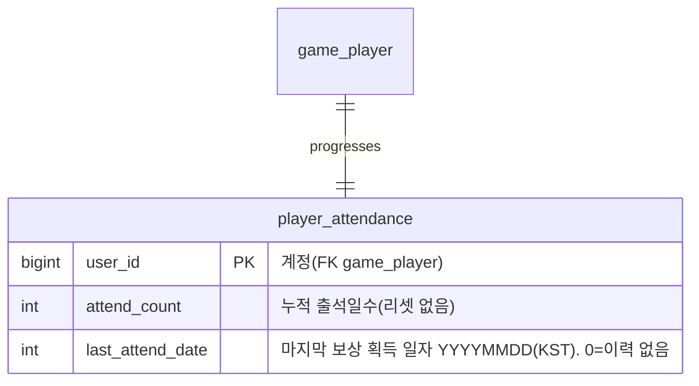

# 출석부 보상 시스템 기획서

> 상위 문서: [서버 시스템 전체 개요](../서버-시스템-전체-개요.md) · 관련 도메인 4.9
>
> 본 문서는 **일차별 접속 보상(출석 체크)**을 서버 권위로 다룬다. 플레이어는 이번달 출석 현황을 조회하고, 하루 1회 오늘자 출석 보상을 획득한다. 보상은 **날짜가 아니라 누적 출석 순번(일차)** 으로 결정되며 — **첫 출석은 1일차 보상부터**, 다음 출석은 2일차… **30일차**까지 순서대로 받고, **30일차를 모두 받으면 다시 1일차부터 순환**한다(보상이 끊기지 않는다). **보상은 즉시 계정에 지급하지 않고 [메일(4.8)](mail-기획서.md)로 발급**하며, 실제 재화·아이템 반영은 메일 수령 시 이루어진다.

## 목차

- [1. 개요](#1-개요)
- [2. 기능 설명](#2-기능-설명)
- [3. 요구사항](#3-요구사항)
- [4. 데이터 모델](#4-데이터-모델)
- [5. API 명세](#5-api-명세)
  - [5.1 이번달 출석 현황 조회 — `POST /api/game/attendance/status`](#51-이번달-출석-현황-조회--post-apigameattendancestatus)
  - [5.2 출석 보상 획득 — `POST /api/game/attendance/claim`](#52-출석-보상-획득--post-apigameattendanceclaim)
- [6. 처리 흐름](#6-처리-흐름)
- [7. 에러 코드](#7-에러-코드)
- [8. 미결 사항 / TODO](#8-미결-사항--todo)
- [9. 참고](#9-참고)


## 1. 개요


- **목적**: 방치형 게임의 리텐션 장치로, 매일 접속한 플레이어에게 **일차별 출석 보상**을 준다. 하루 1회 수령·날짜 경계·월 리셋·**일차 산출**을 **서버가 판정**해 클라이언트 조작(중복 수령·날짜 위조)을 막는다. 보상은 우편함으로 발급해 지급-수령 원장을 메일 시스템이 관리하게 한다.
- **일차 = 누적 출석 순번**: 보상 일차는 **날짜(day-of-month)가 아니라 몇 번째 출석인지**로 정한다. 7월 28일에 처음 접속했다면 28일차가 아니라 **1일차 보상**을 받고, 다음 출석일에 2일차를 받는다. 월중 유입·중간 이탈 플레이어도 보상 사다리를 처음부터 밟게 해 초반 보상 손실을 없앤다.
- **대상 서버**: `GameServer`(출석 상태 관리·검증, 보상 메일 발급), `TaskbarHero.Common`(출석 현황·결과 DTO·에러 코드 공유). 인증은 AccountServer 발급 토큰을 GameServer 미들웨어가 검증.
- **범위 경계**:
  - **보상의 실제 지급(재화·아이템 계정 반영)은 본 문서 밖**이다. 출석 보상은 **메일 발급**으로 위임하며([메일 기획서](mail-기획서.md)), 플레이어가 우편함에서 첨부를 수령할 때 계정에 반영된다. 본 문서는 "출석 판정 + 보상 메일 발급"까지 책임진다.
  - **일차별 보상 내용(무엇을 얼마나)**은 마스터 데이터(`attendance_master`, 1~30일차)가 정의한다([마스터 데이터 기획서](master-data/master-data-기획서.md)).
- **관련 기획서**: [[mail-기획서]] (보상 메일 발급·수령), [[save-data-기획서]] (출석 기록 저장), [[master-data-기획서]] (`attendance_master`), [[서버-시스템-전체-개요]] (도메인 4.9)

## 2. 기능 설명

- **출석 현황 조회**: 클라이언트가 출석 달력을 그리기 위해, **1~30일차** 각 일차의 보상 정의와 **현재 회차의 수령 여부**, 누적 출석일수, 오늘 받게 될 일차·오늘 수령 가능 여부를 받는다.
- **출석 보상 획득**: 플레이어가 오늘자 출석 보상을 요청하면, 서버가 **오늘 미수령**임을 확인하고 **누적 출석일수 + 1**로 진행도를 올리며 그 일차의 보상을 **메일로 발급**한다. 하루 1회만 가능하다.
- **일차 진행**: 일차는 **순차적으로만** 올라간다. 하루 걸렀다고 일차가 건너뛰지 않으며(3일차 수령 후 일주일 쉬어도 다음 출석은 4일차), 놓친 일차가 사라지지도 않는다.
- **사다리 순환(확정)**: **30일차까지 모두 받은 뒤 다시 출석하면 1일차 보상부터 새 회차를 시작한다.** 즉 사다리는 30일 주기로 순환하며, 출석 가능한 날에 보상을 못 받는 경우는 없다(오늘 이미 수령한 경우만 거부).
- **날짜 경계**: 출석 일자는 **서버 기준 KST(UTC+9) 자정**으로 나뉜다. 수령은 **오늘 1회**만 대상으로 한다(놓친 과거일 소급 수령은 제공하지 않는다).
- **월 리셋 없음(확정)**: 출석 진행도는 **달이 바뀌어도 리셋되지 않는다.** 진행 리셋 장치는 **30일 순환 하나로 통일**한다 — 월 리셋을 함께 두면 월말에 진행 중인 회차가 버려져(예: 20일차까지 받고 달이 바뀌면 21~30일차를 못 받고 1일차로) 후반 보상(15일차 강철 투구·30일차 코스믹 투구)을 놓치게 되고, "출석하면 끊김 없이 순서대로 받는다"는 순환의 취지와 어긋난다.

> 방치형 특성상 클라이언트가 오래 백그라운드로 떠 있을 수 있으므로, "오늘"의 판정은 **요청 수신 시점의 서버 시각**을 기준으로 하며 클라이언트가 보낸 날짜/시각은 신뢰하지 않는다.

## 3. 요구사항

**기능 요구사항**
- 출석 현황 조회, 오늘자 출석 보상 획득을 제공한다.
- 보상 **일차는 `누적 출석일수 % 30 + 1`** 로 서버가 산출한다(날짜와 무관 — 첫 출석은 항상 1일차, 30일차 다음은 다시 1일차). **월 경계는 산출에 관여하지 않는다.**
- 출석 보상 내용은 `attendance_master`(1~30일차)가 정의한 값을 **서버가 확정**한다(클라이언트 입력 없음).
- 오늘자 출석은 **하루 1회**만 가능하다(중복 수령 거부).
- 사다리 소진으로 인한 거부는 **없다** — 30일차까지 모두 받아도 다음 출석은 1일차 보상으로 순환한다.
- 획득한 보상은 **메일로 발급**한다([메일 기획서](mail-기획서.md) `player_mail`·`player_mail_reward`, `category=3`(출석)). 발급 메일은 **출석 시점으로부터 7일 후 만료**된다.

**비기능 요구사항**
- **서버 권위**: "오늘" 판정·일차 산출·일차별 보상은 서버가 정한다. 클라이언트가 보고한 날짜/일차/보상을 신뢰하지 않는다.
- **원자성·멱등성**: "진행도 관측 + 일차 산출 + 진행도 갱신 + 보상 메일 발급"은 하나의 트랜잭션으로 처리한다. 진행도 갱신은 **`last_attend_date`가 관측값일 때만 전이하는 조건부 갱신(CAS)** 으로 수행해, 동일 요청 재전송·동시 요청 시 이중 발급을 막는다(0행이면 이미 처리된 것 → 거부).
- **타임존 고정**: 날짜 경계는 KST(UTC+9) 자정으로 고정한다. 저장 시각은 프로젝트 공통 규약대로 Unix timestamp(BIGINT, 초)를 쓰되, 출석 "일자"는 KST 기준 `YYYYMMDD`로 산출한다.

## 4. 데이터 모델

**새 세이브 테이블 1개**(`player_attendance`)와 **새 마스터 테이블 1개**(`attendance_master`)를 요구한다. 보상 지급 자체는 기존 메일 테이블(`player_mail`·`player_mail_reward`)을 재사용한다.



| 테이블 | 역할 | 참조 |
|---|---|---|
| `player_attendance`(`user_id` PK) | 계정별 **출석 진행도 1행**(누적 출석일수 + 마지막 획득 일자) | — |
| `attendance_master`(`day` PK) | **일차별 보상 정의**(출석 순번 1~30) | `item_master`(아이템/재료) |

- **계정당 1행**: 출석할 때마다 행을 쌓지 않고 **카운터를 +1** 한다. 행은 **캐릭터 생성 시 함께 생성**(`attend_count=0`, `last_attend_date=0`)되므로, 행이 없다면 계정 세이브가 없는 것이다(`SaveNotFound(2001)`).
- **두 컬럼이 모든 판정 근거**: `attend_count`로 일차를 산출하고(`% 30 + 1`), `last_attend_date`로 오늘 중복 수령을 판정하며 동시 요청 CAS 조건으로도 쓴다. **회차(몇 번째 순환인지)는 저장하지 않는다** — `(attend_count - 1) / 30 + 1`로 파생된다.
- **출석 이력은 이 테이블이 갖지 않는다**: 어느 날짜에 출석했는지는 별도 이력 로그의 책임이다(본 문서 범위 밖). 이 테이블은 보상 지급 판정에 필요한 최소 상태만 갖는다.
- **일차별 보상(`attendance_master`)**: `day`(1~30, **출석 순번** — 날짜가 아님)별로 `reward_type`(1:골드 2:아이템 3:재료)·`reward_code`(골드면 0)·`quantity`를 정의한다. `reward_type`/`reward_code` 규약은 [메일 기획서](mail-기획서.md) 4장 첨부 규칙과 동일하다(값 변경 금지 enum 공유).
- **보상 지급은 메일로**: 출석 획득 시 서버가 `player_mail`(1건, `category=3`)과 `player_mail_reward`(그 일차 보상 1건)를 생성한다. 실제 재화·아이템은 플레이어가 우편함에서 수령(`/api/game/mail/claim`)할 때 계정(`player_item`)에 반영된다.

**공유 enum / DTO (TaskbarHero.Common)**
- `reward_type`(1:골드 2:아이템 3:재료)은 메일·인벤토리·마스터 데이터와 동일 값으로 고정한다.
- 출석 현황·획득 결과 DTO는 `TaskbarHero.Common`에 공유 DTO로 두는 것을 **제안**한다(5장 응답 스키마).

## 5. API 명세

**API 목록**

- [5.1 이번달 출석 현황 조회 — `POST /api/game/attendance/status`](#51-이번달-출석-현황-조회--post-apigameattendancestatus)
- [5.2 출석 보상 획득 — `POST /api/game/attendance/claim`](#52-출석-보상-획득--post-apigameattendanceclaim)

Base URL(개발): `http://localhost:5247` (GameServer). 모든 API는 **POST**, 인증 요청 공통 형식 `{ userId, token, data }`, 응답 `{ success, errorCode, message, data }`([세이브 데이터 기획서](save-data-기획서.md) 5장과 동일 규약).

### 5.1 출석 현황 조회 — `POST /api/game/attendance/status`

출석 진행도와 **1~30일차 보상 사다리**를 반환한다. 조회는 상태를 바꾸지 않는다(출석 처리 아님).

**Request**
```json
{ "userId": 1, "token": "...", "data": {} }
```

**Response (성공, 200 OK)** — 7월 28일에 두 번째로 접속(1일차 수령 완료, 오늘 미수령)한 예:
```json
{
  "success": true,
  "errorCode": 0,
  "message": "OK",
  "data": {
    "yearMonth": 202607,
    "today": 20260728,
    "attendedCount": 1,
    "todayDay": 2,
    "todayClaimed": false,
    "canClaim": true,
    "days": [
      { "day": 1, "rewardType": 1, "rewardCode": 0,     "quantity": 1000, "claimed": true },
      { "day": 2, "rewardType": 1, "rewardCode": 0,     "quantity": 1500, "claimed": false },
      { "day": 3, "rewardType": 3, "rewardCode": 41001, "quantity": 3,    "claimed": false }
    ]
  }
}
```

| 필드 | 의미 |
|---|---|
| `yearMonth` / `today` | 서버가 판정한 현재 연월(YYYYMM)·오늘(YYYYMMDD), KST 기준. `yearMonth`는 **표시용**이며 진행도 산출에 쓰이지 않는다(월 리셋 없음) |
| `attendedCount` | **누적 출석일수**(리셋 없음). 30을 넘어 계속 증가한다 |
| `todayDay` | 오늘 해당하는 일차(1~30). 오늘 미수령이면 `attendedCount % 30 + 1`, 이미 수령했으면 오늘 받은 일차 |
| `todayClaimed` | 오늘자 출석을 이미 수령했는지 |
| `canClaim` | 오늘 수령 가능 여부(`!todayClaimed`). 클라이언트 수령 버튼 활성 조건 |
| `days[]` | `attendance_master` **전체 1~30일차**의 보상과, **현재 회차에서의** 수령 여부. `claimed = (day <= 현재 회차 진행도)` — 앞에서부터 순서대로 채워지고, 새 회차가 시작되면 다시 1일차부터 비워진다 |

- **현재 회차 진행도** = `attendedCount == 0 ? 0 : (attendedCount - 1) % 30 + 1`. 30번째 출석 시점에는 30(전부 수령 표시)이고, 31번째 출석 시점에는 1(새 회차 1일차만 수령)이다.
- **회차 번호** = `(attendedCount - 1) / 30 + 1`. 예) 누적 47이면 2회차 17일 진행(`todayDay=18`).
- **회차 번호**는 별도 필드로 내리지 않는다. 클라이언트가 필요하면 `(attendedCount - 1) / days.length + 1`로 파생한다(사다리 길이는 `days.length`).
- 세이브(진행도 행)가 없어도 빈 진행도(`attendedCount=0`, `todayDay=1`)로 정상 응답한다.
- 오류: 마스터 미로드 시 `MasterDataNotLoaded(10001)`.

### 5.2 출석 보상 획득 — `POST /api/game/attendance/claim`

오늘자 출석 보상을 받는다. 서버가 오늘 미수령을 확인하고, **누적 출석일수 + 1**로 진행도를 올리며 그 일차의 보상을 **메일로 발급**한다(즉시 계정 지급 아님).

**Request**
```json
{ "userId": 1, "token": "...", "data": {} }
```

**Response (성공, 200 OK)** — 7월 28일에 첫 출석 → **1일차** 보상:
```json
{
  "success": true,
  "errorCode": 0,
  "message": "Attended",
  "data": {
    "attendDate": 20260728,
    "day": 1,
    "reward": { "rewardType": 1, "rewardCode": 0, "quantity": 1000 },
    "mailId": 8123
  }
}
```

- `attendDate`: 출석한 **날짜**(YYYYMMDD). `day`: 이번에 받은 **일차**(1~30). 이 둘은 서로 무관하다(28일에 1일차 수령 가능).
- `reward`: 이번에 발급된 보상(서버 산출). `mailId`: 발급된 보상 메일. 실제 재화·아이템은 **우편함에서 수령**해야 계정에 반영된다([메일 기획서](mail-기획서.md) 5.2).
- 오류: `AttendanceAlreadyClaimed(9001)`(오늘 이미 수령), `SaveNotFound(2001)`(캐릭터 생성 전 — 계정 세이브 없음), 마스터 미로드 시 `MasterDataNotLoaded(10001)`. **사다리 소진으로 인한 실패는 없다**(순환).

> 인증 오류(401) 등은 기존 미들웨어를 따른다. 수령은 오늘 1회만 대상이며, 지난달 조회·과거일 소급 수령은 제공하지 않는다.

## 6. 처리 흐름

### 6.1 출석 보상 획득 (의사코드)

```
요청 수신 → 토큰 검증(미들웨어)
now   = 서버 현재 시각
today = KST(now) → YYYYMMDD            # 서버 권위 날짜 판정
maxDay = attendance_master의 최대 day (= 30)
if maxDay <= 0: MasterDataNotLoaded(10001)                      # 사다리 자체가 비어 있음(마스터 결함)
트랜잭션(BEGIN)
  1) row = SELECT attend_count, last_attend_date FROM player_attendance WHERE user_id = ?
     if row 없음: SaveNotFound(2001)                            # 캐릭터 생성 전(행은 캐릭터 생성 시 함께 생성)
  2) if row.last_attend_date == today: AttendanceAlreadyClaimed(9001)
  3) newCount = row.attend_count + 1
     day      = (newCount - 1) % maxDay + 1                     # ★ 일차 = 순번(날짜 아님) + 30일 주기 순환
  4) reward = attendance_master[day]                            # 없으면 MasterDataNotLoaded(10001)
  5) UPDATE player_attendance SET attend_count = newCount, last_attend_date = today
      WHERE user_id = ? AND last_attend_date = row.last_attend_date   # ★ CAS(관측값 조건부)
     if 0행: AttendanceAlreadyClaimed(9001)                     # 동시 요청이 먼저 처리
  6) 보상 메일 발급:
       INSERT player_mail(user_id, category=3, title/body, created_at=now, expires_at=now+7일, claimed=0)
       INSERT player_mail_reward(mail_id, seq=1, reward_type, reward_code, quantity)  # reward 기준
COMMIT → { attendDate: today, day, reward, mailId }
```

- **5)의 조건부 갱신이 중복 발급을 막는 핵심 게이트다.** 관측(1)과 갱신(5) 사이에 다른 요청이 먼저 처리하면 `last_attend_date`가 달라져 0행이 되고, 그 요청은 보상을 받지 못한다(이미 오늘 받은 상태이므로 정상 동작).
- 실제 재화·아이템 지급은 여기서 하지 않는다. 플레이어가 우편함에서 수령할 때 반영된다(메일 6.1).
- 발급 메일의 만료는 **출석 시점(발급)으로부터 7일**로 확정한다(`expires_at = created_at + 7일`). 7일 안에 우편함에서 수령하지 않으면 만료되어 수령할 수 없다([메일 기획서](mail-기획서.md) 만료 규칙).


### 6.2 예외 / 엣지 케이스

- **하루 중복 수령**: `last_attend_date == today`면 `AttendanceAlreadyClaimed(9001)`. 같은 날 동시 요청은 조건부 갱신(0행 → 경합 패배)으로 직렬화해 이중 발급을 막는다.
- **월중 첫 접속**: 7월 28일에 처음 접속해도 `attend_count=0 → day=1`이라 **1일차 보상**을 받는다(날짜와 무관).
- **띄엄띄엄 출석**: 하루 걸러도 일차는 건너뛰지 않는다. 3일차까지 받고 일주일 쉬었다면 다음 출석은 **4일차**다.
- **사다리 순환(30일차 완료 후)**: `count=30`이면 다음 일차는 `30 % 30 + 1 = 1`이라 **1일차 보상을 다시 받는다**(새 회차 시작). 31일이 있는 달에 하루도 빠짐없이 출석하면 마지막 하루가 여기에 해당한다.
  - 아직 수령 전(`count=30`, 오늘 미수령): `todayDay=1`·`canClaim=true`, `days[]`는 **전부 `claimed=true`**(직전 회차를 다 채운 상태 — 회차는 수령하는 순간 넘어간다).
  - 수령 직후(`count=31`, 오늘 수령): `todayDay=1`, `days[]`는 1일차만 `claimed=true`로 **새 회차가 시작된 모습**이 된다.
  - 월이 바뀌어도 진행도는 그대로 이어진다(월 리셋 없음).
- **자정 경계 요청**: "오늘"은 요청 수신 시점 서버 KST 기준으로 판정한다. 클라이언트가 보낸 날짜는 무시한다. 자정을 사이에 둔 서로 다른 날짜의 동시 요청은 PK가 막지 못하지만, 일차 집계를 같은 트랜잭션에서 수행하므로 실질적으로 직렬화된다(프로젝트 공통 정책상 `game_player` 행 잠금은 걸지 않는다 — `StageRepository`와 동일).
- **월 경계**: 진행도에 아무 영향이 없다. `attend_count`는 계속 누적되고 사다리는 30일 주기로만 순환한다. 놓친 일차는 소급 수령할 수 없다.
- **마스터 미정의 일차**: 산출된 `day`가 `attendance_master`에 없으면 `MasterDataNotLoaded(10001)`로 거부한다(정상 운영에선 1~30 전부 정의).
- **캐릭터 생성 전 수령 시도**: 진행도 행은 **캐릭터 생성 트랜잭션에서 함께 생성**되므로, 행이 없으면 캐릭터 생성 전이다. 트랜잭션 첫 단계의 조회에서 `SaveNotFound(2001)`로 거부한다(다른 게임 API와 동일 규약). 현황 조회(5.1)는 행이 없어도 빈 진행도를 정상 반환한다.

## 7. 에러 코드

`TaskbarHero.Common`의 `ErrorCode`에 추가 제안. 도메인 4.9(출석부)은 **9000번대**를 사용한다([통합 정의](../공통/error-code-정의.md) 블록 규약, 도메인 4.N → N000). 추가 시 통합 문서도 함께 갱신한다.

| 이름 | 값 | 의미 |
|---|---|---|
| AttendanceAlreadyClaimed | 9001 | 오늘자 출석 보상을 이미 수령함 |

- **`9002`는 결번**이다. 사다리 소진(`AttendanceAllClaimed`)은 순환 도입으로 발생하지 않게 되어 코드를 제거했으며, **다른 의미로 재사용하지 않는다**(클라이언트와 공유하는 번호 계약 보호).
- 마스터 데이터 미로드/미정의는 신규 코드 없이 `MasterDataNotLoaded(10001)`([마스터 데이터 기획서](master-data/master-data-기획서.md))를 재사용한다.
- 계정 세이브(`game_player`) 미생성도 신규 코드 없이 `SaveNotFound(2001)`([세이브 데이터 기획서](save-data-기획서.md))을 재사용한다.

## 8. 미결 사항 / TODO

미결 사항 없음 — 전부 확정되었다.

> **범위에서 제외(구현 안 함)**: 연속 출석 보너스, 과거일 소급 수령, 출석 이력(일자별) 조회·저장, 회차별 보상 차등(2회차 이후에도 1회차와 동일한 보상을 준다).
> **확정 사항**: 보상 일차는 **날짜가 아닌 누적 출석 순번**(첫 출석 = 1일차), 사다리 길이는 **30일차**이며 **30일차 이후 1일차부터 순환**한다(`day = 누적 출석일수 % 30 + 1`). **월 리셋은 없다**(진행 리셋은 30일 순환으로 통일). 진행도는 `player_attendance` **계정당 1행**(누적 카운터 + 마지막 획득 일자)으로 저장하며, 출석 이력(어느 날짜에 출석했는지)은 **별도 이력 로그의 책임**으로 분리한다. 날짜 경계 타임존은 **KST(UTC+9)**, 출석 보상 메일 만료는 **발급(출석) 시점으로부터 7일**. **일차별 보상 구성**은 [마스터 데이터 값 문서 §13](master-data/master-data-값.md#13-attendance_master-출석부-보상)에 1~30일차 전부 확정(평일 골드, 주간 마일스톤 7·14·21·28일차 상급 재료 강화, 15일차 강철 투구·30일차 코스믹 투구 장비 — DDL·시드는 [`master-data-schema.sql`](master-data/master-data-schema.sql) 13번).

## 9. 참고

- [서버 시스템 전체 개요](../서버-시스템-전체-개요.md) — 도메인 4.9(출석부), 4.8(메일)
- [메일 기획서](mail-기획서.md) — 보상 메일 발급·수령(`player_mail`·`player_mail_reward`, `category=3`)
- [세이브 데이터 기획서](save-data-기획서.md) — `player_attendance` 저장 골격
- [마스터 데이터 기획서](master-data/master-data-기획서.md) — `attendance_master` 일자별 보상 정의
- [ErrorCode 통합 정의](../공통/error-code-정의.md) — 에러 코드 블록 규약(9000번대 출석부)
