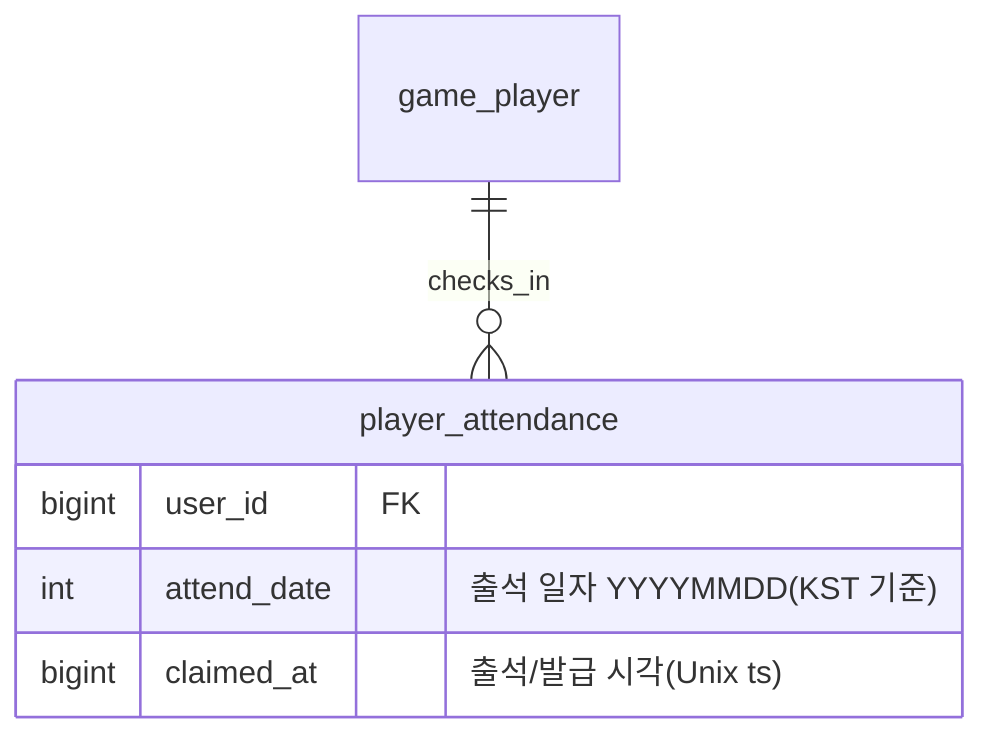

# 출석부 보상 시스템 기획서

> 상위 문서: [서버 시스템 전체 개요](../공통/서버-시스템-전체-개요.md) · 관련 도메인 4.10
>
> 본 문서는 **일자별 접속 보상(출석 체크)**을 서버 권위로 다룬다. 플레이어는 이번달 출석 현황을 조회하고, 하루 1회 오늘자 출석 보상을 획득한다. **보상은 즉시 계정에 지급하지 않고 [메일(4.9)](mail-기획서.md)로 발급**하며, 실제 재화·아이템 반영은 메일 수령 시 이루어진다.

## 1. 개요

- **목적**: 방치형 게임의 리텐션 장치로, 매일 접속한 플레이어에게 **일자별 출석 보상**을 준다. 하루 1회 수령·날짜 경계·월 리셋을 **서버가 판정**해 클라이언트 조작(중복 수령·날짜 위조)을 막는다. 보상은 우편함으로 발급해 지급-수령 원장을 메일 시스템이 관리하게 한다.
- **대상 서버**: `GameServer`(출석 상태 관리·검증, 보상 메일 발급), `TaskbarHero.Common`(출석 현황·결과 DTO·에러 코드 공유). 인증은 AccountServer 발급 토큰을 GameServer 미들웨어가 검증.
- **범위 경계**:
  - **보상의 실제 지급(재화·아이템 계정 반영)은 본 문서 밖**이다. 출석 보상은 **메일 발급**으로 위임하며([메일 기획서](mail-기획서.md)), 플레이어가 우편함에서 첨부를 수령할 때 계정에 반영된다. 본 문서는 "출석 판정 + 보상 메일 발급"까지 책임진다.
  - **일자별 보상 내용(무엇을 얼마나)**은 마스터 데이터(`attendance_master`)가 정의한다([마스터 데이터 기획서](master-data-기획서.md)).
- **관련 기획서**: [[mail-기획서]] (보상 메일 발급·수령), [[save-data-기획서]] (출석 기록 저장), [[master-data-기획서]] (`attendance_master`), [[서버-시스템-전체-개요]] (도메인 4.10)

## 2. 기능 설명

- **이번달 출석 현황 조회**: 클라이언트가 이번달 출석 달력을 그리기 위해, 이달 각 일자의 보상 정의와 **수령 여부**, 오늘 날짜·오늘 수령 가능 여부를 받는다.
- **출석 보상 획득**: 플레이어가 오늘자 출석 보상을 요청하면, 서버가 **오늘 미수령**임을 확인하고 출석 기록을 남긴 뒤 그날의 보상을 **메일로 발급**한다. 하루 1회만 가능하다.
- **날짜 경계·월 리셋**: 출석 일자는 **서버 기준 KST(UTC+9) 자정**으로 나뉜다. 출석 현황은 **월 단위**이며, 달이 바뀌면 이번달 달력으로 초기화된다. 조회·수령은 **이번달·오늘만** 대상으로 한다(다른 달 조회, 놓친 과거일 소급 수령은 제공하지 않는다).

> 방치형 특성상 클라이언트가 오래 백그라운드로 떠 있을 수 있으므로, "오늘"의 판정은 **요청 수신 시점의 서버 시각**을 기준으로 하며 클라이언트가 보낸 날짜/시각은 신뢰하지 않는다.

## 3. 요구사항

**기능 요구사항**
- 이번달 출석 현황 조회, 오늘자 출석 보상 획득을 제공한다.
- 출석 보상 내용은 `attendance_master`가 정의한 값을 **서버가 확정**한다(클라이언트 입력 없음).
- 오늘자 출석은 **하루 1회**만 가능하다(중복 수령 거부).
- 획득한 보상은 **메일로 발급**한다([메일 기획서](mail-기획서.md) `player_mail`·`player_mail_reward`, `category=3`(출석)). 발급 메일은 **출석 시점으로부터 7일 후 만료**된다.

**비기능 요구사항**
- **서버 권위**: "오늘" 판정·일자별 보상은 서버가 정한다. 클라이언트가 보고한 날짜/보상을 신뢰하지 않는다.
- **원자성·멱등성**: "출석 기록 삽입 + 보상 메일 발급"은 하나의 트랜잭션으로 처리한다. `(user_id, attend_date)`에 유니크 제약을 두어 동일 요청 재전송·동시 요청 시 이중 발급을 막는다(이미 출석이면 거부).
- **타임존 고정**: 날짜 경계는 KST(UTC+9) 자정으로 고정한다. 저장 시각은 프로젝트 공통 규약대로 Unix timestamp(BIGINT, 초)를 쓰되, 출석 "일자"는 KST 기준 `YYYYMMDD`로 산출한다.

## 4. 데이터 모델

**새 세이브 테이블 1개**(`player_attendance`)와 **새 마스터 테이블 1개**(`attendance_master`)를 요구한다. 보상 지급 자체는 기존 메일 테이블(`player_mail`·`player_mail_reward`)을 재사용한다.



| 테이블 | 역할 | 참조 |
|---|---|---|
| `player_attendance`(`(user_id, attend_date)` PK) | 계정별 **출석한 일자** 기록(행 존재 = 그날 수령함) | — |
| `attendance_master`(`day` PK) | 이달 **일자별 보상 정의**(day-of-month 1~31) | `item_master`(아이템/재료) |

- **출석 = 행 1개**: 플레이어가 오늘 출석 보상을 받으면 `(user_id, 오늘 YYYYMMDD)` 행이 1개 생긴다. 그날 이미 행이 있으면 중복 수령이다. 이번달 현황은 `attend_date`가 이달 범위인 행들을 조회해 구성한다.
- **일자별 보상(`attendance_master`)**: `day`(1~31, 이달 며칠차)별로 `reward_type`(1:골드 2:아이템 3:재료)·`reward_code`(골드면 0)·`quantity`를 정의한다. `reward_type`/`reward_code` 규약은 [메일 기획서](mail-기획서.md) 4장 첨부 규칙과 동일하다(값 변경 금지 enum 공유).
- **보상 지급은 메일로**: 출석 획득 시 서버가 `player_mail`(1건, `category=3`)과 `player_mail_reward`(그날 보상 1건)를 생성한다. 실제 재화·아이템은 플레이어가 우편함에서 수령(`/api/game/mail/claim`)할 때 계정(`player_item`)에 반영된다.

**공유 enum / DTO (TaskbarHero.Common)**
- `reward_type`(1:골드 2:아이템 3:재료)은 메일·인벤토리·마스터 데이터와 동일 값으로 고정한다.
- 출석 현황·획득 결과 DTO는 `TaskbarHero.Common`에 공유 DTO로 두는 것을 **제안**한다(5장 응답 스키마).

## 5. API 명세

Base URL(개발): `http://localhost:5247` (GameServer). 모든 API는 **POST**, 인증 요청 공통 형식 `{ userId, token, data }`, 응답 `{ success, errorCode, message, data }`([세이브 데이터 기획서](save-data-기획서.md) 5장과 동일 규약).

### 5.1 이번달 출석 현황 조회 — `POST /api/game/attendance/status`

이번달(서버 KST 기준) 출석 달력을 반환한다. 조회는 상태를 바꾸지 않는다(출석 처리 아님).

**Request**
```json
{ "userId": 1, "token": "...", "data": {} }
```

**Response (성공, 200 OK)**
```json
{
  "success": true,
  "errorCode": 0,
  "message": "OK",
  "data": {
    "yearMonth": 202607,
    "today": 20260715,
    "todayDay": 15,
    "todayClaimed": false,
    "days": [
      { "day": 1,  "rewardType": 1, "rewardCode": 0,     "quantity": 1000, "claimed": true },
      { "day": 15, "rewardType": 2, "rewardCode": 41001, "quantity": 5,    "claimed": false }
    ]
  }
}
```

- `yearMonth`/`today`: 서버가 판정한 이번달·오늘(KST). `todayClaimed`: 오늘자 출석을 이미 수령했는지. `days`: 이달 정의된 각 일자의 보상과 수령 여부(`claimed`).
- 오류: 마스터 미로드 시 `MasterDataNotLoaded(11001)`.

### 5.2 출석 보상 획득 — `POST /api/game/attendance/claim`

오늘자 출석 보상을 받는다. 서버가 오늘 미수령을 확인하고 출석 기록을 남긴 뒤, 그날의 보상을 **메일로 발급**한다(즉시 계정 지급 아님).

**Request**
```json
{ "userId": 1, "token": "...", "data": {} }
```

**Response (성공, 200 OK)**
```json
{
  "success": true,
  "errorCode": 0,
  "message": "Attended",
  "data": {
    "attendDate": 20260715,
    "day": 15,
    "reward": { "rewardType": 2, "rewardCode": 41001, "quantity": 5 },
    "mailId": 8123
  }
}
```

- `reward`: 이번에 발급된 보상(서버 산출). `mailId`: 발급된 보상 메일. 실제 재화·아이템은 **우편함에서 수령**해야 계정에 반영된다([메일 기획서](mail-기획서.md) 5.2).
- 오류: `AttendanceAlreadyClaimed(10001)`(오늘 이미 수령), 마스터 미로드 시 `MasterDataNotLoaded(11001)`.

> 인증 오류(401) 등은 기존 미들웨어를 따른다. 조회·수령은 이번달·오늘만 대상이며, 다른 달 조회·과거일 소급 수령은 제공하지 않는다.

## 6. 처리 흐름

### 6.1 출석 보상 획득 (의사코드)

```
요청 수신 → 토큰 검증(미들웨어)
now = 서버 현재 시각
today = KST(now) → YYYYMMDD            # 서버 권위 날짜 판정
day   = today의 일(day-of-month)
트랜잭션(BEGIN, user_id 잠금)
  1) reward = attendance_master[day]                 # 없으면 MasterDataNotLoaded(11001)
  2) if player_attendance[user_id, today] 존재: AttendanceAlreadyClaimed(10001)
  3) INSERT player_attendance(user_id, today, claimed_at=now)   # 유니크 (user_id, attend_date)
  4) 보상 메일 발급:
       INSERT player_mail(user_id, category=3, title/body, created_at=now, expires_at=now+7일, claimed=0)
       INSERT player_mail_reward(mail_id, seq=1, reward_type, reward_code, quantity)  # reward 기준
COMMIT → { attendDate: today, day, reward, mailId }
```

- 실제 재화·아이템 지급은 여기서 하지 않는다. 플레이어가 우편함에서 수령할 때 반영된다(메일 6.1).
- 발급 메일의 만료는 **출석 시점(발급)으로부터 7일**로 확정한다(`expires_at = created_at + 7일`). 7일 안에 우편함에서 수령하지 않으면 만료되어 수령할 수 없다([메일 기획서](mail-기획서.md) 만료 규칙).

### 6.2 예외 / 엣지 케이스

- **하루 중복 수령**: `(user_id, today)` 행이 이미 있으면 `AttendanceAlreadyClaimed(10001)`. 유니크 제약 + 행 잠금으로 동시 요청을 직렬화해 이중 발급을 막는다.
- **자정 경계 요청**: "오늘"은 요청 수신 시점 서버 KST 기준으로 판정한다. 클라이언트가 보낸 날짜는 무시한다.
- **월 리셋**: 달이 바뀌면 이번달 현황은 빈 달력으로 시작한다(과거 달 `player_attendance` 행은 유지되나 조회·수령 대상은 아니다). 놓친 과거 일자는 소급 수령할 수 없다.
- **마스터 미정의 일자**: `attendance_master`에 오늘 `day`가 없으면 `MasterDataNotLoaded(11001)`로 거부한다(정상 운영에선 1~31 전부 정의).

## 7. 에러 코드

`TaskbarHero.Common`의 `GameErrorCode`에 추가 제안. 도메인 4.10(출석부)은 **10000번대**를 사용한다([통합 정의](../공통/error-code-정의.md) 블록 규약, 도메인 4.N → N000). 추가 시 통합 문서도 함께 갱신한다.

| 이름 | 값 | 의미 |
|---|---|---|
| AttendanceAlreadyClaimed | 10001 | 오늘자 출석 보상을 이미 수령함 |

- 마스터 데이터 미로드/미정의는 신규 코드 없이 `MasterDataNotLoaded(11001)`([마스터 데이터 기획서](master-data-기획서.md))를 재사용한다.

## 8. 미결 사항 / TODO

- **일자별 보상 구성**: `attendance_master`의 일자별 보상 값(골드/아이템 종류·수량), 7·14·21·28일 등 마일스톤 보상 강화 여부 — 밸런스에서 확정.

> **범위에서 제외(구현 안 함)**: 연속/누적 출석 보너스, 과거일 소급 수령, 다른 달(지난달) 출석 현황 조회.
> **확정 사항**: 날짜 경계 타임존은 **KST(UTC+9)**, 출석 보상 메일 만료는 **발급(출석) 시점으로부터 7일**.

## 9. 참고

- [서버 시스템 전체 개요](../공통/서버-시스템-전체-개요.md) — 도메인 4.10(출석부), 4.9(메일)
- [메일 기획서](mail-기획서.md) — 보상 메일 발급·수령(`player_mail`·`player_mail_reward`, `category=3`)
- [세이브 데이터 기획서](save-data-기획서.md) — `player_attendance` 저장 골격
- [마스터 데이터 기획서](master-data-기획서.md) — `attendance_master` 일자별 보상 정의
- [GameErrorCode 통합 정의](../공통/error-code-정의.md) — 에러 코드 블록 규약(10000번대 출석부)
