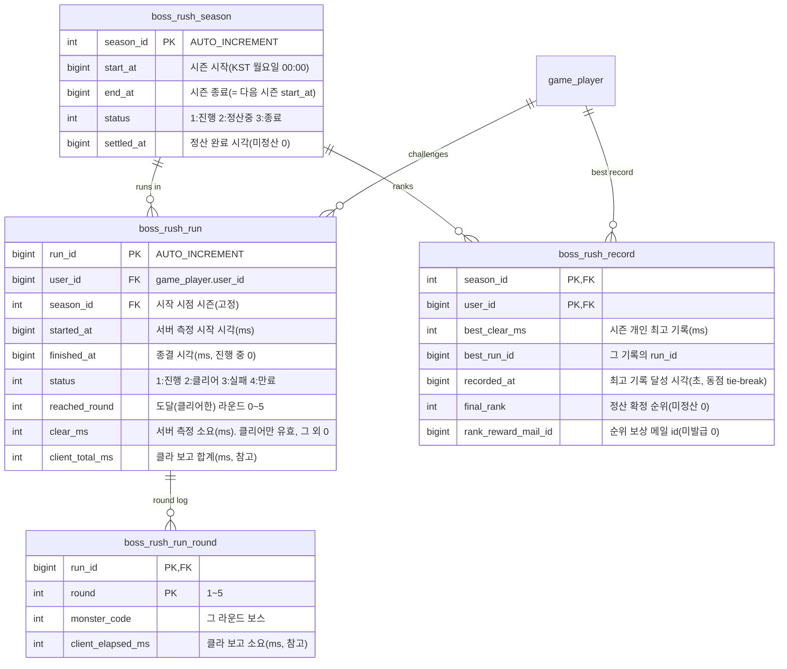

# 보스러시 / 랭킹 기획서

> 상위 문서: [서버 시스템 전체 개요](../서버-시스템-전체-개요.md) · 관련 도메인 4.12
>
> 본 문서는 **1~5지역의 보스 5종이 순차로 등장하는 도전 콘텐츠 "보스러시"** 와, 그 **클리어 시간으로 유저끼리 경쟁하는 랭킹 시스템**을 다룬다. 스테이지 진행·보상은 [스테이지/전투 결과 기획서](stage-battle-기획서.md), 보스 몬스터 정의는 [마스터 데이터 기획서](master-data/master-data-기획서.md)(`monster_master`), 순위 보상 지급은 [메일 기획서](mail-기획서.md)를 따른다.

## 목차

- [1. 개요](#1-개요)
- [2. 기능 설명](#2-기능-설명)
- [3. 요구사항](#3-요구사항)
- [4. 데이터 모델](#4-데이터-모델)
  - [4.1 마스터 테이블](#41-마스터-테이블)
  - [4.2 세이브 테이블(Game DB)](#42-세이브-테이블game-db)
  - [4.3 Redis 랭킹 리더보드](#43-redis-랭킹-리더보드)
- [5. API 명세](#5-api-명세)
  - [5.1 보스러시 정보 조회 — `POST /api/game/boss-rush/info`](#51-보스러시-정보-조회--post-apigameboss-rushinfo)
  - [5.2 도전 시작 — `POST /api/game/boss-rush/start`](#52-도전-시작--post-apigameboss-rushstart)
  - [5.3 클리어 보고 — `POST /api/game/boss-rush/clear`](#53-클리어-보고--post-apigameboss-rushclear)
  - [5.4 실패·포기 보고 — `POST /api/game/boss-rush/fail`](#54-실패포기-보고--post-apigameboss-rushfail)
  - [5.5 랭킹 조회 — `POST /api/game/boss-rush/rank`](#55-랭킹-조회--post-apigameboss-rushrank)
- [6. 처리 흐름](#6-처리-흐름)
  - [6.1 도전 시작](#61-도전-시작)
  - [6.2 클리어 검증·확정](#62-클리어-검증확정)
  - [6.3 이론 하한 검증(치트 방지의 핵심)](#63-이론-하한-검증치트-방지의-핵심)
  - [6.4 랭킹 등재와 정본·캐시 이원화](#64-랭킹-등재와-정본캐시-이원화)
  - [6.5 시즌 정산 배치](#65-시즌-정산-배치)
  - [6.6 버려진 런 만료 배치](#66-버려진-런-만료-배치)
  - [6.7 예외 / 엣지 케이스](#67-예외--엣지-케이스)
- [7. 에러 코드](#7-에러-코드)
- [8. 미결 사항 / TODO](#8-미결-사항--todo)
- [9. 참고](#9-참고)


## 1. 개요

- **목적**: 방치형 게임에는 "성장의 결과를 스스로 확인하는 자리"가 없다. 스테이지는 벽에 막힐 뿐 얼마나 강해졌는지 숫자로 돌려주지 않고, 다른 유저와의 비교 축도 없다. **보스러시**는 1~5지역의 보스 5종을 한 번에 몰아 세워 **파티 전투력을 하나의 시간(초)으로 환산**하고, 그 시간을 **주간 시즌 랭킹**으로 경쟁시켜 성장 동기와 접속 동기를 만든다.
- **대상 서버**: `GameServer`(도전 런 관리·시간 측정·검증·보상·랭킹), `TaskbarHero.Common`(보스러시·랭킹 DTO·에러 코드 공유). 인증은 AccountServer 발급 토큰을 GameServer 미들웨어가 검증한다.
- **범위 경계**:
  - **전투 시뮬레이션 자체는 클라이언트 권위**다([스테이지/전투 결과 기획서](stage-battle-기획서.md) §1과 동일). 서버는 보스를 재현하지 않는다.
  - 그러나 **랭킹은 순위가 곧 이득이라 조작 유인이 스테이지보다 훨씬 크다.** 그래서 본 콘텐츠는 클라이언트가 보고한 시간을 랭킹에 쓰지 않고, **서버가 `start`~`clear` 요청 사이를 직접 측정한 값**을 점수로 삼는다(6.2). 그 위에 **파티 전투력에서 역산한 이론 하한**으로 "물리적으로 불가능하게 빠른 기록"을 걸러낸다(6.3).
  - **순위 보상의 지급 수단은 메일**이다([메일 기획서](mail-기획서.md) 6.4 발급 규약). 본 문서는 발급 트리거(시즌 정산)까지 책임진다.
  - **랭킹 보상 외 아이템 드롭은 없다.** 보스러시 도달 보상은 골드·경험치뿐이므로 인벤토리 용량 실패 경로가 존재하지 않는다.
- **관련 기획서**: [[stage-battle-기획서]] (보스·스테이지 진행), [[master-data-기획서]] (보스 몬스터·레벨 배율), [[mail-기획서]] (순위 보상 발급), [[save-data-기획서]] (파티·경험치·재화 반영), [[growth-기획서]] (경험치→레벨), [[trade-기획서]] (주기 배치 골격 선례), [[서버-시스템-전체-개요]] (도메인 4.12)

## 2. 기능 설명

- **콘텐츠 구조**: **5라운드 순차 도전**이다. 라운드 `r`에는 **Act `r`의 보스가 단독으로** 등장한다 — 라운드 1 암흑 마법사(`9099`) → 라운드 2 스켈레톤 군주(`9199`) → 라운드 3 마왕(`9299`) → 라운드 4 몰락한 대천사(`9399`) → 라운드 5 공허의 지배자(`9499`)([마스터 데이터 값](master-data/master-data-값.md) §9). 스테이지 보스전과 달리 **잡몹(강몹 8마리)이 붙지 않는다** — 시간 경쟁 콘텐츠라 파티 전투력 외의 변수를 줄인다.
- **보스 레벨은 스테이지와 별개**다. 보스러시 전용 마스터(`boss_rush_round.monster_level`)가 라운드별 등장 레벨을 정하며, 최종 스테이지를 깬 파티에게도 도전이 되도록 스테이지의 같은 보스보다 높게 잡는다. 실제 스탯은 클라이언트가 `monster_master`의 레벨 1 기준값에 레벨 배율(`hp × 1.25^(L-1)` · `attack × 1.18^(L-1)`)을 곱해 산출한다([마스터 데이터 값](master-data/master-data-값.md) §9.4) — 스테이지 진입과 같은 방식이라 서버는 레벨만 내려준다.
- **라운드 사이 회복이 없다.** 파티의 체력·쿨다운은 라운드를 넘어 이어지며 부활도 없다. 그래서 "얼마나 빨리 죽이는가"와 "얼마나 안 맞고 죽이는가"가 동시에 시간에 반영된다.
- **제한 시간 10분.** 10분 안에 5라운드를 끝내지 못하면 그 런은 **실패**다(도달 라운드 보상만 받고 기록은 남지 않는다). 무한 방치를 막는 장치이면서, 랭킹 점수 인코딩의 상한 근거이기도 하다(4.3).
- **해금**: **Act1 보스 스테이지(진행 순번 10) 클리어 이후** 열린다. 보스러시 1라운드가 곧 Act1 보스이므로, 그 보스를 한 번도 못 본 파티에게 열어 둘 이유가 없다.
- **일일 3회 도전.** 날짜 경계는 **서버 KST(UTC+9) 자정**으로 출석부와 같다([출석부 기획서](attendance-기획서.md)). 남은 횟수는 정보 조회로 확인한다.
- **보상은 도달 라운드 기준**이다. 라운드 `r`을 깨면 그 라운드의 골드·경험치가 누적 지급되며, 5라운드 전부 깨면 5개 라운드 보상 전부를 받는다. 실패해도 **깬 라운드까지는 받는다** — 상위 라운드에서 전멸하는 성장 단계의 유저도 도전할 이유가 있어야 한다.
- **랭킹**: **주간 시즌**(KST 월요일 00:00 ~ 다음 월요일 00:00)마다 **개인 최고 기록 1건**이 등재된다. 같은 기록이면 **먼저 달성한 쪽이 상위**다. 시즌이 끝나면 순위 구간별 보상이 **메일로 발급**되고 다음 시즌이 자동으로 시작된다.

## 3. 요구사항

**기능 요구사항**

- 보스러시 해금 여부·일일 잔여 횟수·현 시즌·내 최고 기록·진행 중 런을 한 번에 조회한다.
- 도전 시작 요청은 일일 횟수를 차감하고 **서버 시각으로 런을 개시**한다. 라운드 구성(보스 코드·레벨)을 응답에 담는다.
- 클리어 보고 요청은 **서버 측정 시간**을 확정하고, 검증을 통과하면 도달 라운드 보상을 지급하고 개인 최고 기록을 갱신한다.
- 실패·포기 보고 요청은 런을 종결하고 **도달 라운드까지의 보상만** 지급한다.
- 랭킹 조회는 **시즌 상위 목록**과 **내 순위**를 함께 내려준다.
- 시즌이 끝나면 **순위 구간별 보상 메일을 발급**하고 다음 시즌을 개시한다.
- 클라이언트가 응답 없이 사라진 런은 **자동으로 만료 종결**한다(보상 없음).

**비기능 요구사항**

- **서버 권위(시간)**: 랭킹 점수로 쓰는 시간은 **서버가 측정한 값만** 사용한다. 클라이언트가 보고한 라운드별 소요 시간은 **참고 기록**으로만 적재하며 점수 계산에 들어가지 않는다.
- **치트 내성**: 서버 측정은 "요청을 늦게 보내는" 조작에는 구조적으로 면역이다(시간이 늘어나 손해). 남는 공격면은 **전투를 건너뛰고 즉시 `clear`를 부르는** 조작이며, 이것을 **이론 하한 검증**(6.3)이 막는다.
- **원자성**: "런 종결 + 골드·경험치 지급 + 최고 기록 갱신"은 하나의 `user_id` 단위 트랜잭션이다. 랭킹 캐시(Redis) 반영은 **커밋 이후**에 한다 — 캐시가 정본을 앞서면 롤백된 기록이 순위에 남는다.
- **랭킹 정본은 MySQL**, Redis Sorted Set은 **순위 조회 전용 캐시**다. Redis가 비었거나 죽어도 기록은 손실되지 않고, 조회는 MySQL 폴백으로 축소 운전한다(4.3·6.4).
- **동시성**: 같은 계정의 중복 `clear`는 런 행 잠금 + 조건부 상태 전이(`status=1`일 때만 종결)로 직렬화한다 — 뒤에 온 요청은 0행을 받아 `BossRushRunAlreadyFinished(13004)`가 되며 보상이 두 번 지급되지 않는다. 거래소가 쓰는 것과 같은 방식이다([거래소 기획서](trade-기획서.md) 7.4).
- **랭킹 조회 성능**: 상위 목록은 `ZRANGE`(O(log N + M)), 내 순위는 `ZRANK`(O(log N))로 처리하고, 그 범위의 `user_id`에 대해서만 MySQL에서 닉네임·기록을 읽는다(`WHERE user_id IN (…)`, 최대 100건). 전체 정렬 스캔을 매 조회마다 하지 않는다.
- **배치 중복 실행 방지**: 시즌 정산·런 만료 배치는 기존 `PeriodicBatchService` 골격을 상속해 Redis 리더 락(`batch:lock:{배치키}`)을 사용한다.

## 4. 데이터 모델

### 4.1 마스터 테이블

정적·읽기 전용 정의이며 [마스터 데이터 기획서](master-data/master-data-기획서.md)의 파이프라인(원천 → 서버 인메모리 + 클라 번들)을 그대로 따른다. **네 테이블 모두 클라이언트 번들에 포함**한다 — 보스 소환(라운드 구성)·보상 표시·순위 보상 안내가 모두 클라 UI에서 필요하다.

#### `boss_rush_master` — 콘텐츠 전역 규칙 (단일 행)

| 필드 | 타입 | 의미 |
|---|---|---|
| `content_id` | int PK | 고정 `1`(콘텐츠 단일) |
| `round_count` | int | 라운드 수(현재 5 = Act 수) |
| `time_limit_sec` | int | 런 제한 시간(초). **600**(10분) |
| `daily_entry_limit` | int | 일일 도전 횟수. **3** |
| `unlock_stage_sequence` | int | 해금 요구 진행 순번(`max_stage_cleared` 기준). **10**(Act1 난이도1 보스) |
| `season_period_days` | int | 시즌 길이(일). **7** |
| `theory_margin_pct` | int | 이론 하한에 적용할 관용 비율(%). **80** = 이론 최소치의 80%보다도 빠른 기록만 거부(6.3) |
| `rank_page_limit` | int | 랭킹 조회 1페이지 상한(행). **100** |
| `rank_max_offset` | int | 랭킹 목록으로 노출하는 최대 순위 - 1. **999**(1000위까지) |

> 전역 상수를 `appsettings`가 아니라 마스터에 두는 이유: 제한 시간·일일 횟수·해금 조건은 **밸런스 값**이고, 클라이언트가 같은 값으로 UI(남은 시간 게이지·잔여 횟수·해금 안내)를 그려야 하므로 서버-클라 공용 원천이 필요하다. 배치 주기처럼 **운영 파라미터**인 값만 `appsettings`에 둔다(6.5·6.6).

#### `boss_rush_round` — 라운드별 등장 보스

| 필드 | 타입 | 의미 |
|---|---|---|
| `round` | int PK | 라운드 번호(1~5) |
| `monster_code` | int | 등장 보스(`monster_master.monster_code`, `9099`·`9199`·`9299`·`9399`·`9499`) |
| `monster_level` | int | **보스러시 전용 등장 레벨**(1 이상). 스테이지의 같은 보스보다 높다 |

- 라운드당 **1행·보스 1마리**다. 잡몹 스폰이 없으므로 `spawn_count` 컬럼을 두지 않는다(항상 1).
- `monster_code`는 그 Act의 보스 코드(`9N99`)여야 한다(마스터 검증 대상, 8장).

#### `boss_rush_reward` — 라운드 도달 보상

| 필드 | 타입 | 의미 |
|---|---|---|
| `round` | int PK | 라운드 번호(1~5, `boss_rush_round`와 1:1) |
| `reward_gold` | bigint | 그 라운드 클리어 시 골드 |
| `reward_exp` | bigint | 그 라운드 클리어 시 경험치(파티 편성 캐릭터 **각각**에게 같은 값) |

- 지급은 **누적**이다 — 도달 라운드가 `r`이면 `1..r` 행의 합을 지급한다.
- **아이템 드롭 항목을 두지 않는다**(2장). 그래서 `stage_reward_drop`에 대응하는 자식 테이블이 없다.

#### `boss_rush_rank_reward` / `boss_rush_rank_reward_item` — 시즌 순위 보상

| `boss_rush_rank_reward` 필드 | 타입 | 의미 |
|---|---|---|
| `rank_group` | int PK | 순위 구간 순번(1부터, 상위 구간이 작은 값) |
| `rank_from` | int | 구간 시작 순위(포함) |
| `rank_to` | int | 구간 끝 순위(포함) |

| `boss_rush_rank_reward_item` 필드 | 타입 | 의미 |
|---|---|---|
| `rank_group` | int PK | 부모(`boss_rush_rank_reward.rank_group`) |
| `seq` | int PK | 첨부 순번 |
| `reward_type` | int | 1:골드 2:아이템 3:재료 (메일 첨부·출석 보상과 **동일 enum**, 값 변경 금지) |
| `reward_code` | int | 골드면 `0`, 그 외 `item_master.item_code` |
| `quantity` | bigint | 수량 |

- 구간별 보상 항목이 **반복 구조**이므로 JSON 컬럼을 두지 않고 자식 테이블로 분리한다(설계 규칙, `player_mail`/`player_mail_reward`와 같은 형태).
- 구간은 **겹치지 않고 빈틈이 없어야** 한다(1위부터 시작, `rank_from ≤ rank_to`, 다음 구간의 `rank_from = 이전 rank_to + 1`). 마스터 검증 대상(8장).
- 보상 구간 밖(예: 1000위 이하)은 **행을 두지 않는다** — 매칭되는 구간이 없으면 순위 보상을 발급하지 않는다.

### 4.2 세이브 테이블(Game DB)



**PK / 인덱스**

| 테이블 | PK / 인덱스 | 범위 |
|---|---|---|
| `boss_rush_season` | `season_id` PK, `(status, end_at)` 인덱스(정산 대상 탐색) | 전역(콘텐츠 시즌) |
| `boss_rush_run` | `run_id` PK, `(user_id, started_at)` 인덱스(일일 횟수 집계·내 이력), `(status, started_at)` 인덱스(만료 배치) | 계정 도전 원장 |
| `boss_rush_run_round` | `(run_id, round)` PK | 런의 라운드 로그(자식) |
| `boss_rush_record` | `(season_id, user_id)` PK, `(season_id, best_clear_ms, recorded_at)` 인덱스(랭킹 MySQL 폴백·정산 정렬) | 시즌별 계정 최고 기록 |

**테이블별 역할**

- **`boss_rush_season`** — 시즌의 정본. 랭킹은 시즌 단위로 리셋되므로 "지금 어느 시즌인가"·"정산했는가"가 서버 판단의 기준이 된다. `status`를 조건부 갱신으로 전이시켜 정산 배치의 선점 단위로도 쓴다(6.5).
- **`boss_rush_run`** — 도전 1회의 원장이자 **서버 측정 시간의 근거**. `started_at`은 서버가 찍은 값이며 클라이언트가 관여하지 않는다. **일일 횟수 카운터 컬럼을 따로 두지 않는다** — `started_at`이 오늘(KST) 범위인 행 수가 곧 오늘 사용 횟수다(카운터를 이중으로 두면 원장과 어긋날 여지가 생긴다). 자동 삭제하지 않는다(재화가 오간 원장).
- **`boss_rush_run_round`** — 클라이언트가 보고한 라운드별 소요 시간의 로그. **점수 계산에 쓰이지 않고** 사후 분석(어느 라운드에서 막히는가)과 치트 관측(서버 측정과의 괴리)에만 쓴다.
- **`boss_rush_record`** — 시즌별 개인 최고 기록(랭킹 정본). 기록이 개선될 때만 UPSERT하며, `recorded_at`이 동점 순위의 tie-break 축이다. 정산 시 `final_rank`·`rank_reward_mail_id`를 채워 **재정산 멱등성**을 확보한다(이미 채워진 행은 스킵).

**공유 enum / DTO (TaskbarHero.Common)**
- 런 상태(`1:진행 2:클리어 3:실패 4:만료`), 시즌 상태(`1:진행 2:정산중 3:종료`)를 공유 enum으로 두는 것을 **제안**한다.
- 보스러시 정보·시작·클리어·랭킹 응답 DTO는 `TaskbarHero.Common`에 공유 DTO로 두는 것을 **제안**한다(5장 스키마).
- `reward_type`(1:골드 2:아이템 3:재료)은 기존 공유 enum과 **동일 값**을 쓴다(값 변경 금지).

### 4.3 Redis 랭킹 리더보드

- **키**: `rank:bossrush:{seasonId}` — 시즌마다 별도 키. Sorted Set(CloudStructures `RedisSortedSet<long>`), **member = `userId`**.
- **점수 인코딩**: `score = best_clear_ms × 10^10 + recorded_at(초)`
  - **오름차순이 곧 순위**다(빠른 기록이 상위). 동점이면 `recorded_at`이 작은 쪽 = **먼저 달성한 쪽이 상위**.
  - **왜 인코딩이 필요한가**: Redis Sorted Set은 점수가 같으면 member 문자열 사전순으로 정렬한다. member가 `userId`이므로 동점자 순서가 "userId 사전순"이 되어 게임 규칙("먼저 달성한 쪽이 위")을 표현할 수 없다. tie-break를 점수 안에 넣는 것이 유일한 방법이다.
  - **정밀도 검증**: Redis 점수는 IEEE 754 double이라 정수를 **2^53 ≈ 9.007 × 10^15** 까지 오차 없이 표현한다. `best_clear_ms`는 제한 시간(600,000ms)이 상한이므로 `6 × 10^5 × 10^10 = 6 × 10^15 < 9.007 × 10^15` ✓. `recorded_at`(초)은 `10^10` 미만이므로 하위 자리를 침범하지 않는다(서기 2286년까지 유효) ✓. **제한 시간 10분이 이 인코딩의 전제**이며, 제한 시간을 늘리려면 인코딩 배수를 함께 재검토해야 한다(8장).
  - **복원**: 표시용 기록 = `floor(score / 10^10)` (ms). 별도 조회 없이 점수만으로 시간을 되돌릴 수 있다.
- **정본이 아니다.** Redis는 순위 조회를 위한 **파생 인덱스**이며, 유실되면 MySQL `boss_rush_record`에서 재구축한다(6.4).
- **TTL**: 진행 중 시즌 키에는 TTL을 두지 않는다. 시즌이 종료되면 정산 배치가 **7일 TTL**을 걸어 과거 키가 무한히 쌓이지 않게 한다(지난 시즌 조회는 그 기간 동안만 캐시로, 이후는 MySQL 폴백).
- **배치 락 키**: `batch:lock:bossrush-season`(시즌 정산), `batch:lock:bossrush-run-expire`(런 만료). 기존 골격 규약(`batch:lock:{배치키}`)과 동일.

## 5. API 명세

**API 목록**

- [5.1 보스러시 정보 조회 — `POST /api/game/boss-rush/info`](#51-보스러시-정보-조회--post-apigameboss-rushinfo)
- [5.2 도전 시작 — `POST /api/game/boss-rush/start`](#52-도전-시작--post-apigameboss-rushstart)
- [5.3 클리어 보고 — `POST /api/game/boss-rush/clear`](#53-클리어-보고--post-apigameboss-rushclear)
- [5.4 실패·포기 보고 — `POST /api/game/boss-rush/fail`](#54-실패포기-보고--post-apigameboss-rushfail)
- [5.5 랭킹 조회 — `POST /api/game/boss-rush/rank`](#55-랭킹-조회--post-apigameboss-rushrank)

Base URL(개발): `http://localhost:5247` (GameServer). 모든 API는 **POST**, 인증 요청 공통 형식 `{ userId, token, data }`, 응답 `{ success, errorCode, message, data }`([세이브 데이터 기획서](save-data-기획서.md) 5장과 동일 규약).

> **경로 세그먼트**: 도메인 세그먼트에 kebab-case(`boss-rush`)를 쓴다. 기존 규약이 이미 액션 세그먼트에 kebab을 쓰고 있고(`update-last-active`·`claim-all`), 두 단어 도메인을 붙여 쓰면(`bossrush`) 읽기 어렵다.

### 5.1 보스러시 정보 조회 — `POST /api/game/boss-rush/info`

보스러시 UI를 여는 데 필요한 **서버만 아는 값**을 한 번에 내려준다(라운드 구성·보상·순위 보상 표는 클라 번들이므로 서버가 다시 보내지 않는다 — 가챠 배너 조회와 같은 원칙, [가챠 기획서](gacha-기획서.md) 5.1).

**Request**
```json
{ "userId": 1, "token": "...", "data": {} }
```

**Response (성공, 200 OK)**
```json
{
  "success": true,
  "errorCode": 0,
  "message": "OK",
  "data": {
    "serverTime": 1755561600000,
    "unlocked": true,
    "unlockStageSequence": 10,
    "maxStageCleared": 73,
    "dailyEntryLimit": 3,
    "dailyEntryUsed": 1,
    "dailyResetAt": 1755576000,
    "timeLimitMs": 600000,
    "season": { "seasonId": 12, "startAt": 1755450000, "endAt": 1756054800, "status": 1 },
    "myRecord": { "bestClearMs": 214380, "recordedAt": 1755470912, "rank": 37 },
    "activeRun": { "runId": 9912, "startedAt": 1755561240000, "expiresAt": 1755561840000, "reachedRound": 2 }
  }
}
```

- `serverTime`은 **밀리초**다(제한 시간 게이지를 클라가 서버 시각에 맞춰 그리기 위함). 그 외 시각 필드는 프로젝트 공통 규약대로 **초**다.
- `unlocked`: `maxStageCleared >= unlockStageSequence`. `false`면 클라이언트는 진입 버튼을 잠그고 해금 조건을 안내한다.
- `dailyEntryUsed`: 오늘(KST) `started_at`이 찍힌 런 수. `dailyResetAt`은 다음 KST 자정(초).
- `myRecord`: 현 시즌 개인 최고 기록. 기록이 없으면 `null`. `rank`는 랭킹 캐시(`ZRANK`+1)로 얻으며, Redis 폴백 시에는 `null`로 내려 UI가 "순위 계산 불가"를 표시한다.
- `activeRun`: 진행 중인 런(있으면). `expiresAt = startedAt/1000 + timeLimitSec`. 클라이언트는 이 값으로 **재접속 후 이어서 도전할지, 포기할지**를 결정한다. 없으면 `null`.
- 오류: `SaveNotFound(2001)`(세이브 없음), `MasterDataNotLoaded(10001)`.

### 5.2 도전 시작 — `POST /api/game/boss-rush/start`

일일 횟수를 차감하고 런을 개시한다. **서버가 이 시점을 `started_at`으로 찍으며, 이 값이 랭킹 시간의 기준점**이다.

**Request**
```json
{ "userId": 1, "token": "...", "data": {} }
```

- 요청에 **파라미터가 없다.** 라운드 구성·제한 시간·난이도를 클라이언트가 고를 여지를 두지 않는다(선택 축을 주면 곧 "쉬운 구성으로 빠른 기록"이 되어 랭킹이 무의미해진다).

**Response (성공, 200 OK)**
```json
{
  "success": true,
  "errorCode": 0,
  "message": "Boss rush started",
  "data": {
    "runId": 9913,
    "seasonId": 12,
    "startedAt": 1755561900000,
    "serverTime": 1755561900000,
    "timeLimitMs": 600000,
    "expiresAt": 1755562500000,
    "rounds": [
      { "round": 1, "monsterCode": 9099, "monsterLevel": 12 },
      { "round": 2, "monsterCode": 9199, "monsterLevel": 24 },
      { "round": 3, "monsterCode": 9299, "monsterLevel": 36 },
      { "round": 4, "monsterCode": 9399, "monsterLevel": 48 },
      { "round": 5, "monsterCode": 9499, "monsterLevel": 60 }
    ],
    "dailyEntryUsed": 2,
    "dailyEntryLimit": 3
  }
}
```

- `rounds`: 스테이지 진입(`stage/enter`)과 같은 방식으로 **몬스터 코드와 레벨만** 내려준다. 스탯은 클라이언트가 마스터 번들의 레벨 1 기준값에 레벨 배율을 곱해 산출한다.
- **기존 진행 중 런이 있으면 자동으로 실패 종결**한 뒤 새 런을 시작한다(6.7). 방치형 클라이언트는 강제 종료가 흔해서, 남은 런 때문에 재도전이 막히면 사용자가 복구할 방법이 없다. 이때 종결된 런은 보상 없이 `status=3`이 되고 **이미 소모된 일일 횟수는 돌려주지 않는다.**
- 오류: `BossRushLocked(13001)`, `BossRushDailyLimitExceeded(13002)`, `BossRushSeasonClosed(13008)`, `SaveNotFound(2001)`, `MasterDataNotLoaded(10001)`.

### 5.3 클리어 보고 — `POST /api/game/boss-rush/clear`

5라운드를 모두 클리어했음을 알린다. 서버가 **자기 측정 시간을 확정**하고 검증한 뒤 보상을 지급하고 최고 기록을 갱신한다.

**Request**
```json
{
  "userId": 1, "token": "...",
  "data": {
    "runId": 9913,
    "rounds": [
      { "round": 1, "elapsedMs": 18240 },
      { "round": 2, "elapsedMs": 27110 },
      { "round": 3, "elapsedMs": 41660 },
      { "round": 4, "elapsedMs": 55020 },
      { "round": 5, "elapsedMs": 72350 }
    ]
  }
}
```

- `rounds[].elapsedMs`: **그 라운드에 걸린 시간**(누적이 아니라 라운드별 소요). `round_count`(5)개가 1~5 전부 있어야 한다.
- 이 값은 **참고 기록**이다(`boss_rush_run_round`). 랭킹 점수는 서버 측정값(`clear_ms`)이며, 클라 합계는 **서버 측정값과의 정합성 검증에만** 쓴다(6.2 3단계).

**Response (성공, 200 OK)**
```json
{
  "success": true,
  "errorCode": 0,
  "message": "Boss rush cleared",
  "data": {
    "runId": 9913,
    "seasonId": 12,
    "clearMs": 216840,
    "clientTotalMs": 214380,
    "reachedRound": 5,
    "isNewRecord": false,
    "bestClearMs": 214380,
    "rank": 37,
    "rewards": { "gold": 4200000, "exp": 185000 },
    "characters": [
      { "characterId": 1, "level": 58, "exp": 412300, "isLevelUp": false },
      { "characterId": 2, "level": 57, "exp": 98200, "isLevelUp": true },
      { "characterId": 3, "level": 55, "exp": 250400, "isLevelUp": false }
    ],
    "balance": [ { "currencyType": 1, "amount": 13876621 } ]
  }
}
```

- `clearMs`: **서버 측정 소요 시간**(= 요청 처리 시각 − `started_at`). 랭킹 점수는 이 값이다.
- `clientTotalMs`: 클라 보고 합계(참고 표시용).
- `isNewRecord`: 이번 기록이 시즌 개인 최고를 갱신했는지. `bestClearMs`는 갱신 후 최고 기록, `rank`는 갱신 후 순위(Redis 폴백 시 `null`).
- `rewards.gold`/`exp`: `boss_rush_reward` 1~5행의 합. **획득량 버프 배율은 적용하지 않는다** — 버프 도메인이 "배율은 `stage/clear`에만 곱한다"로 확정했고([소모품/버프 기획서](consumable-buff-기획서.md) 6.3·6.5), 일일 횟수가 정해진 콘텐츠의 보상 총량에 배율을 겹치면 설계한 일일 재화 유입량이 흔들린다.
- `exp`는 파티 편성 캐릭터(`slot`≠0) **각각에게 같은 값**으로 지급한다(스테이지·오프라인과 동일 원칙). `characters[].isLevelUp`은 그 캐릭터가 이번에 레벨업했는지다.
- **아이템 드롭이 없으므로 `inventoryDelta`가 없다.**
- 오류: `BossRushRunNotFound(13003)`, `BossRushRunAlreadyFinished(13004)`, `BossRushTimeout(13005)`, `BossRushInvalidProgress(13006)`, `BossRushTimeImplausible(13007)`, `InvalidRequest(1006)`(`rounds` 형식 오류).

### 5.4 실패·포기 보고 — `POST /api/game/boss-rush/fail`

파티 전멸 또는 유저의 포기로 도전이 끝났음을 알린다. 런을 종결하고 **도달 라운드까지의 보상만** 지급한다. **기록은 등재하지 않는다.**

**Request**
```json
{ "userId": 1, "token": "...", "data": { "runId": 9913, "reachedRound": 3, "reason": 1 } }
```

- `reachedRound`(0~5): **클리어한 라운드 수**. `0`이면 1라운드에서 전멸.
- `reason`: `1`=전멸 `2`=유저 포기. 통계·로그용이며 보상 판정에 영향이 없다.
- `reachedRound`는 클라이언트 보고값이지만 **보상만 좌우하고 랭킹에는 관여하지 않는다.** 상한(`round_count`)으로 clamp하며, `5`를 보고해도 클리어로 승격되지 않는다(클리어는 `clear` 경로만) — 다만 5라운드 보상까지 지급되므로, 이 값이 곧 "보상만 최대치로 받는" 공격면이다. **일일 3회 제한이 그 상한선**이라 무한 파밍은 불가하고, 그 이상의 검증(전멸 재현)은 전투가 클라 권위인 범위 안에서 불가능하다(8장 확정).

**Response (성공, 200 OK)**
```json
{
  "success": true,
  "errorCode": 0,
  "message": "Boss rush finished",
  "data": {
    "runId": 9913,
    "reachedRound": 3,
    "elapsedMs": 331200,
    "rewards": { "gold": 1350000, "exp": 62000 },
    "characters": [ { "characterId": 1, "level": 58, "exp": 396100, "isLevelUp": false } ],
    "balance": [ { "currencyType": 1, "amount": 11026621 } ]
  }
}
```

- `reachedRound = 0`이면 `rewards`가 모두 `0`이고 `characters`는 변동 없는 현재 값이다.
- 오류: `BossRushRunNotFound(13003)`, `BossRushRunAlreadyFinished(13004)`, `InvalidRequest(1006)`.

### 5.5 랭킹 조회 — `POST /api/game/boss-rush/rank`

시즌 랭킹의 상위 구간과 **내 순위**를 함께 내려준다.

**Request**
```json
{ "userId": 1, "token": "...", "data": { "seasonId": 12, "offset": 0, "limit": 50 } }
```

- `seasonId` 생략 시 **현재 시즌**. 종료된 시즌도 조회할 수 있다(캐시 TTL 이후는 MySQL 폴백).
- `offset`·`limit`은 **서버가 clamp**한다 — `limit`은 1~`rank_page_limit`(100), `offset`은 0~`rank_max_offset`(999). 리더보드는 상위 구간만 의미가 있고 `ZRANGE`는 범위 조회가 저렴하므로 커서가 아니라 **오프셋 페이징**을 쓴다.

**Response (성공, 200 OK)**
```json
{
  "success": true,
  "errorCode": 0,
  "message": "OK",
  "data": {
    "seasonId": 12,
    "seasonStatus": 1,
    "seasonEndAt": 1756054800,
    "totalEntries": 1842,
    "offset": 0,
    "limit": 50,
    "source": 1,
    "entries": [
      { "rank": 1, "userId": 88, "nickname": "질풍", "clearMs": 121400, "recordedAt": 1755455102 },
      { "rank": 2, "userId": 41, "nickname": "무명", "clearMs": 121400, "recordedAt": 1755461330 }
    ],
    "myRank": { "rank": 37, "userId": 1, "nickname": "테스터", "clearMs": 214380, "recordedAt": 1755470912 }
  }
}
```

- 순위는 **1부터**이며 오름차순(빠른 기록이 1위)이다. 위 예시처럼 `clearMs`가 같으면 `recordedAt`이 작은 쪽이 상위다(4.3 인코딩).
- `totalEntries`: 시즌 등재 인원(`ZCARD`, 폴백 시 `COUNT(*)`).
- `source`: `1`=랭킹 캐시(Redis) `2`=MySQL 폴백. 폴백 상태를 클라이언트가 알아야 "순위가 잠시 늦게 반영될 수 있음"을 표시할 수 있다.
- `myRank`: 내 기록이 없으면 `null`. **`offset` 범위 밖이어도 항상 내려준다**(내 순위를 찾으려 목록을 넘기게 만들지 않는다).
- 오류: `BossRushSeasonClosed(13008)`(존재하지 않는 `seasonId`), `MasterDataNotLoaded(10001)`.

## 6. 처리 흐름

### 6.1 도전 시작

```
요청 수신 → 토큰 검증(미들웨어)
트랜잭션(BEGIN, user_id 잠금)
  1) gp = game_player[userId]                       # 없으면 SaveNotFound(2001)
  2) m  = boss_rush_master
     if gp.max_stage_cleared < m.unlock_stage_sequence: BossRushLocked(13001)
  3) season = boss_rush_season[status = 1]          # 진행 중 시즌
     if season is null: BossRushSeasonClosed(13008) # 정산 중이면 잠시 후 재시도
  4) 오늘(KST) 사용 횟수 = count(boss_rush_run where user_id = ? and started_at in [오늘0시, 내일0시))
     if 사용 횟수 >= m.daily_entry_limit: BossRushDailyLimitExceeded(13002)
  5) 진행 중 런이 있으면 자동 실패 종결(status = 3, reached_round 유지, 보상 없음)
  6) INSERT boss_rush_run(user_id, season_id, started_at = now_ms, status = 1, reached_round = 0)
COMMIT → { runId, startedAt, expiresAt, rounds(boss_rush_round), dailyEntryUsed }
```

- **일일 횟수 차감의 정본은 런 INSERT 그 자체**다. 별도 카운터가 없으므로 "차감했는데 런이 안 생김"·"런이 생겼는데 차감 안 됨"이 구조적으로 불가능하다.
- 4)의 카운트와 6)의 INSERT는 같은 트랜잭션·같은 `user_id` 잠금 안에 있어 동시 요청이 한도를 넘기지 못한다.

### 6.2 클리어 검증·확정

```
트랜잭션(BEGIN, boss_rush_run 행 잠금)
  1) run = boss_rush_run[runId]  (SELECT ... FOR UPDATE)
     if run is null or run.user_id != userId: BossRushRunNotFound(13003)
     if run.status != 1:                      BossRushRunAlreadyFinished(13004)
  2) clearMs = now_ms - run.started_at                      # ★ 서버 측정
     if clearMs > m.time_limit_sec × 1000:
         run.status = 3(실패); run.finished_at = now_ms      # 종결시키고
         COMMIT; return BossRushTimeout(13005)                # 기록 없음
  3) 클라 보고 정합성:
     - rounds가 1..round_count 전부, 중복 없음, elapsedMs > 0          아니면 BossRushInvalidProgress(13006)
     - clientTotal = sum(elapsedMs);  clientTotal <= clearMs           아니면 13006 (보고가 측정보다 길 수 없다)
     - clearMs - clientTotal <= 허용 격차(30초)                        아니면 13006 (측정만 늘린 지연 보고)
  4) 이론 하한(6.3):
     minMs = theoreticalMinMs(userId, boss_rush_round 전체)
     if clearMs < minMs:
         run.status = 3(실패); run.finished_at = now_ms
         COMMIT; Warning 로그(치트 관측); return BossRushTimeImplausible(13007)
  5) 종결(조건부 갱신): UPDATE boss_rush_run SET status = 2, finished_at, clear_ms, client_total_ms,
                        reached_round = round_count WHERE run_id = ? AND status = 1
     → 0행이면 BossRushRunAlreadyFinished(13004)  # 동시 중복 요청의 패자
     INSERT boss_rush_run_round × round_count      # 클라 보고 로그(참고)
  6) 보상: gold = sum(boss_rush_reward[1..round_count].reward_gold)
           exp  = sum(boss_rush_reward[1..round_count].reward_exp)
           player_item(골드 재화 행).quantity += gold
           for c in player_character(slot ≠ 0): c.exp += exp → level 재계산
           # 획득량 버프 배율 미적용(5.3)
  7) 기록 갱신(조건부 UPSERT):
           INSERT boss_rush_record(season_id, user_id, best_clear_ms = clearMs, best_run_id, recorded_at = now_sec)
           ON DUPLICATE KEY UPDATE ... WHERE 기존 best_clear_ms > clearMs      # 개선된 경우만
           isNewRecord = 영향 행 존재
COMMIT
  8) 커밋 이후: isNewRecord면 ZADD rank:bossrush:{seasonId} score(clearMs, recorded_at) userId   # ★ 커밋 후
     rank = ZRANK + 1 (실패 시 null)
→ { clearMs, isNewRecord, bestClearMs, rank, rewards, characters, balance }
```

- **2)의 타임아웃도 런을 종결시킨다.** 종결하지 않으면 만료 배치를 기다려야 하고, 그 사이 유저는 남은 런 때문에 재시작 시 자동 실패 처리를 겪는다.
- **3)의 두 검사는 방향이 다르다.** `clientTotal <= clearMs`는 "전투가 서버 측정 구간보다 길 수 없다"는 물리 제약이고, `clearMs - clientTotal <= 30초`는 "전투는 짧았는데 보고만 늦춰 측정을 늘린" 경우를 잡는다 — 후자는 랭킹에서 손해라 조작 유인이 없지만, 검증을 양방향으로 두면 **클라 로그의 신뢰도**가 올라가 사후 분석에 쓸 수 있다. 허용 격차 30초는 라운드 전환 연출·네트워크 지연·로딩의 합에 대한 여유다(8장 미결 — 실측으로 조정).
- **8)은 반드시 커밋 이후**다. 트랜잭션 안에서 ZADD하면 롤백된 기록이 랭킹에 남고, Redis에는 롤백이 없다.

### 6.3 이론 하한 검증(치트 방지의 핵심)

전투가 클라이언트 권위이므로 서버는 "정말 이만큼 싸웠는가"를 재현할 수 없다. 대신 **"그 파티로는 아무리 잘해도 이보다 빠를 수 없다"는 상한선**을 계산해 그 밑을 거부한다. 서버가 보상 산출에 이미 쓰는 마스터 데이터(직업·레벨·장비·강화·스킬·룬)만으로 계산되므로 새 의존이 없다.

```
theoreticalMinMs(userId, rounds):
  # 1) 보스 총 유효 체력 — 라운드별 보스의 레벨 배율 적용 합
  totalHp = Σ_r  monster_master[rounds[r].monster_code].hp × 1.25^(rounds[r].monster_level - 1)

  # 2) 파티 이론 최대 DPS — 각 축을 "최대로 유리하게" 잡는다(상한이므로 과대평가가 안전)
  dps = 0
  for c in player_character(slot ≠ 0):
      atk = class_master[c.class_code].base_atk
          + 레벨 보너스(c.level)
          + Σ 장착 장비 atk × enhance_master[강화단계].stat_multiplier
          + 룬 공격 보너스(계정 공용)
      평타DPS  = atk × (1 + 치명 기대치) / class_master.attack_period
      스킬DPS  = Σ_(장착 액티브 스킬) max(skill_coefficient[스킬, 전 레벨].coefficient) × atk / cooldown
      dps += 평타DPS + 스킬DPS      # 이동·사거리·타겟 전환 손실을 0으로 가정(상한)

  # 3) 관용 적용 — 이론 최소치보다도 theory_margin_pct(80%)만큼 짧은 기록까지 허용
  return floor(totalHp / dps × 1000 × theory_margin_pct / 100)
```

**설계 의도**

- **오탐(정상 유저 거부)이 미탐(치트 통과)보다 훨씬 비싸다.** 정상 기록을 거부하면 그 유저의 도전 1회와 신뢰를 잃는데, 치트 하나를 놓치면 순위 한 칸이 흔들릴 뿐이다. 그래서 계산의 모든 축을 **유저에게 유리한 쪽으로 과대평가**한다 — 스킬 계수는 전 레벨 최댓값, 이동·사거리·타겟 전환 손실은 0, 광역 스킬도 단일 대상 전력으로 계산, 여기에 다시 `theory_margin_pct`(80%)를 곱한다. 즉 **"이론 최소 시간의 80%보다도 빠른 기록"만 거부**한다.
- **막으려는 것은 정교한 조작이 아니라 "전투를 건너뛴 즉시 `clear`"** 다. 서버 측정 구조상 조작으로 얻을 수 있는 이득은 **시간을 줄이는 방향뿐**이고, 그 극단이 `start` 직후 `clear`(≈0초)다. 이론 하한은 이 경로를 확실히 막는다. 반대로 "실제로 싸우되 조금 빠르게 보이는" 미세 조작은 이 검증을 통과할 수 있으며, 그것까지 막으려면 전투 재현이 필요해 본 프로젝트의 범위를 벗어난다(8장 확정).
- **DPS 계산의 원천은 밸런스 시뮬레이터와 같아야 한다.** `tools/balance_sim.py`가 쓰는 전투력 산식과 어긋나면 이론 하한이 실측과 따로 움직인다. 구현 시 산식을 한 곳에서 관리하고, **100 스테이지 전수 측정처럼 기준 파티로 보스러시를 측정해 `theory_margin_pct`를 검증**한다(8장).
- **거부는 Warning 로그로 관측한다.** `BossRushTimeImplausible`은 사용자 실수가 아니라 조작 의심이므로 `userId`·`clearMs`·`minMs`를 남긴다([로깅 규칙](../공통/로깅-규칙.md)). 오탐이 쌓이면 산식이나 관용 비율이 틀렸다는 신호다.

### 6.4 랭킹 등재와 정본·캐시 이원화

- **정본은 MySQL `boss_rush_record`.** 기록 등재는 클리어 트랜잭션 안에서 조건부 UPSERT로 확정되므로, Redis가 죽어 있어도 기록이 유실되지 않는다.
- **Redis Sorted Set은 순위 조회 전용 파생 인덱스.** 랭킹 조회가 요구하는 것은 "정렬된 전체 집합에서의 위치"이며, 이것을 MySQL로 매 조회마다 계산하면 `COUNT(*) WHERE best_clear_ms < ?`류의 스캔이 등재 인원에 비례해 무거워진다. `ZRANK`는 O(log N)이다.
- **캐시 워밍업**: GameServer 기동 시(그리고 시즌 전환 직후) `EXISTS rank:bossrush:{현시즌}`을 확인하고 없으면 `boss_rush_record`를 페이지 단위로 읽어 ZADD로 재구축한다. 이 작업도 **Redis 리더 락**으로 1인스턴스만 수행한다(scale-out 시 중복 재구축 방지).
- **폴백(축소 운전)**: Redis 접근이 실패하면 랭킹 조회를 MySQL로 처리한다 — `SELECT ... ORDER BY best_clear_ms, recorded_at LIMIT ? OFFSET ?`가 `(season_id, best_clear_ms, recorded_at)` 인덱스를 그대로 타므로 상위 구간 조회는 충분히 싸다. 내 순위는 `COUNT(*) WHERE (best_clear_ms, recorded_at) < (내 값)` + 1로 계산한다. 응답 `source=2`로 알린다.
- **캐시가 정본을 앞서지 않는다**: ZADD는 언제나 커밋 이후에만 한다(6.2 8단계). ZADD가 실패해도 응답은 성공이며(`rank: null`), 다음 워밍업이나 정산이 캐시를 정본에 맞춘다.
- **표시 이름**: `entries[].nickname`은 `game_player.nickname`을 조회 시 JOIN(`WHERE user_id IN (…)`, 최대 100건)해서 채운다. 기록 행에 닉네임을 스냅샷하지 않는다 — 중복 저장을 만들지 않고, 훗날 닉네임 변경 기능이 생겨도 랭킹이 자동으로 최신 이름을 보여준다.

### 6.5 시즌 정산 배치

`BossRushSeasonBatchService`(`PeriodicBatchService` 상속, 락 키 `batch:lock:bossrush-season`, 주기 `appsettings`의 `BossRushSeasonBatch:IntervalSeconds` 기본 **600초**).

```
1) 대상 선점: UPDATE boss_rush_season SET status = 2 WHERE status = 1 AND end_at <= now
   → 0행이면 정산할 시즌 없음(종료)
2) 순위 부여·보상 발급(페이지 단위 반복, 각 페이지가 1트랜잭션):
   SELECT ... FROM boss_rush_record WHERE season_id = ? AND final_rank = 0
     ORDER BY best_clear_ms, recorded_at LIMIT BatchSize
   for 각 행(순위 = 전체 정렬에서의 위치):
       group = boss_rush_rank_reward 중 rank_from <= 순위 <= rank_to 인 구간
       if group 있음:
           mailId = 메일 발급(템플릿 501, 파라미터: 시즌 번호·순위, 첨부 = boss_rush_rank_reward_item[group])
       UPDATE boss_rush_record SET final_rank = 순위, rank_reward_mail_id = mailId(없으면 0)
             WHERE season_id = ? AND user_id = ? AND final_rank = 0      # 멱등
3) 종료 처리: UPDATE boss_rush_season SET status = 3, settled_at = now WHERE season_id = ?
   EXPIRE rank:bossrush:{seasonId} 7일
4) 다음 시즌 개시: INSERT boss_rush_season(start_at = 이전 end_at, end_at = start_at + season_period_days,
                    status = 1)   # 이미 있으면 스킵(유니크 (start_at))
   새 시즌 ZSET은 첫 기록이 등재될 때 자연히 생긴다(사전 생성 불필요)
```

- **멱등성**: `final_rank = 0` 조건이 재진입 시 이미 처리한 행을 건너뛴다. 배치가 중간에 죽어도 다음 주기가 남은 행만 이어서 처리한다.
- **`status=2`(정산중) 구간에는 새 런을 받지 않는다**(`BossRushSeasonClosed(13008)`). 정산 중에 기록이 들어오면 "순위를 부여한 뒤 더 좋은 기록이 등재되는" 경합이 생긴다. 정산은 수 초 규모이므로 클라이언트가 잠시 뒤 재시도하면 된다.
- **메일 발급은 [메일 기획서](mail-기획서.md) 6.4 규약**을 그대로 쓴다 — 배치가 넘기는 것은 `(user_id, mail_template_code=501, 파라미터, 첨부 목록)`뿐이고 제목·본문·`category`·만료는 `mail_master`가 확정한다. `player_mail` INSERT는 순위 확정 UPDATE와 **같은 트랜잭션**이라 "보상은 갔는데 순위 기록이 없음"이 발생하지 않는다.
- **신규 메일 템플릿 501**(카테고리 `5`:랭킹, `valid_days = 7`)이 필요하다 → [메일 기획서](mail-기획서.md) 4장·[마스터 데이터 값](master-data/master-data-값.md) 부록에 추가한다.

### 6.6 버려진 런 만료 배치

`BossRushRunExpireBatchService`(락 키 `batch:lock:bossrush-run-expire`, 주기 `BossRushRunExpireBatch:IntervalSeconds` 기본 **600초**).

```
UPDATE boss_rush_run SET status = 4, finished_at = now
 WHERE status = 1 AND started_at + (time_limit_sec + grace 300)초 < now
 LIMIT BatchSize
```

- **보상을 지급하지 않는다.** 클라이언트가 사라진 런은 도달 라운드를 신뢰할 근거가 없다.
- 이 배치가 늦어도 유저는 막히지 않는다 — 새 `start`가 진행 중 런을 자동 실패 종결하기 때문이다(6.1 5단계). 배치는 **원장 위생**(진행 중으로 영원히 남은 행 정리)만 담당하므로 주기가 사용자 경험을 좌우하지 않는다.
- 그레이스 300초는 "제한 시간을 꽉 채운 뒤 `clear`를 보내는 중"인 정상 런을 배치가 가로채지 않게 하는 여유다.

### 6.7 예외 / 엣지 케이스

- **진행 중 런이 남은 상태로 재접속**: 정보 조회의 `activeRun`으로 상태를 알린다. 유저는 이어서 도전하거나(제한 시간 안이면) `fail`로 정리할 수 있고, 그냥 `start`를 부르면 남은 런이 자동 실패 종결된다(일일 횟수는 회복되지 않는다).
- **시즌 경계에 걸친 런**: 런의 `season_id`는 **시작 시점 시즌으로 고정**된다. `clear` 시 그 시즌이 이미 진행 중이 아니면 **보상은 지급하고 기록 등재만 생략**한다(플레이한 보람은 남기고 랭킹 정합성은 지킨다). 응답의 `isNewRecord`는 `false`, `rank`는 `null`이다.
- **동시 중복 `clear`**: 조건부 상태 전이(`status=1`일 때만)의 행 잠금으로 직렬화 — 뒤에 온 요청은 0행을 받아 `BossRushRunAlreadyFinished(13004)`가 되고 보상이 이중 지급되지 않는다.
- **파티 구성 변경**: 런 도중 파티를 바꿔도 서버는 막지 않는다(전투는 클라 권위). 다만 이론 하한 검증(6.3)은 **`clear` 시점의 파티**로 계산하므로, 강한 파티로 시작해 약한 파티로 바꿔 보고하면 하한이 낮아진다 — 유리해지는 방향이라 오탐이 늘지 않으며, 반대로 약한 파티로 시작해 강한 파티로 끝내는 것은 정상 플레이에서도 가능하다.
- **경험치 지급 대상이 파티에 아무도 없는 경우**: 파티는 비울 수 없으므로(`CannotRemoveLastCharacter(2008)`) 발생하지 않는다.
- **레벨업 상한 도달**: 경험치는 `level_master` 상한까지만 반영한다(성장 도메인 규칙 그대로).
- **랭킹 조회 중 시즌 전환**: 요청이 `seasonId`를 명시하지 않았다면 서버가 **그 순간의 현재 시즌**을 쓴다. 전환 직후 새 시즌은 등재 인원이 0이므로 `entries`가 빈 배열이고 `myRank`가 `null`이다(정상 상태).

## 7. 에러 코드

`TaskbarHero.Common`의 `ErrorCode`에 추가 제안. 도메인 4.12는 블록 규약(도메인 4.N → N000)상 `12000`번대지만 **가챠가 이미 12000번대를 쓰고 있어**(도메인 4.11이 11000번대를 공통/시스템에 선점당해 12000으로 밀린 결과) **13000번대**를 할당한다([통합 정의](../공통/error-code-정의.md) 블록 규약).

| 이름 | 값 | 의미 |
|---|---|---|
| BossRushLocked | 13001 | 해금 조건 미달(`max_stage_cleared < unlock_stage_sequence`) |
| BossRushDailyLimitExceeded | 13002 | 오늘 도전 횟수를 모두 사용함 |
| BossRushRunNotFound | 13003 | 그 `runId`의 런이 없거나 본인 런이 아님 |
| BossRushRunAlreadyFinished | 13004 | 이미 종결된 런(중복 보고·동시 요청의 패자) |
| BossRushTimeout | 13005 | 제한 시간을 초과한 클리어 보고(런은 실패 종결) |
| BossRushInvalidProgress | 13006 | 라운드 보고가 형식·정합성 검증에 실패(누락·중복·측정 시간과 모순) |
| BossRushTimeImplausible | 13007 | 측정 시간이 파티 전투력의 이론 하한 미만(조작 의심, 런은 실패 종결) |
| BossRushSeasonClosed | 13008 | 진행 중 시즌이 없음(정산 중) 또는 존재하지 않는 `seasonId` |

- **재사용하는 기존 코드**: `SaveNotFound(2001)`(세이브 없음), `InvalidRequest(1006)`(요청 필드 형식 오류), `MasterDataNotLoaded(10001)`(마스터 미로드). 보스러시는 **아이템을 지급하지 않으므로 `InventoryFull(4002)`가 발생하지 않고**, 재화를 소모하지 않으므로 `InsufficientCurrency(4005)`도 쓰지 않는다.
- **순위 보상 수령 실패는 이 도메인 코드가 아니다** — 보상은 메일로 발급되므로 수령 단계의 오류는 메일 도메인(`MailNotFound(8001)`·`MailAlreadyClaimed(8002)`·`MailExpired(8003)`·`InventoryFull(4002)`)을 따른다.
- **`BossRushTimeout(13005)`과 `BossRushTimeImplausible(13007)`은 클라이언트 대응이 다르다.** 전자는 정상적인 실패(다시 도전 안내), 후자는 조작 의심(재시도 안내 없이 오류 표시 + 서버 Warning 로그).

## 8. 미결 사항 / TODO

- **라운드별 보스 레벨(`boss_rush_round.monster_level`)**: 최종 스테이지(5-2-10)를 깬 기준 파티가 **5라운드를 4~6분에 클리어**하도록 잡는다. 손계산이 아니라 `tools/balance_sim.py`로 측정해 확정하고, 정본 두 곳(`master-data-값.md`·`master-data-schema.sql`)에 함께 반영한 뒤 클라 JSON 번들을 재생성한다(리밸런싱 규칙).
- **도달 라운드 보상 값(`boss_rush_reward`)**: 일일 3회 × 5라운드가 만드는 **일일 골드·경험치 유입량**이 스테이지 파밍·오프라인 보상과 어떤 비율이어야 하는지 결정한 뒤 값을 채운다.
- **순위 보상 구간·품목(`boss_rush_rank_reward`)**: 구간 분할(1위 / 2~3위 / 4~10위 / 11~50위 / …)과 품목·수량. 상위 보상이 곧 다음 시즌 전투력이 되어 순위를 굳히는 **양의 되먹임**을 어디까지 허용할지가 판단 축이다.
- **클라 보고 허용 격차(6.2 3단계, 잠정 30초)**: 라운드 전환 연출·로딩·네트워크 지연의 실측 합으로 조정한다.
- **`theory_margin_pct`(잠정 80%)**: 기준 파티로 보스러시를 전수 측정해 "정상 기록의 최솟값 / 이론 최소치" 분포를 본 뒤 확정한다. 오탐이 한 건이라도 나오면 낮춘다.
- **메일 템플릿 501·카테고리 5(랭킹)**: `mail_master`에 행 추가 + [메일 기획서](mail-기획서.md) 4장의 `category` 목록과 템플릿 목록 갱신.
- **지난 시즌 랭킹 UI 노출 범위**: 몇 시즌 전까지 조회할 수 있게 할지(현재 설계는 MySQL에 무기한 보존, 캐시만 7일).

**확정 사항**

- **랭킹 점수는 서버 측정 시간(확정)**: `start`~`clear` 요청 사이를 서버가 측정한 `clear_ms`만 점수로 쓴다. 클라이언트가 보고한 라운드별 시간은 `boss_rush_run_round`에 **참고 기록**으로만 남고 점수 계산에 들어가지 않는다. → 본문 6.2.
- **이론 하한으로만 검증하고 전투는 재현하지 않는다(확정)**: 서버가 막는 것은 "전투를 건너뛴 즉시 클리어"이며, 실제로 싸우면서 하는 미세 조작은 전투 재현 없이 판별할 수 없어 **범위에서 제외**한다. 관용 비율을 후하게 잡아 오탐을 0에 가깝게 유지하는 쪽을 택했다. → 본문 6.3.
- **`fail`의 `reachedRound`는 클라 보고를 신뢰한다(확정)**: 전멸을 서버가 재현할 수 없으므로 보고값을 `round_count`로 clamp해 그대로 쓴다. 이 값이 보상만 좌우하고 랭킹에는 관여하지 않으며, **일일 3회 제한이 악용의 상한선**이다. → 본문 5.4.
- **획득량 버프 미적용(확정)**: 소모품 부스터 배율은 `stage/clear`에만 곱한다는 기존 계약을 유지한다. → 본문 5.3.
- **아이템 드롭 없음(확정)**: 도달 보상은 골드·경험치뿐이고 아이템은 **시즌 순위 보상(메일)** 으로만 준다. 인벤토리 용량 실패 경로가 생기지 않는다. → 본문 2장.
- **랭킹 정본은 MySQL, Redis는 조회 캐시(확정)**: ZADD는 커밋 이후에만 하고, Redis 유실 시 기동 워밍업으로 재구축, 장애 시 MySQL 폴백으로 축소 운전한다. → 본문 6.4.
- **동점 처리는 먼저 달성한 쪽 우선(확정)**: `score = clear_ms × 10^10 + recorded_at(초)`로 인코딩해 Redis 정렬 자체가 이 규칙을 표현하게 한다. 제한 시간 10분이 double 정밀도(2^53) 안에 들어가는 전제다. → 본문 4.3.
- **시즌은 주간, 정산은 배치(확정)**: KST 월요일 00:00 경계, 정산 배치가 순위 보상 메일을 발급하고 다음 시즌을 개시한다. 정산 중에는 새 런을 받지 않는다. → 본문 6.5.
- **진행 중 런은 새 `start`가 자동 실패 종결(확정)**: 방치형 클라이언트의 강제 종료가 흔하므로 유저가 스스로 복구할 수 있어야 한다. 일일 횟수는 회복하지 않는다. → 본문 6.1·6.7.

## 9. 참고

- [서버 시스템 전체 개요](../서버-시스템-전체-개요.md) — 도메인 4.12(보스러시/랭킹), 4.6(스테이지/전투), 4.8(메일)
- [스테이지/전투 결과 기획서](stage-battle-기획서.md) — 보스 스테이지·클라 권위 전투·레벨만 내려주는 진입 응답 규약
- [마스터 데이터 기획서](master-data/master-data-기획서.md) — `monster_master`·`stage_spawn`, 마스터 파이프라인(서버 인메모리 + 클라 번들)
- [마스터 데이터 값](master-data/master-data-값.md) — §9 보스 몬스터 스탯·§9.4 레벨 배율, 부록 `mail_master`
- [메일 기획서](mail-기획서.md) — 순위 보상 발급 규약(6.4), `mail_master` 템플릿
- [거래소 / 교역선 기획서](trade-기획서.md) — 조건부 갱신 직렬화(7.4)·주기 배치 골격(7.6) 선례
- [소모품 아이템 / 계정 버프 기획서](consumable-buff-기획서.md) — 획득량 버프의 적용 범위(스테이지 클리어 한정)
- [출석부 보상 시스템 기획서](attendance-기획서.md) — KST 자정 날짜 경계 규약
- [성장 시스템 기획서](growth-기획서.md) — 경험치 → 레벨·스킬 포인트 파생
- [API 통합](../공통/api-통합.md) · [DB ERD 통합](../공통/db-erd-통합.md) · [ErrorCode 통합 정의](../공통/error-code-정의.md)
- [로깅 규칙](../공통/로깅-규칙.md) — 조작 의심(경합·결함)의 레벨 기준
