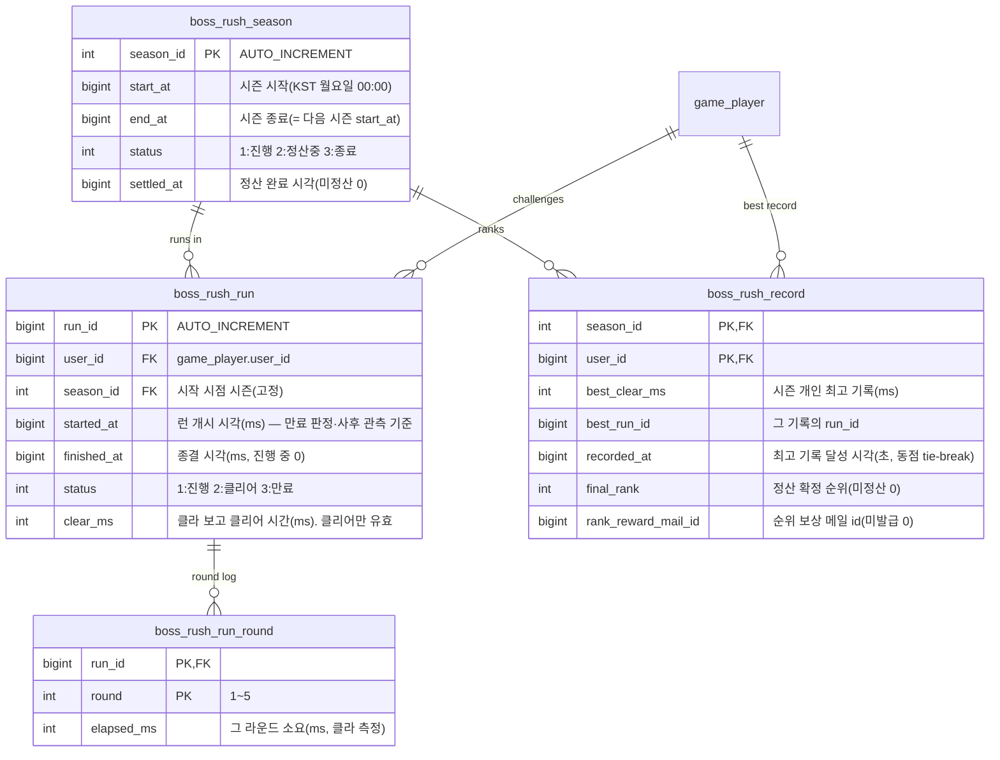

# 보스러시 / 랭킹 기획서

> 상위 문서: [서버 시스템 전체 개요](../서버-시스템-전체-개요.md) · 관련 도메인 4.12
>
> 본 문서는 **1~5지역의 보스 5종이 순차로 등장하는 도전 콘텐츠 "보스러시"** 와, 그 **클리어 시간으로 유저끼리 경쟁하는 랭킹 시스템**을 다룬다. 스테이지 진행·보상은 [스테이지/전투 결과 기획서](stage-battle-기획서.md), 보스 몬스터 정의는 [마스터 데이터 기획서](master-data/master-data-기획서.md)(`monster_master`), 순위 보상 지급은 [메일 기획서](mail-기획서.md)를 따른다.

## 목차

- [1. 개요](#1-개요)
- [2. 기능 설명](#2-기능-설명)
- [3. 요구사항](#3-요구사항)
- [4. 데이터 모델](#4-데이터-모델)
  - [4.1 마스터 테이블](#41-마스터-테이블)
  - [4.2 세이브 테이블(Game DB)](#42-세이브-테이블game-db)
  - [4.3 Redis 키 구성](#43-redis-키-구성)
- [5. API 명세](#5-api-명세)
  - [5.1 보스러시 정보 조회 — `POST /api/game/boss-rush/info`](#51-보스러시-정보-조회--post-apigameboss-rushinfo)
  - [5.2 도전 시작 — `POST /api/game/boss-rush/enter`](#52-도전-시작--post-apigameboss-rushenter)
  - [5.3 클리어 보고 — `POST /api/game/boss-rush/clear`](#53-클리어-보고--post-apigameboss-rushclear)
  - [5.4 랭킹 목록 조회 — `POST /api/game/boss-rush/rank`](#54-랭킹-목록-조회--post-apigameboss-rushrank)
  - [5.5 내 순위 조회 — `POST /api/game/boss-rush/my-rank`](#55-내-순위-조회--post-apigameboss-rushmy-rank)
  - [5.6 랭킹 캐시 적재(관리) — `POST /api/admin/boss-rush/rank/warmup`](#56-랭킹-캐시-적재관리--post-apiadminboss-rushrankwarmup)
- [6. 처리 흐름](#6-처리-흐름)
  - [6.1 도전 시작](#61-도전-시작)
  - [6.2 클리어 보고 처리](#62-클리어-보고-처리)
  - [6.3 랭킹 등재와 정본·캐시 이원화](#63-랭킹-등재와-정본캐시-이원화)
  - [6.4 시즌 정산 배치](#64-시즌-정산-배치)
  - [6.5 예외 / 엣지 케이스](#65-예외--엣지-케이스)
- [7. 에러 코드](#7-에러-코드)
- [8. 미결 사항 / TODO](#8-미결-사항--todo)
- [9. 참고](#9-참고)


## 1. 개요

- **목적**: 1~5지역의 보스 5종을 5라운드로 몰아 세운 도전 콘텐츠에서 **파티 전투력을 클리어 시간으로 환산**하고, 그 시간을 **주간 시즌 랭킹**으로 경쟁시킨다.
- **대상 서버**: `GameServer`(도전 런 관리·기록 등재·랭킹·시즌 정산), `TaskbarHero.Common`(보스러시·랭킹 DTO·에러 코드 공유). 인증은 AccountServer 발급 토큰을 GameServer 미들웨어가 검증한다.
- **범위 경계**:
  - **전투 시뮬레이션과 시간 측정 모두 클라이언트 권위**다. 서버는 보스를 재현하지 않고, **클리어 시간도 클라이언트가 측정해 보고한 값을 그대로 기록**한다([스테이지/전투 결과 기획서](stage-battle-기획서.md) §1의 클라 권위 전투 원칙을 시간 축까지 확장).
  - **서버의 책임은** "언제 누가 몇 번 도전했는지"의 원장 관리와 보고된 기록의 **형식 검증·등재·순위 산출·보상**이다. 기록의 진위는 검증하지 않는다.
  - **순위 보상의 지급 수단은 메일**이다([메일 기획서](mail-기획서.md) 6.4 발급 규약). 본 문서는 발급 트리거(시즌 정산)까지 책임진다.
  - **보스러시 자체는 재화·아이템을 지급하지 않는다.** 클리어 보고는 **기록만** 남기고, 모든 보상은 **시즌 순위 보상 메일**(1~3위)로만 나간다 — 라운드별·완주 보상이 없다.
- **관련 기획서**: [[stage-battle-기획서]] (보스·스테이지 진행), [[master-data-기획서]] (보스 몬스터·레벨 배율), [[mail-기획서]] (순위 보상 발급), [[save-data-기획서]] (파티 편성·진행도), [[trade-기획서]] (주기 배치 골격 선례), [[서버-시스템-전체-개요]] (도메인 4.12)

## 2. 기능 설명

- **콘텐츠 구조**: **5라운드 순차 도전**이다. 라운드 `r`은 **Act `r`의 전투를 한 판으로 압축**한 것으로, 그 지역의 **일반 몬스터 무리와 Act 보스가 함께** 등장한다 — 라운드 1 암흑 마법사(`9099`) → 라운드 2 스켈레톤 군주(`9199`) → 라운드 3 마왕(`9299`) → 라운드 4 몰락한 대천사(`9399`) → 라운드 5 공허의 지배자(`9499`)이며, 각 라운드의 일반 몬스터는 그 Act 대역의 코드(Act1 `90xx` · Act2 `91xx` · … · Act5 `94xx`)를 쓴다([마스터 데이터 값](master-data/master-data-값.md) §9).
- **등장 몬스터의 레벨은 스테이지와 별개**다. 어느 라운드에 **어떤 몬스터가 몇 레벨로 몇 마리** 나오는지는 보스러시 전용 마스터 `boss_rush_spawn`이 정한다(보스도 같은 테이블의 `is_boss = 1` 행). **레벨은 몬스터가 아니라 등장 자리의 속성**이라 같은 몬스터를 라운드마다 다른 레벨로 세울 수 있다. 실제 스탯은 클라이언트가 `monster_master`의 레벨 1 기준값에 레벨 배율(`hp × 1.25^(L-1)` · `attack × 1.18^(L-1)`)을 곱해 산출하며, 서버는 레벨만 내려준다([마스터 데이터 값](master-data/master-data-값.md) §9.4).
- **라운드 사이 회복이 없다.** 파티의 체력·쿨다운은 라운드를 넘어 이어지며 부활도 없다. **포탈 이동 중에도 회복하지 않는다.**
- **배경은 그 Act의 스테이지 배경을 재활용한다.** 라운드 `r`은 Act `r`의 전투이므로 배경도 그 지역 것을 그대로 쓴다(전용 배경을 만들지 않는다). `boss_rush_round.background_type`에 Act `r`의 `stage_master.background_type`과 **같은 값**을 넣는다(4.1).
- **라운드 전환은 포탈 이동 연출로 표현하며, 이는 클라이언트 영역이다.** 한 라운드를 깨면 포탈을 타고 다음 지역으로 넘어가는 연출을 클라이언트가 재생한다. 서버 계약에 영향이 없다 — `enter`가 5라운드 스폰 구성을 한 번에 내려주므로 **라운드 전환에 서버 호출이 없다**(5.2). 이 연출 시간은 **`clearMs`에 포함되지 않는다**(순수 전투 시간만 측정).
- **클리어 시간은 클라이언트가 잰다.** "첫 라운드 전투 시작"부터 "마지막 보스 처치"까지의 **순수 전투 시간**(라운드 전환 연출 제외)을 측정해 클리어 보고에 담고, 서버는 그 값을 기록으로 삼는다.
- **제한 시간이 없다.** 5라운드를 깨는 데 걸리는 시간에 상한을 두지 않는다 — 실플레이에서 파티는 시간을 다 쓰기 전에 **완주하거나 전멸하거나 둘 중 하나**라 제한 시간이 판정에 관여한 적이 없다. 서버가 보는 시간 상한은 **런 수명(`run_expire_sec`)** 하나뿐이며, 이것은 게임 룰이 아니라 버려진 런을 정리하는 원장 규칙이다(4.1·6.2).
- **해금**: **Act1 보스 스테이지(진행 순번 10) 클리어 이후** 열린다.
- **도전 횟수에 제한이 없다.** 원하는 만큼 다시 도전해 기록을 갱신할 수 있다 — 도전 자체로는 재화·아이템이 늘지 않으므로(보상이 시즌 순위 보상뿐이라, 아래) 횟수를 조여 얻을 것이 없다.
- **실패는 보고하지 않는다.** 5라운드를 다 깨지 못하면 클라이언트는 아무것도 보내지 않는다. 그 런은 런 수명이 지나면 **만료된 것으로 취급**되어 보고할 수 없다(6.2).
- **랭킹**: **주간 시즌**(KST 월요일 00:00 ~ 다음 월요일 00:00)마다 **개인 최고 기록 1건**이 등재된다. 같은 기록이면 **먼저 달성한 쪽이 상위**다. 시즌이 끝나면 **1~3위에게만** 순위 보상이 메일로 발급되고 다음 시즌이 자동으로 시작된다.
- **보상은 시즌 순위 보상뿐이다.** 라운드별·완주 보상이 없으므로 도전 자체로는 재화·아이템이 늘지 않는다. 1~3위가 받는 것은 **골드**뿐이다(4.1).

## 3. 요구사항

**기능 요구사항**

- 보스러시 해금 여부·현 시즌·내 최고 기록·진행 중 런을 한 번에 조회한다.
- 도전 시작 요청은 런을 개시한다(횟수 차감이 없다). 5라운드 스폰 구성(몬스터 코드·레벨·마리 수)을 응답에 담는다.
- 클리어 보고 요청은 **클라이언트가 측정한 시간**을 받아 형식을 검증한 뒤 그대로 기록하고 개인 최고 기록을 갱신한다(보상 지급 없음).
- 랭킹 조회는 **목록(페이지)** 과 **내 순위**를 별도 엔드포인트로 제공한다.
- 시즌이 끝나면 **1~3위에게 순위 보상 메일을 발급**하고 다음 시즌을 개시한다.
- 런 수명(`run_expire_sec`)이 지난 런은 **만료된 것으로 취급**해 클리어 보고를 거부한다(보상 없음).

**비기능 요구사항**

- **기록의 정본은 클라이언트 보고값**이다. 서버는 형식 검증(`clearMs` 범위·라운드 누락·중복·합계 일치)만 거쳐 기록하며 **진위를 판정하지 않는다.** 조작 방어는 **사후 관측 로그**(`finished_at − started_at`과 보고 기록의 괴리)에만 맡긴다 — 도전 횟수 상한을 없앴으므로 총량으로 조이는 방어가 없다. 보상이 시즌 순위 보상(골드)뿐이고 순위는 정산 시점에 고정되므로, 이 축소가 재화 경제에 파급되지 않는다.
- **보상은 시즌 정산에서만 나간다.** 클리어 보고는 기록만 남기므로 보고 내용이 재화·아이템에 영향을 주지 않는다. 순위 보상의 품목·수량은 서버가 마스터로 확정한다.
- **원자성**: "런 종결 + 최고 기록 갱신"은 하나의 `user_id` 단위 트랜잭션이다. 랭킹 캐시(Redis) 반영은 **커밋 이후**에 한다 — 캐시가 정본을 앞서면 롤백된 기록이 순위에 남는다.
- **랭킹 정본은 MySQL**, Redis Sorted Set은 **순위 조회 전용 캐시**다. Redis가 비었거나 죽어도 기록은 손실되지 않고, 조회는 MySQL 폴백으로 축소 운전한다(4.3·6.3).
- **동시성**: 같은 계정의 중복 `clear`는 런 행 잠금 + 조건부 상태 전이(`status=1`일 때만 종결)로 직렬화한다 — 뒤에 온 요청은 0행을 받아 `BossRushRunAlreadyFinished(13004)`가 되며 기록이 이중 처리되지 않는다. 거래소가 쓰는 것과 같은 방식이다([거래소 기획서](trade-기획서.md) 7.4).
- **랭킹 조회 성능**: 상위 목록은 `ZRANGE`(O(log N + M)), 내 순위는 `ZRANK`(O(log N))로 처리하고, 그 범위의 `user_id`에 대해서만 MySQL에서 닉네임·기록을 읽는다(`WHERE user_id IN (…)`, 최대 100건). 전체 정렬 스캔을 매 조회마다 하지 않는다.
- **만료 판정은 읽는 시점에 한다.** 버려진 런을 정리하는 배치를 두지 않는다 — 런 만료는 반송할 자산이 없어 배치가 할 일이 `status` 컬럼 정리뿐이므로, 런을 읽는 경로(`clear`·`info`·`enter`)가 `started_at` 나이를 함께 검사한다(거래소의 만료 판정 규약과 동일, [거래소 기획서](trade-기획서.md) 7.6).
- **배치 중복 실행 방지**: 시즌 정산 배치는 **BatchServer**(주기 배치 전담 워커) 1대에서만 돌므로 분산 락을 쓰지 않는다. 발화 시각은 진행 중 시즌의 `end_at`(절대 시각)이다. **랭킹 캐시 최초 적재는 배치가 아니라 관리 API**이고 호출자가 부트스트랩 스크립트 하나뿐이라 역시 락이 필요 없다(6.3).

## 4. 데이터 모델

### 4.1 마스터 테이블

정적·읽기 전용 정의이며 [마스터 데이터 기획서](master-data/master-data-기획서.md)의 파이프라인(원천 → 서버 인메모리 + 클라 번들)을 그대로 따른다. **아래 테이블 모두 클라이언트 번들에 포함**한다(몬스터 소환·라운드 배경·순위 보상 안내가 모두 클라 측에서 필요하다).

#### `boss_rush_master` — 콘텐츠 전역 규칙 (단일 행)

| 필드 | 타입 | 의미 |
|---|---|---|
| `content_id` | int PK | 고정 `1`(콘텐츠 단일) |
| `round_count` | int | 라운드 수(현재 5 = Act 수) |
| `unlock_stage_sequence` | int | 해금 요구 진행 순번(`max_stage_cleared` 기준). **10**(Act1 난이도1 보스) |
| `season_period_days` | int | 시즌 길이(일). **7** |
| `run_expire_sec` | int | **런 수명(초). 1800**(30분). `started_at + run_expire_sec`을 넘긴 런은 만료로 보고 클리어 보고를 거부한다(6.2). 게임 룰로서의 제한 시간이 아니라 **버려진 런을 정리하는 원장 규칙**이며, 동시에 보고 가능한 `clearMs`의 형식 상한이다 |
| `rank_page_limit` | int | 랭킹 조회 **1페이지 크기 상한**(행). **100**. 조회 가능한 **순위 범위에는 상한이 없다**(5.4) |

> 배치 주기처럼 **운영 파라미터**인 값은 마스터가 아니라 `appsettings`에 둔다(6.4).
>
> **제한 시간(`time_limit_sec`)과 일일 도전 횟수(`daily_entry_limit`)를 두지 않는다.** 전자는 실플레이에서 파티가 완주하거나 전멸하거나 둘 중 하나라 판정에 관여한 적이 없고, 후자는 **도전 보상이 없어진 뒤로 조일 대상이 사라졌다**(도전은 재화·아이템을 만들지 않는다). 남은 `run_expire_sec`은 원장 정리용이라 **클라이언트가 이 값으로 전투를 끊지 않는다** — 클라이언트는 전투 시간을 재기만 한다.

#### `boss_rush_round` — 라운드 정의

| 필드 | 타입 | 의미 |
|---|---|---|
| `round` | int PK | 라운드 번호(1~5). 라운드 `r`은 Act `r`에 대응한다 |
| `background_type` | int | 라운드 **배경 타입(1~5)**. 클라이언트가 이 코드로 배경 아트를 선택한다. **Act `r`의 스테이지 배경을 재활용**하므로 Act `r`의 `stage_master.background_type`과 같은 값이다 |

- **등장 몬스터는 자식 테이블 `boss_rush_spawn`이 정의한다**(아래). `stage_master` ↔ `stage_spawn`과 같은 부모-자식 구조이며, 반복 구조는 JSON 컬럼이 아니라 자식 테이블로 분리한다(설계 규칙).
- **마스터 검증 대상**: `background_type`은 **Act `r`의 `stage_master.background_type`과 일치**해야 한다 — 배경을 재활용하기로 확정한 값이라 두 곳이 어긋나면 마스터 오류다(2장).

#### `boss_rush_spawn` — 라운드별 등장 몬스터·레벨·마리 수

| 필드 | 타입 | 의미 |
|---|---|---|
| `round` | int PK | 부모(`boss_rush_round.round`) |
| `monster_code` | int PK | 등장 몬스터(`monster_master.monster_code`) |
| `monster_level` | int | **그 라운드에서 이 몬스터가 등장하는 레벨**(1 이상). 보스러시 전용 값 |
| `spawn_count` | int | 등장 마리 수(보스는 항상 1) |
| `is_boss` | tinyint | **보스 여부**(1=보스). 라운드당 최대 1행 |

- `(round, monster_code)` 복합 PK이며 `round`→`boss_rush_round`, `monster_code`→`monster_master`를 참조한다. **마리 수가 0인 조합은 행을 두지 않는다**(sparse).
- **보스도 같은 테이블의 `is_boss = 1` 행**이다(`stage_spawn`과 동일 방식).
- **마스터 검증 대상**: 라운드마다 `is_boss = 1` 행이 **정확히 1개**이고 그 코드는 해당 Act의 보스 코드(`9N99`)여야 하며, 일반 몬스터(`is_boss = 0`)는 그 Act 대역(`9N01`~`9N98`)의 코드여야 한다. `monster_level ≥ 1`·`spawn_count ≥ 1`.
- **난이도 기준(확정)**: 라운드 `r`은 **Act `r`의 보스 스테이지 한 판**과 같은 세기다. 그래서 **등장 레벨도 그 Act 보스 스테이지(`N-x-10`)와 같은 값**을 쓴다 — 일반 몬스터는 그 지역 `s7~10` 구간 레벨, 보스는 그 Act 보스 레벨([마스터 데이터 값](master-data/master-data-값.md) §9.4·§11-B). **마리 수만** 라운드 총 체력이 유지되도록 따로 잡는다(보스러시는 회복 없이 5라운드를 연속으로 미는 콘텐츠라 총 체력이 곧 클리어 가능성이다).

  | 라운드 | 구성 | 총 체력 | 최대 공격력 | 그 Act 보스 스테이지 대비 |
  |---|---|---|---|---|
  | R1 | `9001` Lv3×6 · `9002` Lv4×2 · `9099` Lv14×1 | 1,573 | 9 | 0.83배 |
  | R2 | `9101` Lv10×6 · `9102` Lv11×1 · `9199` Lv24×1 | 11,174 | 45 | 0.82배 |
  | R3 | `9201` Lv17×10 · `9299` Lv28×1 | 38,440 | 87 | 1.00배 |
  | R4 | `9301` Lv21×8 · `9399` Lv31×1 | 75,086 | 143 | 1.00배 |
  | R5 | `9401` Lv26×5 · `9499` Lv34×1 | 145,061 | 313 | 0.85배 |

  - **레벨을 손으로 올리지 말 것** — 배율이 지수(hp ×1.25^(L−1) · atk ×1.18^(L−1))라 한 레벨이 체력 25%다. 레벨을 바꾸면 **같은 작업에서 마리 수를 다시 맞춰 총 체력을 유지**하고, 시뮬레이터로 재측정한다(`.claude/skills/rebalance`).

#### `boss_rush_rank_reward` — 시즌 순위 보상

| 필드 | 타입 | 의미 |
|---|---|---|
| `rank_group` | int PK | 순위 구간 순번(1부터, 상위 구간이 작은 값) |
| `rank_from` | int | 구간 시작 순위(포함) |
| `rank_to` | int | 구간 끝 순위(포함) |
| `reward_gold` | bigint | 그 구간에 지급할 골드 |

- **순위 보상은 1~3위에게만, 골드로만 지급한다.** `rank_group` **3행**(`1`→1위 · `2`→2위 · `3`→3위, 각 구간이 `rank_from = rank_to`)만 두고 **4위 이하는 행을 두지 않는다**. 매칭되는 구간이 없으면 정산이 순위 보상을 발급하지 않으며, 보스러시에는 완주 보상도 없으므로 **4위 이하는 보상이 없다**(2장).
- **자식 테이블을 두지 않는다.** 구간당 지급 항목이 골드 하나라 반복 구조가 아니므로 `reward_type`·`reward_code` 없이 `reward_gold` 컬럼으로 충분하다. 메일 발급 시에는 `player_mail_reward` 1행(`reward_type=1` 골드 · `reward_code=0` · `quantity=reward_gold`)으로 첨부한다.
- **골드만 지급하므로 가방 칸을 쓰지 않는다** — 수령 단계에서 인벤토리 용량 실패가 발생하지 않는다(7장).
- 구간은 **겹치지 않고 빈틈이 없어야** 한다(1위부터 시작, `rank_from ≤ rank_to`, 다음 구간의 `rank_from = 이전 rank_to + 1`). 마스터 검증 대상. 등수별 골드 액수는 [마스터 데이터 값](master-data/master-data-값.md)에서 정한다.

### 4.2 세이브 테이블(Game DB)



**PK / 인덱스**

| 테이블 | PK / 인덱스 | 범위 |
|---|---|---|
| `boss_rush_season` | `season_id` PK, `start_at` 유니크, `(status, end_at)` 인덱스(정산 대상 탐색) | 전역(콘텐츠 시즌) |
| `boss_rush_run` | `run_id` PK, `(user_id, started_at)` 인덱스(진행 중 런 조회·내 이력) | 계정 도전 원장 |
| `boss_rush_run_round` | `(run_id, round)` PK | 런의 라운드 기록(자식, 클리어 시 5행) |
| `boss_rush_record` | `(season_id, user_id)` PK, `(season_id, best_clear_ms, recorded_at)` 인덱스(랭킹 MySQL 폴백·정산 정렬), `(season_id, final_rank)` 인덱스(종료 시즌 랭킹 조회) | 시즌별 계정 최고 기록(랭킹 정본) |

**테이블별 역할**

- **`boss_rush_season`** — 시즌의 정본. `status`를 조건부 갱신으로 전이시켜 정산 배치의 선점 단위로도 쓴다(6.4).
  - **첫 시즌 1행은 스키마 초기화 SQL이 심는다**(`docs/공통/db-schema.sql`, 시작 시각 = KST 직전 월요일 00:00 · 길이 `season_period_days`). 서버에는 첫 시즌을 여는 경로가 없다 — 정산 배치는 진행 중 시즌의 `end_at`이 지났을 때 **다음** 시즌만 개시하므로(6.4), 이 행이 없으면 새 환경에서 보스러시가 계속 `BossRushSeasonClosed(13007)`로 닫혀 있다.
- **`boss_rush_run`** — 도전 1회의 원장. **도전 횟수 제한이 없으므로 카운터 컬럼도, 날짜 경계 개념도 없다** — 행은 그저 "언제 누가 도전했는지"의 기록이다. `status`는 3값뿐이며(클리어 보고가 오면 `2`, 만료 판정에 걸리면 `3`) 실패 보고 경로가 없어 "실패" 상태를 두지 않는다. **`3`은 런을 읽는 경로가 lazy하게 기록**하므로 아무도 건드리지 않은 만료 런은 `1`로 남을 수 있는데, 모든 조회 경로가 나이를 함께 보기 때문에 기능상 차이가 없다(6.2). `started_at`·`finished_at`은 **만료 판정·사후 관측**용 서버 시각이고, 랭킹에 쓰이는 시간은 `clear_ms`(클라 보고)다. 자동 삭제하지 않는다.
- **`boss_rush_run_round`** — 라운드별 소요 시간(클라 측정). 합계가 `clear_ms`와 일치해야 한다(6.2). **몬스터 구성은 복사하지 않는다** — 그 라운드의 구성(보스 포함)은 `boss_rush_spawn`(마스터)이 정본이고 `round`로 언제든 찾을 수 있으므로, 보스 코드도 원장에 남기지 않는다.
- **`boss_rush_record`** — 시즌별 개인 최고 기록(랭킹 정본). 기록이 개선될 때만 UPSERT하고 `recorded_at`이 동점 tie-break 축이다. 정산 시 `final_rank`·`rank_reward_mail_id`를 채워 **재정산 멱등성**을 확보한다(채워진 행은 스킵). 행을 삭제하지 않으므로 **지난 시즌 랭킹을 기간 제한 없이 조회**할 수 있고, 그 순위는 `final_rank`로 고정돼 있다(6.3).

**공유 enum / DTO (TaskbarHero.Common)**
- 런 상태(`1:진행 2:클리어 3:만료`), 시즌 상태(`1:진행 2:정산중 3:종료`)를 공유 enum으로 두는 것을 **제안**한다.
- 보스러시 정보·시작·클리어·랭킹 응답 DTO는 `TaskbarHero.Common`에 공유 DTO로 두는 것을 **제안**한다(5장 스키마).
- `reward_type`(1:골드 2:아이템 3:재료)은 기존 공유 enum과 **동일 값**을 쓴다(값 변경 금지).

### 4.3 Redis 키 구성

랭킹 조회(5.4·5.5)는 **정상 경로에서 MySQL을 건드리지 않는다** — 순위·기록은 리더보드, 표시 이름은 닉네임 캐시, 시즌 메타는 시즌 캐시에서 나온다.

**리더보드** — `rank:bossrush:{seasonId}` (Sorted Set)

- **키**: `rank:bossrush:{seasonId}` — 시즌마다 별도 키. Sorted Set(CloudStructures `RedisSortedSet<long>`), **member = `userId`**.
- **점수 인코딩**: `score = best_clear_ms × 10^7 + (recorded_at − season.start_at)(초)`
  - **오름차순이 곧 순위**다(빠른 기록이 상위). 동점이면 하위 자리가 작은 쪽 = **먼저 달성한 쪽이 상위**.
  - 인코딩이 필요한 이유: Redis Sorted Set은 점수가 같으면 member(`userId`) 문자열 사전순으로 정렬하므로, tie-break를 점수 안에 넣지 않으면 "먼저 달성한 쪽이 상위"를 표현할 수 없다.
  - **tie-break 축은 유닉스초가 아니라 시즌 시작 기준 상대 초**다. 리더보드 키가 시즌마다 분리돼 있어 한 키 안의 비교는 전부 같은 시즌이고, 시즌 길이(7일 = 604,800초)가 `10^7`보다 한참 작아 하위 자리를 넘치지 않는다(정산이 밀려 시즌이 늘어져도 `10^7`초 ≈ 115일까지 여유) ✓.
  - **정밀도 검증**: Redis 점수는 IEEE 754 double이라 정수를 **2^53 ≈ 9.007 × 10^15** 까지 오차 없이 표현한다. 배수가 `10^7`이므로 `best_clear_ms`는 **약 9.0 × 10^8 ms(≈ 10일)** 까지 안전하며, 실제 상한인 런 수명(`run_expire_sec` 1800초 = 1,800,000ms)의 **500배**다 ✓.
  - **이 인코딩은 더 이상 클리어 시간 상한에 기대지 않는다.** 종전에는 배수가 `10^10`이라(하위 10자리를 유닉스초에 내줬다) `best_clear_ms`가 600,000ms를 넘으면 정밀도가 깨졌고, **그 제약이 곧 제한 시간의 근거**였다. tie-break를 시즌 상대 초로 바꿔 배수를 `10^7`로 낮추면서 그 결합을 끊었다.
  - **복원**: 표시용 기록 = `floor(score / 10^7)` (ms), 달성 시각 = `season.start_at + (score mod 10^7)` (초). 별도 조회 없이 점수만으로 되돌릴 수 있으며, 복원에 시즌 시작 시각이 필요하므로 **조회 경로가 리더보드와 시즌 메타를 항상 함께 다룬다**(아래 시즌 메타 캐시).
- **전 순위 구간을 페이징으로 노출한다**(5.4). `ZRANGE key start stop`은 **O(log N + M)** 이라(N=등재 인원, M=반환 행 수) 오프셋이 깊어져도 비용이 반환 크기에만 비례한다.
- **정본이 아니다.** Redis는 순위 조회를 위한 **파생 인덱스**이며, 유실되면 MySQL `boss_rush_record`에서 재구축한다(6.3).
- **TTL**: 진행 중 시즌 키에는 TTL을 두지 않는다. 시즌이 종료되면 정산 배치가 **7일 TTL**을 걸어 과거 키가 무한히 쌓이지 않게 한다(지난 시즌 조회는 그 기간 동안만 캐시로, 이후는 MySQL 폴백).

**닉네임 캐시** — `player:nickname` (Hash, field = `userId`, value = `nickname`)

- 랭킹 응답의 `nickname`을 채운다 — 한 페이지는 `HMGET player:nickname {userId…}`(최대 100 field) 한 번으로 끝난다.
- **시즌·콘텐츠 무관 전역 키**이며 TTL을 두지 않는다. 닉네임은 시즌과 관계없고, 시즌마다 복제하면 같은 데이터가 시즌 수만큼 늘어난다.
- **lazy 채움**: `HMGET`이 `nil`을 돌려준 `userId`만 `game_player`에서 조회해 `HSET`으로 메꾼다. 그래서 **재구축 배치가 필요 없고**, 캐시가 통째로 비어도 정확성이 유지된다(첫 조회가 채운다).
- **무효화 책임**: 닉네임은 최초 캐릭터 생성 시 정해지고 변경 API가 없어 write-once다. 훗날 닉네임 변경 기능이 생기면 **그 트랜잭션이 `HDEL player:nickname {userId}`** 로 무효화하고, 다음 조회의 lazy 채움에 맡긴다.

**현재 시즌 메타 캐시** — `bossrush:season:current` (Hash)

- 필드: `seasonId`·`startAt`·`endAt`·`status`. 랭킹 조회가 `seasonId`를 생략했을 때의 **현재 시즌 판정**과 응답의 `seasonStatus`·`seasonEndAt`을 이 값으로 채운다.
- 값이 단일 행이고 **변경 빈도가 주 1회**(+정산 중 `status` 전이)라 캐싱 조건이 좋다. 갱신 주체는 **시즌 정산 배치**(6.4)와 **랭킹 캐시 적재 관리 API**(6.3)이며, 둘 다 없어 키가 비어 있으면 랭킹 조회가 첫 조회에서 `boss_rush_season`을 읽어 채운다.
- **인메모리(프로세스 변수)로 두지 않는다** — scale-out 시 인스턴스마다 다른 시즌을 들고 있으면 응답이 갈린다.
- **`enter`·`clear`는 이 캐시를 쓰지 않는다.** 두 경로는 이미 MySQL 트랜잭션 안에 있어 `boss_rush_season`을 직접 읽는 편이 권위 있고, 정산 직후 캐시가 아직 갱신되지 않은 순간에는 랭킹 조회가 잠시 옛 시즌을 보여 주더라도 도전 개시는 `BossRushSeasonClosed(13007)`로 정확히 거부된다.
- **종료된 시즌을 `seasonId` 명시로 조회**하면 그 시즌 메타는 캐시에 없으므로 `boss_rush_season`을 1행 읽는다(뜨거운 경로가 아니라 캐싱하지 않는다).

**배치 락 키** — 없다. 시즌 정산은 BatchServer 1대에서만 돌아 잠글 상대가 없다.

## 5. API 명세

**API 목록**

- [5.1 보스러시 정보 조회 — `POST /api/game/boss-rush/info`](#51-보스러시-정보-조회--post-apigameboss-rushinfo)
- [5.2 도전 시작 — `POST /api/game/boss-rush/enter`](#52-도전-시작--post-apigameboss-rushenter)
- [5.3 클리어 보고 — `POST /api/game/boss-rush/clear`](#53-클리어-보고--post-apigameboss-rushclear)
- [5.4 랭킹 목록 조회 — `POST /api/game/boss-rush/rank`](#54-랭킹-목록-조회--post-apigameboss-rushrank)
- [5.5 내 순위 조회 — `POST /api/game/boss-rush/my-rank`](#55-내-순위-조회--post-apigameboss-rushmy-rank)
- [5.6 랭킹 캐시 적재(관리) — `POST /api/admin/boss-rush/rank/warmup`](#56-랭킹-캐시-적재관리--post-apiadminboss-rushrankwarmup)

Base URL(개발): `http://localhost:5247` (GameServer). 모든 API는 **POST**, 인증 요청 공통 형식 `{ userId, token, data }`, 응답 `{ success, errorCode, message, data }`([세이브 데이터 기획서](save-data-기획서.md) 5장과 동일 규약).

> **경로 규약**: 도메인 세그먼트는 kebab-case(`boss-rush`), 액션은 스테이지 도메인과 같은 `enter`/`clear` 짝을 쓴다.
>
> **실패 보고 엔드포인트를 두지 않는다.** 5라운드를 못 깨면 클라이언트는 아무것도 보내지 않고, 그 런은 런 수명이 지나 만료된다(6.2).

### 5.1 보스러시 정보 조회 — `POST /api/game/boss-rush/info`

보스러시 진입 화면에 필요한 **서버만 아는 값**을 한 번에 내려준다(보상표·순위 보상 구간 등 마스터에 있는 정적 표는 클라 번들로 그린다). **라운드 스폰 구성은 이 응답에 없다** — 도전 시작(5.2)이 내려준다.

**Request**
```json
{ "userId": 1, "token": "...", "data": {} }
```

**Response (성공, 200 OK)**
```json
{
  "success": true,
  "errorCode": 0,
  "message": "OK",
  "data": {
    "serverTime": 1755561600,
    "unlocked": true,
    "unlockStageSequence": 10,
    "maxStageCleared": 73,
    "season": { "seasonId": 12, "startAt": 1755450000, "endAt": 1756054800, "status": 1 },
    "myRecord": { "bestClearMs": 214380, "recordedAt": 1755470912, "rank": 37 },
    "activeRun": { "runId": 9912, "startedAt": 1755561240, "expiresAt": 1755563040 }
  }
}
```

- `unlocked`: `maxStageCleared >= unlockStageSequence`. `false`면 클라이언트는 진입 버튼을 잠그고 해금 조건을 안내한다.
- **도전 횟수·제한 시간 필드가 없다.** 횟수 제한이 없어졌으므로 잔여 횟수(`dailyEntryUsed`·`dailyEntryLimit`·`dailyResetAt`)를 내려줄 것이 없고, 제한 시간(`timeLimitMs`)도 없다 — 진입 화면은 해금 여부와 내 기록만 그린다.
- `myRecord`: 현 시즌 개인 최고 기록. 기록이 없으면 `null`. `rank`는 랭킹 캐시(`ZRANK`+1)로 얻으며, Redis 폴백 시에는 `null`로 내려 UI가 "순위 계산 불가"를 표시한다.
- `activeRun`: **아직 만료되지 않은** 진행 중 런(없으면 `null`). `expiresAt = startedAt + run_expire_sec`이며, 이 시각이 지난 런은 서버가 만료로 보고 `null`로 내려준다. 이 값은 **전투를 끊는 타이머가 아니라** 보고가 아직 받아들여지는 구간을 알리는 값이다.
- 오류: `SaveNotFound(2001)`(세이브 없음), `MasterDataNotLoaded(10001)`.

### 5.2 도전 시작 — `POST /api/game/boss-rush/enter`

런을 개시한다(차감할 횟수가 없다). 응답의 `runId`가 이후 클리어 보고의 키다.

**Request**
```json
{ "userId": 1, "token": "...", "data": {} }
```

- 요청에 **파라미터가 없다.** 라운드 구성·난이도는 전부 마스터 값이며 클라이언트가 고를 수 없다.

**Response (성공, 200 OK)**
```json
{
  "success": true,
  "errorCode": 0,
  "message": "Boss rush started",
  "data": {
    "runId": 9913,
    "seasonId": 12,
    "rounds": [
      {
        "round": 1,
        "backgroundType": 1,
        "monsters": [
          { "monsterCode": 9001, "monsterLevel": 1, "count": 6 },
          { "monsterCode": 9002, "monsterLevel": 1, "count": 3 }
        ],
        "boss": { "monsterCode": 9099, "monsterLevel": 1 }
      },
      {
        "round": 2,
        "backgroundType": 2,
        "monsters": [
          { "monsterCode": 9101, "monsterLevel": 1, "count": 6 },
          { "monsterCode": 9102, "monsterLevel": 1, "count": 3 }
        ],
        "boss": { "monsterCode": 9199, "monsterLevel": 1 }
      }
    ]
  }
}
```

- `rounds`: **5개 라운드 전부의 스폰 구성**을 한 번에 내려준다(예시는 지면상 2개만 표기). 라운드 전환이 전투 중에 일어나므로 라운드마다 서버를 다시 부르지 않는다.
- `monsters[]`: 그 라운드의 **일반 몬스터와 등장 레벨·마리 수**(`monsterCode`·`monsterLevel`·`count`). `boss`: 그 라운드의 **보스와 등장 레벨**. 서버가 `boss_rush_spawn`을 `is_boss`로 갈라 두 필드로 내려준다(스테이지 진입의 `monsters`/`boss` 규약과 동일).
- **스탯은 내려주지 않는다** — 클라이언트가 마스터 번들의 레벨 1 기준값(`monster_master.hp`·`attack`)에 레벨 배율을 곱해 산출한다.
- `backgroundType`: 그 라운드의 배경 타입(`boss_rush_round.background_type`) — Act `r`의 스테이지 배경과 같은 값이다. 라운드 전환의 포탈 이동 연출은 클라이언트가 이 목록만으로 재생한다(2장).
- **`timeLimitMs`를 내려주지 않는다.** 제한 시간이 없으므로 클라이언트는 시간을 **재기만 하고 끊지 않는다** — 도전은 5라운드를 다 깨거나 파티가 전멸할 때 끝난다.
- **`startedAt`은 내려주지 않는다.** `started_at`은 서버가 만료 판정·사후 관측에 쓰는 내부 값이며(4.2), 진행 중 런이 언제까지 보고 가능한지는 `info`(5.1)의 `activeRun.expiresAt`이 알려 준다.
- **기존 진행 중 런이 있으면 자동으로 만료 종결**한 뒤 새 런을 시작한다(6.5). 종결된 런은 보상 없이 `status=3`이 되며, 잃는 것은 그 런의 진행뿐이다(차감된 횟수가 없다).
- 오류: `BossRushLocked(13001)`, `BossRushSeasonClosed(13007)`, `SaveNotFound(2001)`, `MasterDataNotLoaded(10001)`.

### 5.3 클리어 보고 — `POST /api/game/boss-rush/clear`

5라운드를 모두 클리어했음을 알리고 **클라이언트가 측정한 클리어 시간**을 보고한다. 서버는 형식을 검증한 뒤 그 값을 기록으로 등재한다. **보상 지급은 없다** — 보스러시의 보상은 시즌 정산의 순위 보상뿐이다(2장).

**Request**
```json
{
  "userId": 1, "token": "...",
  "data": {
    "runId": 9913,
    "clearMs": 214380,
    "rounds": [
      { "round": 1, "elapsedMs": 18240 },
      { "round": 2, "elapsedMs": 27110 },
      { "round": 3, "elapsedMs": 41660 },
      { "round": 4, "elapsedMs": 55020 },
      { "round": 5, "elapsedMs": 72350 }
    ]
  }
}
```

- `clearMs`: **클라이언트가 측정한 총 클리어 시간**(ms). 첫 라운드 전투 시작부터 마지막 보스 처치까지의 순수 전투 시간이며, **이 값이 곧 랭킹 점수**다.
- `rounds[].elapsedMs`: 라운드별 소요(누적이 아니라 라운드별). `round_count`(5)개가 1~5 전부 있어야 하고, **합계가 `clearMs`와 일치해야 한다.**
- **`clearMs`에 게임 룰상의 상한이 없다.** 서버가 보는 유일한 상한은 **런 수명(`run_expire_sec`)** 이며, 런이 열려 있던 시간보다 긴 클리어 시간은 자기모순이라 형식 검증에서 걸러진다(6.2).

**Response (성공, 200 OK)**
```json
{
  "success": true,
  "errorCode": 0,
  "message": "Boss rush cleared",
  "data": {
    "runId": 9913,
    "seasonId": 12,
    "clearMs": 214380,
    "isNewRecord": true,
    "bestClearMs": 214380,
    "rank": 37
  }
}
```

- `isNewRecord`: 이번 기록이 시즌 개인 최고를 갱신했는지. `bestClearMs`는 갱신 후 최고 기록, `rank`는 갱신 후 순위(Redis 폴백 시 `null`).
- **재화·아이템을 지급하지 않으므로 `rewards`·`characters`·`balance`·`inventoryDelta`가 없다.** 이 호출이 바꾸는 것은 런 상태와 시즌 최고 기록뿐이다.
- 오류: `BossRushRunNotFound(13003)`, `BossRushRunAlreadyFinished(13004)`, `BossRushInvalidProgress(13006)`, `InvalidRequest(1006)`(`clearMs`·`rounds` 형식 오류).

### 5.4 랭킹 목록 조회 — `POST /api/game/boss-rush/rank`

시즌 랭킹의 한 페이지를 내려준다. **뷰어와 무관한 데이터**로, 같은 `(seasonId, offset, limit)`이면 누가 불러도 같은 결과다. **내 순위는 이 응답에 실리지 않는다**(5.5로 분리).

**Request**
```json
{ "userId": 1, "token": "...", "data": { "seasonId": 12, "offset": 0, "limit": 50 } }
```

- `seasonId` 생략 시 **현재 시즌**. **종료된 시즌은 기간 제한 없이 조회할 수 있다** — `boss_rush_record`가 시즌별로 무기한 보존되고 정산이 `final_rank`를 확정해 두기 때문이다. Redis 캐시(7일 TTL)가 만료된 뒤에는 MySQL에서 `final_rank`를 그대로 읽는다(`source=2`, 6.3).
- **전체 등재 유저를 페이징으로 조회한다 — 노출 순위에 상한이 없다.** 1위부터 꼴찌까지 어느 구간이든 `offset`으로 넘겨 볼 수 있다(4.3).
- **`limit`(페이지 크기)만 clamp한다** — 1~`rank_page_limit`(100). `offset`은 `0` 미만이면 `0`으로 보정하고, `totalEntries` 이상이면 `entries`가 빈 배열이 된다(오류가 아니다).
- **커서가 아니라 오프셋 페이징**을 쓴다. 클라이언트는 `totalEntries`와 `limit`으로 총 페이지 수를 계산한다.
- **내 순위 페이지로 점프**: 내 순위 조회(5.5)의 `myRank.rank`로 `offset = floor((rank - 1) / limit) × limit`을 계산해 이 API를 호출한다(서버는 페이지 번호를 계산해 주지 않는다).

**페이징 일관성 규약**

- **페이지 교체형 UI를 전제한다.** 클라이언트는 받은 페이지를 **이어붙이지 않고 교체**한다 — 스크롤로 페이지를 넘겨도 화면에는 **현재 페이지만** 둔다. 그래서 페이지 간 중복 제거 로직이 클라이언트에 필요하지 않다.
- **페이지 간 스냅샷은 보장하지 않는다.** 각 페이지는 조회 시점의 최신 상태이고 페이지끼리는 시점이 다르므로, 페이지를 넘기는 사이 랭킹이 갱신되면 중복·누락이 생길 수 있다(6.5). 페이지 교체형 UI에서는 표시되는 순위 번호가 항상 연속이라 이 불일치가 화면에 드러나지 않는다.
- **이전 페이지를 캐시하지 않는다.** 스크롤을 위로 되돌리면 재조회하며, 그때 순위가 달라져 있는 것은 정상 동작이다.
- **`source`가 페이지 간에 바뀌면 처음부터 재조회한다** — Redis 경로와 MySQL 폴백은 반영 지연이 달라 경계가 크게 어긋날 수 있다.
- **`totalEntries`는 매 응답 값을 쓴다.** 페이지를 넘기는 사이 등재 인원이 늘 수 있으므로 "마지막 페이지" 판정을 클라이언트가 캐시한 값으로 하지 않고, **매 응답의 `totalEntries`와 반환된 `entries` 길이**(빈 배열이면 끝)로 다시 판단한다.

**Response (성공, 200 OK)**
```json
{
  "success": true,
  "errorCode": 0,
  "message": "OK",
  "data": {
    "seasonId": 12,
    "seasonStatus": 1,
    "seasonEndAt": 1756054800,
    "totalEntries": 1842,
    "offset": 0,
    "limit": 50,
    "source": 1,
    "entries": [
      { "rank": 1, "userId": 88, "nickname": "질풍", "clearMs": 121400, "recordedAt": 1755455102 },
      { "rank": 2, "userId": 41, "nickname": "무명", "clearMs": 121400, "recordedAt": 1755461330 }
    ]
  }
}
```

- 순위는 **1부터**이며 오름차순(빠른 기록이 1위)이다. 위 예시처럼 `clearMs`가 같으면 `recordedAt`이 작은 쪽이 상위다(4.3 인코딩).
- `totalEntries`: 시즌 등재 인원(`ZCARD`, 폴백 시 `COUNT(*)`).
- `source`: **순위를 어디서 산출했는지**를 가리킨다 — `1`=랭킹 캐시(Redis `ZRANGE`) `2`=MySQL 폴백(`ORDER BY … LIMIT/OFFSET`). 클라이언트는 폴백일 때 "순위 반영이 지연될 수 있음"을 표시한다.
  - **닉네임 캐시 미스나 종료 시즌 메타 조회로 MySQL을 한 번 거쳐도 `source`는 `1`이다.** 이 값은 "MySQL을 접근했는가"가 아니라 **순위 산출의 출처**를 뜻한다 — 순위가 ZSET에서 나왔다면 부수 조회가 있었든 `1`이다.
- 오류: `BossRushSeasonClosed(13007)`(존재하지 않는 `seasonId`), `MasterDataNotLoaded(10001)`.

### 5.5 내 순위 조회 — `POST /api/game/boss-rush/my-rank`

요청자 본인의 시즌 순위 1건을 내려준다. 랭킹 UI의 **고정 영역**(하단 "내 순위" 바)이 쓰는 값이며, 목록 페이지를 넘기는 동안 다시 호출할 필요가 없다.

**Request**
```json
{ "userId": 1, "token": "...", "data": { "seasonId": 12 } }
```

- `seasonId` 생략 시 **현재 시즌**(5.4와 같은 규칙).

**Response (성공, 200 OK)**
```json
{
  "success": true,
  "errorCode": 0,
  "message": "OK",
  "data": {
    "seasonId": 12,
    "totalEntries": 1842,
    "source": 1,
    "myRank": { "rank": 37, "userId": 1, "nickname": "테스터", "clearMs": 214380, "recordedAt": 1755470912 }
  }
}
```

- `myRank`: **기록이 없으면 `null`**(그 시즌에 한 번도 완주하지 않은 계정).
- `totalEntries`: 시즌 등재 인원("1,842명 중 37위" 표시용).
- `source`: **순위 산출 출처**(5.4와 같은 정의) — `1`=랭킹 캐시(Redis `ZRANK`) `2`=MySQL 폴백(`COUNT(*)` 기반, 6.3). 닉네임 캐시 미스로 MySQL을 거쳐도 `1`이다.
- **시즌 메타(`seasonStatus`·`seasonEndAt`)는 담지 않는다** — `info`(5.1)·`rank`(5.4)가 이미 내려준다. `seasonId`는 생략 호출 시 어느 시즌이 답했는지 확인하는 용도다.
- 오류: `BossRushSeasonClosed(13007)`(존재하지 않는 `seasonId`), `MasterDataNotLoaded(10001)`.

### 5.6 랭킹 캐시 적재(관리) — `POST /api/admin/boss-rush/rank/warmup`

랭킹 캐시(리더보드 ZSET + 시즌 메타)를 정본에서 최초 적재한다. **게임 클라이언트가 부르는 API가 아니다** — 호출 주체는 부트스트랩 스크립트 `python server_up_with_docker.py`이며, 서버는 이 적재를 기동 시 스스로 하지 않는다(6.3).

**인증**: 게임 토큰이 아니라 `X-Admin-Key` 헤더(설정 `Admin:ApiKey`). 키가 설정돼 있지 않으면 엔드포인트가 **404로 닫힌다**.

**요청**: body 없음. 쿼리 `?force=true`(선택)면 리더보드가 이미 채워져 있어도 다시 적재한다.

**응답** — 게임 API와 형식이 다르다(`errorCode`를 쓰지 않는다).

```json
{
  "success": true,
  "message": "Boss rush rank cache warmup done",
  "data": { "status": "restored", "seasonId": 12, "restored": 1842, "members": 1842 }
}
```

- `status`: `no-season`(진행 중 시즌 없음) · `already-warm`(이미 채워져 있어 건너뜀) · `restored`(MySQL에서 재구축) · `cache-unavailable`(Redis 접근 실패 또는 부분 적재).
- `restored`: 이번 호출에서 리더보드에 넣은 기록 수. `members`: 적재 후 등재 인원(`ZCARD`).
- HTTP 상태: `200` 성공 · `401` 키 불일치 · `404` 관리 API 미설정 · `503` `cache-unavailable`(스크립트가 실패로 본다).
- **멱등**하다 — 몇 번을 호출해도 결과가 같다(ZADD는 `userId` 단위 덮어쓰기, 점수는 기록에서 결정론적 계산).

## 6. 처리 흐름

### 6.1 도전 시작

```
요청 수신 → 토큰 검증(미들웨어)
트랜잭션(BEGIN, user_id 잠금)
  1) gp = game_player[userId]                       # 없으면 SaveNotFound(2001)
  2) m  = boss_rush_master
     if gp.max_stage_cleared < m.unlock_stage_sequence: BossRushLocked(13001)
  3) season = boss_rush_season[status = 1]          # 진행 중 시즌
     if season is null: BossRushSeasonClosed(13007) # 정산 중이면 잠시 후 재시도
  4) 진행 중 런이 있으면 자동 만료 종결(status = 3, 보상 없음)   # 나이와 무관하게 정리
  5) INSERT boss_rush_run(user_id, season_id, started_at = now_ms, status = 1)
COMMIT → { runId, seasonId, rounds(boss_rush_round + boss_rush_spawn) }
```

- **횟수 검증 단계가 없다.** 도전 횟수에 상한이 없으므로 세는 것도, 차감하는 것도 없다. 그래도 `user_id` 잠금은 유지한다 — 4)의 자동 만료 종결과 5)의 INSERT가 같은 잠금 안에 있어야 **동시 `enter` 두 건이 진행 중 런을 두 개 만들지 않는다.**

### 6.2 클리어 보고 처리

```
트랜잭션(BEGIN, boss_rush_run 행 잠금)
  1) run = boss_rush_run[runId]  (SELECT ... FOR UPDATE)
     if run is null or run.user_id != userId: BossRushRunNotFound(13003)
     if run.status != 1:                      BossRushRunAlreadyFinished(13004)
     # 만료 판정(읽는 시점) — 런 수명을 넘긴 런은 더 이상 보고할 수 없다
     if run.started_at + m.run_expire_sec × 1000 < now_ms:
         UPDATE boss_rush_run SET status = 3, finished_at = now_ms WHERE run_id = ? AND status = 1
         COMMIT; return BossRushRunAlreadyFinished(13004)
  2) 형식 검증(진위 판정 아님):
     - clearMs > 0                                                아니면 InvalidRequest(1006)
     - clearMs <= m.run_expire_sec × 1000                          아니면 BossRushInvalidProgress(13006)
     - rounds가 1..round_count 전부, 중복 없음, elapsedMs > 0       아니면 BossRushInvalidProgress(13006)
     - sum(rounds.elapsedMs) == clearMs                            아니면 BossRushInvalidProgress(13006)
  3) 종결(조건부 갱신): UPDATE boss_rush_run SET status = 2, finished_at = now_ms, clear_ms = clearMs
                        WHERE run_id = ? AND status = 1
     → 0행이면 BossRushRunAlreadyFinished(13004)   # 동시 중복 요청의 패자
     INSERT boss_rush_run_round × round_count       # 라운드별 소요
     # 사후 관측: (finished_at - started_at) 과 clearMs 의 괴리를 Information 로그로 남긴다(판정 아님)
  4) 기록 갱신(조건부 UPSERT):
           INSERT boss_rush_record(season_id, user_id, best_clear_ms = clearMs, best_run_id, recorded_at = now_sec)
           ON DUPLICATE KEY UPDATE ... WHERE 기존 best_clear_ms > clearMs      # 개선된 경우만
           isNewRecord = 영향 행 존재
           # 런의 시즌이 더 이상 진행 중이 아니면 이 단계를 생략한다(6.5)
COMMIT
  5) 커밋 이후(랭킹 반영·순위 산출):                                    # ★ 커밋 후
     if isNewRecord: ZADD rank:bossrush:{seasonId} score(bestClearMs, recordedAt − season.start_at) userId
     rank = ZRANK rank:bossrush:{seasonId} userId + 1                  # 갱신 후 상태에서 순위 계산
     (Redis 접근 실패 시 rank = null — 기록은 이미 확정되어 있다)
→ { clearMs, isNewRecord, bestClearMs, rank }
```

- **2)는 형식·자기정합성 검증뿐이다.** 보고된 시간의 진위는 판정하지 않는다. 합계 불일치는 클라이언트 버그로 보고 기록을 남기지 않는다.
- **`clearMs` 상한은 게임 룰이 아니라 자기정합성 검사다.** 런이 열려 있던 시간(`run_expire_sec`)보다 긴 클리어 시간은 그 자체로 앞뒤가 맞지 않으므로 `BossRushInvalidProgress(13006)`로 묶는다. 이 검사는 **런을 종결시키지 않는다** — 클라이언트가 값을 잘못 계산했다면 런 수명 안에서는 재보고가 통해야 한다. 동시에 이 상한이 **랭킹 점수 인코딩의 안전 여유**를 보장한다(4.3).
- **만료 판정은 배치가 아니라 이 경로(1단계)가 한다.** 런 수명을 넘긴 런은 여기서 `status = 3`으로 종결하고 보고를 거부한다(**lazy 만료**) — 만료된 런에는 반송할 자산이 없어 배치가 할 일이 컬럼 정리뿐이고, 오래된 런으로 보상을 청구하는 경로만 막으면 충분하다(거래소의 만료 판정 규약과 동일, [거래소 기획서](trade-기획서.md) 7.6). `enter`(6.1 5단계)와 `info`(5.1 `activeRun`)도 같은 기준으로 나이를 본다.
- **3)의 사후 관측은 판정에 쓰이지 않는다.** `finished_at − started_at`(서버가 본 왕복 경과)과 `clearMs`의 괴리를 로그로 남겨 이상치 분포를 관측한다.
- **순위 산출 순서는 "MySQL 확정 → Redis 갱신 → `ZRANK`"** 다. **5)는 반드시 커밋 이후**여야 한다(트랜잭션 안에서 ZADD하면 롤백된 기록이 랭킹에 남고 Redis에는 롤백이 없다).
- **기록을 갱신하지 못했어도 `rank`는 내려준다.** `isNewRecord`가 `false`면 ZADD만 건너뛰고 `ZRANK`는 수행하므로 `rank`는 항상 **기존 최고 기록 기준 현재 순위**다.

### 6.3 랭킹 등재와 정본·캐시 이원화

- **정본은 MySQL `boss_rush_record`.** 기록 등재는 클리어 트랜잭션 안에서 조건부 UPSERT로 확정되므로, Redis가 죽어 있어도 기록이 유실되지 않는다.
- **Redis Sorted Set은 순위 조회 전용 파생 인덱스.** MySQL로 순위를 세면 `COUNT(*) WHERE best_clear_ms < ?` 스캔이 등재 인원에 비례해 무거워지지만 `ZRANK`는 O(log N)이다.
- **정상 경로의 랭킹 조회는 Redis 단독이다.** 목록(5.4)은 `ZRANGE ... WITHSCORES` + `ZCARD` + `HMGET player:nickname`, 내 순위(5.5)는 `ZRANK` + `ZSCORE` + `ZCARD` + `HMGET`(1 field)로 끝난다. 시즌 메타는 `bossrush:season:current`에서 읽는다(4.3). **MySQL은 캐시 미스·폴백·종료 시즌 조회에서만** 개입한다.
- **캐시 최초 적재(워밍업)는 서버 밖에서 지시한다.** 관리 API `POST /api/admin/boss-rush/rank/warmup`(`X-Admin-Key` 헤더)이 `EXISTS rank:bossrush:{현시즌}`을 확인하고 없으면 `boss_rush_record`를 페이지 단위(500)로 읽어 ZADD로 재구축하며(점수 인코딩에 그 시즌의 `start_at`이 필요하므로 시즌 행을 함께 들고 있는다, 4.3), `bossrush:season:current`도 같은 호출에서 `boss_rush_season`에서 적재한다. **닉네임 캐시는 적재 대상이 아니다** — lazy로 채워진다(4.3).
  - **호출 주체는 부트스트랩 스크립트**(`python server_up_with_docker.py`)다. 컨테이너·서버를 띄우고 헬스 체크를 통과한 뒤 이 엔드포인트를 한 번 호출한다 — **서버는 기동 시 스스로 적재하지 않는다.**
  - **왜 배치에서 뺐나**: 예전에는 시즌 정산 배치가 Redis 리더 락을 쥔 채 매 주기 앞단에서 이 일을 했다. 락을 재활용해 scale-out 중복 재구축을 막을 수 있었지만, **적재 시점이 배치 주기에 묶여 보이지 않았고**(캐시가 비어 있는 동안 조회가 조용히 MySQL 폴백으로 돌았다) 서버 기동 절차와 적재 절차가 한 프로세스 안에 섞여 있었다. 지금은 적재가 **기동 절차의 명시적인 한 단계**이며, 호출자가 스크립트 하나로 정해지므로 중복 재구축을 막을 분산 락이 필요하지 않다.
  - **몇 번을 호출해도 안전하다**(멱등). 정본이 MySQL이고 ZADD는 `userId` 단위 덮어쓰기이며 점수는 기록에서 결정론적으로 계산된다. `?force=true`면 리더보드가 이미 채워져 있어도 다시 적재한다.
  - **적재 로직은 서버 코드에만 둔다.** 스크립트가 MySQL·Redis에 직접 붙어 ZADD하면 점수 인코딩과 키 이름이 두 언어에 복제돼 조용히 어긋나므로, 스크립트는 "적재하라"고 지시만 하고 결과(`status`·`restored`·`members`)를 읽어 성공/실패만 판정한다.
  - **응답 `status`**: `no-season`(진행 중 시즌 없음) · `already-warm`(이미 채워져 있어 건너뜀) · `restored`(재구축) · `cache-unavailable`(Redis 접근 실패 또는 부분 적재 — HTTP 503, 스크립트가 실패로 본다).
- **폴백(축소 운전)**: Redis 접근이 실패하면 랭킹 조회를 MySQL로 처리한다 — `SELECT ... ORDER BY best_clear_ms, recorded_at LIMIT ? OFFSET ?`가 `(season_id, best_clear_ms, recorded_at)` 인덱스를 그대로 타므로 정렬·필터가 인덱스 안에서 끝난다. 내 순위는 `COUNT(*) WHERE (best_clear_ms, recorded_at) < (내 값)` + 1로 계산한다. 응답 `source=2`로 알린다.
- **종료된 시즌은 순위를 재계산하지 않는다.** 정산이 `final_rank`를 확정해 뒀으므로 `ORDER BY final_rank`로 그대로 읽는다(`(season_id, final_rank)` 인덱스). 그래서 지난 시즌 랭킹은 **캐시 TTL이 지난 뒤에도 기간 제한 없이** 조회되며, 값은 정산 시점에 고정된 최종 순위다.
  - **폴백에서만 깊은 오프셋이 비싸다**(`OFFSET`은 건너뛸 행을 실제로 읽는다). 그래도 조회 범위를 제한하지 않으며, 규모가 커져 문제가 되면 **폴백 경로에만** keyset 페이징을 얹는다.
- **캐시가 정본을 앞서지 않는다**: ZADD는 언제나 커밋 이후에만 한다(6.2 5단계). ZADD가 실패해도 응답은 성공이며(`rank: null`), 다음 재적재(관리 API)나 정산이 캐시를 정본에 맞춘다.
- **표시 이름**: `entries[].nickname`·`myRank.nickname`은 `HMGET player:nickname`으로 채우고, `nil`이 온 `userId`만 `game_player`를 조회(`WHERE user_id IN (…)`)해 `HSET`으로 백필한다. **기록 행(`boss_rush_record`)에 닉네임을 스냅샷하지 않는다** — 정본은 `game_player.nickname` 하나이고 Redis 해시는 그 파생 캐시다.

### 6.4 시즌 정산 배치

`BossRushSeasonBatchScheduler`(`PeriodicBatchScheduler` 상속, BatchServer 프로세스. 발화 시각은 진행 중 시즌의 `end_at`이고, 진행 중 시즌이 없을 때의 재확인 간격만 `appsettings`의 `BossRushSeasonBatch:IntervalSeconds` 기본 **600초**).

```
0) 이어받기: SELECT ... WHERE status = 2 → 있으면 그 시즌부터(직전 정산이 완주하지 못했다는 뜻)
   단, 한 건도 확정하지 못한 이어받기가 5회 연속되면 자동 복구를 멈추고 Error로 알린다
1) 대상 선점(0)이 없을 때): UPDATE boss_rush_season SET status = 2 WHERE status = 1 AND end_at <= now
   → 0행이면 정산할 시즌 없음(종료)
2) 순위 부여·보상 발급(페이지 단위 반복, 각 페이지가 1트랜잭션):
   SELECT ... FROM boss_rush_record WHERE season_id = ? AND final_rank = 0
     ORDER BY best_clear_ms, recorded_at LIMIT BatchSize
   for 각 행(순위 = 전체 정렬에서의 위치):
       group = boss_rush_rank_reward 중 rank_from <= 순위 <= rank_to 인 구간
       if group 있음:
           mailId = 메일 발급(템플릿 501, 파라미터: 시즌 번호·순위, 첨부 = 골드 group.reward_gold 1건)
       UPDATE boss_rush_record SET final_rank = 순위, rank_reward_mail_id = mailId(없으면 0)
             WHERE season_id = ? AND user_id = ? AND final_rank = 0      # 멱등
3) 다음 시즌 개시: INSERT boss_rush_season(start_at = 이전 end_at, end_at = start_at + season_period_days,
                    status = 1)   # 이미 있으면 스킵(유니크 (start_at))
   HSET bossrush:season:current {seasonId, startAt, endAt, status}   # 시즌 메타 캐시 갱신(4.3)
   새 시즌 ZSET은 첫 기록이 등재될 때 자연히 생긴다(사전 생성 불필요)
4) 종료 처리: UPDATE boss_rush_season SET status = 3, settled_at = now WHERE season_id = ?
   EXPIRE rank:bossrush:{seasonId} 7일
```

- **2)가 완주하지 못하면 3)·4)로 가지 않는다** — 시즌을 `status=2`로 남겨 다음 발화가 0)에서 이어받는다.
  3)을 4)보다 앞에 두는 것도 같은 이유다: 그 사이에서 죽어도 `status=2`인 시즌이 남아 복구 진입점이 된다
  (순서를 뒤집으면 "종료됐는데 다음 시즌이 없는" 상태가 되고 복구 진입점이 사라진다).
- **멱등성**: `final_rank = 0` 조건이 재진입 시 이미 처리한 행을 건너뛴다. 배치가 중간에 죽어도 다음 주기가 남은 행만 이어서 처리한다.
- **이어받기 재시도는 5회까지**(`BatchSettingConstants.BossRushSeason.MaxRecoveryAttempts`). 재기동·DB 순단이 원인이면 첫 시도에서 끝나고, 5회를 채워도 **한 건도 확정하지 못하는 원인은 코드·데이터 결함이라 계속 돌려도 낫지 않는다** — 무한 재시도는 정산 쿼리로 DB를 계속 두드려 장애를 키운다. 상한에 닿으면 시즌을 `status=2`로 남긴 채 자동 복구를 멈추고 Error 로그로 사람을 부른다(원인을 고친 뒤 배치를 다시 띄우면 이어서 정산한다). 확정이 한 건이라도 있으면 진전이 있는 것이라 횟수를 0으로 되돌린다.
- **`status=2`(정산중) 구간에는 새 런을 받지 않는다**(`BossRushSeasonClosed(13007)`) — 순위 확정 후 더 좋은 기록이 등재되는 경합을 막는다. `enter`는 이 판정을 캐시가 아니라 `boss_rush_season`에서 직접 읽는다(4.3).
- **시즌 메타 캐시 갱신은 정산의 마지막 단계**(4단계)다. 갱신 전 짧은 구간에는 랭킹 조회가 옛 시즌을 보여줄 수 있으나, 그 시즌 ZSET·기록은 그대로 유효하므로 응답 자체는 정합하다.
- **순위 보상 메일은 시즌당 3건**이다(1~3위만, 4.1). 4위 이하는 `final_rank`만 확정되고 `rank_reward_mail_id = 0`으로 남는다.
- **메일 발급은 [메일 기획서](mail-기획서.md) 6.4 규약**을 따른다 — 배치가 넘기는 것은 `(user_id, mail_template_code=501, 파라미터, 첨부 목록)`뿐이다. `player_mail` INSERT는 순위 확정 UPDATE와 **같은 트랜잭션**이다.
- **신규 메일 템플릿 501**(카테고리 `5`:랭킹, `valid_days = 7`)이 필요하다 → [메일 기획서](mail-기획서.md) 4장·[마스터 데이터 값](master-data/master-data-값.md) 부록에 추가한다.

### 6.5 예외 / 엣지 케이스

- **진행 중 런이 남은 상태로 재접속**: 정보 조회의 `activeRun`으로 상태를 알린다. 유저는 이어서 도전하거나(런 수명 안이면) 그냥 새로 `enter`를 부르면 되고, 후자의 경우 남은 런이 자동 만료 종결된다 — 횟수 차감이 없으므로 유저가 잃는 것이 없다.
- **클리어했는데 보고가 실패(네트워크 끊김)**: 런 수명(`run_expire_sec` 30분) 안이면 **재시도가 그대로 성공한다**. 그 구간을 넘기면 만료 판정에 걸려 기록이 남지 않는다 — 다시 도전하면 되고, 횟수를 잃지도 않는다.
- **시즌 경계에 걸친 런**: 런의 `season_id`는 **시작 시점 시즌으로 고정**된다. `clear` 시 그 시즌이 이미 진행 중이 아니면 **기록 등재를 생략**한다(응답의 `isNewRecord`는 `false`, `rank`는 `null`). 런 수명이 30분이라 이 경합은 시즌 경계 30분 전 이후에 시작한 런에만 생긴다.
- **동시 중복 `clear`**: 조건부 상태 전이(`status=1`일 때만)의 행 잠금으로 직렬화 — 뒤에 온 요청은 0행을 받아 `BossRushRunAlreadyFinished(13004)`가 되고 기록이 이중 처리되지 않는다.
- **파티 구성 변경**: 런 도중 파티를 바꿔도 서버는 막지 않는다(전투는 클라 권위). 보상이 없으므로 파티 구성이 서버 처리에 영향을 주지 않는다.
- **페이징 중 랭킹이 갱신되는 경우**: 리더보드의 변화는 **기록 개선(score 감소 = 상위 이동)** 과 **신규 등재**뿐이라(기록 악화·삭제가 없다) 언제나 "누군가 위로 올라가고 그 사이가 한 칸 밀리는" 형태다. 예를 들어 1~50위를 본 뒤 60위 유저가 20위로 올라가면, 50위였던 유저가 51위로 밀려 **다음 페이지에 다시 나오고**(중복) 20위가 된 유저는 이미 지나친 구간에 있어 **한 번도 보이지 않는다**(누락). 서버는 페이지 간 스냅샷을 보장하지 않는다 — 각 페이지는 `ZRANGE` 단일 명령의 원자적 결과이지만 페이지끼리 시점이 다르다. **페이지 교체형 UI**(5.4)에서는 순위 번호가 항상 연속이라 이 불일치가 사용자에게 드러나지 않으며, 반드시 정확해야 하는 내 순위는 `my-rank`(5.5)가 따로 보장한다.
- **랭킹 조회 중 시즌 전환**: `seasonId`를 생략하면 서버가 **그 순간의 현재 시즌**을 쓴다. 전환 직후 새 시즌은 등재 인원이 0이므로 목록의 `entries`가 빈 배열, `myRank`가 `null`이다(정상 상태). **두 API를 나눠 호출하는 사이 시즌이 바뀔 수 있으므로** 클라이언트는 두 응답의 `seasonId`가 다르면 어긋난 쪽을 버리고 재조회한다.

## 7. 에러 코드

`TaskbarHero.Common`의 `ErrorCode`에 추가 제안. 도메인 4.12는 블록 규약(도메인 4.N → N000)상 `12000`번대지만 그 대역을 가챠가 이미 쓰고 있어 **13000번대**를 할당한다([통합 정의](../공통/error-code-정의.md) 블록 규약).

| 이름 | 값 | 의미 |
|---|---|---|
| BossRushLocked | 13001 | 해금 조건 미달(`max_stage_cleared < unlock_stage_sequence`) |
| ~~BossRushDailyLimitExceeded~~ | ~~13002~~ | **폐기** — 도전 횟수 제한을 없애 발생 경로가 사라졌다. **번호는 재사용하지 않는다** |
| BossRushRunNotFound | 13003 | 그 `runId`의 런이 없거나 본인 런이 아님 |
| BossRushRunAlreadyFinished | 13004 | 이미 종결된 런(중복 보고 · 동시 요청의 패자 · 만료된 런) |
| ~~BossRushTimeout~~ | ~~13005~~ | **폐기** — 제한 시간을 없애 발생 경로가 사라졌다(런 수명 초과는 자기정합성 실패로 13006에 흡수). **번호는 재사용하지 않는다** |
| BossRushInvalidProgress | 13006 | 클리어 보고가 형식·자기정합성 검증에 실패(`clearMs`가 런 수명 초과 · 라운드 누락·중복 · 합계가 `clearMs`와 불일치) |
| BossRushSeasonClosed | 13007 | 진행 중 시즌이 없음(정산 중) 또는 존재하지 않는 `seasonId` |

- **폐기한 두 코드는 `ErrorCode.cs`에서 지우지 않고 남긴다.** 숫자 값이 클라이언트와 공유하는 계약이라 번호를 비워 두는 편이 안전하고, 지우면 옛 클라이언트가 받은 값을 해석할 수 없다. 서버는 더 이상 이 값을 반환하지 않는다.

- **재사용하는 기존 코드**: `SaveNotFound(2001)`, `InvalidRequest(1006)`, `MasterDataNotLoaded(10001)`. 보스러시 API는 재화·아이템을 지급하지도 소모하지도 않으므로 `InventoryFull(4002)`·`InsufficientCurrency(4005)`를 쓰지 않는다.
- **순위 보상 수령 실패는 메일 도메인 코드**(`MailNotFound(8001)`·`MailAlreadyClaimed(8002)`·`MailExpired(8003)`)를 따른다. 순위 보상은 **골드뿐**이라 가방 칸을 쓰지 않으므로 수령 단계에서도 `InventoryFull(4002)`은 발생하지 않는다.
- **클라이언트 대응**: `BossRushInvalidProgress(13006)`은 **클라이언트 버그**다(보고값이 내부적으로 앞뒤가 안 맞음) — 재시도 안내 없이 오류를 표시하고 서버는 Warning 로그를 남긴다. 도전 실패(전멸)는 애초에 서버로 보고하지 않으므로 에러 코드가 없다.

## 8. 미결 사항 / TODO

- **유입 난이도**: 라운드 하나는 그 지역 보스 스테이지와 같은 세기이고 레벨은 이미 하한(1)이므로, **해금 직후 계정(진행 순번 10 클리어)이 5라운드를 완주하지는 못한다** — R1은 통과하지만 R2의 Act2 몬스터(최대 공격력 31)에게 무너진다. 완주 가능선은 시뮬레이터 측정으로 **만렙·완전투자 3인 파티(132.7초 완주, 최저 체력 52%)**, 중간 투자(Lv50·등급3·+3)는 R4에서 전멸이다. 유입 계정까지 완주시키려면 **레벨 밖의 레버**(라운드 구성 몬스터 교체 또는 보스러시 전용 스탯 배율 컬럼)가 필요하다 — 도입 여부는 미결이다.

## 9. 참고

- [서버 시스템 전체 개요](../서버-시스템-전체-개요.md) — 도메인 4.12(보스러시/랭킹), 4.6(스테이지/전투), 4.8(메일)
- [스테이지/전투 결과 기획서](stage-battle-기획서.md) — 보스 스테이지·클라 권위 전투·레벨만 내려주는 진입 응답 규약
- [마스터 데이터 기획서](master-data/master-data-기획서.md) — `monster_master`·`stage_spawn`, 마스터 파이프라인(서버 인메모리 + 클라 번들)
- [마스터 데이터 값](master-data/master-data-값.md) — §9 보스 몬스터 스탯·§9.4 레벨 배율, 부록 `mail_master`
- [메일 기획서](mail-기획서.md) — 순위 보상 발급 규약(6.4), `mail_master` 템플릿
- [거래소 / 교역선 기획서](trade-기획서.md) — 조건부 갱신 직렬화(7.4)·주기 배치 골격(7.6) 선례
- [출석부 보상 시스템 기획서](attendance-기획서.md) — KST 자정 날짜 경계 규약
- [API 통합](../공통/api-통합.md) · [DB ERD 통합](../공통/db-erd-통합.md) · [ErrorCode 통합 정의](../공통/error-code-정의.md)
- [로깅 규칙](../공통/로깅-규칙.md) — 클라 버그(형식 검증 실패)·사후 관측 로그의 레벨 기준
