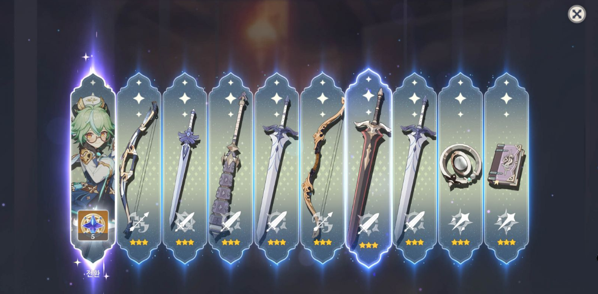

# 가챠(뽑기) 시스템 기획서

> 상위 문서: [서버 시스템 전체 개요](../서버-시스템-전체-개요.md) · 관련 도메인 4.11
>
> 본 문서는 플레이어가 **골드를 소모해 확률로 아이템을 획득**하는 가챠(뽑기)를 서버 권위로 처리하는 규칙을 다룬다. 배너 조회, 1연·10연 뽑기, 뽑기 기록 조회(페이징)를 포함한다. 뽑은 아이템이 적재되는 가방 규칙은 [인벤토리/아이템/큐브 기획서](inventory-item-cube-기획서.md), 가챠의 정적 정의는 [마스터 데이터 기획서](master-data/master-data-기획서.md) 5.13(`gacha_master` 계열)을 따른다.


## 목차

- [1. 개요](#1-개요)
- [2. 기능 설명](#2-기능-설명)
- [3. 요구사항](#3-요구사항)
- [4. 데이터 모델](#4-데이터-모델)
  - [4.1 마스터 데이터 (정적 정의)](#41-마스터-데이터-정적-정의)
  - [4.2 세이브 데이터 (플레이어 상태·기록)](#42-세이브-데이터-플레이어-상태기록)
  - [4.3 공유 enum / DTO](#43-공유-enum--dto)
- [5. API 명세](#5-api-명세)
  - [5.1 가챠 배너 조회 — `POST /api/game/gacha/banners`](#51-가챠-배너-조회--post-apigamegachabanners)
  - [5.2 가챠 뽑기(1연·10연) — `POST /api/game/gacha/pull`](#52-가챠-뽑기1연10연--post-apigamegachapull)
  - [5.3 가챠 기록 조회 — `POST /api/game/gacha/history`](#53-가챠-기록-조회--post-apigamegachahistory)
- [6. 처리 흐름](#6-처리-흐름)
  - [6.1 배너 노출 판정](#61-배너-노출-판정)
  - [6.2 추첨 알고리즘 (2단계: 등급 → 아이템)](#62-추첨-알고리즘-2단계-등급--아이템)
  - [6.3 천장(pity) 보정](#63-천장pity-보정)
  - [6.4 10연 보장](#64-10연-보장)
  - [6.5 트랜잭션 골격 (의사코드)](#65-트랜잭션-골격-의사코드)
  - [6.6 기록 적재와 페이징](#66-기록-적재와-페이징)
  - [6.7 예외 / 엣지 케이스](#67-예외--엣지-케이스)
  - [6.8 동시성 · 캐시 · 로깅](#68-동시성--캐시--로깅)
- [7. 에러 코드](#7-에러-코드)
- [8. 미결 사항 / TODO](#8-미결-사항--todo)
- [9. 참고](#9-참고)


## 1. 개요

- **목적**: 방치형 전투의 획득 경로(전리품·제작)와 별개로, 플레이어가 **원할 때 골드를 소모해 즉시 아이템을 뽑는** 소비 창구를 제공한다. 남는 골드를 회수해 인플레를 눌러 주고, 등급 확률·천장으로 "운이 나빠도 언젠가는 받는다"는 기대를 보장한다. 등급·아이템·천장 판정은 전부 **서버가 확정**한다(클라이언트 보고 불신).
- **대상 서버**: `GameServer`(`GameGachaController` → `GachaService` → `GachaRepository`·`InventoryRepository`), `TaskbarHero.Common`(`GachaPullType` enum·결과 DTO 공유). 인증은 AccountServer 발급 토큰을 GameServer 미들웨어가 검증한다.
- **범위 경계**:
  - **뽑은 아이템의 적재 규칙**(스택 병합·빈 칸 배정·용량 판정)은 [인벤토리/아이템/큐브 기획서](inventory-item-cube-기획서.md) 4장이 정본이다. 본 문서는 "무엇을 몇 개 지급하는가"까지 책임진다.
  - **가챠 후보 아이템의 정의**(어떤 아이템이 어느 등급 슬롯에 있는지)는 마스터 데이터다. 구조는 [마스터 데이터 기획서](master-data/master-data-기획서.md) 5.13, 값은 [마스터 데이터 값](master-data/master-data-값.md) §12.
  - **캐릭터는 가챠 대상이 아니다.** 캐릭터는 골드로 생성한다([세이브 데이터 기획서](save-data-기획서.md) 5.3). 따라서 원작 수집형 RPG의 "중복 캐릭터 → 조각 변환" 규칙은 도입하지 않는다(4.1 참고).
  - **유료 재화·확률형 아이템 결제는 범위 밖이다.** 비용 재화는 인게임 골드뿐이며 실물 화폐 연동이 없다.
- **관련 기획서**: [[inventory-item-cube-기획서]] (지급 아이템 적재·`inventoryDelta`), [[master-data-기획서]] (`gacha_master` 계열 정의), [[consumable-buff-기획서]] (가챠로만 지급되는 소모품), [[save-data-기획서]] (코어 로드 스냅샷), [[서버-시스템-전체-개요]] (도메인 4.11)



## 2. 기능 설명

- **가챠 배너 조회**: 가챠 화면을 열면 **지금 돌릴 수 있는 배너 목록**을 서버에서 받는다. 어떤 배너가 열려 있는지는 `gacha_master`가 정의하고(노출 스위치·기간) 판정은 **서버 시각 기준**으로 서버가 한다. 플레이어는 이 목록에서 배너를 고른 뒤 그 `gachaCode`로 뽑기를 요청한다.
- **1연 뽑기**: 골드 `cost_single`을 소모해 1회 추첨한다. 서버가 등급을 가중치로 뽑고 그 등급의 후보 중 하나를 균등하게 골라 지급한다.
- **10연 뽑기**: 골드 `cost_multi`를 한 번에 소모해 **10회 연속 추첨**한다. 1연 10번과 두 가지가 다르다 — 묶음 가격을 따로 둘 수 있고(할인), **10회 중 보장 등급 이상이 하나도 없으면 마지막 1회를 보장 등급으로 강제**한다.
- **천장(pity)**: 특정 등급을 오래 못 받으면 서버가 확률을 올려 주거나(소프트) 확정으로 지급한다(하드). 진행도는 배너별·등급별 카운터로 누적되며, 해당 등급 이상을 받으면 0으로 리셋된다.
- **배너는 상시와 픽업(한정) 두 종류다**:
  - **상시 배너** — 기간이 없다. 전설 등급이 나오면 **전설 장비 중 하나가 무작위로** 나온다.
  - **픽업 배너 = 한정 배너** — **반드시 기간이 정해져 있다.** 그 배너에서 나오는 **전설은 오직 픽업 아이템 하나뿐**이다(예: "성검 엑스칼리버 픽업"에서는 다른 전설 장비가 등장하지 않는다). 90회차 천장도 같은 슬롯에서 뽑으므로 자연히 그 아이템이 확정된다. 배너 이름도 그 아이템을 따른다.
- **뽑기 기록**: 모든 뽑기는 **원장(ledger)으로 영구 기록**된다. 플레이어는 최신순 페이징으로 자기 기록을 되짚어 볼 수 있고, 운영은 같은 원장으로 확률 이상·재화 증발 문의를 검증한다.
- **확률 공시**: 등급 확률·후보 목록은 마스터 데이터이며 **클라이언트 빌드에 번들**되어 있으므로, 확률 안내 UI는 서버 조회 없이 그린다. 서버가 내려주는 것은 배너 목록과 천장 진행도뿐이다(5장 서두).

## 3. 요구사항

**기능 요구사항**
- **지금 돌릴 수 있는 배너 목록**을 조회한다. 노출 여부는 `gacha_master`의 노출 스위치·기간을 서버 시각으로 판정하며, 각 배너의 천장 진행도를 함께 내려 가챠 화면을 한 번의 왕복으로 그린다.
- 1연·10연 뽑기를 **한 엔드포인트**에서 `pullType`으로 갈라 처리하고, **배너 노출 검증** → 비용 차감 → 추첨 → 지급 → 천장 카운터 갱신 → 기록 적재를 **하나의 트랜잭션**으로 반영한다.
- 등급 추첨은 `gacha_grade_weight`의 가중치, 아이템 선택은 `gacha_item_pool`의 등급 슬롯 안 **균등 추첨**으로 한다.
- 천장 규칙(`gacha_pity_rule`)이 정의된 가챠는 등급별 카운터를 유지하고, 하드 천장 도달 시 그 등급을 확정 지급한다.
- 10연은 회차별로 순차 추첨하되, 보장 등급 미출현 시 마지막 회차를 보장 등급으로 대체한다.
- 뽑기 기록을 **최신순 커서 페이징**으로 조회한다(가챠 종류 필터 지원).
- 지급 아이템은 가방 규칙(스택 병합·빈 칸 배정)에 따라 적재하고, 변경분을 `inventoryDelta`로 응답한다([인벤토리 기획서](inventory-item-cube-기획서.md) 5.0).

**비기능 요구사항**
- **서버 권위**: 배너 노출 여부와 등급·아이템·천장·보장 판정은 전부 서버가 계산한다. 클라이언트는 `gachaCode`와 `pullType`(상품 종류)만 보내고 결과를 받는다. **요청에 결과·확률·횟수를 넣을 수 있는 필드를 두지 않는다** — 뽑는 횟수는 `gacha_master.multi_count`에서 서버가 읽는다. **뽑기 요청도 배너 노출을 다시 검증한다** — 목록 조회 시점에 열려 있었다는 사실이 뽑는 시점의 허가가 되지 않는다.
- **원자성**: "골드 차감 + 아이템 지급 + 카운터 갱신 + 기록 적재"는 전부 성공하거나 전부 롤백한다. 골드만 빠지고 아이템이 없는 상태, 기록에는 있는데 지급되지 않은 상태를 만들지 않는다.
- **감사 가능성**: 모든 뽑기는 결과·비용·당시 천장 카운터까지 기록에 남긴다. 기록은 **자동 삭제하지 않는다**(6.6).
- **동시성**: 단일 세션 정책([계정/로그인 기획서](account-login-기획서.md))이라 같은 계정의 동시 뽑기는 예외적이다. 그래도 재화 행과 카운터 행을 잠가 이중 차감·이중 리셋을 막는다. **애플리케이션 락(Redis)은 두지 않는다**(6.8).
- **응답 크기**: 기록 조회의 `limit`은 서버가 상한을 강제한다(기본 20 · 상한 50 뽑기, 10연이면 결과 항목이 그 10배).

## 4. 데이터 모델

### 4.1 마스터 데이터 (정적 정의)

정본 정의는 [마스터 데이터 기획서](master-data/master-data-기획서.md) 5.13이며, 아래는 가챠 도메인 관점의 요약이다.

| 테이블 | 키 | 역할 |
|---|---|---|
| `gacha_master` | `gacha_code` | 가챠(배너)별 노출 조건·비용·10연 구성·보장 등급 |
| `gacha_grade_weight` | `(gacha_code, grade)` | 등급별 추첨 **가중치**(확률 = 가중치 / 그 가챠의 가중치 합) |
| `gacha_item_pool` | `(gacha_code, grade, item_code)` | 등급 슬롯별 **지급 후보 화이트리스트**와 지급 수량 |
| `gacha_pity_rule` | `(gacha_code, grade, pity_type)` | 등급별 천장 규칙(소프트·하드를 **각각 한 행**). 행이 없으면 그 등급에 천장 없음 |

**`gacha_master`**

| 필드 | 타입 | 설명 |
|---|---|---|
| `gacha_code` | int PK | 가챠(배너) 코드 |
| `name` | varchar | 배너 이름(UI 표시) |
| `banner_image` | varchar | 배너 이미지 리소스 키(클라이언트가 자기 리소스에서 찾는 이름) |
| `is_active` | tinyint | **노출 스위치**(0:비노출 1:노출). 기간과 무관하게 배너를 내리는 운영 스위치 |
| `open_at` | bigint | 노출 시작 Unix ts(**0 = 시작 제한 없음**) |
| `close_at` | bigint | 노출 종료 Unix ts(**0 = 종료 없음 = 상시 배너**) |
| `sort_order` | int | 배너 목록 표시 순서(오름차순, 작을수록 앞) |
| `cost_currency_code` | int | 비용 재화의 `item_code`(FK `item_master` 재화, 골드=1) |
| `cost_single` | bigint | **1연** 1회 비용 |
| `cost_multi` | bigint | **10연** 1회 비용(묶음 할인을 여기에 반영. `cost_single × multi_count`와 무관하게 독립 값) |
| `multi_count` | int | 10연 1회에 뽑는 횟수(**현재 10 고정**) |
| `multi_guaranteed_grade` | tinyint | 10연 묶음에서 보장하는 **최소 등급**(0 = 보장 없음) |
| `pickup_item_code` | int | **픽업 대상 아이템 선언**(`item_master.item_code`). **0 = 상시 배너.** `≠ 0`이면 그 배너 **최고 등급 슬롯의 유일한 후보**이며 **한정이므로 `close_at ≠ 0`** 이어야 한다 |

**배너 노출 조건(확정)** — 아래 세 조건을 **모두** 만족하는 `gacha_master` 행이 "지금 돌릴 수 있는 배너"다.

```
is_active = 1
  AND (open_at  = 0 OR now >= open_at)
  AND (close_at = 0 OR now <  close_at)
```

- **`is_active`와 기간을 함께 둔다.** 기간은 예정된 이벤트 배너의 자동 개폐를 담당하고, `is_active`는 기간과 무관하게 **즉시 내리는 스위치**다(밸런스 사고·확률 오기입 시 마스터 값 하나만 바꿔 재적재하면 된다). 기간만 두면 "지금 당장 중단"을 표현할 방법이 없고, 스위치만 두면 이벤트마다 사람이 켜고 꺼야 한다.
- **시각 비교는 서버 시각**이다. 클라이언트 시계는 조작 가능하므로 노출 판정에 쓰지 않는다.
- `close_at`은 **미포함(`<`)** 이다. `close_at`에 다음 배너의 `open_at`을 그대로 적으면 경계 시각에 두 배너가 동시에 열리지 않는다.

**배너 두 종류(확정)** — `pickup_item_code`가 배너의 성격을 선언한다.

| 종류 | `pickup_item_code` | `close_at` | 최고 등급(5) 슬롯 후보 | 그 배너에서 나오는 전설 |
|---|---|---|---|---|
| **상시 배너** | `0` | `0`(기간 없음) | 전설 장비 **전종** | 그중 무작위 |
| **픽업(한정) 배너** | `≠ 0` | **`≠ 0` 필수** | **픽업 아이템 1종만** | **항상 픽업 아이템** |

- **픽업 배너의 최고 등급 슬롯에는 픽업 아이템만 둔다(확정).** 그래서 그 배너에서 전설이 나오면 — 90회차 천장이든 그 전의 일반 추첨이든 — **항상 픽업 아이템**이고 다른 전설 장비는 등장하지 않는다.
- **추첨 로직에 픽업 분기가 없다(확정).** 하드 천장은 언제나 "그 등급 슬롯에서 균등 추첨"이며, 픽업 배너에서 결과가 확정되는 것은 **후보가 하나뿐이기 때문**이다. `pickup_item_code`는 그 사실을 **선언·검증·UI 표시**에 쓰는 값이고 추첨식에는 들어가지 않는다 — 같은 동작을 두 곳(컬럼과 슬롯 구성)에서 정의하면 어긋날 수 있다.
- **픽업은 곧 한정이다(확정).** `pickup_item_code ≠ 0`이면 `close_at ≠ 0`이어야 한다. 픽업은 정해진 기간 동안만 여는 배너다.
- **배너 이름은 픽업 대상을 따른다**(예: `성검 엑스칼리버 픽업`). 플레이어가 목록에서 무엇을 노리는 배너인지 즉시 알 수 있어야 한다.
- **기간이 끝난 픽업 배너 행은 지우지 않는다.** 과거 뽑기 기록(`player_gacha_pull.gacha_code`)이 그 행을 가리키므로 이력으로 남기고, 다음 픽업은 **새 `gacha_code`로 추가**한다.
- **마스터 적재 시점 검증**: `pickup_item_code ≠ 0`이면 (1) 그 배너 최고 등급 슬롯의 후보가 **정확히 그 아이템 하나**, (2) `close_at ≠ 0`.
- **0 센티널이 섞이므로 FK를 걸지 않는다**(`attendance_master.reward_code`와 같은 방식). 유효성은 서버가 검증한다.

**`gacha_grade_weight`** — `(gacha_code, grade)` 복합 PK, `weight`(int). 등급을 늘리고 줄일 때 스키마가 아니라 행만 바꾼다(JSON 컬럼 금지 규칙).

**`gacha_item_pool`** — `(gacha_code, grade, item_code)` 복합 PK, `quantity`(int, 1회 지급 수량, 기본 1).

- **`grade`는 가챠 안에서의 추첨 슬롯**이며 `item_master.grade`와 일치할 필요가 없다. 소모품처럼 `grade`가 `grade_master` FK 충족용 값인 아이템도 원하는 슬롯에 배치할 수 있어, **아이템 등급을 바꾸지 않고** 출현 빈도만 조절한다([소모품/버프 기획서](consumable-buff-기획서.md) 4.3).
- 슬롯 안에서의 아이템 선택은 **균등**이다(확정). 아이템별 가중치가 필요해지면 이 테이블에 `weight` 컬럼을 더한다(스키마 확장만).
- **후보는 명시적으로 정의한다.** 스테이지 전리품 드롭처럼 "해당 등급의 `item_master` 전체"를 암시적으로 쓰지 않는다 — 가챠는 **소모품(`item_type=4`)을 포함**하고 전리품은 장비·재료만 주므로 두 경로의 풀이 다르다.
- `quantity`는 재료·소모품 묶음 지급용이다. 장비(`item_type=1`)는 `stack_max=1`이므로 항상 `1`로 둔다.

**`gacha_pity_rule`**

| 필드 | 타입 | 설명 |
|---|---|---|
| `gacha_code` | int PK | 가챠 코드(FK `gacha_master`) |
| `grade` | tinyint PK | 천장 대상 등급 |
| `pity_type` | tinyint PK | **1:소프트**(확률 가산) **2:하드**(확정 지급) |
| `threshold` | int | **이번 뽑기가 마지막 획득 이후 `threshold`번째**가 되면 규칙이 발동한다 |
| `prob_step` | decimal(6,5) | 소프트 전용 — 발동 이후 **1회당 올릴 확률(%p, 0~1)**. 하드는 0 |

- **`pity_type`이 PK에 포함된다.** 같은 등급에 **소프트와 하드를 동시에** 걸기 위해서다 — 확정된 규칙이 "70회차부터 확률 상승, 90회차에 확정"인 2단계 구조라 등급당 두 행이 필요하다.
- **`threshold`는 "누적 미획득 횟수"가 아니라 "이번 뽑기의 회차 번호"와 비교한다.** 회차 번호는 `pity_count + 1`이다(카운터는 뽑기가 끝난 뒤 증가하므로, 89회를 뽑고 못 받았으면 `pity_count=89`이고 다음 뽑기가 **90회차**다). 이렇게 정의해야 "90회째에 확정"이 `threshold=90`으로 그대로 읽힌다.
- **소프트 천장을 확률 가산으로 정의한다(확정).** 회차마다 그 등급의 **목표 확률**을 `prob_step`씩 올리고, 서버가 그 목표 확률을 가중치로 환산해(`up = (p × 총합 − w) / (1 − p)`) 기존 가중치 추첨에 넣는다. **가중치를 직접 가산하는 방식은 쓸 수 없다** — `p = (w + up) / (총합 + up)`이라 `up`을 무한히 키워도 100%에 닿지 못해 89회차 17.5%에서 90회차 100%로 곡선이 끊긴다(실제로 그렇게 설계했다가 고쳤다). 환산 방식은 가중치 추첨 엔진을 하나로 유지하므로 나머지 등급 확률은 여전히 **정규화 없이 자동 비례 감소**한다 — 참고 구현처럼 "타겟 확률을 올린 뒤 총합 100%가 되도록 나머지를 재조정"하는 별도 정규화 단계가 필요 없다.
- **가산 상한 컬럼은 두지 않는다(확정).** 확률 가산 방식에서는 목표 확률이 1을 넘으면 서버가 확정 지급으로 처리하므로 상한 컬럼이 불필요하다. 확정 설계에서는 하드(90회차)가 먼저 걸려 그 분기에 도달하지도 않는다. 곡선을 완만하게 하려면 상한이 아니라 `prob_step`을 줄인다.

**천장 수치(확정)** — 최고 등급(5)에 2단계로 건다. 배너별로 다르게 잡을 수 있으나 **기준값은 아래와 같다**(정본은 [마스터 데이터 값](master-data/master-data-값.md) §12).

| `grade` | `pity_type` | `threshold` | 의미 |
|---|---|---|---|
| 5 | 1 (소프트) | **70** | **70회차부터** 회차마다 5등급 확률을 `prob_step`(+4.9%p)씩 올린다 |
| 5 | 2 (하드) | **90** | **90회차에 5등급 확정 지급**(100%). 추첨을 건너뛴다 |

- 즉 1~69회차는 기본 확률, **70~89회차는 확률이 20단계에 걸쳐 상승**, **90회차는 100%** 다. 5등급을 받으면 그 즉시 카운터가 0으로 리셋되어 다음 주기가 시작된다.
- `prob_step`은 **20회차(70~89) 만에 1% → 99%로 올리는 값**이다(확정값 `0.049` = `(0.99 − 0.01) / 20`). 목표 확률 = `기본 확률 + k × prob_step`(k = 이번 회차 − `threshold` + 1)이며, 89회차 99.00% 다음 90회차 100%로 이어져 **곡선이 끊기지 않는다**.
- **90회차에 무엇을 받는지는 그 배너 5등급 슬롯의 후보 구성이 가른다**(추첨 로직은 동일) — 상시 배너는 전설 장비 전종 중 무작위로, 픽업 배너는 후보가 하나뿐이라 픽업 아이템으로 확정된다.

**배너 2종(확정)** — 값 정본은 [마스터 데이터 값](master-data/master-data-값.md) §12.

| `gacha_code` | 이름 | 종류 | 기간 | 1연 / 10연 비용 | `pickup_item_code` | 5등급 슬롯 후보 |
|---|---|---|---|---|---|---|
| `60001` | 상시 뽑기 | 상시 | 없음 | 50,000 / 450,000 | `0` | 전설 장비 **20종** |
| `60002` | 성검 엑스칼리버 픽업 | **한정** | 2026-08-03 ~ 10-31 (89일) | 60,000 / 540,000 | `31151` | **성검 엑스칼리버 1종** |

- 등급 가중치는 두 배너가 **동일**하다(노말 50% / 고급 30% / 희귀 15% / 영웅 4% / 전설 1%). 1~4 등급 슬롯의 후보도 동일하다. 다른 것은 **5등급 슬롯 구성과 기간 유무**뿐이다.
- 값은 전부 학습용 임시값이며 상용 밸런싱 대상이 아니다.
- **중복 보상 규칙 테이블(`gacha_duplicate_rule`)은 두지 않는다.** 참고 구현이 그 테이블을 쓰는 이유는 "이미 보유한 캐릭터를 또 뽑았을 때"를 처리하기 위해서다. 본 프로젝트의 가챠 대상은 장비·재료·소모품뿐이고, 장비는 개체마다 별도 행이라 중복 개념이 없으며 재료·소모품은 스택으로 누적된다. 처리할 중복이 없으므로 테이블도 규칙도 필요하지 않다.

### 4.2 세이브 데이터 (플레이어 상태·기록)

Game DB에 **신규 테이블 3개**를 추가한다. ERD 반영은 [DB ERD 통합](../공통/db-erd-통합.md) 3장.

**`player_gacha_counter`** — 천장 진행도(계정 공유)

| 필드 | 타입 | 설명 |
|---|---|---|
| `user_id` | bigint PK | 계정(FK `game_player`) |
| `gacha_code` | int PK | 가챠 코드 |
| `grade` | tinyint PK | 천장 대상 등급(`gacha_pity_rule.grade`와 대응) |
| `pity_count` | int | 그 등급을 마지막으로 받은 뒤 누적 뽑기 횟수 |
| `updated_at` | bigint | 갱신 시각(Unix ts) |

- 행은 **lazy 생성**한다 — 천장 규칙이 있는 가챠를 처음 뽑을 때 만든다.
- **리셋 규칙(확정)**: 등급 `g`의 카운터는 `g` **이상** 등급을 뽑으면 0으로 리셋한다. 상위 등급을 받았는데 하위 등급 천장이 계속 쌓이면 같은 행운에 두 번 보상하는 셈이 된다.
- 카운터는 뽑기 1회마다 `+1`이며, 천장·보장으로 강제 지급된 결과도 리셋 판정에 **포함**한다.

**`player_gacha_pull`** — 뽑기 요청 1건(부모, **1연·10연 모두 1행**)

| 필드 | 타입 | 설명 |
|---|---|---|
| `pull_id` | bigint PK | AUTO_INCREMENT. **기록 페이징 커서**이자 최신순 정렬키 |
| `user_id` | bigint | 계정(FK `game_player`) |
| `gacha_code` | int | 뽑은 가챠 |
| `pull_type` | tinyint | **1:1연 2:10연**. 어떤 상품으로 뽑았는지를 나타내며 **행 수와 무관**하다(뽑은 횟수는 자식 행 수) |
| `cost_currency_code` | int | 소모 재화 `item_code` |
| `cost_amount` | bigint | 이번 요청에서 실제 차감한 금액 |
| `pulled_at` | bigint | 뽑은 시각(Unix ts) |

**`player_gacha_pull_item`** — 그 요청의 회차별 결과(자식, 1:N — **1연 1행 · 10연 10행**)

| 필드 | 타입 | 설명 |
|---|---|---|
| `pull_id` | bigint PK | 소속 요청(FK `player_gacha_pull`) |
| `seq` | int PK | 요청 내 회차(1부터. 1연은 1, 10연은 1~10) |
| `item_code` | int | 지급 아이템(`item_master`) |
| `grade` | tinyint | 추첨된 **등급 슬롯** |
| `quantity` | int | 지급 수량 |
| `pity_applied` | tinyint | 0/1 — 하드 천장으로 등급이 확정된 회차 |
| `guaranteed` | tinyint | 0/1 — 10연 보장으로 등급이 대체된 회차 |

**뽑기 1회가 만드는 행 (확정)** — 세 테이블의 성격이 다르다. 앞의 둘은 **원장(append-only)** 이라 뽑을 때마다 행이 쌓이고, `player_gacha_counter`는 **현재 상태**라 덮어쓴다.

| 요청 | `player_gacha_pull` (원장·부모) | `player_gacha_pull_item` (원장·자식) | `player_gacha_counter` (현재 상태) |
|---|---|---|---|
| 1연 1회 | **INSERT 1행** (`pull_type=1`, `cost_amount=cost_single`) | **INSERT 1행** (`seq=1`) | **UPDATE**(천장 등급 수만큼, 보통 1행) |
| 10연 1회 | **INSERT 1행** (`pull_type=2`, `cost_amount=cost_multi`) | **INSERT 10행** (`seq=1`~`10`) | **UPDATE**(위와 동일 — 10행이 되지 않는다) |

- **`player_gacha_counter`의 행 수는 뽑은 횟수와 무관하다.** PK가 `(user_id, gacha_code, grade)`라 행 개수는 **그 가챠에 천장 규칙이 걸린 등급 수**(`gacha_pity_rule` 행 수)로 고정된다. 5등급에만 천장이 있으면 그 계정·그 가챠에 대해 평생 1행이며, 그 가챠를 **생애 최초로 뽑을 때만** INSERT(lazy 생성)하고 이후에는 계속 UPDATE다.
- 10연 안에서 카운터는 회차마다 `+1`·리셋을 거치지만(6.3), 그 중간값은 서버 메모리에서 계산하고 **최종값 한 번만 UPSERT**한다. 중간 이력이 필요하면 원장의 `pity_applied`(몇 번째 회차에서 천장이 터졌나)로 되짚는다.

```
player_gacha_pull
  pull_id=90232  user_id=1  gacha_code=60001  pull_type=2  cost_amount=90000  pulled_at=...
player_gacha_pull_item
  pull_id=90232  seq=1   item_code=31011  grade=2  quantity=1  ...
  pull_id=90232  seq=2   item_code=41001  grade=1  quantity=3  ...
  ...
  pull_id=90232  seq=10  item_code=30105  grade=4  quantity=1  guaranteed=1
```

- **`pull_type`은 "어떤 상품으로 뽑았는가"이지 행 수가 아니다.** 실제 뽑은 횟수는 자식 행 수(`seq` 최대값 = 그 시점 `gacha_master.multi_count`)로 확인한다. `multi_count`를 10에서 바꿔도 과거 기록은 자기 자식 행 수를 그대로 유지하므로 사후 검증이 흔들리지 않는다.
- **비용은 부모에만 둔다.** 10연은 `cost_multi`를 **한 번** 차감하므로 회차마다 복사하면 합계가 10배로 잡힌다. "이 플레이어가 가챠에 쓴 골드"는 언제나 부모의 `cost_amount` 합이다. 회차당 단가는 정의되지 않는 값이며(묶음 할인이 들어 있어 나눠떨어지지도 않는다) 저장하지 않는다.
- **부모/자식으로 나눈 이유**: 기록 UI가 "10연 한 묶음"을 한 줄로 보여 주므로 페이징 단위가 **요청**이다. 결과 10건을 한 테이블에 그대로 나열하고 그 위에서 페이징하면 페이지 경계가 묶음 중간을 자른다(예: 10연의 7번째까지만 한 페이지에 담김). 부모에 커서를 두면 한 페이지가 항상 온전한 묶음들로 떨어진다.
- 반복 구조를 컬럼이 아니라 자식 테이블로 분리하는 것은 프로젝트 공통 규칙이다(JSON 컬럼 금지, `player_mail`/`player_mail_reward`와 같은 형태).

**PK / 인덱스**

| 테이블 | PK / 인덱스 |
|---|---|
| `player_gacha_counter` | `(user_id, gacha_code, grade)` PK |
| `player_gacha_pull` | `pull_id` PK, `(user_id, pull_id)` 인덱스(전체 기록 최신순 페이징), `(user_id, gacha_code, pull_id)` 인덱스(가챠별 필터 페이징) |
| `player_gacha_pull_item` | `(pull_id, seq)` PK |

### 4.3 공유 enum / DTO

- **`GachaPullType`**(1:Single 2:Multi)을 `TaskbarHero.Common`에 enum으로 둔다. `pull_type` 컬럼·API **요청·응답**이 모두 같은 값을 쓰며 **값 변경 금지**다(마스터 데이터 기획서 5장 공통 규칙). 이 enum이 정의하지 않은 값은 `InvalidRequest(1006)`로 거부한다.
- 뽑기 결과 항목(`seq`·`itemCode`·`grade`·`quantity`·`isPity`·`isGuaranteed`)과 기록 항목은 `TaskbarHero.Common`에 공유 DTO로 둔다. **1연과 10연은 같은 요청·응답 타입**을 쓰며 `pullType`과 `results` 길이만 다르다(5.2).
- 가방 변경분(`inventoryDelta`)·재화 잔액(`balance`)은 기존 공유 DTO를 그대로 재사용한다.

## 5. API 명세

**API 목록**

- [5.1 가챠 배너 조회 — `POST /api/game/gacha/banners`](#51-가챠-배너-조회--post-apigamegachabanners)
- [5.2 가챠 뽑기(1연·10연) — `POST /api/game/gacha/pull`](#52-가챠-뽑기1연10연--post-apigamegachapull)
- [5.3 가챠 기록 조회 — `POST /api/game/gacha/history`](#53-가챠-기록-조회--post-apigamegachahistory)

Base URL(개발): `http://localhost:5247` (GameServer). 모든 API는 **POST**, 인증 요청 공통 형식 `{ userId, token, data }`, 응답 `{ success, errorCode, message, data }`(`success`는 `errorCode == 0`과 동치). 컨트롤러는 `GameGachaController`이며 [컨트롤러 규칙](../../CLAUDE.md)에 따라 액션 메서드만 두고 공통 보조는 `GameApiControllerBase`를 상속해 쓴다.

> **배너 목록은 서버가, 확률표는 클라이언트 번들이 담당한다(확정).** 마스터 데이터는 **클라이언트 빌드에 번들**되므로([마스터 데이터 기획서](master-data/master-data-기획서.md) 6장) 등급 확률·후보 목록 같은 **정적 표시 값은 클라이언트가 이미 갖고 있다** — 이를 다시 내려주는 `gacha/detail` 류의 확률표 조회 API는 두지 않는다. 반면 **"지금 어떤 배너를 돌릴 수 있는가"는 서버 시각에 따라 달라지는 판정**이고 클라이언트 시계를 믿을 수 없으므로, 배너 목록만 서버가 확정해 내려준다(5.1). 플레이어별 값인 **천장 진행도도 이 응답에 함께 실어** 가챠 화면을 왕복 한 번으로 그린다.

> **1연·10연은 한 엔드포인트(`pull`)에서 `pullType`으로 가른다(확정).** 두 상품은 요청·응답 스키마가 같고 처리 흐름도 같아(비용 차감 → 추첨 → 지급 → 카운터 → 원장) 엔드포인트를 둘로 두면 같은 계약이 두 벌 생긴다. 다른 것은 **비용(`cost_single`/`cost_multi`)과 뽑는 횟수(`multi_count`), 보장 적용 여부**뿐이며 셋 다 마스터 값이라 서버가 `pullType`에서 파생한다.
>
> **`count`(뽑을 횟수)를 요청 필드로 두지 않는다(확정).** 횟수는 확률·결과와 함께 **서버 소유 값**이다(§3 서버 권위). `count`로 받으면 (1) 클라이언트가 `10`을 박아 두게 되어 `multi_count`를 바꾸는 순간 깨지고, (2) `count=3` 같은 정의되지 않은 입력을 매 요청 방어해야 하고, (3) "몇 번 뽑는가"의 출처가 요청과 마스터 두 곳이 된다. `pullType`은 **어떤 상품을 사는가**만 말하므로 이 셋이 모두 사라진다 — 서버는 `pullType`으로 마스터에서 횟수를 읽는다.

### 5.1 가챠 배너 조회 — `POST /api/game/gacha/banners`

**지금 돌릴 수 있는 배너 목록**을 노출 순서대로 반환한다. 클라이언트는 가챠 화면을 열 때 이 API를 호출하고, 목록에서 배너를 고른 뒤 그 `gachaCode`로 5.2를 요청한다.

**Request** — 추가 데이터 없이 인증 정보만 보낸다.
```json
{ "userId": 1, "token": "..." }
```

**Response (성공, 200 OK)**
```json
{
  "success": true,
  "errorCode": 0,
  "message": "OK",
  "data": {
    "serverTime": 1752400000,
    "banners": [
      {
        "gachaCode": 60001,
        "sortOrder": 1,
        "openAt": 0,
        "closeAt": 0,
        "counters": [ { "grade": 5, "pityCount": 37, "pityThreshold": 90, "remainingToPity": 53 } ]
      },
      {
        "gachaCode": 60002,
        "sortOrder": 2,
        "openAt": 1752192000,
        "closeAt": 1752796800,
        "counters": [ { "grade": 5, "pityCount": 4, "pityThreshold": 90, "remainingToPity": 86 } ]
      }
    ]
  }
}
```

| 필드 | 의미 |
|---|---|
| `serverTime` | 응답 시각(Unix ts). 클라이언트가 **남은 기간 카운트다운**을 자기 시계가 아니라 이 값 기준으로 계산한다 |
| `banners[]` | 노출 조건(4.1)을 만족하는 배너만, `sortOrder` 오름차순(동률이면 `gachaCode` 오름차순)으로 |
| `openAt` / `closeAt` | 그 배너의 노출 기간. **`closeAt=0`이면 상시 배너**라 카운트다운을 표시하지 않는다 |
| `counters[]` | 그 배너의 천장 진행도(천장 규칙이 있는 등급만, 없으면 빈 배열). `pityCount`는 마지막 획득 이후 누적 뽑기 횟수, `pityThreshold`는 **하드 천장 기준**(기준값 90)이라 클라이언트가 "37/90"을 바로 그린다. `remainingToPity`는 **천장까지 남은 뽑기 횟수**(= `pityThreshold - pityCount`)라 "천장까지 53회"를 뺄셈 없이 표시한다 — **하드 천장 규칙이 없는 등급**(소프트 규칙만 있어 `pityThreshold=0`)이나 카운터가 기준을 넘어선 경우 **0**이며 음수가 나가지 않는다. 소프트 발동 기준(70)은 클라이언트가 번들 마스터에서 읽어 "확률 상승 중" 표시에 쓴다 |

- **이름·배너 이미지·비용·등급 확률·후보 목록은 응답에 넣지 않는다.** 전부 클라이언트 번들 마스터(`gacha_master`·`gacha_grade_weight`·`gacha_item_pool`)에 있는 정적 값이고, 서버가 같은 값을 다시 내려보내면 같은 표시 값의 출처가 둘이 되어 어긋날 수 있다. 서버는 **번들만으로는 알 수 없는 것**(지금 열려 있는가, 내 천장이 얼마인가)만 내려준다.
- **응답에는 클라이언트 번들에 없는 `gachaCode`가 올 수 있다.** 서버 마스터가 먼저 갱신된 경우다. 클라이언트는 **모르는 코드를 조용히 건너뛰고** 목록을 그린 뒤, 하나도 그리지 못했으면 클라이언트 갱신 안내를 띄운다(오류로 처리하지 않는다).
- **열려 있는 배너가 없으면 빈 배열**로 성공 응답한다(에러 아님).
- 오류: 전용 에러 코드를 두지 않는다. 마스터 미로드는 `MasterDataNotLoaded(10001)`, 그 외에는 인증 실패(401)뿐이다.

### 5.2 가챠 뽑기(1연·10연) — `POST /api/game/gacha/pull`

`pullType`이 상품을 가른다 — **1연**은 `cost_single`을 소모해 1회, **10연**은 `cost_multi`를 한 번에 소모해 `multi_count`회(현재 **10회**) 연속 추첨한다. 두 상품의 요청·응답 스키마는 **완전히 같다**.

**Request**
```json
{ "userId": 1, "token": "...", "data": { "gachaCode": 60001, "pullType": 2 } }
```

| 필드 | 의미 |
|---|---|
| `gachaCode` | 뽑을 배너(`gacha_master.gacha_code`, 5.1로 받은 목록에서 고른 값) |
| `pullType` | **1**:1연 · **2**:10연(`GachaPullType`). **어떤 상품을 사는가**일 뿐이며 **뽑을 횟수가 아니다** |

- **횟수·확률·결과를 클라이언트가 지정할 수 없다.** 뽑는 횟수는 서버가 `gacha_master.multi_count`에서 읽고, 비용도 `pullType`에 따라 `cost_single`/`cost_multi`를 서버가 고른다. 요청에 그런 필드가 아예 없다.
- `1`·`2` 외의 `pullType`은 정의되지 않은 상품이므로 `InvalidRequest(1006)`로 거부한다(가챠 전용 코드를 새로 만들지 않는다).
- 서버는 이 배너가 **지금 열려 있는지 다시 판정**한다(4.1). 목록을 받아 둔 사이 기간이 끝났거나 운영이 배너를 내렸으면 `GachaNotAvailable(12003)`.

**Response (성공, 200 OK — 1연 예시)**
```json
{
  "success": true,
  "errorCode": 0,
  "message": "GachaPulled",
  "data": {
    "gachaCode": 60001,
    "pullId": 90231,
    "pullType": 1,
    "pulledAt": 1752400000,
    "results": [
      { "seq": 1, "grade": 4, "itemCode": 30105, "quantity": 1, "isPity": false, "isGuaranteed": false }
    ],
    "cost": { "currencyType": 1, "amount": 50000 },
    "balance": [ { "currencyType": 1, "amount": 9890421 } ],
    "counters": [ { "grade": 5, "pityCount": 38, "pityThreshold": 90, "remainingToPity": 52 } ],
    "inventoryDelta": {
      "upserted": [ { "itemId": 6200, "slot": 31, "itemCode": 30105, "quantity": 1, "enhanceLevel": 0 } ],
      "removed": []
    }
  }
}
```

| 필드 | 의미 |
|---|---|
| `pullId` | 이번 뽑기의 기록 식별자(`player_gacha_pull.pull_id`). 기록 조회의 커서와 같은 값이다 |
| `pullType` | 요청과 같은 값(1:1연 2:10연). 기록 조회 응답에도 같은 필드로 나온다 |
| `results[]` | 회차별 결과. **1연은 1개, 10연은 항상 `multi_count`개**가 순서대로 들어간다. `seq`는 1부터, `grade`는 추첨된 등급 슬롯, `isPity`는 하드 천장 확정, `isGuaranteed`는 10연 보장 대체 여부 |
| `cost` / `balance` | 이번에 차감한 금액(`pullType`에 따라 `cost_single`/`cost_multi`) / 차감 후 재화 잔액 |
| `counters[]` | 갱신 후 천장 진행도(천장 규칙이 있는 등급만). `pityCount`는 마지막 획득 이후 누적 뽑기 횟수, `pityThreshold`는 **하드 천장 기준**(기준값 90)이라 클라이언트가 "38/90"을 바로 그린다. `remainingToPity`는 **천장까지 남은 뽑기 횟수**(= `pityThreshold - pityCount`, 하드 천장 규칙이 없거나 기준을 넘어서면 0)로 배너 조회(5.1)와 같은 규칙이다. 소프트 발동 기준(70)은 클라이언트가 번들 마스터에서 읽어 "확률 상승 중" 표시에 쓴다 |
| `inventoryDelta` | 가방 변경분([인벤토리 기획서](inventory-item-cube-기획서.md) 5.0). 10연에서 같은 아이템이 여러 번 나오면 **스택 병합되어 행 하나로 합쳐진다**(예: 강화석 3개 × 3회 → 기존 18 + 9 = 27). **클라이언트는 이 응답만으로 가방·재화·천장 표시를 갱신하고 재조회하지 않는다** |

**10연 응답의 차이** — `pullType`이 `2`, `results`가 `multi_count`개, `cost`가 `cost_multi`(= `cost_single × 10`이 아니다)라는 점뿐이다. 마지막 회차에 `isGuaranteed: true`가 붙어 있으면 10회 중 보장 등급 이상이 없어 그 회차가 보장 등급으로 대체됐음을 뜻한다(6.4).

- 오류: `GachaNotFound(12001)`(마스터에 없는 `gachaCode`), `GachaNotAvailable(12003)`(배너가 지금 열려 있지 않음 — 기간 종료·비노출), `InvalidRequest(1006)`(정의되지 않은 `pullType`), `GachaPoolEmpty(12002)`(추첨된 등급 슬롯에 후보가 없음 — 마스터 결함), `InsufficientCurrency(4005)`(골드 부족), `InventoryFull(4002)`(지급 아이템을 적재할 칸 부족 — 전체 롤백), `MasterDataNotLoaded(10001)`.
- `InventoryFull(4002)`은 10연에서 나올 확률이 높으므로, 클라이언트는 뽑기 버튼을 누르기 전 빈 칸이 부족하면 **미리 안내**한다(서버 판정은 그대로 수행).

### 5.3 가챠 기록 조회 — `POST /api/game/gacha/history`

내 뽑기 기록을 **최신순**으로 페이징 조회한다. 페이징 단위는 **뽑기 요청**(1연=1건, 10연=1건)이며, 각 건이 결과 목록을 품는다.

**Request**
```json
{ "userId": 1, "token": "...", "data": { "gachaCode": 0, "cursor": 0, "limit": 20 } }
```

| 필드 | 기본값 | 의미 |
|---|---|---|
| `gachaCode` | `0` | 가챠 종류 필터. `0`이거나 생략하면 **전체 가챠** |
| `cursor` | `0` | 이전 페이지의 `nextCursor`. `0`이거나 생략하면 **최신부터** |
| `limit` | `20` | 한 페이지 뽑기 건수. 서버가 **1~50으로 clamp**하며 범위 밖 값은 에러가 아니라 보정 대상이다 |

**Response (성공, 200 OK)**
```json
{
  "success": true,
  "errorCode": 0,
  "message": "OK",
  "data": {
    "pulls": [
      {
        "pullId": 90232,
        "gachaCode": 60001,
        "pullType": 2,
        "cost": { "currencyType": 1, "amount": 90000 },
        "pulledAt": 1752400120,
        "items": [
          { "seq": 1, "itemCode": 31011, "grade": 2, "quantity": 1, "isPity": false, "isGuaranteed": false },
          { "seq": 2, "itemCode": 41001, "grade": 1, "quantity": 3, "isPity": false, "isGuaranteed": false }
        ]
      },
      {
        "pullId": 90231,
        "gachaCode": 60001,
        "pullType": 1,
        "cost": { "currencyType": 1, "amount": 10000 },
        "pulledAt": 1752400000,
        "items": [
          { "seq": 1, "itemCode": 30105, "grade": 4, "quantity": 1, "isPity": false, "isGuaranteed": false }
        ]
      }
    ],
    "nextCursor": 90231,
    "hasMore": true
  }
}
```

- `pulls`는 `pullId` **내림차순**(최신 먼저)이고, 각 `items`는 `seq` 오름차순이다.
- `nextCursor`는 이 페이지 **마지막 건의 `pullId`** 다. 다음 요청에 그대로 실으면 그보다 오래된 건부터 이어 받는다. `hasMore=false`면 `nextCursor`는 `0`이다.
- **오프셋(`page`)이 아니라 커서(keyset) 페이징을 쓴다(확정).** 기록은 append-only로 무한히 늘어나므로 `OFFSET`은 뒤 페이지일수록 앞의 행을 전부 훑는다. 또 조회 중에 새 뽑기가 들어오면 오프셋 기준이 밀려 같은 건이 두 페이지에 겹쳐 보인다. `pull_id < cursor` 조건은 `(user_id, pull_id)` 인덱스를 그대로 타서 페이지 깊이와 무관하게 비용이 일정하고, 새 기록이 앞에 붙어도 이미 넘긴 페이지에 영향이 없다. 가방 조회(`inventory/list`)가 `slot` 커서를 쓰는 것과 같은 이유다.
- **전체 건수(`total`)는 내려주지 않는다.** 무한 스크롤 UI에 필요 없는 값이고, 계정 기록 전량을 매 페이지마다 `COUNT`하는 비용이 조회 자체보다 크다. 누적 뽑기 횟수 표시가 필요해지면 카운터 컬럼으로 따로 다룬다(8장).
- 조회는 **본인 기록만** 반환한다(`user_id`는 인증에서 오며 요청 `data`에 받지 않는다).
- 오류: 전용 에러 코드를 두지 않는다. 기록이 없으면 빈 배열(`pulls: []`, `hasMore: false`)로 성공 응답하며, 잘못된 `limit`·`cursor`는 서버가 보정한다. 인증 실패(401)만 별도다.

## 6. 처리 흐름

### 6.1 배너 노출 판정

```
openBanners(now):
  return gacha_master
    .where(is_active == 1)
    .where(open_at  == 0 or now >= open_at)
    .where(close_at == 0 or now <  close_at)
    .orderBy(sort_order, gacha_code)
```

- **목록 조회(5.1)와 뽑기(5.2)가 같은 판정을 쓴다.** "목록에서 이미 걸렀으니 뽑기에서는 생략"하지 않는다 — 클라이언트가 목록을 캐시해 두었거나 요청을 직접 만들 수 있으므로, **비용을 차감하기 전에 뽑는 시점의 서버 시각으로 다시 판정**한다.
- 마스터는 인메모리라 이 필터는 DB 조회가 아니다. 배너 수가 적어 매 요청 선형 훑기로 충분하며 별도 색인을 두지 않는다.
- 판정에 쓰는 `now`는 **서버 시각**이다. 요청에 시각을 받지 않는다.

### 6.2 추첨 알고리즘 (2단계: 등급 → 아이템)

1회 추첨은 **등급을 먼저 뽑고, 그 등급 안에서 아이템을 뽑는** 2단계다.

```
draw(gachaCode, counters):
  weights = gacha_grade_weight[gachaCode]              # { grade → weight }

  # 0) 이번 뽑기의 회차 번호 (마지막 획득 이후 몇 번째인가)
  pullNo(g) = counters[g] + 1                          # 카운터는 뽑기 후에 증가하므로 +1

  # 1) 하드 천장 확인 — 도달했으면 추첨 없이 등급 확정
  for rule in gacha_pity_rule[gachaCode] where pity_type == 2(하드):
      if pullNo(rule.grade) >= rule.threshold:         # 기준값: 90회차
          grade = rule.grade;  pityApplied = true
          goto 아이템선택                                # 등급 슬롯에서 균등 추첨(픽업 분기 없음)
  # (여러 등급이 동시에 하드 천장에 걸리면 가장 높은 등급을 채택한다)

  # 2) 소프트 천장 — 발동 이후 회차마다 그 등급 "확률"을 prob_step 만큼 올린다
  #    목표 확률을 가중치로 환산해 더하므로 추첨 엔진은 하나(가중치 추첨)로 유지되고,
  #    나머지 등급 확률은 정규화 없이 자동으로 비례 감소한다.
  baseTotal = sum(gacha_grade_weight[gachaCode].values)
  for rule in gacha_pity_rule[gachaCode] where pity_type == 1(소프트):
      k = pullNo(rule.grade) - rule.threshold + 1      # 기준값: 70회차에서 k=1
      if k > 0 and rule.prob_step > 0:
          w = gacha_grade_weight[gachaCode][rule.grade]
          targetP = w / baseTotal + k * rule.prob_step
          if targetP >= 1: grade = rule.grade; pityApplied = true; goto 아이템선택
          # p = (w + up) / (baseTotal + up)  →  up = (p*baseTotal - w) / (1 - p)
          weights[rule.grade] = w + round((targetP * baseTotal - w) / (1 - targetP))

  # 3) 등급 추첨(누적 가중치)
  total = sum(weights.values)
  r = RNG.NextInt64(0, total)                          # [0, total)
  acc = 0
  for (g, w) in weights (등급 오름차순 고정):            # 순회 순서를 고정해야 결과가 재현·검증 가능
      acc += w
      if r < acc: grade = g; break

아이템선택:
  # 4) 등급 슬롯 안에서 균등 추첨
  pool = gacha_item_pool[gachaCode, grade]
  if pool.isEmpty: → GachaPoolEmpty(12002)             # 전체 롤백(마스터 결함)
  pick = pool[RNG.Next(0, pool.count)]                # 픽업 배너의 최고 등급 슬롯은 후보가 1개라 곧 확정
  return { grade, itemCode: pick.item_code, quantity: pick.quantity, pityApplied }
```

- **가중치 합은 정규화하지 않는다.** 확률은 언제나 "그 등급 가중치 / 그 가챠의 가중치 합"이므로, 소프트 천장이 가중치를 더해도 나머지 등급의 확률이 자동으로 비례 감소한다(4.1).
- **후보가 없는 등급 슬롯은 에러다.** 가챠는 **골드를 이미 받았으므로 아무것도 주지 않고 끝낼 수 없다**(확률 합이 1 미만이면 미드롭으로 넘어가는 스테이지 전리품 드롭과 다르다). 마스터 적재 시점에 검증하고(가중치가 있는 모든 등급에 후보 1개 이상), 런타임에 발생하면 `GachaPoolEmpty(12002)`로 **전체 롤백**해 골드를 돌려준다.
- **픽업은 추첨식이 아니라 데이터로 표현된다.** 픽업 배너의 최고 등급 슬롯 후보가 1개뿐이라 위 4단계 균등 추첨이 그대로 그 아이템을 반환한다 — 알고리즘에 픽업 분기가 없다(4.1).
- **RNG는 서버 전용**이다. 시드·난수열을 응답에 노출하지 않고, 클라이언트 연출은 서버가 확정한 결과를 재생만 한다.

### 6.3 천장(pity) 보정

회차 번호 `pullNo = pity_count + 1`(마지막 획득 이후 이번이 몇 번째 뽑기인가)로 판정한다.

| 종류 | `pity_type` | 동작 | 기준값(5등급) |
|---|---|---|---|
| 소프트 | 1 | `pullNo >= threshold`부터 그 등급 확률을 `기본 + (pullNo - threshold + 1) × prob_step`으로 올린다(가중치로 환산해 적용). 확률이 점점 오르지만 확정은 아니다 | `threshold=70`·`prob_step=0.049` → **70회차 5.90% → 89회차 99.00%** |
| 하드 | 2 | `pullNo >= threshold`면 추첨을 건너뛰고 그 등급을 **확정 지급**. 결과의 `isPity=true` | `threshold=90` → **90회차 100%** |

- **두 규칙은 같은 카운터를 읽는다.** `player_gacha_counter`는 `(user_id, gacha_code, grade)` 한 행뿐이며, 소프트·하드가 그 값을 각자의 `threshold`와 비교할 뿐이다. 규칙이 둘이라고 카운터가 둘이 되지 않는다.
- **하드가 소프트보다 먼저 판정된다.** 90회차에는 소프트 가산을 계산할 필요 없이 확정으로 끝난다.
- **하드는 항상 "그 등급 슬롯에서 균등 추첨"이다.** 배너에 따라 결과가 갈리는 것은 슬롯 후보 구성 차이일 뿐이다(픽업 배너는 후보가 1개 → 확정). 소프트는 가중치만 건드리므로 픽업과 무관하다.

**5등급 확률 곡선(기준값)** — 5등급 기본 가중치를 전체의 1%(가중치 100 / 합 10,000)로 가정했을 때. 실제 값은 등급 가중치 확정 후 달라지지만 **곡선의 모양**(69회차까지 평탄 → 70~89회차 상승 → 90회차 100%)은 같다.

| 회차 | k | 5등급 확률 |
|---|---|---|
| ~69 | — | 1.00% (기본) |
| 70 | 1 | 5.90% |
| 75 | 6 | 30.40% |
| 80 | 11 | 54.90% |
| 85 | 16 | 79.40% |
| 88 | 19 | 94.10% |
| 89 | 20 | **99.00%** |
| **90** | — | **100%** (하드 천장) |

**카운터 갱신 순서(회차마다)**

```
for each 회차:
  result = draw(gachaCode, counters)
  for grade g in 천장 규칙이 있는 등급:
      if result.grade >= g: counters[g] = 0        # g 이상을 받았으면 리셋
      else:                 counters[g] += 1
```

- 리셋과 증가는 **회차 단위**다. 10연 3회차에서 하드 천장이 터지면 그 자리에서 리셋되고, 나머지 7회차는 0부터 다시 쌓인다.
- 갱신된 카운터는 트랜잭션 안에서 `player_gacha_counter`에 UPSERT하고, 응답 `counters[]`로 내려간다.

### 6.4 10연 보장

```
multi(gachaCode):
  results = []
  for seq in 1..multi_count:                 # 현재 10
      results += draw(...)  (회차마다 카운터 갱신)

  g = gacha_master.multi_guaranteed_grade
  if g > 0 and results 안에 grade >= g 가 하나도 없으면:
      last = results[multi_count]            # 마지막 회차를 대체
      pool = gacha_item_pool[gachaCode, g]
      if pool.isEmpty: → GachaPoolEmpty(12002)
      last = { grade: g, item: 균등 추첨, guaranteed: true }
      카운터 재평가(대체된 등급 기준으로 리셋/증가를 다시 적용)
```

- **대체 대상은 마지막 회차다(확정).** 무작위 위치를 고르면 연출 순서에 따라 "언제 뜰지"가 흔들리고, 첫 회차를 고치면 보장이 걸렸다는 사실이 곧바로 드러나 나머지 9회의 긴장이 사라진다.
- 대체된 회차는 원래 추첨 결과를 **버린다**(두 개를 주지 않는다). 대신 기록에 `guaranteed=1`로 남겨 사후 검증이 가능하게 한다.
- 대체가 카운터에도 반영되므로, 보장으로 받은 등급도 그 등급 이하 천장을 리셋한다.
- `multi_guaranteed_grade = 0`인 가챠는 이 단계를 건너뛴다(순수 10회 추첨). 확정 배너 2종은 모두 `3`(희귀 이상)이다.
- 보장 대체도 **그 등급 슬롯에서 균등 추첨**이므로 픽업과 무관하게 동작한다(보장 등급이 3이고 픽업은 5등급 슬롯에 있다).

### 6.5 트랜잭션 골격 (의사코드)

```
요청 수신 → 토큰 검증(미들웨어)
pullType 검증(1|2 외 → InvalidRequest(1006))         # 횟수는 요청이 아니라 마스터에서 읽는다
트랜잭션(BEGIN, user_id 잠금)
  1) gacha = gacha_master[gachaCode]                   # 없으면 GachaNotFound(12001)
     마스터 미로드면 MasterDataNotLoaded(10001)
     if not 노출 조건(gacha, now): → GachaNotAvailable(12003)   # 6.1, 비용 차감 전
  2) cost = (pullType==1 ? gacha.cost_single : gacha.cost_multi)
     재화 행(player_item, row_type=2, item_code=gacha.cost_currency_code) 잠금 조회
     if 잔액 < cost: → InsufficientCurrency(4005)
  3) 골드 차감: 재화 행 quantity -= cost
  4) counters = player_gacha_counter[user_id, gachaCode] 잠금 조회(lazy 생성)
  5) n = (pullType==1 ? 1 : gacha.multi_count)
     for seq in 1..n: results += draw(...)  (6.2) + 카운터 갱신 (6.3)
     if pullType==2: 보장 판정·대체 (6.4)
  6) 지급: results를 가방에 적재(스택 병합 → 빈 칸 배정)
     용량 초과면 → InventoryFull(4002)  (전체 롤백 = 골드도 돌아온다)
  7) player_gacha_counter UPSERT
  8) player_gacha_pull 1행 + player_gacha_pull_item n행 INSERT
COMMIT
→ { gachaCode, pullId, pullType, pulledAt, results, cost, balance, counters, inventoryDelta }
```

- **비용 차감을 추첨보다 앞에 둔다.** 결과를 먼저 뽑고 나서 잔액을 확인하면, 실패 경로에서 "이번에 무엇이 나왔는지"를 서버가 이미 계산한 상태가 된다. 차감을 먼저 하면 잔액 부족은 추첨 전에 끝난다.
- **기록 적재는 같은 트랜잭션 안이다.** 커밋 후에 따로 쓰면 서버가 그 사이 죽었을 때 지급은 됐는데 원장에 없는 뽑기가 생겨 감사 근거가 무너진다.
- 6단계 실패(`InventoryFull`)는 3단계의 골드 차감까지 되돌린다. 아이템도 골드도 잃지 않는다.

### 6.6 기록 적재와 페이징

- **적재**: 뽑기 트랜잭션이 부모 1행 + 자식 n행을 넣는다. `pull_id`는 AUTO_INCREMENT라 전역 단조 증가하며, 이것이 곧 **커서이자 최신순 정렬키**다. 별도 정렬 컬럼(`created_at`)으로 정렬하지 않는 이유는 같은 초에 여러 건이 들어오면 순서가 흔들려 커서 페이징이 항목을 건너뛰거나 중복시키기 때문이다.
- **조회**: `WHERE user_id = ? [AND gacha_code = ?] AND (cursor = 0 OR pull_id < cursor) ORDER BY pull_id DESC LIMIT limit + 1`. `limit + 1`번째 행의 존재로 `hasMore`를 판정하고 응답에서는 잘라낸다. 자식은 조회된 `pull_id` 집합으로 한 번에 가져와(`IN`) 메모리에서 부모에 묶는다(요청당 쿼리 2회 고정, N+1 없음).
- **보존**: 기록은 **자동 삭제하지 않는다(확정).** 재화가 오간 원장이라 문의·검증의 근거이고, keyset 페이징이 `(user_id, pull_id)` 인덱스를 타므로 행이 쌓여도 조회 비용이 늘지 않는다. 저장 규모가 문제 되면 그때 보존 기간 배치를 붙인다(8장) — 메일 보관 GC와 같은 방식으로 확장할 수 있다.
- **기록 조회는 캐시하지 않는다.** 계정별 개인 데이터이고 호출 빈도가 낮으며(뽑기 후 확인·이력 열람), 뽑을 때마다 무효화해야 해서 적중률이 낮다. 거래소 목록처럼 **전역 공유 읽기**일 때만 캐시가 값을 한다([거래소 기획서](trade-기획서.md) 7.3).

### 6.7 예외 / 엣지 케이스

- **골드 부족**: `InsufficientCurrency(4005)`. 차감 전 검증이므로 상태 변화가 없다. 10연 비용은 1연의 10배가 아니라 `cost_multi`이므로 클라이언트도 그 값으로 안내한다.
- **가방 빈 칸 부족**: 추첨까지 마친 뒤 적재 단계에서 판정하고 초과 시 **전체 롤백** + `InventoryFull(4002)`. 스택 병합으로 칸을 안 쓰는 경우가 많아 "10연은 10칸 필요"로 미리 막으면 멀쩡한 요청까지 거부하게 된다 — 실제 적재 결과로 판정하는 편이 정확하다. 클라이언트는 빈 칸이 적을 때 사전 경고만 띄운다.
- **후보 없는 등급 슬롯**: `GachaPoolEmpty(12002)` + 전체 롤백. 플레이어 실수가 아니라 **마스터 데이터 결함**이므로 Error 레벨로 로깅한다(6.8).
- **천장 규칙이 없는 가챠**: `gacha_pity_rule`에 행이 없으면 카운터를 만들지 않고 응답 `counters`는 빈 배열이다.
- **픽업 배너의 최고 등급 슬롯에 후보가 2개 이상**: 마스터 결함이다(적재 시점 검증). 그 상태로 통과하면 픽업 배너에서 다른 전설이 나온다.
- **픽업 기간 중 천장을 못 채우고 배너가 닫힘**: 그 배너의 카운터(`player_gacha_counter`)는 **남는다**(삭제하지 않는다). 같은 `gacha_code`가 다시 열리면 이어지지만, 다음 픽업은 새 `gacha_code`라 진행도가 이월되지 않는다. 이월 정책은 8장 미결이다.
- **닫힌 픽업 배너의 기록 조회**: `gacha/history`는 마스터를 참조하지 않고 원장만 읽으므로 기간이 끝난 배너의 뽑기 기록도 그대로 조회된다.
- **배너별 천장은 서로 독립이다**: 카운터 PK에 `gacha_code`가 있어 상시에서 89회를 쌓아도 픽업 배너의 진행도는 0이다. 배너를 옮겨 다니며 천장을 앞당길 수 없다.
- **10연 도중 하드 천장 발동**: 그 회차에서 확정 지급 후 카운터가 0으로 리셋되고, 남은 회차는 정상 추첨한다(소프트 가산도 함께 사라진다). 같은 10연에서 하드 천장이 두 번 터지지 않는다 — 기준값 `threshold=90`이 `multi_count`(10)보다 훨씬 크기 때문이다. 마스터 값 검증에서 **하드 `threshold > multi_count`** 를 요구하며, **소프트 `threshold` < 하드 `threshold`** 도 함께 검증한다(소프트가 더 크면 상승 구간 없이 하드만 동작한다).
- **동시 중복 요청**: 재화 행과 카운터 행을 잠가 직렬화한다. 뒤에 온 요청은 앞 요청이 커밋한 잔액·카운터를 보고 판정하므로 이중 차감·이중 리셋이 없다.
- **가챠 코드 오타/삭제된 코드**: `GachaNotFound(12001)`. 클라이언트 번들과 서버 마스터가 어긋난 상황이므로 클라이언트는 갱신 안내를 띄운다.
- **목록을 받아 둔 사이 배너가 닫힘**: `GachaNotAvailable(12003)` + 비용 미차감. 가챠 화면을 오래 열어 둔 채 기간이 끝나거나 운영이 배너를 내린 경우다. 클라이언트는 이 코드를 받으면 5.1을 다시 호출해 목록을 갱신한다.
- **열려 있는 배너가 하나도 없음**: 목록 조회는 빈 배열로 성공한다(에러 아님). 클라이언트는 "진행 중인 가챠가 없습니다"를 표시한다.

### 6.8 동시성 · 캐시 · 로깅

- **Redis 락을 두지 않는다(확정).** 경합 대상이 그 계정의 재화 행·카운터 행뿐이라 MySQL 행 잠금이 곧 직렬화다. 락을 얹으면 정합성은 그대로인데 TTL 만료·해제 실패·Redis 장애라는 실패 경계만 늘어난다(거래소가 구매·취소에 락을 두지 않는 것과 같은 판단 — [거래소 기획서](trade-기획서.md) 7.4).
- **가방 조회 캐시는 없다.** 지급 결과는 커밋으로 끝이고, 클라이언트는 응답의 `inventoryDelta`로 자기 표시를 갱신한다. 서버가 커밋 후에 따로 갱신할 캐시가 없다([인벤토리 기획서](inventory-item-cube-기획서.md) 6.5).
- **마스터 조회는 인메모리다.** `gacha_master` 계열은 기동 시 `MasterDataProvider`가 적재하므로 추첨 중 DB 조회가 없다. 참고 구현이 가챠 마스터를 Redis에 캐싱하는 단계는 본 프로젝트에 해당하지 않는다.
- **로깅**([로깅 규칙](../공통/로깅-규칙.md)):
  - 성공한 뽑기는 **별도 정보 로그를 남기지 않는다.** `player_gacha_pull`이 이미 원장이고, 뽑기마다 로그를 찍으면 가장 빈번한 액션이 로그를 뒤덮는다.
  - `GachaPoolEmpty(12002)`는 **Error** — 마스터 결함이라 서버가 고쳐야 한다. `gachaCode`·`grade`를 필드로 남긴다.
  - 골드 부족·가방 부족·닫힌 배너 요청(`GachaNotAvailable`)은 **사용자 상황**이므로 로깅하지 않는다.
  - 기록은 ZLogger 확장 메서드로 필드를 붙여 남긴다: `logger.ZLogError($"가챠 후보 풀 없음 {gachaCode:@GachaCode} {grade:@Grade}")`.

## 7. 에러 코드

`TaskbarHero.Common`의 `ErrorCode`에 추가한다. 가챠는 도메인 4.11이지만 **11000번대는 이미 공통/시스템**이 쓰고 있으므로 **12000번대**를 할당한다([통합 정의](../공통/error-code-정의.md) 블록 규약). 추가 시 통합 문서도 함께 갱신한다.

| 이름 | 값 | 의미 |
|---|---|---|
| GachaNotFound | 12001 | 마스터에 없는 `gachaCode` |
| GachaPoolEmpty | 12002 | 추첨된 등급 슬롯에 지급 후보가 없음(마스터 데이터 결함, 전체 롤백) |
| GachaNotAvailable | 12003 | 배너가 지금 열려 있지 않음(비노출·기간 밖). 비용 차감 전에 거부 |

**재사용하는 기존 코드**

| 코드 | 상황 |
|---|---|
| `InsufficientCurrency(4005)` | 비용 골드 부족 |
| `InventoryFull(4002)` | 지급 아이템을 적재할 가방 칸 부족(전체 롤백) |
| `MasterDataNotLoaded(10001)` | 서버 마스터 데이터 미로드 |
| `InvalidRequest(1006)` | 정의되지 않은 `pullType`(1·2 외). 가챠 전용 코드를 새로 만들지 않고 재사용한다 |

- 배너 조회(5.1)·기록 조회(5.3)는 **전용 에러 코드를 두지 않는다.** 열려 있는 배너가 없거나 기록이 없으면 빈 목록으로 성공 응답하고, `cursor`·`limit`은 서버가 보정한다.
- **`GachaNotFound`(없는 코드)와 `GachaNotAvailable`(닫힌 배너)을 구분한다.** 전자는 클라이언트 번들과 서버 마스터가 어긋난 상황(갱신 안내)이고, 후자는 정상 상태 변화(목록 재조회)라 클라이언트 대응이 다르다.
- 없는 가챠 코드에 `InvalidSaveData(2002)`를 쓰지 않는다. 세이브 값 검증 실패와 "마스터에 없는 코드"는 원인도 클라이언트 대응(번들 갱신 안내)도 다르므로 전용 코드(`GachaNotFound`)를 둔다.

## 8. 미결 사항 / TODO

- **배너 추가**: 배너 2종(상시·픽업 1호)의 값은 확정됐다([마스터 데이터 값](master-data/master-data-값.md) §12). 픽업 2호 이후는 새 `gacha_code`로 행을 추가하고 5등급 슬롯에 그 픽업 아이템 1종만 두면 된다(스키마·코드 변경 없음).
- **누적 뽑기 횟수 표시**: 기록 조회는 `total`을 내려주지 않는다(5.3). "총 N회 뽑음" UI가 필요해지면 `player_gacha_counter`에 계정·가챠별 `total_pull_count` 컬럼을 추가한다.
- **기록 보존 기간**: 현재는 무기한 보존이다(6.6). 계정당 행 수가 문제 될 규모가 되면 메일 보관 GC와 같은 형태의 주기 배치를 붙인다.
- **픽업 교체 시 천장 이월**: 픽업은 한정이라 기간이 끝나면 새 `gacha_code`로 다음 배너를 연다(4.1). 이전 픽업에서 쌓은 천장 진행도를 새 픽업으로 **이월할지**는 미정이다 — 현재는 `gacha_code`별 독립이라 이월되지 않는다. 이월하려면 "픽업 배너 공용 카운터" 개념(예: `gacha_code` 대신 배너 그룹 키)이 필요하다.
- **슬롯 내 아이템 가중치**: 등급 슬롯 안의 선택은 균등이다. 같은 슬롯에서 특정 아이템을 더 자주 뽑히게 하려면 `gacha_item_pool`에 `weight` 컬럼을 더한다(스키마 확장만). 픽업은 이 확장 없이 **슬롯 후보를 1종으로 두는 방식**으로 해결했다.
- **배너 해금 조건**: 현재 노출 조건은 스위치·기간뿐이라 모든 플레이어가 같은 목록을 본다. "특정 스테이지 클리어 후 열리는 배너" 같은 진행도 게이팅이 필요해지면 `gacha_master`에 해금 조건 컬럼을 더하고 5.1이 플레이어별로 필터한다.
- **수치**: 비용·가중치·천장 기준(70/90)은 전부 **학습용 임시값**이다. 본 프로젝트는 상용 게임이 아니므로 밸런스·유저 진행 곡선은 조정 대상이 아니며, 필요하면 스키마 변경 없이 값만 바꾼다.

## 9. 참고

- [서버 시스템 전체 개요](../서버-시스템-전체-개요.md) — 도메인 4.11(가챠), 4.4(인벤토리)
- [인벤토리 / 아이템 / 큐브 기획서](inventory-item-cube-기획서.md) — 지급 아이템 적재·`inventoryDelta`(5.0)·가방 조회에 캐시를 두지 않는 판단(6.5)
- [마스터 데이터 기획서](master-data/master-data-기획서.md) — `gacha_master`·`gacha_grade_weight`·`gacha_item_pool`·`gacha_pity_rule`(5.13)
- [마스터 데이터 값](master-data/master-data-값.md) — §12 가챠 값(미작성)
- [소모품 아이템 / 계정 버프 기획서](consumable-buff-기획서.md) — 소모품은 가챠로만 확률 지급(4.3)
- [세이브 데이터 기획서](save-data-기획서.md) — 코어 로드 스냅샷의 경계(가챠 상태는 코어에 넣지 않고 배너 조회가 담당)
- [거래소 / 교역선 기획서](trade-기획서.md) — 캐시·락을 두지 않는 판단의 선례(7.3·7.4)
- [ErrorCode 통합 정의](../공통/error-code-정의.md) — 12000번대 가챠 블록
- [ASP.NET WebAPI로 만드는 게임서버 — 11. 가챠 시스템](https://github.com/jacking75/programming-books-with-ai/blob/main/ASP_NET_WebAPI%EB%A1%9C_%EB%A7%8C%EB%93%9C%EB%8A%94_%EA%B2%8C%EC%9E%84%EC%84%9C%EB%B2%84/11.md) — 본 기획의 참고 자료(2단계 추첨·천장·배너 노출·기록 원장 구조를 채택하고, 캐릭터 중복 보상·픽업(UP) 아이템·확률표 조회 API는 본 프로젝트 구조에 맞춰 제외)
