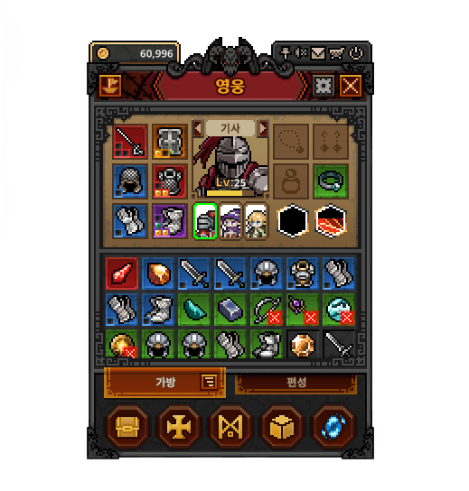
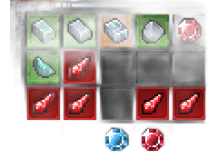
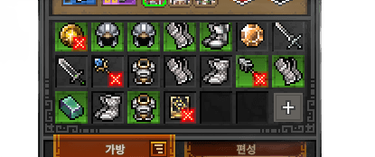
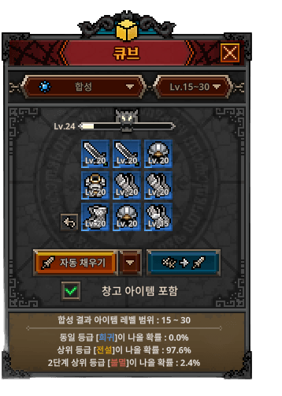
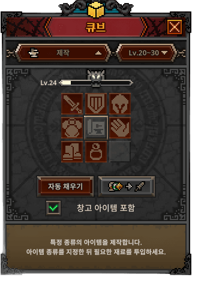
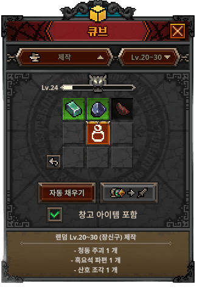

# 인벤토리 / 아이템 / 큐브 시스템 기획서

> 상위 문서: [서버 시스템 전체 개요](../서버-시스템-전체-개요.md) · 관련 도메인 4.4
>
> 본 문서는 플레이어가 보유한 **아이템의 저장·장착·강화·소모**와 **큐브(Hero-dric Cube)의 합성/분해/제작**을 서버 권위로 처리하는 규칙을 다룬다. 저장 골격은 [세이브 데이터 기획서](save-data-기획서.md)(`player_item`·`player_cube`), 아이템·강화·큐브의 정적 정의는 [마스터 데이터 기획서](master-data/master-data-기획서.md)(`item_master`·`enhance_master`·`cube_master`)를 참고한다.

## 목차

- [1. 개요](#1-개요)
- [2. 기능 설명](#2-기능-설명)
- [3. 요구사항](#3-요구사항)
- [4. 데이터 모델](#4-데이터-모델)
- [5. API 명세](#5-api-명세)
  - [5.0 공통 규약 — 인벤토리 변경분(`inventoryDelta`)](#50-공통-규약--인벤토리-변경분inventorydelta)
  - [5.1 장착 — `POST /api/game/inventory/equip`](#51-장착--post-apigameinventoryequip)
  - [5.2 장착 해제 — `POST /api/game/inventory/unequip`](#52-장착-해제--post-apigameinventoryunequip)
  - [5.3 강화 — `POST /api/game/inventory/enhance`](#53-강화--post-apigameinventoryenhance)
  - [5.4 인벤토리 용량 확장 — `POST /api/game/inventory/expand`](#54-인벤토리-용량-확장--post-apigameinventoryexpand)
  - [5.5 인벤토리 배치 변경(이동/교환) — `POST /api/game/inventory/move`](#55-인벤토리-배치-변경이동교환--post-apigameinventorymove)
  - [5.6 큐브 합성 — `POST /api/game/cube/combine`](#56-큐브-합성--post-apigamecubecombine)
  - [5.7 큐브 분해 — `POST /api/game/cube/dismantle`](#57-큐브-분해--post-apigamecubedismantle)
  - [5.8 큐브 제작 — `POST /api/game/cube/craft`](#58-큐브-제작--post-apigamecubecraft)
- [6. 처리 흐름](#6-처리-흐름)
- [7. 에러 코드](#7-에러-코드)
- [8. 미결 사항 / TODO](#8-미결-사항--todo)
- [9. 참고](#9-참고)


## 1. 개요

- **목적**: 방치형 전투로 획득한 장비·재료를 **인벤토리에 보관·정리**하고, 장비를 **장착/강화**해 전투력을 올리며, **큐브**로 아이템을 합성(등급 상승)·분해(골드 전환)·제작하는 성장 순환을 서버 권위로 검증·반영한다. 아이템은 실질적 가치(거래소 판매·전투력)를 가지므로 모든 수량·등급·강화 결과는 **서버가 최종 확정**한다(클라이언트 보고 불신).
- **대상 서버**: `GameServer`(인벤토리/장비/큐브 상태 관리·검증·반영), `TaskbarHero.Common`(분류 enum·결과 DTO 공유). 인증은 AccountServer 발급 토큰을 GameServer 미들웨어가 검증.
- **범위 경계**:
  - **아이템 *획득*(드롭)의 확정은 본 문서 밖**이다. 온라인 자동 전투의 전리품 산출은 [스테이지/전투 결과 검증](../서버-시스템-전체-개요.md)(도메인 4.6)이 서버 권위로 계산하며, 그 결과가 본 문서의 인벤토리에 적재된다. 오프라인 보상은 **아이템을 지급하지 않는다**([오프라인 보상 정산 기획서](offline-reward-기획서.md) 2장).
  - **장비 스탯의 최종 합산·전투력 계산**은 성장/전투 도메인에서 다룬다. 본 문서는 어떤 아이템이 어느 슬롯에 장착되어 있고 강화 단계가 얼마인지의 **상태 관리**까지를 책임진다.
  - **아이템의 플레이어 간 거래**는 [거래소/교역선](../서버-시스템-전체-개요.md)(도메인 4.7)에서 다룬다. 본 문서의 "분해"는 큐브를 통한 **골드 전환**이며 거래소 판매와 다르다.
  - **소모품(`item_type=4`) 사용과 그 결과인 계정 버프는 [소모품 아이템 / 계정 버프 기획서](consumable-buff-기획서.md)** 가 다룬다(에러 코드 `4020~4029`). 본 문서는 소모품의 **보관·스택 규칙**까지만 책임진다.
  - **골드를 소모해 확률로 아이템을 뽑는 가챠는 [가챠(뽑기) 시스템 기획서](gacha-기획서.md)** 가 다룬다(도메인 4.11, 에러 코드 `12000`번대). 본 문서는 뽑은 아이템이 **가방에 적재되는 규칙**까지만 책임진다.
- **관련 기획서**: [[save-data-기획서]] (저장 골격·서버 검증), [[master-data-기획서]] (아이템·강화·큐브 정적 정의), [[gacha-기획서]] (가챠 지급 아이템), [[offline-reward-기획서]] (아이템 미지급), [[서버-시스템-전체-개요]] (도메인 4.4)



## 2. 기능 설명

- **인벤토리 보관**: 획득한 아이템은 인벤토리에 쌓인다. 장비(`item_type=1`)는 개별 슬롯(강화 단계가 개체별로 다르므로 겹치지 않음), 재료(`item_type=2`)·소모품(`item_type=4`)은 `stack_max`까지 **겹쳐서(stack)** 보관한다.




- **장착 / 해제**: 장비 아이템을 슬롯(무기·보조무기·투구·갑옷·장갑·신발, [마스터 데이터 기획서](master-data/master-data-기획서.md) 5.2)에 장착/해제한다. 이미 장착된 슬롯에 새 장비를 끼우면 기존 장비는 인벤토리로 되돌아온다(스왑).
- **강화**: 장비를 재화(현재 골드)를 소모해 강화 단계(`enhance_level`)를 **1씩** 올린다(최대 **+10**). 단계별 비용·스탯 배율은 `enhance_master`가 정의하며, 실패·하락·파괴 없이 비용을 내면 확정 상승한다. 장착 중인 장비도 해제 없이 강화할 수 있다(5.3).
- **큐브(Hero-dric Cube)**: 원작의 성장형 큐브. 사용할수록 큐브 자신이 성장(`cube_level`)한다. 필요 없는 아이템은 **분해**로 골드로 전환한다(별도 폐기 기능은 두지 않음).
  - **합성(combine)**: 같은 등급의 아이템 여러 개를 소모해 **한 등급 높은** 아이템을 만든다(`cube_master.combine_grade_up`·`combine_count`). **슬롯·클래스는 서로 달라도 된다.**
  - **분해(dismantle)**: 아이템을 분해해 **골드로 전환**한다(`cube_master.gold_per_scrap`).
  - **제작(craft)**: 재료를 소모해 지정 아이템을 만든다(레시피 기반).
  - **성장(`cube_level`)**: 합성·분해·제작으로 얻은 `cube_exp`가 `cube_master.required_exp(cube_level)` 이상이면 레벨업하고 초과분은 이월한다(**최대 5레벨**). 레벨은 분해 골드 계수(`gold_per_scrap`)와 제작 요구 레벨(`req_cube_level`) 게이팅에 작용한다(합성 소모 개수는 현재 전 레벨 3 고정).

## 3. 요구사항

**기능 요구사항**
- 조회는 **로드 2단계 분리**를 따른다([세이브 데이터 기획서](save-data-기획서.md) 2장·5.1·5.2). 장비(`equipped`)·재화(`currencies`)·큐브는 크기가 고정이라 코어 로드(`POST /api/game/load`)가 반환하고, **가방 아이템만** `POST /api/game/inventory/list`가 `slot` 커서 페이징으로 반환한다. 본 문서는 그 외 **상태를 바꾸는 액션**을 전용 엔드포인트로 제공한다.
- 장착/해제, 강화, 인벤토리 배치·용량, 큐브 합성/분해/제작을 각각 처리하고, 결과(변경된 인벤토리·재화·큐브 상태)를 응답한다.
- 큐브 합성 등 **결과가 확률/규칙에 따라 결정되는 연산은 서버가 산출**하고 클라이언트는 결과만 받는다.
- 모든 재화 소모·아이템 증감은 마스터 데이터 제약(존재 여부, `stack_max`, 최대 강화 단계, 슬롯-아이템 타입 정합성, 장비 클래스·레벨 제한)을 서버가 검증한 뒤 반영한다.

**비기능 요구사항**
- **서버 권위**: 수량·등급·강화 단계·개봉 결과는 서버가 마스터 데이터로 계산·검증한다. 클라이언트가 보낸 결과값은 신뢰하지 않는다.
- **원자성**: "재화 차감 + 아이템 증감(+장비/큐브 상태 변경)"은 하나의 `user_id` 단위 트랜잭션으로 처리한다. 중도 실패 시 전체 롤백하여 재화만 빠지거나 아이템만 생기는 상태를 막는다.
- **동시성/멱등성**: 단일 세션 정책([계정/로그인 기획서](account-login-기획서.md))으로 경합은 제한적이나, 대상 행(`player_item_id`/`user_id`)에 잠금을 걸어 같은 아이템에 대한 중복 강화·중복 소모를 막는다. 개별 액션은 서버가 대상 상태를 확인 후 반영하므로 동일 요청 재전송 시 이미 소모/장착된 상태면 해당 에러 코드로 거부된다.
- **읽기·쓰기 모두 MySQL 직접**: 모든 액션은 그 요청의 트랜잭션에서 MySQL에 즉시 커밋하며, 배치 변경(`move`)을 포함해 **지연 쓰기(write-behind)를 두지 않는다**(판단 근거는 5.5). 가방 조회도 **캐시를 두지 않고** slot 커서 keyset 질의로 MySQL에서 직접 읽는다(6.5) — 정본은 하나뿐이라 동기화 문제가 발생하지 않는다.

## 4. 데이터 모델

본 시스템은 [세이브 데이터 기획서](save-data-기획서.md) 3장의 기존 테이블을 사용하며, **전용 영속 테이블을 두지 않는다.** 인벤토리 용량 확장(5.4)에 쓰는 `game_player.inventory_capacity`까지 포함해 저장 구조는 세이브 데이터 기획서 ERD에 반영되어 있다. 아래는 본 도메인 관점에서 각 테이블의 역할과 세부 규칙이다.

| 테이블 | 역할 | 참조 마스터 |
|---|---|---|
| `player_item`(`player_item_id` PK, `user_id`, `row_type`, `item_code`, `quantity`, `slot`, `enhance_level`, `acquired_at`) | 보유 **아이템·재화 통합** 테이블 (**계정 공유**). `row_type`(1:아이템 2:재화)로 구분, `item_code`는 **모든 행이 `item_master.item_code`**(재화는 `item_type=3`, 골드=1), `quantity`는 수량/재화 금액(`bigint`). 보유 상태만 담고 장착 여부는 `player_item_equipped`로 분리 | `item_master`, `enhance_master` |
| `player_item_equipped`(`player_item_id` PK, `user_id`, `item_code`, `enhance_level`, `equipped_character_id`, `equipped_slot`) | **장착 중 아이템**만 담는 자식 테이블(`player_item`과 1:0..1). 행이 존재하면 장착 중 | `item_master`, `enhance_master`, `equip_slot_master` |
| `player_cube`(`user_id` PK, `cube_level`, `cube_exp`) | 큐브 성장 상태 (**계정 공유**) | `cube_master` |
| `game_player`(`inventory_capacity` 신규 컬럼) | 계정 인벤토리 최대 용량(골드로 확장) | — |

> **장착 상태는 별도 테이블(`player_item_equipped`)로 분리한다.** 아이템 보유(`player_item`)와 장착 위치는 관심사가 다르고, 아이템 행에 장착 컬럼을 두면 대다수 미장착 행에 NULL이 깔려 의미가 흐려진다. 장착 중인 아이템만 `player_item_equipped`에 행으로 두어 **장착=INSERT / 해제=DELETE**로 처리하고, PK `player_item_id`로 "한 아이템은 한 곳에만 장착", `(user_id, equipped_character_id, equipped_slot)` 유니크 인덱스로 "한 캐릭터-슬롯당 아이템 하나"를 보장한다([세이브 데이터 기획서](save-data-기획서.md) 3장).

> **재화(골드 등)도 `player_item`에 통합한다(별도 `player_currency`·`currency_master` 없음).** 재화는 `row_type=2` 행으로 저장하고 `item_code`=재화의 `item_code`(`item_master` `item_type=3`, 골드=1), `quantity`=재화 금액이다. 강화/제작 비용 차감, 분해 골드 적립, 용량 확장·가챠 비용 차감 등 **재화 증감은 해당 재화 행의 `quantity` UPDATE**로 처리한다. 재화 행은 `slot`이 NULL이라 인벤토리 용량 집계에서 제외되며, 계정당 재화 종류당 1행 유일성은 서버가 보장한다([세이브 데이터 기획서](save-data-기획서.md) 3장). API 응답의 `cost`/`balance`/`currencies`는 이 재화 행에서 파생한다.


- **캐릭터별/계정 공유**: 계정은 파티 자리 3개(3인 파티, [성장 시스템 기획서](growth-기획서.md))를 가지며 보유 캐릭터는 직업 수(현재 4)까지다. **인벤토리·골드·큐브는 계정 공유**(위 표 `user_id` 단위)이고, **장비 장착만 캐릭터별**이다(`equipped_character_id` = 캐릭터 고유 식별자). 파티에서 내려도 장착 상태는 유지된다. 한 아이템 행(`player_item_id`)은 계정 공용이지만 **동시에 한 캐릭터·한 슬롯에만 장착**된다.

**보관/스택 규칙 (확정)**
- **배치 위치(`slot`)**: 각 행은 인벤토리 UI의 특정 칸(`slot`, 0-based)에 놓인다. `(user_id, slot)`은 유니크하며 한 칸에는 한 행만 존재한다. 재접속 시 [인벤토리 페이지 조회](save-data-기획서.md#52-인벤토리-페이지-조회--post-apigameinventorylist)가 `slot`을 함께 내려 **마지막 접속과 동일한 배치를 복원**한다. `slot`은 **페이징 커서이자 정렬키**이므로 `(user_id, slot)` 유니크 인덱스가 가방 조회의 범위 스캔과 정렬을 그대로 담당한다(6.5). 획득 시 서버는 빈 `slot`에 배치하고, 빈 칸이 없으면(용량 초과) `InventoryFull(4002)`. `player_item_equipped.equipped_slot`(장착 슬롯)과는 별개 개념이다.
- **장비(`item_type=1`)**: `stack_max=1`. 개체마다 `enhance_level`이 다를 수 있으므로 **1개당 1 행(row)**으로 저장하며 겹치지 않는다. `player_item_id`가 개체 식별자다.
- **비장비(`item_type=2` 재료 · `item_type=4` 소모품)**: 동일 `item_code`는 `stack_max`까지 한 행에 `quantity`로 누적한다. 초과분은 새 행으로 분할한다. 소모품은 사용으로 수량이 0이 되면 행을 삭제해 가방 칸을 반납한다([소모품/버프 기획서](consumable-buff-기획서.md) 6.1).
- **장착 중 아이템(확정)**: `player_item_equipped`에 행이 있는 아이템이 "장착 중"이다. **장착 중에는 가방 칸을 차지하지 않는다** — 장착 시 `player_item.slot`을 NULL로 비우고(칸 반납), 해제 시 빈 칸을 찾아 다시 배치한다(5.1·5.2). 따라서 장착 장비는 인벤토리 용량 집계와 가방 페이지 조회에서 빠지며, 같은 아이템이 가방 목록과 코어 로드의 `equipped`에 동시에 나오지 않는다. 아이템 행 자체(`player_item`)는 계정에 남아 있으나 분해·거래 대상에서는 제외한다(해제 후 가능). `player_item_equipped`의 PK가 `player_item_id`라 같은 아이템을 둘 이상의 캐릭터가 동시에 장착할 수 없다.

**공유 enum / DTO (TaskbarHero.Common)**
- `item_type`(1:장비 2:재료 3:재화 4:소모품), `reward_type`(1:골드 2:아이템 3:재료), `equip_slot` 등 분류 코드는 [마스터 데이터 기획서](master-data/master-data-기획서.md) 5장 공통 규칙에 따라 `TaskbarHero.Common`에 enum으로 고정한다(값 변경 금지).
- 액션 결과 DTO(장착 결과·강화 결과·큐브 결과 등, 5장 응답 `data` 구조)는 `TaskbarHero.Common`에 공유 DTO로 둔다. 구체 필드는 5장 응답 스키마를 따르며, 클라이언트 UI 갱신에 사용한다.

**인벤토리 용량 (`game_player.inventory_capacity`, int)**
- 플레이어별 인벤토리 최대 칸 수. **기본 100**에서 시작해 골드 소모로 1칸씩 확장한다(5.4). 확장분이 플레이어마다 달라지므로 상수가 아닌 플레이어 단위 컬럼으로 저장한다.
- 용량 집계 기준은 **점유 칸 수**(= `slot`이 NULL이 아닌 `player_item` 행 수)다. 스택 행은 `quantity`와 무관하게 1칸을 차지하고, 재화 행과 장착 중인 장비는 `slot`이 NULL이라 집계에서 빠진다.

## 5. API 명세

**API 목록**

- [5.0 공통 규약 — 인벤토리 변경분(`inventoryDelta`)](#50-공통-규약--인벤토리-변경분inventorydelta)
- [5.1 장착 — `POST /api/game/inventory/equip`](#51-장착--post-apigameinventoryequip)
- [5.2 장착 해제 — `POST /api/game/inventory/unequip`](#52-장착-해제--post-apigameinventoryunequip)
- [5.3 강화 — `POST /api/game/inventory/enhance`](#53-강화--post-apigameinventoryenhance)
- [5.4 인벤토리 용량 확장 — `POST /api/game/inventory/expand`](#54-인벤토리-용량-확장--post-apigameinventoryexpand)
- [5.5 인벤토리 배치 변경(이동/교환) — `POST /api/game/inventory/move`](#55-인벤토리-배치-변경이동교환--post-apigameinventorymove)
- [5.6 큐브 합성 — `POST /api/game/cube/combine`](#56-큐브-합성--post-apigamecubecombine)
- [5.7 큐브 분해 — `POST /api/game/cube/dismantle`](#57-큐브-분해--post-apigamecubedismantle)
- [5.8 큐브 제작 — `POST /api/game/cube/craft`](#58-큐브-제작--post-apigamecubecraft)

Base URL(개발): `http://localhost:5247` (GameServer). 모든 API는 **POST**, 인증 요청 공통 형식 `{ userId, token, data }`, 응답 `{ success, errorCode, message, data }`([세이브 데이터 기획서](save-data-기획서.md) 5장과 동일 규약, `success`는 `errorCode == 0`과 동치). 아래 엔드포인트는 모두 **상태 변경 액션**이다.

> **조회 엔드포인트는 본 장에 명세하지 않는다.** 장비·재화·큐브는 `POST /api/game/load`([세이브 데이터 기획서](save-data-기획서.md) 5.1), 가방 아이템은 `POST /api/game/inventory/list`([같은 문서 5.2](save-data-기획서.md#52-인벤토리-페이지-조회--post-apigameinventorylist))가 담당한다. 후자는 경로상 인벤토리 컨트롤러(`GameInventoryController`)에 배치되지만 규칙은 세이브 로드 정책에 속하므로 그쪽에서 관리한다.

> 이 액션 엔드포인트들은 **RNG·비용을 수반하는 서버 권위 연산**이며, 각 액션이 자기 변경분을 그 요청 트랜잭션에서 직접 저장한다(별도의 일괄 저장 API는 없음, [세이브 데이터 기획서](save-data-기획서.md) 4장). 예를 들어 큐브 합성 결과는 클라이언트가 보고하는 것이 아니라 서버가 산출해 반영한다.

### 5.0 공통 규약 — 인벤토리 변경분(`inventoryDelta`)

**가방을 바꾸는 모든 액션은 그 변경분을 응답에 담는다. 클라이언트는 응답만으로 자기 로컬 가방 캐시(`Session.Bag`)를 갱신하며, 액션 뒤에 `/api/game/load`나 `/api/game/inventory/list`를 다시 부르지 않는다(확정).** 서버 쪽에는 캐시가 없으므로(6.5) 이 블록은 **클라이언트 재조회를 없애기 위한 것**이지 서버 캐시 갱신용이 아니다.

서버는 트랜잭션 안에서 이미 어떤 행이 생기고 사라지고 바뀌었는지 알고 있으므로, 이 블록을 채우는 데 추가 조회 비용이 들지 않는다. 반대로 클라이언트가 전량을 재조회하면 액션 1회마다 **코어 스냅샷 + 가방 전 페이지**를 다시 읽게 되어, 액션 자체보다 훨씬 비싼 읽기가 따라붙는다.

```json
"inventoryDelta": {
  "upserted": [ { "itemId": 6100, "slot": 23, "itemCode": 30120, "quantity": 1, "enhanceLevel": 0 } ],
  "removed":  [ 4801, 4802, 4803 ]
}
```

| 필드 | 의미 |
|---|---|
| `upserted` | 생기거나 바뀐 가방 행의 **최종 상태 전체**. 항목 구조는 가방 페이지 조회의 `InventoryItemDto`와 동일(`itemId`·`slot`·`itemCode`·`quantity`·`enhanceLevel`)하므로 공유 DTO를 그대로 재사용한다 |
| `removed` | 사라진 행의 `itemId` 목록(전량 소모·분해·합성 입력·거래 등록 등) |

- **적용 순서는 `removed` → `upserted`** 다. 클라이언트는 `itemId`를 키로 지우고 덮어쓰기만 하면 되며(upsert), 같은 응답을 두 번 적용해도 결과가 같다(멱등).
- **추가/수정을 구분하지 않는다.** 새 행인지 기존 행의 수량·칸 변경인지는 클라이언트가 알 필요가 없다.
- **재화는 이 블록에 넣지 않는다.** 기존 `balance`(변경 후 잔액) 필드를 그대로 쓴다.
- **장착 상태 변경은 이 블록에 넣지 않는다.** 각 액션의 `equipped`/`unequipped` 필드가 담당한다(5.1·5.2).
- 가방이 바뀌지 않는 액션은 이 블록을 생략한다.

**이 블록을 담는 엔드포인트**

| 도메인 | 엔드포인트 | 가방 변경 내용 |
|---|---|---|
| 큐브 | `cube/combine` · `cube/dismantle` · `cube/craft` | 입력 소모·결과 생성·재료 차감 |
| **가챠** | `gacha/pull` | **뽑은 아이템 적재**(1연·10연 공통, 스택 병합 포함, [가챠 기획서](gacha-기획서.md) 5.2) |
| 소모품 | `consumable/use` | 수량 1 차감(0이면 행 삭제) |
| 메일 | `mail/claim` · `mail/claim-all` | 첨부 아이템 적재 |
| **스테이지** | `stage/clear` | **전리품 적재**(스택 병합·새 칸) |
| **거래소** | `trade/register` · `trade/cancel` | **등록 = 에스크로로 제거 / 취소 = 가방 복귀** |

`trade/buy`는 구매 아이템이 우편함으로 가고 구매자 가방은 그대로이므로 이 블록을 두지 않는다(골드 변동은 `balance`). 장착·해제(5.1·5.2)와 강화(5.3)·용량 확장(5.4)도 기존 필드로 충분해 생략한다 — 강화는 대상 행의 `enhanceLevel` 하나만 바뀌므로 응답의 `itemId`·`enhanceLevel`로 갱신한다.
### 5.1 장착 — `POST /api/game/inventory/equip`

지정 캐릭터에게 아이템을 장착한다. 장착 슬롯은 아이템의 `item_master.equip_slot`에서 파생하며, 서버는 `player_item_equipped`에 대상 아이템의 장착 행(`equipped_character_id`/`equipped_slot`)을 INSERT한다. 그 캐릭터의 같은 슬롯에 이미 장착된 장비가 있으면 그 장착 행을 DELETE해 스왑한다. 장비의 **클래스 제한**(`item_master.class_req`, `0`은 전 클래스 공용)이 **대상 캐릭터의 직업**(`player_character.class_code`, 기사/레인저/마법사/슬레이어)과 일치해야 하고, 그 캐릭터 `level`이 **요구 레벨**(`item_master.level_req`, **5레벨 단위**, `0`은 제한 없음) 이상이어야 하며, 어느 하나라도 위반하면 `ItemNotEquippable(4003)`로 거부한다.

**가방 칸 반납(확정)**: 장착과 동시에 그 아이템의 `player_item.slot`을 **NULL로 비운다**. 장착한 장비는 가방을 차지하지 않으므로 인벤토리 용량과 가방 페이지 조회에서 빠진다. 스왑이 일어나면 밀려난 기존 장비가 **방금 비운 그 칸**으로 들어가므로 점유 칸 수가 상쇄되어, 스왑 장착은 가방이 가득 차 있어도 실패하지 않는다.

**Request**
```json
{ "userId": 1, "token": "...", "data": { "characterId": 1, "itemId": 5001 } }
```

- `characterId`: 장착할 캐릭터의 고유 식별자(파티 편성 여부와 무관). `itemId`: 장착할 아이템(`player_item.player_item_id`).

**Response (성공, 200 OK)**
```json
{
  "success": true,
  "errorCode": 0,
  "message": "Equipped",
  "data": {
    "characterId": 1,
    "equipped": { "slot": 1, "itemId": 5001 },
    "unequipped": { "slot": 1, "itemId": 4900 },
    "unequippedBagSlot": 12
  }
}
```

- `equipped.slot`·`unequipped.slot`: **장착 슬롯**(`equip_slot_master`)이다. 가방 칸이 아니다.
- `unequipped`: 스왑으로 미장착 상태로 되돌아온 기존 장비(없으면 `null`).
- `unequippedBagSlot`: 그 기존 장비가 되돌아간 **가방 칸**(스왑이 없으면 `-1`). 장착한 아이템이 비운 칸을 그대로 물려받는다.
- 클라이언트는 장착한 아이템(`equipped.itemId`)을 가방 목록에서 제거하고, `unequipped`가 있으면 `unequippedBagSlot` 칸에 그린다. 밀려난 장비의 아이템 코드·강화 단계는 클라이언트가 이미 장착 정보로 갖고 있으므로 **이 응답만으로 가방과 장비 슬롯을 모두 갱신할 수 있다 — 재조회하지 않는다**(5.0).
- 오류: `ItemNotFound(4001)`(인벤토리에 없음), `ItemNotEquippable(4003)`(장비가 아니거나 슬롯·클래스·레벨 부적합), `ItemEquipped(4007)`(다른 캐릭터가 이미 장착 중), `InvalidCharacterId(2006)`(잘못된 `characterId`), `InventoryFull(4002)`(스왑 장비를 되돌릴 칸이 없는 예외 상황 — 칸을 반납하지 못한 경우에만 발생).

### 5.2 장착 해제 — `POST /api/game/inventory/unequip`

지정 캐릭터의 지정 장착 슬롯 장비를 해제해 가방으로 되돌린다(`player_item_equipped`의 해당 장착 행을 DELETE).

**가방 칸 재배치(확정)**: 장착 중에는 가방 칸을 쓰지 않으므로(5.1), 해제하려면 **되돌릴 빈 칸이 있어야 한다.** 서버가 `[0, inventory_capacity)`에서 **가장 작은 빈 칸**을 찾아 `player_item.slot`에 기록하며, 빈 칸이 없으면 `InventoryFull(4002)`로 거부한다(장비를 잃지 않도록 전체 롤백). 원래 있던 칸으로 돌아가는 것이 아니라 그 시점의 빈 칸으로 들어간다.

**Request**
```json
{ "userId": 1, "token": "...", "data": { "characterId": 1, "slot": 1 } }
```

- `slot`: 해제할 **장착 슬롯**(`equipped_slot`, 예: 무기=1).

**Response (성공, 200 OK)**
```json
{ "success": true, "errorCode": 0, "message": "Unequipped", "data": { "characterId": 1, "slot": 1, "itemId": 5001, "bagSlot": 7 } }
```

- `slot`: 비운 **장착 슬롯**. `bagSlot`: 장비가 되돌아간 **가방 칸**(0-based). 클라이언트는 이 칸에 아이템을 그린다(아이템 코드·강화 단계는 장착 정보로 이미 알고 있다). **재조회하지 않는다**(5.0).
- 해당 캐릭터의 슬롯이 비어 있으면 `ItemNotFound(4001)`, 잘못된 `characterId`는 `InvalidCharacterId(2006)`, 가방에 빈 칸이 없으면 `InventoryFull(4002)`.

### 5.3 강화 — `POST /api/game/inventory/enhance`

> **상태: 구현 완료.** 강화 단계별 비용·스탯 배율은 `enhance_master`가 확정값으로 정의한다([마스터 데이터 값](master-data/master-data-값.md) §7).

장비의 강화 단계를 **1 올린다**(1회 호출 = 1단계, 수량 지정 필드 없음). 비용은 `enhance_master`의 **다음 단계**(`현재 enhance_level + 1`) 정의를 서버가 산출하며(클라이언트 입력 불신), **실패·하락·파괴가 없다 — 비용을 내면 확정 상승한다.**

- **최대 단계는 `enhance_master` 행 수로 결정된다**(현재 **+10**). 다음 단계 정의가 없으면 `MaxEnhanceReached(4004)`.
- **스탯 배율**은 그 단계의 `stat_multiplier`(단일 배율)를 장비 옵션 스탯 전체에 곱한다(현재 단계당 +0.2 → **+10에서 3.0배** — 클라이언트가 정수로 반올림하므로 배율이 작으면 옵션 스탯이 작은 장비가 전혀 오르지 않는다, [마스터 데이터 값](master-data/master-data-값.md) §7). 서버는 배율을 응답에 담지 않는다 — 클라이언트가 마스터 번들에서 읽어 표시·전투 계산에 쓰고, 서버는 **단계(`enhance_level`)만 권위로 확정**한다.
- **장착 중인 장비도 그대로 강화할 수 있다(확정).** 해제를 요구하면 가방이 가득 찼을 때 해제 자체가 실패해(`InventoryFull(4002)`) 강화가 막히므로, 같은 트랜잭션에서 `player_item.enhance_level`과 **장착 행(`player_item_equipped.enhance_level`) 스냅샷을 함께** 올린다(코어 로드의 `equipped`가 이 컬럼을 그대로 내려주므로 갱신하지 않으면 장착 스탯이 옛 단계로 남는다).

**Request**
```json
{ "userId": 1, "token": "...", "data": { "itemId": 5001 } }
```

**Response (성공, 200 OK)**
```json
{
  "success": true,
  "errorCode": 0,
  "message": "Enhanced",
  "data": {
    "itemId": 5001,
    "enhanceLevel": 4,
    "equipped": false,
    "cost": { "currencyType": 1, "amount": 7000 },
    "balance": [ { "currencyType": 1, "amount": 9867421 } ]
  }
}
```

- `enhanceLevel`은 **상승 후** 단계, `cost`는 이번에 차감된 재화(`currencyType` = 소모 재화 `item_code`, 골드=1), `balance`는 차감 후 잔액이다. `equipped`는 그 장비가 장착 중이어서 장착 정보의 강화 단계까지 갱신됐음을 뜻한다.
- 트랜잭션: 비용 재화 차감 → `player_item.enhance_level += 1` → (장착 중이면) `player_item_equipped.enhance_level` 동일 값 갱신. 중도 실패 시 전체 롤백한다(재화만 빠지고 단계가 안 오르는 상태를 막는다).
- 가방 행은 이 아이템의 `enhanceLevel`만 바뀌므로 **`inventoryDelta`를 두지 않는다** — 클라이언트는 `itemId`·`enhanceLevel`로 캐시를 갱신하고 재조회하지 않는다(5.0).
- 오류: `ItemNotFound(4001)`, `ItemNotEquippable(4003)`(장비가 아님 — 재료·소모품·재화 행), `MaxEnhanceReached(4004)`(다음 단계가 `enhance_master`에 없음), `InsufficientCurrency(4005)`.

### 5.4 인벤토리 용량 확장 — `POST /api/game/inventory/expand`

골드를 소모해 인벤토리 최대 용량(`game_player.inventory_capacity`)을 늘린다. **확장은 1회 호출당 무조건 1칸**이며, 여는 칸별 골드 비용·최대 상한은 마스터 데이터(`inventory_expand_master`)가 정의하고 서버가 산출한다(클라이언트 입력 불신). 여는 칸의 비용은 `step = 현재 용량 − 기본 용량(100) + 1`의 `inventory_expand_master.gold_cost`이며, 상한 = 기본 용량 + 확장 정의 행 수(현재 20 → **상한 120**)다. 비용은 현재 전 칸 **정액(10,000골드)**이나, 칸별 누진으로 확장할 수 있다(값만 조정).



**Request** — 추가 데이터 없이 인증 정보만 보낸다(1칸 확장 고정, 수량 지정 필드 없음).
```json
{ "userId": 1, "token": "..." }
```

**Response (성공, 200 OK)**
```json
{
  "success": true,
  "errorCode": 0,
  "message": "Expanded",
  "data": {
    "inventoryCapacity": 101,
    "cost": { "currencyType": 1, "amount": 10000 },
    "balance": [ { "currencyType": 1, "amount": 9825421 } ]
  }
}
```

- 트랜잭션: 비용 골드 차감 → `inventory_capacity += 1`. 부분 실패 시 전체 롤백.
- `inventoryCapacity`는 확장 후 최종 용량, `cost`는 이번에 차감된 골드다. 가방 행은 바뀌지 않으므로 `inventoryDelta`가 없다 — 클라이언트는 용량과 잔액만 갱신하고 **재조회하지 않는다**(5.0).
- 오류: `InsufficientCurrency(4005)`(골드 부족), `InventoryCapacityMax(4008)`(이미 상한에 도달해 더 이상 확장 불가).

### 5.5 인벤토리 배치 변경(이동/교환) — `POST /api/game/inventory/move`

플레이어가 인벤토리에서 아이템을 **드래그해 다른 칸으로 옮긴** 결과를 서버에 저장한다. 목표 칸이 비어 있으면 이동, 다른 아이템이 있으면 두 칸을 **교환(swap)**한다. 배치는 UI 레이아웃 값이라 RNG·비용이 없으므로 범용 저장과 성격이 다르지만, 소유·용량 범위·칸 유효성을 서버가 검증해야 하므로 전용 액션 엔드포인트로 둔다.

**Request**
```json
{ "userId": 1, "token": "...", "data": { "itemId": 5001, "toSlot": 7 } }
```

- `itemId`: 옮길 아이템(행), `toSlot`: 이동 목표 칸(0-based, 용량 범위 내).

**Response (성공, 200 OK)**
```json
{
  "success": true,
  "errorCode": 0,
  "message": "Moved",
  "data": {
    "moved": { "itemId": 5001, "slot": 7 },
    "swapped": { "itemId": 4950, "slot": 0 }
  }
}
```

- `moved`: 옮겨진 아이템의 최종 `slot`. `swapped`: 목표 칸에 있던 아이템이 원래 칸으로 밀려난 결과(목표 칸이 비어 있었으면 `null`).
- 트랜잭션: 두 행의 `slot` 갱신을 하나의 트랜잭션으로 처리해 `(user_id, slot)` 유니크 위반이 생기지 않게 한다.
- 오류: `ItemNotFound(4001)`(대상 아이템이 인벤토리에 없음), `InvalidInventorySlot(4009)`(`toSlot`이 용량 범위 밖이거나 잘못된 값).

**드래그 1회 = 요청 1회로 즉시 반영한다(확정).** 쓰기 요청을 줄이려는 두 대안 — 서버 Redis 배치 캐시(지연 쓰기)와 클라이언트 일괄 커밋(창고를 닫을 때 변경분 전송) — 은 검토 후 **모두 채택하지 않는다.**

- **병목이 아니다.** 드래그는 사람 손 속도라 계정당 초당 1~2건이고, `(user_id, slot)` 유니크 인덱스를 타는 `UPDATE` 1~3개짜리 트랜잭션이다. 측정된 병목 없이 계층을 얹을 이유가 없다.
- **지연 반영은 `slot`의 writer를 둘로 만든다.** 전리품 적재·메일 첨부 수령·큐브·거래소·장착 해제가 모두 "가장 작은 빈 칸"을 계산하므로, 미반영 배치가 있으면 낡은 점유 상태 위에서 칸을 잡는다. 이를 막으려면 선행 flush·계정 락·방어 필터가 줄줄이 필요해져 복잡도가 이득을 넘는다.
- **방치형 특성상 정리 중에도 전리품이 계속 들어온다.** 자동 전투를 돌린 채 가방을 정리하는 것이 기본 시나리오라, 클라이언트가 배치를 모아 두면 창고를 열어 둔 내내 서버 배치와 어긋난다. 전리품이 들어올 때마다 클라이언트가 자기 보류분과의 충돌을 재조정해야 하고, 창고를 닫는 순간 여러 아이템이 튀어 **정리한 배치가 흐트러져 보인다.** 즉시 반영은 불일치 구간이 왕복 1회뿐이라 이 문제가 없다.

> 이는 **쓰기 경로**에 대한 결정이다. 가방 **조회** 역시 캐시 없이 MySQL을 직접 읽는다(6.5) — 읽기·쓰기의 정본이 하나로 유지된다.

### 5.6 큐브 합성 — `POST /api/game/cube/combine`

같은 등급의 아이템 여러 개를 소모해 한 등급 높은 아이템을 만든다(슬롯·클래스는 서로 달라도 된다).



**Request**
```json
{ "userId": 1, "token": "...", "data": { "itemIds": [4801, 4802, 4803] } }
```

**Response (성공, 200 OK)**
```json
{
  "success": true,
  "errorCode": 0,
  "message": "Combined",
  "data": {
    "consumed": [4801, 4802, 4803],
    "result": { "itemId": 5300, "itemCode": 30120, "grade": 4 },
    "cube": { "cubeLevel": 4, "cubeExp": 1350 },
    "inventoryDelta": {
      "upserted": [ { "itemId": 5300, "slot": 12, "itemCode": 30120, "quantity": 1, "enhanceLevel": 0 } ],
      "removed": [4801, 4802, 4803]
    }
  }
}
```

- **입력/결과 규칙(확정·구현)**: 입력은 **모두 장비(item_type=1)이며 같은 등급**이어야 하고 **슬롯·클래스 제한(`class_req`)은 서로 달라도 된다**, 개수는 현재 큐브 레벨의 `combine_count`(현재 5레벨 모두 3)와 일치해야 한다. 결과는 **(입력 등급+1) 장비 하나를 서버가 무작위로 선정(슬롯·클래스 무관)**해 지급한다(입력 3개 삭제로 빈 칸이 생겨 항상 적재). 등급 5 입력은 상위 등급 후보가 없어 `CubeRecipeNotMet(4010)`. 큐브 경험치 `50 × 입력 등급`을 획득해 누적한다(레벨업 시 이월). 응답 `cube`는 갱신 후 큐브 상태.
- `result`는 결과 아이템의 식별·표시 정보이고, **그 아이템이 실제로 놓인 가방 칸은 `inventoryDelta.upserted`가 알려준다**(5.0). 클라이언트는 이 응답만으로 입력 3개를 지우고 결과 1개를 그린다 — 재조회하지 않는다.
- 오류: `ItemNotFound(4001)`(입력 일부 미보유/재화 행), `ItemEquipped(4007)`(입력 중 장착 중), `CubeRecipeNotMet(4010)`(등급 불일치·개수 불일치·최대 등급).

### 5.7 큐브 분해 — `POST /api/game/cube/dismantle`

아이템을 분해해 골드로 전환한다(`cube_master.gold_per_scrap` 기준, 서버 산출).


**Request**
```json
{ "userId": 1, "token": "...", "data": { "items": [ { "itemId": 4700, "count": 1 } ] } }
```

**Response (성공, 200 OK)**
```json
{
  "success": true,
  "errorCode": 0,
  "message": "Dismantled",
  "data": {
    "gold": 300,
    "cubeExp": 60,
    "cube": { "cubeLevel": 4, "cubeExp": 1410 },
    "balance": [ { "currencyType": 1, "amount": 9880721 } ],
    "inventoryDelta": {
      "upserted": [ { "itemId": 4700, "slot": 3, "itemCode": 41001, "quantity": 2, "enhanceLevel": 0 } ],
      "removed": [4712]
    }
  }
}
```

| 필드 | 설명 |
|---|---|
| `gold` | 이번 분해로 **획득한 골드**(서버 산출 합계) |
| `cubeExp` | 이번 분해로 **획득한 큐브 경험치**(증가분) |
| `cube` | 갱신 후 큐브 상태(레벨·누적 경험치) |
| `balance` | 적립 후 재화 잔액 |
| `inventoryDelta` | 수량이 줄어든 행(`upserted`)과 전량 분해로 사라진 행(`removed`) — 5.0 |

- **산출 공식(확정·구현)**: 아이템당 골드 = `gold_per_scrap(현재 큐브 레벨) × 아이템 등급 × 개수`, 큐브 경험치 = `20 × 아이템 등급 × 개수`. 여러 아이템은 합산한다. `items[].count`는 장비(스택 1)는 1, 재료 스택은 보유 수량 이하. 장착 중 아이템은 `ItemEquipped(4007)`로 거부한다.
- **클라이언트는 이 응답만으로 가방·재화·큐브 표시를 모두 갱신한다 — 재조회하지 않는다**(5.0).
- 오류: `ItemNotFound(4001)`, `InsufficientQuantity(4006)`, `ItemEquipped(4007)`.

### 5.8 큐브 제작 — `POST /api/game/cube/craft`

> **상태: 구현 완료.** 레시피(`cube_recipe` + `cube_recipe_ingredient`) 기반으로 재료·골드를 소모해 지정 아이템을 만든다.

레시피에 따라 재료를 소모해 지정 아이템을 만든다.





**Request**
```json
{ "userId": 1, "token": "...", "data": { "recipeCode": 8001 } }
```

**Response (성공, 200 OK)**
```json
{
  "success": true,
  "errorCode": 0,
  "message": "Crafted",
  "data": {
    "consumed": [ { "itemCode": 41001, "quantity": 5 } ],
    "gained": { "items": [ { "itemCode": 30500, "quantity": 1 } ] },
    "cube": { "cubeLevel": 5, "cubeExp": 20 },
    "balance": [ { "currencyType": 1, "amount": 9870421 } ],
    "inventoryDelta": {
      "upserted": [ { "itemId": 6100, "slot": 23, "itemCode": 30500, "quantity": 1, "enhanceLevel": 0 } ],
      "removed": [5501]
    }
  }
}
```

- `consumed`·`gained`는 사람이 읽는 표시용(아이템 **코드**·수량)이고, 가방 반영은 `inventoryDelta`가 담당한다(행 식별자 `itemId`와 배치 `slot`을 포함). **클라이언트는 이 응답만으로 갱신하고 재조회하지 않는다**(5.0).
- **규칙(확정·구현)**: `recipeCode`로 `cube_recipe`(결과 아이템·수량·요구 큐브 레벨·비용 골드)와 자식 `cube_recipe_ingredient`(소모 재료·수량)를 조회한다. 현재 큐브 레벨 ≥ `req_cube_level`, 골드 ≥ `cost_gold`, 재료 보유 ≥ 요구량을 모두 만족하면 골드·재료를 차감하고 결과 아이템을 지급한다(빈 칸 부족 시 `InventoryFull`). 큐브 경험치 `20`(고정)을 획득한다. 응답 `cube`는 갱신 후 큐브 상태.
- 오류: `CubeRecipeNotMet(4010)`(없는 레시피·재료 부족), `CubeLevelInsufficient(4011)`(큐브 레벨 미달), `InsufficientCurrency(4005)`(비용 골드 부족), `InventoryFull(4002)`(결과 적재 용량 부족).

> 인증 오류(401), 마스터에 없는 코드 요청 등은 기존 미들웨어·`InvalidSaveData(2002)`/마스터 도메인 코드를 따른다.

## 6. 처리 흐름

### 6.1 공통 트랜잭션 골격 (의사코드)

```
요청 수신 → 토큰 검증(미들웨어)
트랜잭션(BEGIN, user_id 잠금)
  1) 대상 조회: player_item_id / slot / 재화 잔액 로드 (행 잠금)
  2) 마스터 검증: item_master·enhance_master·cube_master 제약 확인
  3) 규칙 판정: 슬롯 정합성 / 다음 강화 단계 존재 / 합성 조건 / 수량·비용 충족
     └ 위반 시 ROLLBACK + 해당 ErrorCode 반환
  4) (RNG 연산) 큐브 합성 결과를 서버가 산출
  5) 반영: 재화 차감/적립, 인벤토리 증감(스택 병합/분할), 장착·큐브 상태 갱신
COMMIT → 변경된 상태를 응답 data로 반환
```

- 4·5단계 결과는 전부 서버가 확정한 값이며, 클라이언트는 응답으로만 인벤토리를 갱신한다. 5단계에서 바뀐 가방 행은 **커밋 전에 이미 확정되어 있으므로 그대로 `inventoryDelta`로 내려보낸다**(5.0) — 응답을 만들려고 다시 조회하지 않는다.
- 인벤토리를 바꿨다고 해서 별도의 변경 카운터·버전 값을 갱신하지 않는다. 가방 페이지 조회는 페이지 간 정합성을 검증하지 않으며, 클라이언트가 `itemId` 기준 병합으로 흡수한다([세이브 데이터 기획서](save-data-기획서.md) 2장·5.2).

### 6.2 장착 스왑 순서

```
equip(characterId, itemId):
  char = player_character[user_id, characterId]     # 없으면 InvalidCharacterId(2006)
  item = player_item[itemId]                        # slot = 현재 가방 칸(장착 중이면 NULL)
  if item 없음: ItemNotFound(4001)
  if player_item_equipped[itemId] 존재: ItemEquipped(4007)   # 이미 어딘가에 장착 중
  if item.item_type != 장비 or 슬롯 부적합
     or (class_req≠0 and class_req≠char.class_code) or char.level < level_req: ItemNotEquippable(4003)
  slot = item_master[item.item_code].equip_slot
  prev = player_item_equipped[user_id, equipped_character_id=characterId, equipped_slot=slot]  # 있으면 스왑 대상
  if prev: DELETE player_item_equipped[prev.player_item_id]   # 장착 행 삭제

  freedSlot = item.slot
  if freedSlot != NULL:
      UPDATE player_item[itemId] SET slot = NULL              # 가방 칸 반납(먼저 비워야 유니크 (user_id, slot) 위반 회피)

  if prev:
      prevBagSlot = freedSlot ?? 빈 칸 탐색                    # 통상 반납한 칸을 그대로 물려줌(칸 수 상쇄)
      if prevBagSlot == NULL: InventoryFull(4002)             # 예외 상황
      UPDATE player_item[prev.player_item_id] SET slot = prevBagSlot

  INSERT player_item_equipped(player_item_id=itemId, user_id, item_code=item.item_code, enhance_level=item.enhance_level, characterId, slot)
  return { characterId, equipped: {slot, itemId}, unequipped: prev, unequippedBagSlot: prevBagSlot ?? -1 }
```

### 6.2.1 장착 해제 순서

```
unequip(characterId, slot):
  char = player_character[user_id, characterId]     # 없으면 InvalidCharacterId(2006)
  itemId = player_item_equipped[user_id, equipped_character_id=characterId, equipped_slot=slot]
  if itemId 없음: ItemNotFound(4001)
  bagSlot = [0, inventory_capacity) 중 가장 작은 빈 칸        # 점유 칸 = slot NOT NULL 인 player_item
  if bagSlot == NULL: InventoryFull(4002)                    # 전체 롤백(장비를 잃지 않는다)
  UPDATE player_item[itemId] SET slot = bagSlot              # 가방 복귀
  DELETE player_item_equipped[itemId]
  return { characterId, slot, itemId, bagSlot }
```

### 6.3 예외 / 엣지 케이스

- **장착 중 아이템 분해/거래 시도**: `ItemEquipped(4007)`로 거부. 해제 후 처리한다.
- **가방이 가득 찬 상태에서 장착 해제**: 되돌릴 빈 칸이 없으므로 `InventoryFull(4002)`로 거부하고 전체 롤백한다(장비가 어디에도 없는 상태를 만들지 않는다). 플레이어는 가방을 정리하거나 용량을 확장(5.4)한 뒤 해제한다.
- **가방이 가득 찬 상태에서 스왑 장착**: 장착 아이템이 반납한 칸을 밀려난 장비가 그대로 물려받아 점유 칸 수가 그대로이므로 **정상 처리된다**.
- **장착 중 아이템 이동(`move`) 시도**: 장착 중에는 `slot`이 NULL이라 배치 대상이 아니므로 `ItemNotFound(4001)`로 거부한다.
- **스택 초과 획득**: 지급 시 `stack_max`까지 채우고 초과분은 새 행으로 분할. 인벤토리 용량(`game_player.inventory_capacity`)을 초과하면 `InventoryFull(4002)`. 용량은 골드로 확장할 수 있다(5.4).
- **최대 강화 초과**: 다음 `enhance_level`이 `enhance_master`에 없으면 `MaxEnhanceReached(4004)`(현재 상한 +10).
- **장착 중 아이템 강화**: 허용한다(분해·거래와 달리 `ItemEquipped(4007)`로 막지 않는다). 보유 행과 장착 행의 강화 단계를 한 트랜잭션에서 함께 올려 두 값이 어긋나지 않게 한다(5.3).
- **비장비 강화 시도**: 재료·소모품·재화 행을 강화하려 하면 `ItemNotEquippable(4003)`.
- **재화/재료 부족**: 비용 재화 부족은 `InsufficientCurrency(4005)`, 아이템/재료 수량 부족은 `InsufficientQuantity(4006)`. 검증은 반영 전에 수행하고 부족 시 롤백.
- **동시 중복 요청**: 같은 `player_item_id`에 대한 강화/소모/분해가 겹치면 행 잠금으로 직렬화하여 이중 소모를 방지한다.
- **큐브 조건 미충족**: 합성/제작의 등급·개수·재료·큐브 레벨 조건 위반은 `CubeRecipeNotMet(4010)`/`CubeLevelInsufficient(4011)`.

### 6.5 가방 조회 — 캐시를 두지 않는다 (확정)

**대상**: `POST /api/game/inventory/list`(가방 페이지 조회, [세이브 데이터 기획서](save-data-기획서.md) 5.2).

**가방 조회에는 Redis 캐시를 두지 않는다.** 요청의 `cursor`·`limit`을 그대로 질의로 넘겨 **필요한 구간만** MySQL에서 읽는다. 정본이 하나뿐이라 동기화라는 문제 자체가 없다.

```sql
SELECT player_item_id, slot, item_code, quantity, enhance_level
  FROM player_item
 WHERE user_id = ? AND row_type = 1 AND slot > ?   -- slot IS NULL(재화·장착 장비)은 비교에서 자동 제외
 ORDER BY slot
 LIMIT ?                                            -- 한 건 더 읽어 hasMore 판정
```

- `(user_id, slot)` 유니크 인덱스가 **범위 스캔과 정렬을 동시에 담당**한다 — 조인이 없고 `ORDER BY slot`이 인덱스 순서라 **filesort가 없다**. 커서 페이징이 이 인덱스를 그대로 타므로 뒤 페이지일수록 비싸지지도 않는다.
- `total`(총 점유 칸 수)은 같은 인덱스를 타는 `COUNT` 한 번으로 따로 구한다. 페이지 크기와 무관한 값이라 페이지 조회와 분리한다.
- **계정 세이브 존재 확인은 `total`이 0일 때만 한다.** `player_item`이 `game_player`에 FK(`ON DELETE CASCADE`)로 매달려 있어 세이브 없이 아이템 행이 존재할 수 없으므로, 가방에 한 행이라도 있으면 세이브 존재가 이미 증명된다. 가방이 완전히 빈 계정에서만 확인 쿼리를 쳐서 `SaveNotFound(2001)`와 "세이브는 있고 가방만 빔"을 가른다 — **응답은 어느 경우에도 동일하고 정상 경로의 DB 왕복만 3회에서 2회로 준다**([쿼리 분석](../공통/쿼리-분석.md) 5.4).
- **조회는 트랜잭션으로 묶지 않는다.** 읽기 전용이고, 페이지 사이의 정합성은 애초에 보장 대상이 아니다(클라이언트가 `itemId` 기준 병합으로 흡수한다 — [세이브 데이터 기획서](save-data-기획서.md) 5.2).

**캐시를 두지 않는 이유(확정)** — 캐시가 이득을 내는 네 조건 중 하나도 충족하지 않는다.

| 조건 | 가방 조회 | 판단 |
|---|---|---|
| 읽기가 쓰기보다 훨씬 잦다 | **반대다.** 조회는 창고·큐브·거래 패널을 열 때뿐이고(액션 뒤에는 `inventoryDelta`로 갱신해 재조회하지 않는다 — 5.0), 방치형이라 전리품·가챠·메일 수령으로 **쓰기가 계속 발생**한다 | ✗ |
| 여러 사용자가 같은 데이터를 읽는다 | **계정별 개인 데이터**라 캐시 한 건을 그 계정만 읽는다(재사용 1). 거래소 목록처럼 공유되지 않는다 | ✗ |
| 원 쿼리가 비싸다 | 단일 테이블 인덱스 범위 스캔. 조인·집계 없음, filesort 없음 | ✗ |
| DB가 병목이다 | 측정된 병목이 없다 | ✗ |

- **결정적인 것은 쓰기 증폭이다.** 스냅샷을 한 키에 통째로 담는 구조라 델타 한 건(≈90 B)을 반영하려면 **가방 전량(약 10 KB)을 GET → 병합 → SET** 해야 한다 — 약 200배 증폭이 **쓰기마다, 사용자 응답 경로 안에서** 발생한다. 드문 읽기 하나를 아끼려고 잦은 쓰기를 무겁게 만드는 거래였다.
- **정합성 위험도 함께 사라진다.** write-through 캐시에는 (1) MySQL 전량 읽기와 캐시 적재 사이에 다른 요청이 커밋하면 **옛 스냅샷이 되살아나는 경합**, (2) `GET→병합→SET`의 **잃은 갱신**, (3) 가방 행을 바꾸는 경로가 캐시 갱신을 빠뜨리면 오염이 남는 **누락 위험**이 있었다. 캐시를 없애면 세 가지가 모두 소멸한다.
- **전량 읽기도 함께 없앴다.** 캐시가 있던 동안에는 "전량을 읽어 캐시에 넣고 메모리에서 자르기"였다. 캐시 제거와 함께 페이징을 **DB 질의로 내려** 페이지 크기에 비례하는 비용만 들도록 바꿨다 — 그래서 캐시를 걷어내고도 읽기 비용이 이전보다 낮다.

**실측으로 확인했다** — 이 판단을 수치로 검증한 기록이 [쿼리 분석 8장](../공통/쿼리-분석.md#8-인벤토리-조회--redis-캐시-유무-실측-비교)에 있다. 캐시 히트만 보면 7~13배 빠르지만, ①이득이 히트율에 달려 있어 **손익분기(약 15~20%) 아래에서는 캐시가 오히려 손해**이고, ②**애초에 체감할 만한 차이가 아니다** — DB 조회는 API 응답 시간의 **1/4 안팎**이라 캐시로 아끼는 시간이 약 1.7ms(인터넷 RTT 포함 시 전체의 4~5%)이고, 처리량도 필요량의 수십~수백 배가 남는다. 위 표 첫 줄("읽기가 쓰기보다 훨씬 잦다 — 반대다")과 마지막 줄("DB가 병목이다 — 측정된 병목이 없다")이 실측으로 확인된 셈이다.

**Redis를 쓰는 곳과의 경계** — 거래소 목록 캐시([거래소 기획서](trade-기획서.md) 7.3)는 **전역 공유 읽기**라 위 표의 두 조건을 충족해 그대로 유지한다. 인증 토큰·배치 리더 락도 Redis를 계속 쓴다. 즉 "Redis를 쓰지 않는다"가 아니라 **"개인 데이터의 가벼운 조회에는 캐시를 두지 않는다"** 는 판단이다.

**하지 않는 것** — 쓰기를 Redis에 지연 반영하지 않는다(write-behind 미도입, 판단 근거는 5.5). 자산의 정합성·원자성·내구성은 MySQL 트랜잭션이 보장한다.

## 7. 에러 코드

`TaskbarHero.Common`의 `ErrorCode`에 추가 제안. 도메인 4.4(인벤토리/아이템/큐브)는 **4000번대**를 사용한다([통합 정의](../공통/error-code-정의.md) 블록 규약, 도메인 4.N → N000). 추가 시 통합 문서도 함께 갱신한다.

| 이름 | 값 | 의미 |
|---|---|---|
| ItemNotFound | 4001 | 대상 아이템이 인벤토리/슬롯에 없음 |
| InventoryFull | 4002 | 인벤토리 용량 초과 |
| ItemNotEquippable | 4003 | 장비가 아니거나 슬롯·클래스·레벨 부적합 |
| MaxEnhanceReached | 4004 | 최대 강화 단계 도달(다음 단계 없음) |
| InsufficientCurrency | 4005 | 비용 재화 부족(강화/제작) |
| InsufficientQuantity | 4006 | 아이템/재료 수량 부족 |
| ItemEquipped | 4007 | 장착 중이라 분해 불가 |
| InventoryCapacityMax | 4008 | 인벤토리 용량이 최대치에 도달(확장 불가) |
| InvalidInventorySlot | 4009 | 인벤토리 칸(slot) 번호가 잘못됨(용량 범위 밖 등) |
| CubeRecipeNotMet | 4010 | 큐브 합성/제작 조건(등급·개수·재료) 미충족 |
| CubeLevelInsufficient | 4011 | 큐브 레벨이 해당 연산 요구치 미만 |

- `4001~4009`는 인벤토리/아이템, `4010~4019`는 큐브, `4020~4029`는 **소모품/버프**([소모품/버프 기획서](consumable-buff-기획서.md) 7장)에 할당한다.
- `4012`는 **결번**이다. 재사용하지 않는다(가방 페이지 조회는 정합성 검증 장치를 두지 않는다).
- **가방 페이지 조회**([세이브 데이터 기획서](save-data-기획서.md#52-인벤토리-페이지-조회--post-apigameinventorylist) 5.2)는 전용 에러 코드를 쓰지 않고 세이브 없음(`SaveNotFound(2001)`)만 반환한다.
- `InsufficientCurrency(4005)`는 재화 부족을 처음 다루는 도메인으로서 본 블록에 정의한다. 재화 부족이 필요한 다른 도메인(예: 성장의 룬 업그레이드)은 이 코드를 **재정의하지 않고 그대로 재사용**한다(코드 값은 계약이므로 이동 금지).
- **가챠(뽑기)는 별도 도메인(4.11)이라 자체 블록(`12000`번대)을 쓴다**([가챠 기획서](gacha-기획서.md) 7장). 다만 뽑은 아이템의 적재 실패·비용 부족은 본 블록의 `InventoryFull(4002)`·`InsufficientCurrency(4005)`를 그대로 재사용한다.

## 8. 미결 사항 / TODO

- **직업 추가**: 현재 클래스는 기사·레인저·마법사·슬레이어 4종이다([마스터 데이터 기획서](master-data/master-data-기획서.md) 5.1 `class_master`). 추후 확인 후 추가할 예정이며, 추가 시 각 장비의 `item_master.class_req` 배정을 함께 갱신한다.
- **밸런스 수치**: 요구 레벨(`level_req`)별 장비 스탯 곡선, 큐브 경험치 획득량(합성 `50 × 등급` 등)·확장 비용(칸당 10,000골드 정액)·**강화 비용 곡선(1,000→65,000골드)과 배율(단계당 +0.2 → +10에서 3배)** 은 **학습용 임시값**이다. 스키마 변경 없이 값만 조정한다.
- **강화 실패 확률**: 현재 강화는 **확정 상승**으로 확정했다(5.3). 추후 실패·하락·파괴를 도입한다면 `enhance_master`에 확률 컬럼을 추가하고 5.3 응답에 결과 필드를 더한다(등급별 상한 차등도 그때 함께 검토).

## 9. 참고

- [서버 시스템 전체 개요](../서버-시스템-전체-개요.md) — 도메인 4.4(인벤토리/아이템), 4.6(전투 결과=아이템 획득 산출), 4.7(거래소)
- [세이브 데이터 기획서](save-data-기획서.md) — `player_item`·`player_cube` 저장 골격, 로드 스냅샷
- [마스터 데이터 기획서](master-data/master-data-기획서.md) — `item_master`·`equip_slot_master`·`enhance_master`·`cube_master`·`stage_reward`(전리품 드롭)
- [가챠(뽑기) 시스템 기획서](gacha-기획서.md) — 골드 소모 확률 지급(1연·10연·천장·기록)
- [소모품 아이템 / 계정 버프 기획서](consumable-buff-기획서.md) — 소모품(`item_type=4`) 사용·계정 획득량 버프(`player_buff`)
- [오프라인 보상 정산 기획서](offline-reward-기획서.md) — 오프라인 아이템 미지급
- [ErrorCode 통합 정의](../공통/error-code-정의.md) — 에러 코드 블록 규약(4000번대 인벤토리/아이템/큐브)
