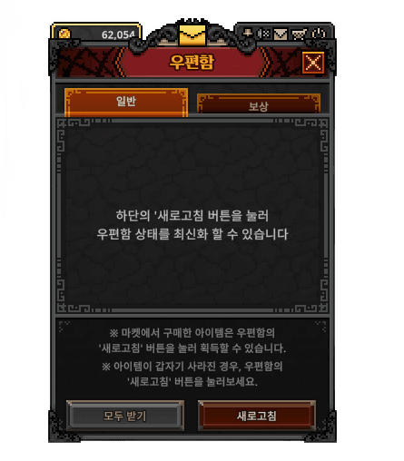
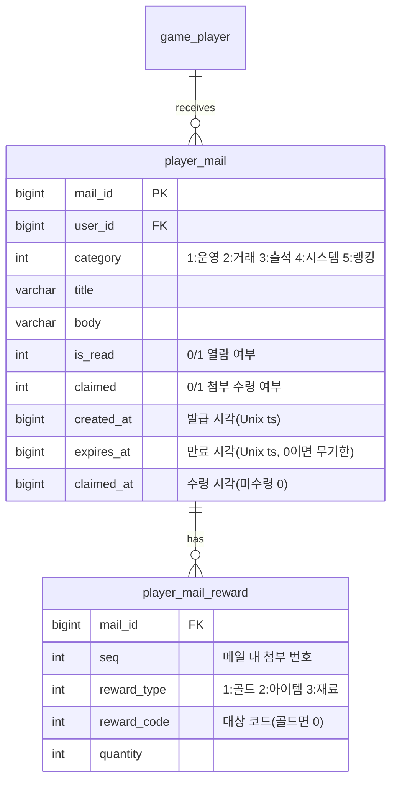

# 메일(보상) 수신 시스템 기획서

> 상위 문서: [서버 시스템 전체 개요](../서버-시스템-전체-개요.md) · 관련 도메인 4.8
>
> 본 문서는 운영·보상·거래 결과 등을 **우편함(메일)** 으로 지급하고 플레이어가 **첨부(재화·아이템)를 수령**하는 규칙을 서버 권위로 다룬다. 재화·아이템 반영은 [세이브 데이터 기획서](save-data-기획서.md)(`player_item` — 아이템·재화 통합)와 [인벤토리/아이템/큐브 기획서](inventory-item-cube-기획서.md) 규칙을 따른다.

## 목차

- [1. 개요](#1-개요)
- [2. 기능 설명](#2-기능-설명)
- [3. 요구사항](#3-요구사항)
- [4. 데이터 모델](#4-데이터-모델)
- [5. API 명세](#5-api-명세)
  - [5.1 우편함 조회 — `POST /api/game/mail/list`](#51-우편함-조회--post-apigamemaillist)
  - [5.2 메일 첨부 수령 — `POST /api/game/mail/claim`](#52-메일-첨부-수령--post-apigamemailclaim)
  - [5.3 일괄 수령 — `POST /api/game/mail/claim-all`](#53-일괄-수령--post-apigamemailclaim-all)
- [6. 처리 흐름](#6-처리-흐름)
- [7. 에러 코드](#7-에러-코드)
- [8. 참고](#8-참고)


## 1. 개요

- **목적**: 즉시 지급하기 어렵거나 오프라인 중 발생하는 보상(운영 지급, 거래소 판매 대금, 출석 보상 등)을 **우편함에 적재**해 두고, 플레이어가 접속해 **수령(claim)** 하면 첨부된 재화·아이템을 계정에 지급한다. 첨부는 실질 가치가 있으므로 지급·수령을 **서버가 원장으로 관리**해 중복 수령을 막는다.
- **대상 서버**: `GameServer`(메일 발급·조회·수령 처리), `TaskbarHero.Common`(메일·수령 결과 DTO·에러 코드 공유). 인증은 AccountServer 발급 토큰을 GameServer 미들웨어가 검증.
- **범위 경계**:
  - **메일 *발급*의 트리거**(무엇을 언제 보낼지)는 각 도메인이 담당한다: 거래소(4.7) 판매 대금·낙찰, 출석부(4.9) 보상, 보스러시(4.12) 시즌 순위 보상, 운영 지급 등. 본 문서는 발급된 메일의 **적재·조회·수령**을 책임진다.
  - **첨부 아이템의 인벤토리 적재 규칙**(스택·용량)은 [인벤토리/아이템/큐브 기획서](inventory-item-cube-기획서.md)를 따른다.
- **관련 기획서**: [[save-data-기획서]] (재화·인벤토리 반영), [[inventory-item-cube-기획서]] (첨부 아이템 적재), [[서버-시스템-전체-개요]] (도메인 4.8), 발급원: 거래소(4.7)·출석부(4.9)·보스러시 랭킹(4.12)


## 2. 기능 설명



- **우편함 조회**: 플레이어는 자신에게 온 메일 목록(제목·내용·첨부·수령 여부·만료 시각)을 본다. 메일을 열면 읽음 상태가 된다.
- **첨부 수령(claim)**: 재화·아이템이 첨부된 메일을 수령하면 서버가 첨부를 계정에 지급하고 **수령 완료**로 표시한다. 이미 수령한 메일은 다시 수령할 수 없다.
- **일괄 수령(claim all)**: 수령 가능한(미수령·미만료) 메일의 첨부를 한 번에 모아 받는다.
- **만료·삭제**: 메일에는 만료 시각이 있고(0이면 **무기한**), 만료된 메일은 수령할 수 없다. 메일은 **발급(수신) 후 7일간 보관**되고 이후 배치가 삭제하되, **미수령 무기한 메일은 보관 기한과 무관하게 남긴다**(6.5).

## 3. 요구사항

**기능 요구사항**
- 메일 목록 조회, 단건 수령, 일괄 수령을 제공한다.
- 첨부(재화·아이템)는 수령 시 **서버가 지급**하며, 지급 내용은 발급 시점에 확정된 메일 데이터를 따른다(클라이언트 입력 없음).
- 수령은 **중복 지급이 불가능**해야 한다(수령 플래그 + 행 잠금). 만료된 메일은 수령을 거부한다.
- 첨부 아이템이 인벤토리 용량을 초과하면 지급하지 않고 거부한다(`InventoryFull(4002)`).

**비기능 요구사항**
- **서버 권위**: 첨부 종류·수량은 서버가 저장한 메일 데이터가 기준이다. 클라이언트가 보고한 첨부를 신뢰하지 않는다.
- **원자성·멱등성**: "첨부 지급 + 수령 플래그 갱신"은 하나의 트랜잭션으로 처리하고, 대상 메일 행에 잠금을 걸어 중복 수령·이중 지급을 막는다. 수령 요청 재전송 시 이미 수령됨이면 거부한다.
- **정리(GC)**: 메일은 **발급 후 7일 보관 뒤 삭제**한다(6.5). 단 **미수령 무기한 메일(`expires_at=0`)은 삭제하지 않는다** — 만료를 두지 않기로 한 지급물을 보관 기한으로 잃게 하지 않기 위함이다(수령 후에는 정리 대상). 삭제는 배치가 주기적으로 수행하며, 즉시 삭제나 전용 삭제 API는 두지 않는다.

## 4. 데이터 모델

메일은 **새 영속 테이블 2개**(GameServer 세이브 DB)와 **새 마스터 테이블 1개**(`mail_master`, 발급 문구 템플릿 — 아래)를 요구한다. → 영속 테이블은 [세이브 데이터 기획서](save-data-기획서.md) ERD에 반영.



| 테이블 | 역할 | 참조 |
|---|---|---|
| `player_mail`(`mail_id` PK, `user_id`, `category`, `title`, `body`, `is_read`, `claimed`, `created_at`, `expires_at`, `claimed_at`) | 우편함 메일 1건 | — |
| `player_mail_reward`(`(mail_id, seq)` PK, `reward_type`, `reward_code`, `quantity`) | 메일 첨부(0~N개) | `item_master`(아이템/재료) |

- **`reward_code`의 의미**: `reward_type`이 보상의 *종류*(골드/아이템/재료)를 정하고, `reward_code`는 그 종류 안에서 *어떤 대상인지*를 가리키는 식별자다. `quantity`가 수량을 담당하므로, 세 필드가 `(무엇을 · 어떤 것을 · 몇 개)`로 첨부 1건을 표현한다. 종류별 규칙은 다음과 같다.
  - `reward_type=1`(골드): 골드는 종류 구분이 없으므로 `reward_code=0`으로 고정하고, 지급량은 `quantity`로만 표현한다.
  - `reward_type=2`(아이템)·`3`(재료): `reward_code`는 `item_master.item_code`를 가리키는 아이템/재료 코드이며, `quantity`는 개수(스택형은 스택 수)다.
  - 첨부는 **강화 단계를 보존한다**(`player_mail_reward.enhance_level`). 거래소 구매 아이템·만료 반송 장비가 메일로 오가므로, 등록 당시의 강화 단계가 그대로 수령된다. 골드·재료 첨부는 0이다.
- **첨부 없는 메일**: `player_mail_reward` 행이 없으면 첨부 없는 안내 메일이다. 이 경우 "수령"은 읽음 처리에 가깝고 지급이 없다.
- **수령/읽음 구분**: `is_read`는 열람 여부, `claimed`는 첨부 수령 여부다. 첨부가 있는 메일은 수령 시 `claimed=1`·`claimed_at` 기록.
- **계정 단위**: 메일은 계정(`user_id`) 소속이다. 첨부 재화·아이템은 계정 공유 `player_item`(재화 행/아이템 행)에 지급된다(캐릭터 지정 없음).

**메일 템플릿 — `mail_master` (마스터 데이터, 확정)**

메일 문구(제목·본문)·`category`·만료 일수는 발급자 코드에 하드코딩하지 않고 **마스터 테이블 `mail_master`** 로 관리한다. 마스터 DB에 두고 서버 기동 시 `MasterDbProvider`가 인메모리 적재한다(기존 마스터 파이프라인과 동일). 발급 시 서버가 템플릿 + 파라미터로 제목·본문을 **렌더링해 `player_mail.title`/`body`에 스냅샷으로 저장**하므로, 조회·수령 경로와 `player_mail` 스키마는 템플릿 도입과 무관하게 그대로이며 템플릿 수정이 기발급 메일에 소급되지 않는다.

| 필드 | 의미 |
|---|---|
| `mail_template_code` (PK) | 템플릿 코드. **`category × 100 + 순번`** 규약(1xx 운영, 2xx 거래, 3xx 출석, 5xx 랭킹 …) |
| `category` | 메일 분류(1:운영 2:거래 3:출석 4:시스템 5:랭킹). 발급 메일의 `player_mail.category`는 템플릿이 결정 |
| `title_format` / `body_format` | 제목·본문 문구. `{0}` 자리표시자에 발급 파라미터를 채워 렌더링 |
| `valid_days` | 만료 일수(`expires_at = created_at + valid_days일`). **0이면 무기한**(만료 없음). 만료를 두는 경우 보관 7일 정책상 **7 이하** |

- **현재 필요한 템플릿은 6종이다**: 신규 가입 지원금(101) — 계정 세이브 초기화 시 자동 발급하며 **무기한**(첫 접속이 늦어도 잃지 않는다), 거래소 판매 대금(201)·거래소 판매 만료 반송(202)·거래소 구매 아이템(203) — 거래 도메인이며 **셋 다 무기한**(거래로 확정된 재산을 수령 지연으로 잃게 하지 않는다), 출석 보상(301) — 출석 도메인, **보스러시 시즌 순위 보상(501)** — 랭킹 도메인이며 `valid_days = 7`([보스러시 기획서](boss-rush-기획서.md) 6.5). 실제 값은 [마스터 데이터 값 문서 부록](master-data/master-data-값.md)에 정의한다. 운영 지급 등 다른 문구는 발급 주체가 생길 때 템플릿을 추가한다(스키마 불변, 행 추가만).
- **신규 가입 지원금(101)의 첨부**는 별도 마스터 `newbie_reward_master`(마스터 데이터 값 문서 부록)가 정의한다 — 현재 골드 10,000,000 · 경험치 부스터(42001) 10개 · 골드 부스터(42002) 10개 3건이며, 지급 품목을 늘리려면 행만 추가하면 된다. 발급은 **계정 세이브 초기화 트랜잭션**(= 최초 캐릭터 생성, [세이브 데이터 기획서](save-data-기획서.md) 5.3) 안에서 이뤄지고, `game_player`가 계정당 1행이라 **계정 생애에 정확히 1회만** 성공하므로 지급 여부 플래그 없이 중복 지급이 차단된다.
- **클라이언트 번들로 내보내지 않는다**(서버 전용 마스터). 클라이언트는 렌더링 완료된 `title`/`body`를 목록 조회(5.1)로 받는다.

**공유 enum / DTO (TaskbarHero.Common)**
- `reward_type`(1:골드 2:아이템 3:재료)은 [인벤토리/아이템/큐브 기획서](inventory-item-cube-기획서.md)·[마스터 데이터 기획서](master-data/master-data-기획서.md)의 공유 enum과 동일 값으로 고정(값 변경 금지)한다.
- 메일·수령 결과 DTO는 `TaskbarHero.Common`에 공유 DTO로 두는 것을 **제안**한다(5장 응답 스키마).

## 5. API 명세

**API 목록**

- [5.1 우편함 조회 — `POST /api/game/mail/list`](#51-우편함-조회--post-apigamemaillist)
- [5.2 메일 첨부 수령 — `POST /api/game/mail/claim`](#52-메일-첨부-수령--post-apigamemailclaim)
- [5.3 일괄 수령 — `POST /api/game/mail/claim-all`](#53-일괄-수령--post-apigamemailclaim-all)

Base URL(개발): `http://localhost:5247` (GameServer). 모든 API는 **POST**, 인증 요청 공통 형식 `{ userId, token, data }`, 응답 `{ success, errorCode, message, data }`([세이브 데이터 기획서](save-data-기획서.md) 5장과 동일 규약).

### 5.1 우편함 조회 — `POST /api/game/mail/list`

플레이어의 메일 목록을 반환한다. **열람 처리(`is_read`)는 서버가 조회 시 일괄 수행한다**(조회 = 열람, 확정). 단, 응답의 `isRead`는 **조회 시점 값**이므로 클라이언트가 신규 메일 표시(뱃지 등)에 쓸 수 있다 — 갱신된 읽음 상태는 다음 조회부터 반영된다.

**Request**
```json
{ "userId": 1, "token": "...", "data": {} }
```

**Response (성공, 200 OK)**
```json
{
  "success": true,
  "errorCode": 0,
  "message": "OK",
  "data": {
    "mails": [
      {
        "mailId": 7001,
        "category": 2,
        "title": "거래소 판매 대금",
        "body": "'강철 대검' 판매 대금이 도착했습니다.",
        "attachments": [ { "rewardType": 1, "rewardCode": 0, "quantity": 5000 } ],
        "isRead": 0,
        "claimed": 0,
        "createdAt": 1752300000,
        "expiresAt": 1753500000
      }
    ]
  }
}
```

- `attachments`가 비어 있으면 첨부 없는 안내 메일이다.
- **목록 범위**: 만료·수령 완료 메일도 목록에 포함해 반환한다(상태 표시는 클라이언트 몫). **페이징 없음(전건 반환)** — 보관 7일 정책(6.5)으로 목록 크기가 자연히 유계이므로 충분하다.

### 5.2 메일 첨부 수령 — `POST /api/game/mail/claim`

지정 메일의 첨부를 수령한다. 서버가 첨부를 계정에 지급하고 수령 완료로 표시한다.

**Request**
```json
{ "userId": 1, "token": "...", "data": { "mailId": 7001 } }
```

**Response (성공, 200 OK)**
```json
{
  "success": true,
  "errorCode": 0,
  "message": "Claimed",
  "data": {
    "mailId": 7001,
    "gained": {
      "currencies": [ { "currencyType": 1, "amount": 5000 } ],
      "items": [ { "itemCode": 30105, "quantity": 1 } ]
    },
    "balance": [ { "currencyType": 1, "amount": 9880421 } ],
    "inventoryDelta": {
      "upserted": [ { "itemId": 6300, "slot": 41, "itemCode": 30105, "quantity": 1, "enhanceLevel": 0 } ],
      "removed": []
    }
  }
}
```

- `gained`는 서버가 지급한 첨부(재화·아이템)다. 메일은 `claimed=1`로 갱신된다.
- `gained.items`는 표시용(아이템 **코드**·수량)이고, 가방 반영은 `inventoryDelta`가 담당한다(행 식별자 `itemId`·배치 `slot` 포함, 스택 병합이면 기존 행이 `upserted`로 갱신된다). **클라이언트는 이 응답만으로 가방·재화를 갱신하고 재조회하지 않는다**([인벤토리/아이템/큐브 기획서](inventory-item-cube-기획서.md) 5.0 공통 규약).
- 오류: `MailNotFound(8001)`(메일 없음/타인 메일), `MailAlreadyClaimed(8002)`(이미 수령), `MailExpired(8003)`(만료), 첨부 아이템이 인벤토리 용량을 초과하면 `InventoryFull(4002)`.

### 5.3 일괄 수령 — `POST /api/game/mail/claim-all`

수령 가능한(미수령·미만료) 메일의 첨부를 한 번에 수령한다.

**Request**
```json
{ "userId": 1, "token": "...", "data": {} }
```

**Response (성공, 200 OK)**
```json
{
  "success": true,
  "errorCode": 0,
  "message": "Claimed all",
  "data": {
    "claimedMailIds": [7001, 7002, 7003],
    "gained": {
      "currencies": [ { "currencyType": 1, "amount": 15000 } ],
      "items": [ { "itemCode": 41001, "quantity": 5 } ]
    },
    "balance": [ { "currencyType": 1, "amount": 9895421 } ],
    "inventoryDelta": {
      "upserted": [ { "itemId": 6301, "slot": 41, "itemCode": 41001, "quantity": 5, "enhanceLevel": 0 } ],
      "removed": []
    }
  }
}
```

- `gained`는 수령한 모든 메일 첨부의 합계다. 첨부 아이템 적재가 인벤토리 용량을 넘으면 **전체 롤백**하고 `InventoryFull(4002)`를 반환한다(부분 수령 없음, 확정). 수령 대상이 없으면 빈 `claimedMailIds`로 성공(200)한다.
- `inventoryDelta`는 수령 전체를 합산한 **최종 가방 상태의 변경분**이다(메일별로 나누지 않는다). 단건 수령과 동일하게 클라이언트는 이 응답만으로 갱신하고 **재조회하지 않는다**([인벤토리/아이템/큐브 기획서](inventory-item-cube-기획서.md) 5.0).

> 인증 오류(401) 등은 기존 미들웨어를 따른다. 읽음 처리는 목록 조회 시 서버가 수행하며(5.1), 삭제 전용 엔드포인트는 없다 — 메일은 발급 후 7일 보관 뒤 배치가 삭제한다(6.5).

## 6. 처리 흐름

### 6.1 단건 수령 (의사코드)

```
요청 수신 → 토큰 검증(미들웨어)
트랜잭션(BEGIN, mail_id 행 잠금)
  1) mail = player_mail[mailId]
     if 없음 or mail.user_id != user_id: MailNotFound(8001)
  2) if mail.claimed == 1: MailAlreadyClaimed(8002)
  3) if mail.expires_at != 0 and now > mail.expires_at: MailExpired(8003)
  4) rewards = player_mail_reward[mailId]
     지급 결과가 인벤토리 용량 초과 시: InventoryFull(4002)
  5) 지급: 골드→player_item(재화 행 quantity), 아이템/재료→player_item(아이템 행, 스택/용량 규칙)
  6) mail.claimed = 1; mail.claimed_at = now; mail.is_read = 1
COMMIT → { mailId, gained, balance }
```

### 6.2 일괄 수령

- 미수령·미만료 메일을 모아 **하나의 트랜잭션**에서 각 메일을 6.1과 동일 규칙(메일별 조건부 갱신 선점 → 첨부 지급)으로 지급하고, 합계를 응답한다. 아이템 적재가 용량을 넘으면 **전체 롤백** 후 `InventoryFull(4002)`(확정 — 부분 수령 없음). 동시 단건 수령과 경합한 메일은 그 메일만 제외하고 계속한다.

### 6.3 예외 / 엣지 케이스

- **중복 수령**: `claimed=1`이면 `MailAlreadyClaimed(8002)`. 단건·일괄 모두 메일 행 **조건부 갱신(`claimed` 0→1일 때만 전이)** 으로 수령권을 선점해 동시 요청을 직렬화한다(행 잠금은 이 UPDATE가 겸한다) — 이중 지급 방지.
- **만료 메일 수령**: `MailExpired(8003)`. 만료 메일은 수령 불가하며 정리 대상.
- **타인 메일 접근**: `mail.user_id`가 요청자와 다르면 `MailNotFound(8001)`로 취급(존재 노출 안 함).
- **인벤토리 가득 참**: 첨부 아이템 지급이 용량을 넘으면 `InventoryFull(4002)`, 해당 메일은 수령되지 않음(미수령 유지).

### 6.4 발급 경로(내부 규약, 확정)

메일 발급은 **HTTP API가 아니라 GameServer 내부 호출**이다 — 발급 주체(거래소 구매·거래소 만료 배치·출석 획득)가 모두 같은 프로세스 안의 도메인 로직이고, 발급이 각 도메인의 트랜잭션에 속해야 하기 때문이다.

1. **발급자가 넘기는 것**: `(수신 user_id, mail_template_code, 문구 파라미터, 첨부 목록)`뿐이다. 제목·본문·`category`·`expires_at`은 `mail_master` 템플릿(4장)이 확정한다 — 발급자가 임의 문자열이나 category 값을 만들지 않으므로 도메인마다 값이 어긋날 여지가 없다.
2. **렌더링과 적재의 분리**: 발급 헬퍼(예: `MailComposer`)가 인메모리 `mail_master`로 제목·본문을 렌더링해 메일 초안을 만들고, `player_mail` + `player_mail_reward` INSERT는 **발급자의 트랜잭션 안에서** 리포지토리가 수행한다. 거래소 구매(선점 + 골드 차감 + 대금 메일), 출석 획득(출석 기록 + 보상 메일), 보스러시 시즌 정산(순위 확정 + 보상 메일)이 각각 하나의 트랜잭션으로 원자성을 유지하는 구조가 그대로 성립한다.
3. **현재 발급 경로 5곳**: 거래소 구매 아이템([trade 기획서 6.1](trade-기획서.md), 템플릿 203) · 거래소 판매 대금(같은 곳, 템플릿 201) · 거래소 만료 반송([trade 기획서 7.6](trade-기획서.md), 템플릿 202) · 출석 보상([출석부 기획서](attendance-기획서.md), 템플릿 301) · **보스러시 시즌 순위 보상**([보스러시 기획서 6.5](boss-rush-기획서.md), 템플릿 501 — 정산 배치가 순위 확정 UPDATE와 같은 트랜잭션에서 발급). 운영 지급은 발급 주체(관리 도구)가 생길 때 같은 규약으로 추가한다.

### 6.5 보관·삭제(GC 배치)

- 메일은 **발급(수신) 시각 기준 7일간 보관**하고, 경과분은 **배치 GC가 삭제**한다(`player_mail` 삭제 시 첨부 `player_mail_reward`는 FK CASCADE로 함께 삭제). 즉시 삭제·전용 삭제 엔드포인트는 두지 않는다.
- **예외 — 미수령 무기한 메일은 보관한다.** 삭제 조건은 `created_at + 7일 < now` **그리고** (`expires_at > 0` **또는** `claimed = 1`)이다. 거래소 구매 아이템처럼 만료를 없앤 지급물을 보관 기한으로 지우면 무기한 발급이 무의미해지기 때문이다. 수령을 마치면 보관 기한 경과분과 함께 정리된다.
- 만료를 두는 메일은 보관 7일이 사실상 **수령 가능 기간의 상한**이므로 `expires_at`을 7일 이내로 발급한다(`mail_master.valid_days ≤ 7`, 4장 — 현재는 출석 보상(301)·보스러시 순위 보상(501)이 해당). 무기한 메일(`valid_days=0` — 거래 메일 3종)은 이 상한을 적용받지 않는다.
- **배치 구현**: 거래소 만료 배치와 **공통 골격(`PeriodicBatchScheduler`, [trade 기획서 7.6.1](trade-기획서.md))을 재사용**하는 `BackgroundService`(`MailGcBatchScheduler`)로 구현한다 — **1시간 주기 · 1회 최대 500건**(잠정, 측정 후 확정), 대상은 위 삭제 조건을 만족하는 `player_mail` DELETE. 실행 모델·실패 처리·로깅 규칙은 trade 기획서 7.6.1·7.6.3을 그대로 따른다(메일 GC는 락·캐시 갱신이 없어 더 단순하다).

## 7. 에러 코드

`TaskbarHero.Common`의 `ErrorCode`에 추가 제안. 도메인 4.8(메일)는 **8000번대**를 사용한다([통합 정의](../공통/error-code-정의.md) 블록 규약, 도메인 4.N → N000). 추가 시 통합 문서도 함께 갱신한다.

| 이름 | 값 | 의미 |
|---|---|---|
| MailNotFound | 8001 | 메일이 없거나 본인 메일이 아님 |
| MailAlreadyClaimed | 8002 | 이미 첨부를 수령한 메일 |
| MailExpired | 8003 | 만료되어 수령 불가한 메일 |

- 첨부 아이템이 인벤토리 용량을 초과하면 신규 코드를 만들지 않고 `InventoryFull(4002)`([인벤토리/아이템/큐브 기획서](inventory-item-cube-기획서.md) 7장)를 재사용한다.

## 8. 참고

- [서버 시스템 전체 개요](../서버-시스템-전체-개요.md) — 도메인 4.8(메일), 4.7(거래소)·4.9(출석부) 발급원
- [세이브 데이터 기획서](save-data-기획서.md) — `player_mail`·`player_mail_reward` 저장, 재화·인벤토리 반영
- [인벤토리/아이템/큐브 기획서](inventory-item-cube-기획서.md) — 첨부 아이템 적재·`InventoryFull(4002)`
- [마스터 데이터 값](master-data/master-data-값.md) — `mail_master` 템플릿 실제 값(부록) · [trade 기획서](trade-기획서.md) 6.1(대금)·7.6(반송 배치) · [출석부 기획서](attendance-기획서.md)(보상 발급)
- [ErrorCode 통합 정의](../공통/error-code-정의.md) — 에러 코드 블록 규약(8000번대 메일)
