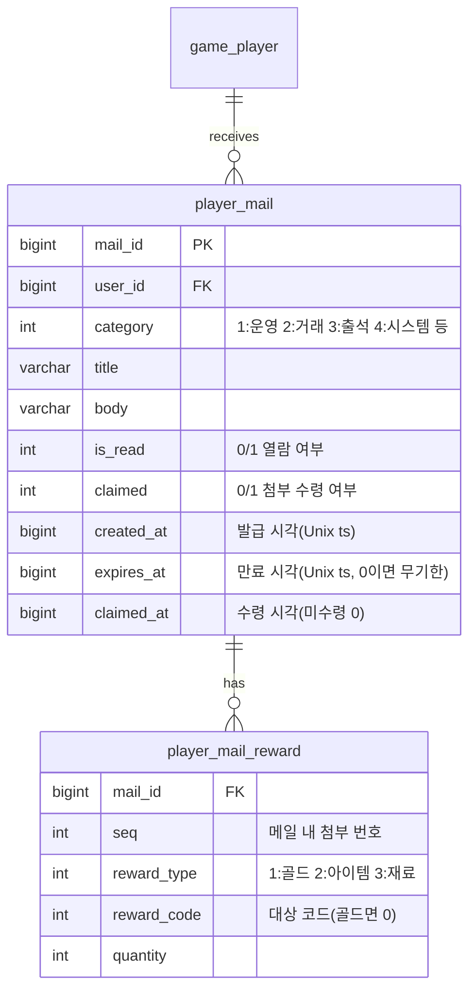

# 메일(보상) 수신 시스템 기획서

> 상위 문서: [서버 시스템 전체 개요](../공통/서버-시스템-전체-개요.md) · 관련 도메인 4.8
>
> 본 문서는 운영·보상·거래 결과 등을 **우편함(메일)** 으로 지급하고 플레이어가 **첨부(재화·아이템)를 수령**하는 규칙을 서버 권위로 다룬다. 재화·아이템 반영은 [세이브 데이터 기획서](save-data-기획서.md)(`player_item` — 아이템·재화 통합)와 [인벤토리/아이템/큐브 기획서](inventory-item-cube-기획서.md) 규칙을 따른다.

## 목차

- [1. 개요](#1-개요)
- [2. 기능 설명](#2-기능-설명)
- [3. 요구사항](#3-요구사항)
- [4. 데이터 모델](#4-데이터-모델)
- [5. API 명세](#5-api-명세)
  - [5.1 우편함 조회 — `POST /api/game/mail/list`](#51-우편함-조회--post-apigamemaillist)
  - [5.2 메일 첨부 수령 — `POST /api/game/mail/claim`](#52-메일-첨부-수령--post-apigamemailclaim)
  - [5.3 일괄 수령 — `POST /api/game/mail/claim-all`](#53-일괄-수령--post-apigamemailclaim-all)
- [6. 처리 흐름](#6-처리-흐름)
- [7. 에러 코드](#7-에러-코드)
- [8. 미결 사항 / TODO](#8-미결-사항--todo)
- [9. 참고](#9-참고)


## 1. 개요

- **목적**: 즉시 지급하기 어렵거나 오프라인 중 발생하는 보상(운영 지급, 거래소 판매 대금, 출석 보상 등)을 **우편함에 적재**해 두고, 플레이어가 접속해 **수령(claim)** 하면 첨부된 재화·아이템을 계정에 지급한다. 첨부는 실질 가치가 있으므로 지급·수령을 **서버가 원장으로 관리**해 중복 수령을 막는다.
- **대상 서버**: `GameServer`(메일 발급·조회·수령 처리), `TaskbarHero.Common`(메일·수령 결과 DTO·에러 코드 공유). 인증은 AccountServer 발급 토큰을 GameServer 미들웨어가 검증.
- **범위 경계**:
  - **메일 *발급*의 트리거**(무엇을 언제 보낼지)는 각 도메인이 담당한다: 거래소(4.7) 판매 대금·낙찰, 출석부(4.9) 보상, 운영 지급 등. 본 문서는 발급된 메일의 **적재·조회·수령**을 책임진다.
  - **첨부 아이템의 인벤토리 적재 규칙**(스택·용량)은 [인벤토리/아이템/큐브 기획서](inventory-item-cube-기획서.md)를 따른다.
- **관련 기획서**: [[save-data-기획서]] (재화·인벤토리 반영), [[inventory-item-cube-기획서]] (첨부 아이템 적재), [[서버-시스템-전체-개요]] (도메인 4.8), 발급원: 거래소(4.7)·출석부(4.9)

## 2. 기능 설명

- **우편함 조회**: 플레이어는 자신에게 온 메일 목록(제목·내용·첨부·수령 여부·만료 시각)을 본다. 메일을 열면 읽음 상태가 된다.
- **첨부 수령(claim)**: 재화·아이템이 첨부된 메일을 수령하면 서버가 첨부를 계정에 지급하고 **수령 완료**로 표시한다. 이미 수령한 메일은 다시 수령할 수 없다.
- **일괄 수령(claim all)**: 수령 가능한(미수령·미만료) 메일의 첨부를 한 번에 모아 받는다.
- **만료**: 각 메일은 만료 시각이 있으며, 만료된 메일은 수령할 수 없고 정리(삭제) 대상이 된다.

## 3. 요구사항

**기능 요구사항**
- 메일 목록 조회, 단건 수령, 일괄 수령을 제공한다.
- 첨부(재화·아이템)는 수령 시 **서버가 지급**하며, 지급 내용은 발급 시점에 확정된 메일 데이터를 따른다(클라이언트 입력 없음).
- 수령은 **중복 지급이 불가능**해야 한다(수령 플래그 + 행 잠금). 만료된 메일은 수령을 거부한다.
- 첨부 아이템이 인벤토리 용량을 초과하면 지급하지 않고 거부한다(`InventoryFull(4002)`).

**비기능 요구사항**
- **서버 권위**: 첨부 종류·수량은 서버가 저장한 메일 데이터가 기준이다. 클라이언트가 보고한 첨부를 신뢰하지 않는다.
- **원자성·멱등성**: "첨부 지급 + 수령 플래그 갱신"은 하나의 트랜잭션으로 처리하고, 대상 메일 행에 잠금을 걸어 중복 수령·이중 지급을 막는다. 수령 요청 재전송 시 이미 수령됨이면 거부한다.
- **정리(GC)**: 만료·수령 완료 메일은 주기적으로 정리한다(즉시 삭제 여부·주기는 8장 미결).

## 4. 데이터 모델

메일은 **새 영속 테이블 2개**를 요구한다(GameServer 세이브 DB). → [세이브 데이터 기획서](save-data-기획서.md) ERD에 반영.



| 테이블 | 역할 | 참조 |
|---|---|---|
| `player_mail`(`mail_id` PK, `user_id`, `category`, `title`, `body`, `is_read`, `claimed`, `created_at`, `expires_at`, `claimed_at`) | 우편함 메일 1건 | — |
| `player_mail_reward`(`(mail_id, seq)` PK, `reward_type`, `reward_code`, `quantity`) | 메일 첨부(0~N개) | `item_master`(아이템/재료) |

- **`reward_code`의 의미**: `reward_type`이 보상의 *종류*(골드/아이템/재료)를 정하고, `reward_code`는 그 종류 안에서 *어떤 대상인지*를 가리키는 식별자다. `quantity`가 수량을 담당하므로, 세 필드가 `(무엇을 · 어떤 것을 · 몇 개)`로 첨부 1건을 표현한다. 종류별 규칙은 다음과 같다.
  - `reward_type=1`(골드): 골드는 종류 구분이 없으므로 `reward_code=0`으로 고정하고, 지급량은 `quantity`로만 표현한다.
  - `reward_type=2`(아이템)·`3`(재료): `reward_code`는 `item_master.item_code`를 가리키는 아이템/재료 코드이며, `quantity`는 개수(스택형은 스택 수)다.
- **첨부 없는 메일**: `player_mail_reward` 행이 없으면 첨부 없는 안내 메일이다. 이 경우 "수령"은 읽음 처리에 가깝고 지급이 없다.
- **수령/읽음 구분**: `is_read`는 열람 여부, `claimed`는 첨부 수령 여부다. 첨부가 있는 메일은 수령 시 `claimed=1`·`claimed_at` 기록.
- **계정 단위**: 메일은 계정(`user_id`) 소속이다. 첨부 재화·아이템은 계정 공유 `player_item`(재화 행/아이템 행)에 지급된다(캐릭터 지정 없음).

**공유 enum / DTO (TaskbarHero.Common)**
- `reward_type`(1:골드 2:아이템 3:재료)은 [인벤토리/아이템/큐브 기획서](inventory-item-cube-기획서.md)·[마스터 데이터 기획서](master-data-기획서.md)의 공유 enum과 동일 값으로 고정(값 변경 금지)한다.
- 메일·수령 결과 DTO는 `TaskbarHero.Common`에 공유 DTO로 두는 것을 **제안**한다(5장 응답 스키마).

## 5. API 명세

**API 목록**

- [5.1 우편함 조회 — `POST /api/game/mail/list`](#51-우편함-조회--post-apigamemaillist)
- [5.2 메일 첨부 수령 — `POST /api/game/mail/claim`](#52-메일-첨부-수령--post-apigamemailclaim)
- [5.3 일괄 수령 — `POST /api/game/mail/claim-all`](#53-일괄-수령--post-apigamemailclaim-all)

Base URL(개발): `http://localhost:5247` (GameServer). 모든 API는 **POST**, 인증 요청 공통 형식 `{ userId, token, data }`, 응답 `{ success, errorCode, message, data }`([세이브 데이터 기획서](save-data-기획서.md) 5장과 동일 규약).

### 5.1 우편함 조회 — `POST /api/game/mail/list`

플레이어의 메일 목록을 반환한다. 목록을 받으면 클라이언트가 표시하며, 열람 처리(`is_read`)는 서버가 조회 시 수행하거나 별도 규칙을 따른다(8장 미결).

**Request**
```json
{ "userId": 1, "token": "...", "data": {} }
```

**Response (성공, 200 OK)**
```json
{
  "success": true,
  "errorCode": 0,
  "message": "OK",
  "data": {
    "mails": [
      {
        "mailId": 7001,
        "category": 2,
        "title": "거래소 판매 대금",
        "body": "'강철 대검' 판매 대금이 도착했습니다.",
        "attachments": [ { "rewardType": 1, "rewardCode": 0, "quantity": 5000 } ],
        "isRead": 0,
        "claimed": 0,
        "createdAt": 1752300000,
        "expiresAt": 1753500000
      }
    ]
  }
}
```

- `attachments`가 비어 있으면 첨부 없는 안내 메일이다. 목록 규모가 커질 경우의 페이징은 8장 미결.

### 5.2 메일 첨부 수령 — `POST /api/game/mail/claim`

지정 메일의 첨부를 수령한다. 서버가 첨부를 계정에 지급하고 수령 완료로 표시한다.

**Request**
```json
{ "userId": 1, "token": "...", "data": { "mailId": 7001 } }
```

**Response (성공, 200 OK)**
```json
{
  "success": true,
  "errorCode": 0,
  "message": "Claimed",
  "data": {
    "mailId": 7001,
    "gained": {
      "currencies": [ { "currencyType": 1, "amount": 5000 } ],
      "items": []
    },
    "balance": [ { "currencyType": 1, "amount": 9880421 } ]
  }
}
```

- `gained`는 서버가 지급한 첨부(재화·아이템)다. 메일은 `claimed=1`로 갱신된다.
- 오류: `MailNotFound(8001)`(메일 없음/타인 메일), `MailAlreadyClaimed(8002)`(이미 수령), `MailExpired(8003)`(만료), 첨부 아이템이 인벤토리 용량을 초과하면 `InventoryFull(4002)`.

### 5.3 일괄 수령 — `POST /api/game/mail/claim-all`

수령 가능한(미수령·미만료) 메일의 첨부를 한 번에 수령한다.

**Request**
```json
{ "userId": 1, "token": "...", "data": {} }
```

**Response (성공, 200 OK)**
```json
{
  "success": true,
  "errorCode": 0,
  "message": "Claimed all",
  "data": {
    "claimedMailIds": [7001, 7002, 7003],
    "gained": {
      "currencies": [ { "currencyType": 1, "amount": 15000 } ],
      "items": [ { "itemCode": 41001, "quantity": 5 } ]
    },
    "balance": [ { "currencyType": 1, "amount": 9895421 } ]
  }
}
```

- `gained`는 수령한 모든 메일 첨부의 합계다. 인벤토리 용량이 부족하면 아이템 메일 수령이 막힐 수 있다(부분 수령 vs 전체 롤백 정책은 8장 미결, 기본은 용량 초과 시 `InventoryFull(4002)`).

> 인증 오류(401) 등은 기존 미들웨어를 따른다. 메일 읽음 처리·삭제 전용 엔드포인트는 8장 미결(조회 시 읽음 처리, 만료/수령 메일 자동 정리 방향).

## 6. 처리 흐름

### 6.1 단건 수령 (의사코드)

```
요청 수신 → 토큰 검증(미들웨어)
트랜잭션(BEGIN, mail_id 행 잠금)
  1) mail = player_mail[mailId]
     if 없음 or mail.user_id != user_id: MailNotFound(8001)
  2) if mail.claimed == 1: MailAlreadyClaimed(8002)
  3) if mail.expires_at != 0 and now > mail.expires_at: MailExpired(8003)
  4) rewards = player_mail_reward[mailId]
     지급 결과가 인벤토리 용량 초과 시: InventoryFull(4002)
  5) 지급: 골드→player_item(재화 행 quantity), 아이템/재료→player_item(아이템 행, 스택/용량 규칙)
  6) mail.claimed = 1; mail.claimed_at = now; mail.is_read = 1
COMMIT → { mailId, gained, balance }
```

### 6.2 일괄 수령

- 미수령·미만료 메일을 모아 각 메일을 6.1과 동일 규칙으로 지급하고, 합계를 응답한다. 용량 초과 시 처리(부분 수령/전체 롤백)는 8장 미결.

### 6.3 예외 / 엣지 케이스

- **중복 수령**: `claimed=1`이면 `MailAlreadyClaimed(8002)`. 행 잠금으로 동시 요청을 직렬화해 이중 지급 방지.
- **만료 메일 수령**: `MailExpired(8003)`. 만료 메일은 수령 불가하며 정리 대상.
- **타인 메일 접근**: `mail.user_id`가 요청자와 다르면 `MailNotFound(8001)`로 취급(존재 노출 안 함).
- **인벤토리 가득 참**: 첨부 아이템 지급이 용량을 넘으면 `InventoryFull(4002)`, 해당 메일은 수령되지 않음(미수령 유지).

## 7. 에러 코드

`TaskbarHero.Common`의 `GameErrorCode`에 추가 제안. 도메인 4.8(메일)는 **8000번대**를 사용한다([통합 정의](../공통/error-code-정의.md) 블록 규약, 도메인 4.N → N000). 추가 시 통합 문서도 함께 갱신한다.

| 이름 | 값 | 의미 |
|---|---|---|
| MailNotFound | 8001 | 메일이 없거나 본인 메일이 아님 |
| MailAlreadyClaimed | 8002 | 이미 첨부를 수령한 메일 |
| MailExpired | 8003 | 만료되어 수령 불가한 메일 |

- 첨부 아이템이 인벤토리 용량을 초과하면 신규 코드를 만들지 않고 `InventoryFull(4002)`([인벤토리/아이템/큐브 기획서](inventory-item-cube-기획서.md) 7장)를 재사용한다.

## 8. 미결 사항 / TODO

- **읽음 처리·삭제**: `is_read` 갱신 시점(목록 조회 시 vs 개별 열람 API), 읽은/수령한/만료 메일의 삭제(즉시 vs 배치 GC) 및 전용 엔드포인트 필요 여부.
- **일괄 수령 시 용량 초과 정책**: 인벤토리가 부족할 때 부분 수령(가능한 것만)할지, 전체 롤백할지.
- **메일 보관 한도·페이징**: 계정당 최대 메일 수, `list` 페이징.
- **만료 정책**: 기본 만료 기간, 만료 메일 자동 정리 주기.
- **발급 경로**: 거래소(4.7)·출석부(4.9)·운영 지급이 메일을 만드는 내부 규약(발급 API/내부 호출)과 `category` 값 체계 확정.

## 9. 참고

- [서버 시스템 전체 개요](../공통/서버-시스템-전체-개요.md) — 도메인 4.8(메일), 4.7(거래소)·4.9(출석부) 발급원
- [세이브 데이터 기획서](save-data-기획서.md) — `player_mail`·`player_mail_reward` 저장, 재화·인벤토리 반영
- [인벤토리/아이템/큐브 기획서](inventory-item-cube-기획서.md) — 첨부 아이템 적재·`InventoryFull(4002)`
- [GameErrorCode 통합 정의](../공통/error-code-정의.md) — 에러 코드 블록 규약(8000번대 메일)
