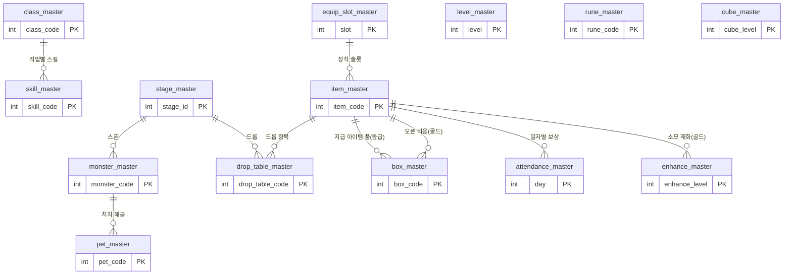

# 마스터(기획) 데이터 관리 기획서

> 상위 문서: [서버 시스템 전체 개요](../공통/서버-시스템-전체-개요.md) · 관련 도메인 4.11
>
> 본 문서는 세이브 데이터가 코드 값(`item_code`, `class_code`, 성장 `code` 등)으로 참조하는 **정적 게임 데이터(마스터 데이터)**의 구조와 각 테이블에 담기는 내용을 다룬다. 세이브(동적 진행 데이터)는 [세이브 데이터 기획서](save-data-기획서.md)를 참고한다.

## 1. 개요

- **목적**: 아이템·직업·스킬·룬·펫·몬스터·스테이지·재화 등 게임의 **정적 정의 데이터**를 한 곳에서 관리한다. 세이브 테이블은 실제 정의를 저장하지 않고 **코드(숫자 키)만 저장**하며, 그 코드의 의미(이름·수치·효과)는 전적으로 마스터 데이터가 제공한다.
- **대상 서버**: `GameServer`(마스터 데이터 로드·검증), `TaskbarHero.Common`(코드 타입 enum·버전 상수 공유).
- **핵심 구분**: **마스터 데이터 = 정적·읽기 전용·전 유저 공통 계약**, **세이브 데이터 = 동적·유저별 진행 상태**. 세이브는 마스터를 *참조*할 뿐, 마스터를 변경하지 않는다.
- **관련 기획서**: [[save-data-기획서]] (참조 주체), [[client-data-기획서]] (클라이언트가 보유·소비하는 데이터 범위·Unity 연동 코드), [[서버-시스템-전체-개요]] (도메인 4.11)

## 2. 마스터 데이터의 성격과 범위

- **읽기 전용**: 런타임에 유저 요청으로 변경되지 않는다. 오직 기획/빌드 배포로만 갱신된다.
- **서버 권위 검증의 근거**: 각 액션 저장 시 서버는 `item_code`·`class_code` 등이 **마스터에 존재하는 유효한 코드인지** 검증한다. 존재하지 않는 코드는 거부한다(치트·구버전 데이터 방지).
- **버전 계약**: 클라이언트와 서버는 같은 `master_data_version`을 참조해야 한다. 버전이 어긋나면 수치/드롭/효과 계산이 서로 달라져 정합성이 깨진다. `master_data_version`은 *마스터(기획) 데이터* 버전이며, 세이브 데이터에는 별도 스키마 버전 컬럼을 두지 않는다(초기 버전 단순화, [세이브 데이터 기획서](save-data-기획서.md)).

## 3. 세이브 → 마스터 참조 매핑

세이브 테이블의 각 코드 컬럼이 어느 마스터 테이블을 참조하는지 정리한다. **이 매핑이 마스터 데이터의 필요성을 설명한다.**

| 세이브 위치 (참조 주체) | 참조 컬럼 | 마스터 테이블 | 의미 |
|---|---|---|---|
| `player_character` | `class_code` | `class_master` | 직업 정의 |
| `player_character` | `level` | `level_master` | 레벨별 요구 경험치·스탯·스킬 포인트 |
| `game_player` | `act` / `stage` / `difficulty` | `stage_master` | 스테이지 정의 |
| `player_item`(아이템 행 `row_type=1`) | `code` | `item_master` | 아이템 정의(`item_type` 1~3) |
| `player_item`(재화 행 `row_type=2`) | `code` | `item_master` | 재화 정의(`item_type=4`, 골드=`item_code` 1) |
| `player_item` | `enhance_level` | `enhance_master` | 강화 단계별 규칙·비용 |
| `player_item` | `equipped_slot` | `equip_slot_master` | 장착 슬롯 정의 |
| `player_skill` | `skill_code` | `skill_master` | 스킬(캐릭터별) |
| `player_rune` | `rune_code` | `rune_master` | 룬(Rune Tree, 계정 공용) |
| (미정) | — | `pet_master` | 펫(저장 테이블 미작성) |
| `player_cube` | `cube_level` | `cube_master` | 큐브 레벨별 규칙·합성/제작 레시피 |
| (전투/드롭 계산) | — | `monster_master`, `drop_table_master` | 몬스터 스탯·전리품 테이블 |

## 4. 마스터 테이블 목록

전체 테이블과 관계는 아래와 같다. 이어지는 5장에서 테이블별로 담기는 데이터를 설명한다.



| 테이블 | 역할 | 대략 규모(원작 기준) |
|---|---|---|
| `class_master` | 직업(클래스) 정의 | 원작 6종 / 모작 현재 3종(추후 추가 예정) |
| `level_master` | 레벨별 요구 경험치·스탯·스킬 포인트 | 최대 레벨 수만큼 |
| `item_master` | 아이템(장비·재료·소모품) 정의 | 500종 이상 |
| `equip_slot_master` | 장비 장착 슬롯 정의 | 6~8종 |
| `enhance_master` | 강화 단계별 비용·효과 | 단계 수만큼 |
| `skill_master` | 직업별 스킬 정의 | 직업 × 스킬 |
| `rune_master` | 룬(Rune Tree) 정의 | 트리 노드 수 |
| `pet_master` | 펫 정의·해금 조건 | 몬스터 연동 |
| `monster_master` | 몬스터 스탯·드롭 | 50종 이상 |
| `stage_master` | 스테이지 구성·보상 | 3 Act × 4 난이도 × N |
| `drop_table_master` | 전리품 확률 테이블 | 드롭 그룹 수 |
| `cube_master` | 큐브 레벨별 규칙·레시피 | 레벨 수만큼 |
| `box_master` | 랜덤 상자별 등급 확률·지급 아이템 풀 | 상자 종류 수만큼 |
| `attendance_master` | 출석부 일자별(day-of-month) 보상 정의 | 최대 31 |

## 5. 테이블별 상세 (필드 + 담기는 데이터)

각 테이블의 **핵심 필드와 예시 데이터**를 소개한다. 세부 수치·밸런스는 해당 도메인 기획서(직업·아이템·성장·스테이지 등)에서 확정하며, 아래 예시 값은 구조 설명용 샘플이다.

### 5.1 `class_master` — 직업

플레이어가 캐릭터 생성 시 고르는 직업의 정의. `player_character.class_code`가 이 테이블을 참조한다(계정당 캐릭터 3인, [세이브 데이터 기획서](save-data-기획서.md) 3장).

| 필드 | 타입 | 설명 |
|---|---|---|
| `class_code` | int PK | 직업 코드 |
| `name` | varchar | 직업 이름 |
| `unlock_type` | int | 0:기본 1:해금 2:유료 |
| `base_stats` | json | 기본 스탯(HP/공격력 등) |

**담기는 데이터 예시**

| class_code | name | unlock_type | base_stats |
|---|---|---|---|
| 1 | Knight | 0 | `{ "hp": 120, "atk": 10 }` |
| 2 | Ranger | 0 | `{ "hp": 90, "atk": 14 }` |
| 3 | Mage | 0 | `{ "hp": 85, "atk": 16 }` |

> **모작은 현재 기사(Knight)·레인저(Ranger)·마법사(Mage) 3종으로 확정**하며, 3종 모두 캐릭터 생성 시 기본 선택 가능(`unlock_type=0`)하다. **추후 확인 후 클래스를 추가할 예정**이다(해금/유료 직업 포함 가능). 원작은 6개 직업이며 일부는 해금/유료다. 세부 스탯·밸런스는 직업 기획서에서 확정한다.

### 5.2 `equip_slot_master` — 장착 슬롯

장비를 장착하는 슬롯의 정의. `player_item.equipped_slot`과 `item_master.equip_slot`이 참조한다.

| 필드 | 타입 | 설명 |
|---|---|---|
| `slot` | int PK | 슬롯 코드 |
| `name` | varchar | 슬롯 이름 |

**담기는 데이터 예시**

| slot | name |
|---|---|
| 1 | 무기 |
| 2 | 투구 |
| 3 | 갑옷 |
| 4 | 장갑 |
| 5 | 신발 |
| 6 | 반지 |

### 5.3 `item_master` — 아이템

인벤토리/장비/드롭이 참조하는 아이템 정의. `player_item.item_code`가 이 테이블을 참조한다.

| 필드 | 타입 | 설명 |
|---|---|---|
| `item_code` | int PK | 아이템 코드 |
| `name` | varchar | 아이템 이름 |
| `item_type` | int | 1:장비 2:재료 3:소모품 4:재화(골드 등) |
| `grade` | int | 등급/희귀도(숫자가 클수록 고등급) |
| `equip_slot` | int | 장비일 때 장착 슬롯(FK `equip_slot_master`), 비장비는 0 |
| `class_req` | int | 착용 가능 클래스(FK `class_master`). **0이면 제한 없음(전 클래스 착용 가능)**, 비장비는 0 |
| `level_req` | int | 착용 요구 레벨. **5레벨 단위(5의 배수)**, 0이면 제한 없음. 플레이어 `level`이 이 값 이상이어야 장착 가능. 비장비는 0 |
| `stack_max` | int | 최대 겹침 수량(장비는 1) |
| `base_stats` | json | 장비 기본 옵션 |
| `sellable` | int | 거래소 판매 가능 여부(0/1) |

**담기는 데이터 예시**

| item_code | name | item_type | grade | equip_slot | class_req | level_req | stack_max | base_stats | sellable |
|---|---|---|---|---|---|---|---|---|---|
| 30012 | 강철 대검 | 1 | 3 | 1 | 1 | 15 | 1 | `{ "atk": 45 }` | 1 |
| 30105 | 코스믹 투구 | 1 | 6 | 2 | 0 | 40 | 1 | `{ "hp": 220, "def": 30 }` | 1 |
| 41001 | 강화석 | 2 | 2 | 0 | 0 | 0 | 999 | `null` | 1 |
| 1 | 골드 | 4 | 1 | 0 | 0 | 0 | 0 | `null` | 0 |

> 원작 기준 500종 이상. 등급은 Cosmic 등 고등급 존재. `class_req`는 클래스 전용 장비를 나타내며(예: 강철 대검=기사 전용), `0`은 전 클래스 공용(예: 코스믹 투구)이다. `level_req`는 **5레벨 단위**의 착용 요구 레벨(예: 15, 40)이며 `0`은 제한 없음이다. 장착 시 검증 규칙은 [인벤토리/아이템/큐브 기획서](inventory-item-cube-기획서.md) 5.1을 따른다.
> **재화(`item_type=4`)**: 골드 등 소비 재화도 `item_master`로 정의한다(별도 `currency_master` 없음, 5.5). 골드는 `item_code=1`로 고정한다. 재화는 장착·스택 개념이 없어 `equip_slot`/`class_req`/`level_req`/`stack_max`는 0이며, 보유 잔액은 세이브 `player_item` 재화 행(`row_type=2`)의 `quantity`(bigint)에 저장한다. 재화의 코드 값(골드=1)은 클라이언트와 공유하는 계약이므로 변경하지 않는다.

### 5.4 `enhance_master` — 강화 규칙

`player_item.enhance_level`(강화/각인 단계)별 요구 비용과 효과 배율. 강화 성공 시 적용될 스탯 배율을 정의한다.

| 필드 | 타입 | 설명 |
|---|---|---|
| `enhance_level` | int PK | 강화 단계 |
| `cost` | bigint | 요구 재화량 |
| `currency_type` | int | 소모 재화 `item_code`(FK `item_master` 재화, 골드=1) |
| `stat_multiplier` | json | 해당 단계에서의 스탯 배율 |

**담기는 데이터 예시**

| enhance_level | cost | currency_type | stat_multiplier |
|---|---|---|---|
| 1 | 1000 | 1 | `{ "atk": 1.05 }` |
| 2 | 3000 | 1 | `{ "atk": 1.10 }` |
| 3 | 8000 | 1 | `{ "atk": 1.18 }` |

### 5.5 재화 — `item_master`로 통합(별도 `currency_master` 없음)

골드 등 소비 재화는 별도 테이블을 두지 않고 **`item_master`에 `item_type=4`(재화)로 정의**한다(5.3). 골드는 `item_code=1`로 고정한다. 보유 잔액은 세이브 `player_item` 재화 행(`row_type=2`)의 `quantity`(bigint)에 저장한다([세이브 데이터 기획서](save-data-기획서.md) 3장).

- `enhance_master`·`box_master` 등의 `currency_type` 필드는 이제 **소모 재화의 `item_code`**를 가리킨다(골드=1).
- 재화 코드 값(골드=1)은 클라이언트와 공유하는 계약이므로 변경하지 않는다.
- 재화 보유 상한, 골드 외 추가 재화 도입 여부는 향후 재화 정책에서 확정([[save-data-기획서]] 미결 참고).

### 5.6 `skill_master` — 스킬

`player_skill.skill_code`가 참조하는 스킬 정의. 직업별로 보유하는 스킬이 다르다.

| 필드 | 타입 | 설명 |
|---|---|---|
| `skill_code` | int PK | 스킬 코드 |
| `class_code` | int FK | 소속 직업(`class_master`) |
| `name` | varchar | 스킬 이름 |
| `skill_type` | int | **1:액티브 2:패시브**. 액티브는 캐릭터당 2개까지 장착([성장 시스템 기획서](growth-기획서.md) 5.3), 패시브는 상시 적용 |
| `max_level` | int | 최대 레벨 |
| `effect_per_level` | json | 레벨별 효과 |

**담기는 데이터 예시**

| skill_code | class_code | name | skill_type | max_level | effect_per_level |
|---|---|---|---|---|---|
| 101 | 1 | 방패 강타 | 1 | 10 | `[ { "dmg": 120 }, { "dmg": 150 } ]` |
| 102 | 1 | 도발 | 1 | 5 | `[ { "aggro": 2.0 } ]` |
| 110 | 1 | 강철 피부 | 2 | 5 | `[ { "defPct": 0.05 } ]` |
| 201 | 2 | 정조준 사격 | 1 | 10 | `[ { "dmg": 180 } ]` |

> `skill_type=2`(패시브, 예: 강철 피부)는 장착 슬롯을 차지하지 않고 배운 즉시 상시 적용된다. `skill_type=1`(액티브)만 캐릭터당 2개 장착 제한을 받는다.

### 5.7 `rune_master` — 룬(Rune Tree)

`player_rune.rune_code`가 참조. 골드로 구매하는 장기 성장 축이며, 선행 룬을 요구하는 **트리 구조**를 가진다. 업그레이드는 **1회 1레벨**씩 진행하고, **골드 비용은 현재 룬 레벨에 비례해 증가**한다([성장 시스템 기획서](growth-기획서.md) 5.4).

| 필드 | 타입 | 설명 |
|---|---|---|
| `rune_code` | int PK | 룬 코드 |
| `name` | varchar | 룬 이름 |
| `prereq_code` | int | 선행 룬 코드(루트면 0) |
| `cost` | bigint | 레벨업 1회 골드 비용의 기준값. **실제 비용 = 현재 레벨에 비례한 증가값**(레벨별 비용을 이 값으로부터 산출) |
| `max_level` | int | 최대 레벨 |
| `effect` | json | 효과 |

**담기는 데이터 예시**

| rune_code | name | prereq_code | cost | max_level | effect |
|---|---|---|---|---|---|
| 205 | 공격력 I | 0 | 5000 | 20 | `{ "atk_pct": 0.02 }` |
| 206 | 공격력 II | 205 | 20000 | 20 | `{ "atk_pct": 0.03 }` |
| 210 | 치명타 | 205 | 15000 | 10 | `{ "crit_pct": 0.01 }` |

### 5.8 `pet_master` — 펫

펫 정의. 특정 몬스터 처치로 해금되며 패시브 보너스를 준다. **펫 시스템의 저장 테이블은 아직 없으며(성장 기획서 범위 밖), 도입 시 참조 컬럼을 확정한다.**

| 필드 | 타입 | 설명 |
|---|---|---|
| `pet_code` | int PK | 펫 코드 |
| `name` | varchar | 펫 이름 |
| `unlock_monster_code` | int FK | 해금 조건 몬스터(`monster_master`) |
| `passive_bonus` | json | 패시브 효과 |

**담기는 데이터 예시**

| pet_code | name | unlock_monster_code | passive_bonus |
|---|---|---|---|
| 301 | 슬라임 | 9001 | `{ "gold_pct": 0.05 }` |
| 302 | 늑대 | 9010 | `{ "atk_pct": 0.03 }` |

### 5.9 `monster_master` — 몬스터

전투/드롭 계산의 근거. 스테이지에 스폰되며 처치 시 드롭 테이블을 사용한다.

| 필드 | 타입 | 설명 |
|---|---|---|
| `monster_code` | int PK | 몬스터 코드 |
| `name` | varchar | 몬스터 이름 |
| `hp` | bigint | 체력 |
| `attack` | bigint | 공격력 |
| `drop_table_code` | int FK | 드롭 테이블(`drop_table_master`) |

**담기는 데이터 예시**

| monster_code | name | hp | attack | drop_table_code |
|---|---|---|---|---|
| 9001 | 슬라임 | 500 | 20 | 7001 |
| 9010 | 늑대 | 1200 | 55 | 7002 |
| 9099 | Act1 보스 | 25000 | 180 | 7050 |

> 원작 기준 몬스터 50종 이상.

### 5.10 `stage_master` — 스테이지

`game_player`의 `act`/`stage`/`difficulty`가 참조. 3 Act × 4 난이도 구성이며 스테이지별 기본 보상과 드롭 테이블을 정의한다.

| 필드 | 타입 | 설명 |
|---|---|---|
| `stage_id` | int PK | `(act, difficulty, stage)`를 인코딩한 키 |
| `act` | int | Act 번호(1~3) |
| `difficulty` | int | 난이도 티어(1~4) |
| `stage` | int | 스테이지 번호 |
| `reward_gold` | bigint | 기본 골드 보상 |
| `reward_exp` | bigint | 기본 경험치 보상 |
| `drop_table_code` | int FK | 드롭 테이블(`drop_table_master`) |
| `spawns` | json | 등장 **일반 몬스터 스폰 목록** `[{ monster_code, count }]`(`monster_master` 참조) |
| `boss_monster_code` | int | **스테이지 보스 몬스터**(`monster_master`). 보스가 없으면 0 |

**담기는 데이터 예시**

| stage_id | act | difficulty | stage | reward_gold | reward_exp | drop_table_code |
|---|---|---|---|---|---|---|
| 1010001 | 1 | 1 | 1 | 100 | 50 | 7001 |
| 1010002 | 1 | 1 | 2 | 120 | 60 | 7001 |
| 1020001 | 1 | 2 | 1 | 300 | 150 | 7002 |

> 스폰 예시: `spawns` = `[{ "monsterCode": 9001, "count": 8 }, { "monsterCode": 9010, "count": 3 }]`, `boss_monster_code` = `9099`(보스 스테이지, 없으면 0). 스테이지 진입 응답이 이 스폰·보스 정보를 그대로 내려준다([스테이지/전투 결과 기획서](stage-battle-기획서.md) 5.1).
>
> 벽에 막히면 이전 스테이지를 재파밍할 수 있다(하드월 없음, 개요 3장).

### 5.11 `drop_table_master` — 드롭 테이블

몬스터/스테이지가 참조하는 전리품 확률 테이블. `(drop_table_code, entry_no)` 복합 PK로 한 테이블에 여러 항목을 담는다.

| 필드 | 타입 | 설명 |
|---|---|---|
| `drop_table_code` | int PK | 드롭 테이블 코드 |
| `entry_no` | int PK | 테이블 내 항목 번호 |
| `reward_type` | int | 1:골드 2:아이템 3:재료 |
| `reward_code` | int | 아이템/재료 코드(골드면 0) |
| `weight` | int | 드롭 가중치(확률은 테이블 내 가중치 합 대비 비율) |

**담기는 데이터 예시**

| drop_table_code | entry_no | reward_type | reward_code | weight |
|---|---|---|---|---|
| 7001 | 1 | 1 | 0 | 70 |
| 7001 | 2 | 3 | 41001 | 25 |
| 7001 | 3 | 2 | 30012 | 5 |

### 5.12 `cube_master` — 큐브(Hero-dric Cube)

`player_cube.cube_level`이 참조. 큐브 레벨별 요구 경험치와 합성/분해/제작 규칙을 정의한다.

| 필드 | 타입 | 설명 |
|---|---|---|
| `cube_level` | int PK | 큐브 레벨 |
| `required_exp` | bigint | 다음 레벨 요구 경험치 |
| `synthesis_rule` | json | 합성/분해/제작 규칙 |

**담기는 데이터 예시**

| cube_level | required_exp | synthesis_rule |
|---|---|---|
| 1 | 1000 | `{ "combine_grade_up": true, "gold_per_scrap": 100 }` |
| 2 | 3000 | `{ "combine_grade_up": true, "gold_per_scrap": 150 }` |

> 큐브 합성/제작 상세 규칙은 인벤토리/큐브 기획서에서 확정.

### 5.13 `level_master` — 캐릭터 레벨

`player_character.level`이 참조. 캐릭터 레벨별 요구 경험치·스탯 보너스·사용 가능 스킬 포인트를 정의한다(경험치→레벨 산정은 [성장 시스템 기획서](growth-기획서.md) 6.3).

| 필드 | 타입 | 설명 |
|---|---|---|
| `level` | int PK | 캐릭터 레벨 |
| `required_exp` | bigint | 이 레벨에서 다음 레벨로 가기 위한 요구 경험치 |
| `skill_points` | int | 이 레벨에서 사용 가능한 **누적 스킬 포인트 총량**(스킬 포인트 파생 근거) |
| `stat_bonus` | json | 레벨 도달 시 적용되는 기본 스탯 보너스 |

**담기는 데이터 예시**

| level | required_exp | skill_points | stat_bonus |
|---|---|---|---|
| 1 | 100 | 1 | `{ "hp": 10, "atk": 2 }` |
| 2 | 250 | 2 | `{ "hp": 20, "atk": 4 }` |
| 3 | 500 | 3 | `{ "hp": 30, "atk": 6 }` |

> `skill_points`는 해당 레벨에서 쓸 수 있는 총 포인트다. **실제 사용 가능 포인트 = `skill_points` − 그 캐릭터가 이미 투자한 스킬 레벨 합**(스킬 1레벨당 1포인트). 스킬 포인트 잔량은 저장하지 않고 이 값으로 파생한다([성장 시스템 기획서](growth-기획서.md) 4장). 예시 값은 구조 설명용이며 실제 곡선은 밸런스에서 확정.

### 5.14 `box_master` — 랜덤 상자

랜덤 상자 열기([인벤토리/아이템/큐브 기획서](inventory-item-cube-기획서.md) 5.10)가 참조하는 상자 정의. 플레이어가 **골드를 소모**해 여는 가챠이며, 서버는 오픈 요청 시 `open_cost`(골드)를 차감한 뒤 `grade_weights`로 등급을 추첨하고 그 등급에 속한 `item_master` 아이템 중 하나를 무작위로 선택해 지급한다. 상자는 인벤토리에 적재되는 아이템이 아니므로 `item_master`에는 존재하지 않는다.

| 필드 | 타입 | 설명 |
|---|---|---|
| `box_code` | int PK | 상자 코드 |
| `name` | varchar | 상자 이름 |
| `open_cost` | bigint | 1회 오픈 비용 |
| `currency_type` | int | 오픈 비용 재화 `item_code`(FK `item_master` 재화, 기본 1:골드) |
| `grade_weights` | json | 등급별 추첨 가중치(확률은 가중치 합 대비 비율) |
| `item_pool` | json | (선택) 등급별 지급 아이템 화이트리스트. 생략 시 해당 등급의 전체 `item_master` 아이템에서 선택 |

**담기는 데이터 예시**

| box_code | name | open_cost | currency_type | grade_weights | item_pool |
|---|---|---|---|---|---|
| 60001 | 일반 상자 | 10000 | 1 | `{ "3": 70, "4": 25, "5": 5 }` | `null` |
| 60002 | 고급 상자 | 50000 | 1 | `{ "4": 60, "5": 30, "6": 10 }` | `null` |

> 오픈 비용·다연속 오픈 정책, 등급 추첨 후 아이템 선택이 균등인지 가중치인지, 지급 아이템 풀을 전체 `item_master.grade` 필터로 할지 상자별 화이트리스트로 할지, 수량 규칙 등 세부는 [인벤토리/아이템/큐브 기획서](inventory-item-cube-기획서.md) 8장 미결과 함께 확정한다. 예시 값은 구조 설명용 샘플이다.

### 5.15 `attendance_master` — 출석부 일자별 보상

출석부([출석부 보상 시스템 기획서](attendance-기획서.md))가 참조하는 **이달 일자별(day-of-month) 보상 정의**. 서버는 출석 획득 시 오늘의 `day`(1~31)로 이 테이블을 조회해 보상을 확정하고 메일로 발급한다. `reward_type`/`reward_code` 규약은 메일 첨부(`player_mail_reward`)와 동일하다.

| 필드 | 타입 | 설명 |
|---|---|---|
| `day` | int PK | 이달 며칠차(1~31) |
| `reward_type` | int | 1:골드 2:아이템 3:재료 |
| `reward_code` | int | 아이템/재료 코드(골드면 0) |
| `quantity` | int | 지급 수량 |

**담기는 데이터 예시**

| day | reward_type | reward_code | quantity |
|---|---|---|---|
| 1 | 1 | 0 | 1000 |
| 7 | 2 | 41001 | 5 |
| 15 | 2 | 41001 | 5 |

> 일자별 보상 값·마일스톤(7·14·21·28일 등) 강화 여부는 [출석부 보상 시스템 기획서](attendance-기획서.md) 8장 미결과 함께 밸런스에서 확정한다. 예시 값은 구조 설명용 샘플이다.

### 공통 규칙

- **키 규칙**: `stage_master`는 `(act, difficulty, stage)` 조합을 유일 키로 갖거나 이를 인코딩한 `stage_id`를 PK로 쓴다. `drop_table_master`는 `(drop_table_code, entry_no)` 복합 PK.
- **enum 공유**: `item_type`(1:장비 2:재료 3:소모품 4:재화)·`unlock_type`·`reward_type` 등 클라이언트와 공유하는 분류 코드는 `TaskbarHero.Common`에 enum으로 정의해 계약을 고정한다(값 변경 금지 대상). 재화는 별도 `currency_type` enum 없이 `item_master`(item_type=4)의 `item_code`로 식별한다(골드=1).
- **JSON 필드**: `base_stats`·`effect` 등 가변 구조는 JSON으로 담되, 키 스키마는 각 도메인 기획서에서 확정한다.

## 6. 원천 데이터 형식과 저장 방식

- **원천(source of truth)**: 기획 데이터는 사람이 편집 가능한 형식(예: CSV/JSON, 또는 스프레드시트 export)으로 저장소에서 버전 관리한다. 원천 형식은 9장에서 확정.
- **서버 적재**: 서버 기동 시 원천을 읽어 **인메모리 캐시**(코드→정의 딕셔너리)로 적재한다. 필요 시 읽기 전용 MySQL 테이블로도 적재할 수 있으나, 조회는 메모리 캐시를 우선한다.
- **클라이언트 배포/캐싱(확정)**: 클라이언트는 내려받은 마스터 데이터를 **로컬에 캐싱**하고, 접속 시 자신이 가진 데이터 버전과 서버의 `master_data_version`을 비교한다. **버전이 다를 때만** 최신 마스터 데이터를 갱신(재다운로드)하고, 같으면 캐시를 그대로 사용한다. 매 접속마다 전체 데이터를 내려받지 않아 트래픽·로딩을 최소화한다.
- **다운로드 방식(확정)**: 버전 조회와 마스터 데이터 다운로드는 **GameServer의 API로 제공**한다. (엔드포인트·요청/응답·에러 코드는 8장 API 명세 참고)

## 7. 처리 흐름

- **서버 기동 시**: 원천 데이터 로드 → 무결성 검증(중복 PK, FK 참조 무결성, 필수 필드 누락) → 인메모리 캐시 구성 → `master_data_version` 확정. 검증 실패 시 기동 중단(운영 사고 예방).
- **클라이언트 접속 시(버전 비교)**: 클라이언트가 보유한 캐시 버전과 서버 `master_data_version`을 비교 → **다르면** 최신 마스터 데이터를 갱신 후 로컬 캐시 교체, **같으면** 캐시 재사용. (6장 클라이언트 배포/캐싱)
- **각 액션 저장 검증 시**([[save-data-기획서]] 4장): 액션 요청의 `item_code`(재화 포함)·`class_code`·성장 `code` 등을 마스터 캐시에서 조회해 **존재 여부·제약(예: 최대 강화 단계, 슬롯-아이템 타입 정합성)**을 확인한 뒤 반영. 미존재 코드는 거부.
- **드롭/보상 계산 시**: 스테이지·몬스터·드롭 테이블 마스터를 참조해 서버가 전리품을 산출(서버 권위).

**엣지 케이스**
- 클라이언트-서버 버전 불일치(확정): 수치/드롭 계산이 어긋날 수 있으므로, 서버가 요청에서 버전 불일치를 감지하면 **즉시 로그아웃 처리**한다(세션 종료·토큰 무효화). 클라이언트는 재접속 과정에서 최신 마스터 데이터를 갱신(6·7장)한 뒤 다시 로그인한다.

## 8. 마스터 다운로드 API 명세

Base URL(개발): `http://localhost:5247` (GameServer). 모든 API는 **POST**, 응답은 `{ success, errorCode, message, data }` 형식이다. `errorCode`는 `TaskbarHero.Common`의 `GameErrorCode`(8.3) 값이며, `success`는 `errorCode == 0`과 동치다.

마스터 데이터는 전 유저 공통의 정적 데이터이고 로그인 이전(최초 패치 단계)에도 받아야 할 수 있으므로, 본 API는 **인증(토큰)을 요구하지 않는다**. (게임 진행 요청 중 버전 불일치가 감지되는 경우의 즉시 로그아웃은 7장 엣지 케이스 참고)

### 8.1 마스터 데이터 다운로드 — `POST /api/master/download`

클라이언트가 보유한 캐시 버전을 함께 보내면, 서버 버전과 **다를 때만** 최신 데이터를 반환한다(같으면 데이터 없이 최신 상태임을 알린다). `tables`로 특정 테이블만 요청할 수 있고, 미지정 시 전체를 반환한다.

**Request**
```json
{
  "data": {
    "clientVersion": 12,
    "tables": ["item_master", "class_master"]
  }
}
```

| 필드 | 타입 | 설명 |
|---|---|---|
| `clientVersion` | int | 클라이언트가 보유한 캐시의 `master_data_version`. 최초/캐시 없음이면 0 |
| `tables` | string[] | (선택) 받을 테이블명 목록. 생략 시 전체 |

**Response (갱신 필요 — 버전 상이, 200 OK)**
```json
{
  "success": true,
  "errorCode": 0,
  "message": "OK",
  "data": {
    "version": 13,
    "upToDate": false,
    "tables": {
      "class_master": [ { "classCode": 1, "name": "Knight", "unlockType": 0, "baseStats": { "hp": 120, "atk": 10 } } ],
      "item_master": [ { "itemCode": 30012, "name": "강철 대검", "itemType": 1, "grade": 3, "equipSlot": 1, "classReq": 1, "levelReq": 15, "stackMax": 1, "baseStats": { "atk": 45 }, "sellable": 1 } ]
    }
  }
}
```

**Response (이미 최신 — 버전 동일, 200 OK)**
```json
{
  "success": true,
  "errorCode": 0,
  "message": "Already up to date",
  "data": { "version": 13, "upToDate": true }
}
```

- `upToDate == true`면 `tables`를 내려보내지 않아 트래픽을 아낀다(6장 캐싱 정책).

### 8.2 실패 응답

**서버에 마스터 데이터 미로드 (503 Service Unavailable)**
```json
{
  "success": false,
  "errorCode": 11001,
  "message": "Master data not loaded",
  "data": null
}
```

**잘못된 요청 — 존재하지 않는 테이블명 등 (400 Bad Request)**
```json
{
  "success": false,
  "errorCode": 11005,
  "message": "Invalid master request",
  "data": null
}
```

### 8.3 에러 코드 (신규 제안)

`TaskbarHero.Common/ErrorCode.cs`의 `GameErrorCode`에 추가 제안. 기존 값(계정 1000번대, 세이브 2000번대)과 겹치지 않도록 **마스터 데이터 도메인은 11000번대**를 사용한다.

| 이름 | 값 | 의미 | 사용처 |
|---|---|---|---|
| Success | 0 | 성공 (기존) | 다운로드 성공/최신 상태 |
| MasterDataNotLoaded | 11001 | 서버에 마스터 데이터가 로드되지 않음 | 8.2 |
| MasterDataVersionMismatch | 11002 | 게임 진행 요청 중 클라이언트-서버 버전 불일치 감지 | 7장 엣지 케이스(즉시 로그아웃) |
| InvalidMasterRequest | 11005 | 잘못된 요청(존재하지 않는 테이블명·형식 오류) | 8.2 |

## 9. 미결 사항 / TODO

- **원천 데이터 형식**: CSV / JSON / 스프레드시트 export 중 확정. 편집 편의 vs 파싱 편의.
- **각 마스터 테이블 세부 필드·수치·밸런스**: 직업·아이템·성장·스테이지 등 도메인 기획서에서 확정(본 문서는 골격과 예시 위주).
- **큐브 합성/제작 레시피(`cube_master`) 상세**: 인벤토리/큐브 기획서와 연계.

## 10. 참고

- [서버 시스템 전체 개요](../공통/서버-시스템-전체-개요.md) — 도메인 4.11(정적 게임 데이터 제공)
- [세이브 데이터 기획서](save-data-기획서.md) — 마스터 데이터를 코드로 참조하는 주체(3장 ERD, 4장 서버 검증)
