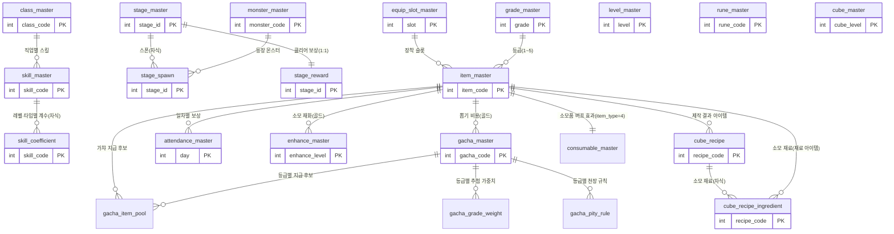

# 마스터(기획) 데이터 & 클라이언트 연동 기획서

> 상위 문서: [서버 시스템 전체 개요](../../서버-시스템-전체-개요.md) · 관련 도메인 4.10
>
> 본 문서는 (1) 세이브 데이터가 코드 값(`item_code`, `class_code`, 성장 `code` 등)으로 참조하는 **정적 게임 데이터(마스터 데이터)** 의 구조·내용과, (2) 이를 **Unity 클라이언트가 보유·소비하는 방식**(범위·스키마·연동 코드)을 함께 다룬다. 마스터 데이터는 **클라이언트 빌드에 번들**되고 서버도 같은 원천을 기동 시 자체 로드한다(런타임 다운로드·버전 협상 없음). 세이브(동적 진행 데이터)는 [세이브 데이터 기획서](../save-data-기획서.md)를 참고한다.

## 목차

- [1. 개요](#1-개요)
- [2. 마스터 데이터의 성격과 범위](#2-마스터-데이터의-성격과-범위)
- [3. 세이브 → 마스터 참조 매핑](#3-세이브--마스터-참조-매핑)
- [4. 마스터 테이블 목록](#4-마스터-테이블-목록)
- [5. 테이블별 상세 (필드 + 담기는 데이터)](#5-테이블별-상세-필드--담기는-데이터)
- [6. 클라이언트가 보유하는 데이터 범위](#6-클라이언트가-보유하는-데이터-범위)
- [7. 클라이언트(Unity) 연동](#7-클라이언트unity-연동)
- [8. 원천 데이터·배포·처리 흐름 & 에러 코드](#8-원천-데이터배포처리-흐름--에러-코드)
- [9. 미결 사항 / TODO](#9-미결-사항--todo)
- [10. 참고](#10-참고)


## 1. 개요

- **목적**: 아이템·직업·스킬·룬·몬스터·스테이지·재화 등 게임의 **정적 정의 데이터**를 한 곳에서 관리한다. 세이브 테이블은 실제 정의를 저장하지 않고 **코드(숫자 키)만 저장**하며, 그 코드의 의미(이름·수치·효과)는 전적으로 마스터 데이터가 제공한다. 또한 방치형 특성상 클라이언트는 **자동 전투 연출·전투력 계산·UI 표시**를 로컬에서 수행하므로, 이 데이터를 빌드에 번들로 보유한다.
- **대상**: `GameServer`(마스터 데이터 로드·검증), **Unity 클라이언트**(번들 데이터 로딩·전투 시뮬레이션·UI), `TaskbarHero.Common`(서버-클라 공유 데이터 클래스·enum, `netstandard2.0`).
- **핵심 구분**: **마스터 데이터 = 정적·읽기 전용·전 유저 공통 계약**, **세이브 데이터 = 동적·유저별 진행 상태**. 세이브는 마스터를 *참조*할 뿐, 마스터를 변경하지 않는다.
- **서버 권위 원칙(중요)**: 클라이언트가 이 데이터로 하는 계산은 **연출·예측용**이다. 오프라인 보상·스테이지 클리어 보상·성장 결과 등 **이득이 되는 값의 최종 확정은 서버가 동일 마스터 데이터로 재계산**한다([서버 시스템 전체 개요](../../서버-시스템-전체-개요.md) 5장, [스테이지/전투 결과 기획서](../stage-battle-기획서.md)). 클라이언트 번들과 서버 로드는 **같은 원천**을 쓴다.
- **관련 기획서**: [[master-data-값]] (본 기획서가 정의한 테이블들의 **실제 데이터 값** 카탈로그), [[save-data-기획서]] (참조 주체·동적 세이브), [[inventory-item-cube-기획서]] (아이템·강화·큐브), [[growth-기획서]] (스킬·룬), [[stage-battle-기획서]] (전투 결과 검증), [[trade-기획서]] (거래소 기준가), [[서버-시스템-전체-개요]] (도메인 4.10)

## 2. 마스터 데이터의 성격과 범위

- **읽기 전용**: 런타임에 유저 요청으로 변경되지 않는다. 오직 기획/빌드 배포로만 갱신된다.
- **서버 권위 검증의 근거**: 각 액션 저장 시 서버는 `item_code`·`class_code` 등이 **마스터에 존재하는 유효한 코드인지** 검증한다. 존재하지 않는 코드는 거부한다(치트·구버전 데이터 방지).
- **동일 원천 사용**: 클라이언트와 서버는 **같은 마스터 데이터 원천**을 사용한다. 본 프로젝트(학습 목적)는 마스터 데이터를 **클라이언트 빌드에 번들로 포함**하고 서버도 같은 원천을 기동 시 자체 로드한다 — **런타임 다운로드·버전 협상 API는 두지 않는다**(8장). 세이브 데이터에도 별도 스키마 버전 컬럼을 두지 않는다(초기 버전 단순화, [세이브 데이터 기획서](../save-data-기획서.md)).

## 3. 세이브 → 마스터 참조 매핑

세이브 테이블의 각 코드 컬럼이 어느 마스터 테이블을 참조하는지 정리한다. **이 매핑이 마스터 데이터의 필요성을 설명한다.**

| 세이브 위치 (참조 주체) | 참조 컬럼 | 마스터 테이블 | 의미 |
|---|---|---|---|
| `player_character` | `class_code` | `class_master` | 직업 정의 |
| `player_character` | `level` | `level_master` | 레벨별 요구 경험치·스탯·스킬 포인트 |
| `game_player` | `act` / `stage` / `difficulty` | `stage_master` | 스테이지 구성(스폰·보스) |
| `game_player`(클리어 보상 계산) | `stage_id` | `stage_reward` | 스테이지 클리어 골드·경험치·등급별 아이템 확률 |
| `player_item`(아이템 행 `row_type=1`) | `item_code` | `item_master` | 아이템 정의(`item_type` 1~2: 장비·재료) |
| `player_item`(재화 행 `row_type=2`) | `item_code` | `item_master` | 재화 정의(`item_type=3`, 골드=`item_code` 1) |
| `player_buff` | `buff_type`·`buff_value` | `consumable_master` | 소모품이 부여하는 획득량 버프 정의(`item_type=4` 소모품과 1:1) |
| `player_item` | `enhance_level` | `enhance_master` | 강화 단계별 규칙·비용 |
| `player_item_equipped` | `item_code` | `item_master` | 장착 아이템 정의(어떤 아이템인지) |
| `player_item_equipped` | `enhance_level` | `enhance_master` | 장착 장비 강화 단계 |
| `player_item_equipped` | `equipped_slot` | `equip_slot_master` | 장착 슬롯 정의 |
| `player_skill` | `skill_code` | `skill_master` | 스킬(캐릭터별) |
| `player_rune` | `rune_code` | `rune_master` | 룬(Rune Tree, 계정 공용) |
| `player_cube` | `cube_level` | `cube_master` | 큐브 레벨별 규칙·합성/제작 레시피 |
| (전투 계산) | — | `monster_master` | 몬스터 전투 스탯(보상은 `stage_reward`) |

## 4. 마스터 테이블 목록

전체 테이블과 관계는 아래와 같다. 이어지는 5장에서 테이블별로 담기는 데이터를 설명한다.



| 테이블 | 역할 | 대략 규모(원작 기준) |
|---|---|---|
| `class_master` | 직업(클래스) 정의 | 원작 6종 / 모작 현재 4종(추후 추가 예정) |
| `level_master` | 레벨별 요구 경험치·스탯·스킬 포인트 | 최대 레벨 수만큼 |
| `item_master` | 아이템(장비·재료·소모품)·재화 정의 | 500종 이상 |
| `consumable_master` | 소모품이 부여하는 획득량 버프 효과 정의 | 2종 |
| `equip_slot_master` | 장비 장착 슬롯 정의 | 6~8종 |
| `grade_master` | 아이템/장비 등급(희귀도) 정의 | 5종(노말·고급·희귀·영웅·전설) |
| `enhance_master` | 강화 단계별 비용·효과 | 단계 수만큼 |
| `skill_master` | 직업별 스킬 정의(이름·코드·액티브/패시브·최대 레벨) | 직업 × 스킬 |
| `skill_coefficient` | 스킬별 레벨·타입별 계수·지속시간(`skill_master` 자식, 1:N) | 스킬 × 타입 × 레벨(= 타입 수 × `max_level`) |
| `rune_master` | 룬(Rune Tree) 정의 | 트리 노드 수 |
| `monster_master` | 몬스터 전투 스탯 | 50종 이상 |
| `stage_master` | 스테이지 구성(보스) | 5 Act × 2 난이도 × 3 = 30 |
| `stage_spawn` | 스테이지별 등장 일반 몬스터(스폰, `stage_master` 자식) | 스테이지 × 몬스터 |
| `stage_reward` | 스테이지 클리어 보상(골드·경험치·등급별 아이템 확률) | 스테이지 수만큼 |
| `cube_master` | 큐브 레벨별 규칙·레시피 | 레벨 수만큼 |
| `gacha_master` | 가챠 배너별 노출 조건·1연/10연 비용·등급 확률·지급 아이템 풀·천장 규칙 | 배너 종류 수만큼 |
| `attendance_master` | 출석부 일차별(누적 출석 순번) 보상 정의 | 30 |

## 5. 테이블별 상세 (필드 + 담기는 데이터)

각 테이블의 **핵심 필드와 예시 데이터**를 소개한다. 세부 수치·밸런스는 해당 도메인 기획서(직업·아이템·성장·스테이지 등)에서 확정하며, 아래 예시 값은 구조 설명용 샘플이다.

### 5.1 `class_master` — 직업

플레이어가 캐릭터 생성 시 고르는 직업의 정의. `player_character.class_code`가 이 테이블을 참조한다(계정당 캐릭터 3인, [세이브 데이터 기획서](../save-data-기획서.md) 3장).

| 필드 | 타입 | 설명 |
|---|---|---|
| `class_code` | int PK | 직업 코드 |
| `name` | varchar | 직업 이름 |
| `description` | varchar | 직업 설명(클라이언트 표시용 한 줄 문구) |
| `unlock_type` | int | 0:기본 1:해금 2:유료 |
| `hp` / `atk` / `def` | bigint | 기본 체력 / 공격 / 방어 |
| `move_speed` | decimal | 이동속도 |
| `crit_chance` | decimal | 치명확률(0~1) |
| `crit_damage` | decimal | 치명데미지 배율(1.5=150%) |
| `cooldown` | decimal | 재사용 대기시간(초) |

> **스탯 컬럼화(변경)**: 구 `base_stats`(JSON)는 폐기하고 스탯을 **개별 컬럼**으로 분리했다. `level_master`의 보너스도 동일하게 `bonus_hp`/`bonus_atk`/`bonus_def` 컬럼이다(5.12).

**담기는 데이터 예시**

| class_code | name | unlock_type | hp | atk | def | move_speed | crit_chance | crit_damage | cooldown |
|---|---|---|---|---|---|---|---|---|---|
| 1 | Knight | 0 | 120 | 10 | 8 | 3.0 | 0.05 | 1.5 | 1.2 |
| 2 | Ranger | 0 | 90 | 14 | 5 | 4.0 | 0.10 | 1.5 | 0.9 |
| 3 | Mage | 0 | 85 | 16 | 4 | 3.2 | 0.08 | 1.7 | 1.5 |
| 4 | Slayer | 0 | 130 | 15 | 9 | 3.4 | 0.12 | 1.6 | 1.1 |

- **캐릭터 스탯 구성(확정)**: 캐릭터 스탯은 `hp`(체력)·`atk`(공격)·`def`(방어)·`moveSpeed`(이동속도)·`critChance`(치명확률, 0~1)·`critDamage`(치명데미지 배율, `1.5`=150%)·`cooldown`(재사용 대기시간, 초)으로 구성한다. `class_master`(기본값, 개별 컬럼)·`level_master`(레벨 보너스, `bonus_*` 컬럼)·`item_master.base_stats`(장비 옵션)가 모두 이 스탯 집합을 공유하며, 없는 값은 0이다.
- **DB↔번들 표현**: DB/카탈로그는 위처럼 **스탯을 개별 컬럼**으로 저장하고, 클라이언트 번들 JSON은 이를 `baseStats`/`statBonus` **객체로 묶어 직렬화**한다(POCO는 공용 `Stats` 구조, 7장). 즉 저장은 평탄, 전송은 중첩 객체다.
- **모작은 현재 기사(Knight)·레인저(Ranger)·마법사(Mage)·슬레이어(Slayer) 4종으로 확정**하며, 4종 모두 캐릭터 생성 시 기본 선택 가능(`unlock_type=0`)하다. 캐릭터 슬롯은 3개이고 **직업 중복이 불가**하므로 4종 중 3종을 골라 파티를 구성한다. **추후 확인 후 클래스를 더 추가할 예정**이다(해금/유료 직업 포함 가능). 세부 스탯·밸런스는 직업 기획서에서 확정한다.
- **슬레이어(4)**: 도끼를 쓰는 **근접 딜러**. 같은 근접인 기사보다 체력·방어가 낮고(hp 130 vs 180, def 9 vs 16) 공격력·치명확률·평타 속도가 높은 **공격 특화** 직업이다. 전용 무기는 도끼(`31·4·등급·순번`), 보조무기는 방패가 아닌 **사슬 갈고리**(`32·4·등급·순번`)라 방어 옵션을 얻지 못한다. 값 정본은 [마스터 데이터 값](master-data-값.md) §2·§4·§6.

### 5.2 `equip_slot_master` — 장착 슬롯

장비를 장착하는 슬롯의 정의. `player_item_equipped.equipped_slot`과 `item_master.equip_slot`이 참조한다.

| 필드 | 타입 | 설명 |
|---|---|---|
| `slot` | int PK | 슬롯 코드 |
| `name` | varchar | 슬롯 이름 |

**담기는 데이터 예시**

| slot | name |
|---|---|
| 1 | 무기 |
| 2 | 보조무기 |
| 3 | 투구 |
| 4 | 갑옷 |
| 5 | 장갑 |
| 6 | 신발 |

### 5.2b `grade_master` — 등급(희귀도)

아이템·장비의 **등급(희귀도)** 정의. `item_master.grade`가 FK로 참조하며, `stage_reward`/`gacha_master`의 등급별 확률도 이 등급 체계를 따른다. **5등급 확정**(구 6등급 체계를 통일).

| 필드 | 타입 | 설명 |
|---|---|---|
| `grade` | tinyint PK | 등급(1~5) |
| `name` | varchar | 등급 이름 |

**담기는 데이터 예시**

| grade | name |
|---|---|
| 1 | 노말 |
| 2 | 고급 |
| 3 | 희귀 |
| 4 | 영웅 |
| 5 | 전설 |

> 등급은 장비 코드(`3·슬롯·클래스·등급·순번`)·`level_req`·`base_price`·드롭 확률의 기준축이다. 값 정본은 [마스터 데이터 값](master-data-값.md) §14.

### 5.3 `item_master` — 아이템·재화

인벤토리/장비/드롭이 참조하는 아이템 정의이자, **재화(골드)의 정의**도 겸한다. `player_item.item_code`·`player_item_equipped.item_code`가 이 테이블을 참조한다(아이템·재화 통합).

| 필드 | 타입 | 설명 |
|---|---|---|
| `item_code` | int PK | 아이템 코드. **장비는 5자리 인코딩** `3·슬롯·클래스·등급·순번`(= 30000 + 슬롯×1000 + 클래스×100 + 등급×10 + 순번), 재료 `41xxx`, 소모품 `42xxx`, 골드 `1` |
| `name` | varchar | 아이템 이름 |
| `item_type` | int | 1:장비 2:재료 3:재화(골드) 4:소모품 |
| `grade` | tinyint | 등급/희귀도(**1~5**, FK `grade_master`. 클수록 고등급) |
| `equip_slot` | int | 장비일 때 장착 슬롯(FK `equip_slot_master`), 비장비는 0 |
| `class_req` | int | 착용 가능 클래스(FK `class_master`). **0이면 제한 없음**, 비장비는 0 |
| `level_req` | int | 착용 요구 레벨. **5레벨 단위(5의 배수)**, 0이면 제한 없음. 비장비는 0 |
| `stack_max` | int | 최대 겹침 수량(장비는 1) |
| `hp` / `atk` / `def` | bigint | 장비 옵션 체력 / 공격 / 방어(비장비 0) |
| `move_speed` | decimal | 장비 옵션 이동속도 |
| `crit_chance` | decimal | 장비 옵션 치명확률(0~1) |
| `crit_damage` | decimal | 장비 옵션 치명데미지 배율 |
| `cooldown` | decimal | 장비 옵션 재사용 대기시간(초, 음수=감소) |
| `sellable` | int | 거래소 판매 가능 여부(0/1) |
| `base_price` | bigint | 거래소 **기준가**(골드). 등록 가격은 이 값의 ±20% 범위([거래소 기획서](../trade-기획서.md)). `0`이면 거래 대상 아님 |

> **스탯 컬럼화(변경)**: 구 `base_stats`(JSON)는 폐기하고 장비 옵션 스탯을 `class_master`와 동일한 개별 컬럼(`hp`~`cooldown`)으로 분리했다. 장비만 값을 갖고 그 외는 0이다. 클라 번들 JSON은 이 컬럼들을 `baseStats` 객체로 묶어 직렬화한다(5.1 DB↔번들 노트, 7장).

**담기는 데이터 예시** (전체 93종·스탯 값은 [마스터 데이터 값](master-data-값.md) §6 정본)

| item_code | name | item_type | grade | equip_slot | class_req | level_req | stack_max | hp | atk | def | cooldown | sellable | base_price |
|---|---|---|---|---|---|---|---|---|---|---|---|---|---|
| 1 | 골드 | 3 | 1 | 0 | 0 | 0 | 0 | 0 | 0 | 0 | 0 | 0 | 0 |
| 31131 | 강철 대검 | 1 | 3 | 1 | 1 | 20 | 1 | 0 | 38 | 0 | -0.1 | 1 | 50000 |
| 33051 | 코스믹 투구 | 1 | 5 | 3 | 0 | 40 | 1 | 300 | 0 | 42 | 0 | 1 | 400000 |
| 41001 | 강화석 | 2 | 2 | 0 | 0 | 0 | 999 | 0 | 0 | 0 | 0 | 1 | 1000 |

> 위 예시는 지면상 스탯 컬럼 일부(`hp`/`atk`/`def`/`cooldown`)만 보였다. 실제 테이블은 `move_speed`·`crit_chance`·`crit_damage`까지 7개 스탯 컬럼을 모두 가진다.

- `class_req`는 클래스 전용 장비를 나타내며(예: 강철 대검=기사 전용), `0`은 전 클래스 공용이다. `level_req`는 **5레벨 단위** 착용 요구 레벨이다. 장비는 캐릭터 스탯 집합을 공유하므로 공격력·쿨다운 감소·치명확률 등 어떤 스탯이든 옵션으로 가질 수 있다(예: `cooldown = -0.1`은 재사용 대기시간 0.1초 감소). 장착 검증 규칙은 [인벤토리/아이템/큐브 기획서](../inventory-item-cube-기획서.md) 5.1을 따른다.
- **재화(`item_type=3`)**: 골드 등 소비 재화도 `item_master`로 정의한다(별도 `currency_master` 없음, 5.5). 골드는 `item_code=1`로 고정한다. 재화는 장착·스택 개념이 없어 `equip_slot`/`class_req`/`level_req`/`stack_max`는 0이며, 보유 잔액은 세이브 `player_item` 재화 행(`row_type=2`)의 `quantity`(bigint)에 저장한다. 재화 코드 값(골드=1)은 클라이언트와 공유하는 계약이므로 변경하지 않는다.
- **소모품(`item_type=4`)**: 사용하면 소모되며 계정 획득량 버프를 부여하는 아이템(`42xxx`). 장착·스탯 개념이 없어 `equip_slot`/`class_req`/`level_req`와 스탯 컬럼(`hp`~`cooldown`)은 0이고, 재료와 같이 `stack_max > 1`로 스택 보관한다. `grade`는 FK(`grade_master`) 제약 충족용이며 소모품 로직에는 쓰지 않는다. 버프 효과(종류·배율·지속시간)는 5.15 `consumable_master`가 정의한다([소모품/버프 기획서](../consumable-buff-기획서.md)).

### 5.4 `enhance_master` — 강화 규칙

`player_item.enhance_level`·`player_item_equipped.enhance_level`(강화 단계)별 요구 비용과 효과 배율. **한 행 = "그 단계로 올릴 때의 비용" + "그 단계에 도달했을 때의 스탯 배율"** 이며, 0단계(미강화)는 배율 1.0이라 행이 없다. 행 개수가 곧 **최대 강화 단계**(현재 10 → +10)다.

| 필드 | 타입 | 설명 |
|---|---|---|
| `enhance_level` | int PK | 강화 단계(1~10) |
| `cost` | bigint | 이 단계로 올리는 데 드는 재화량 |
| `currency_type` | int | 소모 재화 `item_code`(FK `item_master` 재화, 골드=1) |
| `stat_multiplier` | decimal(5,3) | 이 단계에서 장비 옵션 스탯(`base_stats`) **전체**에 곱할 배율(`1.050`=105%) |

> **`stat_multiplier`의 JSON 폐기(변경)**: 구 `stat_multiplier`(JSON, 스탯별 배율)는 폐기한다(JSON 문자열 컬럼 금지 규칙). 스탯별로 배율이 갈리지 않으므로 자식 테이블도 두지 않고 **단일 DECIMAL 배율 컬럼**으로 둔다 — 장비의 스탯 집합 전체에 같은 배율을 곱한다. 스탯마다 다른 배율이 필요해지면 그때 자식 테이블(`enhance_stat`)로 분리한다.

**담기는 데이터 예시**

| enhance_level | cost | currency_type | stat_multiplier |
|---|---|---|---|
| 1 | 1000 | 1 | 1.050 |
| 2 | 2000 | 1 | 1.100 |
| 10 | 65000 | 1 | 1.500 |

- 강화는 **실패·하락·파괴가 없다**(비용을 내면 확정 상승, [인벤토리/아이템/큐브 기획서](../inventory-item-cube-기획서.md) 5.3). 확률을 도입하면 이 테이블에 확률 컬럼을 추가한다.
- 서버는 이 테이블에서 **비용만** 읽어 차감하고 단계를 권위로 확정한다. 배율은 클라이언트가 번들에서 읽어 표시·전투 계산에 쓴다. 전체 값은 [마스터 데이터 값](master-data-값.md) §7.

### 5.5 재화 — `item_master`로 통합(별도 `currency_master` 없음)

골드 등 소비 재화는 별도 테이블을 두지 않고 **`item_master`에 `item_type=3`(재화)로 정의**한다(5.3). 골드는 `item_code=1`로 고정한다. 보유 잔액은 세이브 `player_item` 재화 행(`row_type=2`)의 `quantity`(bigint)에 저장한다([세이브 데이터 기획서](../save-data-기획서.md) 3장).

- `enhance_master`의 `currency_type`·`gacha_master`의 `cost_currency_code` 등 비용 재화 필드는 **소모 재화의 `item_code`**를 가리킨다(골드=1).
- 재화 보유 상한, 골드 외 추가 재화 도입 여부는 향후 재화 정책에서 확정([[save-data-기획서]] 미결 참고).

### 5.6 `skill_master` — 스킬

`player_skill.skill_code`가 참조하는 스킬 정의. 직업별로 보유하는 스킬이 다르다. **스킬 이름·코드 등 정의는 `skill_master`에, 레벨·타입별 계수와 지속시간은 `skill_coefficient` 자식 테이블에** 나눠 담는다(1:N). 스킬마다 최대 레벨이 달라 **필요한 계수의 개수가 다르므로**, 계수를 스킬 정의에 고정 컬럼으로 두지 않고 레벨·타입당 1행으로 분리한다. 구 `category`(스킬 성격)와 `buff_duration`·`debuff_duration`(지속시간)도 **`skill_master`에서 빼서** 이 계수 행으로 내렸다 — 계수 자체가 타입(공격/버프/디버프)을 갖기 때문이다.

**`skill_master` (스킬 정의)**

| 필드 | 타입 | 설명 |
|---|---|---|
| `skill_code` | int PK | 스킬 코드 |
| `class_code` | int FK | 소속 직업(`class_master`) |
| `name` | varchar | 스킬 이름 |
| `description` | varchar | 스킬 설명(클라이언트 표시용 한 줄 문구) |
| `skill_type` | int | **1:액티브 2:패시브**. 액티브는 캐릭터당 2개까지 장착([성장 시스템 기획서](../growth-기획서.md) 5.3), 패시브는 상시 적용 |
| `stat_type` | int | 버프/디버프가 작용하는 **대상 능력치**(룬과 동일 enum **1:공격력 2:방어력 3:체력 4:치명확률 5:치명피해 6:이동속도 7:재사용 대기시간**). 순수 공격 데미지 스킬은 **0**(해당 없음). `coef`(배율)와 짝을 이뤄 전투 계산이 대상 스탯을 데이터로 정한다. 대상이 타입으로 확정되는 계수(`coef_type` 4 자원 소모·5 흡혈)는 이 값을 쓰지 않는다 |
| `max_level` | int | 최대 레벨(= `skill_coefficient`의 타입별 행 수) |
| `cooldown` | decimal | 재사용 대기시간(초). 액티브만 값, 패시브는 0. `skill_coefficient.duration`(효과 지속시간)과 별개 |

**`skill_coefficient` (skill_master 자식 테이블 · 레벨·타입별 계수, 1:N)**

| 필드 | 타입 | 설명 |
|---|---|---|
| `skill_code` | int PK/FK | 스킬(`skill_master`) |
| `skill_level` | int PK | 스킬 레벨(1~`max_level`) |
| `coef_type` | int PK | **계수 타입 1:공격 2:버프 3:디버프 4:자원 소모 5:흡혈**(구 `skill_master.category`를 계수 행으로 내림). PK에 포함되므로 한 스킬·레벨이 타입당 1행씩 여러 효과를 가질 수 있다 |
| `coef` | decimal | 해당 레벨·타입의 계수. 공격=공격력 대비 데미지 배율(1.2=120%), 버프=대상 스탯 증가 배율(1.15=+15%), 디버프=대상 스탯 감소 배율(0.8=−20%), 자원 소모=시전 시 **현재 체력** 대비 소모 비율(0.2=20%), 흡혈=가한 피해 대비 회복 비율(0.1=10%) |
| `duration` | decimal | 효과 지속시간(초). 공격 타입과 자원 소모(즉시 1회 차감)는 0, 패시브 상시 버프도 0(무한). 현재는 레벨 무관 동일 |

> **효과 모델(변경)**: 구 `effect_per_level`(레벨별 효과 배열)·`skill_coef`+`coef_growth`(선형 계수 2필드)에 이어, `skill_master`의 `category`·`buff_duration`·`debuff_duration`도 폐기(이관)했다. 이제 스킬 효과는 **`skill_coefficient`의 레벨·타입별 행**이 온전히 표현한다 — 각 행은 `coef_type`(공격/버프/디버프)으로 성격을, `coef`로 크기를, `duration`으로 지속시간을 담는다. 계수가 타입을 가지므로 한 스킬이 레벨마다 **여러 타입의 효과**(예: 공격+디버프)를 가질 수도 있다(현재 데이터는 스킬당 1타입).
>
> **레벨별 계수(자유 곡선)**: 계수는 더 이상 선형식으로 파생하지 않고 레벨마다 값을 직접 기입하므로 비선형 성장도 표현할 수 있다. 현재 값은 구 선형식 `coef(L)=skill_coef+coef_growth×(L−1)`을 그대로 전개해 채웠다(동작 동일). 계수 행 수 = (스킬 타입 수) × `max_level`.

**담기는 데이터 예시**

`skill_master`

| skill_code | class_code | name | skill_type | max_level | cooldown |
|---|---|---|---|---|---|
| 101 | 1 | 방패 돌진 | 1 | 10 | 8.0 |
| 102 | 1 | 기사의 분노 | 1 | 5 | 15.0 |
| 110 | 1 | 강철 피부 | 2 | 5 | 0 |

`skill_coefficient` (스킬 `101` 공격·`102` 버프 발췌)

| skill_code | skill_level | coef_type | coef | duration |
|---|---|---|---|---|
| 101 | 1 | 1 (공격) | 1.2 | 0 |
| … | … | 1 (공격) | … | 0 |
| 101 | 10 | 1 (공격) | 2.1 | 0 |
| 102 | 1 | 2 (버프) | 1.20 | 5.0 |
| 102 | 5 | 2 (버프) | 1.40 | 5.0 |

> `skill_type=2`(패시브)는 장착 슬롯을 차지하지 않고 배운 즉시 상시 적용된다. `skill_type=1`(액티브)만 캐릭터당 2개 장착 제한을 받는다. 예: `방패 돌진`은 10레벨 공격 계수가 `2.1`배(`skill_coefficient`의 `(101, 10, 1)` 행), 재사용 대기시간(`cooldown`) 8초. 실제 데이터·계수 값은 [마스터 데이터 값](master-data-값.md) §4를 정본으로 한다.

### 5.7 `rune_master` — 룬(Rune Tree)

`player_rune.rune_code`가 참조. 골드로 구매하는 장기 성장 축이며, 선행 룬을 요구하는 **트리 구조**를 가진다. 업그레이드는 **1회 1레벨**씩 진행한다. **레벨별 골드 비용은 `rune_master`가 아니라 자식 테이블 `rune_cost`에 레벨당 1행으로 명시**한다(공식 파생 폐기). 클라이언트가 이 값을 그대로 표시하고 서버도 동일 값으로 차감한다([성장 시스템 기획서](../growth-기획서.md) 5.4).

**`rune_master` (룬 정의)**

| 필드 | 타입 | 설명 |
|---|---|---|
| `rune_code` | int PK | 룬 코드 |
| `name` | varchar | 룬 이름 |
| `prereq_code` | int | 선행 룬 코드(루트면 0) |
| `max_level` | int | 최대 레벨(= `rune_cost`의 행 수) |
| `stat_type` | int | 올려주는 능력치 **1:공격력 2:방어력 3:체력 4:치명확률 5:치명피해 6:이동속도 7:재사용 대기시간** |
| `stat_value` | decimal | **레벨당 누적 상승량(%)**. 총 보너스 = `stat_value × 현재 룬 레벨` |

**`rune_cost` (rune_master 자식 테이블 · 레벨별 골드 비용, 1:N)**

| 필드 | 타입 | 설명 |
|---|---|---|
| `rune_code` | int PK/FK | 룬(`rune_master`) |
| `level` | int PK | 목표 레벨(1~`max_level`): "이 레벨로 올릴 때 드는 비용" |
| `cost` | bigint | 해당 레벨로 올릴 때의 골드 비용(명시값) |

> **비용 모델(변경)**: 구 `rune_master.cost`(단일 base) + 서버 공식(`base × 레벨`)은 폐기했다. 클라이언트가 번들 데이터로 레벨별 비용을 **직접 표시**해야 하므로, 레벨마다 개수가 다른 비용을 `skill_coefficient`와 동일하게 **자식 테이블 `rune_cost`(레벨당 1행)** 로 명시한다(JSON/가변 컬럼 금지 규칙). 서버는 `(rune_code, 목표 레벨)` 행을 그대로 조회해 차감한다.

> **효과 모델(변경)**: 구 `effect`(JSON)는 폐기했다. "어떤 능력치인지"를 `stat_type`(int enum)로, "상승량"을 `stat_value`로 분리해 담는다. `stat_type` enum은 클라이언트와 공유하는 분류 코드이므로 `TaskbarHero.Common`에 고정한다(값 변경 금지).

**담기는 데이터 예시**

`rune_master`

| rune_code | name | prereq_code | max_level | stat_type | stat_value |
|---|---|---|---|---|---|
| 201 | 공격력 I | 0 | 20 | 1 (공격력) | 0.02 |
| 210 | 치명확률 I | 0 | 10 | 4 (치명확률) | 0.01 |

`rune_cost` (룬 201 발췌)

| rune_code | level | cost |
|---|---|---|
| 201 | 1 | 5,000 |
| 201 | 2 | 10,000 |
| … | … | … |
| 201 | 20 | 100,000 |

> 실제 데이터·트리 구조·레벨별 비용은 [마스터 데이터 값](master-data-값.md) §5를 정본으로 한다.

### 5.8 `monster_master` — 몬스터

전투 계산의 근거. 스테이지에 스폰된다. **보상은 스테이지 단위**(`stage_reward` 5.10)로 일원화되어 몬스터 개별 드롭 참조는 없다.

| 필드 | 타입 | 설명 |
|---|---|---|
| `monster_code` | int PK | 몬스터 코드 |
| `name` | varchar | 몬스터 이름 |
| `hp` | bigint | 체력 |
| `attack` | bigint | 공격력 |

**담기는 데이터 예시** (전체 12종은 [마스터 데이터 값](master-data-값.md) §9 정본)

| monster_code | name | hp | attack |
|---|---|---|---|
| 9001 | 빙의된 병사 | 500 | 20 |
| 9002 | 빙의된 암살자 | 800 | 35 |
| 9099 | 암흑 마법사 (Act1 보스) | 25000 | 180 |

> 코드 규약: Act1 `90xx` · Act2 `91xx` · Act3 `92xx` · Act4 `93xx` · Act5 `94xx`, 각 Act 보스는 `xx99`(`9099`·`9199`·`9299`·`9399`·`9499`).

### 5.9 `stage_master` — 스테이지 구성

`game_player`의 `act`/`stage`/`difficulty`가 참조. **5 Act(지역) × 2 난이도 × 10 스테이지(=100)** 구성이며(한 지역은 10 스테이지 — 각 Act·난이도는 스테이지 1~9 일반, 스테이지 10 보스) **스폰·보스 구성**을 정의한다. **클리어 보상은 분리**되어 `stage_reward`(5.10)가 담당한다.

| 필드 | 타입 | 설명 |
|---|---|---|
| `stage_id` | int PK | `(act, difficulty, stage)`를 인코딩한 키(`act×1000000+difficulty×10000+stage`) |
| `act` | int | Act 번호(1~5) |
| `difficulty` | int | 난이도 티어(1~2) |
| `stage` | int | 스테이지 번호(1~10, **10이 보스 스테이지**) |
| `boss_monster_code` | int | **스테이지 보스 몬스터**(`monster_master`). 없으면 0 |
| `background_type` | int | **스테이지 배경 타입(1~5)**. 클라이언트가 이 코드로 배경 아트(배경 세트 `dungeon_bg_1~5`)를 선택한다. 별도 마스터 테이블 없이 `coef_type`·`stat_type`처럼 int enum으로 둔다 |

> **`background_type` enum(1~5)**: `1~5`=Act1~5 각각의 배경이다. 난이도는 무관하다(난이도 2는 난이도 1과 같은 지역·레이아웃). 값·매핑은 [마스터 데이터 값](master-data-값.md) §11 정본이며 학습용 임시값이다.

> **스폰 분리(변경)**: 구 `spawns`(JSON 배열) 컬럼은 폐기했다. **JSON 문자열 컬럼을 두지 않는 설계 규칙**에 따라 등장 일반 몬스터는 아래 `stage_spawn` **자식 테이블**로 분리한다. 클라 번들 JSON은 전송 편의상 이를 `spawns` 배열로 묶어 내려줄 수 있다(DB↔번들, 7장).

**`stage_spawn` (stage_master 자식 테이블)**

| 필드 | 타입 | 설명 |
|---|---|---|
| `stage_id` | int PK/FK | 스테이지(`stage_master`) |
| `monster_code` | int PK/FK | 등장 일반 몬스터(`monster_master`) |
| `spawn_count` | int | 등장 마리 수 |

**담기는 데이터 예시** (전체는 [마스터 데이터 값](master-data-값.md) §11 정본)

| stage_id | act | difficulty | stage | boss_monster_code | background_type |  | stage_id | monster_code | spawn_count |
|---|---|---|---|---|---|---|---|---|---|
| 1010001 | 1 | 1 | 1 | 0 | 1 |  | 1010001 | 9001 | 8 |
| 1010003 | 1 | 1 | 3 | 9099 | 1 |  | 1010001 | 9002 | 4 |

> 스테이지 진입 응답이 스폰(`stage_spawn`)·보스 정보를 그대로 내려준다([스테이지/전투 결과 기획서](../stage-battle-기획서.md) 5.1). 벽에 막히면 이전 스테이지를 재파밍할 수 있다(하드월 없음). 클리어 보상은 같은 `stage_id`로 `stage_reward`가 정의한다.

### 5.10 `stage_reward` — 스테이지 클리어 보상

스테이지 클리어 시 지급하는 보상 정의(구 `drop_table_master`를 대체). **스테이지 1개당 스칼라 1행**(골드·경험치)이며 `stage_master`를 `stage_id`로 참조한다. **등급별 드롭 확률은 자식 테이블 `stage_reward_drop`**로 분리한다.

**설계 규칙**: 구 `stage_reward.grade1_prob~grade5_prob`(등급마다 컬럼이 늘어나는 **wide 구조**)는 **폐기**한다(반복 구조 → 자식 테이블 규칙, `stage_spawn`·`cube_recipe_ingredient`와 동일). 등급을 추가/제거해도 스키마 변경 없이 행만 조정한다.

**`stage_reward`**

| 필드 | 타입 | 설명 |
|---|---|---|
| `stage_id` | int PK/FK | 참조 스테이지(`stage_master.stage_id`) |
| `reward_gold` | bigint | 클리어 획득 골드 |
| `reward_exp` | bigint | 클리어 획득 경험치(3캐릭터 공통) |

**`stage_reward_drop` (stage_reward 자식 테이블)**

| 필드 | 타입 | 설명 |
|---|---|---|
| `stage_id` | int PK/FK | 참조 스테이지(`stage_reward.stage_id`) |
| `grade` | int PK/FK | 아이템 등급(`grade_master` 1~5) |
| `drop_prob` | decimal | 그 등급 아이템 **드롭 확률(0~1)**. 확률 0인 등급은 행 없음(sparse) |

**담기는 데이터 예시** (전체는 [마스터 데이터 값](master-data-값.md) §10 정본)

| stage_id | reward_gold | reward_exp |  | stage_id | grade | drop_prob |
|---|---|---|---|---|---|---|
| 1010001 | 100 | 50 |  | 1010001 | 1 | 0.30 |
| 1010003 | 500 | 250 |  | 1010003 | 2 | 0.25 |

> 클리어 시 서버가 등급을 추첨(`stage_reward_drop.drop_prob`)해 그 등급의 `item_master` 아이템 하나를 지급하고, 확률 합이 1 미만이면 나머지는 미드롭이다(가챠의 등급 추첨과 같은 가중치 방식). **후보 풀은 장비(`item_type=1`)·재료(2)로 한정**하며 재화(3)·소모품(4)은 제외한다. 드롭 확정은 서버 권위([스테이지/전투 결과 기획서](../stage-battle-기획서.md)).

### 5.11 `cube_master` — 큐브(Hero-dric Cube)

`player_cube.cube_level`이 참조. 큐브 레벨별 요구 경험치와 합성/분해/제작 규칙을 정의한다.

**설계 규칙**: 구 `synthesis_rule`(JSON)은 **폐기**한다(JSON 문자열 컬럼 금지). 레벨별 고정 규칙은 `cube_master`의 **개별 스칼라 컬럼**으로 두고, **제작 레시피(재료 배열)** 는 반복 구조라 **별도 자식 테이블**(`cube_recipe` 헤더 + `cube_recipe_ingredient` 재료)로 분리한다. 실제 값은 [마스터 데이터 값](master-data-값.md) §8 정본.

**`cube_master`**

| 필드 | 타입 | 설명 |
|---|---|---|
| `cube_level` | int PK | 큐브 레벨 |
| `required_exp` | bigint | 다음 레벨 요구 경험치(최대 레벨은 0) |
| `combine_grade_up` | tinyint | 합성 시 등급 상승 허용(0/1) |
| `combine_count` | int | 합성 소모 개수(같은 등급 N개 → 1등급 상승 1개) |
| `gold_per_scrap` | bigint | 분해 골드 계수(전환 골드 = `gold_per_scrap` × 아이템 등급) |

**`cube_recipe`(제작 레시피 헤더)** — `recipe_code`(PK), `result_item_code`(결과 아이템, `item_master`), `result_quantity`, `req_cube_level`(요구 큐브 레벨), `cost_gold`(제작 비용 골드).

**`cube_recipe_ingredient`(제작 소모 재료, 자식)** — `(recipe_code, material_code)` 복합 PK, `quantity`. `material_code`는 `item_master`의 **재료 아이템(item_type=2)** 을 가리킨다.

> 제작(craft)의 상세 규칙은 [인벤토리/아이템/큐브 기획서](../inventory-item-cube-기획서.md) 5.8에서 확정하며 **구현 완료**다. 본 절은 그 규칙이 참조하는 레시피 스키마·데이터를 정의한다.

### 5.12 `level_master` — 캐릭터 레벨

`player_character.level`이 참조. 캐릭터 레벨별 요구 경험치·스탯 보너스·사용 가능 스킬 포인트를 정의한다(경험치→레벨 산정은 [성장 시스템 기획서](../growth-기획서.md) 6.3).

| 필드 | 타입 | 설명 |
|---|---|---|
| `level` | int PK | 캐릭터 레벨 |
| `required_exp` | bigint | 이 레벨에서 다음 레벨로 가기 위한 요구 경험치 |
| `skill_points` | int | 이 레벨에서 사용 가능한 **누적 스킬 포인트 총량** |
| `bonus_hp` / `bonus_atk` / `bonus_def` | bigint | 레벨 도달 시 누적 스탯 보너스(체력 / 공격 / 방어). 구 `stat_bonus`(JSON)를 개별 컬럼으로 분리 |

**담기는 데이터 예시** (실제 값·공식은 [마스터 데이터 값](master-data-값.md) §3 정본)

| level | required_exp | skill_points | bonus_hp | bonus_atk | bonus_def |
|---|---|---|---|---|---|
| 1 | 100 | 1 | 10 | 2 | 1 |
| 2 | 200 | 2 | 20 | 4 | 2 |
| 3 | 300 | 3 | 30 | 6 | 3 |

> `skill_points`는 해당 레벨에서 쓸 수 있는 총 포인트다. **실제 사용 가능 포인트 = `skill_points` − 그 캐릭터가 이미 투자한 스킬 레벨 합**(스킬 1레벨당 1포인트). 스킬 포인트 잔량은 저장하지 않고 이 값으로 파생한다([성장 시스템 기획서](../growth-기획서.md) 4장).

### 5.13 `gacha_master` — 가챠(뽑기)

가챠 뽑기([가챠 시스템 기획서](../gacha-기획서.md) 5장)가 참조하는 정의. **한 행이 곧 하나의 가챠 배너**이며, 노출 스위치·기간으로 "지금 돌릴 수 있는 배너"를 정의한다. 플레이어가 **골드를 소모**해 1연·10연을 뽑으면 서버는 비용을 차감한 뒤 `gacha_grade_weight`로 등급을 추첨하고 `gacha_item_pool`에 정의된 그 등급의 후보 중 하나를 무작위로 지급한다. 가챠 자체는 인벤토리에 적재되는 아이템이 아니다.


**가챠 후보는 `gacha_item_pool`이 명시적으로 정의한다(확정).** 스테이지 전리품 드롭(5.10)처럼 "해당 등급의 `item_master` 전체"를 암시적으로 쓰지 않는다. 두 경로의 지급 풀을 분리해야 하기 때문이다 — 가챠는 **소모품(`item_type=4`)을 포함**하고, 스테이지 전리품은 장비·재료만 지급한다.

| 필드 | 타입 | 설명 |
|---|---|---|
| `gacha_code` | int PK | 가챠(배너) 코드 |
| `name` | varchar | 배너 이름 |
| `banner_image` | varchar | 배너 이미지 리소스 키(클라 표시용) |
| `is_active` | tinyint | 노출 스위치(0:비노출 1:노출) |
| `open_at` | bigint | 노출 시작 Unix ts(0=시작 제한 없음) |
| `close_at` | bigint | 노출 종료 Unix ts(0=종료 없음, 상시 배너) |
| `sort_order` | int | 배너 목록 표시 순서(오름차순) |
| `cost_currency_code` | int | 비용 재화 `item_code`(FK `item_master` 재화, 기본 1:골드) |
| `cost_single` | bigint | **1연** 1회 비용 |
| `cost_multi` | bigint | **10연** 1회 비용(묶음 할인을 반영한 독립 값) |
| `multi_count` | int | 10연 1회에 뽑는 횟수(현재 10 고정) |
| `multi_guaranteed_grade` | tinyint | 10연 묶음에서 보장하는 최소 등급(0=보장 없음) |
| `pickup_item_code` | int | **픽업 대상 아이템 선언**(`item_master.item_code`). 0=상시 배너. ≠0이면 그 배너 **최고 등급 슬롯의 유일한 후보**이며 **한정이라 `close_at`≠0 필수**. 0 센티널 때문에 FK 없음 |

- **배너 노출 조건**: `is_active = 1 AND (open_at = 0 OR now >= open_at) AND (close_at = 0 OR now < close_at)`. 판정은 **서버 시각** 기준이며, 조회 API(`gacha/banners`)와 뽑기 API가 같은 조건을 쓴다([가챠 기획서](../gacha-기획서.md) 4.1·6.1). `is_active`는 기간과 무관하게 배너를 즉시 내리는 운영 스위치다.
- **`pickup_item_code`는 배너의 성격을 선언한다** — `0`이면 **상시 배너**, `≠0`이면 **픽업(한정) 배너**다. 픽업 배너는 **최고 등급 슬롯(`gacha_item_pool`)에 그 아이템 하나만** 두므로 그 배너에서 나오는 전설은 90회차 천장이든 일반 추첨이든 **항상 픽업 아이템**이다. 추첨 로직은 픽업을 분기하지 않고 언제나 슬롯 내 균등 추첨이며, 이 컬럼은 선언·검증·UI 표시용이다.
- **적재 시점 검증**: `pickup_item_code ≠ 0`이면 (1) 그 배너 최고 등급 슬롯 후보가 **정확히 그 아이템 하나**, (2) `close_at ≠ 0`(픽업 = 한정).
- **확정 배너 2종**: `60001` 상시 뽑기(기간 없음, 5등급 슬롯 = 전설 장비 20종), `60002` 성검 엑스칼리버 픽업(한정 14일, 5등급 슬롯 = `31151` 1종).
- 기간이 끝난 픽업 배너 행은 **지우지 않는다** — 과거 뽑기 기록(`player_gacha_pull.gacha_code`)이 참조하므로 이력으로 남기고 다음 픽업은 새 `gacha_code`로 추가한다.

**`gacha_grade_weight`(등급별 추첨 가중치, 자식)** — `(gacha_code, grade)` 복합 PK, `weight`(int). 확률은 그 가챠의 가중치 합 대비 비율이다. 등급을 추가·제거할 때 스키마를 바꾸지 않고 행만 조정한다(구 `grade_weights` JSON 컬럼을 대체, JSON 컬럼 금지 규칙).

**`gacha_item_pool`(등급별 지급 후보, 자식)** — `(gacha_code, grade, item_code)` 복합 PK. `item_code`는 `item_master`를 참조한다(구 `item_pool` JSON 컬럼을 대체).

| 필드 | 타입 | 설명 |
|---|---|---|
| `gacha_code` | int PK | 가챠 코드(FK `gacha_master`) |
| `grade` | tinyint PK | **가챠 안에서의 추첨 등급 슬롯**(`gacha_grade_weight.grade`와 대응) |
| `item_code` | int PK | 지급 후보 아이템(FK `item_master`) |
| `quantity` | int | 1회 지급 수량(기본 1). 장비는 `stack_max=1`이라 항상 1 |

**`gacha_pity_rule`(등급별 천장 규칙, 자식)** — `(gacha_code, grade, pity_type)` 복합 PK. 행이 없으면 그 등급에 천장이 없다. **`pity_type`이 PK에 포함되어 같은 등급에 소프트·하드를 동시에 걸 수 있다**(확정 규칙이 "70회차 확률 상승 + 90회차 확정"의 2단계다).

| 필드 | 타입 | 설명 |
|---|---|---|
| `gacha_code` | int PK | 가챠 코드(FK `gacha_master`) |
| `grade` | tinyint PK | 천장 대상 등급 |
| `pity_type` | tinyint PK | 1:소프트(가중치 가산) 2:하드(확정 지급) |
| `threshold` | int | **이번 뽑기가 마지막 획득 이후 `threshold`회차**가 되면 발동(회차 = `pity_count + 1`) |
| `prob_step` | decimal(6,5) | 소프트 전용 — 발동 후 1회당 올릴 **확률(%p, 0~1)**. 하드는 0 |

**천장 기준값(확정)**: 최고 등급(5)에 소프트 `threshold=70`, 하드 `threshold=90`. 1~69회차 기본 확률 → 70~89회차 상승 → **90회차 100% 확정**이다([가챠 기획서](../gacha-기획서.md) 6.3).

- **`grade`는 가챠 내 추첨 슬롯이며 `item_master.grade`와 일치할 필요가 없다.** 소모품처럼 `grade`가 FK 충족용 값(5.3)인 아이템도 원하는 등급 슬롯에 배치할 수 있어, **아이템 자체의 등급을 바꾸지 않고** 가챠 출현 빈도만 조절한다.
- 등급 슬롯 안에서의 아이템 선택은 **균등**이다. 아이템별 가중치가 필요해지면 이 테이블에 `weight` 컬럼을 추가한다(스키마 확장만).
- **후보 행이 없는 등급 슬롯은 마스터 결함이다.** 스테이지 드롭과 달리 가챠는 이미 비용을 받았으므로 미지급으로 넘어가지 않고 `GachaPoolEmpty(12002)`로 전체 롤백한다. 적재 시점에 "가중치가 있는 모든 등급에 후보 1개 이상"을 검증한다([가챠 기획서](../gacha-기획서.md) 6.1).
- **소프트 천장은 확률(%)이 아니라 가중치 가산**이다. 등급 선택이 가중치 방식이라 가산만으로 나머지 등급 확률이 자동 비례 감소하며, 총합 재정규화 단계가 필요 없다.

> 🚧 값 미확정 — 배너 종류·노출 기간·1연/10연 비용·등급 가중치·후보 아이템 목록·보장 등급·천장 기준은 [마스터 데이터 값](master-data-값.md) §12에서 확정한다.

### 5.14 `attendance_master` — 출석부 일차별 보상

출석부([출석부 보상 시스템 기획서](../attendance-기획서.md))가 참조하는 **출석 일차별 보상 정의**. `day`는 **날짜(day-of-month)가 아니라 이번달 누적 출석 순번**이다 — 서버는 출석 획득 시 `이번달 출석 횟수 + 1`을 일차로 산출해 이 테이블을 조회하고 보상을 확정한 뒤 메일로 발급한다. 월중에 처음 접속해도 **1일차 보상부터** 순서대로 받는다.

| 필드 | 타입 | 설명 |
|---|---|---|
| `day` | int PK | 출석 일차(1~30, 이번달 누적 출석 순번 — 날짜가 아님) |
| `reward_type` | int | 1:골드 2:아이템 3:재료 |
| `reward_code` | int | 아이템/재료 코드(골드면 0) |
| `quantity` | int | 지급 수량 |

**담기는 데이터 예시**

| day(일차) | reward_type | reward_code | quantity |
|---|---|---|---|
| 1 | 1 | 0 | 1000 |
| 7 | 3 | 41002 | 3 |
| 30 | 2 | 33051 | 1 |

### 5.15 `consumable_master` — 소모품 버프 효과

소모품 아이템(`item_master.item_type=4`)이 부여하는 **획득량 버프** 정의([소모품/버프 기획서](../consumable-buff-기획서.md) 4.3). 소모품 사용 API가 이 정의를 읽어 세이브 `player_buff`에 버프를 기록하고, 스테이지 클리어 보상·오프라인 정산이 그 배율을 적용한다.

| 필드 | 타입 | 설명 |
|---|---|---|
| `item_code` | int PK | 소모품 아이템 코드(FK `item_master`, `item_type=4`) |
| `buff_type` | int | 버프 종류(**1:경험치 획득량 2:골드 획득량**). 세이브 `player_buff.buff_type`과 동일 enum |
| `buff_value` | decimal | 획득량 배율(`1.500` = 150%) |
| `duration_sec` | int | 지속시간(초). 버프 시간은 **벽시계로 흐른다**(오프라인 중에도 소모) |

**담기는 데이터** (전체 2종, 값 정본은 [마스터 데이터 값](master-data-값.md) §15 — 학습용 임시값)

| item_code | name | buff_type | buff_value | duration_sec |
|---|---|---|---|---|
| 42001 | 경험치 부스터 | 1 (경험치 획득량) | 1.500 | 1800 (30분) |
| 42002 | 골드 부스터 | 2 (골드 획득량) | 1.500 | 1800 (30분) |

- 소모품 효과를 `item_master` 컬럼으로 넣지 않고 별도 테이블로 분리한 이유는 장비 스탯 컬럼과 성격이 달라 대다수 아이템 행에 의미 없는 컬럼이 깔리기 때문이다(`enhance_master`·`cube_master`와 동일한 분리 방식).
- 버프는 **계정 단위**이며 배율은 스테이지 클리어 보상·오프라인 정산의 골드·경험치에만 적용한다. 메일·출석·분해·가챠·거래 대금에는 적용하지 않는다(같은 문서 6.5).

### 공통 규칙

- **키 규칙**: `stage_master`는 `(act, difficulty, stage)`를 인코딩한 `stage_id`를 PK로 쓰고, `stage_reward`는 같은 `stage_id`를 PK/FK로 써 스테이지와 1:1 대응한다.
- **enum 공유**: `item_type`(1:장비 2:재료 3:재화 4:소모품)·`buff_type`(1:경험치 획득량 2:골드 획득량)·`unlock_type`·`reward_type`·룬 `stat_type`(1:공격력 2:방어력 3:체력 4:치명확률 5:치명피해 6:이동속도 7:재사용 대기시간) 등 클라이언트와 공유하는 분류 코드는 `TaskbarHero.Common`에 enum으로 정의해 계약을 고정한다(값 변경 금지 대상, 신규 값 추가는 허용). 재화는 별도 `currency_type` enum 없이 `item_master`(item_type=3)의 `item_code`로 식별한다(골드=1).
- **JSON 컬럼 금지(설계 규칙)**: DB 테이블에는 JSON 문자열 컬럼을 두지 않는다. 고정 스키마 값은 개별 컬럼(예: 스탯 `hp`~`cooldown`)으로, 배열·중첩 등 반복 구조는 **별도 자식 테이블**(예: `stage_master` 스폰 → `stage_spawn`, `skill_master`의 레벨별 계수 → `skill_coefficient`, `gacha_master`의 등급 가중치·아이템 풀·천장 규칙, `cube`의 레시피도 자식 테이블)로 분리한다. 단 **클라 번들 JSON·POCO는 예외**로, 전송 편의상 이 컬럼/자식 행들을 중첩 객체·배열로 직렬화한다(DB↔번들, 5.1·7장).

## 6. 클라이언트가 보유하는 데이터 범위

클라이언트는 마스터 데이터를 **빌드에 번들**해 시작 시 로드한다(런타임 다운로드·버전 협상 없음, 8장). 아래는 마스터 테이블별 **클라이언트 보유 목적** 분류다.

| 마스터 테이블 | 클라 보유 목적 | 분류 |
|---|---|---|
| `class_master` | 클래스 기본 스탯(체력·공격·방어·이동속도·치명확률·치명데미지·쿨다운) | 🔴 전투 필수 |
| `level_master` | 레벨별 스탯 보너스·요구 경험치 | 🔴 전투 필수 |
| `item_master` | 장비 기본 옵션 + 재화(골드)·소모품 정의 | 🔴 전투 필수 |
| `consumable_master` | 소모품 버프 종류·배율·지속시간(사용 확인 UI 표시용, 확정은 서버) | 🟡 표시용 |
| `enhance_master` | 강화 단계별 스탯 배율(전투 계산) + 다음 단계 비용 표시(차감은 서버 권위) | 🔴 전투 필수 |
| `skill_master` (+`skill_coefficient`) | 스킬 정의 + 레벨·타입별(공격/버프/디버프) 계수·지속시간 | 🔴 전투 필수 |
| `rune_master` | 룬 효과(% 보너스) | 🔴 전투 필수 |
| `monster_master` | 몬스터 스탯(HP·공격력) | 🔴 전투 필수 |
| `stage_master` | 스테이지 스폰·보스 구성 | 🔴 전투 필수 |
| `stage_reward` | 클리어 골드·경험치·등급별 드롭 확률(표시·예측용, 확정은 서버) | 🟡 표시용 |
| `cube_master` | 큐브 합성/분해/제작 규칙 표시 | 🟡 표시용 |
| `equip_slot_master` | 슬롯 이름 표시 | 🟡 표시용 |
| `gacha_master` | 배너 이름·이미지·비용·등급 확률 공시 표시(어느 배너가 열려 있는지는 서버가 판정) | 🟡 표시용 |
| `attendance_master` | 출석 달력 보상 표시 | 🟡 표시용 |

- 🔴 **전투 필수**: 자동 전투 연출·전투력/데미지 계산에 직접 쓰인다.
- 🟡 **표시용**: UI 안내·미리보기용. 실제 결과(드롭·가챠·큐브 RNG)는 서버가 확정한다.
- **동적 데이터(플레이어 세이브)는 여기 포함되지 않는다**: 캐릭터 레벨·장착 장비·재화 등은 `POST /api/game/load` 코어 스냅샷으로, 가방 아이템은 `POST /api/game/inventory/list` 페이지 조회로 받는다([세이브 데이터 기획서](../save-data-기획서.md) 5장). 전투 계산에 필요한 장착 장비는 코어 스냅샷에 들어 있으므로 가방 로드를 기다리지 않는다. 클라 전투 계산은 "마스터 데이터(정적) + 세이브(동적)"를 결합한다.

## 7. 클라이언트(Unity) 연동

번들 JSON은 5장 필드를 **camelCase**로 표기한 **테이블별 배열**이다(공유 DTO 직렬화 규약). 예:

```json
// class_master.json
[ { "classCode": 1, "name": "기사", "description": "높은 체력과 방어력으로 최전방에서 적을 막아서는 근접 전사다.", "unlockType": 0,
    "baseStats": { "hp": 180, "atk": 10, "def": 16, "moveSpeed": 3.0, "critChance": 0.05, "critDamage": 1.5, "cooldown": 1.2 } } ]
// item_master.json
[ { "itemCode": 1, "name": "골드", "itemType": 3, "grade": 1, "equipSlot": 0, "classReq": 0, "levelReq": 0, "stackMax": 0, "baseStats": {}, "sellable": 0, "basePrice": 0 },
  { "itemCode": 31131, "name": "강철 대검", "itemType": 1, "grade": 3, "equipSlot": 1, "classReq": 1, "levelReq": 20, "stackMax": 1, "baseStats": { "atk": 38, "cooldown": -0.1 }, "sellable": 1, "basePrice": 50000 } ]
// consumable_master.json
[ { "itemCode": 42001, "buffType": 1, "buffValue": 1.5, "durationSec": 1800 },
  { "itemCode": 42002, "buffType": 2, "buffValue": 1.5, "durationSec": 1800 } ]
// enhance_master.json
[ { "enhanceLevel": 1, "cost": 1000, "currencyType": 1, "statMultiplier": 1.05 },
  { "enhanceLevel": 10, "cost": 65000, "currencyType": 1, "statMultiplier": 1.5 } ]
```

**설계 원칙**
- **데이터 클래스(POCO)는 `TaskbarHero.Common`(`netstandard2.0`)에 둔다** — 서버-클라 공유, Unity 의존성 없음. `[System.Serializable]` + **public 필드**(Unity `JsonUtility` 요구사항)로 정의한다.
- **로더(`JsonUtility` 사용)는 Unity 클라이언트 측**에 둔다. `JsonUtility`는 최상위 배열·`Dictionary`를 직접 파싱하지 못하므로 **배열 래핑 헬퍼**로 파싱한 뒤 코드→객체 `Dictionary`로 인덱싱한다.
- 외부 패키지 없이 동작한다. 임의 구조(가변 JSON 등)가 필요하면 Newtonsoft(`com.unity.nuget.newtonsoft-json`)로 대체할 수 있다.

### 7.1 공유 데이터 클래스 (`TaskbarHero.Common`)

```csharp
using System;

namespace TaskbarHero.Common.MasterData
{
    // 공통 캐릭터 스탯 (base_stats / stat_bonus). 없는 필드는 0으로 채워진다.
    [Serializable]
    public struct Stats
    {
        public long  hp;          // 체력
        public long  atk;         // 공격
        public long  def;         // 방어
        public float moveSpeed;   // 이동속도
        public float critChance;  // 치명확률 (0~1, 예: 0.15 = 15%)
        public float critDamage;  // 치명데미지 배율 (예: 1.5 = 150%)
        public float cooldown;    // 재사용 대기시간(공격/스킬 주기, 초)
    }

    [Serializable]
    public class ClassMaster
    {
        public int classCode;
        public string name;
        public string description; // 직업 설명(클라 표시용)
        public int unlockType;   // 0:기본 1:해금 2:유료
        public Stats baseStats;
    }

    [Serializable]
    public class LevelMaster
    {
        public int level;
        public long requiredExp;
        public int skillPoints;
        public Stats statBonus;   // 해당 레벨 누적 스탯 보너스
    }

    [Serializable]
    public class ItemMaster
    {
        public int itemCode;
        public string name;
        public int itemType;      // 1:장비 2:재료 3:재화(골드)
        public int grade;
        public int equipSlot;
        public int classReq;      // 0=전 클래스
        public int levelReq;      // 5레벨 단위, 0=제한 없음
        public int stackMax;
        public Stats baseStats;
        public int sellable;      // 0/1
        public long basePrice;    // 거래소 기준가(±20% 등록), 0=거래 불가
    }

    [Serializable]
    public class EnhanceMaster
    {
        public int enhanceLevel;      // 강화 단계(1~10)
        public long cost;             // 이 단계로 올리는 데 드는 재화량
        public int currencyType;      // 소모 재화 item_code(골드=1)
        public float statMultiplier;  // 이 단계에서 장비 baseStats 전체에 곱할 배율(1.05 = 105%)
    }

    // 스킬 레벨·타입별 계수 1행. DB skill_coefficient 자식 테이블에 대응(번들 JSON은 배열로 직렬화).
    [Serializable]
    public struct SkillCoef
    {
        public int   skillLevel;  // 1~maxLevel
        public int   coefType;    // 1:공격 2:버프 3:디버프
        public float coef;        // 해당 레벨·타입 계수(공격=데미지 배율, 버프/디버프=대상 스탯 배율)
        public float duration;    // 버프/디버프 지속(초). 공격은 0, 패시브 상시 버프도 0
    }

    [Serializable]
    public class SkillMaster
    {
        public int skillCode;
        public int classCode;
        public string name;
        public int skillType;         // 1:액티브 2:패시브
        public SkillCoef[] coefs;     // 레벨·타입별 계수 행. DB는 skill_coefficient 자식 테이블. 개수 = 타입 수 × maxLevel
        public int maxLevel;
        public float cooldown;        // 재사용 대기시간(초). 액티브만 값, 패시브는 0. coefs의 duration(효과 지속)과 별개
    }

    [Serializable]
    public class RuneMaster
    {
        public int runeCode;
        public string name;
        public int prereqCode;   // 0=루트
        public long cost;
        public int maxLevel;
        public int statType;     // 1:공격력 2:방어력 3:체력 4:치명확률 5:치명피해 6:이동속도 7:재사용 대기시간
        public float statValue;  // 레벨당 누적 상승량(%)
    }

    [Serializable]
    public class MonsterMaster
    {
        public int monsterCode;
        public string name;
        public long hp;
        public long attack;          // 보상은 stage_reward가 담당(몬스터 개별 드롭 없음)
    }

    [Serializable] public struct Spawn { public int monsterCode; public int count; }

    [Serializable]
    public class StageMaster
    {
        public int stageId;
        public int act;
        public int difficulty;
        public int stage;
        public Spawn[] spawns;        // DB는 stage_spawn 자식 테이블. 번들 JSON은 배열로 직렬화(전송 편의)
        public int bossMonsterCode;   // 0=보스 없음
        public int backgroundType;    // 배경 타입(1~5). 클라 배경 아트 선택 코드
    }

    // 스테이지 클리어 보상(구 drop_table_master 대체). stageId로 StageMaster와 1:1.
    [Serializable]
    public class StageReward
    {
        public int stageId;
        public long rewardGold;
        public long rewardExp;
        public float grade1Prob;   // 등급 1~5 아이템 드롭 확률(0~1). 합<1이면 미드롭
        public float grade2Prob;
        public float grade3Prob;
        public float grade4Prob;
        public float grade5Prob;
    }
}
```

### 7.2 JSON 배열 파싱 헬퍼 (Unity)

```csharp
using UnityEngine;

// JsonUtility는 최상위 배열("[ ... ]")을 파싱하지 못하므로 객체로 감싸 파싱한다.
public static class JsonHelper
{
    [System.Serializable] private class Wrapper<T> { public T[] items; }

    public static T[] FromJsonArray<T>(string arrayJson)
    {
        string wrapped = "{\"items\":" + arrayJson + "}";
        return JsonUtility.FromJson<Wrapper<T>>(wrapped).items;
    }
}
```

### 7.3 마스터 DB 로더 (Unity)

```csharp
using System;
using System.Collections.Generic;
using TaskbarHero.Common.MasterData;

// 빌드에 번들된 테이블별 JSON 배열을 코드→객체 Dictionary로 인덱싱해 보관한다.
public class MasterDatabase
{
    public readonly Dictionary<int, ClassMaster>   Classes  = new Dictionary<int, ClassMaster>();
    public readonly Dictionary<int, LevelMaster>   Levels   = new Dictionary<int, LevelMaster>();
    public readonly Dictionary<int, ItemMaster>    Items    = new Dictionary<int, ItemMaster>();
    public readonly Dictionary<int, EnhanceMaster> Enhances = new Dictionary<int, EnhanceMaster>();
    public readonly Dictionary<int, SkillMaster>   Skills   = new Dictionary<int, SkillMaster>();
    public readonly Dictionary<int, RuneMaster>    Runes    = new Dictionary<int, RuneMaster>();
    public readonly Dictionary<int, MonsterMaster> Monsters = new Dictionary<int, MonsterMaster>();
    public readonly Dictionary<int, StageMaster>   Stages   = new Dictionary<int, StageMaster>();
    public readonly Dictionary<int, StageReward>   StageRewards = new Dictionary<int, StageReward>();

    // 각 인자는 번들 리소스(TextAsset 등)에서 읽은 테이블별 JSON 배열 문자열
    public void Load(string classesJson, string levelsJson, string itemsJson, string enhancesJson,
                     string skillsJson, string runesJson, string monstersJson, string stagesJson,
                     string stageRewardsJson)
    {
        Fill(Classes,  JsonHelper.FromJsonArray<ClassMaster>(classesJson),   c => c.classCode);
        Fill(Levels,   JsonHelper.FromJsonArray<LevelMaster>(levelsJson),    l => l.level);
        Fill(Items,    JsonHelper.FromJsonArray<ItemMaster>(itemsJson),      i => i.itemCode);
        Fill(Enhances, JsonHelper.FromJsonArray<EnhanceMaster>(enhancesJson),e => e.enhanceLevel);
        Fill(Skills,   JsonHelper.FromJsonArray<SkillMaster>(skillsJson),    s => s.skillCode);
        Fill(Runes,    JsonHelper.FromJsonArray<RuneMaster>(runesJson),      r => r.runeCode);
        Fill(Monsters, JsonHelper.FromJsonArray<MonsterMaster>(monstersJson),m => m.monsterCode);
        Fill(Stages,   JsonHelper.FromJsonArray<StageMaster>(stagesJson),    s => s.stageId);
        Fill(StageRewards, JsonHelper.FromJsonArray<StageReward>(stageRewardsJson), r => r.stageId);
    }

    private static void Fill<T>(Dictionary<int, T> dict, T[] rows, Func<T, int> keySelector)
    {
        dict.Clear();
        if (rows == null) return;
        foreach (var row in rows) dict[keySelector(row)] = row;
    }
}
```

> 마스터 데이터는 빌드에 번들되므로 런타임 다운로드·버전 비교가 없다. 클라이언트는 시작 시 번들 리소스(예: `Resources`/`StreamingAssets`의 JSON)를 읽어 `Load(...)`를 1회 호출한다.

### 7.4 사용 예시 — 전투력·스킬 데미지 계산

> 아래 계산식은 **구조 설명용 예시**다. 실제 밸런스 공식(스탯 합산 순서, 방어 감산, 치명타 등)은 **클라이언트 전투 로직에서 다룬다**. 서버도 동일 공식으로 재계산해 보상을 확정한다.

```csharp
using System.Collections.Generic;
using TaskbarHero.Common.MasterData;

// 세이브 스냅샷(/api/game/load)에서 오는 동적 데이터의 최소 형태
public struct EquippedItem { public int itemCode; public int enhanceLevel; }
public struct OwnedRune    { public int runeCode; public int level; }

public class CombatCalculator
{
    private readonly MasterDatabase db;
    public CombatCalculator(MasterDatabase database) { db = database; }

    // 캐릭터 종합 스탯 = 클래스 기본 + 레벨 보너스 + 장비(옵션 스탯 전체에 강화 배율) + 룬 %
    public Stats AggregateStats(int classCode, int level, IEnumerable<EquippedItem> equips, IEnumerable<OwnedRune> runes)
    {
        Stats s = db.Classes[classCode].baseStats;                      // 클래스 기본 스탯

        if (db.Levels.TryGetValue(level, out var lv))                   // 레벨 누적 보너스
        {
            s.hp += lv.statBonus.hp; s.atk += lv.statBonus.atk; s.def += lv.statBonus.def;
            s.moveSpeed += lv.statBonus.moveSpeed; s.critChance += lv.statBonus.critChance;
            s.critDamage += lv.statBonus.critDamage; s.cooldown += lv.statBonus.cooldown;
        }

        foreach (var e in equips)                                       // 장비 합(옵션 스탯 전체에 강화 배율 적용)
        {
            if (!db.Items.TryGetValue(e.itemCode, out var im)) continue;
            float m = 1f;                                               // 미강화(0단계)는 행이 없어 배율 1.0
            if (db.Enhances.TryGetValue(e.enhanceLevel, out var en) && en.statMultiplier > 0f)
                m = en.statMultiplier;
            s.hp += (long)(im.baseStats.hp * m); s.atk += (long)(im.baseStats.atk * m); s.def += (long)(im.baseStats.def * m);
            s.moveSpeed += im.baseStats.moveSpeed * m; s.critChance += im.baseStats.critChance * m;
            s.critDamage += im.baseStats.critDamage * m; s.cooldown += im.baseStats.cooldown * m;
        }

        float atkPct = 0f;                                              // 룬 공격력 % 합(statType=1만 예시로 반영)
        foreach (var r in runes)
            if (db.Runes.TryGetValue(r.runeCode, out var rm) && rm.statType == 1)
                atkPct += rm.statValue * r.level;
        s.atk = (long)(s.atk * (1f + atkPct));

        return s;
    }

    // 스킬 레벨 L·타입 coefType의 실제 계수 = skill_coefficient의 (skillCode, L, coefType) 행 값. 없으면 0.
    // coefType: 1=공격 2=버프 3=디버프. L은 1~maxLevel로 클램프.
    public float SkillCoef(int skillCode, int skillLevel, int coefType)
    {
        var sk = db.Skills[skillCode];
        if (sk.coefs == null) return 0f;
        int L = skillLevel; if (L < 1) L = 1; if (L > sk.maxLevel) L = sk.maxLevel;
        foreach (var c in sk.coefs)
            if (c.coefType == coefType && c.skillLevel == L) return c.coef;
        return 0f;   // 해당 타입 효과가 없는 스킬
    }

    // 액티브 공격 스킬 1히트 기본 데미지 = 공격력 × 공격(coefType=1) 계수. 공격 계수 없으면 0.
    public long SkillDamage(long attack, int skillCode, int skillLevel)
    {
        return (long)(attack * SkillCoef(skillCode, skillLevel, 1));   // 예: 10레벨 방패 강타 → 2.1배
    }

    // 치명타 기대 데미지 = 기본 × (1 + 치명확률 × (치명데미지 - 1))
    public long ExpectedSkillDamage(Stats attacker, int skillCode, int skillLevel)
    {
        long baseDmg = SkillDamage(attacker.atk, skillCode, skillLevel);
        float p = attacker.critChance; if (p < 0f) p = 0f; if (p > 1f) p = 1f;
        float critMul = attacker.critDamage <= 0f ? 1f : attacker.critDamage;
        return (long)(baseDmg * (1f + p * (critMul - 1f)));
    }

    // 초당 데미지(연출/예측용) = 기대 데미지 / 재사용 대기시간(초)
    public double SkillDps(Stats attacker, int skillCode, int skillLevel)
    {
        float cd = attacker.cooldown <= 0f ? 1f : attacker.cooldown;    // cooldown은 공격/스킬 주기(초)
        return ExpectedSkillDamage(attacker, skillCode, skillLevel) / (double)cd;
    }

    // 몬스터를 처치하는 데 필요한 타격 수(연출용 예측)
    public int HitsToKill(long damagePerHit, int monsterCode)
    {
        long hp = db.Monsters[monsterCode].hp;
        if (damagePerHit <= 0) return int.MaxValue;
        return (int)((hp + damagePerHit - 1) / damagePerHit);
    }
}
```

**사용 흐름 요약**
1. 앱 시작 → 번들된 마스터 JSON 로드 → `MasterDatabase.Load(...)`(다운로드 없음).
2. `POST /api/game/load`로 세이브 스냅샷(캐릭터 레벨·장착·룬 등) 수신.
3. 마스터 + 세이브를 결합해 `CombatCalculator`로 전투력·데미지·처치 시간을 산출 → 자동 전투 연출.
4. 서버는 클리어·오프라인 보상 등을 **자체 재계산**으로 확정한다(클라 계산은 신뢰하지 않음).

## 8. 원천 데이터·배포·처리 흐름 & 에러 코드

- **원천(source of truth)**: 기획 데이터는 **DB INSERT 스크립트 형식**으로 [`master-data-schema.sql`](master-data-schema.sql)에 정리해 저장소에서 버전 관리한다(DDL + 시드 INSERT). 실제 값은 [마스터 데이터 값](master-data-값.md)이 정본이며, 서버 적재·클라 번들은 이 원천에서 생성한다.
- **서버 적재**: 서버 기동 시 원천을 읽어 **인메모리 캐시**(코드→정의 딕셔너리)로 적재한다. 무결성 검증(중복 PK, FK 참조 무결성, 필수 필드 누락) 실패 시 기동 중단. 로드 실패 상태에서 관련 요청이 오면 `MasterDataNotLoaded(10001)`.
- **클라이언트 배포(확정)**: 마스터 데이터를 **클라이언트 빌드에 번들**로 포함한다(앱 리소스로 동봉). 시작 시 번들 데이터를 로드(7장)하며, **다운로드·캐시 갱신·버전 협상 API는 없다**. 클라이언트 번들과 서버 로드가 **같은 원천**을 쓰므로 배포 시점에 동기화한다.
- **각 액션 저장 검증 시**([[save-data-기획서]] 4장): 액션 요청의 `item_code`(재화 포함)·`class_code`·성장 `code` 등을 마스터 캐시에서 조회해 **존재 여부·제약**을 확인한 뒤 반영. 미존재 코드는 거부.
- **클리어 보상 계산 시**: `stage_master`(스폰·보스)와 `stage_reward`(골드·경험치·등급별 확률)를 참조해 서버가 보상을 산출(서버 권위).

**에러 코드** — 마스터 데이터 도메인은 **10000번대**([통합 정의](../../공통/error-code-정의.md)).

| 이름 | 값 | 의미 |
|---|---|---|
| MasterDataNotLoaded | 10001 | 서버 기동 시 마스터 데이터가 로드되지 않음(자체 로드 실패). 관련 요청 시 반환 |

> 구 `MasterDataVersionMismatch(10002)`·`InvalidMasterRequest(10005)`는 다운로드 API·런타임 버전 협상 제거로 **폐기(결번)**한다.

## 9. 미결 사항 / TODO

- **`inventory_expand_master`(신규·부가 테이블)**: 인벤토리 용량 확장(칸별 골드 비용)용 테이블을 추가했다(`step`·`gold_cost`). 1~14번 마스터 번호 체계 밖의 부가 테이블이라 값·정책 정본은 [마스터 데이터 값](master-data-값.md) 부록과 [인벤토리/아이템/큐브 기획서](../inventory-item-cube-기획서.md) 5.4를 따른다(확장은 1회 1칸, 현재 상한 120·칸당 10,000골드 정액). **클라이언트 번들로도 내보내**(추출기 EXPORTERS, `InventoryExpandCost`) 확장 전 비용을 안내한다.
- **`character_create_cost`(신규·부가 테이블)**: 캐릭터 추가 생성 골드 비용 테이블(`character_id`·`gold_cost`). `character_id`는 파티 슬롯이 아니라 **생성 순번**(2~)이며, 최초 캐릭터(순번 1 = 계정 초기화)는 무료라 행이 없다. 값·정책 정본은 [마스터 데이터 값](master-data-값.md) 부록과 [세이브 데이터 기획서](../save-data-기획서.md) 5.3을 따른다(**현재 순번 무관 정액 500,000골드**, 학습용 임시값). 골드는 생성 시에만 소모하고 **파티 편성 저장은 무료**다. 클라이언트가 같은 번들로 생성 전 비용을 안내한다.
- **각 마스터 테이블 세부 필드·수치·밸런스**: 직업·아이템·성장·스테이지 등 도메인 기획서에서 확정(본 문서는 골격과 예시 위주).
- **비공격 스탯 강화·룬**: 현재 강화는 공격력 배율, 룬은 공격력 %만 반영. 방어·치명·이동속도·쿨다운 강화/룬 효과 도입 여부.
- **스킬 효과 확장**: 현재 스킬 효과는 `skill_coefficient`의 레벨·타입별 행(`coef_type` 공격/버프/디버프 + `coef` + `duration`)으로 표현한다. 버프/디버프가 **어떤 스탯**에 작용하는지는 `skill_master.stat_type`(룬과 동일 enum 1~7, 순수 공격 스킬은 0)으로 명시하도록 **반영 완료**(5.6). 한 스킬이 레벨마다 여러 타입 효과를 갖는 경우의 스탯 매핑(계수 행별 stat_type)은 전투 본구현 시 확장한다.
- **룬 stat_type 적용 범위**: 룬 효과는 `stat_type`(int) + `stat_value`로 확정했다. 현재 예시 계산기(`CombatCalculator`)는 `stat_type=1`(공격력)만 스탯에 반영하며, 방어·치명·이동속도·재사용 대기시간 등(2·3·5·6·7) 반영은 전투 공식 확정 시 함께 처리한다. `stat_type=7`(재사용 대기시간)은 감소 방향으로 적용한다.

## 10. 참고

- [서버 시스템 전체 개요](../../서버-시스템-전체-개요.md) — 도메인 4.10, 서버 권위 원칙
- [세이브 데이터 기획서](../save-data-기획서.md) — 마스터를 코드로 참조하는 주체(동적 데이터)
- [인벤토리/아이템/큐브 기획서](../inventory-item-cube-기획서.md) — 아이템·강화·큐브
- [가챠(뽑기) 시스템 기획서](../gacha-기획서.md) — `gacha_master` 계열 소비처(1연/10연·천장·기록)
- [소모품 아이템 / 계정 버프 기획서](../consumable-buff-기획서.md) — `item_type=4` 소모품·`consumable_master` 버프 효과
- [성장 시스템 기획서](../growth-기획서.md) — 스킬·룬 성장
- [스테이지/전투 결과 기획서](../stage-battle-기획서.md) — 전투 결과 서버 검증(클라 계산은 예측)
- [거래소 / 교역선 기획서](../trade-기획서.md) — `item_master.base_price` 기준가
