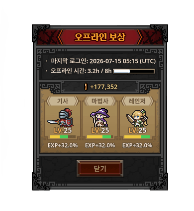

# 오프라인(방치) 보상 정산 기획서

> 상위 문서: [서버 시스템 전체 개요](../서버-시스템-전체-개요.md) · 관련 도메인 4.3
>
> 본 문서는 플레이어가 미접속(오프라인)한 동안의 자동 진행분을 재접속 시 **서버 권위로 정산**하는 규칙을 다룬다. 기준 시각·저장 구조는 [세이브 데이터 기획서](save-data-기획서.md), 산출에 쓰는 정적 수치는 [마스터 데이터 기획서](master-data/master-data-기획서.md)를 참고한다.

## 목차

- [1. 개요](#1-개요)
- [2. 기능 설명](#2-기능-설명)
- [3. 요구사항](#3-요구사항)
- [4. 데이터 모델](#4-데이터-모델)
- [5. API 명세](#5-api-명세)
  - [5.1 오프라인 보상 정산 — `POST /api/game/offline/claim`](#51-오프라인-보상-정산--post-apigameofflineclaim)
- [6. 처리 흐름](#6-처리-흐름)
- [7. 에러 코드](#7-에러-코드)
- [8. 공유 DTO 정의 — `OfflineRewardResult` (확정)](#8-공유-dto-정의--offlinerewardresult-확정)
- [9. 미결 사항 / TODO](#9-미결-사항--todo)
- [10. 참고](#10-참고)


## 1. 개요

- **목적**: 방치형(idle) 게임 특성상 플레이어가 접속하지 않은 동안에도 파티가 자동 전투로 성장한다. 재접속 시 그동안의 경과 시간에 비례한 **골드·경험치**를 계산해 지급한다(아이템은 지급하지 않음, 2장). 이 계산은 이득이 되는 값이므로 **서버가 최종 확정**한다(클라이언트 보고 불신).
- **대상 서버**: `GameServer`(정산 계산·지급), `TaskbarHero.Common`(정산 결과 DTO·에러 코드 공유).
- **기준 시각**: 오프라인 경과는 `game_player.last_active_at`(마지막 접속 시각, [세이브 데이터 기획서](save-data-기획서.md) 참조)를 기준으로 한다. 이 값은 접속 중 5분 주기 heartbeat로 갱신되므로, 접속이 끊긴 뒤에는 **마지막 heartbeat 시각**이 곧 오프라인 시작점이 된다.
- **관련 기획서**: [[save-data-기획서]] (기준 시각·저장), [[master-data-기획서]] (스테이지/드롭 수치), [[서버-시스템-전체-개요]] (도메인 4.3)

## 2. 기능 설명



- 플레이어가 재접속하면 클라이언트가 **오프라인 보상 정산**을 요청하고, 서버는 `현재 서버 시각 - last_active_at`(오프라인 경과 시간)을 계산해 보상을 산출·지급한 뒤 결과를 반환한다. 클라이언트는 결과를 팝업 등으로 보여준다.
- **지급 대상(확정)**: 오프라인 보상은 **골드와 경험치만** 지급하며, **아이템(전리품)은 지급하지 않는다.** 아이템 획득은 온라인 자동 전투에서만 이루어진다.
- 보상은 **경과 시간에 비례**하되, 무한 누적을 막기 위해 **최대 누적 시간 상한 12시간(확정)**을 둔다. 또한 **최소 정산 시간 10분(확정)** 미만이면 지급하지 않는다. 온라인 대비 **오프라인 효율 계수**는 **온라인 산출량의 50%(확정)**.
- 산출 기준이 되는 "파밍 스테이지"는 플레이어의 진행도(최고 클리어/현재 스테이지)를 따른다. 스테이지별 시간당 골드·경험치 산출량은 마스터 데이터(스테이지·몬스터)에서 파생한다.

## 3. 요구사항

**기능 요구사항**
- `last_active_at` 기준으로 오프라인 경과 시간을 서버가 계산한다.
- 경과 시간 × 파밍 스테이지 기준 산출율 × 오프라인 효율(50%) → 골드·경험치를 산출하고, 최대 누적 시간 상한을 적용한다. 아이템은 지급하지 않는다.
- 정산 결과를 세이브에 원자적으로 반영(재화·경험치 증가, 레벨 재계산)하고, 정산 후 `last_active_at`을 현재 시각으로 리셋해 **중복 정산을 방지**한다.
- 정산 결과 내역(경과 시간·지급 골드/경험치)을 응답으로 반환한다.

**비기능 요구사항**
- **서버 권위**: 모든 수치는 서버가 마스터 데이터와 서버 시각으로 계산한다. 클라이언트가 보낸 경과 시간·보상값은 신뢰하지 않는다.
- **원자성**: 재화·경험치 반영과 `last_active_at` 리셋은 하나의 트랜잭션(`user_id` 단위)으로 처리해, 중도 실패나 동시 요청에 의한 중복 지급을 막는다.
- **멱등성**: 정산 직후 재요청 시 경과 시간이 0에 수렴하므로 추가 지급이 없어야 한다.

## 4. 데이터 모델

오프라인 보상은 **별도의 영속 테이블을 새로 요구하지 않는다.** 아래 기존 세이브 데이터를 입력/출력으로 사용한다.

| 용도 | 대상 | 설명 |
|---|---|---|
| 입력(기준 시각) | `game_player.last_active_at` | 오프라인 시작점 |
| 입력(파밍 기준) | `game_player.max_stage_cleared` / `stage`·`act`·`difficulty` | 산출율 결정 |
| 산출 근거(정적) | `stage_reward`(reward_gold/reward_exp), `monster_master` | 시간당 골드·경험치 산출량 |
| 출력(지급) | `player_item`(재화 행 골드 증가, 계정), **파티에 편성된 캐릭터(`slot`≠0) 각각의 `player_character.exp`/`level`**(편성 캐릭터에 **동일 경험치** 지급, 미편성은 제외) | 정산 반영 |
| 기준 시각 리셋 | `game_player.last_active_at = now` | 중복 정산 방지 |

- **아이템 미지급(확정)**: 오프라인 보상은 `player_item`를 건드리지 않는다. `stage_reward`의 **아이템 드롭(등급별 확률)** 은 온라인 전투에서만 적용하고, 오프라인은 골드·경험치만 산출한다.
- **공유 DTO(확정)**: 정산 결과는 `TaskbarHero.Common`에 `OfflineRewardResult` DTO로 정의해 서버-클라이언트가 공유한다(경과 시간·지급 골드/경험치). 필드 정의는 8장.
- **감사 로그**: 정산 이력(재화·경험치 지급 원장) 관리는 현재 범위에서 별도로 두지 않는다. 재화 원장/감사 로그는 **향후 도입 시 정의**한다(현재 미도입).

## 5. API 명세

**API 목록**

- [5.1 오프라인 보상 정산 — `POST /api/game/offline/claim`](#51-오프라인-보상-정산--post-apigameofflineclaim)

Base URL(개발): `http://localhost:5247` (GameServer). 인증 요청 공통 형식 `{ userId, token, data }`, 응답 `{ success, errorCode, message, data }` ([세이브 데이터 기획서](save-data-기획서.md) 5장과 동일 규약).

> **미리보기**: 재접속 시 `POST /api/game/load` 응답의 `offlineElapsedSec`([세이브 데이터 기획서](save-data-기획서.md) 5.1)로 경과 시간을 미리 확인할 수 있다. 로드는 **부수효과가 없으며**(지급하지 않음), 실제 지급은 아래 정산 API가 담당한다.

### 5.1 오프라인 보상 정산 — `POST /api/game/offline/claim`

서버가 `last_active_at` 기준으로 보상을 계산·지급하고 결과를 반환한다.

**Request**
```json
{
  "userId": 1,
  "token": "MToxNzAwMDAwMDAwOmFCM2RFNmZHOWhKMWtM...",
  "data": {}
}
```

- 요청 `data`는 비어 있다. 경과 시간·보상은 전적으로 서버가 계산한다(클라이언트 입력 없음).

**Response (성공, 200 OK)**
```json
{
  "success": true,
  "errorCode": 0,
  "message": "Offline reward claimed",
  "data": {
    "offlineElapsedSec": 50000,
    "effectiveSec": 43200,
    "capped": true,
    "rewards": {
      "gold": 8640000,
      "exp": 216000
    },
    "characters": [
      { "characterId": 1, "level": 43, "exp": 12000 },
      { "characterId": 2, "level": 41, "exp": 5000 },
      { "characterId": 3, "level": 39, "exp": 30000 }
    ],
    "lastActiveAt": 1752350000
  }
}
```

| 필드 | 설명 |
|---|---|
| `offlineElapsedSec` | 실제 경과 시간(`now - last_active_at`) |
| `effectiveSec` | 상한(cap) 적용 후 보상 산정에 쓴 시간 |
| `capped` | 상한에 걸렸는지 여부 |
| `rewards.gold` / `rewards.exp` | 지급된 골드(계정) · 경험치(**파티에 편성된 캐릭터 각각에 동일하게** 지급, 미편성 캐릭터·아이템은 없음) |
| `characters[]` | 경험치 반영 후 각 캐릭터의 갱신된 레벨·잔여 경험치(`characterId`별). 같은 경험치를 받아도 시작 레벨이 달라 결과는 캐릭터마다 다르다 |
| `lastActiveAt` | 정산 기준 시각을 현재 서버 시각으로 리셋한 값 |

**Response (정산할 오프라인 없음 — 경과 시간이 최소 기준 미만, 200 OK)**
```json
{
  "success": false,
  "errorCode": 3001,
  "message": "No offline reward",
  "data": null
}
```

**Response (이미 정산됨 — 동시 중복 요청, 409 Conflict)**
```json
{
  "success": false,
  "errorCode": 3002,
  "message": "Offline reward already claimed",
  "data": null
}
```

- 세이브 없음(최초 접속)·인증 오류 등은 각각 기존 코드(`SaveNotFound=2001`, 인증 미들웨어 401)를 따른다.

## 6. 처리 흐름

### 6.1 정산 계산 (의사코드)

```
OFFLINE_CAP_SEC    = 43200                            # 최대 누적 12시간 (확정)
MIN_REWARD_SEC     = 600                              # 최소 정산 10분 (확정)
OFFLINE_EFFICIENCY = 0.5                              # 온라인 대비 50% (확정)

now        = 서버 현재 Unix 시각
elapsed    = now - game_player.last_active_at
effective  = min(elapsed, OFFLINE_CAP_SEC)           # 12시간 상한 적용
if effective < MIN_REWARD_SEC:                        # 10분 미만이면 정산 없음
    return NoOfflineReward(3001)

stage         = 파밍 기준 스테이지(진행도 기반)
goldPerSec    = stageGoldRate(stage)                 # 마스터 데이터에서 파생
expPerSec     = stageExpRate(stage)
gold          = floor(effective * goldPerSec * OFFLINE_EFFICIENCY)
exp           = floor(effective * expPerSec  * OFFLINE_EFFICIENCY)
# 아이템은 지급하지 않음 (골드·경험치만)

# 트랜잭션 (user_id 단위)
  player_item(재화, item_code=골드).quantity += gold        # 계정 공유
  for c in player_character[user_id] (3인):           # 모든 캐릭터에 동일 exp
      c.exp += exp → 레벨 곡선으로 c.level 재계산
  game_player.last_active_at = now                   # 중복 정산 방지
# 커밋

return { elapsed, effective, gold, exp, characters[], ... }
```

- `OFFLINE_CAP_SEC=43200`(12시간), `MIN_REWARD_SEC=600`(10분), `OFFLINE_EFFICIENCY=0.5`(50%)는 **확정**. `stageGoldRate/stageExpRate`(스테이지별 산출율)만 8장 미결이다.

### 6.2 재접속 시 순서 (권장)

```
클라이언트                         GameServer
  │ 1) /api/game/load ───────────▶ 세이브 로드 + offlineElapsedSec(미리보기)
  │ ◀── 스냅샷 ─────────────────
  │ 2) /api/game/offline/claim ─▶ 정산 계산·지급, last_active_at = now
  │ ◀── 보상 내역 ───────────────
  │ 3) 이후 5분 주기 heartbeat 시작
```

- **정산은 heartbeat 시작 전에 수행한다.** heartbeat가 먼저 돌면 `last_active_at`이 현재 시각으로 갱신되어 오프라인 경과가 사라진다(6.3 참고).

### 6.3 예외 / 엣지 케이스

- **정산 전 heartbeat 선행**: 클라이언트가 정산보다 heartbeat를 먼저 보내면 경과가 소실되어 보상이 0이 된다. 이는 지급 손실(플레이어 불이익)일 뿐 어뷰징은 아니며, 클라이언트가 6.2 순서를 지켜 방지한다.
- **동시 중복 요청**: 같은 계정의 정산 요청이 동시에 들어오면 트랜잭션/행 잠금으로 하나만 성공시키고 나머지는 `OfflineRewardAlreadyClaimed(3002)`로 거부한다.
- **경과 시간이 상한 초과**: `effectiveSec = OFFLINE_CAP_SEC`로 고정하고 `capped: true`로 표시한다(초과분은 버려짐).
- **클라이언트/서버 시각 불일치**: 경과 시간은 오직 **서버 시각**으로 계산한다. 클라이언트가 보낸 시각은 사용하지 않는다.
- **레벨업 상한**: 경험치 반영으로 여러 레벨이 한 번에 오를 수 있다. 레벨 곡선·최대 레벨 처리는 성장/레벨 규칙과 연계(8장 미결).

## 7. 에러 코드

`TaskbarHero.Common`의 `ErrorCode`에 추가 제안. 오프라인 보상 도메인은 **3000번대**를 사용한다([통합 정의](../공통/error-code-정의.md) 블록 규약). 추가 시 통합 문서도 함께 갱신한다.

| 이름 | 값 | 의미 |
|---|---|---|
| NoOfflineReward | 3001 | 정산할 오프라인 경과가 최소 기준 미만 |
| OfflineRewardAlreadyClaimed | 3002 | 이미 정산됨(동시 중복 요청) |

## 8. 공유 DTO 정의 — `OfflineRewardResult` (확정)

정산 API(`POST /api/game/offline/claim`)의 **성공 응답 `data`**를 그대로 담는 공유 DTO다. `TaskbarHero.Common.Dto`에 정의해 서버(GameServer)와 클라이언트(Unity)가 동일 타입을 공유한다. 5.1 응답 예시의 필드를 그대로 확정한 것이며, 필드명은 API JSON과 동일한 **camelCase**로 직렬화한다.

**필드 (확정)**

| 필드 | 타입 | 필수 | 설명 |
|---|---|---|---|
| `offlineElapsedSec` | `long` | O | 실제 경과 시간(`now - last_active_at`, 초). 상한 미적용 원본 값. |
| `effectiveSec` | `long` | O | 상한(cap) 적용 후 실제 보상 산정에 쓴 시간(초). `min(elapsed, 43200)`. |
| `capped` | `bool` | O | 12시간 상한에 걸렸는지 여부(`elapsed > 43200`). |
| `rewards` | `OfflineRewardAmount` | O | 이번 정산으로 **지급된** 골드·경험치. |
| `rewards.gold` | `long` | O | 지급 골드(`floor(effective × goldPerSec × 0.5)`). |
| `rewards.exp` | `long` | O | 지급 경험치(`floor(effective × expPerSec × 0.5)`). |
| `characters` | `OfflineCharacterState[]` | O | 경험치 반영 **후** 파티 편성 캐릭터 각각의 상태(모두 같은 `exp`를 받음). |
| `characters[].characterId` | `int` | O | 캐릭터 고유 식별자(파티에 편성된 캐릭터만 포함). |
| `characters[].level` | `int` | O | 반영 후 레벨(여러 레벨 동시 상승 가능, 6.3). |
| `characters[].exp` | `long` | O | 반영 후 현재 레벨의 **잔여 경험치**(누적 총량 아님). |
| `lastActiveAt` | `long` | O | 중복 정산 방지를 위해 현재 서버 시각으로 리셋한 기준 시각(Unix ts, 초). |

- **아이템 필드 없음(확정)**: 오프라인 보상은 골드·경험치만 지급하므로(2장) `rewards`에 아이템/전리품 필드를 두지 않는다.
- **미지급 케이스에는 사용하지 않음**: 경과가 최소 기준 미만(`NoOfflineReward=3001`)·이미 정산됨(`OfflineRewardAlreadyClaimed=3002`)인 경우 응답 `data`는 `null`이며 이 DTO를 채우지 않는다(5.1).
- **타입 근거**: `exp`·`gold`는 세이브 ERD에서 `bigint`이므로 `long`, `level`은 `int`([세이브 데이터 기획서](save-data-기획서.md) 3장).

**정의 (`TaskbarHero.Common.Dto`, netstandard2.0)** — 다른 게임 DTO(`GameDto.cs`)와 동일한 규약(`[Serializable]` + public camelCase 필드)으로 구현했다.

```csharp
namespace TaskbarHero.Common.Dto
{
    // 오프라인 보상 정산 결과 (POST /api/game/offline/claim 성공 응답 data)
    // 프로젝트 DTO 규약: [Serializable] + public camelCase 필드(필드명 = API JSON 키).
    [Serializable]
    public class OfflineRewardResult
    {
        public long offlineElapsedSec;  // 실제 경과 시간(초), 상한 미적용
        public long effectiveSec;       // 상한 적용 후 보상 산정 시간(초)
        public bool capped;             // 12시간 상한 적용 여부
        public OfflineRewardAmount rewards = new OfflineRewardAmount();          // 지급 골드·경험치(경험치는 3캐릭터 공통)
        public List<OfflineCharacterState> characters = new List<OfflineCharacterState>(); // 반영 후 3캐릭터 각각의 레벨·잔여 경험치
        public long lastActiveAt;       // 현재 서버 시각으로 리셋한 기준 시각(Unix ts)
    }

    [Serializable]
    public class OfflineRewardAmount
    {
        public long gold;
        public long exp;
    }

    [Serializable]
    public class OfflineCharacterState
    {
        public int characterId; // 캐릭터 고유 식별자(파티 편성 캐릭터)
        public int level;
        public long exp;        // 현재 레벨의 잔여 경험치
    }
}
```

- **직렬화 규약**: 다른 게임 DTO와 동일하게 `[Serializable]` + **public camelCase 필드**로 두어 **필드명이 곧 API JSON 키**가 된다. 서버(GameServer)는 `JsonSerializerOptions.IncludeFields = true`로 필드를 직렬화하고, Unity 클라이언트는 `JsonUtility`가 같은 필드를 파싱한다(양쪽 동일 JSON). 별도 `PropertyNamingPolicy`·`[JsonPropertyName]`은 쓰지 않는다(코드베이스가 camelCase 필드로 통일). `characters`는 JSON 배열이며 C#에서는 `List<OfflineCharacterState>`로 담는다.

## 9. 미결 사항 / TODO

- **스테이지별 산출율(`stageGoldRate`/`stageExpRate`) (구현·baseline 확정)**: 파밍 기준 스테이지는 **현재 진입 스테이지**(`game_player.act/difficulty/stage`)로 정하고, 시간당 산출율은 그 스테이지의 **클리어 보상(`stage_reward.reward_gold`/`reward_exp`)을 가정 클리어 주기(60초)마다 얻는다**는 단순식으로 파생한다(`perSec = reward / 60`). 최종 지급 = `floor(effectiveSec × reward / (60 × 2))`(오프라인 효율 50% = ÷2). 학습용 baseline이며 상수(`AssumedClearIntervalSec`)만 조정하면 된다. 몬스터 스탯 기반의 정교한 산출은 추후 개선 여지로 남긴다.

> 확정된 항목: 최대 누적 시간 12시간, 최소 정산 시간 10분, 오프라인 효율 50%, 아이템 미지급(2·6장), **`OfflineRewardResult` DTO 필드(8장)**, **시간당 산출율 baseline 공식(위)**. 정산 감사(재화 지급 원장)는 현재 미도입(향후 재화 원장 도입 시 정의).

## 10. 참고

- [서버 시스템 전체 개요](../서버-시스템-전체-개요.md) — 도메인 4.3(방치형 보상 정산)
- [세이브 데이터 기획서](save-data-기획서.md) — `last_active_at` 기준 시각, 로드 응답 `offlineElapsedSec`
- [마스터 데이터 기획서](master-data/master-data-기획서.md) — 스테이지·스테이지 보상·몬스터(산출 근거)
- [ErrorCode 통합 정의](../공통/error-code-정의.md) — 에러 코드 블록 규약
