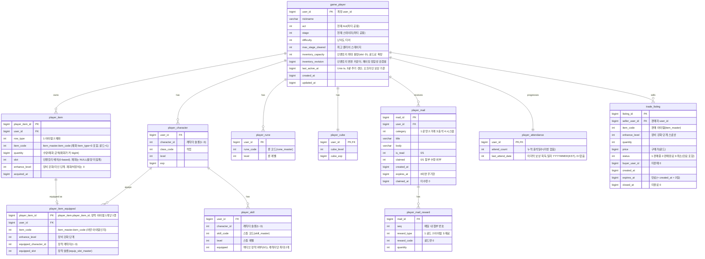

# 세이브 데이터 구조 / 저장 정책 기획서

> 상위 문서: [서버 시스템 전체 개요](../서버-시스템-전체-개요.md) · 관련 도메인 4.2
>
> 인증/계정은 [계정/로그인 기획서](account-login-기획서.md) 참고. 본 문서는 인증된 플레이어의 **게임 진행 데이터(세이브)** 구조와 저장 정책을 다룬다.

## 목차

- [1. 개요](#1-개요)
- [2. 저장 아키텍처](#2-저장-아키텍처)
- [3. 데이터 모델 (ERD)](#3-데이터-모델-erd)
- [4. 저장 정책](#4-저장-정책)
- [5. API 명세](#5-api-명세)
  - [5.1 코어 세이브 로드 — `POST /api/game/load`](#51-코어-세이브-로드--post-apigameload)
  - [5.2 인벤토리 페이지 조회 — `POST /api/game/inventory/list`](#52-인벤토리-페이지-조회--post-apigameinventorylist)
  - [5.3 캐릭터 생성 — `POST /api/game/create-character`](#53-캐릭터-생성--post-apigamecreate-character)
  - [5.4 접속 시각 갱신(heartbeat) — `POST /api/game/update-last-active`](#54-접속-시각-갱신heartbeat--post-apigameupdate-last-active)
- [6. 에러 코드 (신규 제안)](#6-에러-코드-신규-제안)
- [7. 미결 사항 / TODO](#7-미결-사항--todo)
- [8. 참고](#8-참고)


## 1. 개요

- **목적**: 플레이어의 게임 진행 상태(직업·레벨·재화·인벤토리·성장)를 서버에 영속 저장하고, 접속 시 로드한다. 방치형 게임 특성상 **마지막 접속(활동) 시각**이 오프라인 보상 계산의 기준점이 되므로 세이브 구조의 핵심 요소로 다룬다.
- **대상 서버**: `GameServer`(진행 데이터 저장/로드), `TaskbarHero.Common`(공유 DTO/에러 코드). 인증은 AccountServer가 발급한 토큰을 GameServer 미들웨어가 검증(Redis 대조).
- **서버 권위 원칙**: 재화·성장·아이템 등 이득이 되는 값은 서버가 최종 확정한다. 클라이언트가 보고한 값을 그대로 저장하지 않는다(치트 방지).
- **범위 경계**: 인벤토리/아이템·성장(직업·스킬·룬)·큐브의 **세부 규칙**은 각 도메인 기획서에서 다룬다. 본 문서는 이들을 담는 **저장 구조와 저장 정책**에 집중한다.

## 2. 저장 아키텍처

```
GameServer
  ├─ 로드(2단계 분리)
  │    ├─ 코어 스냅샷: /api/game/load        → 크기가 고정된 데이터 전부(게임 시작에 필요)
  │    └─ 지연 로딩:   /api/game/inventory/list → 가방 아이템만 slot 커서 페이징
  └─ 저장: 각 액션 API(캐릭터 생성·강화·스킬 레벨업·상점 구매 등)가
           서버 검증 후 자기 변경분을 그 요청 트랜잭션에서 MySQL 반영
           (별도의 일괄 저장 API는 두지 않음)
```

- **로드 2단계 분리(확정)**: 로드는 **"게임 시작에 필요한 고정 크기 데이터"**와 **"필요할 때 여는 가변 크기 데이터"**로 나눈다. 분리 기준은 데이터 종류가 아니라 **증가 차수**다.

  | 구분 | 항목 | 행 수 | 조회 |
  |---|---|---|---|
  | 고정 크기 | `player` | 1 | `/api/game/load` |
  | 고정 크기 | `characters` | ≤3 (캐릭터 슬롯) | `/api/game/load` |
  | 고정 크기 | `cube` | 1 | `/api/game/load` |
  | 고정 크기 | `currencies` | 재화 종류 수 | `/api/game/load` |
  | 고정 크기 | `runes` | `rune_master` 정의 수 | `/api/game/load` |
  | 고정 상한 | `skills` | 3 × 직업별 스킬 수 | `/api/game/load` |
  | 고정 상한 | `equipped` | ≤ 3캐릭터 × 6슬롯 = 18 | `/api/game/load` |
  | **가변** | **가방 아이템** | **`game_player.inventory_capacity`만큼(확장으로 증가)** | **`/api/game/inventory/list` (페이징)** |

  `player_item`만 무한히 커지므로 **이 하나만** 분리·페이징한다. 나머지를 항목별로 쪼개면 왕복만 늘고 이득이 없다.
- **장착 정보는 코어에 포함(확정)**: 장착 행은 최대 18개로 고정이고, 캐릭터 스탯 계산의 입력이라 **전투 시작 전에 반드시 있어야 한다.** 별도 요청으로 빼면 코어 로드 후에도 전투를 시작하지 못하므로, `/api/game/load` 응답에 `equipped` 배열로 함께 내린다. 가방 아이템 페이징 결과와는 겹치지 않는다(장착 아이템은 인벤 칸을 점유하지 않으므로 페이징 대상에서 제외).
- **액션 단위 저장(확정)**: 게임 상태 변경은 **각 기능 API가 처리하는 그 시점에** 서버가 검증·반영한다. 클라이언트가 진행 상태를 모아 보내는 **범용 일괄 저장 API(`/api/game/save`)는 두지 않는다.** 저장 시점·값은 클라이언트가 아니라 각 액션의 서버 로직이 결정한다.
- **MySQL 단일 저장소(확정)**: 세이브 데이터는 **MySQL에만** 저장한다. 3장 ERD의 정규화 테이블 구조를 그대로 사용하며, JSON 스냅샷 컬럼 등 별도 저장 방식은 쓰지 않는다. 계정 도메인과 동일하게 시간 값은 **Unix timestamp(BIGINT, 초)**로 저장.
- **Redis 미도입(확정)**: 세이브 데이터에는 Redis 캐시 계층을 두지 않고 MySQL에 직접 읽고 쓴다. (인증 토큰 검증용 Redis는 별개 용도이며 세이브 저장과 무관하다.)
- **정합성**: 재화·인벤토리 변경은 트랜잭션으로 원자성을 보장한다.

## 3. 데이터 모델 (ERD)

`GameServer` 전용 MySQL 데이터베이스. 모든 테이블의 `user_id`는 계정(`AccountServer`의 `users.user_id`)과 동일한 식별자를 사용한다(서버 간 공유 키). 계정은 **캐릭터 슬롯 3개**를 가지며(3인 파티가 함께 전투, [성장 시스템 기획서](growth-기획서.md)), **직업·레벨·경험치·스킬·장비는 캐릭터별**, **인벤토리·골드·큐브는 계정 공유**다.



- **PK/유니크**:
  - `player_character`: `(user_id, character_id)` 복합 PK. `character_id`는 1~3.
  - `player_skill`: `(user_id, character_id, skill_code)` 복합 PK. 캐릭터별 스킬 레벨·액티브 장착.
  - `player_rune`: `(user_id, rune_code)` 복합 PK. 룬은 **계정 공용**이라 `character_id`를 두지 않는다.
  - `player_mail`: `mail_id` PK, `user_id` 조회 인덱스. 계정 우편함.
  - `player_mail_reward`: `(mail_id, seq)` 복합 PK. 메일 첨부(0~N).
  - `player_attendance`: `user_id` PK로 **계정당 1행**(출석 진행도). `attend_count`(누적 출석일수)로 일차를 산출하고(`% 30 + 1`, 30일 순환) `last_attend_date`로 하루 1회를 보장한다. 일자별 출석 이력은 저장하지 않는다([출석부 보상 시스템 기획서](attendance-기획서.md)).
  - `trade_listing`: `listing_id` PK, `(status, item_code, price)`·`(status, price)`·`(seller_user_id, status)`·`(status, expires_at)` 인덱스. 전역 거래소 등록(에스크로), 등록 아이템은 `player_item`에서 빠져 여기 스냅샷으로 보관([거래소 / 교역선 기획서](trade-기획서.md)). 목록 조회는 전역 공유 읽기이므로 Redis 목록 캐시를 상시 사용하고, 동시 구매는 Redis 락 + 조건부 갱신으로 직렬화한다(같은 기획서 7장).
  - `player_item`: `player_item_id` PK. `(user_id, slot)` 유니크 — 한 인벤토리 칸(slot)에는 아이템(스택) 한 행만 존재한다(재화 행은 `slot`이 NULL이라 무제한 공존). 이 유니크 인덱스는 **인벤토리 페이지 조회(5.2)의 keyset 커서 인덱스로 그대로 재사용**한다(추가 인덱스 불필요).
  - `player_item_equipped`: `player_item_id` PK — 장착 중인 아이템만 행으로 존재하며 아이템당 최대 1행이라 한 아이템은 동시에 한 곳에만 장착된다. `(user_id, equipped_character_id, equipped_slot)` 유니크 — **한 캐릭터-장착슬롯에 아이템 하나**를 보장한다. 장착=INSERT, 해제=DELETE.
- **아이템·재화 통합(`row_type`)**: `player_item`은 `row_type`(1:아이템 2:재화)으로 아이템과 재화(골드 등)를 **한 테이블에** 담는다. `item_code`는 **모든 행이 `item_master.item_code`를 참조**하며(재화는 `item_master`의 `item_type=3` 항목, 골드=`item_code` 1 — 별도 `currency_master` 없음), `quantity`가 수량/재화 금액(재화가 커 `bigint`)이다. **재화 행은 계정에 재화 종류당 1행**이어야 하므로 `(user_id, row_type=2, item_code)` 유일성을 **서버가 보장**한다(MySQL 부분 유니크 인덱스 미지원. 아이템 행은 스택 분할로 `(user_id, item_code)`가 중복될 수 있어 전역 유니크를 걸 수 없다). 재화 행은 `slot`/`enhance_level`을 쓰지 않고 장착 대상도 아니며(`player_item_equipped`에 행이 생기지 않음) **인벤토리 용량 집계에서 제외**한다.
- **캐릭터별 vs 계정 공유**: `player_character`·`player_skill`은 **캐릭터별**, `player_item`(아이템·재화)·`player_cube`·`player_rune`은 **계정 공유**다. 스킬은 캐릭터마다 다르게 찍고 룬은 계정 전체에 적용되므로 테이블을 분리한다. 아이템은 계정 공용 행(`player_item`)이되 장착만 캐릭터별이다 — 장착 상태는 자식 테이블 `player_item_equipped`(`player_item`과 1:0..1)에 분리해, 그 행의 `equipped_character_id`/`equipped_slot`으로 **어느 캐릭터의 어느 슬롯에 장착됐는지**를 표기하며, 한 아이템은 최대 한 캐릭터·한 슬롯에만 장착된다.
- **인벤토리 배치 위치(`player_item.slot`)**: 아이템(스택)이 인벤토리 UI의 몇 번 칸에 있는지를 나타내는 위치 값(0-based)이다. 클라이언트 재접속 시 인벤토리 페이지 조회(5.2)가 내려준 `slot`으로 **마지막 접속과 동일한 배치**를 복원한다. `slot`은 배치 값인 동시에 **페이징 정렬키이자 커서**다. 플레이어가 드래그로 칸을 옮기면 그 변경은 배치 변경 API로 반영한다([인벤토리/아이템/큐브 기획서](inventory-item-cube-기획서.md) 5.5). `player_item_equipped.equipped_slot`(장착 슬롯)과는 다른 개념이다. 배치는 UI 레이아웃 값이므로 서버 권위 검증 대상은 아니나, 용량(`game_player.inventory_capacity`) 범위 안이고 칸이 중복되지 않는지는 검증한다.
- **인벤토리 변경 카운터(`game_player.inventory_revision`, bigint)**: 인벤토리를 여러 페이지로 나눠 조회하는 동안(5.2) 내용이 바뀌면 같은 아이템을 두 번 받거나 아예 놓친 **찢어진 스냅샷**이 만들어진다. 이를 감지하기 위해 인벤토리를 바꾸는 모든 트랜잭션이 **같은 트랜잭션 안에서** 이 값을 `+1` 한다(획득·소모·이동·장착/해제·강화·분해·거래 체결/취소·메일 첨부 수령·전리품 지급·오프라인 보상 지급). 클라이언트는 첫 응답의 값과 이후 페이지의 값이 다르면 처음부터 다시 조회한다. **계정 생성 시 `1`로 초기화한다** — 요청에서 `0`은 "기준값 없음(검증 생략)"을 뜻하는 예약값이므로, 계정의 실제 카운터가 `0`을 가지면 정상 계정의 첫 변경을 검증에서 놓친다.


- **아이템/스킬/룬 등의 코드 값**은 마스터(기획) 데이터를 참조한다([마스터 데이터 기획서](master-data/master-data-기획서.md), 도메인 4.10). 각 코드 컬럼이 어느 마스터 테이블을 참조하는지는 해당 문서 3장의 매핑 표를 참고한다.
- `player_character`/`player_item`/`player_item_equipped`/`player_skill`/`player_rune`/`player_cube`/`player_mail`/`player_attendance`/`trade_listing`의 **세부 필드·규칙**은 각 시스템 기획서(성장·인벤토리·[메일](mail-기획서.md)·[출석부](attendance-기획서.md)·[거래소](trade-기획서.md) 등)에서 확장한다. 본 ERD는 저장 골격이다.

## 4. 저장 정책

- **저장 시점 — 액션 단위(확정)**
  - **범용 일괄 저장 API 없음**: 진행 상태를 모아 저장하는 `/api/game/save` 같은 엔드포인트는 두지 않는다. 대신 **상태를 바꾸는 각 기능 API**(캐릭터 생성, 장비 장착/강화, 인벤토리 배치, 스킬 레벨업/초기화/장착, 룬 업그레이드, 큐브 합성/분해 등)가 처리 시점에 **자기 변경분을 그 요청 트랜잭션에서 DB에 반영**한다.
  - **서버 자동 저장 없음**: 서버는 주기적 자동 저장(autosave)을 하지 않는다. 저장은 위 액션이 일어날 때만 발생한다.
  - **스테이지 진행·경험치**: 자동 전투로 생기는 진행도(act/stage/max_stage_cleared)와 경험치·레벨은 **전투 결과 검증(도메인 4.6, 미작성)** 이 서버 권위로 산출·반영한다. 클라이언트가 임의 값을 올려 저장하지 않는다.
  - **마지막 접속 시각 주기 갱신(확정)**: 종료 시 로그아웃 요청으로 시각을 남기는 방식은 쓰지 않는다. 대신 클라이언트가 접속 후 **자동으로 5분 간격**으로 접속 시각 갱신 요청(`/api/game/update-last-active`)을 보내고, 서버는 `last_active_at`을 현재 서버 시각으로 갱신한다. 접속이 끊기면 마지막으로 갱신된 시각이 오프라인 경과 계산의 기준이 되며, 최대 오차는 갱신 주기(5분) 이내로 한정된다.
- **오프라인 기준 시각**: `last_active_at`(마지막 접속 시각)이 오프라인 보상 정산의 기준. 오프라인 보상 계산 규칙은 [오프라인 보상 정산 기획서](offline-reward-기획서.md) 참고.
- **서버 권위 검증**: 각 액션의 값은 서버 규칙·마스터 데이터로 재계산/검증 후 반영한다. 불가능한 증가폭·음수 재화 등은 거부한다(클라이언트 보고 불신).
- **동시성**: 동일 계정 단일 세션 정책([계정/로그인 기획서](account-login-기획서.md))에 따라 세이브 경합은 제한적이나, 각 액션 저장은 `user_id` 단위 트랜잭션으로 처리한다.
- **인벤토리 변경 시 revision 증가(확정)**: `player_item`·`player_item_equipped`를 바꾸는 트랜잭션은 **커밋 전에 같은 트랜잭션 안에서** `game_player.inventory_revision`을 `+1` 한다. 별도 트랜잭션으로 미루면 페이징 정합성 검증(5.2)이 무의미해진다. 적용 대상은 인벤토리 액션([인벤토리/아이템/큐브 기획서](inventory-item-cube-기획서.md) 5장) 전부와, 아이템을 지급·회수하는 다른 도메인(전리품, 메일 첨부 수령, 오프라인 보상, 거래소 등록/체결/취소)이다.

## 5. API 명세

**API 목록**

- [5.1 코어 세이브 로드 — `POST /api/game/load`](#51-코어-세이브-로드--post-apigameload)
- [5.2 인벤토리 페이지 조회 — `POST /api/game/inventory/list`](#52-인벤토리-페이지-조회--post-apigameinventorylist)
- [5.3 캐릭터 생성 — `POST /api/game/create-character`](#53-캐릭터-생성--post-apigamecreate-character)
- [5.4 접속 시각 갱신(heartbeat) — `POST /api/game/update-last-active`](#54-접속-시각-갱신heartbeat--post-apigameupdate-last-active)

Base URL(개발): `http://localhost:5247` (GameServer). 모든 API는 **POST**, 인증 요청 공통 형식 `{ userId, token, data }`를 사용한다(토큰은 body, [계정/로그인 기획서](account-login-기획서.md) 5장 참고). 응답은 `{ success, errorCode, message, data }` 형식이며, `errorCode`는 `TaskbarHero.Common`의 `ErrorCode`(6장) 값이고 `success`는 `errorCode == 0`과 동치다(계정·마스터 기획서와 동일한 응답 규약).

> 5.1·5.2는 **조회 계열**이라 본 문서에 함께 명세한다. 5.2의 경로가 `/api/game/inventory/*`인 것은 인벤토리 컨트롤러(`GameInventoryController`)에 배치되기 때문이며, 규칙(페이징·정합성)은 세이브 로드 정책에 속한다.

---

### 5.1 코어 세이브 로드 — `POST /api/game/load`

접속 후 **게임 시작에 필요한 고정 크기 데이터 전부**를 한 번에 로드한다. **가방 아이템은 포함하지 않는다**(5.2로 지연 로딩).

**반환 항목(전량, 이 목록이 계약이다)**

| 필드 | 내용 | 출처 테이블 | 크기 |
|---|---|---|---|
| `player` | 닉네임·진행 좌표(act/stage/difficulty)·최고 클리어·인벤 용량·마지막 활동 시각 | `game_player` | 1행 |
| `characters` | 파티 캐릭터의 슬롯·직업·레벨·경험치 | `player_character` | ≤3행 |
| `currencies` | 재화 종류별 보유량(골드 포함) | `player_item` (`row_type=2`) | 재화 종류 수 |
| `equipped` | 캐릭터별 장착 장비(아이템 식별자·코드·강화 단계·장착 캐릭터/슬롯) | `player_item_equipped` (단독 — `item_code`·`enhance_level`을 함께 보관하므로 조인 불필요) | ≤18행 |
| `skills` | 캐릭터별 보유 스킬 코드·레벨·액티브 장착 여부 | `player_skill` | 3 × 직업 스킬 수 |
| `runes` | 계정 공용 룬 코드·레벨 | `player_rune` | 룬 마스터 수 |
| `cube` | 큐브 레벨·경험치 | `player_cube` | 1행 |
| `inventoryTotal` | 가방 아이템 행 수(용량 UI 표시·페이징 진행률용) | `player_item` (`row_type=1`) COUNT | 스칼라 |
| `inventoryRevision` | 인벤토리 변경 카운터(5.2 정합성 기준값) | `game_player` | 스칼라 |
| `offlineElapsedSec` | `현재 서버 시각 - lastActiveAt` | 산출값 | 스칼라 |

> **구현 규칙**: 위 목록은 `GameServer/Services/SaveService.cs`의 `LoadAsync` **XML 주석(`/// <summary>`)에 항목별로 그대로 기재**한다. 반환 항목을 추가·제거할 때 이 표와 그 주석을 함께 갱신한다(서비스 메서드 주석 규칙, `CLAUDE.md`).

**Request**
```json
{
  "userId": 1,
  "token": "MToxNzAwMDAwMDAwOmFCM2RFNmZHOWhKMWtM...",
  "data": {}
}
```

**Response (성공, 200 OK)**
```json
{
  "success": true,
  "errorCode": 0,
  "message": "Load successful",
  "data": {
    "player": {
      "nickname": "hero",
      "act": 2,
      "stage": 15,
      "difficulty": 1,
      "maxStageCleared": 214,
      "inventoryCapacity": 100,
      "lastActiveAt": 1752300000
    },
    "characters": [
      { "characterId": 1, "classCode": 1, "level": 42, "exp": 128500 },
      { "characterId": 2, "classCode": 2, "level": 40, "exp": 90000 },
      { "characterId": 3, "classCode": 3, "level": 38, "exp": 60000 }
    ],
    "currencies": [
      { "currencyType": 1, "amount": 9875421 }
    ],
    "equipped": [
      { "itemId": 5001, "itemCode": 30012, "enhanceLevel": 3, "equippedCharacterId": 1, "equippedSlot": 1 }
    ],
    "skills": [
      { "characterId": 1, "skillCode": 101, "level": 5, "equipped": 1 }
    ],
    "runes": [
      { "runeCode": 205, "level": 3 }
    ],
    "cube": { "cubeLevel": 4, "cubeExp": 1200 },
    "inventoryTotal": 3872,
    "inventoryRevision": 1041,
    "offlineElapsedSec": 43200
  }
}
```

- `player`는 계정/파티 공용 값, `characters`는 3인 파티 각 캐릭터의 직업·레벨·경험치다. `skills`는 `characterId`로 소속 캐릭터를 표시하며(스킬 행의 `equipped=1`은 액티브 장착, 캐릭터당 최대 2개), `runes`는 계정 공용이다. `currencies`·`equipped`·`cube`도 계정 공유(장착 위치만 캐릭터별).
- **`currencies`의 저장 출처**: `player_item`의 `row_type=2`(재화) 행을 `{currencyType(=item_code), amount(=quantity)}`로 투영한 결과다. 재화 행은 `slot`이 NULL이라 가방 페이징(5.2) 대상에서 자동으로 빠지므로, **재화는 코어에서만 내려간다.**
- **`equipped`(장착 장비)**: `player_item_equipped` 행을 그대로 내려준다. 장착 아이템은 인벤토리 칸을 점유하지 않으므로 5.2의 페이지 결과와 **중복되지 않는다.** 클라이언트는 이 배열만으로 캐릭터별 장비 렌더링과 스탯 계산을 끝낼 수 있고, 가방을 로드하지 않은 상태에서도 전투를 시작할 수 있다.
- **가방 아이템은 포함하지 않는다**: `inventoryTotal`(총 개수)과 `inventoryRevision`(변경 카운터)만 내려준다. 실제 아이템 목록은 창고/인벤토리 UI를 열 때 5.2로 조회한다.
- `offlineElapsedSec`: `현재 서버 시각 - lastActiveAt`. 오프라인 보상 계산의 입력값(정산 규칙은 [오프라인 보상 정산 기획서](offline-reward-기획서.md)).

**Response (세이브 없음 — 최초 접속, 200 OK)**
```json
{
  "success": true,
  "errorCode": 0,
  "message": "New player",
  "data": { "isNew": true }
}
```

세이브가 없는 계정은 인벤토리도 없으므로 클라이언트는 5.2를 호출하지 않고 캐릭터 생성(5.3)으로 진행한다.

---

### 5.2 인벤토리 페이지 조회 — `POST /api/game/inventory/list`

가방 아이템을 **`slot` 커서 기준 keyset 페이징**으로 조회한다. 창고/인벤토리 UI를 열 때 호출하며, 접속 직후에는 호출하지 않는다.

**Request**
```json
{
  "userId": 1,
  "token": "MToxNzAwMDAwMDAwOmFCM2RFNmZHOWhKMWtM...",
  "data": { "cursor": -1, "limit": 200, "revision": 1041 }
}
```

- `cursor`: 직전 페이지에서 받은 `nextCursor`. **첫 페이지는 `-1`**(`slot`이 0-based이므로 `slot > -1`이 곧 처음부터).
- `limit`: 페이지 크기. 서버가 **1~500으로 클램프**하며 기본값 200. 범위 밖 값은 거부하지 않고 클램프한다(클라 버전 차이로 로드가 실패하지 않게).
- `revision`: 5.1에서 받은 `inventoryRevision`. **첫 페이지 요청에서는 `0`**(= 기준값 없음, 검증 생략)을 보내고, 두 번째 페이지부터 직전 응답의 `revision`을 그대로 실어 보낸다. 계정의 실제 카운터는 1부터 시작하므로 예약값 `0`과 겹치지 않는다.

**Response (성공, 200 OK)**
```json
{
  "success": true,
  "errorCode": 0,
  "message": "Inventory page",
  "data": {
    "items": [
      { "itemId": 5002, "slot": 0, "itemCode": 30012, "quantity": 1, "enhanceLevel": 3 },
      { "itemId": 5003, "slot": 1, "itemCode": 20101, "quantity": 64, "enhanceLevel": 0 }
    ],
    "nextCursor": 199,
    "hasMore": true,
    "total": 3872,
    "revision": 1041
  }
}
```

- `items`: `slot` 오름차순. **가방 아이템(`row_type=1` 이면서 `slot`이 있는 행)만** 담는다 — 재화 행(`slot` NULL)과 장착 아이템(인벤 칸 미점유)은 코어 로드(5.1)의 `currencies`·`equipped`로 이미 내려갔으므로 제외한다. 그래서 항목에 장착 필드가 없다.
- `nextCursor`: 이 페이지 마지막 항목의 `slot`. `hasMore=false`면 의미 없다.
- `hasMore`: 다음 페이지 존재 여부.
- `total`: 가방 아이템 총 행 수(진행률 표시용). 페이지마다 같은 `revision` 기준값이다.

**조회 규칙 (확정)**

- **keyset 페이징만 사용한다.** `OFFSET`은 뒤 페이지로 갈수록 앞 행을 전부 스캔하므로 금지한다. 서버 조회 조건은 다음과 같고, `(user_id, slot)` 유니크 인덱스(3장)가 이를 완전히 커버한다.

  ```
  WHERE user_id = :userId AND row_type = 1 AND slot > :cursor
  ORDER BY slot ASC
  LIMIT :limit
  ```

- **정렬·필터는 서버가 제공하지 않는다.** 정렬키를 늘리면 인덱스가 커버하지 못해 페이징 성능 이점이 사라진다. 등급/종류별 정렬·필터는 클라이언트가 받은 페이지에 대해 로컬로 처리한다.
- **정합성 검증**: 요청의 `revision`이 있고 현재 `game_player.inventory_revision`과 다르면 `InventoryRevisionChanged(4012)`로 거부한다. 클라이언트는 이 코드를 받으면 **5.1부터 다시 조회**한다(부분 재시도 금지 — 이미 받은 페이지가 낡았기 때문). `revision`을 생략한 첫 페이지 요청은 검증을 건너뛰고 현재 값을 응답에 실어 기준을 세운다.
- 세이브가 없는 계정이면 `SaveNotFound(2001)`.

**Response (정합성 깨짐, 409 Conflict)**
```json
{
  "success": false,
  "errorCode": 4012,
  "message": "Inventory changed during paging",
  "data": { "revision": 1042 }
}
```

재시도로 해소되는 경합이므로 HTTP 409를 쓴다(거래소 `TradeBusy`·출석 중복 수령과 같은 규약). `data.revision`은 서버의 현재 값이며, 클라이언트는 이를 신뢰하지 말고 5.1부터 다시 받는다.

---

### 5.3 캐릭터 생성 — `POST /api/game/create-character`

캐릭터를 **한 번에 1개** 생성한다. 계정당 최대 3개(3인 파티)이며 **직업은 서로 중복될 수 없다**. 최초 호출 시 계정 세이브(`game_player`)가 함께 초기화되고, 서버가 **빈 슬롯에 `characterId`(1~3)를 배정**한다. **1번 슬롯(최초 생성=계정 초기화)은 무료이나, 2·3번 슬롯 추가 생성은 골드를 소모**한다(비용은 마스터 `character_create_cost` 명시값, [마스터 데이터 기획서](master-data/master-data-기획서.md)). 골드 확인·차감·캐릭터 삽입은 한 트랜잭션으로 원자적으로 처리한다.


**Request**
```json
{
  "userId": 1,
  "token": "MToxNzAwMDAwMDAwOmFCM2RFNmZHOWhKMWtM...",
  "data": { "nickname": "hero", "classCode": 1 }
}
```

- `nickname`: **최초 캐릭터 생성(계정 초기화) 시에만** 사용하며, 이후 호출에서는 무시한다.
- `classCode`: 생성할 캐릭터의 직업. **이미 보유한 캐릭터의 직업과 중복될 수 없다.**

**Response (성공, 200 OK)**
```json
{
  "success": true,
  "errorCode": 0,
  "message": "Character created",
  "data": {
    "userId": 1, "characterId": 2, "classCode": 2, "level": 1,
    "cost": { "currencyType": 1, "amount": 100000 },
    "balance": [ { "currencyType": 1, "amount": 900000 } ]
  }
}
```

- `characterId`: 서버가 배정한 슬롯(1~3).
- `cost`·`balance`: 소모한 골드와 차감 후 잔액. **최초 생성(1번 슬롯)은 무료라 `cost.amount=0`, `balance`는 빈 목록**이다. 생성 **전** 안내 비용은 클라이언트가 마스터 `character_create_cost` 번들에서 다음 슬롯 값을 조회해 표시한다.
- 오류: `InvalidClassCode(2005)`(존재하지 않는 직업), `InvalidCharacterId(2006)`(이미 보유한 직업과 중복), `PlayerAlreadyExists(2004)`(슬롯 3개가 모두 차 더 이상 생성 불가), `InsufficientCurrency(4005)`(2·3번 슬롯 생성 골드 부족).

---

### 5.4 접속 시각 갱신(heartbeat) — `POST /api/game/update-last-active`

클라이언트가 접속 후 **5분 간격으로 자동 호출**한다. 서버는 `last_active_at`을 현재 서버 시각으로 갱신한다. 접속이 끊기면 마지막으로 갱신된 값이 오프라인 경과 시간 계산의 기준이 된다.

> 계정 세션/토큰 무효화는 AccountServer의 `/api/auth/logout`([계정/로그인 기획서](account-login-기획서.md) 5.3)이 담당한다. 본 엔드포인트는 **GameServer의 마지막 접속 시각(`last_active_at`) 갱신** 전용이며, 별도의 GameServer 로그아웃 요청은 두지 않는다.

**Request**
```json
{
  "userId": 1,
  "token": "MToxNzAwMDAwMDAwOmFCM2RFNmZHOWhKMWtM...",
  "data": {}
}
```

**Response (성공, 200 OK)**
```json
{
  "success": true,
  "errorCode": 0,
  "message": "Heartbeat OK",
  "data": { "lastActiveAt": 1752343500 }
}
```

- `lastActiveAt`: 서버가 기록한 접속 시각(Unix ts). 클라이언트가 보낸 시각이 아니라 **서버 시각**을 사용한다(치트 방지).

## 6. 에러 코드 (신규 제안)

`TaskbarHero.Common/ErrorCode.cs`의 `ErrorCode`에 추가 제안. 계정 도메인(1001~1006, [계정/로그인 기획서](account-login-기획서.md) 6장)과 중복되지 않도록 **세이브 도메인은 2000번대**를 사용한다.

| 이름 | 값 | 의미 |
|---|---|---|
| SaveNotFound | 2001 | 세이브 데이터 없음 |
| InvalidSaveData | 2002 | 액션 요청 값 검증 실패(불가능한 값·비정상 데이터) |
| PlayerAlreadyExists | 2004 | 캐릭터 슬롯 3개가 모두 차 더 생성 불가 |
| InvalidClassCode | 2005 | 존재하지 않는 직업 코드 |
| InvalidCharacterId | 2006 | 잘못된 캐릭터 슬롯(존재하지 않는 `characterId`, 생성 시 슬롯 개수 오류 또는 직업 중복) |

> `2003`(구 `SaveVersionMismatch`)은 세이브 스키마 버전(`data_version`) 제거로 폐기했다. 값 혼선을 막기 위해 재사용하지 않고 **결번**으로 둔다.

인벤토리 페이지 조회(5.2)의 정합성 실패는 인벤토리 도메인 코드를 사용한다. 값 정의는 [인벤토리/아이템/큐브 기획서](inventory-item-cube-기획서.md) 7장에 있으며, 여기서는 재정의하지 않고 재사용한다.

| 이름 | 값 | 의미 |
|---|---|---|
| InventoryRevisionChanged | 4012 | 페이징 도중 인벤토리가 변경됨(5.1부터 재조회 필요) |

## 7. 미결 사항 / TODO

- **재화 종류 목록**: 골드 외 추가 재화 도입 여부·정의(향후 재화 정책과 연계, 재화는 `item_master`의 `item_type=3` 항목으로 정의).
- **heartbeat 주기(5분) 확정값 검토**: 5분 주기는 확정이나, 강제 종료 시 최대 5분의 접속 시각 오차가 오프라인 보상에 미치는 영향은 오프라인 보상 기획에서 함께 점검.
- **페이지 크기 기본값(200) 검토**: Unity `JsonUtility` 역직렬화 비용과 왕복 횟수의 균형점은 실측으로 정한다. 계약(클램프 1~500)은 그대로 두고 기본값만 조정한다.
- **`skills`·`runes` 분리 축 예약**: 현재는 크기가 작아 코어에 유지한다. 분리가 필요해지면 `POST /api/game/growth/skills`(`characterId` 필터)·`POST /api/game/growth/runes`로 뺀다. 경로만 예약하고 구현하지 않는다.

## 8. 참고

- [서버 시스템 전체 개요](../서버-시스템-전체-개요.md) — 도메인 4.2(저장/로드), 4.3(오프라인 보상)
- [계정/로그인 기획서](account-login-기획서.md) — 인증 토큰(body 전달)·단일 세션·`user_id` 공유 키
- [인벤토리/아이템/큐브 기획서](inventory-item-cube-기획서.md) — 인벤토리 액션(장착·강화·이동·용량 확장)과 `InventoryRevisionChanged(4012)` 정의
