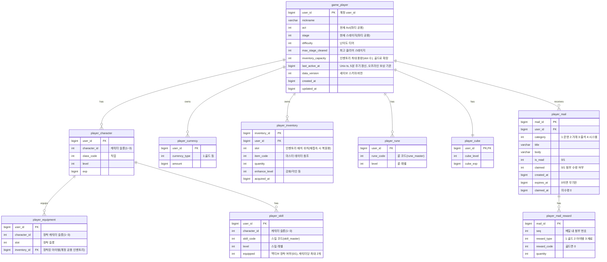

# 세이브 데이터 구조 / 저장 정책 기획서

> 상위 문서: [서버 시스템 전체 개요](../공통/서버-시스템-전체-개요.md) · 관련 도메인 4.2
>
> 인증/계정은 [계정/로그인 기획서](account-login-기획서.md) 참고. 본 문서는 인증된 플레이어의 **게임 진행 데이터(세이브)** 구조와 저장 정책을 다룬다.

## 1. 개요

- **목적**: 플레이어의 게임 진행 상태(직업·레벨·재화·인벤토리·성장)를 서버에 영속 저장하고, 접속 시 로드한다. 방치형 게임 특성상 **마지막 접속(활동) 시각**이 오프라인 보상 계산의 기준점이 되므로 세이브 구조의 핵심 요소로 다룬다.
- **대상 서버**: `GameServer`(진행 데이터 저장/로드), `TaskbarHero.Common`(공유 DTO/에러 코드). 인증은 AccountServer가 발급한 토큰을 GameServer 미들웨어가 검증(Redis 대조).
- **서버 권위 원칙**: 재화·성장·아이템 등 이득이 되는 값은 서버가 최종 확정한다. 클라이언트가 보고한 값을 그대로 저장하지 않는다(치트 방지).
- **범위 경계**: 인벤토리/아이템·성장(직업·스킬·룬·펫)·큐브의 **세부 규칙**은 각 도메인 기획서에서 다룬다. 본 문서는 이들을 담는 **저장 구조와 저장 정책**에 집중한다.

## 2. 저장 아키텍처

```
GameServer
  ├─ 로드: MySQL(영속) → 클라이언트로 스냅샷 전달
  └─ 저장: 각 액션 API(캐릭터 생성·강화·스킬 레벨업·상점 구매 등)가
           서버 검증 후 자기 변경분을 그 요청 트랜잭션에서 MySQL 반영
           (별도의 일괄 저장 API는 두지 않음)
```

- **액션 단위 저장(확정)**: 게임 상태 변경은 **각 기능 API가 처리하는 그 시점에** 서버가 검증·반영한다. 클라이언트가 진행 상태를 모아 보내는 **범용 일괄 저장 API(`/api/game/save`)는 두지 않는다.** 저장 시점·값은 클라이언트가 아니라 각 액션의 서버 로직이 결정한다.
- **MySQL 단일 저장소(확정)**: 세이브 데이터는 **MySQL에만** 저장한다. 3장 ERD의 정규화 테이블 구조를 그대로 사용하며, JSON 스냅샷 컬럼 등 별도 저장 방식은 쓰지 않는다. 계정 도메인과 동일하게 시간 값은 **Unix timestamp(BIGINT, 초)**로 저장.
- **Redis 미도입(확정)**: 세이브 데이터에는 Redis 캐시 계층을 두지 않고 MySQL에 직접 읽고 쓴다. (인증 토큰 검증용 Redis는 별개 용도이며 세이브 저장과 무관하다.)
- **정합성**: 재화·인벤토리 변경은 트랜잭션으로 원자성을 보장한다.

## 3. 데이터 모델 (ERD)

`GameServer` 전용 MySQL 데이터베이스. 모든 테이블의 `user_id`는 계정(`AccountServer`의 `users.user_id`)과 동일한 식별자를 사용한다(서버 간 공유 키). 계정은 **캐릭터 슬롯 3개**를 가지며(3인 파티가 함께 전투, [성장 시스템 기획서](growth-기획서.md)), **직업·레벨·경험치·스킬·장비는 캐릭터별**, **인벤토리·골드·큐브는 계정 공유**다.



- **PK/유니크**:
  - `player_character`: `(user_id, character_id)` 복합 PK. `character_id`는 1~3.
  - `player_currency`: `(user_id, currency_type)` 복합 PK
  - `player_equipment`: `(user_id, character_id, slot)` 복합 PK — 캐릭터마다 슬롯별 장착을 따로 가진다.
  - `player_skill`: `(user_id, character_id, skill_code)` 복합 PK. 캐릭터별 스킬 레벨·액티브 장착.
  - `player_rune`: `(user_id, rune_code)` 복합 PK. 룬은 **계정 공용**이라 `character_id`를 두지 않는다.
  - `player_mail`: `mail_id` PK, `user_id` 조회 인덱스. 계정 우편함.
  - `player_mail_reward`: `(mail_id, seq)` 복합 PK. 메일 첨부(0~N).
  - `player_inventory`: `(user_id, slot)` 유니크 — 한 인벤토리 칸(slot)에는 아이템(스택) 한 행만 존재한다.
- **캐릭터별 vs 계정 공유**: `player_character`·`player_equipment`·`player_skill`은 **캐릭터별**, `player_currency`(골드)·`player_inventory`·`player_cube`·`player_rune`은 **계정 공유**다. 스킬은 캐릭터마다 다르게 찍고 룬은 계정 전체에 적용되므로 테이블을 분리한다. 장비는 캐릭터별로 착용하지만 그 대상 아이템(`inventory_id`)은 계정 공용 인벤토리의 행이므로, 한 아이템은 최대 한 캐릭터·한 슬롯에만 장착된다.
- **인벤토리 배치 위치(`player_inventory.slot`)**: 아이템(스택)이 인벤토리 UI의 몇 번 칸에 있는지를 나타내는 위치 값(0-based)이다. 클라이언트 재접속 시 로드 스냅샷의 `slot`으로 **마지막 접속과 동일한 배치**를 복원한다. 플레이어가 드래그로 칸을 옮기면 그 변경은 배치 변경 API로 반영한다([인벤토리/아이템/큐브 기획서](inventory-item-cube-기획서.md) 5.6). `player_equipment.slot`(장착 슬롯)과는 다른 개념이다. 배치는 UI 레이아웃 값이므로 서버 권위 검증 대상은 아니나, 용량(`game_player.inventory_capacity`) 범위 안이고 칸이 중복되지 않는지는 검증한다.
- **아이템/스킬/룬/펫 등의 코드 값**은 마스터(기획) 데이터를 참조한다([마스터 데이터 기획서](master-data-기획서.md), 도메인 4.11). 각 코드 컬럼이 어느 마스터 테이블을 참조하는지는 해당 문서 4.1의 매핑 표를 참고한다.
- `player_character`/`player_inventory`/`player_equipment`/`player_skill`/`player_rune`/`player_cube`/`player_mail`의 **세부 필드·규칙**은 각 시스템 기획서(성장·인벤토리·[메일](mail-기획서.md) 등)에서 확장한다. 본 ERD는 저장 골격이다. (펫은 아직 저장 테이블이 없다 — 성장 기획서 범위 밖)

## 4. 저장 정책

- **저장 시점 — 액션 단위(확정)**
  - **범용 일괄 저장 API 없음**: 진행 상태를 모아 저장하는 `/api/game/save` 같은 엔드포인트는 두지 않는다. 대신 **상태를 바꾸는 각 기능 API**(캐릭터 생성, 장비 장착/강화, 소모품 사용, 인벤토리 배치, 스킬 레벨업/초기화/장착, 룬 업그레이드, 큐브 합성/분해 등)가 처리 시점에 **자기 변경분을 그 요청 트랜잭션에서 DB에 반영**한다.
  - **서버 자동 저장 없음**: 서버는 주기적 자동 저장(autosave)을 하지 않는다. 저장은 위 액션이 일어날 때만 발생한다.
  - **스테이지 진행·경험치**: 자동 전투로 생기는 진행도(act/stage/max_stage_cleared)와 경험치·레벨은 **전투 결과 검증(도메인 4.6, 미작성)** 이 서버 권위로 산출·반영한다. 클라이언트가 임의 값을 올려 저장하지 않는다.
  - **마지막 접속 시각 주기 갱신(확정)**: 종료 시 로그아웃 요청으로 시각을 남기는 방식은 쓰지 않는다. 대신 클라이언트가 접속 후 **자동으로 5분 간격**으로 접속 시각 갱신 요청(`/api/game/heartbeat`)을 보내고, 서버는 `last_active_at`을 현재 서버 시각으로 갱신한다. 접속이 끊기면 마지막으로 갱신된 시각이 오프라인 경과 계산의 기준이 되며, 최대 오차는 갱신 주기(5분) 이내로 한정된다.
- **오프라인 기준 시각**: `last_active_at`(마지막 접속 시각)이 오프라인 보상 정산의 기준. 오프라인 보상 계산 규칙은 [오프라인 보상 정산 기획서](offline-reward-기획서.md) 참고.
- **서버 권위 검증**: 각 액션의 값은 서버 규칙·마스터 데이터로 재계산/검증 후 반영한다. 불가능한 증가폭·음수 재화 등은 거부한다(클라이언트 보고 불신).
- **스키마 버전(`data_version`)**: 세이브 구조 변경 시 마이그레이션 기준. 로드 시 구버전 데이터는 최신 버전으로 승격.
- **동시성**: 동일 계정 단일 세션 정책([계정/로그인 기획서](account-login-기획서.md))에 따라 세이브 경합은 제한적이나, 각 액션 저장은 `user_id` 단위 트랜잭션으로 처리한다.

## 5. API 명세

Base URL(개발): `http://localhost:5247` (GameServer). 모든 API는 **POST**, 인증 요청 공통 형식 `{ userId, token, data }`를 사용한다(토큰은 body, [계정/로그인 기획서](account-login-기획서.md) 5장 참고). 응답은 `{ success, errorCode, message, data }` 형식이며, `errorCode`는 `TaskbarHero.Common`의 `GameErrorCode`(6장) 값이고 `success`는 `errorCode == 0`과 동치다(계정·마스터 기획서와 동일한 응답 규약).

---

### 5.1 세이브 로드 — `POST /api/game/load`

접속 후 전체 세이브 스냅샷을 로드한다.

**Request**
```json
{
  "userId": 1,
  "token": "MToxNzAwMDAwMDAwOmFCM2RFNmZHOWhKMWtM...",
  "data": {}
}
```

**Response (성공, 200 OK)**
```json
{
  "success": true,
  "errorCode": 0,
  "message": "Load successful",
  "data": {
    "player": {
      "nickname": "hero",
      "act": 2,
      "stage": 15,
      "difficulty": 1,
      "maxStageCleared": 214,
      "inventoryCapacity": 100,
      "lastActiveAt": 1752300000,
      "dataVersion": 1
    },
    "characters": [
      { "characterId": 1, "classCode": 1, "level": 42, "exp": 128500 },
      { "characterId": 2, "classCode": 2, "level": 40, "exp": 90000 },
      { "characterId": 3, "classCode": 3, "level": 38, "exp": 60000 }
    ],
    "currencies": [
      { "currencyType": 1, "amount": 9875421 }
    ],
    "inventory": [
      { "inventoryId": 5001, "slot": 0, "itemCode": 30012, "quantity": 1, "enhanceLevel": 3 }
    ],
    "equipment": [
      { "characterId": 1, "slot": 1, "inventoryId": 5001 }
    ],
    "skills": [
      { "characterId": 1, "skillCode": 101, "level": 5, "equipped": 1 }
    ],
    "runes": [
      { "runeCode": 205, "level": 3 }
    ],
    "cube": { "cubeLevel": 4, "cubeExp": 1200 },
    "offlineElapsedSec": 43200
  }
}
```

- `player`는 계정/파티 공용 값, `characters`는 3인 파티 각 캐릭터의 직업·레벨·경험치다. `equipment`·`skills`는 `characterId`로 소속 캐릭터를 표시하며(스킬 행의 `equipped=1`은 액티브 장착, 캐릭터당 최대 2개), `runes`는 계정 공용이다. `currencies`·`inventory`·`cube`도 계정 공유.
- `offlineElapsedSec`: `현재 서버 시각 - lastActiveAt`. 오프라인 보상 계산의 입력값(정산 규칙은 [오프라인 보상 정산 기획서](offline-reward-기획서.md)).

**Response (세이브 없음 — 최초 접속, 200 OK)**
```json
{
  "success": true,
  "errorCode": 0,
  "message": "New player",
  "data": { "isNew": true }
}
```

---

### 5.2 캐릭터 생성 — `POST /api/game/create-character`

캐릭터를 **한 번에 1개** 생성한다. 계정당 최대 3개(3인 파티)이며 **직업은 서로 중복될 수 없다**. 최초 호출 시 계정 세이브(`game_player`)가 함께 초기화되고, 서버가 **빈 슬롯에 `characterId`(1~3)를 배정**한다.

**Request**
```json
{
  "userId": 1,
  "token": "MToxNzAwMDAwMDAwOmFCM2RFNmZHOWhKMWtM...",
  "data": { "nickname": "hero", "classCode": 1 }
}
```

- `nickname`: **최초 캐릭터 생성(계정 초기화) 시에만** 사용하며, 이후 호출에서는 무시한다.
- `classCode`: 생성할 캐릭터의 직업. **이미 보유한 캐릭터의 직업과 중복될 수 없다.**

**Response (성공, 200 OK)**
```json
{
  "success": true,
  "errorCode": 0,
  "message": "Character created",
  "data": { "userId": 1, "characterId": 1, "classCode": 1, "level": 1 }
}
```

- `characterId`: 서버가 배정한 슬롯(1~3).
- 오류: `InvalidClassCode(2005)`(존재하지 않는 직업), `InvalidCharacterId(2006)`(이미 보유한 직업과 중복), `PlayerAlreadyExists(2004)`(슬롯 3개가 모두 차 더 이상 생성 불가).

---

### 5.3 접속 시각 갱신(heartbeat) — `POST /api/game/heartbeat`

클라이언트가 접속 후 **5분 간격으로 자동 호출**한다. 서버는 `last_active_at`을 현재 서버 시각으로 갱신한다. 접속이 끊기면 마지막으로 갱신된 값이 오프라인 경과 시간 계산의 기준이 된다.

> 계정 세션/토큰 무효화는 AccountServer의 `/api/auth/logout`([계정/로그인 기획서](account-login-기획서.md) 5.3)이 담당한다. 본 엔드포인트는 **GameServer의 마지막 접속 시각(`last_active_at`) 갱신** 전용이며, 별도의 GameServer 로그아웃 요청은 두지 않는다.

**Request**
```json
{
  "userId": 1,
  "token": "MToxNzAwMDAwMDAwOmFCM2RFNmZHOWhKMWtM...",
  "data": {}
}
```

**Response (성공, 200 OK)**
```json
{
  "success": true,
  "errorCode": 0,
  "message": "Heartbeat OK",
  "data": { "lastActiveAt": 1752343500 }
}
```

- `lastActiveAt`: 서버가 기록한 접속 시각(Unix ts). 클라이언트가 보낸 시각이 아니라 **서버 시각**을 사용한다(치트 방지).

## 6. 에러 코드 (신규 제안)

`TaskbarHero.Common/ErrorCode.cs`의 `GameErrorCode`에 추가 제안. 계정 도메인(1001~1006, [계정/로그인 기획서](account-login-기획서.md) 6장)과 중복되지 않도록 **세이브 도메인은 2000번대**를 사용한다.

| 이름 | 값 | 의미 |
|---|---|---|
| SaveNotFound | 2001 | 세이브 데이터 없음 |
| InvalidSaveData | 2002 | 액션 요청 값 검증 실패(불가능한 값·비정상 데이터) |
| SaveVersionMismatch | 2003 | 세이브 스키마 버전 불일치 |
| PlayerAlreadyExists | 2004 | 캐릭터 슬롯 3개가 모두 차 더 생성 불가 |
| InvalidClassCode | 2005 | 존재하지 않는 직업 코드 |
| InvalidCharacterId | 2006 | 잘못된 캐릭터 슬롯(존재하지 않는 `characterId`, 생성 시 슬롯 개수 오류 또는 직업 중복) |

## 7. 미결 사항 / TODO

- **재화 종류(`currency_type`) 목록**: 골드 외 추가 재화 도입 여부·정의(향후 재화 정책과 연계, 종류는 `currency_master`).
- **heartbeat 주기(5분) 확정값 검토**: 5분 주기는 확정이나, 강제 종료 시 최대 5분의 접속 시각 오차가 오프라인 보상에 미치는 영향은 오프라인 보상 기획에서 함께 점검.

## 8. 참고

- [서버 시스템 전체 개요](../공통/서버-시스템-전체-개요.md) — 도메인 4.2(저장/로드), 4.3(오프라인 보상)
- [계정/로그인 기획서](account-login-기획서.md) — 인증 토큰(body 전달)·단일 세션·`user_id` 공유 키
