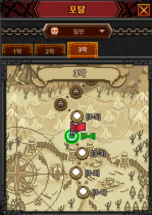

# 스테이지 진행 / 전투 결과 검증 기획서

> 상위 문서: [서버 시스템 전체 개요](../서버-시스템-전체-개요.md) · 관련 도메인 4.6
>
> 본 문서는 플레이어의 **스테이지 진입·클리어**와 **클리어 보상 지급**을 서버 권위로 처리하는 규칙을 다룬다. 진행도 저장은 [세이브 데이터 기획서](save-data-기획서.md)(`game_player`·`player_character`), 스테이지·보상·몬스터 정적 정의는 [마스터 데이터 기획서](master-data/master-data-기획서.md)(`stage_master`·`stage_reward`·`monster_master`)를 참고한다. 아이템 적재·재화 반영은 [인벤토리/아이템/큐브 기획서](inventory-item-cube-기획서.md)의 규칙을 따른다.

## 목차

- [1. 개요](#1-개요)
- [2. 기능 설명](#2-기능-설명)
- [3. 요구사항](#3-요구사항)
- [4. 데이터 모델](#4-데이터-모델)
- [5. API 명세](#5-api-명세)
  - [5.1 스테이지 진입 — `POST /api/game/stage/enter`](#51-스테이지-진입--post-apigamestageenter)
  - [5.2 스테이지 클리어 — `POST /api/game/stage/clear`](#52-스테이지-클리어--post-apigamestageclear)
- [6. 처리 흐름](#6-처리-흐름)
- [7. 에러 코드](#7-에러-코드)
- [8. 미결 사항 / TODO](#8-미결-사항--todo)
- [9. 참고](#9-참고)


## 1. 개요

- **목적**: 방치형 자동 전투의 결과(스테이지 클리어)를 **서버가 검증·확정**하고, 그에 대응하는 보상(골드·경험치·전리품)을 지급한다. 진행도·보상은 전투력·경제에 직결되는 이득이므로 **서버가 마스터 데이터로 최종 확정**하며, 클라이언트가 보고한 클리어·전리품을 그대로 신뢰하지 않는다.
- **대상 서버**: `GameServer`(스테이지 진행·클리어 검증·보상 반영), `TaskbarHero.Common`(스테이지·전투 결과 DTO·에러 코드 공유). 인증은 AccountServer 발급 토큰을 GameServer 미들웨어가 검증.
- **범위 경계**:
  - **전투 시뮬레이션 자체**(데미지 계산·몬스터 AI)는 클라이언트 자동 전투가 담당한다. 서버는 전투를 재현하지 않고, **클리어 요청의 타당성(진입 여부·스킵 금지·플레이 시간 등)** 을 검증한 뒤 **보상만 서버 권위로 산출**한다.
  - **오프라인 진행 보상**은 본 문서 밖이다([오프라인 보상 정산 기획서](offline-reward-기획서.md), 도메인 4.3). 본 문서는 **온라인(접속 중) 스테이지 클리어**를 다룬다.
  - **드롭된 아이템의 인벤토리 적재 규칙**(스택·용량)은 [인벤토리/아이템/큐브 기획서](inventory-item-cube-기획서.md)를 따른다. 본 문서는 드롭 **산출**까지 책임진다.
- **관련 기획서**: [[save-data-기획서]] (진행도 저장), [[master-data-기획서]] (스테이지·몬스터·드롭 정의), [[inventory-item-cube-기획서]] (전리품 적재), [[offline-reward-기획서]] (오프라인 진행), [[growth-기획서]] (경험치→레벨), [[서버-시스템-전체-개요]] (도메인 4.6)

## 2. 기능 설명

- **스테이지 구조**: 5 Act × 2 난이도 × 3 스테이지(=30)([마스터 데이터 기획서](master-data/master-data-기획서.md) `stage_master`). 각 Act·난이도는 스테이지 1~2 일반, 스테이지 3 보스다. 파티(3인)가 함께 하나의 스테이지를 진행한다. 진행도(현재 act/stage/difficulty)는 **계정/파티 단위**다.
- **스테이지 진입**: 플레이어가 특정 스테이지에 진입해 자동 전투를 시작한다. 아직 도달하지 못한 스테이지(앞 스테이지 미클리어)로는 **건너뛸 수 없다**. 이미 클리어한 스테이지는 **재파밍**을 위해 다시 진입할 수 있다(하드월 없음, [개요](../서버-시스템-전체-개요.md) 3장).
- **스테이지 클리어**: 자동 전투로 스테이지를 클리어하면 클라이언트가 서버에 클리어를 알린다. 서버는 타당성을 검증하고 **해당 스테이지의 보상(골드·경험치·드롭)을 산출·지급**하며, 최고 도달 스테이지(`max_stage_cleared`)와 현재 진행도를 갱신한다.
- **보상**: `stage_reward`가 정의한 **골드·경험치**와 **등급별 아이템 드롭 확률**로 서버가 보상을 산출한다(스테이지 단위 일원화, 몬스터 개별 드롭 없음). 경험치는 오프라인 보상과 동일하게 **파티에 편성된 캐릭터(`player_character.slot`≠0) 모두에게 같은 값**으로 지급한다(미편성 캐릭터는 전투에 참가하지 않으므로 받지 않는다)([오프라인 보상 정산 기획서](offline-reward-기획서.md)와 동일 원칙).

## 3. 요구사항

**기능 요구사항**
- 스테이지 진입 요청과 클리어 요청을 각각 처리한다. 진입은 진행 가능 여부를 검증하고, 클리어는 보상을 산출·지급한다.
- 클리어 보상(골드·경험치·전리품)은 전적으로 **서버가 마스터 데이터로 산출**한다(클라이언트 보고 불신). 드롭은 `stage_reward`의 **등급별 확률**로 서버가 추첨한다.
- 진행도(`act`/`stage`/`difficulty`/`max_stage_cleared`)와 경험치·레벨·재화·인벤토리 변경을 그 클리어 요청의 트랜잭션에서 반영한다(별도 일괄 저장 없음, [세이브 데이터 기획서](save-data-기획서.md) 4장).
- 아직 도달 못 한 스테이지 진입·클리어(스킵)를 거부한다.

**비기능 요구사항**
- **서버 권위**: 클리어 여부의 최종 판정과 보상 산출은 서버가 한다. 클라이언트는 "이 스테이지를 클리어했다"는 신호만 보내고, 무엇을 얼마나 받을지는 서버가 정한다.
- **원자성**: "진행도 갱신 + 골드/경험치 지급 + 전리품 적재"는 하나의 `user_id` 단위 트랜잭션으로 처리한다. 중도 실패 시 전체 롤백.
- **치트 방지(플레이 검증)**: 서버는 전투를 재현하지 않으므로, ①진입한 스테이지와 클리어 대상 일치, ②앞 스테이지 미클리어 스킵 금지, ③진입~클리어 최소 소요 시간(플레이 타당성) 등을 검증한다. 검증 강도·수치는 8장 미결.
- **동시성**: 동일 계정 단일 세션 정책으로 경합은 제한적이나, 진행도 행(`game_player`)에 잠금을 걸어 중복 클리어 보상 지급을 막는다.

## 4. 데이터 모델

새 영속 테이블을 요구하지 않으며, 기존 세이브 테이블을 사용한다.

| 테이블 | 본 도메인에서의 역할 | 참조 마스터 |
|---|---|---|
| `game_player`(`act`, `stage`, `difficulty`, `max_stage_cleared`) | 파티 현재 진행도·최고 도달 스테이지 | `stage_master` |
| `player_character`(`exp`, `level`) | 클리어 경험치 반영(파티 편성 캐릭터 동일) | `level_master` |
| `player_item`(재화 행 `row_type=2`) | 클리어 골드 반영(`quantity` UPDATE, 계정 공유) | `item_master`(재화 `item_type=3`) |
| `player_item` | 전리품(아이템·재료) 적재(계정 공유) | `item_master`·`stage_reward` |

- **현재 진입 스테이지**: 별도 컬럼을 두지 않고 `game_player.act`/`stage`/`difficulty`가 **현재 진입(진행 중) 스테이지**를 나타낸다. 진입 요청이 이 값을 설정하고, 클리어 요청이 이 값을 기준으로 검증·전진한다.
- **진입 시각(플레이 검증용, 제안·미결)**: 진입~클리어 최소 소요 시간을 검증하려면 진입 시각이 필요하다. `game_player.stage_entered_at`(bigint) 추가를 **제안**한다(검증 도입 확정 시 [세이브 데이터 기획서](save-data-기획서.md) ERD 반영). 8장 미결.

**공유 enum / DTO (TaskbarHero.Common)**
- 클리어 결과 DTO(획득 골드·경험치·전리품·갱신 진행도)는 `TaskbarHero.Common`에 공유 DTO로 두는 것을 **제안**한다. 필드는 5.2 응답 스키마를 따른다.

## 5. API 명세

**API 목록**

- [5.1 스테이지 진입 — `POST /api/game/stage/enter`](#51-스테이지-진입--post-apigamestageenter)
- [5.2 스테이지 클리어 — `POST /api/game/stage/clear`](#52-스테이지-클리어--post-apigamestageclear)

Base URL(개발): `http://localhost:5247` (GameServer). 모든 API는 **POST**, 인증 요청 공통 형식 `{ userId, token, data }`, 응답 `{ success, errorCode, message, data }`([세이브 데이터 기획서](save-data-기획서.md) 5장과 동일 규약). 조회(현재 진행도)는 `POST /api/game/load` 스냅샷을 사용한다.

### 5.1 스테이지 진입 — `POST /api/game/stage/enter`

지정 스테이지에 진입해 자동 전투를 시작한다. 진입 가능 여부(도달·해금)를 서버가 검증하고, 진행 중 스테이지를 그 값으로 설정한다. **보상은 없다.**

클라이언트는 포탈(스테이지 이동) 메뉴에서 이동할 Act·난이도·스테이지를 선택해 진입 요청을 보낸다.




**Request**
```json
{ "userId": 1, "token": "...", "data": { "act": 2, "difficulty": 1, "stage": 15 } }
```

- 진입 조건: 대상 스테이지가 `stage_master`에 존재하고, **이미 도달 가능한 범위**여야 한다(직전 스테이지까지 클리어했거나 이미 클리어한 스테이지의 재파밍). 앞 스테이지를 건너뛴 진입은 거부한다.

**Response (성공, 200 OK)**
```json
{
  "success": true,
  "errorCode": 0,
  "message": "Stage entered",
  "data": {
    "act": 2,
    "difficulty": 1,
    "stage": 15,
    "stageId": 1020015,
    "monsters": [
      { "monsterCode": 9001, "count": 8 },
      { "monsterCode": 9010, "count": 3 }
    ],
    "boss": { "monsterCode": 9099 },
    "backgroundType": 3,
    "enteredAt": 1752343200
  }
}
```

- `stageId`: `stage_master` 키.
- `monsters`: 이 스테이지에 등장하는 **일반 몬스터와 등장 수량** 목록(`monsterCode`·`count`). `boss`: **스테이지 보스 몬스터**(보스가 없는 스테이지면 `null`).
- `backgroundType`: 스테이지 **배경 타입(1~5)**. `stage_master.background_type`을 그대로 내려주며, 클라이언트가 이 코드로 배경 아트를 선택한다([마스터 데이터 기획서](master-data/master-data-기획서.md) `stage_master` 5.9).


- 스폰 구성(어떤 몬스터가 몇 마리, 보스는 누구인지)은 `stage_master`가 정의하고, 각 몬스터의 스탯은 `monster_master`를 참조한다([마스터 데이터 기획서](master-data/master-data-기획서.md) `stage_master` 5.9·`monster_master` 5.8).
- 오류: `StageNotFound(6001)`(마스터에 없는 스테이지), `StageLocked(6002)`(아직 도달 못 한 스테이지 스킵).

### 5.2 스테이지 클리어 — `POST /api/game/stage/clear`

현재 진입한 스테이지를 클리어했음을 서버에 알린다. 서버가 타당성을 검증한 뒤 **보상을 산출·지급**하고 진행도를 갱신한다.

**Request**
```json
{ "userId": 1, "token": "...", "data": { "act": 2, "difficulty": 1, "stage": 15 } }
```

- 요청의 스테이지는 **현재 진입 스테이지와 일치**해야 한다(서버가 `game_player` 기준으로 대조).

**Response (성공, 200 OK)**
```json
{
  "success": true,
  "errorCode": 0,
  "message": "Stage cleared",
  "data": {
    "cleared": { "act": 2, "difficulty": 1, "stage": 15 },
    "rewards": {
      "gold": 1200,
      "exp": 600,
      "items": [ { "itemCode": 41001, "quantity": 2 }, { "itemCode": 30012, "quantity": 1 } ]
    },
    "characters": [
      { "characterId": 1, "level": 42, "exp": 129100, "isLevelUp": false },
      { "characterId": 2, "level": 41, "exp": 600, "isLevelUp": true },
      { "characterId": 3, "level": 38, "exp": 60600, "isLevelUp": false }
    ],
    "balance": [ { "currencyType": 1, "amount": 9876621 } ],
    "progress": { "act": 2, "difficulty": 1, "stage": 16, "maxStageCleared": 215 }
  }
}
```

- `rewards.gold`/`exp`는 `stage_reward`의 골드·경험치, `rewards.items`는 `stage_reward`의 **등급별 확률로 서버가 추첨한** 전리품이다. `exp`는 **파티에 편성된 캐릭터 모두에게 동일** 적용되어 `characters`에 반영 후 값이 담긴다(미편성 캐릭터는 제외).
- `characters[].isLevelUp`: 이번 클리어 경험치로 **그 캐릭터가 레벨업 했는지** 여부(`true`/`false`). 같은 `exp`를 받아도 캐릭터마다 시작 레벨·잔여 경험치가 달라 일부만 레벨업할 수 있다.
- `progress`: 갱신된 진행도. 프런티어(최고 도달) 스테이지를 클리어했으면 `stage`가 다음으로 전진하고 `maxStageCleared`가 증가한다. **재파밍**(이미 클리어한 스테이지)일 경우 보상만 지급되고 `maxStageCleared`는 그대로다. 재파밍 보상은 **프런티어와 동일**(골드·경험치·드롭 확률 감산 없음, 8장 확정).
- 오류: `StageNotEntered(6003)`(진입하지 않았거나 현재 진입 스테이지와 불일치), `StageClearTooFast(6004)`(최소 소요 시간 미충족, 임계값 8장 미결), 전리품이 인벤토리 용량을 초과하면 `InventoryFull(4002)`.

> 인증 오류(401), 마스터에 없는 코드 요청 등은 기존 미들웨어·`InvalidSaveData(2002)`/마스터 도메인 코드를 따른다.

## 6. 처리 흐름

### 6.1 스테이지 진입 (의사코드)

```
요청 수신 → 토큰 검증(미들웨어)
  1) st = stage_master[act, difficulty, stage]      # 없으면 StageNotFound(6001)
  2) 도달 검증: 대상이 max_stage_cleared 범위 내이거나 (프런티어+1)인가?
     아니면 StageLocked(6002)   # 앞 스테이지 미클리어 스킵 금지
  3) game_player.(act,difficulty,stage) = 대상; stage_entered_at = now(제안)
COMMIT → { act, difficulty, stage, stageId, enteredAt }
```

### 6.2 스테이지 클리어 (의사코드)

```
트랜잭션(BEGIN, user_id 잠금)
  1) 요청 스테이지가 game_player 현재 진입 스테이지와 일치?  아니면 StageNotEntered(6003)
  2) (플레이 검증) now - stage_entered_at >= MIN_CLEAR_SEC ?  아니면 StageClearTooFast(6004)  # 임계값 미결
  3) sr = stage_reward[현재 stage_id]
     gold = sr.reward_gold; exp = sr.reward_exp
     items = rollGradeDrop(stage_reward_drop[stage_id])   # 등급별 drop_prob로 추첨 → 해당 등급 item_master 아이템 1개(서버 RNG)
  4) 지급: player_item(재화, item_code=골드).quantity += gold
           for c in player_character(slot≠0): c.exp += exp → level 재계산   # 파티 편성 캐릭터 동일
           items를 player_item에 적재(스택/용량 규칙; 초과 시 InventoryFull(4002))
  5) 진행도: 프런티어 클리어면 stage 전진(act/difficulty 롤오버) + max_stage_cleared 갱신
             재파밍이면 보상만, 진행도 유지
COMMIT → { cleared, rewards, characters, balance, progress }
```

### 6.3 예외 / 엣지 케이스

- **스킵 진입/클리어**: 도달하지 못한 스테이지는 `StageLocked(6002)`(진입)·`StageNotEntered(6003)`(클리어 불일치)로 거부.
- **비정상적으로 빠른 클리어**: 진입~클리어 최소 시간 미만이면 `StageClearTooFast(6004)`. 임계값·도입 여부는 8장 미결.
- **전리품 용량 초과**: `stack_max`까지 채우고 초과분은 새 행 분할, 적재할 공간이 없으면 클리어를 `InventoryFull(4002)`로 **거부**하고 트랜잭션 전체를 롤백한다(골드·경험치·전리품 모두 미반영). 초과 전리품은 **지급하지 않으며**(폐기, 메일 대체 없음, 8장 확정) 플레이어가 인벤토리를 정리한 뒤 재시도한다.
- **동시 중복 클리어 요청**: `game_player` 행 잠금으로 직렬화해 같은 스테이지 보상 이중 지급 방지.
- **Act/난이도 롤오버**: 한 Act·난이도의 마지막 스테이지 클리어 시 다음 Act/난이도로 넘어간다(전진 순서 상세는 8장 미결). **최종 스테이지**(마지막 Act·난이도의 보스 스테이지)를 클리어하면 다음이 없으므로 **그 최종 스테이지에 머물며 계속 재파밍**한다(8장 확정).

## 7. 에러 코드

`TaskbarHero.Common`의 `ErrorCode`에 추가 제안. 도메인 4.6(스테이지/전투)은 **6000번대**를 사용한다([통합 정의](../공통/error-code-정의.md) 블록 규약, 도메인 4.N → N000). 추가 시 통합 문서도 함께 갱신한다.

| 이름 | 값 | 의미 |
|---|---|---|
| StageNotFound | 6001 | 스테이지가 마스터에 없음 |
| StageLocked | 6002 | 아직 도달하지 못한 스테이지(스킵 진입 불가) |
| StageNotEntered | 6003 | 진입하지 않았거나 현재 진입 스테이지와 불일치 |
| StageClearTooFast | 6004 | 최소 소요 시간 미충족(플레이 타당성 검증) |

- 전리품이 인벤토리 용량을 초과하면 신규 코드를 만들지 않고 `InventoryFull(4002)`([인벤토리/아이템/큐브 기획서](inventory-item-cube-기획서.md) 7장)를 재사용한다.

## 8. 미결 사항 / TODO

- **플레이 타당성 검증(백로그로 이동)**: 진입~클리어 최소 소요 시간(`MIN_CLEAR_SEC`)·진입 시각 저장(`game_player.stage_entered_at`)·`StageClearTooFast(6004)` 검증은 **현재 스테이지 작업 범위에서 제외**하고 일정 미편성 백로그로 이관했다(README 「미편성 백로그」, fix 작업 조기 완료 시 착수). `6004`는 예약 코드로 유지한다.
- **보상 수치·드롭 확률**: `stage_reward`의 `reward_gold`/`reward_exp`·등급별 확률 실제 값(밸런스). → [마스터 데이터 값](master-data/master-data-값.md) §10.
- **경험치 곡선 연계**: 레벨업·스킬 포인트 파생은 [성장 시스템 기획서](growth-기획서.md)·`level_master`를 따른다.

**확정 사항**

- **재파밍 보상(확정)**: 이미 클리어한 스테이지 재파밍 시 보상(골드·경험치·드롭 확률)을 **프런티어와 동일하게** 지급한다(감산 없음). → 본문 5.2.
- **전리품 용량 초과 처리(확정)**: 인벤토리가 가득 차 전리품을 적재할 수 없으면 **지급하지 않는다**(폐기, 메일 대체 없음). 이 경우 클리어를 `InventoryFull(4002)`로 거부하고 트랜잭션 전체를 롤백하며, 플레이어가 인벤토리를 정리한 뒤 재시도한다. → 본문 6.3.
- **최종 스테이지 이후 처리(확정)**: 마지막 스테이지(최종 Act·난이도의 보스 스테이지)를 클리어하면 다음 진행처가 없으므로 진행도를 전진시키지 않고 **그 최종 스테이지에 머물며 계속 재파밍**한다. → 본문 6.3.
- **Act·난이도 전진 순서(확정)**: **난이도-바깥** 순서를 채택한다 — Normal(난이도1)에서 Act1~5(각 3스테이지)을 모두 클리어하면 Hard(난이도2)가 열린다(`sequence = (difficulty-1)×15 + (act-1)×3 + stage`, 1~30). 현행 `StageCoords` 구현 그대로.
- **클리어 판정(확정·서버 범위 외)**: 한 스테이지의 클리어 판정(몬스터 전멸/보스 처치)은 **클라이언트 자동 전투가 판단해 클리어를 요청**한다. 서버는 전투를 재현하지 않고 진입 일치·스킵 금지만 검증한다(범위 경계 §1). 따라서 서버 미결 항목에서 제외한다.

## 9. 참고

- [서버 시스템 전체 개요](../서버-시스템-전체-개요.md) — 도메인 4.6(스테이지/전투), 4.3(오프라인)
- [세이브 데이터 기획서](save-data-기획서.md) — `game_player`(진행도)·`player_character`(경험치) 저장, 액션 단위 저장
- [마스터 데이터 기획서](master-data/master-data-기획서.md) — `stage_master`·`stage_reward`·`monster_master`·`level_master`
- [인벤토리/아이템/큐브 기획서](inventory-item-cube-기획서.md) — 전리품 적재·`InventoryFull(4002)`
- [오프라인 보상 정산 기획서](offline-reward-기획서.md) — 오프라인 진행(경험치를 파티 편성 캐릭터에 동일 지급하는 원칙 공유)
- [ErrorCode 통합 정의](../공통/error-code-정의.md) — 에러 코드 블록 규약(6000번대 스테이지/전투)
