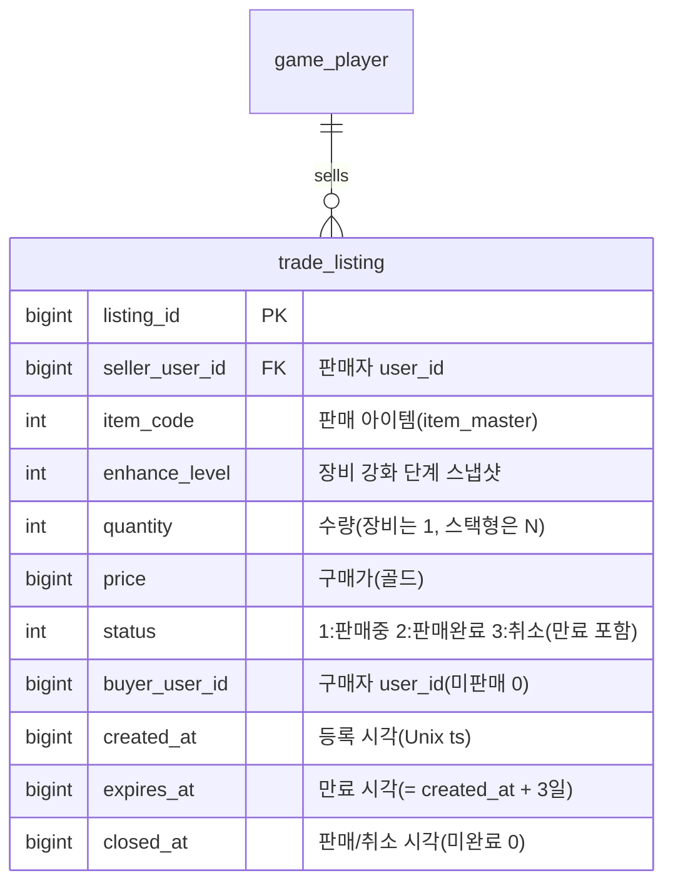

# 거래소 / 교역선(Trade Ship) 기획서

> 상위 문서: [서버 시스템 전체 개요](../서버-시스템-전체-개요.md) · 관련 도메인 4.7(필수)
>
> 본 문서는 원작의 스팀 마켓을 대체하는 **플레이어 간 아이템 거래소**를 서버 권위로 다룬다. 아이템을 팔면 그 대가가 **게임 머니(골드)** 로 판매자에게 들어온다(실물 화폐 연동 없음). 판매 대금은 [메일(4.8)](mail-기획서.md)로 지급한다.

## 목차

- [1. 개요](#1-개요)
- [2. 기능 설명](#2-기능-설명)
- [3. 요구사항](#3-요구사항)
- [4. 데이터 모델](#4-데이터-모델)
- [5. API 명세](#5-api-명세)
  - [5.1 거래소 목록 조회 — `POST /api/game/trade/list`](#51-거래소-목록-조회--post-apigametradelist)
  - [5.2 판매 등록 — `POST /api/game/trade/register`](#52-판매-등록--post-apigametraderegister)
  - [5.3 구매 — `POST /api/game/trade/buy`](#53-구매--post-apigametradebuy)
  - [5.4 판매 취소 — `POST /api/game/trade/cancel`](#54-판매-취소--post-apigametradecancel)
- [6. 처리 흐름](#6-처리-흐름)
- [7. 성능 설계](#7-성능-설계)
  - [7.1 병목은 어디인가](#71-병목은-어디인가)
  - [7.2 MySQL 색인과 조건부 갱신](#72-mysql-색인과-조건부-갱신)
  - [7.3 Redis 목록 캐시](#73-redis-목록-캐시)
  - [7.4 Redis 구매 락](#74-redis-구매-락)
  - [7.5 Redis 장애와 캐시 불일치](#75-redis-장애와-캐시-불일치)
  - [7.6 만료 배치](#76-만료-배치)
  - [7.7 하지 않는 것](#77-하지-않는-것)
- [8. 에러 코드](#8-에러-코드)
- [9. 미결 사항 / TODO](#9-미결-사항--todo)
- [10. 참고](#10-참고)


## 1. 개요

- **목적**: 플레이어가 획득한 장비·재료를 다른 플레이어에게 **골드로 판매/구매**할 수 있게 한다. 원작은 스팀 마켓에 팔아 실제 지갑 자금을 얻었으나, 본 모작은 **인게임 골드**로만 정산한다. 아이템은 실질 가치를 가지므로 **소유권 이전과 골드 정산을 하나의 트랜잭션**으로 처리해 아이템 복제·이중 판매·재화 유실을 원천 차단한다.
- **대상 서버**: `GameServer`(거래소 등록·조회·구매·취소, 정산), `TaskbarHero.Common`(거래 목록·결과 DTO·에러 코드 공유). 인증은 AccountServer 발급 토큰을 GameServer 미들웨어가 검증.
- **범위 경계**:
  - **아이템의 인벤토리 적재·소유 규칙**은 [인벤토리/아이템/큐브 기획서](inventory-item-cube-기획서.md)(`player_item`)를 따른다. 본 문서는 거래소 등록↔인벤토리 간 이동을 다룬다.
  - **판매 대금 지급**은 [메일(4.8)](mail-기획서.md) 발급으로 위임한다(판매자가 오프라인일 수 있으므로 우편함으로 지급).
  - **실물 화폐·유료 결제는 범위 밖**이다.
- **관련 기획서**: [[inventory-item-cube-기획서]] (아이템 소유·`player_item`·`sellable`), [[mail-기획서]] (판매 대금 메일 발급), [[save-data-기획서]] (거래 등록 저장), [[서버-시스템-전체-개요]] (도메인 4.7)


## 2. 기능 설명

- **판매 등록**: 판매자가 인벤토리의 판매 가능(`item_master.sellable=1`, 미장착) 아이템을 **골드 가격을 정해 등록**한다. 등록된 아이템은 인벤토리에서 빠져 **거래소 보관(에스크로)** 상태가 된다(중복 판매·복제 방지).

  **판매 등록 제약 조건 요약** — 등록 요청은 아래 제약을 모두 통과해야 성립한다(상세 검증 순서는 [6.2](#62-등록--취소--만료)).

  | 제약 | 규칙 | 위반 시 |
  |---|---|---|
  | 소유 확인 | 본인 인벤토리(`player_item`)에 존재하는 아이템만 등록 가능 | `ItemNotFound(4001)` |
  | 판매 가능 여부 | `item_master.sellable=1`인 아이템만 등록 가능 | `TradeNotSellable(7002)` |
  | 장착 상태 | 장착 중인 장비는 등록 불가 | `ItemEquipped(4007)` |
  | 등록 가격 | `item_master.base_price`의 **±20%**(`×0.8 ~ ×1.2`) 범위 | `TradePriceOutOfRange(7006)` |
  | 동시 등록 수 | 계정당 판매중 등록 **최대 10개** | `TradeListingLimitExceeded(7007)` |
  | 수량 | 장비는 1개, 스택형은 해당 행 **전체 수량**(부분 판매 없음) | 수량 지정 자체를 받지 않음(요청 필드 없음) |
  | 판매 기간 | 등록 후 **3일**(`expires_at = created_at + 3일`)만 판매중 유지 | 만료 시 **유찰 처리** — 자동 취소(`status=3`) 후 아이템을 판매자에게 메일 반송(메일 만료 7일, [6.2](#62-등록--취소--만료)) |
  | 에스크로 | 등록 즉시 인벤토리에서 제거되어 거래소 보관 상태가 됨 | 등록 중 아이템의 장착·분해·재등록은 대상이 없어 `ItemNotFound(4001)` |
- **거래소 목록 조회**: 구매자가 판매 중인 등록을 조회한다(**아이템 코드 검색 + 서버 페이징**).
- **구매**: 구매자가 골드를 지불하면 **아이템이 구매자 인벤토리로 이전**되고, **판매 대금(수수료 차감 후)이 판매자에게 메일로 지급**된다. 자기 등록은 구매할 수 없다.
- **판매 취소**: 판매자가 판매 중인 자기 등록을 취소하면 **아이템이 인벤토리로 복귀**한다.

> 방치형 특성상 판매자·구매자가 동시 접속 상태가 아닐 수 있다. 구매자는 요청 시점에 온라인이므로 아이템을 **인벤토리로 즉시** 받고, 판매자는 오프라인일 수 있으므로 대금을 **메일로** 받는다.


## 3. 요구사항

**기능 요구사항**
- 판매 등록, 목록 조회, 구매, 판매 취소를 제공한다.
- 등록 시 아이템은 인벤토리에서 제거되어 거래소 보관 상태가 된다(에스크로). 취소/미판매 시 인벤토리로 복귀한다.
- 구매 시 **골드 차감(구매자) + 아이템 지급(구매자) + 등록 완료 처리 + 판매 대금 메일 발급(판매자)** 을 **하나의 트랜잭션**으로 반영한다.
- 판매 대금은 **판매가에서 거래 수수료(20%)를 뺀 금액**(판매가의 80%)이며, 판매자에게 메일(`category=2` 거래)로 지급한다.
- 판매 불가 아이템(`sellable=0`)·장착 중 아이템은 등록을 거부한다.
- 등록 가격은 **아이템 기준가(`item_master.base_price`)의 ±20%**(`base_price×0.8 ~ ×1.2`) 범위여야 하며, 범위 밖이면 거부한다.
- 등록 **유효기간은 3일**이다. 만료되면 자동 취소되어 아이템을 판매자에게 **메일로 반송**한다.
- **스택형 아이템(재료 등)은 전체 수량만** 등록·판매한다(부분 판매 없음).
- 판매 대금·반송 아이템 **메일의 만료는 7일**이다.
- 계정당 **동시 등록(판매중)은 최대 10개**이며, 초과 시 등록을 거부한다.
- 목록 조회 **검색은 아이템 코드**로 한다(클라이언트가 이름 검색 후 `itemCode`로 변환해 전송). 서버가 페이징을 지원한다.

**비기능 요구사항**
- **서버 권위**: 가격·소유권·정산은 서버가 확정한다. 클라이언트가 보고한 가격/소유를 신뢰하지 않는다.
- **원자성·경합 안전**: 동시 구매는 **Redis 락으로 1차 차단**하고([7.4](#74-redis-구매-락)), 대상 `trade_listing` 행을 **조건부 갱신(판매중일 때만 전이)으로 선점**해 최종 직렬화한다([7.2](#72-mysql-색인과-조건부-갱신)). 두 구매자가 동시에 같은 등록을 사면 **한 명만 성공**하고 나머지는 거부한다(이중 판매·복제 방지). 골드 차감과 아이템 이전은 전부 성공하거나 전부 롤백한다.
- **멱등성**: 이미 판매/취소된 등록에 대한 재요청은 거부한다.
- **조회 성능**: 목록 조회는 이 프로젝트에서 **유일한 전역 공유 읽기**다. **Redis 목록 캐시를 상시 사용**해 응답하고([7.3](#73-redis-목록-캐시)), MySQL 색인이 캐시 미스·장애 시 폴백 경로를 커버한다. 캐시는 **파생 데이터**이며 정합성 판정은 항상 MySQL에서 한다.
- **가용성**: Redis를 상시 사용하되 **단일 장애점으로 두지 않는다**. 장애 시 목록 조회는 MySQL 폴백, 구매는 락 없이 조건부 갱신으로 계속 동작한다(성능 저하는 허용, 기능 중단은 불허 — [7.5](#75-redis-장애와-캐시-불일치)).
- **응답 크기 제어**: 목록 조회의 `pageSize`는 서버가 상한을 강제해 과대 응답을 방어한다(기본 50·상한 100, [7.2](#72-mysql-색인과-조건부-갱신)).

## 4. 데이터 모델

**새 세이브 테이블 1개**(`trade_listing`)를 요구한다. 아이템·재화 이동은 기존 `player_item`, 대금 지급은 기존 메일 테이블(`player_mail`·`player_mail_reward`)을 재사용한다.



| 테이블 | 역할 | 참조 |
|---|---|---|
| `trade_listing`(`listing_id` PK + 조회·정렬·만료 색인 4종 → [7.2](#72-mysql-색인과-조건부-갱신)) | 거래소 등록 1건(에스크로 보관 아이템 스냅샷 포함) | `item_master`(`item_code`), `game_player`(`seller_user_id`/`buyer_user_id`) |

- **Redis(상시 사용)**: 새로 요구되는 **영속 테이블은 `trade_listing` 하나뿐**이다. Redis에는 목록 캐시 키 2종([7.3](#73-redis-목록-캐시))과 구매 락 키 1종([7.4](#74-redis-구매-락))을 두며, 모두 언제든 MySQL에서 다시 만들 수 있거나 TTL로 사라지는 **파생 데이터**다(영속 데이터를 Redis에만 두지 않는다).

- **에스크로 방식(확정)**: 등록 시 판매 아이템 행을 판매자 `player_item`에서 **제거**하고, 그 스냅샷(`item_code`·`enhance_level`·`quantity`)을 `trade_listing`에 담는다. 구매 시 구매자 `player_item`에 새 행으로 생성, 취소 시 판매자 `player_item`에 복원한다. 아이템이 "등록 중"이면서 인벤토리에도 존재하는 모호한 상태를 없애고, 등록 중 아이템의 장착·분해·재등록을 원천 차단한다.
- **상태(`status`)**: `1:판매중`만 목록/구매 대상이다. `2:판매완료`·`3:취소`(만료 자동 취소 포함)는 **이력으로 보관**하며, 본 프로젝트에서는 별도 정리(GC)를 하지 않는다.
- **가격·수수료(확정)**: 등록 가격 `price`는 **`item_master.base_price`의 ±20%**(`base_price×0.8 ~ ×1.2`) 범위여야 한다. 구매자는 `price` 전액을 내고, **수수료 20%**를 뗀 **판매가의 80%**가 판매자에게 지급된다. 골드는 `player_item` 재화 행(`row_type=2`, 골드 `item_code=1`, [인벤토리/아이템/큐브 기획서](inventory-item-cube-기획서.md))에서 차감/메일 지급된다.
- **유효기간(확정)**: 등록은 생성 후 **3일**(`expires_at = created_at + 3일`)에 만료된다. 만료된 등록은 자동 취소(`status=3`)되어 아이템을 판매자에게 **메일로 반송**한다(6.2). 판매 대금·반송 메일의 만료는 **7일**이다.

**공유 enum / DTO (TaskbarHero.Common)**
- `status`(1:판매중 2:판매완료 3:취소) 등 분류 코드는 `TaskbarHero.Common`에 enum으로 고정한다(값 변경 금지).
- 거래 목록·결과 DTO는 `TaskbarHero.Common`에 공유 DTO로 두는 것을 **제안**한다(5장 응답 스키마).

## 5. API 명세

**API 목록**

- [5.1 거래소 목록 조회 — `POST /api/game/trade/list`](#51-거래소-목록-조회--post-apigametradelist)
- [5.2 판매 등록 — `POST /api/game/trade/register`](#52-판매-등록--post-apigametraderegister)
- [5.3 구매 — `POST /api/game/trade/buy`](#53-구매--post-apigametradebuy)
- [5.4 판매 취소 — `POST /api/game/trade/cancel`](#54-판매-취소--post-apigametradecancel)

Base URL(개발): `http://localhost:5247` (GameServer). 모든 API는 **POST**, 인증 요청 공통 형식 `{ userId, token, data }`, 응답 `{ success, errorCode, message, data }`([세이브 데이터 기획서](save-data-기획서.md) 5장과 동일 규약).

### 5.1 거래소 목록 조회 — `POST /api/game/trade/list`

판매 중(`status=1`)인 등록을 조회한다. 조회는 상태를 바꾸지 않는다.


**Request**
```json
{ "userId": 1, "token": "...", "data": { "itemCode": 30012, "page": 0, "pageSize": 50 } }
```

- **검색은 아이템 코드**로 한다. 클라이언트가 이름 검색 UI에서 고른 아이템을 `itemCode`로 변환해 보낸다(`itemCode=0` 또는 생략이면 전체). 서버가 `page`/`pageSize`로 페이징한다. 기본 정렬은 **가격 오름차순**이며 별도 정렬 옵션은 두지 않는다.

**Response (성공, 200 OK)**
```json
{
  "success": true,
  "errorCode": 0,
  "message": "OK",
  "data": {
    "listings": [
      { "listingId": 88001, "itemCode": 30012, "enhanceLevel": 3, "quantity": 1, "price": 50000, "sellerUserId": 42, "createdAt": 1752300000 }
    ],
    "page": 0,
    "pageSize": 50,
    "hasMore": true
  }
}
```

- 아이템의 이름·스탯·등급은 클라이언트가 `item_code`로 마스터 데이터에서 조회해 표시한다([마스터 데이터 기획서](master-data/master-data-기획서.md)).

### 5.2 판매 등록 — `POST /api/game/trade/register`

인벤토리 아이템을 거래소에 등록한다. 서버가 아이템을 인벤토리에서 빼 에스크로로 옮긴다.

**Request**
```json
{ "userId": 1, "token": "...", "data": { "itemId": 5001, "price": 50000 } }
```

- `itemId`: 등록할 아이템(`player_item.player_item_id`). `price`: 판매가(골드). **`item_master.base_price`의 ±20% 범위**여야 한다. 스택형 아이템은 **해당 행의 전체 수량**이 등록되며 수량 지정은 받지 않는다(부분 판매 없음).

**Response (성공, 200 OK)**
```json
{ "success": true, "errorCode": 0, "message": "Registered", "data": { "listingId": 88001, "itemCode": 30012, "enhanceLevel": 3, "quantity": 1, "price": 50000 } }
```

- 오류: `ItemNotFound(4001)`(인벤토리에 없음), `ItemEquipped(4007)`(장착 중), `TradeNotSellable(7002)`(`sellable=0`), `TradePriceOutOfRange(7006)`(기준가 ±20% 범위 밖), `TradeListingLimitExceeded(7007)`(동시 등록 10개 초과), `InvalidSaveData(2002)`(형식 오류 등).

### 5.3 구매 — `POST /api/game/trade/buy`

지정 등록을 구매한다. 골드 차감·아이템 이전·판매 대금 메일 발급을 하나의 트랜잭션으로 처리한다.

**Request**
```json
{ "userId": 2, "token": "...", "data": { "listingId": 88001 } }
```

**Response (성공, 200 OK)**
```json
{
  "success": true,
  "errorCode": 0,
  "message": "Purchased",
  "data": {
    "listingId": 88001,
    "gained": { "items": [ { "itemCode": 30012, "enhanceLevel": 3, "quantity": 1 } ] },
    "cost": { "currencyType": 1, "amount": 50000 },
    "balance": [ { "currencyType": 1, "amount": 9825421 } ]
  }
}
```

- `gained`는 구매자 인벤토리에 들어온 아이템, `cost`/`balance`는 차감된 골드와 잔액이다. 판매 대금(수수료 차감 후)은 **판매자에게 메일로 지급**된다(구매자 응답에는 포함되지 않음).
- 오류: `TradeListingNotFound(7001)`(등록 없음), `TradeAlreadyClosed(7005)`(이미 판매/취소), `TradeSelfPurchase(7004)`(자기 등록), `InsufficientCurrency(4005)`(골드 부족), `InventoryFull(4002)`(구매자 인벤토리 초과).

### 5.4 판매 취소 — `POST /api/game/trade/cancel`

판매 중인 본인 등록을 취소하고 아이템을 인벤토리로 되돌린다.

**Request**
```json
{ "userId": 1, "token": "...", "data": { "listingId": 88001 } }
```

**Response (성공, 200 OK)**
```json
{ "success": true, "errorCode": 0, "message": "Cancelled", "data": { "listingId": 88001, "restored": { "itemCode": 30012, "enhanceLevel": 3, "quantity": 1 } } }
```

- 오류: `TradeListingNotFound(7001)`, `TradeNotOwner(7003)`(본인 등록 아님), `TradeAlreadyClosed(7005)`(이미 판매/취소), `InventoryFull(4002)`(복귀 시 인벤토리 초과).

> 인증 오류(401) 등은 기존 미들웨어를 따른다. 등록 만료(3일) 시 자동 취소·메일 반송은 6.2 참고. "내 판매 목록" 전용 조회는 현재 미제공(목록 조회로 대체).

## 6. 처리 흐름

### 6.1 구매 (의사코드)

```
요청 수신 → 토큰 검증(미들웨어)
Redis 구매 락 획득(trade:lock:listing:{listingId}, NX+TTL 3초)     # 1차 차단, 7.4
  재시도 후에도 실패 → TradeBusy(7008)                             # 다른 요청이 처리 중
트랜잭션(BEGIN)
  1) L = trade_listing[listingId]
     if 없음: TradeListingNotFound(7001)
     if L.status != 1(판매중): TradeAlreadyClosed(7005)
  2) if L.seller_user_id == 구매자: TradeSelfPurchase(7004)
  3) if 구매자 골드(player_item 재화 행) < L.price: InsufficientCurrency(4005)
  4) if 구매자 인벤토리 용량 초과 예상: InventoryFull(4002)
  5) 등록 선점(CAS): UPDATE trade_listing
       SET status=2, buyer_user_id=구매자, closed_at=now
       WHERE listing_id=? AND status=1
     if 반영 0행: ROLLBACK → TradeAlreadyClosed(7005)   # 동시 구매자가 먼저 선점
  6) 구매자 골드 -= L.price
     구매자 player_item에 아이템 생성(L.item_code, L.enhance_level, L.quantity, 빈 slot)
  7) 판매 대금 메일 발급(판매자):
       수령액 = floor(L.price × 0.8)                 # 수수료 20% 차감
       player_mail 적재(seller_user_id, category=2, "거래소 판매 대금", created_at=now, expires_at=now+7일, claimed=0)
       player_mail_reward 적재(mail_id, seq=1, reward_type=1(골드), reward_code=0, quantity=수령액)
COMMIT → 목록 캐시에서 해당 등록 제거(7.3) → 락 해제(자기 락일 때만) → { listingId, gained, cost, balance }
```

- **선점(5번)을 재화 이동보다 앞에 둔다.** 상태 전이를 먼저 확정하면, 나머지 단계는 이 트랜잭션이 유일한 승자임이 보장된 상태에서 진행된다(근거 [7.2](#72-mysql-색인과-조건부-갱신)).
- **Redis 락과 조건부 갱신을 함께 쓰는 이유**: 락은 몰린 요청을 DB 앞단에서 걸러내는 혼잡 제어이고, 조건부 갱신은 락 TTL 만료·Redis 장애 같은 경계에서도 한 번만 팔리게 하는 정합성 보증이다([7.4](#74-redis-구매-락)).

- 판매 대금은 판매자 계정에 **즉시 반영하지 않고** 메일로 발급한다(판매자 우편함 수령 시 반영, [메일 기획서](mail-기획서.md)). **수수료 20%** 분 골드는 **경제에서 소멸**(sink)한다. 대금 메일 만료는 **7일**.

### 6.2 등록 / 취소 / 만료

- **등록(5.2)**: `user_id` 잠금 → **동시 등록 수 확인**(판매중 등록 ≥ 10이면 `TradeListingLimitExceeded(7007)`) → 아이템 검증(존재·미장착·`sellable=1`) → **가격 검증**(`base_price×0.8 ≤ price ≤ base_price×1.2`, 위반 시 `TradePriceOutOfRange(7006)`) → `player_item`에서 제거(스택형은 전체 수량) → `trade_listing` 생성(status=1, `expires_at=now+3일`). 실패 시 전체 롤백.
- **취소(5.4)**: Redis 구매 락 획득([7.4](#74-redis-구매-락), 구매와 같은 키) → 본인·판매중 확인 → `player_item`에 아이템 복원 → 조건부 갱신으로 status=3 → 캐시에서 제거 → 락 해제. 인벤토리 용량 초과면 `InventoryFull(4002)`.
- **만료(자동, 배치)**: `status=1 AND expires_at < now`인 등록을 주기적으로 처리 → status=3(취소)로 닫고, 아이템을 판매자에게 **메일로 반송**(`category=2`, 첨부=반송 아이템, 만료 7일). 판매자가 오프라인·인벤토리 가득이어도 안전하게 반송하기 위해 취소(수동)와 달리 **메일 반송**을 사용한다. 실행 주기·처리 건수 제한은 [7.6](#76-만료-배치)에 정의한다.

### 6.3 예외 / 엣지 케이스

- **동시 구매 경합**: 같은 등록을 둘이 동시에 구매하면 **Redis 락에서 먼저 걸러진다** — 락을 못 잡은 쪽은 재시도 후 `TradeBusy(7008)`(재시도 가능). 락을 통과한 요청도 조건부 갱신으로 다시 판정되어, 이미 팔린 등록이면 `TradeAlreadyClosed(7005)`. 어느 경로로도 아이템 복제는 불가([7.4](#74-redis-구매-락)).
- **등록 후 원본 조작 시도**: 아이템이 이미 `player_item`에서 빠졌으므로 등록 중 아이템의 장착·분해·재등록은 대상이 없어 `ItemNotFound(4001)`.
- **구매자 인벤토리 가득**: 구매 아이템을 받을 칸이 없으면 `InventoryFull(4002)`, 거래는 미성립(골드 미차감).
- **자기 등록 구매**: `TradeSelfPurchase(7004)`로 거부(가격 조작·자전거래 방지).
- **판매 대금 메일 초과**: 대금은 골드이므로 인벤토리 용량과 무관하며, 메일 수령 시 재화 행 `quantity`에 가산된다.

## 7. 성능 설계

**세 줄 요약**

1. 부하가 몰리는 지점은 둘이다 — **목록 조회**(모든 사용자가 같은 데이터를 읽는 유일한 기능)와 **인기 등록의 동시 구매**(요청이 한 행에 집중).
2. **Redis를 상시 사용한다.** 목록은 Redis 캐시로 응답하고([7.3](#73-redis-목록-캐시)), 동시 구매는 Redis 락으로 DB 도달 전에 차단한다([7.4](#74-redis-구매-락)). 등록 수가 적어도 켠 상태로 운영해 코드 경로를 하나로 유지한다.
3. **정합성의 최종 보증은 MySQL 조건부 갱신**이다([7.2](#72-mysql-색인과-조건부-갱신)). 락은 혼잡 제어, 조건부 갱신은 정합성 보증으로 **역할이 다르므로 둘 다 유지**한다.

### 7.1 병목은 어디인가

다른 기능은 모두 자기 데이터만 읽으므로(`WHERE user_id = ?`) 사용자가 늘면 부하도 자연히 나뉜다. 거래소만 다르다.

| | 다른 기능(세이브·스테이지·인벤·성장) | 거래소 |
|---|---|---|
| 읽는 범위 | 자기 데이터만 | 전체 판매중 등록 |
| 요청이 늘면 | 서로 다른 행 → 분산 | 같은 행 집합 → 한곳에 집중 |
| 캐시 효과 | 낮음(사람마다 결과가 다르다) | **높음(전원이 같은 결과를 본다)** |

구체적으로 두 곳이다.

- **목록 조회의 정렬** — `status=1 AND item_code=? ORDER BY price`를 처리할 때, 색인이 검색만 커버하면 정렬을 매번 다시 한다.
- **인기 등록의 동시 구매** — 싼 등록에 여러 명이 몰리면 결국 1명만 성공하는데, 나머지도 트랜잭션을 열고 커넥션을 점유했다가 롤백한다. 낭비가 요청 수에 비례한다.

그래서 **조회는 캐시로, 구매는 락으로 앞단에서 걸러내고, MySQL은 최종 판정만 맡는** 구조로 간다.

### 7.2 MySQL 색인과 조건부 갱신

**색인** — 검색 조건과 정렬을 한 색인이 함께 커버하게 만들어 정렬 비용을 없앤다. 캐시가 비었을 때(첫 조회·TTL 만료·Redis 장애)의 폴백 경로가 이 색인이다.

| 색인 | 정의 | 쓰는 곳 |
|---|---|---|
| `idx_trade_browse` | `(status, item_code, price)` | 아이템 코드 검색 + 가격 정렬 |
| `idx_trade_price` | `(status, price)` | 전체 목록(코드 미지정) 가격 정렬 |
| `idx_trade_seller` | `(seller_user_id, status)` | 동시 등록 한도(10개) 검사, 내 판매 목록 |
| `idx_trade_expire` | `(status, expires_at)` | 만료 배치 대상 조회([7.6](#76-만료-배치)) |

- `status`를 맨 앞에 두면 판매완료·취소 이력(보관만 하고 조회하지 않음)이 조회 경로에서 자동으로 빠진다.
- InnoDB 보조 색인에는 PK(`listing_id`)가 자동 포함되므로 색인 정의에 따로 넣지 않는다.

**구매 직렬화(정합성 보증)** — 대상 등록을 **조건부 갱신**으로 선점한다.

```
UPDATE trade_listing SET status=2, buyer_user_id=?, closed_at=?
WHERE listing_id=? AND status=1        → 반영 0행이면 이미 팔린 등록
```

- 두 요청이 동시에 도달해도 UPDATE가 행 잠금으로 줄을 세우고, 뒤에 온 쪽은 조건이 어긋나 0행을 받아 `TradeAlreadyClosed(7005)`가 된다. **아이템 복제·이중 판매가 불가능하다.**
- `SELECT … FOR UPDATE`를 쓰지 않는 이유: 프로젝트 규칙상 원시 SQL을 조립하지 않으며(SqlKata 쿼리 빌더 전용), 조건부 갱신만으로 같은 효과를 얻는다. [오프라인 보상 정산 기획서](offline-reward-기획서.md)가 `last_active_at`으로 정산권을 선점하는 방식과 동일하다.
- 선점을 골드 차감·아이템 지급보다 **앞에** 둔다. 그래야 경합에서 진 요청이 헛일을 하지 않는다.
- **Redis 락을 쓰더라도 이 조건부 갱신은 제거하지 않는다.** 이유는 [7.4](#74-redis-구매-락)에 정리한다.

**응답 크기** — 목록 조회의 `pageSize`는 서버가 기본 50 · 상한 100(잠정)으로 자른다.

### 7.3 Redis 목록 캐시

**상시 사용한다.** 등록 수·트래픽과 무관하게 목록 조회는 항상 이 경로로 응답한다(캐시를 켜고 끄는 분기를 두지 않아 운영·테스트 경로가 하나로 유지된다). 캐시를 켜도 **API 계약(5장)은 바뀌지 않는다** — 응답을 만드는 경로만 달라진다.

키는 기존 규약(`auth:token:{userId}`)과 같은 형태로 `trade:` 아래 둔다. 접근은 프로젝트 규칙대로 CloudStructures 타입 구조체로 한다.

| 키 | 자료구조 | 내용 | 용도 |
|---|---|---|---|
| `trade:index:{itemCode}` | Sorted Set | score = 가격, member = `listingId` | 가격순 목록·페이징(`itemCode=0`이 전체 목록) |
| `trade:listing:{listingId}` | String(JSON) | 등록 스냅샷(아이템·강화·수량·가격·판매자·등록 시각) | 목록 응답 조립 |

**조회 경로**: Sorted Set에서 해당 페이지 구간의 `listingId`를 꺼내고, 그 스냅샷들을 한 번에 읽어 응답을 만든다. MySQL을 건드리지 않는다. 정렬 축이 가격 하나뿐이므로(정렬 옵션 없음, 9장 확정 사항) Sorted Set 하나로 정렬·페이징이 모두 해결된다.

**갱신 규칙 — 두 줄만 지키면 된다.**

1. **MySQL 커밋이 끝난 뒤에** 캐시를 고친다. 커밋 전에 고치면 롤백 시 존재하지 않는 등록이 목록에 남는다.
2. 등록이면 색인·스냅샷을 **추가**하고, 구매·취소·만료면 **제거**한다.

**채우는 방법**: 미리 전량 적재하지 않는다. 해당 `itemCode`의 색인이 비어 있으면 그때 MySQL에서 읽어 응답하면서 캐시를 채운다(lazy). 스냅샷 TTL은 등록 만료 시각(`expires_at`)으로 두어 만료와 함께 자연히 사라지게 한다.

> **페이지를 통째로 캐싱하지 않는 이유**: `trade:page:{itemCode}:{page}` 식으로 저장하면 등록 1건이 추가될 때 그 아이템의 **모든 페이지 캐시가 무효화**된다. 색인 + 스냅샷으로 나누면 등록 1건 변경이 원소 1개 변경으로 끝난다.

### 7.4 Redis 구매 락

**목적**: 같은 등록에 몰린 요청을 **MySQL에 도달하기 전에 한 개로 줄인다.** 어차피 1명만 성공하는 경합에서, 나머지 요청이 트랜잭션·커넥션을 잡고 롤백하는 낭비를 없애는 것이 락의 역할이다.

| 항목 | 값(잠정) |
|---|---|
| 키 | `trade:lock:listing:{listingId}` |
| 획득 방식 | `SET NX` + TTL(존재하지 않을 때만 성공) |
| TTL | 3초 |
| 값 | 요청 식별자(UUID 등) |
| 재시도 | 50 ms 간격 2회 |
| 재시도 후에도 실패 | `TradeBusy(7008)` (HTTP 409) — 클라이언트가 잠시 후 재시도 |

**처리 순서**

```
락 획득(NX + TTL) → 실패 시 재시도 → 계속 실패면 TradeBusy(7008)
  트랜잭션: 조건부 갱신으로 선점 → 골드 차감 · 아이템 지급 · 대금 메일 발급 → COMMIT
  캐시에서 해당 등록 제거(7.3)
락 해제(값이 자기 요청 식별자일 때만)
```

- **TTL을 두는 이유**: 락을 잡은 프로세스가 죽어도 3초 뒤 자동 해제되어 등록이 영구히 잠기지 않는다.
- **값을 검사한 뒤 해제하는 이유**: TTL이 먼저 만료되고 다른 요청이 같은 키로 락을 잡았을 수 있다. 값 비교 없이 지우면 **남의 락을 해제**한다.
- **락을 쓰는 경로**: 구매 · 판매 취소 · 만료 배치(같은 등록 행을 닫는 모든 경로). 이렇게 하면 락이 등록 단위의 단일 직렬화 지점이 된다. **목록 조회와 판매 등록은 락을 쓰지 않는다**(조회는 읽기, 등록은 아직 `listing_id`가 없다).

**그런데도 조건부 갱신([7.2](#72-mysql-색인과-조건부-갱신))을 유지하는 이유** — 락만으로는 다음 세 경우를 막지 못한다.

1. **TTL 만료** — 첫 요청이 3초를 넘겨 처리되는 동안 락이 풀리면, 두 요청이 동시에 락을 가진 상태가 된다.
2. **Redis 장애·타임아웃** — 락을 아예 쓸 수 없을 때 거래를 중단시키지 않고 진행하려면([7.5](#75-redis-장애와-캐시-불일치)) 마지막 판정이 DB에 있어야 한다.
3. **다른 경로와의 충돌** — 만료 배치와 구매가 같은 등록을 동시에 닫으려 할 수 있다.

즉 **락은 "몰린 요청을 줄이는 혼잡 제어", 조건부 갱신은 "무슨 일이 있어도 한 번만 팔리게 하는 정합성 보증"** 이다. 둘은 대체 관계가 아니다.

### 7.5 Redis 장애와 캐시 불일치

Redis를 상시 사용하지만 **단일 장애점으로 만들지는 않는다.** 장애 시에는 성능이 떨어진 상태(축소 운전)로 계속 동작한다.

| 상황 | 동작 |
|---|---|
| 캐시에 없음 / Redis 응답 실패 | **MySQL 직접 조회로 폴백**(느려지지만 정상 응답). [7.2](#72-mysql-색인과-조건부-갱신)의 색인이 이 경로를 커버 |
| 락 획득 실패(정상적인 경합) | 재시도 후 `TradeBusy(7008)`로 거부 — **동시 구매를 여기서 차단** |
| 락을 쓸 수 없음(Redis 장애) | 락 없이 진행하고 조건부 갱신이 정합성을 보증(축소 운전) |
| 캐시 갱신 실패 | 거래는 이미 성립했으므로 되돌리지 않는다. TTL과 lazy 재적재가 흡수 |
| 캐시에 이미 팔린 등록이 남음 | 구매 시 MySQL이 조건부 갱신으로 다시 판정 → `TradeAlreadyClosed(7005)` |

캐시 불일치의 최악 결과는 **"목록에 잠깐 남아 있던 등록을 눌렀더니 이미 팔렸다는 응답"** 이다. 재화·아이템 정합성 문제로 번지지 않는다.

로그는 [로깅 규칙](../공통/로깅-규칙.md)을 따르고, 지표는 **목록 캐시 히트율 · 락 획득 실패율 · MySQL 폴백 횟수 · `TradeAlreadyClosed` 발생률**(경합 강도) 넷을 본다.

### 7.6 만료 배치

`status=1 AND expires_at < now`인 등록을 자동 취소(status=3)하고 아이템을 판매자에게 메일로 반송한다([6.2](#62-등록--취소--만료)). 본 절은 스케줄러 구현에 바로 착수할 수 있도록 실행 모델·처리 절차·실패 처리·구현 체크리스트를 정리한다.

- 만료 시각이 지났지만 배치가 아직 돌지 않은 등록에 구매가 들어오면 **아직 판매중이므로 구매를 성립시킨다**(만료 판정 기준을 배치 시점으로 통일 — "성공 응답 후 반송" 같은 모순 방지). 정책 확정은 [9장](#9-미결-사항--todo).

#### 7.6.1 실행 모델(스케줄러)

| 항목 | 설계 | 비고 |
|---|---|---|
| 호스팅 | GameServer 프로세스 내 `BackgroundService` 파생 `TradeExpireBatchService`(`GameServer/Batch/`) | 별도 프로세스·외부 스케줄러(cron 등)를 두지 않는다 — 단일 인스턴스 전제([7.7](#77-하지-않는-것)) |
| 주기 | `PeriodicTimer` + `WaitForNextTickAsync` 루프, **60초**(잠정) | 이전 주기가 끝나야 다음 tick을 기다리므로 **재진입이 구조적으로 불가**(별도 잠금 불필요) |
| 기동 직후 | 첫 tick을 기다리지 않고 **즉시 1회 실행** | 서버 중단 동안 쌓인 만료분을 바로 소화 |
| 1주기 상한 | **최대 200건**(잠정), `listing_id` 오름차순 | 초과분은 다음 주기로 이월(긴 점유 방지). 상한 도달은 요약 로그로 확인 |
| 종료 | `stoppingToken` 취소 시 처리 중인 1건만 마무리하고 루프 종료 | `OperationCanceledException`은 정상 종료로 처리 |
| 설정 | `appsettings.json`에 `"TradeExpireBatch": { "IntervalSeconds": 60, "BatchSize": 200 }` | 설정이 없으면 코드 기본값(동일 수치)으로 동작. 수치는 측정 후 확정([9장](#9-미결-사항--todo)) |
| DI 등록 | `builder.Services.AddHostedService<TradeExpireBatchService>()` | `Program.cs` |
| 의존성 수명 | 호스티드 서비스는 싱글턴이므로 scoped 리포지토리를 직접 주입받지 않고, **주기마다 `IServiceScopeFactory`로 스코프를 생성**해 `ITradeRepository`를 해석한다 | Redis 락 헬퍼(싱글턴, [7.4](#74-redis-구매-락)의 키 규약)는 구매·취소와 공유 |
| 시간 기준 | `DateTimeOffset.UtcNow.ToUnixTimeSeconds()` | 거래·메일과 동일한 Unix ts 기준 |

> **공통 골격(제안)** — 주기 루프·설정 바인딩·스코프 생성·요약 로깅은 메일 GC 배치([mail 기획서 6.5](mail-기획서.md))도 동일하게 필요하다. 추상 클래스 `PeriodicBatchService`(파생이 `IntervalSeconds`·`BatchSize`·`RunCycleAsync(scope, ct)`만 구현)로 골격을 분리해 두 배치가 재사용한다.

#### 7.6.2 1주기 처리 절차(의사코드)

```
now = UtcNow(Unix ts)
ids = SELECT listing_id FROM trade_listing
      WHERE status=1 AND expires_at < {now}
      ORDER BY listing_id LIMIT {BatchSize}            # idx_trade_expire가 커버
for listingId in ids:                                  # 등록 1건 = 락 1개 + 트랜잭션 1개
  락 시도: trade:lock:listing:{listingId} (NX+TTL 3초, 7.4와 같은 키 — 구매·취소와 직렬화)
    경합으로 실패 → 스킵(재시도 없음, 다음 주기가 자연 재시도)
    Redis 장애로 실패 → 락 없이 진행(조건부 갱신이 정합성 보증, 7.5 축소 운전)
  트랜잭션(BEGIN)
    1) 선점(CAS): UPDATE trade_listing SET status=3, closed_at={now}
         WHERE listing_id={listingId} AND status=1 AND expires_at < {now}
       반영 0행 → ROLLBACK, 스킵                        # 그 사이 구매·취소로 이미 닫힘
    2) L = SELECT trade_listing[listingId]              # 반송 스냅샷(item_code·quantity·seller_user_id)
    3) 반송 메일 발급(수신자 = L.seller_user_id):
         player_mail 적재(category=2, 제목/본문="거래소 등록 만료 반송",
                          created_at={now}, expires_at={now}+7일, is_read=0, claimed=0)
         player_mail_reward 적재(seq=1, reward_type=2(아이템)|3(재료),
                                 reward_code=L.item_code, quantity=L.quantity)
  COMMIT
  캐시 제거(커밋 후, 7.3): trade:index:{L.item_code}에서 listingId 제거 + trade:listing:{listingId} 삭제
  락 해제(값이 자기 요청 식별자일 때만)
요약 로그 1줄: 처리 n건 / 경합 스킵 s건 / 실패 f건
```

- **골드 이동은 없다.** 만료 반송은 에스크로 아이템을 메일 첨부로 되돌릴 뿐, 재화 정산이 없다(대금 정산은 구매 시에만 발생).
- **`reward_type` 매핑**: 반송 아이템이 장비(`item_master.item_type=1`)면 `reward_type=2`(아이템), 재료(`item_type=2`)면 `3`(재료).
- **강화 단계는 반송하지 않는다**: 메일 첨부(`player_mail_reward`)는 강화 단계를 보존하지 않는다(강화된 아이템은 메일 발송 대상이 아님 — [메일 기획서 4장](mail-기획서.md) 확정). 만료 반송 장비는 강화 0단계로 지급된다.
- **메일 문구·발급 규약**: 반송 메일은 `mail_master` **템플릿 202(거래소 판매 만료 반송)** 로 발급한다 — 문구·category·만료 일수는 템플릿이 확정하며, 발급 규약(내부 호출·발급자 트랜잭션 안에서 INSERT)은 [메일 기획서 6.4](mail-기획서.md)를 따른다. 구매 대금 메일(6.1)은 템플릿 201을 쓴다.

#### 7.6.3 실패 처리·로깅

| 상황 | 처리 | 로그([로깅 규칙](../공통/로깅-규칙.md)) |
|---|---|---|
| 건별 예외(DB 오류 등) | 해당 건만 롤백하고 **다음 건 계속**(주기 전체를 중단하지 않음) | Error(`listingId` 포함) |
| 락 경합 스킵 | 다음 주기로 이월 | 로그 없음(정상 동작) — 요약 카운트에만 포함 |
| Redis 장애 | 락 없이 진행, 캐시 제거 실패는 무시(TTL·lazy 재적재가 흡수, [7.5](#75-redis-장애와-캐시-불일치)) | Warning(주기당 1회로 억제) |
| 주기 요약 | 대상 0건이면 로그 생략(소음 방지) | Information: `만료 배치: 처리 {Count}건, 스킵 {Skipped}건, 실패 {Failed}건` |
| 루프 자체의 미처리 예외 | 잡아서 로그 후 **루프 유지**(배치 사망으로 만료가 영구 방치되는 것 방지) | Error |

#### 7.6.4 구현 체크리스트

1. `GameServer/Batch/PeriodicBatchService.cs`(공통 골격) + `TradeExpireBatchService.cs` 작성, `Program.cs`에 `AddHostedService` 등록, `appsettings.json`에 `TradeExpireBatch` 섹션 추가.
2. `ITradeRepository`에 배치 전용 메서드 2개: `GetExpiredListingIdsAsync(now, limit)`(대상 조회), `ApplyExpireAsync(listingId, now)`(선점 → 스냅샷 → 반송 메일 발급 → 커밋을 하나의 트랜잭션으로). 캐시 제거는 목록 캐시 헬퍼([7.3](#73-redis-목록-캐시))를 재사용한다.
3. **에러 코드 추가 없음** — 배치는 HTTP 응답이 없으므로 `ErrorCode`·클라이언트 계약 변경이 발생하지 않는다.
4. 빌드(`dotnet build`) 확인 후 시나리오 테스트: 만료 등록 반송(메일 수신 확인) · 만료 직전 구매와의 경합(한쪽만 성공) · Redis 중단 상태에서의 축소 운전.
5. `SequenceDiagram/README.md` 거래소 섹션에 만료 배치 흐름 추가, `README.md` 개발 현황판 갱신.

### 7.7 하지 않는 것

규모에 맞지 않아 **의도적으로 빼는** 항목이다. 필요해지면 근거와 함께 다시 검토한다.

| 후보 | 빼는 이유 |
|---|---|
| 락만 믿고 조건부 갱신을 없애기 | TTL 만료·Redis 장애·배치 충돌에서 이중 판매가 가능해진다([7.4](#74-redis-구매-락)) |
| 커서(키셋) 페이징 | 뒤 페이지 비용이 문제가 될 등록 수가 아니다. `pageSize` 상한으로 충분하며, API 필드를 늘리면 클라이언트도 함께 바꿔야 한다 |
| 만료 대상을 Redis에 별도 관리 | 1분에 한 번 색인 조회로 끝나는 일을 캐시로 옮길 이유가 없다 |
| 판매자별 등록 수를 Redis에 집계 | 등록은 드문 쓰기다. `(seller_user_id, status)` 색인 조회로 충분하다 |
| 캐시 전량 사전 적재 · 주기적 재동기화 배치 | lazy 적재 + TTL로 같은 효과를 얻는다. 재구축 락·동기화 배치는 단일 인스턴스에 불필요하다 |
| Lua 스크립트 · Pub/Sub · 메시지 큐 | 원자성은 MySQL이 책임지고, 인스턴스들은 같은 Redis를 공유하며, 대금 지급은 이미 메일로 위임되어 있다 |
| 검색 엔진(Elasticsearch 등) | 검색이 아이템 코드 단건 매칭이다(이름 검색은 클라이언트가 마스터 데이터로 처리) |
| MySQL 읽기 복제 분리 | 현 규모에 불필요. 필요해지면 목록 조회만 replica로 보낸다(구매·등록은 반드시 primary) |

## 8. 에러 코드

`TaskbarHero.Common`의 `ErrorCode`에 추가 제안. 도메인 4.7(거래소)은 **7000번대**를 사용한다([통합 정의](../공통/error-code-정의.md) 블록 규약, 도메인 4.N → N000). 추가 시 통합 문서도 함께 갱신한다.

| 이름 | 값 | 의미 |
|---|---|---|
| TradeListingNotFound | 7001 | 거래 등록이 없거나 접근 불가 |
| TradeNotSellable | 7002 | 판매 불가 아이템(`sellable=0`) |
| TradeNotOwner | 7003 | 본인 등록이 아님(취소 불가) |
| TradeSelfPurchase | 7004 | 자기 등록은 구매 불가 |
| TradeAlreadyClosed | 7005 | 이미 판매/취소된 등록 |
| TradePriceOutOfRange | 7006 | 등록 가격이 기준가 ±20% 범위 밖 |
| TradeListingLimitExceeded | 7007 | 계정 동시 등록 한도(10개) 초과 |
| TradeBusy | 7008 | 같은 등록에 다른 요청이 처리 중(재시도 가능) — **신규 제안** |

- `TradeBusy(7008)`는 [7.4](#74-redis-구매-락)의 Redis 구매 락 획득에 재시도까지 실패했을 때 쓴다. HTTP **409 Conflict**를 제안하며, 클라이언트는 잠시 후 재시도하면 성공할 수 있다.
- `TradeAlreadyClosed(7005)`와 **섞지 않는다**: 7005는 등록이 이미 닫혀 재시도가 무의미한 상태, 7008은 아직 판매중일 수 있으나 지금 다른 요청이 처리 중인 상태다.
- 취소·만료 배치도 같은 락을 쓰지만, 취소는 본인 등록이라 경합이 드물고 배치는 다음 주기로 미루므로 실질적으로 이 코드는 **구매 요청에서 나온다**.
- 등록 아이템 없음·장착 중은 `ItemNotFound(4001)`·`ItemEquipped(4007)`([인벤토리/아이템/큐브 기획서](inventory-item-cube-기획서.md))를 재사용한다.
- 구매 골드 부족은 `InsufficientCurrency(4005)`, 아이템 지급 용량 초과는 `InventoryFull(4002)`를 재사용한다. 잘못된 가격 등 요청 값 오류는 `InvalidSaveData(2002)`.

## 9. 미결 사항 / TODO

**게임 정책** — 확정됨(아래 확정 사항 참고). 아이템별 `base_price` 실제 수치는 [마스터 데이터 기획서](master-data/master-data-기획서.md) 밸런스에서 채운다.

**성능 설계(7장) 관련 미결** — 아래 수치는 모두 **측정 전 가정**이므로 구현·부하 테스트 후 확정한다.

| 항목 | 현재 값(가정) | 확정에 필요한 것 |
|---|---|---|
| 구매 락 TTL·재시도([7.4](#74-redis-구매-락)) | TTL 3초 · 50 ms 간격 2회 재시도 | 구매 트랜잭션 실측 소요 시간(TTL은 그보다 넉넉해야 한다) |
| `TradeBusy(7008)` 채택([8장](#8-에러-코드)) | 신규 제안 | `TaskbarHero.Common/ErrorCode.cs`에 값 추가 + 클라이언트 재시도 처리 |
| `pageSize` 기본·상한([7.2](#72-mysql-색인과-조건부-갱신)) | 기본 50 · 상한 100 | 클라이언트 목록 UI 표시 개수 확인 |
| 만료 배치 주기·처리 건수([7.6](#76-만료-배치)) | 1분 주기 · 200건 | 등록 규모 확인 |
| 만료 시각 경과 등록의 구매 허용([7.6](#76-만료-배치)) | 아직 판매중이면 **성립시킴**(제안) | 정책 확정 |
| CloudStructures API 확인([7.3](#73-redis-목록-캐시)) | Sorted Set 범위 조회 · `SET NX`+TTL 락 사용 가정 | 구현 시 실제 시그니처 확인 |

> **확정 사항**: 거래 수수료 **20%**(판매자 수령 80%) · 등록 가격 **기준가 ±20%** · 등록 유효기간 **3일**(만료 시 메일 반송) · **스택형은 전체 판매만** · 판매 대금·반송 메일 만료 **7일** · **계정당 동시 등록 최대 10개** · 검색은 **아이템 코드**(클라이언트가 이름→코드 변환) + **서버 페이징**(기본 가격 오름차순, 정렬 옵션 없음) · 이력(판매완료·취소/만료)은 **정리하지 않고 보관** · 거래 로그·감사는 **범위에서 제외**.
>
> **확정 사항(성능·아키텍처)**: **Redis는 상시 사용**한다(데이터량과 무관, 목록 캐시 + 구매 락) · 다만 **단일 장애점으로 두지 않는다**(장애 시 MySQL 폴백·락 없이 축소 운전) · 동시 구매는 **Redis 락으로 1차 차단**하고 **조건부 갱신으로 최종 보증**하며 **둘 중 하나만 쓰지 않는다** · 정합성의 정본은 **MySQL 트랜잭션**이고 Redis에는 영속 데이터를 두지 않는다 · 캐시 갱신은 **커밋 이후**에만 수행 · 정렬 축은 **가격 오름차순 1축만** 유지한다 · 그 밖의 최적화는 [7.7](#77-하지-않는-것)에 따라 도입하지 않는다.

## 10. 참고

- [인벤토리/아이템/큐브 기획서](inventory-item-cube-기획서.md) — `player_item` 소유·`sellable`·`InventoryFull(4002)`·`ItemEquipped(4007)`
- [메일 기획서](mail-기획서.md) — 판매 대금 메일 발급·수령(`category=2` 거래)
- [세이브 데이터 기획서](save-data-기획서.md) — `trade_listing` 저장 골격
- [마스터 데이터 기획서](master-data/master-data-기획서.md) — 목록의 `item_code`로 아이템 이름·스탯 표시(클라 연동 포함)
- [ErrorCode 통합 정의](../공통/error-code-정의.md) — 에러 코드 블록 규약(7000번대 거래소)
- [계정 / 로그인 기획서](account-login-기획서.md) — Redis 키 네이밍(`auth:token:{userId}`)·CloudStructures 사용 선례. 토큰 캐시는 없으면 인증 자체가 불가한 **필수 의존**이고, 거래소 Redis는 상시 사용하되 장애 시 축소 운전이 가능하다([7.5](#75-redis-장애와-캐시-불일치))
- [오프라인 보상 정산 기획서](offline-reward-기획서.md) — 조건부 갱신으로 중복 처리를 막는 선례(구매 선점과 동일 패턴, [7.2](#72-mysql-색인과-조건부-갱신))
- [서버 로깅 규칙](../공통/로깅-규칙.md) — 경합·폴백 로그 레벨 기준([7.5](#75-redis-장애와-캐시-불일치) 모니터링 지표)
