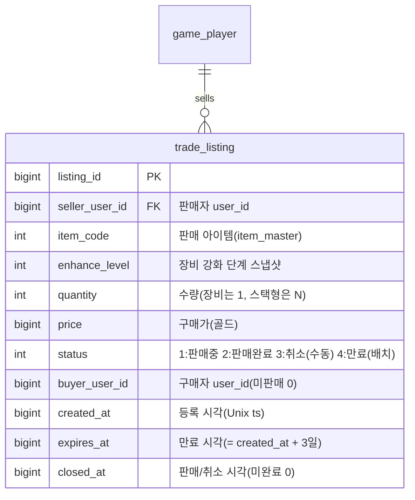

# 거래소 / 교역선(Trade Ship) 기획서

> 상위 문서: [서버 시스템 전체 개요](../서버-시스템-전체-개요.md) · 관련 도메인 4.7(필수)
>
> 본 문서는 원작의 스팀 마켓을 대체하는 **플레이어 간 아이템 거래소**를 서버 권위로 다룬다. 아이템을 팔면 그 대가가 **게임 머니(골드)** 로 판매자에게 들어온다(실물 화폐 연동 없음). **구매 아이템과 판매 대금 모두 [메일(4.8)](mail-기획서.md)로 지급**한다.

## 목차

- [1. 개요](#1-개요)
- [2. 기능 설명](#2-기능-설명)
- [3. 요구사항](#3-요구사항)
- [4. 데이터 모델](#4-데이터-모델)
- [5. API 명세](#5-api-명세)
  - [5.1 거래소 목록 조회 — `POST /api/game/trade/list`](#51-거래소-목록-조회--post-apigametradelist)
  - [5.2 판매 등록 — `POST /api/game/trade/register`](#52-판매-등록--post-apigametraderegister)
  - [5.3 구매 — `POST /api/game/trade/buy`](#53-구매--post-apigametradebuy)
  - [5.4 판매 취소 — `POST /api/game/trade/cancel`](#54-판매-취소--post-apigametradecancel)
- [6. 처리 흐름](#6-처리-흐름)
- [7. 성능 설계](#7-성능-설계)
  - [7.1 병목은 어디인가](#71-병목은-어디인가)
  - [7.2 MySQL 색인과 조건부 갱신](#72-mysql-색인과-조건부-갱신)
  - [7.3 목록 조회 — 캐시를 두지 않는다](#73-목록-조회--캐시를-두지-않는다-확정)
  - [7.4 동시성 — 애플리케이션 락을 두지 않는다](#74-동시성--애플리케이션-락을-두지-않는다)
  - [7.5 Redis 장애와 거래소](#75-redis-장애와-거래소)
  - [7.6 만료 배치](#76-만료-배치)
  - [7.7 하지 않는 것](#77-하지-않는-것)
- [8. 에러 코드](#8-에러-코드)
- [9. 미결 사항 / TODO](#9-미결-사항--todo)
- [10. 참고](#10-참고)


## 1. 개요

- **목적**: 플레이어가 획득한 장비·재료를 다른 플레이어에게 **골드로 판매/구매**할 수 있게 한다. 원작은 스팀 마켓에 팔아 실제 지갑 자금을 얻었으나, 본 모작은 **인게임 골드**로만 정산한다. 아이템은 실질 가치를 가지므로 **소유권 이전과 골드 정산을 하나의 트랜잭션**으로 처리해 아이템 복제·이중 판매·재화 유실을 원천 차단한다.
- **대상 서버**: `GameServer`(거래소 등록·조회·구매·취소, 정산), `TaskbarHero.Common`(거래 목록·결과 DTO·에러 코드 공유). 인증은 AccountServer 발급 토큰을 GameServer 미들웨어가 검증.
- **범위 경계**:
  - **아이템의 인벤토리 적재·소유 규칙**은 [인벤토리/아이템/큐브 기획서](inventory-item-cube-기획서.md)(`player_item`)를 따른다. 본 문서는 거래소 등록↔인벤토리 간 이동을 다룬다.
  - **구매 아이템·판매 대금 지급**은 [메일(4.8)](mail-기획서.md) 발급으로 위임한다. 거래 결과물은 계정에 직접 넣지 않고 우편함을 거치며, 실제 반영은 수령 시점에 이뤄진다.
  - **실물 화폐·유료 결제는 범위 밖**이다.
- **관련 기획서**: [[inventory-item-cube-기획서]] (아이템 소유·`player_item`·`sellable`), [[mail-기획서]] (판매 대금 메일 발급), [[save-data-기획서]] (거래 등록 저장), [[서버-시스템-전체-개요]] (도메인 4.7)


## 2. 기능 설명

- **판매 등록**: 판매자가 인벤토리의 판매 가능(`item_master.sellable=1`, 미장착) 아이템을 **골드 가격을 정해 등록**한다. 등록된 아이템은 인벤토리에서 빠져 **거래소 보관(에스크로)** 상태가 된다(중복 판매·복제 방지).

  **판매 등록 제약 조건 요약** — 등록 요청은 아래 제약을 모두 통과해야 성립한다(상세 검증 순서는 [6.2](#62-등록--취소--만료)).

  | 제약 | 규칙 | 위반 시 |
  |---|---|---|
  | 소유 확인 | 본인 인벤토리(`player_item`)에 존재하는 아이템만 등록 가능 | `ItemNotFound(4001)` |
  | 판매 가능 여부 | `item_master.sellable=1`인 아이템만 등록 가능 | `TradeNotSellable(7002)` |
  | 장착 상태 | 장착 중인 장비는 등록 불가 | `ItemEquipped(4007)` |
  | 등록 가격 | `item_master.base_price`의 **±20%**(`×0.8 ~ ×1.2`) 범위 | `TradePriceOutOfRange(7006)` |
  | 동시 등록 수 | 계정당 판매중 등록 **최대 10개** | `TradeListingLimitExceeded(7007)` |
  | 수량 | 장비는 1개, 스택형은 해당 행 **전체 수량**(부분 판매 없음) | 수량 지정 자체를 받지 않음(요청 필드 없음) |
  | 판매 기간 | 등록 후 **3일**(`expires_at = created_at + 3일`)만 판매중 유지 | 만료 시 **유찰 처리** — `status=4`(만료)로 닫고 아이템을 판매자에게 메일 반송(**메일 만료 없음**, [6.2](#62-등록--취소--만료)) |
  | 에스크로 | 등록 즉시 인벤토리에서 제거되어 거래소 보관 상태가 됨 | 등록 중 아이템의 장착·분해·재등록은 대상이 없어 `ItemNotFound(4001)` |
- **거래소 목록 조회**: 구매자가 판매 중인 등록을 조회한다(**아이템 코드 검색 + 서버 페이징**).
- **구매**: 구매자가 골드를 지불하면 **구매 아이템이 구매자에게 메일로 지급**되고, **판매 대금(수수료 차감 후)이 판매자에게 메일로 지급**된다. 자기 등록은 구매할 수 없다.
- **판매 취소**: 판매자가 판매 중인 자기 등록을 취소하면 **아이템이 인벤토리로 복귀**한다.

> **거래 결과물은 모두 우편함을 거친다.** 구매 아이템·판매 대금·만료 반송 아이템 어느 것도 계정에 직접 꽂지 않는다. 지급 경로를 하나로 통일하면 (1) 구매 시점에 인벤토리 용량을 보지 않아도 되고(가방이 가득해도 거래가 성립한다), (2) 수령 여부·시각이 메일 원장에 남으며, (3) 판매자가 오프라인이어도 동일한 방식으로 처리된다.


## 3. 요구사항

**기능 요구사항**
- 판매 등록, 목록 조회, 구매, 판매 취소를 제공한다.
- 등록 시 아이템은 인벤토리에서 제거되어 거래소 보관 상태가 된다(에스크로). 취소/미판매 시 인벤토리로 복귀한다.
- 구매 시 **골드 차감(구매자) + 구매 아이템 메일 발급(구매자) + 등록 완료 처리 + 판매 대금 메일 발급(판매자)** 을 **하나의 트랜잭션**으로 반영한다.
- 판매 대금은 **판매가에서 거래 수수료(20%)를 뺀 금액**(판매가의 80%)이며, 판매자에게 메일(`category=2` 거래)로 지급한다.
- 구매 아이템은 구매자에게 메일(`category=2` 거래, 템플릿 203)로 지급하며 이 메일은 **만료가 없다(무기한)**. 골드를 지불하고 산 물건이므로 수령 기한으로 잃지 않게 한다 — 미수령 무기한 메일은 보관 GC의 삭제 대상에서도 제외된다([메일 기획서](mail-기획서.md) 6.5). **구매 시점에는 인벤토리 용량을 검사하지 않으며**, 적재 실패(`InventoryFull(4002)`)는 우편함 수령 시점에 판정된다.
- 메일 첨부는 **강화 단계를 보존**한다(`player_mail_reward.enhance_level`). 등록 당시 강화 단계가 구매자에게 그대로 전달된다.
- 판매 불가 아이템(`sellable=0`)·장착 중 아이템은 등록을 거부한다.
- 등록 가격은 **아이템 기준가(`item_master.base_price`)의 ±20%**(`base_price×0.8 ~ ×1.2`) 범위여야 하며, 범위 밖이면 거부한다.
- 등록 **유효기간은 3일**이다. 만료되면 자동 취소되어 아이템을 판매자에게 **메일로 반송**한다.
- **스택형 아이템(재료 등)은 전체 수량만** 등록·판매한다(부분 판매 없음).
- 거래에서 발급되는 **메일은 모두 만료가 없다**(구매 아이템·판매 대금·만료 반송 전부 `valid_days=0`). 이미 거래로 확정된 재산을 수령 지연으로 잃게 하지 않는다 — 특히 만료 반송은 플레이어가 아무 행동도 하지 않았는데 서버가 돌려준 자기 아이템이라, 만료로 소멸시키면 손실이 부당하다.
- 계정당 **동시 등록(판매중)은 최대 10개**이며, 초과 시 등록을 거부한다.
- 목록 조회 **검색은 아이템 코드**로 한다(클라이언트가 이름 검색 후 `itemCode`로 변환해 전송). 서버가 페이징을 지원한다.

**비기능 요구사항**
- **서버 권위**: 가격·소유권·정산은 서버가 확정한다. 클라이언트가 보고한 가격/소유를 신뢰하지 않는다.
- **원자성·경합 안전**: 동시 구매는 대상 `trade_listing` 행을 **조건부 갱신(판매중일 때만 전이)으로 선점**해 직렬화한다([7.2](#72-mysql-색인과-조건부-갱신)) — MySQL이 그 행에 거는 **행 잠금(row lock)** 이 유일한 직렬화 지점이다. 두 구매자가 동시에 같은 등록을 사면 **한 명만 성공**하고 나머지는 `TradeAlreadyClosed(7005)`로 거부된다(이중 판매·복제 방지). 골드 차감과 아이템 이전은 전부 성공하거나 전부 롤백한다.
- **멱등성**: 이미 판매/취소된 등록에 대한 재요청은 거부한다.
- **조회 성능**: 목록 조회는 이 프로젝트에서 **유일한 전역 공유 읽기**지만 **캐시를 두지 않는다**([7.3](#73-목록-조회--캐시를-두지-않는다-확정)) — 전용 색인이 검색·정렬을 커버하고 판매중 등록 규모가 작아, 캐시가 읽기를 더 싸게 만들지 못하고 정합성 위험만 남았다(실측 근거는 7.3).
- **가용성**: 거래소는 **Redis를 전혀 쓰지 않는다** — 목록·등록·구매·취소·만료가 모두 MySQL 안에서 끝나므로 Redis 장애와 무관하다([7.5](#75-redis-장애와-거래소)).
- **응답 크기 제어**: 목록 조회의 `pageSize`는 서버가 상한을 강제해 과대 응답을 방어한다(기본 50·상한 100, [7.2](#72-mysql-색인과-조건부-갱신)).

## 4. 데이터 모델

**새 세이브 테이블 1개**(`trade_listing`)를 요구한다. 아이템·재화 이동은 기존 `player_item`, 대금 지급은 기존 메일 테이블(`player_mail`·`player_mail_reward`)을 재사용한다.



| 테이블 | 역할 | 참조 |
|---|---|---|
| `trade_listing`(`listing_id` PK + 조회·정렬·만료 색인 4종 → [7.2](#72-mysql-색인과-조건부-갱신)) | 거래소 등록 1건(에스크로 보관 아이템 스냅샷 포함) | `item_master`(`item_code`), `game_player`(`seller_user_id`/`buyer_user_id`) |

- **Redis 미사용**: 새로 요구되는 **영속 테이블은 `trade_listing` 하나뿐**이고, 거래소는 **Redis에 어떤 키도 두지 않는다** — 목록 캐시는 실측 후 제거했고([7.3](#73-목록-조회--캐시를-두지-않는다-확정)) 락 키도 두지 않는다([7.4](#74-동시성--애플리케이션-락을-두지-않는다)).

- **에스크로 방식(확정)**: 등록 시 판매 아이템 행을 판매자 `player_item`에서 **제거**하고, 그 스냅샷(`item_code`·`enhance_level`·`quantity`)을 `trade_listing`에 담는다. 구매 시 구매자에게 **메일로 발급**(수령 시 `player_item` 적재), 취소 시 판매자 `player_item`에 **직접 복원**한다(취소는 요청자가 온라인이므로 메일을 거치지 않는다). 아이템이 "등록 중"이면서 인벤토리에도 존재하는 모호한 상태를 없애고, 등록 중 아이템의 장착·분해·재등록을 원천 차단한다.
- **상태(`status`)**: `1:판매중`만 목록/구매 대상이다. `2:판매완료`·`3:취소`(판매자 수동)·`4:만료`(배치 자동)는 **이력으로 보관**하며, 본 프로젝트에서는 별도 정리(GC)를 하지 않는다. **취소와 만료를 다른 값으로 두는 이유**: 종료 사유를 사후에 구분할 수 있어야 CS 대응("내 아이템이 왜 돌아왔나")과 지표(만료율 vs 취소율)가 가능하다. `closed_at`만으로는 사유를 알 수 없다.
- **가격·수수료(확정)**: 등록 가격 `price`는 **`item_master.base_price`의 ±20%**(`base_price×0.8 ~ ×1.2`) 범위여야 한다. 구매자는 `price` 전액을 내고, **수수료 20%**를 뗀 **판매가의 80%**가 판매자에게 지급된다. 골드는 `player_item` 재화 행(`row_type=2`, 골드 `item_code=1`, [인벤토리/아이템/큐브 기획서](inventory-item-cube-기획서.md))에서 차감/메일 지급된다.
- **유효기간(확정)**: 등록은 생성 후 **3일**(`expires_at = created_at + 3일`)에 만료된다. 만료된 등록은 `status=4`(만료)로 닫히고 아이템을 판매자에게 **메일로 반송**한다(6.2). 거래 관련 메일은 모두 **만료가 없다**.

**공유 enum / DTO (TaskbarHero.Common)**
- `status`(1:판매중 2:판매완료 3:취소 4:만료) 등 분류 코드는 `TaskbarHero.Common`에 enum으로 고정한다(값 변경 금지).
- 거래 목록·결과 DTO는 `TaskbarHero.Common/Dto/GameDto.cs`에 공유 DTO로 둔다(5장 응답 스키마).

## 5. API 명세

**API 목록**

- [5.1 거래소 목록 조회 — `POST /api/game/trade/list`](#51-거래소-목록-조회--post-apigametradelist)
- [5.2 판매 등록 — `POST /api/game/trade/register`](#52-판매-등록--post-apigametraderegister)
- [5.3 구매 — `POST /api/game/trade/buy`](#53-구매--post-apigametradebuy)
- [5.4 판매 취소 — `POST /api/game/trade/cancel`](#54-판매-취소--post-apigametradecancel)

Base URL(개발): `http://localhost:5247` (GameServer). 모든 API는 **POST**, 인증 요청 공통 형식 `{ userId, token, data }`, 응답 `{ success, errorCode, message, data }`([세이브 데이터 기획서](save-data-기획서.md) 5장과 동일 규약).

### 5.1 거래소 목록 조회 — `POST /api/game/trade/list`

판매 중(`status=1`)인 등록을 조회한다. 조회는 상태를 바꾸지 않는다.

**두 가지 모드** — `mine` 플래그로 가른다.

| `mine` | 반환 | 용도 |
|---|---|---|
| `false`(기본) | **본인 등록을 제외한** 판매중 등록 | 구매 화면(자기 등록은 구매 불가라 노출하지 않는다) |
| `true` | **본인 등록만** | 판매 취소 화면(취소에 필요한 `listingId` 확보) |

판매자 필터는 **쿼리 단계**(`WHERE seller_user_id <> ?` / `= ?`)에서 적용한다. 조회 결과를 받아 걸러내면 `OFFSET`이 필터 전 기준이라 페이지마다 건수가 달라지고 항목이 누락·중복된다.


**Request**
```json
{ "userId": 1, "token": "...", "data": { "itemCode": 30012, "mine": false, "page": 0, "pageSize": 50 } }
```

- **검색은 아이템 코드**로 한다. 클라이언트가 이름 검색 UI에서 고른 아이템을 `itemCode`로 변환해 보낸다(`itemCode=0` 또는 생략이면 전체). 서버가 `page`/`pageSize`로 페이징한다. 기본 정렬은 **가격 오름차순**이며 별도 정렬 옵션은 두지 않는다. `mine`은 생략 시 `false`(제외 모드)다.
- **만료된 등록은 목록에 나오지 않는다.** 조회 쿼리가 `status=1 AND expires_at > now`를 함께 검사하므로, 만료 배치(1시간 주기)가 아직 돌지 않아 `status`가 1로 남아 있어도 제외된다([7.6](#76-만료-배치)). `mine=true`(내 판매 목록)에도 같은 기준이 적용되며, 만료 매물은 곧 반송 메일로 돌아온다.

**Response (성공, 200 OK)**
```json
{
  "success": true,
  "errorCode": 0,
  "message": "OK",
  "data": {
    "listings": [
      { "listingId": 88001, "itemCode": 30012, "enhanceLevel": 3, "quantity": 1, "price": 50000, "sellerUserId": 42, "createdAt": 1752300000 }
    ],
    "page": 0,
    "pageSize": 50,
    "hasMore": true
  }
}
```

- 아이템의 이름·스탯·등급은 클라이언트가 `item_code`로 마스터 데이터에서 조회해 표시한다([마스터 데이터 기획서](master-data/master-data-기획서.md)).

### 5.2 판매 등록 — `POST /api/game/trade/register`

인벤토리 아이템을 거래소에 등록한다. 서버가 아이템을 인벤토리에서 빼 에스크로로 옮긴다.

**Request**
```json
{ "userId": 1, "token": "...", "data": { "itemId": 5001, "price": 50000 } }
```

- `itemId`: 등록할 아이템(`player_item.player_item_id`). `price`: 판매가(골드). **`item_master.base_price`의 ±20% 범위**여야 한다. 스택형 아이템은 **해당 행의 전체 수량**이 등록되며 수량 지정은 받지 않는다(부분 판매 없음).

**Response (성공, 200 OK)**
```json
{ "success": true, "errorCode": 0, "message": "Registered", "data": { "listingId": 88001, "itemCode": 30012, "enhanceLevel": 3, "quantity": 1, "price": 50000, "inventoryDelta": { "upserted": [], "removed": [5001] } } }
```

- 등록한 아이템 행은 에스크로로 옮겨져 가방에서 사라지므로, 그 변경분이 `inventoryDelta.removed`에 담긴다([인벤토리/아이템/큐브 기획서](inventory-item-cube-기획서.md) 5.0 공통 규약). 클라이언트는 이 값으로 가방을 갱신하고 **재조회하지 않는다.**
- 오류: `ItemNotFound(4001)`(인벤토리에 없음), `ItemEquipped(4007)`(장착 중), `TradeNotSellable(7002)`(`sellable=0`), `TradePriceOutOfRange(7006)`(기준가 ±20% 범위 밖), `TradeListingLimitExceeded(7007)`(동시 등록 10개 초과), `InvalidSaveData(2002)`(형식 오류 등). 같은 아이템을 겹쳐 등록하려 하면 뒤에 온 요청이 `ItemNotFound(4001)`를 받는다(에스크로 행 잠금, [7.4](#74-동시성--애플리케이션-락을-두지-않는다)).

### 5.3 구매 — `POST /api/game/trade/buy`

지정 등록을 구매한다. 골드 차감·**구매 아이템 메일 발급(구매자)**·판매 대금 메일 발급(판매자)을 하나의 트랜잭션으로 처리한다. 아이템은 인벤토리에 즉시 들어가지 않는다.

**Request**
```json
{ "userId": 2, "token": "...", "data": { "listingId": 88001 } }
```

**Response (성공, 200 OK)**
```json
{
  "success": true,
  "errorCode": 0,
  "message": "Purchased",
  "data": {
    "listingId": 88001,
    "gained": { "items": [ { "itemCode": 30012, "enhanceLevel": 3, "quantity": 1 } ] },
    "cost": { "currencyType": 1, "amount": 50000 },
    "balance": [ { "currencyType": 1, "amount": 9825421 } ],
    "mailId": 9001
  }
}
```

- `gained`는 **구매자 우편함으로 발급된 아이템 내역**이고 `mailId`는 그 메일이다 — 인벤토리 반영은 플레이어가 우편함에서 수령할 때 이뤄진다. `cost`/`balance`는 차감된 골드와 잔액이다. 판매 대금(수수료 차감 후)은 판매자에게 별도 메일로 지급된다(구매자 응답에는 포함되지 않음).
- 오류: `TradeListingNotFound(7001)`(등록 없음), `TradeAlreadyClosed(7005)`(이미 판매/취소), `TradeSelfPurchase(7004)`(자기 등록), `InsufficientCurrency(4005)`(골드 부족).
- **구매 단계에서 `InventoryFull(4002)`은 발생하지 않는다.** 메일로 지급하므로 가방이 가득해도 거래는 성립하며, 용량 부족은 우편함 수령 시점에 판정된다([메일 기획서](mail-기획서.md) 5.2).

### 5.4 판매 취소 — `POST /api/game/trade/cancel`

판매 중인 본인 등록을 취소하고 아이템을 인벤토리로 되돌린다.

**Request**
```json
{ "userId": 1, "token": "...", "data": { "listingId": 88001 } }
```

**Response (성공, 200 OK)**
```json
{ "success": true, "errorCode": 0, "message": "Cancelled", "data": { "listingId": 88001, "restored": { "itemCode": 30012, "enhanceLevel": 3, "quantity": 1 }, "inventoryDelta": { "upserted": [ { "itemId": 5107, "slot": 14, "itemCode": 30012, "quantity": 1, "enhanceLevel": 3 } ], "removed": [] } } }
```

- `restored`는 표시용(아이템 코드·강화·수량)이고, 실제 가방 반영은 `inventoryDelta.upserted`가 담당한다(복귀 행의 `itemId`·`slot` 포함, [인벤토리/아이템/큐브 기획서](inventory-item-cube-기획서.md) 5.0 공통 규약). **재조회하지 않는다.**
- 오류: `TradeListingNotFound(7001)`, `TradeNotOwner(7003)`(본인 등록 아님), `TradeAlreadyClosed(7005)`(이미 판매/취소), `InventoryFull(4002)`(복귀 시 인벤토리 초과).

> 인증 오류(401) 등은 기존 미들웨어를 따른다. 등록 만료(3일) 시 자동 취소·메일 반송은 6.2 참고. "내 판매 목록"은 별도 엔드포인트 없이 목록 조회의 `mine=true`로 처리한다(5.1).

## 6. 처리 흐름

### 6.1 구매 (의사코드)

```
요청 수신 → 토큰 검증(미들웨어)
트랜잭션(BEGIN)                                                     # 직렬화는 4번의 조건부 갱신(행 잠금)이 담당
  1) L = trade_listing[listingId]
     if 없음: TradeListingNotFound(7001)
     if L.status != 1(판매중): TradeAlreadyClosed(7005)
     if L.expires_at <= now: TradeAlreadyClosed(7005)   # 만료 시각 경과 — 배치가 아직 status를 4로 못 바꿔도 거부(7.6)
  2) if L.seller_user_id == 구매자: TradeSelfPurchase(7004)
  3) if 구매자 골드(player_item 재화 행) < L.price: InsufficientCurrency(4005)
     # 인벤토리 용량은 보지 않는다 — 아이템을 메일로 주므로 수령 시점에 판정된다
  4) 등록 선점(CAS): UPDATE trade_listing
       SET status=2, buyer_user_id=구매자, closed_at=now
       WHERE listing_id=? AND status=1
     if 반영 0행: ROLLBACK → TradeAlreadyClosed(7005)   # 동시 구매자가 먼저 선점
  5) 구매자 골드 -= L.price
  6) 구매 아이템 메일 발급(구매자, 템플릿 203):
       player_mail 적재(buyer_user_id, category=2, created_at=now, expires_at=0(무기한), claimed=0)
       player_mail_reward 적재(mail_id, seq=1, reward_type=2(아이템)|3(재료),
                               reward_code=L.item_code, quantity=L.quantity,
                               enhance_level=L.enhance_level)   # 강화 단계 보존
  7) 판매 대금 메일 발급(판매자):
       수령액 = floor(L.price × 0.8)                 # 수수료 20% 차감
       player_mail 적재(seller_user_id, category=2, "거래소 판매 대금", created_at=now, expires_at=0(무기한), claimed=0)
       player_mail_reward 적재(mail_id, seq=1, reward_type=1(골드), reward_code=0, quantity=수령액)
COMMIT → { listingId, gained, cost, balance, mailId }
```

- **선점(4번)을 재화 이동보다 앞에 둔다.** 상태 전이를 먼저 확정하면, 나머지 단계는 이 트랜잭션이 유일한 승자임이 보장된 상태에서 진행된다(근거 [7.2](#72-mysql-색인과-조건부-갱신)).
- **구매 경로에 Redis 락은 없다.** 경합 대상이 `trade_listing` 행 하나이고, 그 행을 조건부 갱신할 때 MySQL이 거는 **행 잠금이 이미 요청을 줄 세운다**. 앞단에 락을 하나 더 두면 직렬화 지점이 둘로 늘어 TTL 만료·Redis 장애 같은 경계 상황만 추가된다([7.4](#74-동시성--애플리케이션-락을-두지-않는다)).

- 구매 아이템·판매 대금 모두 계정에 **즉시 반영하지 않고** 메일로 발급한다(우편함 수령 시 반영, [메일 기획서](mail-기획서.md)). **수수료 20%** 분 골드는 **경제에서 소멸**(sink)한다. 두 메일 모두 **만료가 없다**.

### 6.2 등록 / 취소 / 만료

- **등록(5.2)**: `user_id` 잠금 → **동시 등록 수 확인**(판매중 **&middot; 미만료** 등록 ≥ 10이면 `TradeListingLimitExceeded(7007)` — 만료 시각이 지난 등록은 배치 정리 전이라도 한도에서 빼므로 판매자의 등록 칸이 배치 주기만큼 묶이지 않는다, [7.6](#76-만료-배치)) → 아이템 검증(존재·미장착·`sellable=1`) → **가격 검증**(`base_price×0.8 ≤ price ≤ base_price×1.2`, 위반 시 `TradePriceOutOfRange(7006)`) → `player_item`에서 제거(스택형은 전체 수량) → `trade_listing` 생성(status=1, `expires_at=now+3일`). 실패 시 전체 롤백.
- **취소(5.4)**: 본인·판매중 확인 → `player_item`에 아이템 복원 → 조건부 갱신으로 `status=3`(수동 취소) → 캐시에서 제거. 구매·만료 배치가 같은 등록을 동시에 닫으려 해도 **조건부 갱신의 행 잠금**이 직렬화하므로 별도 락은 쓰지 않는다. 인벤토리 용량 초과면 `InventoryFull(4002)`.
- **만료(자동, 배치)**: `status=1 AND expires_at < now`인 등록을 주기적으로 처리 → **`status=4`(만료)** 로 닫고, 아이템을 판매자에게 **메일로 반송**(`category=2`, 첨부=반송 아이템, **만료 없음**). 판매자가 오프라인·인벤토리 가득이어도 안전하게 반송하기 위해 취소(수동)와 달리 **메일 반송**을 사용한다. 실행 주기·처리 건수 제한은 [7.6](#76-만료-배치)에 정의한다.

### 6.3 예외 / 엣지 케이스

- **동시 구매 경합**: 같은 등록을 둘이 동시에 구매하면 **조건부 갱신에서 갈린다** — MySQL이 그 행에 행 잠금을 걸어 두 UPDATE를 줄 세우고, 뒤에 온 쪽은 `status=1` 조건이 어긋나 0행을 받아 `TradeAlreadyClosed(7005)`가 된다. 아이템 복제·이중 판매는 불가하다([7.2](#72-mysql-색인과-조건부-갱신)).
- **등록 후 원본 조작 시도**: 아이템이 이미 `player_item`에서 빠졌으므로 등록 중 아이템의 장착·분해·재등록은 대상이 없어 `ItemNotFound(4001)`.
- **구매자 인벤토리 가득**: 아이템을 메일로 주므로 **구매는 성립한다**(골드 차감·등록 판매완료). 칸이 없으면 우편함에서 수령할 때 `InventoryFull(4002)`가 나며, 메일은 미수령 상태로 남아 자리를 비운 뒤 다시 받을 수 있다(발급 후 7일 이내).
- **자기 등록 구매**: `TradeSelfPurchase(7004)`로 거부(가격 조작·자전거래 방지).
- **판매 대금 메일 초과**: 대금은 골드이므로 인벤토리 용량과 무관하며, 메일 수령 시 재화 행 `quantity`에 가산된다.
- **구매 메일은 만료되지 않는다**: 인벤토리를 비운 뒤 언제든 수령할 수 있고, 보관 GC도 미수령 무기한 메일은 지우지 않는다. 반면 **판매 대금 메일은 7일 만료**이므로 판매자는 기한 내에 받아야 한다 — 클라이언트는 미수령 보상 메일에 레드닷으로 수령을 유도한다.

## 7. 성능 설계

**세 줄 요약**

1. 부하가 몰리는 지점은 둘이다 — **목록 조회**(모든 사용자가 같은 데이터를 읽는 유일한 기능)와 **인기 등록의 동시 구매**(요청이 한 행에 집중).
2. **Redis를 쓰지 않는다** — 목록 캐시도([7.3](#73-목록-조회--캐시를-두지-않는다-확정)) 애플리케이션 락도([7.4](#74-동시성--애플리케이션-락을-두지-않는다)) 두지 않는다. 조회 경로가 하나뿐이라 운영·테스트 경로도 하나다.
3. **동시 구매 직렬화는 MySQL 조건부 갱신 하나로 끝낸다**([7.2](#72-mysql-색인과-조건부-갱신)). 경합 대상이 등록 행 하나이므로 그 행의 **행 잠금**이 요청을 줄 세우고, 앞단에 Redis 락을 더 두지 않는다.

### 7.1 병목은 어디인가

다른 기능은 모두 자기 데이터만 읽으므로(`WHERE user_id = ?`) 사용자가 늘면 부하도 자연히 나뉜다. 거래소만 다르다.

| | 다른 기능(세이브·스테이지·인벤·성장) | 거래소 |
|---|---|---|
| 읽는 범위 | 자기 데이터만 | 전체 판매중 등록 |
| 요청이 늘면 | 서로 다른 행 → 분산 | 같은 행 집합 → 한곳에 집중 |
| 캐시 효과 | 낮음(사람마다 결과가 다르다) | **높음(전원이 같은 결과를 본다)** |

구체적으로 두 곳이다.

- **목록 조회의 정렬** — `status=1 AND item_code=? ORDER BY price`를 처리할 때, 색인이 검색만 커버하면 정렬을 매번 다시 한다.
- **인기 등록의 동시 구매** — 싼 등록에 여러 명이 몰리면 결국 1명만 성공하고, 나머지는 조건부 갱신에서 0행을 받아 롤백한다. 요청 수에 비례해 트랜잭션이 열리지만, 각 요청은 **행 잠금 대기 후 UPDATE 1건에서 즉시 판정**되므로 짧게 끝난다.

그래서 **조회는 캐시로 받아내고, 구매는 MySQL 행 잠금 하나로 직렬화하는** 구조로 간다.

### 7.2 MySQL 색인과 조건부 갱신

**색인** — 검색 조건과 정렬을 한 색인이 함께 커버하게 만들어 정렬 비용을 없앤다. 캐시가 비었을 때(첫 조회·TTL 만료·Redis 장애)의 폴백 경로가 이 색인이다.

| 색인 | 정의 | 쓰는 곳 |
|---|---|---|
| `idx_trade_browse` | `(status, item_code, price)` | 아이템 코드 검색 + 가격 정렬 |
| `idx_trade_price` | `(status, price)` | 전체 목록(코드 미지정) 가격 정렬 |
| `idx_trade_seller` | `(seller_user_id, status)` | 동시 등록 한도(10개) 검사, 내 판매 목록 |
| `idx_trade_expire` | `(status, expires_at)` | 만료 배치 대상 조회([7.6](#76-만료-배치)) |

- `status`를 맨 앞에 두면 판매완료·취소 이력(보관만 하고 조회하지 않음)이 조회 경로에서 자동으로 빠진다.
- InnoDB 보조 색인에는 PK(`listing_id`)가 자동 포함되므로 색인 정의에 따로 넣지 않는다.

**구매 직렬화(유일한 직렬화 지점)** — 대상 등록을 **조건부 갱신**으로 선점한다. 같은 등록을 닫는 모든 경로(구매·취소·만료 배치)가 이 한 지점을 지난다.

```
UPDATE trade_listing SET status=2, buyer_user_id=?, closed_at=?
WHERE listing_id=? AND status=1        → 반영 0행이면 이미 팔린 등록
```

- 두 요청이 동시에 도달해도 UPDATE가 행 잠금으로 줄을 세우고, 뒤에 온 쪽은 조건이 어긋나 0행을 받아 `TradeAlreadyClosed(7005)`가 된다. **아이템 복제·이중 판매가 불가능하다.**
- `SELECT … FOR UPDATE`를 쓰지 않는 이유: 프로젝트 규칙상 원시 SQL을 조립하지 않으며(SqlKata 쿼리 빌더 전용), 조건부 갱신만으로 같은 효과를 얻는다. [오프라인 보상 정산 기획서](offline-reward-기획서.md)가 `last_active_at`으로 정산권을 선점하는 방식과 동일하다.
- 선점을 골드 차감·아이템 지급보다 **앞에** 둔다. 그래야 경합에서 진 요청이 헛일을 하지 않는다.
- **애플리케이션 락(Redis 등)을 앞단에 두지 않는다.** 경합 대상이 등록 행 하나뿐이라 행 잠금이 곧 직렬화이고, 락을 더 얹으면 정합성은 그대로인데 TTL 만료·락 해제 실패·Redis 장애라는 경계만 늘어난다([7.4](#74-동시성--애플리케이션-락을-두지-않는다)).

**응답 크기** — 목록 조회의 `pageSize`는 서버가 기본 50 · 상한 100(잠정)으로 자른다.

### 7.3 목록 조회 — 캐시를 두지 않는다 (확정)

**거래소 목록 조회에는 Redis 캐시를 두지 않는다.**(제거 근거·측정치·검증 기록: [판단 기록](../거래소-목록-캐시-제거-판단.md)) 요청마다 MySQL에서 **필요한 한 페이지만** 읽는다 — 뷰어별 필터(본인 제외/본인만)·가격 정렬·페이징을 모두 쿼리에서 처리한다. 정본이 하나뿐이라 동기화라는 문제 자체가 없다.

```sql
SELECT listing_id, seller_user_id, item_code, enhance_level, quantity, price, created_at, expires_at
  FROM trade_listing
 WHERE status = 1
   AND expires_at > ?                       -- 요청 시각. 만료 매물은 배치 정리 전이라도 제외(7.6)
   [AND item_code = ?]                      -- itemCode=0 이면 생략(전체 목록)
   AND seller_user_id <> ?                  -- mine=false(구매 대상). mine=true 면 = ?
 ORDER BY price, listing_id
 LIMIT ? OFFSET ?                            -- limit = pageSize + 1 (hasMore 판정용)
```

- **뷰어 필터·정렬·페이징을 전부 쿼리에서 처리한다(확정).** SQL 처리 순서가 `WHERE → ORDER BY → LIMIT`이라 **걸러낸 결과에서 limit만큼 세므로 페이지 건수가 정확하다.** 반대로 자른 뒤 애플리케이션에서 거르면(LIMIT 먼저 → 메모리 필터) **본인 등록이 섞인 페이지만 건수가 줄어든다**(10건 요청에 9건). 실측으로 두 순서의 차이를 확인했다.
- 색인 `idx_trade_browse (status, item_code, price, listing_id)`·`idx_trade_price (status, price, listing_id)`가 검색·정렬·커서를 함께 담당한다. 정렬 축이 가격 하나뿐이라(9장 확정) 색인 하나로 끝난다.
- **`expires_at > now`는 색인 선두가 아니라 잔여 술어로 평가된다.** 색인을 새로 만들지 않는다 — 걸러지는 행은 "3일이 지났고 아직 배치가 정리하지 않은" 극소수라, 페이지를 채우기 위해 추가로 읽는 행이 사실상 없다. 배치 주기가 1시간이라 아직 정리되지 않은 만료분의 총량도 한 시간치에 그친다.
- **전량을 읽지 않는다.** 예전에는 캐시에 담을 완전 집합이 필요해 `LIMIT` 없이 전량을 읽고 메모리에서 필터·페이징했다. 캐시를 제거하면서 그 전제가 사라졌으므로 필요한 한 페이지만 읽는다 — 판매중 10,000건 기준 **읽는 행이 10,000 → 페이지 크기**로 줄어든다.
- **깊은 페이지 방어**: `OFFSET`은 건너뛸 행을 실제로 세므로 상한(`MaxOffset = 10,000`)을 두고, 넘는 `page`는 거부하지 않고 clamp해 빈 페이지로 응답한다.
- **`OFFSET`을 쓰고 keyset 커서를 쓰지 않는 이유**: keyset(`(price, listing_id) > (?, ?)`)이 더 우수하지만 응답 계약이 `page` → `cursor`로 바뀌어 클라이언트 거래소 UI를 함께 고쳐야 한다. 거래소는 첫 페이지 위주 조회이고 목록이 몇 초 낡아도 무해하므로 `OFFSET`의 약점(깊은 페이지 비용·동시 변경 시 경계 밀림)이 실질적으로 드러나지 않는다. 깊은 페이지가 실제로 쓰이거나 등록이 수만 건으로 늘면 keyset으로 전환한다(8장 미결).

**캐시를 두지 않는 이유(확정)** — 도입해 운영해 본 뒤 실측으로 걷어냈다. 근거는 넷이다.

| # | 근거 |
|---|---|
| 1 | **읽기가 더 싸지 않았다.** 색인(Sorted Set) + 스냅샷(String) 구조라 적중 시에도 `ZRANGE` 1회 + 등록 수만큼의 `GET`이 필요했다 — 판매중 61건이면 **62 커맨드 + 61회 역직렬화** vs MySQL **1 쿼리**(61행). "DB를 안 탄다"는 이득이 Redis 쪽 비용으로 상쇄됐다. |
| 2 | **분포가 캐시 전제를 깼다.** 판매중 61건이 **아이템 코드 59종**에 흩어져(평균 1.03건/코드) 아이템별 조회는 거의 1건짜리 목록이었고, 전체 96종 중 **37종은 0건**이라 빈 결과는 캐시되지 않아 매번 DB를 탔다. |
| 3 | **원 쿼리가 싸다.** 단일 테이블·전용 색인·조인 없음. 캐시가 막아 줄 부하가 없었다. |
| 4 | **정합성 위험만 남았다.** MySQL 전량 읽기와 캐시 적재 사이에 구매가 커밋되면 **팔린 등록이 캐시에 되살아나** 색인 TTL(24시간)까지 유령 매물로 남았다(구매 시도 → `TradeAlreadyClosed` 반복). 막으려면 버전 스탬프 + Lua CAS라는 기계를 새로 얹어야 했다. |

**다시 도입할 조건(확정 순서)** — 규모가 커지면 결론이 바뀐다. 다만 **순서가 중요하다.** 지난번 실패는 "쿼리를 고치기 전에 캐시를 얹은 것"이었다.

| 단계 | 무엇을 | 왜 |
|---|---|---|
| **1** | 뷰어 필터·페이징을 **쿼리로** 내린다(위 SQL — **완료**) | 캐시와 무관하게 읽는 행이 전체 등록 수 → 페이지 크기로 줄어든다. 수십만 건까지 이것만으로 버틴다 |
| **2** | 그래도 부하가 남으면 **keyset 커서**로 전환 | `OFFSET`의 깊은 페이지 비용·경계 밀림 제거. 응답 계약이 `page` → `cursor`로 바뀌므로 클라이언트와 함께 |
| **3** | 동일 키 조회가 초당 수백 회면 **짧은 TTL 페이지 캐시** | 아래 설계를 따른다 |

**3단계 캐시 설계(그때 쓸 것)** — 판단 기준은 **행 수가 아니라 같은 키의 조회 QPS**다.

- 캐시 단위는 **데이터셋이 아니라 완성된 페이지 응답**이다. 키 `trade:page:{itemCode}:{cursor}`, 값은 `{ listings[], nextCursor, hasMore }` 하나 → **읽기 1커맨드**.
- **TTL 3~10초 + 지터**, **무효화는 하지 않는다**(TTL이 무효화다). 등록·구매·취소·만료가 캐시를 건드리지 않으므로 read-fill 경합·부분 색인·고아 id 문제가 원천적으로 없다.
- **첫 페이지만** 캐시해도 충분하다(트래픽이 여기 몰린다) → 키 수가 itemCode 수만큼으로 고정된다.
- 목록이 최대 TTL만큼 낡지만 **구매는 MySQL 조건부 갱신이 재검증**하므로 자산 위험은 없다(`TradeAlreadyClosed`).
- 공유 캐시가 되려면 목록이 **뷰어 무관**해야 한다. 지금의 "본인 등록 제외"를 유지하려면 캐시에는 필터 없는 페이지를 담고 응답 시 걸러내는 over-fetch가 필요한데 페이지 건수가 흔들린다 — 그때는 **본인 등록도 노출하고 구매 버튼만 비활성화**하는 쪽으로 스펙을 정리하는 편이 깔끔하다.
- **스탬피드 방어**: 인기 키 만료 순간 동시 요청이 DB로 몰리므로 TTL 지터, 부족하면 `SET NX`로 갱신 권한을 하나에만 준다.

**하지 말 것(이번에 제거한 구조)** — **완전 집합을 캐시하고 스냅샷을 건당 `GET`으로 읽는 방식.** 커맨드 수가 `O(전체 등록 수)`라서 규모가 커질수록 **DB보다 나빠진다**(10,000건이면 `ZRANGE` 1 + `GET` 10,000 = 10,001커맨드·약 1.6MB vs 페이지 조회 1쿼리·약 3KB). 자료구조를 Hash로 바꿔도 전량을 받아오는 것은 그대로다 — 문제는 자료구조가 아니라 **캐시 단위**였다.

**Redis를 쓰는 곳과의 경계** — GameServer의 Redis 용도는 **인증 토큰 검증**과 **배치 리더 락**(`batch:lock:{배치키}`)뿐이다. 거래소·인벤토리 등 게임 데이터 조회는 전부 MySQL 직접 경로다([인벤토리 기획서](inventory-item-cube-기획서.md) 6.5도 같은 판단).

### 7.4 동시성 — 애플리케이션 락을 두지 않는다

**거래소는 Redis 락을 쓰지 않는다(확정).** 등록·구매·취소·만료 어느 경로에도 애플리케이션 락이 없으며, 직렬화는 전부 **MySQL 행 잠금**이 담당한다([7.2](#72-mysql-색인과-조건부-갱신)).

**경로별 직렬화 수단**

| 경로 | 경합 대상 | 직렬화 수단 |
|---|---|---|
| 구매 · 판매 취소 · 만료 배치 | `trade_listing` 등록 행 1개 | **조건부 갱신**(`WHERE listing_id=? AND status=1`)의 행 잠금 → 뒤에 온 쪽 0행 → `TradeAlreadyClosed(7005)` |
| 판매 등록 — **같은 아이템 중복** | `player_item` 아이템 행 1개 | **에스크로 `DELETE`**의 행 잠금 → 뒤에 온 쪽 0행 → `ItemNotFound(4001)` |
| 판매 등록 — **동시 등록 한도** | 그 계정의 등록 **개수**(잠글 행이 없다) | **없음 — best-effort**(아래) |
| 목록 조회 | 없음(읽기) | 없음 — 정합성 정본은 MySQL |

**등록 행을 닫는 경로에 락을 쓰지 않는 이유** — 경합 대상이 등록 행 하나이고, `status=1`일 때만 전이하는 UPDATE에 MySQL이 **그 행에 잠금을 걸어 요청을 줄 세운다**. 뒤에 온 요청은 조건이 어긋나 0행을 받으므로 이중 판매·아이템 복제가 성립할 여지가 없다. 앞단에 애플리케이션 락을 하나 더 두면 정합성은 그대로인데 **TTL 만료·해제 실패·Redis 장애**라는 실패 경계만 늘어난다.

**같은 아이템이 두 번 등록되지 않는 이유(확정)** — 등록 트랜잭션은 에스크로로 `player_item` 행을 `DELETE`한다. 같은 `itemId`로 두 요청이 들어오면 먼저 온 쪽이 그 행에 X 락을 잡고 커밋할 때까지 쥐고, 뒤에 온 쪽은 대기 후 **0행**을 받아 `ItemNotFound(4001)`로 롤백된다. **더블클릭·재전송으로 같은 상품이 두 번 등록되는 일은 구조적으로 불가능**하며, 이를 위해 별도 락이 필요하지 않다.

**동시 등록 한도(10건)는 best-effort다(확정)** — 한도 검사는 `COUNT`(비잠금 일관 읽기)이고, MySQL 기본 격리 수준이 **REPEATABLE READ**라 스냅샷을 뜬 뒤 커밋된 남의 `INSERT`를 보지 못한다. 두 등록이 겹치면 둘 다 9를 보고 통과해 11건이 될 수 있다. 이를 **막지 않기로 한다.**

- **성립 조건이 좁다.** ①**서로 다른 아이템**이어야 하고(같은 아이템은 위 `DELETE` 잠금이 차단), ②앞 요청의 **응답을 기다리지 않고 겹쳐** 보내야 한다. 응답을 받고 다음을 보내면 새 스냅샷이 10을 보므로 정상 거부된다. 현재 클라이언트는 등록 요청에 in-flight 가드가 있어 **정상 플레이로는 재현되지 않는다** — 조작된 클라이언트가 병렬 요청을 만들어야 한다.
- **초과해도 무해하다.** 각 등록은 자기 아이템을 원자적으로 에스크로했으므로 **자산 정합성에 영향이 없고**, 취소·만료 시 정상 복구된다. 초과 이후의 등록은 `COUNT ≥ 10`이라 전부 거부되어 더 늘지 않으며, 판매·취소·3일 만료로 **스스로 10 이하로 수렴**한다. 수수료 20%와 가격 범위(기준가 ±20%) 제약 때문에 칸 몇 개로 얻는 경제적 이득도 없다.
- **막으려면 대가가 크다.** 정확히 강제하려면 계정 행 잠금(`SELECT ... FOR UPDATE`)이나 한도 검사의 잠금 읽기가 필요한데, 전자는 다른 트랜잭션(`stage/clear`·`inventory/expand`가 `player_item` → `game_player` 순서로 잠근다)과 **잠금 순서가 역전되어 데드락 위험**을 만들고, 후자는 갭 락으로 다른 판매자의 등록까지 대기시킨다. 얻는 것(한도 ±N)에 비해 지불이 크다.
- **DB 차원의 보증이 필요해지면** `(seller_user_id, slot_no)` 유니크 제약으로 등록 슬롯을 배정하는 방식으로 바꿀 수 있다(테이블 추가 없이 컬럼 + 유니크 인덱스).

### 7.5 Redis 장애와 거래소

**거래소는 Redis를 쓰지 않으므로 Redis 장애와 무관하다.** 목록 조회·등록·구매·취소·만료가 전부 MySQL 안에서 끝난다([7.3](#73-목록-조회--캐시를-두지-않는다-확정)·[7.4](#74-동시성--애플리케이션-락을-두지-않는다)).

| 상황 | 동작 |
|---|---|
| Redis 불통 | 거래소 전 기능 **정상**. 다만 **인증 토큰 검증**이 Redis 의존이라 요청 자체가 401이 된다(거래소만의 문제가 아니라 서버 전역 전제 — [계정/로그인 기획서](account-login-기획서.md)) |
| MySQL 불통 | 거래소 전 기능 중단. 정합성 정본이 MySQL이므로 대체 경로를 두지 않는다 |
| 동시 구매 경합 | MySQL 조건부 갱신이 직렬화 → 뒤에 온 쪽 `TradeAlreadyClosed(7005)` |
| 같은 아이템 중복 등록 | 에스크로 `DELETE`의 행 잠금 → 뒤에 온 쪽 `ItemNotFound(4001)` |

캐시가 없으므로 **"목록에 유령 매물이 보인다"는 불일치 자체가 발생하지 않는다.** 목록은 항상 그 시점 MySQL 상태다.

로그는 [로깅 규칙](../공통/로깅-규칙.md)을 따르고, 지표는 **`TradeAlreadyClosed` 발생률**(구매 경합 강도)과 **목록 조회 응답 시간**(전량 조회가 규모를 못 버티는 신호) 둘을 본다.

### 7.6 만료 배치

`status=1 AND expires_at < now`인 등록을 **`status=4`(만료)** 로 닫고 아이템을 판매자에게 메일로 반송한다([6.2](#62-등록--취소--만료)). 본 절은 스케줄러 구현에 바로 착수할 수 있도록 실행 모델·처리 절차·실패 처리·구현 체크리스트를 정리한다.

- **만료 판정 기준은 배치 시점이 아니라 "읽는 시점"이다(확정).** 만료 시각이 지난 등록은 배치가 아직 `status`를 4로 바꾸지 못했어도 **없는 것처럼 취급**한다 — 목록 조회·단건 조회에서 빠지고(`expires_at > now`), 구매는 `TradeAlreadyClosed(7005)`로 거부되며, 판매자의 동시 등록 한도 집계에서도 제외된다. 즉 판매 기간 3일은 배치 주기와 무관하게 정확하다.
  - **배치는 만료를 판정하지 않는다.** 남은 역할은 **에스크로 아이템 반송과 `status` 정리**뿐이라, 주기가 판매 기간(3일)의 정확도에 영향을 주지 않는다([7.6.1](#761-실행-모델스케줄러)).
  - 이 결정으로 **"만료된 매물이 목록에 보여 구매를 시도했는데 실패"** 하는 구간이 사라진다. 반대급부는 만료 직후 그 매물을 판매자가 되돌려받기까지 최대 배치 주기가 걸리는 것인데, 그 동안 아이템은 에스크로에 안전하게 보관되므로 유실 위험이 없다.
  - **그럼에도 주기는 1시간으로 짧게 둔다(확정).** 주기가 곧 **판매자가 자기 아이템을 되돌려받기까지의 지연 상한**이라, 3일을 기다린 판매자를 하루 더 기다리게 할 이유가 없다. 대상 조회가 `idx_trade_expire`를 커버링으로 타고 대상 0건이면 로그도 남기지 않아 **빈 주기 비용이 사실상 없으며**, 주기를 줄이면 하루 처리 용량(주기당 상한 × 주기 수)도 함께 늘어난다.
  - 만료 매물의 **수동 취소는 막지 않는다**(`trade/cancel`은 `expires_at`을 보지 않는다). 판매자가 반송을 기다리지 않고 즉시 회수하려는 시도를 굳이 거부할 이유가 없으며, 취소가 먼저 이기면 배치의 조건부 갱신이 0행으로 스킵된다.

#### 7.6.1 실행 모델(스케줄러)

| 항목 | 설계 | 비고 |
|---|---|---|
| 호스팅 | GameServer 프로세스 내 `BackgroundService` 파생 `TradeExpireBatchScheduler`(`GameServer/Batch/`) | 별도 프로세스·외부 스케줄러(cron 등)를 두지 않는다 — 단일 인스턴스 전제([7.7](#77-하지-않는-것)) |
| 주기 | `PeriodicTimer` + `WaitForNextTickAsync` 루프, **3600초 = 1시간** | 이전 주기가 끝나야 다음 tick을 기다리므로 **재진입이 구조적으로 불가**(별도 잠금 불필요). 만료 효력은 읽기 경로가 즉시 내므로(7.6 서두) 이 주기는 **반송 지연 상한**일 뿐이며, 그 상한을 1시간으로 잡았다 |
| 기동 직후 | 첫 tick을 기다리지 않고 **즉시 1회 실행** | 서버 중단 동안 쌓인 만료분을 바로 소화한다 — 재기동이 곧 반송 기회다 |
| 1주기 상한 | **최대 1000건**, `listing_id` 오름차순 | 주기(1시간)보다 넉넉히 잡아, 서버가 한동안 내려가 있다 올라왔을 때 밀린 물량을 한 주기에 소화한다. 초과분은 다음 주기로 이월되며 상한 도달은 요약 로그로 확인 |
| 종료 | `stoppingToken` 취소 시 처리 중인 1건만 마무리하고 루프 종료 | `OperationCanceledException`은 정상 종료로 처리 |
| 설정 | `appsettings.json`에 `"TradeExpireBatch": { "IntervalSeconds": 3600, "BatchSize": 1000 }` | 설정이 없으면 코드 기본값(동일 수치)으로 동작. 반송 지연 상한을 더 줄이려면 `IntervalSeconds`만 낮춘다(코드 변경 불필요) |
| 리더 락 | `batch:lock:trade-expire`를 `SET NX`로 잡고 **주기가 끝나면 소유자 확인 후 즉시 해제**(Lua CAS) | TTL은 주기가 아니라 **1주기 실행 시간의 상한**(= min(주기, 5분))이며, 락을 잡은 채 프로세스가 죽었을 때 자동으로 풀리게 하는 안전망이다. 주기와 같게 두면 재기동 시 그 주기만큼 배치가 멈춘다. "주기당 1회"는 락이 아니라 각 인스턴스의 타이머가 페이싱하고, 중복 실행은 조건부 갱신 선점의 멱등성이 흡수한다 |
| DI 등록 | `builder.Services.AddHostedService<TradeExpireBatchScheduler>()` | `Program.cs` |
| 의존성 수명 | 호스티드 서비스는 싱글턴이므로 scoped 리포지토리를 직접 주입받지 않고, **주기마다 `IServiceScopeFactory`로 스코프를 생성**해 `ITradeRepository`를 해석한다 | 리더 락(`batch:lock:trade-expire`)만 Redis를 쓴다 |
| 시간 기준 | `DateTimeOffset.UtcNow.ToUnixTimeSeconds()` | 거래·메일과 동일한 Unix ts 기준 |

> **공통 골격** — 주기 루프·설정 바인딩·스코프 생성·요약 로깅은 메일 GC 배치([mail 기획서 6.5](mail-기획서.md))도 동일하게 필요하다. 추상 클래스 `PeriodicBatchScheduler`(파생이 `IntervalSeconds`·`BatchSize`·`RunCycleAsync(scope, ct)`만 구현)로 골격을 분리해 두 배치가 재사용한다.

#### 7.6.2 1주기 처리 절차(의사코드)

```
now = UtcNow(Unix ts)
ids = SELECT listing_id FROM trade_listing
      WHERE status=1 AND expires_at < {now}
      ORDER BY listing_id LIMIT {BatchSize}            # idx_trade_expire가 커버
for listingId in ids:                                  # 등록 1건 = 트랜잭션 1개(락 없음)
  트랜잭션(BEGIN)
    1) 선점(CAS): UPDATE trade_listing SET status=4, closed_at={now}
         WHERE listing_id={listingId} AND status=1 AND expires_at < {now}
       반영 0행 → ROLLBACK, 스킵                        # 그 사이 구매·취소로 이미 닫힘
    2) L = SELECT trade_listing[listingId]              # 반송 스냅샷(item_code·quantity·seller_user_id)
    3) 반송 메일 발급(수신자 = L.seller_user_id):
         player_mail 적재(category=2, 제목/본문="거래소 등록 만료 반송",
                          created_at={now}, expires_at={now}+7일, is_read=0, claimed=0)
         player_mail_reward 적재(seq=1, reward_type=2(아이템)|3(재료),
                                 reward_code=L.item_code, quantity=L.quantity)
  COMMIT
요약 로그 1줄: 처리 n건 / 경합 스킵 s건 / 실패 f건
```

- **골드 이동은 없다.** 만료 반송은 에스크로 아이템을 메일 첨부로 되돌릴 뿐, 재화 정산이 없다(대금 정산은 구매 시에만 발생).
- **`reward_type` 매핑**: 반송 아이템이 장비(`item_master.item_type=1`)면 `reward_type=2`(아이템), 재료(`item_type=2`)면 `3`(재료).
- **강화 단계는 반송하지 않는다**: 메일 첨부(`player_mail_reward`)는 강화 단계를 보존하지 않는다(강화된 아이템은 메일 발송 대상이 아님 — [메일 기획서 4장](mail-기획서.md) 확정). 만료 반송 장비는 강화 0단계로 지급된다.
- **메일 문구·발급 규약**: 반송 메일은 `mail_master` **템플릿 202(거래소 판매 만료 반송)** 로 발급한다 — 문구·category·만료 일수는 템플릿이 확정하며, 발급 규약(내부 호출·발급자 트랜잭션 안에서 INSERT)은 [메일 기획서 6.4](mail-기획서.md)를 따른다. 구매 대금 메일(6.1)은 템플릿 201을 쓴다.

#### 7.6.3 실패 처리·로깅

| 상황 | 처리 | 로그([로깅 규칙](../공통/로깅-규칙.md)) |
|---|---|---|
| 건별 예외(DB 오류 등) | 해당 건만 롤백하고 **다음 건 계속**(주기 전체를 중단하지 않음) | Error(`listingId` 포함) |
| 경합 스킵(조건부 갱신 0행 — 그 사이 구매·취소로 닫힘) | 다음 주기로 이월할 것도 없이 그 건만 건너뜀 | 로그 없음(정상 동작) — 요약 카운트에만 포함 |
| Redis 장애 | 만료 처리 자체는 그대로 진행(캐시·락을 쓰지 않는다). 단 **리더 락을 못 잡으면 그 주기를 건너뛴다** | Warning(주기당 1회로 억제) |
| 주기 요약 | 대상 0건이면 로그 생략(소음 방지) | Information: `만료 배치: 처리 {Count}건, 스킵 {Skipped}건, 실패 {Failed}건` |
| 루프 자체의 미처리 예외 | 잡아서 로그 후 **루프 유지**(배치 사망으로 만료가 영구 방치되는 것 방지) | Error |

#### 7.6.4 구현 체크리스트

1. `GameServer/Batch/PeriodicBatchScheduler.cs`(공통 골격) + `TradeExpireBatchScheduler.cs` 작성, `Program.cs`에 `AddHostedService` 등록, `appsettings.json`에 `TradeExpireBatch` 섹션 추가.
2. `ITradeRepository`에 배치 전용 메서드 2개: `GetExpiredListingIdsAsync(now, limit)`(대상 조회), `ApplyExpireAsync(listingId, now)`(선점 → 스냅샷 → 반송 메일 발급 → 커밋을 하나의 트랜잭션으로).
3. **에러 코드 추가 없음** — 배치는 HTTP 응답이 없으므로 `ErrorCode`·클라이언트 계약 변경이 발생하지 않는다.
4. 빌드(`dotnet build`) 확인 후 시나리오 테스트: 만료 등록 반송(메일 수신 확인) · 만료 직전 구매와의 경합(조건부 갱신으로 한쪽만 성공) · Redis 중단 상태에서 만료·구매가 정상 동작하는지.
5. `SequenceDiagram/README.md` 거래소 섹션에 만료 배치 흐름 추가, `README.md` 개발 현황판 갱신.

### 7.7 하지 않는 것

규모에 맞지 않아 **의도적으로 빼는** 항목이다. 필요해지면 근거와 함께 다시 검토한다.

| 후보 | 빼는 이유 |
|---|---|
| 구매·취소·만료에 Redis 락 두기 | 경합 대상이 등록 행 하나라 조건부 갱신의 행 잠금이 이미 직렬화한다. 락을 얹어도 정합성은 그대로인데 TTL 만료·해제 실패·Redis 장애라는 실패 경계만 늘어난다([7.4](#74-동시성--애플리케이션-락을-두지-않는다)) |
| 커서(키셋) 페이징 | 뒤 페이지 비용이 문제가 될 등록 수가 아니다. `pageSize` 상한으로 충분하며, API 필드를 늘리면 클라이언트도 함께 바꿔야 한다 |
| 만료 대상을 Redis에 별도 관리 | 1분에 한 번 색인 조회로 끝나는 일을 캐시로 옮길 이유가 없다 |
| 판매자별 등록 수를 Redis에 집계 | 등록은 드문 쓰기다. `(seller_user_id, status)` 색인 조회로 충분하다 |
| 캐시 전량 사전 적재 · 주기적 재동기화 배치 | lazy 적재 + TTL로 같은 효과를 얻는다. 재구축 락·동기화 배치는 단일 인스턴스에 불필요하다 |
| Lua 스크립트 · Pub/Sub · 메시지 큐 | 원자성은 MySQL이 책임지고, 인스턴스들은 같은 Redis를 공유하며, 대금 지급은 이미 메일로 위임되어 있다 |
| 검색 엔진(Elasticsearch 등) | 검색이 아이템 코드 단건 매칭이다(이름 검색은 클라이언트가 마스터 데이터로 처리) |
| MySQL 읽기 복제 분리 | 현 규모에 불필요. 필요해지면 목록 조회만 replica로 보낸다(구매·등록은 반드시 primary) |

## 8. 에러 코드

`TaskbarHero.Common`의 `ErrorCode`에 정의되어 있다. 도메인 4.7(거래소)은 **7000번대**를 사용한다([통합 정의](../공통/error-code-정의.md) 블록 규약, 도메인 4.N → N000). 추가 시 통합 문서도 함께 갱신한다.

| 이름 | 값 | 의미 |
|---|---|---|
| TradeListingNotFound | 7001 | 거래 등록이 없거나 접근 불가 |
| TradeNotSellable | 7002 | 판매 불가 아이템(`sellable=0`) |
| TradeNotOwner | 7003 | 본인 등록이 아님(취소 불가) |
| TradeSelfPurchase | 7004 | 자기 등록은 구매 불가 |
| TradeAlreadyClosed | 7005 | 이미 판매/취소된 등록 · **만료 시각이 지난 등록**(배치가 status를 4로 정리하기 전이라도 거부, 7.6) |
| TradePriceOutOfRange | 7006 | 등록 가격이 기준가 ±20% 범위 밖 |
| TradeListingLimitExceeded | 7007 | 계정 동시 등록 한도(10개) 초과 |

- **`7008`(구 `TradeBusy`)은 결번이다.** 판매 등록의 Redis 판매자 락을 제거하며 폐기했다([7.4](#74-동시성--애플리케이션-락을-두지-않는다)). 재사용하지 않는다.
- 동시 구매에서 진 요청은 `TradeAlreadyClosed(7005)`를 받고(조건부 갱신 0행, [7.2](#72-mysql-색인과-조건부-갱신)), 같은 아이템을 겹쳐 등록하려다 진 요청은 `ItemNotFound(4001)`를 받는다(에스크로 행 잠금).
- 등록 아이템 없음·장착 중은 `ItemNotFound(4001)`·`ItemEquipped(4007)`([인벤토리/아이템/큐브 기획서](inventory-item-cube-기획서.md))를 재사용한다.
- 구매 골드 부족은 `InsufficientCurrency(4005)`, 아이템 지급 용량 초과는 `InventoryFull(4002)`를 재사용한다. 잘못된 가격 등 요청 값 오류는 `InvalidSaveData(2002)`.

## 9. 미결 사항 / TODO

- **목록 페이징을 keyset 커서로 전환**: 현재는 `OFFSET` 기반이라 깊은 페이지가 비싸고 조회 중 등록이 들어오면 경계가 밀린다. `(price, listing_id) > (?, ?)` 커서로 바꾸면 이 둘이 사라지지만 응답 계약이 `page` → `cursor`로 바뀌어 **클라이언트 거래소 UI를 함께 고쳐야** 한다. 깊은 페이지가 실제로 쓰이거나 등록이 수만 건으로 늘 때 전환한다([7.3](#73-목록-조회--캐시를-두지-않는다-확정) 1~2단계).
**게임 정책** — 확정됨(아래 확정 사항 참고). 아이템별 `base_price` 실제 수치는 [마스터 데이터 기획서](master-data/master-data-기획서.md) 밸런스에서 채운다.

**성능 설계(7장) 관련 미결** — 아래 수치는 모두 **측정 전 가정**이므로 구현·부하 테스트 후 확정한다.

| 항목 | 현재 값(가정) | 확정에 필요한 것 |
|---|---|---|
| `pageSize` 기본·상한([7.2](#72-mysql-색인과-조건부-갱신)) | 기본 50 · 상한 100 | 클라이언트 목록 UI 표시 개수 확인 |
| 만료 배치 주기·처리 건수([7.6](#76-만료-배치)) | 1분 주기 · 200건 | 등록 규모 확인 |

> **확정 사항**: 거래 수수료 **20%**(판매자 수령 80%) · 등록 가격 **기준가 ±20%** · 등록 유효기간 **3일**(만료 시 메일 반송) · **스택형은 전체 판매만** · 판매 대금·반송 메일 만료 **7일**, **구매 아이템 메일은 무기한** · **계정당 동시 등록 최대 10개** · 검색은 **아이템 코드**(클라이언트가 이름→코드 변환) + **서버 페이징**(기본 가격 오름차순, 정렬 옵션 없음) · 이력(판매완료·취소/만료)은 **정리하지 않고 보관** · 거래 로그·감사는 **범위에서 제외**.
>
> **확정 사항(성능·아키텍처)**: **거래소는 Redis를 쓰지 않는다** — 목록 캐시도 애플리케이션 락도 두지 않는다(도입 후 실측으로 제거, 7.3·7.4) · **모든 직렬화는 MySQL 행 잠금으로 처리한다**(등록·구매·취소·만료 전부) · 정합성의 정본은 **MySQL 트랜잭션**이다 · 목록 조회는 **전용 색인 + 전량 조회 후 메모리 필터·페이징** · 정렬 축은 **가격 오름차순 1축만** 유지한다 · 그 밖의 최적화는 [7.7](#77-하지-않는-것)에 따라 도입하지 않는다.

## 10. 참고

- [거래소 목록 캐시 제거 판단 기록](../거래소-목록-캐시-제거-판단.md) — **§7.3의 근거·측정치·검증 기록**(왜 제거했고, 규모가 커질 때 어떻게 다시 넣어야 하는지)
- [인벤토리/아이템/큐브 기획서](inventory-item-cube-기획서.md) — `player_item` 소유·`sellable`·`InventoryFull(4002)`·`ItemEquipped(4007)`
- [메일 기획서](mail-기획서.md) — 판매 대금 메일 발급·수령(`category=2` 거래)
- [세이브 데이터 기획서](save-data-기획서.md) — `trade_listing` 저장 골격
- [마스터 데이터 기획서](master-data/master-data-기획서.md) — 목록의 `item_code`로 아이템 이름·스탯 표시(클라 연동 포함)
- [ErrorCode 통합 정의](../공통/error-code-정의.md) — 에러 코드 블록 규약(7000번대 거래소)
- [계정 / 로그인 기획서](account-login-기획서.md) — Redis 키 네이밍(`auth:token:{userId}`)·CloudStructures 사용 선례. 토큰 캐시는 없으면 인증 자체가 불가한 **필수 의존**이지만, 거래소는 Redis를 쓰지 않는다([7.5](#75-redis-장애와-거래소))
- [오프라인 보상 정산 기획서](offline-reward-기획서.md) — 조건부 갱신만으로 중복 처리를 막는 선례(애플리케이션 락 없이 구매 선점과 동일 패턴, [7.2](#72-mysql-색인과-조건부-갱신))
- [서버 로깅 규칙](../공통/로깅-규칙.md) — 경합 로그 레벨 기준([7.5](#75-redis-장애와-거래소) 모니터링 지표)
