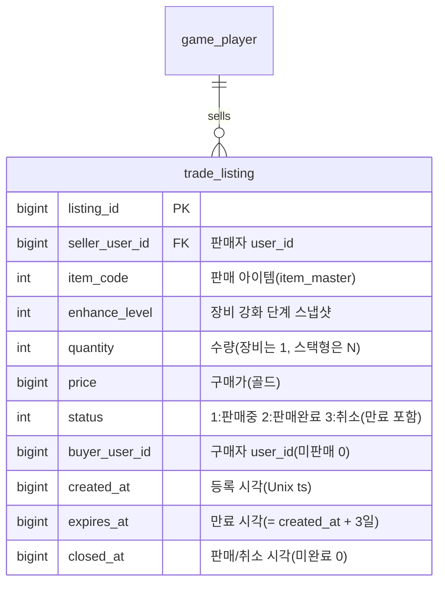

# 거래소 / 교역선(Trade Ship) 기획서

> 상위 문서: [서버 시스템 전체 개요](../공통/서버-시스템-전체-개요.md) · 관련 도메인 4.8(필수)
>
> 본 문서는 원작의 스팀 마켓을 대체하는 **플레이어 간 아이템 거래소**를 서버 권위로 다룬다. 아이템을 팔면 그 대가가 **게임 머니(골드)** 로 판매자에게 들어온다(실물 화폐 연동 없음). 판매 대금은 [메일(4.9)](mail-기획서.md)로 지급한다.

## 1. 개요

- **목적**: 플레이어가 획득한 장비·재료를 다른 플레이어에게 **골드로 판매/구매**할 수 있게 한다. 원작은 스팀 마켓에 팔아 실제 지갑 자금을 얻었으나, 본 모작은 **인게임 골드**로만 정산한다. 아이템은 실질 가치를 가지므로 **소유권 이전과 골드 정산을 하나의 트랜잭션**으로 처리해 아이템 복제·이중 판매·재화 유실을 원천 차단한다.
- **대상 서버**: `GameServer`(거래소 등록·조회·구매·취소, 정산), `TaskbarHero.Common`(거래 목록·결과 DTO·에러 코드 공유). 인증은 AccountServer 발급 토큰을 GameServer 미들웨어가 검증.
- **범위 경계**:
  - **아이템의 인벤토리 적재·소유 규칙**은 [인벤토리/아이템/큐브 기획서](inventory-item-cube-기획서.md)(`player_item`)를 따른다. 본 문서는 거래소 등록↔인벤토리 간 이동을 다룬다.
  - **판매 대금 지급**은 [메일(4.9)](mail-기획서.md) 발급으로 위임한다(판매자가 오프라인일 수 있으므로 우편함으로 지급).
  - **실물 화폐·유료 결제는 범위 밖**이다.
- **관련 기획서**: [[inventory-item-cube-기획서]] (아이템 소유·`player_item`·`sellable`), [[mail-기획서]] (판매 대금 메일 발급), [[save-data-기획서]] (거래 등록 저장), [[서버-시스템-전체-개요]] (도메인 4.8)

## 2. 기능 설명

- **판매 등록**: 판매자가 인벤토리의 판매 가능(`item_master.sellable=1`, 미장착) 아이템을 **골드 가격을 정해 등록**한다. 등록된 아이템은 인벤토리에서 빠져 **거래소 보관(에스크로)** 상태가 된다(중복 판매·복제 방지).
- **거래소 목록 조회**: 구매자가 판매 중인 등록을 조회한다(**아이템 코드 검색 + 서버 페이징**).
- **구매**: 구매자가 골드를 지불하면 **아이템이 구매자 인벤토리로 이전**되고, **판매 대금(수수료 차감 후)이 판매자에게 메일로 지급**된다. 자기 등록은 구매할 수 없다.
- **판매 취소**: 판매자가 판매 중인 자기 등록을 취소하면 **아이템이 인벤토리로 복귀**한다.

> 방치형 특성상 판매자·구매자가 동시 접속 상태가 아닐 수 있다. 구매자는 요청 시점에 온라인이므로 아이템을 **인벤토리로 즉시** 받고, 판매자는 오프라인일 수 있으므로 대금을 **메일로** 받는다.

## 3. 요구사항

**기능 요구사항**
- 판매 등록, 목록 조회, 구매, 판매 취소를 제공한다.
- 등록 시 아이템은 인벤토리에서 제거되어 거래소 보관 상태가 된다(에스크로). 취소/미판매 시 인벤토리로 복귀한다.
- 구매 시 **골드 차감(구매자) + 아이템 지급(구매자) + 등록 완료 처리 + 판매 대금 메일 발급(판매자)** 을 **하나의 트랜잭션**으로 반영한다.
- 판매 대금은 **판매가에서 거래 수수료(20%)를 뺀 금액**(판매가의 80%)이며, 판매자에게 메일(`category=2` 거래)로 지급한다.
- 판매 불가 아이템(`sellable=0`)·장착 중 아이템은 등록을 거부한다.
- 등록 가격은 **아이템 기준가(`item_master.base_price`)의 ±20%**(`base_price×0.8 ~ ×1.2`) 범위여야 하며, 범위 밖이면 거부한다.
- 등록 **유효기간은 3일**이다. 만료되면 자동 취소되어 아이템을 판매자에게 **메일로 반송**한다.
- **스택형 아이템(재료 등)은 전체 수량만** 등록·판매한다(부분 판매 없음).
- 판매 대금·반송 아이템 **메일의 만료는 7일**이다.
- 계정당 **동시 등록(판매중)은 최대 10개**이며, 초과 시 등록을 거부한다.
- 목록 조회 **검색은 아이템 코드**로 한다(클라이언트가 이름 검색 후 `itemCode`로 변환해 전송). 서버가 페이징을 지원한다.

**비기능 요구사항**
- **서버 권위**: 가격·소유권·정산은 서버가 확정한다. 클라이언트가 보고한 가격/소유를 신뢰하지 않는다.
- **원자성·경합 안전**: 구매·취소는 대상 `trade_listing` 행에 잠금을 걸어 직렬화한다. 두 구매자가 동시에 같은 등록을 사면 **한 명만 성공**하고 나머지는 거부한다(이중 판매·복제 방지). 골드 차감과 아이템 이전은 전부 성공하거나 전부 롤백한다.
- **멱등성**: 이미 판매/취소된 등록에 대한 재요청은 거부한다.

## 4. 데이터 모델

**새 세이브 테이블 1개**(`trade_listing`)를 요구한다. 아이템·재화 이동은 기존 `player_item`, 대금 지급은 기존 메일 테이블(`player_mail`·`player_mail_reward`)을 재사용한다.



| 테이블 | 역할 | 참조 |
|---|---|---|
| `trade_listing`(`listing_id` PK, `seller_user_id` 인덱스, `status`+`item_code` 조회 인덱스) | 거래소 등록 1건(에스크로 보관 아이템 스냅샷 포함) | `item_master`(`item_code`), `game_player`(`seller_user_id`/`buyer_user_id`) |

- **에스크로 방식(확정)**: 등록 시 판매 아이템 행을 판매자 `player_item`에서 **제거**하고, 그 스냅샷(`item_code`·`enhance_level`·`quantity`)을 `trade_listing`에 담는다. 구매 시 구매자 `player_item`에 새 행으로 생성, 취소 시 판매자 `player_item`에 복원한다. 아이템이 "등록 중"이면서 인벤토리에도 존재하는 모호한 상태를 없애고, 등록 중 아이템의 장착·분해·재등록을 원천 차단한다.
- **상태(`status`)**: `1:판매중`만 목록/구매 대상이다. `2:판매완료`·`3:취소`(만료 자동 취소 포함)는 **이력으로 보관**하며, 본 프로젝트에서는 별도 정리(GC)를 하지 않는다.
- **가격·수수료(확정)**: 등록 가격 `price`는 **`item_master.base_price`의 ±20%**(`base_price×0.8 ~ ×1.2`) 범위여야 한다. 구매자는 `price` 전액을 내고, **수수료 20%**를 뗀 **판매가의 80%**가 판매자에게 지급된다. 골드는 `player_item` 재화 행(`row_type=2`, 골드 `code=1`, [인벤토리/아이템/큐브 기획서](inventory-item-cube-기획서.md))에서 차감/메일 지급된다.
- **유효기간(확정)**: 등록은 생성 후 **3일**(`expires_at = created_at + 3일`)에 만료된다. 만료된 등록은 자동 취소(`status=3`)되어 아이템을 판매자에게 **메일로 반송**한다(6.2). 판매 대금·반송 메일의 만료는 **7일**이다.

**공유 enum / DTO (TaskbarHero.Common)**
- `status`(1:판매중 2:판매완료 3:취소) 등 분류 코드는 `TaskbarHero.Common`에 enum으로 고정한다(값 변경 금지).
- 거래 목록·결과 DTO는 `TaskbarHero.Common`에 공유 DTO로 두는 것을 **제안**한다(5장 응답 스키마).

## 5. API 명세

Base URL(개발): `http://localhost:5247` (GameServer). 모든 API는 **POST**, 인증 요청 공통 형식 `{ userId, token, data }`, 응답 `{ success, errorCode, message, data }`([세이브 데이터 기획서](save-data-기획서.md) 5장과 동일 규약).

### 5.1 거래소 목록 조회 — `POST /api/game/trade/list`

판매 중(`status=1`)인 등록을 조회한다. 조회는 상태를 바꾸지 않는다.

**Request**
```json
{ "userId": 1, "token": "...", "data": { "itemCode": 30012, "page": 0, "pageSize": 50 } }
```

- **검색은 아이템 코드**로 한다. 클라이언트가 이름 검색 UI에서 고른 아이템을 `itemCode`로 변환해 보낸다(`itemCode=0` 또는 생략이면 전체). 서버가 `page`/`pageSize`로 페이징한다. 기본 정렬은 **가격 오름차순**이며 별도 정렬 옵션은 두지 않는다.

**Response (성공, 200 OK)**
```json
{
  "success": true,
  "errorCode": 0,
  "message": "OK",
  "data": {
    "listings": [
      { "listingId": 88001, "itemCode": 30012, "enhanceLevel": 3, "quantity": 1, "price": 50000, "sellerUserId": 42, "createdAt": 1752300000 }
    ],
    "page": 0,
    "pageSize": 50,
    "hasMore": true
  }
}
```

- 아이템의 이름·스탯·등급은 클라이언트가 `item_code`로 마스터 데이터에서 조회해 표시한다([마스터 데이터 기획서](master-data-기획서.md)).

### 5.2 판매 등록 — `POST /api/game/trade/register`

인벤토리 아이템을 거래소에 등록한다. 서버가 아이템을 인벤토리에서 빼 에스크로로 옮긴다.

**Request**
```json
{ "userId": 1, "token": "...", "data": { "itemId": 5001, "price": 50000 } }
```

- `itemId`: 등록할 아이템(`player_item.item_id`). `price`: 판매가(골드). **`item_master.base_price`의 ±20% 범위**여야 한다. 스택형 아이템은 **해당 행의 전체 수량**이 등록되며 수량 지정은 받지 않는다(부분 판매 없음).

**Response (성공, 200 OK)**
```json
{ "success": true, "errorCode": 0, "message": "Registered", "data": { "listingId": 88001, "itemCode": 30012, "enhanceLevel": 3, "quantity": 1, "price": 50000 } }
```

- 오류: `ItemNotFound(4001)`(인벤토리에 없음), `ItemEquipped(4007)`(장착 중), `TradeNotSellable(8002)`(`sellable=0`), `TradePriceOutOfRange(8006)`(기준가 ±20% 범위 밖), `TradeListingLimitExceeded(8007)`(동시 등록 10개 초과), `InvalidSaveData(2002)`(형식 오류 등).

### 5.3 구매 — `POST /api/game/trade/buy`

지정 등록을 구매한다. 골드 차감·아이템 이전·판매 대금 메일 발급을 하나의 트랜잭션으로 처리한다.

**Request**
```json
{ "userId": 2, "token": "...", "data": { "listingId": 88001 } }
```

**Response (성공, 200 OK)**
```json
{
  "success": true,
  "errorCode": 0,
  "message": "Purchased",
  "data": {
    "listingId": 88001,
    "gained": { "items": [ { "itemCode": 30012, "enhanceLevel": 3, "quantity": 1 } ] },
    "cost": { "currencyType": 1, "amount": 50000 },
    "balance": [ { "currencyType": 1, "amount": 9825421 } ]
  }
}
```

- `gained`는 구매자 인벤토리에 들어온 아이템, `cost`/`balance`는 차감된 골드와 잔액이다. 판매 대금(수수료 차감 후)은 **판매자에게 메일로 지급**된다(구매자 응답에는 포함되지 않음).
- 오류: `TradeListingNotFound(8001)`(등록 없음), `TradeAlreadyClosed(8005)`(이미 판매/취소), `TradeSelfPurchase(8004)`(자기 등록), `InsufficientCurrency(4005)`(골드 부족), `InventoryFull(4002)`(구매자 인벤토리 초과).

### 5.4 판매 취소 — `POST /api/game/trade/cancel`

판매 중인 본인 등록을 취소하고 아이템을 인벤토리로 되돌린다.

**Request**
```json
{ "userId": 1, "token": "...", "data": { "listingId": 88001 } }
```

**Response (성공, 200 OK)**
```json
{ "success": true, "errorCode": 0, "message": "Cancelled", "data": { "listingId": 88001, "restored": { "itemCode": 30012, "enhanceLevel": 3, "quantity": 1 } } }
```

- 오류: `TradeListingNotFound(8001)`, `TradeNotOwner(8003)`(본인 등록 아님), `TradeAlreadyClosed(8005)`(이미 판매/취소), `InventoryFull(4002)`(복귀 시 인벤토리 초과).

> 인증 오류(401) 등은 기존 미들웨어를 따른다. 등록 만료(3일) 시 자동 취소·메일 반송은 6.2 참고. "내 판매 목록" 전용 조회는 현재 미제공(목록 조회로 대체).

## 6. 처리 흐름

### 6.1 구매 (의사코드)

```
요청 수신 → 토큰 검증(미들웨어)
트랜잭션(BEGIN, listing_id 행 잠금)
  1) L = trade_listing[listingId]
     if 없음: TradeListingNotFound(8001)
     if L.status != 1(판매중): TradeAlreadyClosed(8005)
  2) if L.seller_user_id == 구매자: TradeSelfPurchase(8004)
  3) if 구매자 골드(player_item 재화 행) < L.price: InsufficientCurrency(4005)
  4) if 구매자 인벤토리 용량 초과 예상: InventoryFull(4002)
  5) 구매자 골드 -= L.price
     구매자 player_item에 아이템 생성(L.item_code, L.enhance_level, L.quantity, 빈 slot)
  6) L.status = 2(판매완료); L.buyer_user_id = 구매자; L.closed_at = now
  7) 판매 대금 메일 발급(판매자):
       수령액 = floor(L.price × 0.8)                 # 수수료 20% 차감
       INSERT player_mail(seller_user_id, category=2, "거래소 판매 대금", created_at=now, expires_at=now+7일, claimed=0)
       INSERT player_mail_reward(mail_id, seq=1, reward_type=1(골드), reward_code=0, quantity=수령액)
COMMIT → { listingId, gained, cost, balance }
```

- 판매 대금은 판매자 계정에 **즉시 반영하지 않고** 메일로 발급한다(판매자 우편함 수령 시 반영, [메일 기획서](mail-기획서.md)). **수수료 20%** 분 골드는 **경제에서 소멸**(sink)한다. 대금 메일 만료는 **7일**.

### 6.2 등록 / 취소 / 만료

- **등록(5.2)**: `user_id` 잠금 → **동시 등록 수 확인**(판매중 등록 ≥ 10이면 `TradeListingLimitExceeded(8007)`) → 아이템 검증(존재·미장착·`sellable=1`) → **가격 검증**(`base_price×0.8 ≤ price ≤ base_price×1.2`, 위반 시 `TradePriceOutOfRange(8006)`) → `player_item`에서 제거(스택형은 전체 수량) → `trade_listing` 생성(status=1, `expires_at=now+3일`). 실패 시 전체 롤백.
- **취소(5.4)**: `listing_id` 잠금 → 본인·판매중 확인 → `player_item`에 아이템 복원 → status=3. 인벤토리 용량 초과면 `InventoryFull(4002)`.
- **만료(자동, 배치)**: `status=1 AND expires_at < now`인 등록을 주기적으로 처리 → status=3(취소)로 닫고, 아이템을 판매자에게 **메일로 반송**(`category=2`, 첨부=반송 아이템, 만료 7일). 판매자가 오프라인·인벤토리 가득이어도 안전하게 반송하기 위해 취소(수동)와 달리 **메일 반송**을 사용한다.

### 6.3 예외 / 엣지 케이스

- **동시 구매 경합**: 같은 등록을 둘이 동시에 구매하면 `listing_id` 행 잠금으로 직렬화 → 먼저 커밋한 쪽만 성공, 나머지는 `TradeAlreadyClosed(8005)`. 아이템 복제 불가.
- **등록 후 원본 조작 시도**: 아이템이 이미 `player_item`에서 빠졌으므로 등록 중 아이템의 장착·분해·재등록은 대상이 없어 `ItemNotFound(4001)`.
- **구매자 인벤토리 가득**: 구매 아이템을 받을 칸이 없으면 `InventoryFull(4002)`, 거래는 미성립(골드 미차감).
- **자기 등록 구매**: `TradeSelfPurchase(8004)`로 거부(가격 조작·자전거래 방지).
- **판매 대금 메일 초과**: 대금은 골드이므로 인벤토리 용량과 무관하며, 메일 수령 시 재화 행 `quantity`에 가산된다.

## 7. 에러 코드

`TaskbarHero.Common`의 `GameErrorCode`에 추가 제안. 도메인 4.8(거래소)은 **8000번대**를 사용한다([통합 정의](../공통/error-code-정의.md) 블록 규약, 도메인 4.N → N000). 추가 시 통합 문서도 함께 갱신한다.

| 이름 | 값 | 의미 |
|---|---|---|
| TradeListingNotFound | 8001 | 거래 등록이 없거나 접근 불가 |
| TradeNotSellable | 8002 | 판매 불가 아이템(`sellable=0`) |
| TradeNotOwner | 8003 | 본인 등록이 아님(취소 불가) |
| TradeSelfPurchase | 8004 | 자기 등록은 구매 불가 |
| TradeAlreadyClosed | 8005 | 이미 판매/취소된 등록 |
| TradePriceOutOfRange | 8006 | 등록 가격이 기준가 ±20% 범위 밖 |
| TradeListingLimitExceeded | 8007 | 계정 동시 등록 한도(10개) 초과 |

- 등록 아이템 없음·장착 중은 `ItemNotFound(4001)`·`ItemEquipped(4007)`([인벤토리/아이템/큐브 기획서](inventory-item-cube-기획서.md))를 재사용한다.
- 구매 골드 부족은 `InsufficientCurrency(4005)`, 아이템 지급 용량 초과는 `InventoryFull(4002)`를 재사용한다. 잘못된 가격 등 요청 값 오류는 `InvalidSaveData(2002)`.

## 8. 미결 사항 / TODO

- 현재 거래소 기획에서 별도로 남은 미결 항목은 없다(정책은 아래 확정 사항 참고). 아이템별 `base_price` 실제 수치는 [마스터 데이터 기획서](master-data-기획서.md) 밸런스에서 채운다.

> **확정 사항**: 거래 수수료 **20%**(판매자 수령 80%) · 등록 가격 **기준가 ±20%** · 등록 유효기간 **3일**(만료 시 메일 반송) · **스택형은 전체 판매만** · 판매 대금·반송 메일 만료 **7일** · **계정당 동시 등록 최대 10개** · 검색은 **아이템 코드**(클라이언트가 이름→코드 변환) + **서버 페이징**(기본 가격 오름차순, 정렬 옵션 없음) · 이력(판매완료·취소/만료)은 **정리하지 않고 보관** · 거래 로그·감사는 **범위에서 제외**.

## 9. 참고

- [인벤토리/아이템/큐브 기획서](inventory-item-cube-기획서.md) — `player_item` 소유·`sellable`·`InventoryFull(4002)`·`ItemEquipped(4007)`
- [메일 기획서](mail-기획서.md) — 판매 대금 메일 발급·수령(`category=2` 거래)
- [세이브 데이터 기획서](save-data-기획서.md) — `trade_listing` 저장 골격
- [마스터 데이터 기획서](master-data-기획서.md) — 목록의 `item_code`로 아이템 이름·스탯 표시(클라 연동 포함)
- [GameErrorCode 통합 정의](../공통/error-code-정의.md) — 에러 코드 블록 규약(8000번대 거래소)
