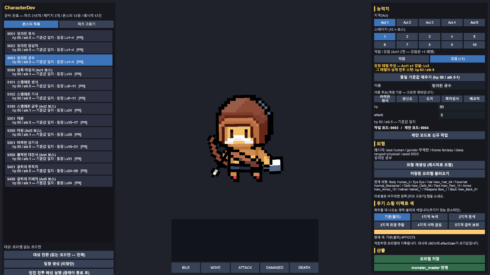
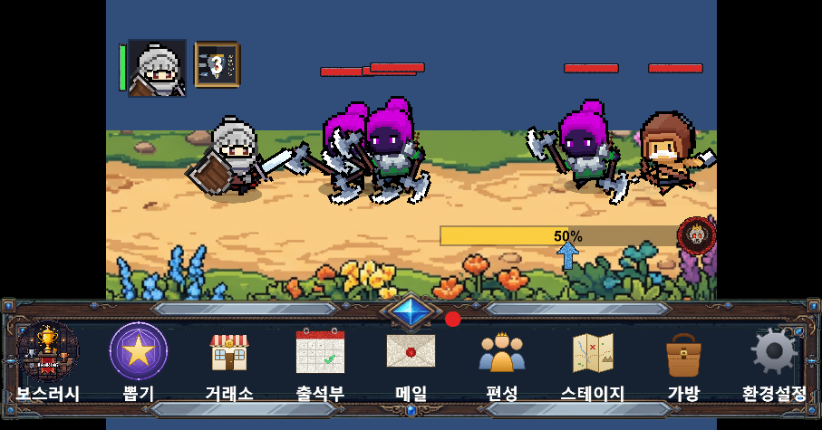
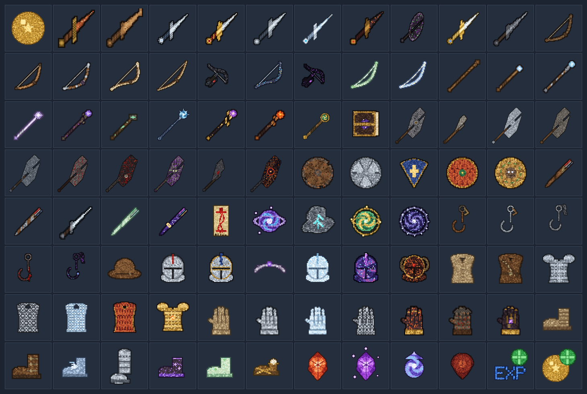
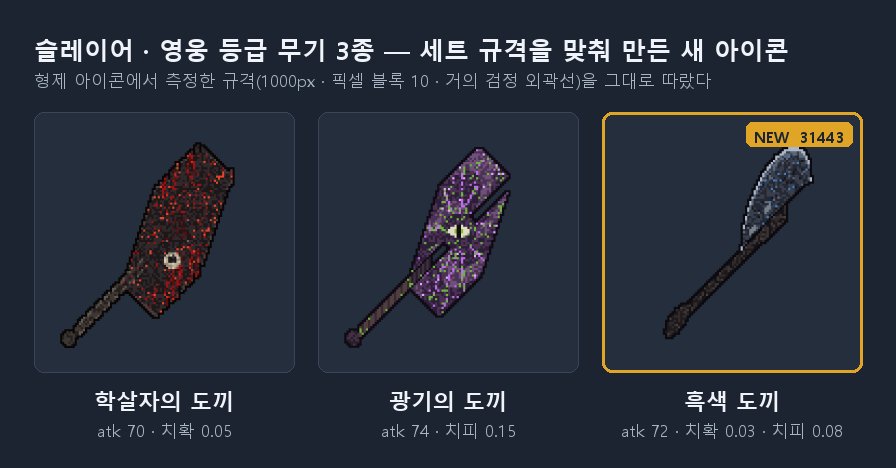

# 개발 시 참고 문서

> 이 프로젝트를 **이어받아 개발하는 사람**이 해당 프로젝트에 대한 개발 방식과 구조를 이해하기위해 참고하고자 하는 문서이다. 무엇이 어디 있고, 어떤 순서로 개발하며,
> 어떤 규칙이 있는지를 정리했다. 해당 문서는 에이전트 작업 시에 영향을 미치는 문서가 아니며, 사람이 읽기 위한 용도이다.

## 목차

- [0. 프로젝트 아키텍처 구조](#0-프로젝트-아키텍처-구조)
- [1. 로컬환경 서버 실행 방법](#1-로컬환경-서버-실행-방법)
- [2. AI 도구(Claude Code) 활용 방식](#2-ai-도구claude-code-활용-방식)
- [3. 작업 시 읽어볼 문서 정리](#3-작업-시-읽어볼-문서-정리)
- [4. 서버 기능 개발 순서](#4-서버-기능-개발-순서)
- [5. 코드 작성 규칙](#5-코드-작성-규칙)
- [6. DB 종류와 구조](#6-db-종류와-구조)
- [7. 서버 - 클라이언트 에이전트의 분리](#7-서버---클라이언트-에이전트의-분리)
- [8. 클라이언트 개발 방법](#8-클라이언트-개발-방법)
- [9. 몬스터 외형 및 스테이지 스폰 자동화](#9-몬스터-외형-및-스테이지-스폰-자동화)
- [10. 아이템 생성 자동화](#10-아이템-생성-자동화)
- [11. 게임 빌드 방법](#12-게임-빌드-방법)

---

## 0. 프로젝트 아키텍처 구조


**애플리케이션 서버 2개(계정·게임) + MySQL + Redis** 구성이다. 회원가입/로그인 등의 계정관련 기능은 Account 서버에서 처리하며, 게임 컨텐츠 관련 기능은 게임서버에서 처리한다.

1. Unity 클라이언트가 **AccountServer**(`:5160`)에 로그인해 인증 토큰을 받는다. 서버는 그 토큰을 Redis에 넣는다(TTL 24h).
2. 이후 게임 요청은 모두 **GameServer**(`:5247`)로 `userId + token` 헤더를 붙여 보낸다.
3. GameServer는 **AccountServer에 묻지 않고 Redis에서 토큰만 읽어 검증**한다 — 인증 트래픽과 게임 트래픽이 서로를 막지 않게 하려고 이렇게 나눴다.
4. **전투와 연출은 클라이언트 권위**다. 서버는 결과 보고를 받아 검증·정산한다. 그래서 클라는 마스터 데이터를 JSON 번들로 내장한다(§6·§8.2).

| 구성 요소 | 실행체 | 주소 | 역할 |
|---|---|---|---|
| **AccountServer** | .NET 10 / ASP.NET Core | `:5160` | 계정 생성·로그인, 인증 토큰 발급 |
| **GameServer** | .NET 10 / ASP.NET Core | `:5247` | 게임 도메인 전체(세이브·스테이지·인벤토리·오프라인 보상·성장·큐브·거래소·메일·출석·가챠·보스러시) + 주기 배치 6종 |
| **MySQL** | `mysql:8.4` | `33306` → `3306` | 정본 DB 3개 — `taskbar_hero_account` · `taskbar_hero_game` · `taskbar_hero_master` |
| **Redis** | `redis:8.2-alpine` | `36379` → `6379` | 인증 토큰 · 보스러시 랭킹 캐시 |
| 로그 파이프라인(필수아님) | fluentd → TimescaleDB → Grafana | `:3000` | GameServer가 뿌린 이벤트 로그 JSON을 걷어 적재·조회(선택 구성, `--mode full`) |

> 로그 파이프 라인의 경우 로컬에서 서버 실행시 기본으로 제외되는 항목이다. 로컬에서 실행시 기본적으로 실행되는 것은 AccountServer(계정서버), GameServer(게임서버), MySQL(마스터 + 게임 + 계정), Redis(토큰 관리, 랭킹 데이터 캐싱)

---

## 1. 로컬환경 서버 실행 방법

실행 방법은 두 가지다. 준비물이 도커뿐인 **`server_up_with_docker.py`**(이 절 — MySQL·Redis·서버까지
전부 컨테이너)와, 로컬에 설치된 MySQL·Redis에 붙여 **서버 2개만 핫 리로드로 띄우는
`server_up.py`**(§1.1)다.

<br/>해당 서버 프로젝트는 로컬 기준으로 도커 컨테이너 형태로 띄우는 형태이다. 따라서 PC에 **도커**가 설치되어 있어야하며, <br/>서버 실행 스크립트는 파이썬으로 작성되어 있어 **파이썬**이 설치되어 있어야한다.

**필요한 것**: 
* Docker Desktop 
* .NET SDK 10(개발 기준 `10.0.301`) 
* Python 3.7+(도구·부트스트랩 스크립트) 
* Unity `6000.5.3f1`(클라이언트 개발시).

```powershell
git clone <repo> && cd com2us-taskbar-hero
python server_up_with_docker.py
```

서버실행은 스크립트를 통해 진행한다. `server_up_with_docker.py`가 필요한 작업들을 진행하고 개발을 위해 필요한 컨테이너들을 띄운다.

1. 사전 점검 — 도커 접속 · 토큰 서명 키 · 이벤트 로그 디렉터리 · **호스트 포트 충돌**
2. 서버 이미지 재빌드 + `docker compose up -d` (mysql · redis · accountserver · gameserver)
3. 전 컨테이너 healthy 대기
4. **MySQL 스키마 확인** — 계정·게임·마스터 DB 테이블이 세팅 되어 있는 지 확인
<br/>
=> mysql 컨테이너 볼륨이 비어있다면(테이블이 없다면) ./docs/공통/db-schema.sql 쿼리를 실행하여 테이블을 전부 새로 생성한다.
5. **보스러시 랭킹 캐시 적재** — 관리 API를 한 번 호출해 MySQL 정본에서 Redis 랭킹을 만든다(§6 Redis)


<br/>**접속 주소(로컬 기준)** : 
* GameServer `http://localhost:5247/swagger` 
* AccountServer `http://localhost:5160/swagger`
* MySQL `127.0.0.1:33306` 
* Redis `127.0.0.1:36379` 
* Grafana `http://localhost:3000`(그라파나 실행 시에만).

### 1.1 도커 없이 서버만 띄우기 — `server_up.py`

**MySQL·Redis가 이 PC에 이미 설치되어 있고, 실행중일 때** 쓰는 두 번째 방법이다. 컨테이너를 만들지 않고
**서버 2개만 `dotnet watch`(핫 리로드)로** 띄운다 — 서버 코드를 계속 고치며 개발할 때 이쪽이 편하다
(컨테이너 서버는 이미지에 소스를 구워 넣어 고칠 때마다 재빌드·재기동해야 한다).

<br/>

스크립트 실행시에 로컬에서 실행중인 Mysql, Redis의 주소와 포트번호를 지정할 수 있으며 **기본설정을 쓰고 있는 경우**
Mysql Root 계정의 비밀번호만 입력하면 정상적으로 실행할 수 있다.

```powershell
python server_up.py                                        # 접속 정보를 물어본 뒤 기동(엔터 = 기본값)
python server_up.py --mysql-user root --mysql-password <비밀번호>   # 계정·비밀번호를 미리 줘서 묻지 않게
python server_up.py --init-schema                          # 처음 한 번, 스키마·마스터 데이터 적용
python server_up.py --mysql-port 33306 --redis 127.0.0.1:36379   # 컨테이너 DB에 붙이고 서버만 watch로
python server_up.py --no-prompt                            # 묻지 않고 기본값으로 진행(스크립트 호출용)
python server_up.py --stop                                 # 띄운 서버(앱 + watch 래퍼) 종료
```

실행하면 **접속 정보를 먼저 물어본다.** 대괄호가 기본값이고, 엔터만 치면 그 값으로 진행한다. **Mysql, Redis에 대하여 기본세팅을 쓰고 있는 경우** 계정에 대한 비밀번호만 입력하면 된다.

```
접속할 MySQL·Redis 정보를 입력하세요(엔터 = 기본값. 비밀번호는 기본값이 없습니다).
  MySQL 서버 주소 [localhost]
  MySQL 포트 [3306]
  MySQL 계정 [root]
  MySQL 비밀번호(입력값 숨김):
  Redis 서버 주소 [127.0.0.1]
  Redis 포트 [6379]
  MySQL 테이블을 새로 세팅할까요?(기존 데이터가 모두 지워집니다) [Y/n]
```

- **비밀번호는 기본값이 없다** — 해당 PC에 깔린 Mysql 계정의 비밀번호를 입력해주어야한다.
- 옵션(`--mysql-host`·`--mysql-port`·`--mysql-user`·`--mysql-password`·`--redis`)으로 준 값은 묻지 않고,
  입력이 터미널이 아니면(파이프·CI) 아무것도 묻지 않는다 — 프롬프트에서 멈추지 않게 하려는 것이다.
  `--no-prompt`로 아예 끌 수 있고, 그때 계정·비밀번호는 `appsettings.json`의 `Uid`·`Pwd`를 쓴다.
- **접속 정보의 정본은 `appsettings.json`이다.** appsettings는 컨테이너 매핑(MySQL 33306 · Redis 36379)을
  가리키므로, 스크립트가 그 값을 읽어 **호스트·포트만 갈아 끼운 뒤 환경 변수로 덮어써** 자식 프로세스에
  넘긴다(`ConnectionStrings__*` · `Redis__ConnectionString`). **설정 파일은 고치지 않는다** — git 변경이
  남지 않고, DB 이름 같은 나머지 값은 정본에서 그대로 물려받는다. 파일 값을 그대로 쓰려면 `--use-appsettings`.
- **로컬 네이티브 MySQL은 첫 실행에 테이블을 직접 세팅해야 한다.** 컨테이너 MySQL은 빈 볼륨 첫 기동에
  init SQL이 돌지만(compose가 `/docker-entrypoint-initdb.d`로 마운트한다) 네이티브 설치본에는 그 장치가
  없다. 그래서 스크립트가 **마지막에 테이블 세팅 여부를 묻는다(기본 `y`)** — `y`면 아래 두 SQL을
  **이 순서로** 실행한다.

  | 순서 | 파일 | 무엇을 만드나 |
  |---|---|---|
  | ① | [`docs/공통/db-schema.sql`](docs/공통/db-schema.sql) | `taskbar_hero_account`(계정 2개) · `taskbar_hero_game`(게임 19개) + **첫 보스러시 시즌 1행** |
  | ② | [`docs/세부/master-data/master-data-schema.sql`](docs/세부/master-data/master-data-schema.sql) | `taskbar_hero_master`(마스터 32개) + 마스터 데이터 INSERT |

  - 두 파일이 `CREATE DATABASE`부터 하므로 **빈 MySQL에서도 그대로 된다**(DB를 먼저 만들 필요 없음).
  - **두 SQL은 `DROP TABLE` 후 재생성하는 스크립트다** — 이어서 개발하던 세이브 데이터가 있으면
    `n`으로 답한다. 로컬에서 개발 편의를 위해 DB 마이그레이션에 대한 버전관리를 진행하는 것이 아니라 테이블들을
    밀어버리고 새로 작업하기 때문에 로컬에 중요한 데이터가 있다면 실행 시 주의가 필요하다.

    ```powershell
    mysql -h 127.0.0.1 -P 3306 -u root -p < "docs/공통/db-schema.sql"
    mysql -h 127.0.0.1 -P 3306 -u root -p < "docs/세부/master-data/master-data-schema.sql"
    ```
- **MySQL·Redis는 스크립트가 띄우지 않는다 — 둘 다 이미 돌고 있어야 한다.** 이 스크립트가 하는 일은
  **AccountServer·GameServer 두 개를 띄우는 것**뿐이고, 의존 서비스는 주소로 응답만 확인한다. 하나라도
  응답하지 않으면 **거기서 멈춘다**(그냥 넘어가면 서버는 뜨고 첫 요청에서야 접속 오류로 드러나 원인을
  찾기 더 어렵다).
  - 로컬 설치본을 켜 두거나, 컨테이너로 띄워 두고 주소를 알려 준다 —
    `docker compose up -d mysql redis` 후 `--mysql-port 33306 --redis 127.0.0.1:36379`.
  - 저장소 Redis 바이너리를 쓰려면 `Redis-8.8.0-Windows-x64-cygwin-with-Service/start.bat`을 **직접**
    실행한다(그 인스턴스의 포트는 `redis.conf`가 정본이다).
  - `--stop`도 서버 2개만 끊는다 — MySQL·Redis는 건드리지 않는다.
- **기동 절차의 마지막은 도커 경로와 같다** — 선빌드 → 두 서버 watch 기동(각자 새 콘솔) → 준비 대기 →
  **보스러시 랭킹 캐시 적재**. 도커를 쓰지 않아도 이 적재는 빠지지 않는다(§6 Redis).
  이미 떠 있는 서버에 적재만 지시하려면 `python server_up.py --warmup-only`.

---

## 2. AI 도구(Claude Code) 활용 방식

이 프로젝트는 Claude Code를 전제로 규칙을 문서화해 두었다. 이어받는 사람이 다른 도구를 쓴다면 `CLAUDE.md`를
사람이 읽는 코딩 규칙으로 봐도 무방하다.

- **`CLAUDE.md`** — 작업 범위(서버측 담당)·코드 규칙·문서 동기화 의무·테스트 절차가 모두 여기 있다.
  규칙을 바꾸면 이 파일을 고친다.
- **스킬 3종**(`.claude/skills/`)이 반복 파이프라인을 자동화한다.
  - `design-doc` — 기획서 형식을 잡아 준다(§4 ①)
  - `master-item` — 아이템을 마스터 데이터부터 아이콘·DB·클라 번들까지 한 번에 추가
  - `rebalance` — 시뮬레이터로 측정 → 수치 조정 → 정본 2곳 동기화 → 클라 번들 재생성까지
- **파이썬 도구**(`tools/`) — 밸런스 시뮬레이터, 마스터 데이터 추출기, 아이템·몬스터 생성·검증기,
  문서용 GIF 변환기 등. 각 도구의 사용법은 `tools/README.md`.
- 문서·코드·수치의 **정본이 무엇인지**가 규칙에 명시돼 있어, 도구가 여러 곳을 동시에 고쳐도 어긋나지 않는다.

---

## 3. 작업 시 읽어볼 문서 정리

대부분의 문서는 `/docs` 경로에 정리되어 있으며, 해당 경로의 모든 문서를 읽을 필요는 없다. 사람이 읽는다기보다는 에이전트 작업시에 참고할 문서들이 많다.

<br/>만약 프로젝트 구조 파악을 위해 문서를 읽어본다면 아래와 같은 순서로 아래에 나열된 문서만 읽으면 된다.

1. **[docs/서버-시스템-전체-개요.md](docs/서버-시스템-전체-개요.md)** — 도메인 전체 지도와 설계 관점
2. **[docs/공통/아키텍처-구성도.md](docs/공통/아키텍처-구성도.md)** — 프로세스·저장소·로그 파이프라인 한 장
3. **[docs/공통/api-통합.md](docs/공통/api-통합.md)** — 엔드포인트 전체 목록(요청/응답 요약)
4. **[docs/공통/db-erd-통합.md](docs/공통/db-erd-통합.md)** — 프로젝트 전체 erd
5. **[SequenceDiagram/README.md](SequenceDiagram/README.md)** — 기능별 시퀀스 다이어그램

<br/>추가적으로 프로젝트에 대한 내용을 파악하고자 하는 경우 아래 문서를 읽어볼 수도 있다.


| 문서 | 성격 |
|---|---|
| `docs/세부/*-기획서.md` | **정본.** 요구사항·데이터 모델·API·처리 흐름·에러 코드까지 기능 단위로 확정 |
| `docs/공통/db-schema.sql` · `docs/세부/master-data/master-data-schema.sql` | 실제 DDL 정본. 컨테이너 첫 기동에 그대로 실행된다 |
| `docs/서버-개발-계획.md` | 로드맵 정본 |

---

## 4. 서버 기능 개발 순서

실제로 이 순서로 개발해 왔다.

**① 기획서를 먼저 쓴다** — `docs/세부/<기능>-기획서.md`
요구사항 → 데이터 모델(테이블·Redis 키) → API 명세 → 처리 흐름 → 에러 코드 순서. 판단이 갈리는 지점은
**선택한 이유**를 적는다. (Claude Code를 쓰면 `design-doc` 스킬이 이 형식을 잡아 준다.)

**② DTO를 정의한다**
- `TaskbarHero.Common/Dto/`에 요청·응답 DTO 추가
- `TaskbarHero.Common/ErrorCode.cs`에 에러 코드 추가 — **기존 숫자 값은 절대 바꾸지 않는다**(클라와의 계약).
  도메인별 블록(`N000`)을 따르고 `docs/공통/error-code-정의.md`에도 같이 적는다


**③ DB 작업을 진행한다**
`docs/공통/db-schema.sql`(게임·계정) 또는 `docs/세부/master-data/master-data-schema.sql`(마스터)에 DDL 추가.
`docker compose down -v` → `python server_up_with_docker.py`로 새 볼륨에 반영한다(init SQL은 **빈 볼륨에서만** 돈다).
JSON 문자열 컬럼은 금지 — 반복 구조는 자식 테이블로 나눈다.

**④ 서버 기능을 구현한다** — Repository → Service → Controller 순
- Repository: SqlKata 쿼리 빌더 + **제네릭 매핑**(`dynamic` 금지)
- Service: 도메인 로직·트랜잭션 경계·로깅. **모든 메서드에 `/// <summary>` 주석**
- Controller: HTTP 액션만. 공통 보조는 `GameApiControllerBase`

**⑤ 통합 문서 3종을 같은 작업에서 갱신한다**
엔드포인트가 바뀌면 `api-통합.md`, 테이블이 바뀌면 `db-erd-통합.md`, 에러 코드가 바뀌면 `error-code-정의.md`.
목차와 본문이 함께 맞아야 하고, 옛 경로 문자열이 문서에 남지 않아야 한다(`grep`으로 확인). 이 문서 정합성에 대한 내용은 [CLAUDE.md](CLAUDE.md)에도 규칙으로 기록되어있다.

**⑥ 시퀀스 다이어그램을 갱신한다**
`SequenceDiagram/README.md` 하나에 기능별 섹션으로 모아 둔다. 참여자는 프로세스 단위
(`클라이언트` → `GameServer` → `MySQL`/`Redis`)로 요약하고, 상단 「기능 목차」 표에도 추가한다.

**⑦ 빌드·실행·검증**
`dotnet build com2us-taskbar-hero.slnx` → 서버 기동 → 실제 호출로 시나리오 확인.

**⑧ README 현황판**을 갱신한다. 커밋은 에이전트 신뢰도를 고려하여 사용자가 직접 확인 후 진행한다.

---

## 5. 코드 작성 규칙

정본은 [CLAUDE.md](CLAUDE.md)다. 아래에는 자주 언급되었던 규칙들만 나열하였다. 이 외에도 여러 규칙이 있으며, 개발 진행 중에 필요 시 자유롭게 추가하도록 한다.

| 규칙 | 이유 |
|---|---|
| **MySQL은 SqlKata 쿼리 빌더로만** — 원시 SQL 문자열 조립 금지 | 문자열 조립은 조건 분기에서 조용히 깨진다 |
| **조회 결과에 `dynamic` 금지** — `GetAsync<T>()`·스칼라 제네릭으로 타입 확정 | 컴파일 타임 검사 상실 + dynamic 전염으로 런타임 변환 오류 |
| **컨트롤러에는 HTTP 액션 메서드만** — private 헬퍼도 예외 없이 밖으로 | 공통 보조는 `*ApiControllerBase`에 모은다 |
| **상수는 예외 없이 `Constants.cs`** (도메인별 중첩 클래스) | 같은 값이 흩어지면 두 곳이 조용히 어긋난다. 예외는 `Logging/EventFields.cs`뿐 |
| **서비스 클래스의 모든 메서드에 `/// <summary>`** (private·생성자 포함) | |
| 비밀번호·토큰·PII는 로그에 넣지 않는다 | 코드를 읽지 않아도 기능을 파악할 수 있어야함 |
| **커밋·푸시는 오너만** | 커밋 단위·메시지는 오너가 통제 |

`TaskbarHero.Common`은 Unity와 공유하므로 **`netstandard2.0`에서 컴파일되는 코드만** 넣고 서버 전용
의존성을 추가하지 않는다. 이 폴더 안에 `obj/`·`bin/`을 만들면 Unity 컴파일이 깨진다(`artifacts/`로 재배치되어 있다).

---

## 6. DB 종류와 구조


### 마스터 데이터 (MySQL)

- **마스터 데이터에 대한 기획 문서** `docs/세부/master-data/master-data-값.md`(기획 문서)와
  <br/>`master-data-schema.sql`(실제 INSERT 처리 쿼리). **항상 함께** 고친다(문서 정합성 유지).
- 서버는 기동 시 마스터 DB를 **인메모리로 1회 적재**한다(`Repositories/MasterDb`). 런타임 재적재 없음 →
  값을 고쳤으면 서버를 다시 띄운다.
- **클라이언트는 서버의 마스터DB를 추출한 데이터를 JSON 파일로 들고 있다.**


### Account DB - 유저 계정 (MySQL)

- `taskbar_hero_account` — **유저의 계정(로그인 자격)을 관리하는 DB**다. **AccountServer만** 접근하며 테이블은 2개뿐이다
  (회원가입·로그인·토큰 검증 외에는 쓰이지 않는다).
- **`users`** — 계정 1건. `email`(로그인 ID, 계정 간 유니크) · `password`(**BCrypt 해시** — 평문 저장 금지) ·
  `nickname` · 가입/수정 시각. PK `user_id`는 **게임 DB·Redis까지 함께 쓰는 유저 식별자**다.
- **`user_auth_token`** — 로그인 시 발급한 토큰(HMAC-SHA256)의 영속 기록. **사용자당 1행(PK = `user_id`)** 이라
  재로그인하면 UPSERT로 덮어써 **이전 기기의 세션이 무효가 된다**(단일 세션 정책 — 다중 기기 로그인을 허용하지 않는다).
  런타임 인증 검증은 Redis(`auth:token:{userId}`)가 하고, 이 테이블은 그 값의 백업이다.
- **게임 DB와 물리적으로 분리되어 있어 크로스 DB 외래키를 걸지 않는다.** 게임 DB의 `user_id`는 논리적 공유 키이고,
  실질적으로 게임 서버 인증에 영향을 미치는 것은 인증 성공 시 Redis에 적재되는 인증 토큰의 값이다.
- 계정 생성·로그인·자동 로그인(토큰 유효성 확인) 흐름은
  [`docs/세부/account-login-기획서.md`](docs/세부/account-login-기획서.md)에서 확인할 수 있다.


### 게임 DB - 유저 데이터 (MySQL)

- 데이터 수정에 대한 우선순위는 항상 MySQL이다. 캐시는 파생이며, **캐시가 정본을 앞서지 않는다**(커밋 후에만 캐시를 갱신).
- 테이블 수정 및 추가시 [docs/공통/db-erd-통합.md](docs/공통/db-erd-통합.md) 문서를 항상 최신화한다.
- **초기 테이블 세팅**은 어느 MySQL을 쓰느냐에 따라 다르다.
  - **컨테이너 MySQL**: 데이터 볼륨이 비어 있는 첫 기동에 compose가 마운트한 init SQL이 저절로 돌아
    `db-schema.sql` → `master-data-schema.sql`이 실행된다. 스키마를 고쳐 다시 반영하려면 볼륨을 비운다
    (`docker compose down -v` → `python server_up_with_docker.py`).
  - **로컬 네이티브 MySQL**: 그 장치가 없으므로 **최초 실행 시 두 SQL을 직접 실행해 테이블을 세팅해야 한다**
    — [`docs/공통/db-schema.sql`](docs/공통/db-schema.sql)(계정·게임 DB + 첫 보스러시 시즌 행) →
    [`docs/세부/master-data/master-data-schema.sql`](docs/세부/master-data/master-data-schema.sql)(마스터 DB + 마스터 데이터) 순서다.
    `server_up.py`가 기동할 때 이 작업을 할지 물어보므로(기본 `y`) 보통은 그 물음에 엔터만 치면 된다(§1.1).
    두 파일 모두 `CREATE DATABASE`부터 하므로 빈 MySQL에서도 되고, **`DROP TABLE` 후 재생성하므로 기존
    데이터는 지워진다.**

### Redis (인증 토큰 관리, 랭킹 데이터 캐싱)

- 주로 로그인 인증 토큰 관리와 — **인증 토큰**(`auth:token:{userId}`), <br/>보스러시 랭킹 데이터 캐싱 —
  **보스러시 랭킹 캐시**(`rank:bossrush:{seasonId}` ZSET · `player:nickname` · `bossrush:season:current`)에 사용되었다.
- 랭킹 데이터 캐시 최초 적재는 **서버가 스스로 하지 않는다** — 기동 스크립트가 관리 API
  `POST /api/admin/boss-rush/rank/warmup`(`X-Admin-Key` 헤더)을 한 번 호출한다.
  **두 실행 방식 모두 이 단계를 기동 절차에 포함한다** — `server_up_with_docker.py`는 컨테이너가 healthy가
  된 뒤, `server_up.py`는 두 서버가 준비된 뒤 같은 API를 부른다(도커를 쓰지 않아도 적재는 빠지지 않는다).
  - 랭킹의 정본은 MySQL `boss_rush_record`이고 Redis ZSET은 조회용 파생 인덱스라, Redis가 비면
    정본에서 다시 만들면 된다. **적재를 건너뛰면 랭킹 조회가 조용히 MySQL 폴백으로 돌아** 캐시가 있는 것처럼 보인다.
  - 이미 떠 있는 서버에 적재만 지시하려면 `python server_up.py --warmup-only`
    (도커 경로는 `python server_up_with_docker.py --warmup-only`). 건너뛰려면 `--no-warmup`,
    이미 채워져 있어도 정본에서 다시 만들려면 `--force-warmup`.
  - 적재 로직(점수 인코딩·키 이름)은 **서버 코드에만** 있다. 스크립트는 MySQL·Redis에 직접 붙지 않는다 —
    붙으면 인코딩 규칙이 두 언어에 복제돼 조용히 어긋난다.

---

## 7. 서버 - 클라이언트 에이전트의 분리

에이전트의 효율적인 데이터 접근과 구현 작업을 위해 서버와 클라이언트는 별도의 `CLAUDE.MD` 파일을 생성하여 작업 구역을 나누게 하였다.


- Unity 클라이언트는 `com2us-taskbar-hero-client/`에 있고 **자체 `CLAUDE.md`와 문서 체계**를 갖는다.
  서버 작업 세션에서 클라 씬·프리팹·클라 스크립트를 건드리지 않는 것이 이 저장소의 규칙이다.
- **서버 - 클라 공유 라이브러리는 `TaskbarHero.Common`** 이며, DTO 클래스와 에러코드 등이 선언되어 있다.
- 그래서 이 라이브러리는 유니티 호환을 위해 `netstandard2.0` 지원한다.
- 새 API를 만들면 클라는 서버측 기획서에 정의된 DTO, ErrorCode 만으로 더미 데이터를 붙여 선개발을 시작할 수도 있다. 하지만 서버 기능을 먼저 개발하는 것이 효율적이고, 기본 규약이므로 추천하지는 않는다.

---

## 8. 클라이언트 개발 방법

클라이언트는 `com2us-taskbar-hero-client/`에 있고 **자체 규칙·문서 체계**를 갖는다. 서버 작업 세션에서 씬·프리팹·클라
스크립트를 건드리지 않는 것이 이 저장소의 규칙이니, 클라 작업은 클라이언트 폴더의 `CLAUDE.md`가 지배하는 세션에서 한다.

- **규칙 정본**: `com2us-taskbar-hero-client/CLAUDE.md`
- **문서**: `com2us-taskbar-hero-client/docs/` (씬·UI 구성, 빌드 옵션, 개발 씬 기획서 등. 목록은 그 폴더의 `README.md`)
- **환경**: Unity `6000.5.3f1`. **에디터에서 열어 작업하는 것이 기본이고 CLI 빌드·테스트 파이프라인은 없다.**
- 서버 API 스펙·에러 코드는 **클라로 복제하지 않는다** — 이 저장소의 `docs/`를 참조한다.

### 8.1 작업은 에디터 상단 `TaskbarHero` 메뉴로 한다

상단 메뉴 `TaskbarHero/`에 클라이언트 개발에 필요한 도구들이 배치되어 있다.

| 메뉴 | 하는 일 |
|---|---|
| `마스터 데이터/…` | 마스터 수치를 DB에서 뽑아 클라 JSON으로 최신화 (§8.2) |
| `몬스터/…` | 몬스터 프리팹 생성·재생성·전투 배선 자동화 (§8.3) |
| `UI/…` | 패널·씬 배선 빌더 20여 종(인벤토리·스테이지·거래소·보스러시·메일·출석부·뽑기·큐브·룬·스킬·모달·로딩 등) |
| `캐릭터/…` · `Sound/…` | 일러스트·프리팹 DB, 사운드 DB 빌드 (§11.4) |
| `Build/배포 패키지 빌드` | 배포본(플레이 가이드 문서 포함된) 빌드 (§12) |

### 8.2 마스터 데이터 최신화 — `TaskbarHero/마스터 데이터`

**서버가 정본, 클라는 서버에서 추출된 데이터에 대한 JSON 데이터를**가진다. 전투가 클라 권위라 게임 안 수치는 이 번들에서 나온다. 그래서
`master-data-값.md`·`master-data-schema.sql`(§6)을 고쳤으면 **반드시 번들을 다시 만들어야** 반영된다.

| 메뉴 | 하는 일 |
|---|---|
| `최신화 (DB→JSON)` | ① `master-data-schema.sql`을 MySQL에 재적용 <br/>② 각 마스터 테이블을 `Assets/Resources/MasterData/*.json`(camelCase 배열)으로 내보냄 <br/>③ **아이템 아이콘 DB(`ItemIconDatabase`) 재빌드** |
| `Python 경로 지정...` | 추출기를 돌릴 `python.exe` 경로를 저장(EditorPrefs). 처음 한 번만 |
| `출력 폴더 열기` | `Assets/Resources/MasterData` 를 탐색기로 열기 |

- 실제 작업은 **서버 저장소의 `tools/master_data_export.py`** 가 한다(에디터 도구는 그것을 실행만 한다).
  <br/> 구현: `Assets/Editor/MasterData/MasterDataExportTool.cs`.
- **요구 사항**: MySQL이 떠 있어야 하고 Python 3 + `pymysql`이 필요하다. 추출기는 **컨테이너(33306)와 로컬 설치본(3306)
  양쪽을 대상으로 삼고 접속되는 것만 갱신**하므로, 어느 쪽으로 개발하든 그대로 쓰면 된다(꺼진 쪽은 건너뛰고,
  하나도 못 붙으면 실패로 끝낸다). 로컬 계정 비밀번호가 기본값과 다르면 `--local-password`로 준다.

### 8.3 몬스터 작업 자동화 — `TaskbarHero/몬스터`

몬스터는 **외형 레시피**(`Assets/Dev/monster-appearance-recipe.json`)를 정본으로 `monster_{code}.prefab`을
**플레이 모드 없이** 생성한다. 사람이 눈으로 만들 때는 `CharacterDevScene`(하네스)을 쓰고, 자동 생성은 이 빌더가
같은 조합 규칙(`MonsterUnitFactory`)으로 한다 — 두 경로의 결과가 같은 코드에서 나온다.

| 메뉴 | 언제 쓰나 |
|---|---|
| `프리팹 생성 (누락분만)` | 레시피에 있는데 프리팹이 없는 것만 만든다. 평소 쓰는 것 |
| `프리팹 재생성 (레시피 전체)` | 조합 규칙을 바꿨을 때 전체를 다시 만든다. 기존 프리팹은 `Assets/Dev/MonsterPrefabBackup/`에 백업된다 |
| `신규 몬스터 전투 반영 (프리팹 + 전투 배선)` | 새 몬스터를 **전투까지** 반영하는 파이프라인. 프리팹 생성 + 전투 쪽 배선을 한 번에 |
| `외형 교체 반영 (지정 코드 재생성)` | 특정 코드만 강제로 다시 만든다(외형만 갈아끼울 때) |
| `무기 스윙 이펙트 색 반영` | 프리팹 재생성 없이 스윙 이펙트 색만 다시 심는다 |
| `현황 보기 (레시피·프리팹)` | 레시피와 프리팹의 대조 상태를 콘솔에 출력 |

- **서버 정본에 몬스터를 추가하면 `tools/master_monster_tool.py`가 레시피도 함께 채운다.** 그래서 DB·번들
  재생성 전에도 프리팹을 먼저 만들 수 있다. 순서를 정리하면
  **① 서버 정본에 몬스터 추가(`master_monster_tool.py`) → ② 에디터에서 `몬스터/프리팹 생성` → ③ `마스터 데이터/최신화`.**
- 구현: `Assets/Editor/MonsterPrefabBuilder.cs`.
- **이 메뉴는 파이프라인의 ④⑤ 단계일 뿐이다.** 능력치·외형을 정하는 앞 단계와 실제 전투 등장까지의 전체 흐름은 [9장](#9-몬스터-외형-및-스테이지-스폰-자동화)에 정리했다.

---

## 9. 몬스터 외형 및 스테이지 스폰 자동화

몬스터 한 종을 게임에 넣으려면 **서버 정본 · 외형 레시피 · Unity 프리팹 · 전투 배선 · 클라 번들** 다섯 곳이 맞아야
한다. 절반이 Unity 에디터 조작이라 손으로 하면 순서를 틀리기 쉬웠고, 무엇보다 **생김새를 사람이 파츠 단위로
고르는 일**이 가장 오래 걸렸다. 그래서 외형까지 규칙으로 정하게 만들고 **"입력 한 줄 → 그 몬스터가 실제 전투에
나온다"** 까지를 하나로 묶었다.

| 구성 요소 | 위치 | 하는 일 |
|---|---|---|
| 스킬 | `com2us-taskbar-hero-client/.claude/skills/master-monster` | 요청 해석·기본값 판단·흐름 선택 |
| 스크립트 도구 | `tools/master_monster_tool.py` | 정본 2곳 + 외형 레시피 + 스폰 배치 + 검증 |
| 하네스 씬 | `CharacterDevScene` (`Alt+7`) | 자동으로 뽑힌 능력치·외형을 눈으로 확정 |

### 9.1 몬스터 외형 및 능력치 자동 결정 파이프라인

| 단계 | 무엇이 자동인가 |
|---|---|
| ① 입력 해석 | `monster_code` 자동 채번(Act 대역 `90xx`~`94xx`, 보스는 `xx99`) · 스테이지 미지정 시 그 Act 중간 · 마리 수 미지정 시 스테이지 총량을 보고 결정 |
| ② 능력치 | `hp`·`attack`은 **역할별 통일 기준값**(일반 50/5 · 보스 50/1)이라 고를 것이 없고, Act·스테이지에서 **등장 레벨**을 산출한다(`recommend`) |
| ② 외형 | **SPUM 태그**(`--race` + `--classes`)로 후보를 좁히고 **시드**로 파츠를 뽑아 레시피 JSON을 만든다 |
| ③ 정본·스폰 | `master-data-값.md` §9·§11 · `master-data-schema.sql` · `monster-appearance-recipe.json` · `stage_spawn` **네 곳을 한 명령으로** | 
| ④ 프리팹 | 레시피에서 `monster_{code}.prefab` 조립(루트 `SPUM_Prefabs`·`_anim` 배선·상태별 클립 검증까지) |
| ⑤ 번들 | 마스터 DB 재적용 + 클라 JSON 재추출. 이 단계까지 와야 능력치와 스테이지 스폰이 정상반영 된다 |


### 9.2 외형은 이렇게 결정된다

정본은 **`com2us-taskbar-hero-client/Assets/Dev/monster-appearance-recipe.json`** 한 파일이다. 파츠 목록을 직접 적는 것이
아니라 **어떤 후보군에서 뽑을지(태그)와 어떤 순서로 뽑을지(시드)** 만 적는다.

```jsonc
{
  "monsterCode": 9003,
  "note": "빙의된 궁수",
  "race": "human",              // Race 태그 1개
  "theme": "fantasy",           // Theme 태그(기본 fantasy)
  "classes": ["ranged", "physical"],  // Class 태그 AND 필터
  "seed": 9003,                 // 생략 시 monsterCode. 이 값이 파츠 선택을 결정한다
  "fixedParts": { "Weapons": "Bow_1" } // 못 박을 파츠만(SPUM 파일명)
}
```

- 태그로 좁힌 후보 풀에서 **Body · Eye · Hair · FaceHair · Cloth · Pant · Armor · Helmet · Weapons · Back** 10개 슬롯을
  시드가 하나씩 고른다. 같은 레시피는 항상 같은 결과가 나오고(재현 가능), **시드만 옮기면 다시 뽑기**가 된다
  (`reskin --reroll`).
- `race`로 계열을 고정한다 — Act1 빙의된 인간(`human`) · Act2 언데드(`undead`) · Act3 악마(`devil`) ·
  Act4 타락한 성기사·몰락한 대천사(`human`·`elf`) · Act5 공허(`devil` + `colors` 색 지정). Act와 계열을 묶어 둔 덕에
  **"3지역 몬스터"** 라는 말만으로 악마 계열이 나온다.
- 색은 `colors`(`Body`·`Hair`·`Cloth` 3키)로 조정하는데 **곱셈 틴트라 원본보다 밝게는 못 만든다.**
  밝히려면 색 지정을 빼거나 밝은 원본 파츠로 바꾼다.
- **파츠 크기는 레시피로 못 바꾼다.** "더 크게"는 더 큰 파츠를 고르는 것으로만 답한다(뿔은 `Helmet` 파츠에 들어 있다).

**뽑힌 외형이 쓸 만한지는 사람이 본다.** 그 확인 자리가 `CharacterDevScene`이고, 여기서 능력치·외형·산출을 한 화면에서
확정한다.



- **왼쪽 목록**은 코드·이름·hp·atk와 함께 스테이지에 맞는 적정 능력치를 나타낸다.
- **오른쪽 「능력치」** 는 Act·스테이지·약몹/강몹을 누르면 **그 자리의 등장 레벨과 실제 전투 스탯**을 계산해 준다
  (위 화면: Act1 s1 강몹 → `Lv2 / hp 63 / atk 6`). 세기를 만드는 것은 `monster_master`가 아니라
  `stage_spawn.monster_level`이다.
- **오른쪽 「외형」** 은 현재 캐릭터를 생성하기 위해 선택한 파츠들의 상태를 나타낸다.
- **오른쪽 「산출」** 은 `[프리팹 저장]` · `[monster_master 반영]` · `[스니펫 복사]` · `[전투로 검수]`.
  **`[monster_master 반영]`은 클라 번들만 고친다** — 즉, 해당 씬은 에이전트가 서버 마스터 데이터 작업 완료 후 클라이언트 작업을 빠르게 수행하기 위한 용도의 툴(하네스)이다.

### 9.3 외형 외에도 스테이지 스폰 관련 기능 제공

| 원하는 것 | 할 일 | 번들 재생성(⑥) |
|---|---|---|
| 새 몬스터를 만들어 전투에 등장 | ①~⑦ 전체 | 필요 |
| **외형만 교체**(능력치 유지) | `reskin` → 프리팹 재생성 | **불필요** |
| 마리 수만 조정 | `spawn` → ⑥ | 필요 |
| 능력치만 조정 | `add --code` → ⑥ | 필요 |

새로운 몬스터를 찍어내고 스테이지에 등장 시키는 것 뿐만 아니라, 기존 몬스터를 제거하는 등, **스테이지에 등장할 몬스터의 종류와 마리수를 조절**하는 기능도 포함하고 있다.

### 9.5 실사용 테스트 — 채팅 한 줄로 「1‑1에 빙의된 궁수 1마리」

테스트를 위해 **명령어를 손으로 짜지 않고 채팅에 한 줄만 입력해** 새로운 몬스터를 생성하고 스테이지에 등장시켰다.

> 1-1 스테이지에 빙의된 궁수를 1마리 추가해줘.

에이전트가 이 문장에서 **읽은 것**과 **규칙으로 채운 것**이 갈린다 — 사람이 준 것은 이름 · 자리 · 마리 수 세 개뿐이다.

| 채팅에서 읽은 것 | 어떻게 옮겼나 |
|---|---|
| "1-1 스테이지" | `--act 1 --stage 1` |
| "빙의된 궁수" | 이름은 그대로. **Act1 = 빙의된 인간 계열**이라 `--race human`, "궁수"라서 `--classes ranged,physical` |
| "1마리 추가" | 그 스테이지에 **아직 없는 몬스터**라 증분이 아니라 확정 → `--spawn "1:1"` |
| (주지 않은 것) | `monster_code` · `hp` · `attack` · 등장 레벨 · 외형 시드 — 전부 자동 |




---

## 10. 아이템 생성 자동화

아이템 한 종을 넣으려면 **서버 마스터 데이터 · 클라 아이콘 PNG · 클라 아이템 능력치 스탯**이 맞아야 인게임 인벤토리에서 정상적으로 노출된다. 손으로 하면 코드 채번을 틀리거나 아이콘 파일명이 어긋나기 쉬워서, **요청 한 줄로 아이콘까지** 끝나도록 스킬 하나로 묶었다.

| 구성 요소 | 위치 | 하는 일 |
|---|---|---|
| 스킬 | `.claude/skills/master-item` | 요청 해석 · 스탯 결정 · 단계 진행 |
| CLI 도구 | `tools/master_item_tool.py` | 마스터 데이터 문서, 마스터 데이터 쿼리문 수정 |
| 아이콘 스킬 | `com2us-taskbar-hero-client/.claude/skills/pixel-item-icons` | 아이템 아이콘 생성 |

### 10.1 파이프라인 5단계

| 단계 | 무엇이 자동인가 | 
|---|---|
| ① 입력 해석 | 이름 · 종류 · 등급만 받으면 된다. `item_code` 자동 채번 · `level_req` · `base_price`는 **등급에서 파생** |
| ② 마스터 데이터 | `master-data-값.md`의 표와 `master-data-schema.sql`의 INSERT **두 정본에 코드 순서대로 동시 삽입**하고, 끝나면 자동으로 `verify`를 돌린다 |
| ③ 아이콘 | 지시서(`tools/item-icon-manifest.json`)의 등급 · 슬롯 · 직업을 보고 **투명 PNG를 절차적으로 생성**한다(10.3) | 아이콘 스킬 |
| ④ 이름 연결 | `<아이템명>.png` → `item_{code}.png`로 옮긴다. **`.meta`를 함께 옮겨 GUID를 보존**하므로 기존 참조가 끊기지 않는다 |
| ⑤ 검증 · 번들 | 정본 ↔ SQL ↔ 아이콘 정합성 검사 후, 에디터 메뉴 `TaskbarHero/마스터 데이터/최신화 (DB→JSON)`로 DB 재적용 + 클라 JSON · 아이콘 DB 재생성(§8.2) |

### 10.2 산출물 — 현재 게임의 아이템 데이터

```
$ python tools/master_item_tool.py verify
item_master 96종 — 장비 89 · 재료 4 · 재화 1 · 소모품 2

오류 0건 · 경고 0건
```



### 10.4 실사용 테스트 — 채팅 한 줄로 「슬레이어 영웅 도끼」

아이템 자동 생성 기능을 사용하여 **명령어를 손으로 짜지 않고 채팅에 한 줄만 입력해** 아이템 파이프라인을 끝까지 돌려 봤다.

> 슬레이어 캐릭터의 영웅등급 무기 아이템인 흑색 도끼 아이템을 추가해줘

| 채팅에서 읽은 것 | 어떻게 옮겼나 |
|---|---|
| "슬레이어 캐릭터의" | `--class-req 4` |
| "영웅등급" | `--grade 4` → **`level_req 30` · `base_price 150,000`은 등급에서 파생** |
| "무기 아이템" | `--item-type 1 --slot 1` |
| "흑색 도끼" | 이름은 그대로 쓰고, 아이콘 테마도 이름에서 잡는다("흑색" → 흑연 강철 + 청색 불티) |
| (주지 않은 것) | `item_code` — 자동 채번으로 **31443**(같은 슬롯·등급 형제 뒤 번호) |
| 사람이 정한 것 | **스탯뿐이다**(10.2) — 형제 31441(atk 70 · 치확 0.05) · 31442(atk 74 · 치피 0.15) 사이로 **atk 72 · 치확 0.03 · 치피 0.08** |



---

## 11. 게임 빌드 방법

**에디터 상단 메뉴 `TaskbarHero/Build/배포 패키지 빌드 (게임 + 플레이 가이드)`** 를 실행, 완료 후
결과 폴더를 탐색기로 열어 준다. 구현은 `Assets/Editor/GameDistributionBuilder.cs`, 문서는
`com2us-taskbar-hero-client/docs/빌드-옵션.md`.

```
Builds/TaskbarHero/               ← 이 폴더를 통째로 압축해 전달한다
  게임-플레이-가이드.html         ← 스크린샷까지 내장한 단일 HTML
  Game/                           ← 유니티 빌드 결과물(exe + *_Data + 런타임 DLL)
```
